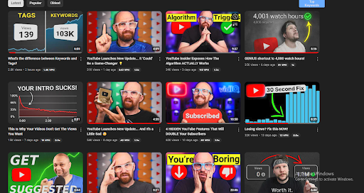

Title: YouTube Thumbnail Design Tips: Best Practices for 2025

URL Source: https://vidiq.com/blog/post/youtube-thumbnail-design-tips/

Published Time: 2025-08-28T15:13:42.000Z

Markdown Content:
Summary: Learn the top YouTube thumbnail design tips and best practices for 2025 to boost clicks, views, and channel growth.

When it comes to YouTube growth, thumbnails aren’t just an accessory—they’re one of the most important factors in whether someone clicks on your video. A strong design can dramatically improve your click-through rate and help your content stand out in a crowded feed. That’s why following proven YouTube thumbnail design tips is essential.

**Best Practices for Creating YouTube Thumbnails**
--------------------------------------------------

Let’s break down the YouTube thumbnail design best practices you should apply in 2025 and beyond.

#### **1. Simplicity is Key**

Your thumbnail needs to deliver a clear message in a split second. Overloading it with too many details, colors, or text can be overwhelming, especially when viewed on smaller screens like mobile phones. Stick to one focal point and keep the design clean. Minimalist thumbnails are often the most effective.

Stop Guessing. Start Growing.

Join 20M+ creators using vidIQ to get more views, subscribers, and success on YouTube.

[Create Your Free Account](https://vidiq.com/blog/post/youtube-thumbnail-design-tips/)

#### **2. Use Bold, Easy-to-Read Text**

Text on thumbnails can be incredibly effective—if done right. Use large, bold fonts that stand out against the background. Avoid cramming too many words; instead, aim for short, snappy phrases that intrigue viewers. Contrast is essential. If your background is dark, make sure your text is light, and vice versa.

#### **3. Choose High-Contrast Colors**

Your [thumbnail should immediately grab attention](https://vidiq.com/blog/post/youtube-thumbnails-5-expert-tips/), even when it’s displayed alongside hundreds of others. High-contrast color combinations make your thumbnail impossible to ignore. Try pairing complementary colors or using shades that stand out against YouTube’s default red, black, and white palette.

#### **4. Show Human Faces (with Emotions)**

Thumbnails that feature human faces—especially ones that show strong emotions—tend to get higher engagement. Whether it’s excitement, surprise, or curiosity, showing a human expression can create an instant connection with potential viewers.

#### **5. Be Consistent Across Your Channel**

One great trick for building brand recognition is to use a consistent style for all your thumbnails. This could include specific color schemes, text placement, or the use of your logo in a corner. Over time, viewers will come to recognize your videos at a glance, making it more likely they’ll click on your content.

For example, the vidIQ channel uses recurring styles across thumbnails, with faces, bold fonts, and clean layouts. This consistent branding helps viewers identify videos at a glance.

### **Common Mistakes to Avoid**

Even with great YouTube thumbnail design tips, there are pitfalls to watch out for:

*   **Misleading Clickbait:**Never use misleading images that have nothing to do with your video’s content. This will only frustrate viewers, hurt your channel’s reputation, and lead to a high bounce rate—something YouTube’s algorithm won’t like.
*   **Too Much Text:**You don’t want to clutter your thumbnail with unnecessary text. Keep it short and to the point. Let the title of your video do the talking, and use text on your thumbnail sparingly.
*   **Forgetting Mobile Viewers**: More than half of YouTube’s traffic comes from mobile devices, so always ensure your thumbnails are legible on small screens. If you’re adding text, make sure it’s large and bold enough to read easily on a smartphone.
*   **Low-Quality Images**: A blurry or pixelated thumbnail can significantly reduce your video’s chances of getting clicked. Always use high-resolution images, and if you’re unsure, err on the side of larger file sizes (up to 2MB) rather than sacrificing quality.

### **Tips for Testing and Optimizing Thumbnails**

Even the best designs need testing. YouTube lets you update thumbnails after publishing, so don’t be afraid to experiment.

*   **A/B Testing:**Try switching between different thumbnails on the same video and track their performance in YouTube Analytics. This way, you can identify which design drives more clicks.
*   **Analyze Your CTR:** Pay attention to the Click-Through Rate (CTR) of your videos. A higher CTR means more people are engaging with your content, which helps boost your visibility in YouTube’s algorithm.
*   **Track Viewer Behavior:** Beyond the CTR, also look at how long people are watching your video. If your audience is dropping off quickly after clicking, your thumbnail might not accurately represent your content.

[YouTube also has its own tool](https://vidiq.com/blog/post/youtube-launches-new-thumbnail-testing-tool/) for optimizing, testing, and comparing different thumbnail options for the same video by using the above metrics.

Remember: in 2025, 90% of top-performing YouTube videos still rely on custom thumbnails. Applying the latest YouTube thumbnail design tips 2025 can make the difference between a video that gets ignored and one that goes viral.

Nailing your thumbnails is one of the fastest ways to boost visibility, clicks, and subscribers. Whether you’re just starting or refining your strategy, sticking to these YouTube thumbnail design best practices will help your videos stand out on the platform.

[Now it’s time to create that killer thumbnail](https://vidiq.com/blog/post/choose-thumbnail-style-youtube/) and let your content shine!

FAQs
----

What are the best YouTube thumbnail design tips?
The best YouTube thumbnail design tips include keeping your design simple, using bold text, choosing high-contrast colors, and featuring human faces with strong emotions. Consistency across your channel also helps build recognition.

What are YouTube thumbnail design best practices in 2025?
YouTube thumbnail design best practices for 2025 focus on mobile readability, high-quality images, emotional storytelling, and testing multiple designs. Custom thumbnails remain critical for driving higher CTR.

What are the top YouTube thumbnail design tips for 2025?
Some of the top YouTube thumbnail design tips 2025 include using AI-powered thumbnail generators for faster testing, prioritizing bold visuals over text-heavy designs, and optimizing for both desktop and mobile audiences.

Blog Manager

In addition to being an avid movie and gaming enthusiast, Uttaran Samaddar is an experienced writer who has lent his creativity and unique perspective to various publications. He loves hearing and telling stories.
