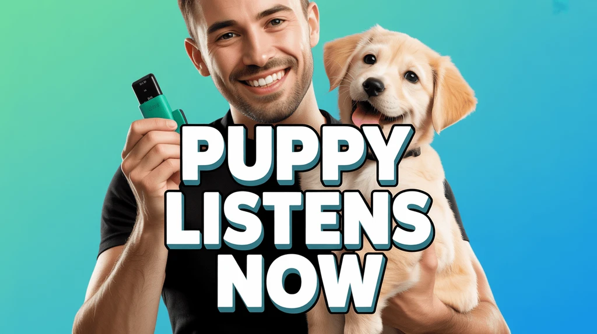
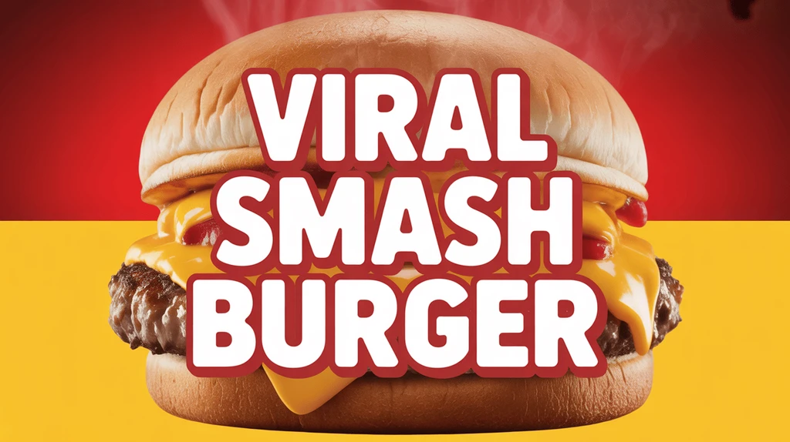
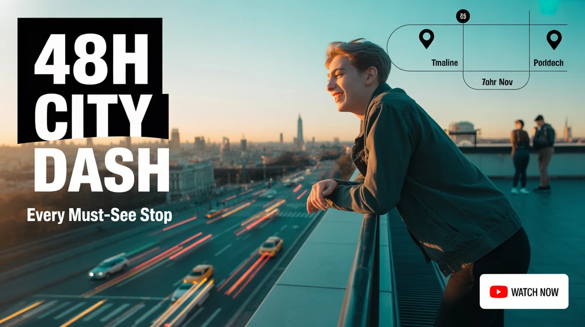
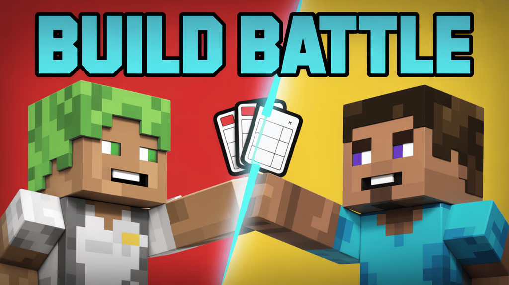
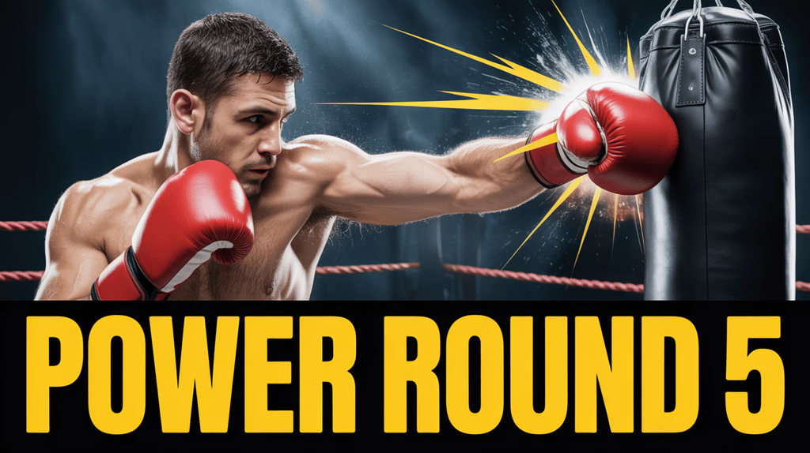
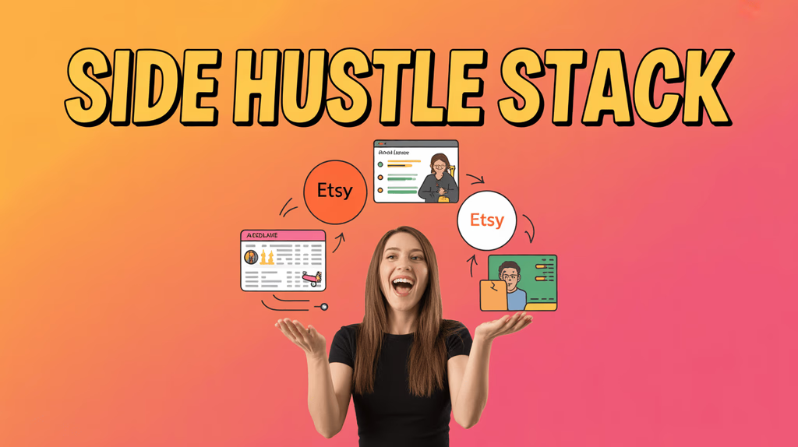
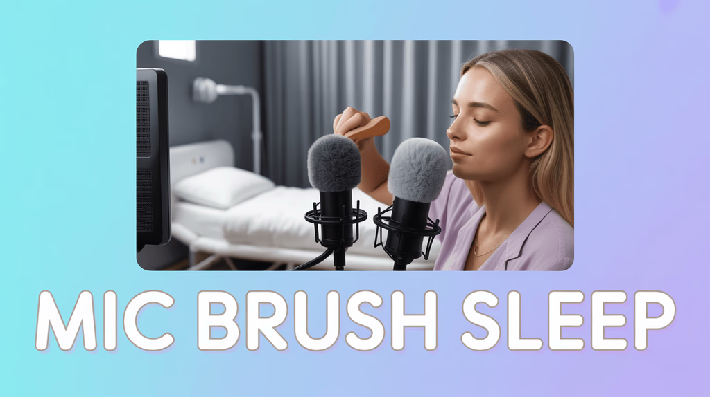
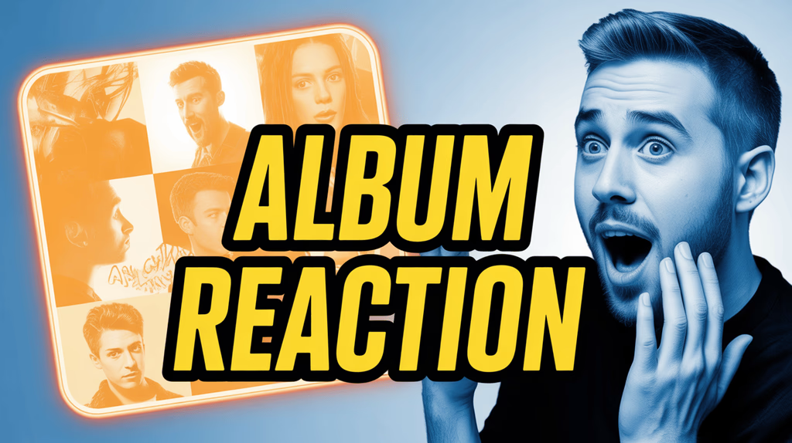

Key Takeaways（先读这 6 点）
- 先按“垂类/视频类型”选缩略图风格，再谈配色与字体：同一套模板放错赛道，点击动机会立刻跑偏。
- 缩略图的工作不是“把内容塞进去”，而是给观众一个清晰理由：这条视频点开能得到什么。
- 小频道更适合“模板化量产”：固定 2-3 套构图骨架（字体、留白、人物比例），把时间花在标题与内容承诺上。
- 文案越短越好：3-5 个词/短语就够，剩下交给画面（表情、主体、箭头/分屏）来讲。
- 你不需要每次从零设计：用 Alici.ai 的 Script→Thumbnail、URL Reference、One-Face，把“风格一致”变成自动化。
- 别做“误导式夸张”：缩略图上的承诺必须在视频里兑现，否则短期点击可能换来长期分发受限。

开篇 Reframe（为什么这是一篇“模板聚合页”）
很多人做缩略图的顺序是反的：先在 Canva/模板库里找“好看”，再硬把标题塞上去。结果常见两种失败：要么风格与垂类不匹配（观众没被戳中），要么信息密度太高（手机端读不出来）。

这篇文章的思路更简单：先按垂类锁定“观众点击动机”，再用对应的模板结构去表达。下面的 9 张 Alici 模板覆盖了最常见的频道类型，你可以把它当作一个小型“模板聚合页”：选对类型 → 换三样东西（文字、主体、背景）→ 立刻生成一组可测试的变体。

来源与归因（Source Attribution）
- 参考文章：Piktochart — “25 Amazing YouTube Thumbnail Examples & Ideas to Copy”，离线副本见 `sources/web-piktochart-youtube-thumbnail-examples/content.md`（原链接：https://piktochart.com/tips/youtube-thumbnail-examples/）。
- 说明：本文以该文章的“按类型看示例”的组织方式为起点，并结合 Alici.ai 自有模板进行扩写与方法论抽象；不基于无来源的数据进行 CTR/增长承诺。

目录
1. 先选垂类：3 分钟定位你的缩略图风格
2. Alici 9 个模板：按垂类拆解（每个给你“怎么改成你的版本”）
3. 一套可复制的制作流程：从脚本/标题到可测试的缩略图变体
4. 常见踩坑：模板选对了，为什么还是不想点？
5. Mini FAQ
6. Sources

## 1) 先选垂类：3 分钟定位你的缩略图风格
你可以把大多数视频分成三种“点击动机”：

- **结果型（Result-first）**：观众想先看到“结果/收益/结论”，再决定要不要看过程（常见于理财、副业、某些教程）。
- **过程型（Process-first）**：观众想知道“你怎么做到的”，缩略图要把过程的门槛降到最低（旅行攻略、城市路线、动手类教程）。
- **情绪型（Emotion-first）**：观众先被情绪/冲突/好奇吸引（反应视频、对战、游戏、宠物）。

确定动机后，再做一个更实用的选择题：
- **你是否露脸/有人物？**（人脸能把注意力抓得更稳，但不是必选）
- **主体是一件事还是多件事？**（单主体更适合小屏；多主体通常意味着“对比/清单/拼贴”）
- **你希望观众读到一句话就懂，还是愿意猜一下？**（新闻/教程更偏“一眼懂”；反应/对战可以留一点悬念）

下面进入模板库：你只要找到最接近你频道类型的一张图，然后照着改。

## 2) Alici 9 个模板：按垂类拆解（怎么改成你的版本）
> 提醒：每个模板我都会强调“只改三件事”。因为最容易翻车的不是不会做图，而是改太多导致风格失控。

### 2.1 宠物 / 萌宠（Pet, Cute）

这类内容的点击，通常靠“可爱 + 明确动作/结果”。你不需要复杂构图，一个干净背景、一个表情友好的主体、一句短促的动词短语就够了。

只改三件事：
1) **动词短语**：例如 “PUPPY LISTENS NOW / HE FINALLY DID IT / FIRST DAY HOME”
2) **主体关系**：宠物看镜头 vs 看主人（视线方向会改变“互动感”）
3) **背景颜色**：用纯色把主体抠出来，保证在小图里仍然“立体”

用 Alici.ai 怎么做：
- 用 **One-Face** 固定你的脸（如果你做的是“训练/日常 vlog”系列），缩略图会更像同一个频道。

### 2.2 美食 / 探店（Food, Recipe, Review）

美食的第一原则是“让人嘴馋”。所以这类模板把主体放大到几乎占满画面，再用强色块承载标题，观众在滑动时会先被“质感”抓住。

只改三件事：
1) **菜名/关键词**：例如 “SMASH BURGER / AIR FRYER WINGS / $5 RAMEN”
2) **镜头角度**：越近越有效，但别糊；油光、拉丝、蒸汽都是加分项
3) **背景对比**：红黄这类“食欲色”非常常见，但你也可以用黑底+高亮更高级

用 Alici.ai 怎么做：
- 你可以把视频脚本里的“爆点句”直接喂给 **Script→Thumbnail**，它更容易抓到那句“让人想尝一口”的文案。

### 2.3 旅行 / 城市攻略（Travel, City Guide）

旅行类不是越花越好，而是要像“可执行的路线卡片”。观众点开前想确认：你要带我去哪里？这条视频能省我多少时间？

只改三件事：
1) **时间/范围**：48H、3 DAYS、TOP 7 STOPS 这类词会把期待设得更清楚
2) **城市地标**：尽量用一眼能认出的场景（桥、塔、天际线）
3) **信息层级**：大标题负责“路线”，小字负责“收益”（Every Must-See Stop）

用 Alici.ai 怎么做：
- 用 **URL Reference** 贴一条你喜欢的旅行频道风格链接，生成更接近你目标审美的版本，再替换成你的城市素材。

### 2.4 游戏 / 对战挑战（Gaming, Challenge）

游戏类缩略图的核心是“冲突”。分屏、对比色、对角线切割，会天然制造一种“谁赢谁输”的张力。

只改三件事：
1) **对抗对象**：我 vs 你、旧装备 vs 新装备、两种打法对决
2) **冲突符号**：闪电/裂缝/VS（别堆太多，一个就够）
3) **标题动词**：BUILD / WIN / SURVIVE / SPEEDRUN 这种动词比形容词更有推动力

用 Alici.ai 怎么做：
- 如果你系列化做“对战”，用 One-Face 或固定角色比例，让观众一眼认出是你。

### 2.5 运动 / 格斗 / 高能瞬间（Sports, Action）

运动类点击，靠的是“正在发生”。动作定格比静态摆拍更有吸引力；冲击特效（击打、飞溅、速度线）会强化那个瞬间。

只改三件事：
1) **瞬间选择**：拳到的那一下、落地的那一下、表情变化的那一下
2) **回合/节点**：Round 5、Final、Overtime 这种词能把故事拉进来
3) **对比度**：动作主体要从背景里跳出来，别让画面灰成一片

用 Alici.ai 怎么做：
- 把你的视频标题 + 关键画面描述给 Script→Thumbnail，先生成 3 个“不同节点”的版本（Round 1/Final/KO），再挑最抓人的。

### 2.6 副业 / 赚钱方法（Side Hustle, Entrepreneurship）

副业类观众要的不是“概念”，而是“路径”。所以这类缩略图常见做法是：一个大标题给出方向，旁边用少量图标暗示平台/工具/流程。

只改三件事：
1) **结果表达**：Stack、Blueprint、System、Checklist 这类词会比 “Tips” 更像“可执行”
2) **平台线索**：只放 1-3 个最关键的平台/工具，不要变成杂货铺
3) **人物姿态**：指向/托起/对比（手势在小图里能当“箭头”用）

用 Alici.ai 怎么做：
- 用 One-Face 让你的“副业系列”长得一致；再用 URL Reference 对齐你喜欢的商业频道风格。

### 2.7 ASMR / 助眠（ASMR, Relax）

ASMR 的缩略图不需要“抢”，需要“安”。柔和背景、清晰主体、低压文字，会让观众在滑动时觉得“点开会舒服”。

只改三件事：
1) **触发词**：BRUSH、TAPPING、SLEEP、NO TALKING（观众是按触发词来点的）
2) **主体特写**：麦克风、刷子、手部动作要清晰
3) **色调**：避免高对比的撞色，冷暖都可以，但要统一

用 Alici.ai 怎么做：
- Script→Thumbnail 可以直接读你的视频标题与分段，把“触发词”放到最显眼的位置。

### 2.8 理财 / 投资（Finance, Trading）

理财类模板的力量来自“结果承诺 + 可信度暗示”。图表、箭头、百分比会迅速告诉观众“这是收益/增长相关”，人物表情让它更像一个故事。

只改三件事：
1) **数字表达**：百分比/金额/时间窗口（三者选一个，别全塞）
2) **图表形态**：K 线、柱状、曲线都行，但要一眼看懂“向上/向下”
3) **表情与指向**：惊讶、兴奋、质疑都可以，但要与标题一致

用 Alici.ai 怎么做：
- 更稳妥的做法是把数字写成“可验证的范围/阶段性目标”，避免夸张误导；Alici 可以一口气生成 5 个数字表达版本供你筛选。

### 2.9 反应 / 听歌反应（Reaction, Entertainment）

反应类是典型的“情绪驱动”。拼贴面板会暗示“你将看到一连串反应瞬间”，而夸张的表情负责把观众拉进来。

只改三件事：
1) **对象**：Album / MV / Artist（让观众立刻知道你在反应谁）
2) **情绪**：震惊、笑疯、起鸡皮疙瘩——选一个最真实的
3) **拼贴数量**：3-6 张小图足够，多了会糊；宁可少一点但清楚

用 Alici.ai 怎么做：
- One-Face 让你每次的“反应系列”保持同一个人设；再让工具自动生成不同的标题排版（粗描边/斜体/块状字）。

## 3) 一套可复制的制作流程：从脚本到可测试的缩略图变体
你不需要一次做“最完美”的缩略图，你需要的是一套能持续迭代的流程：

1) **先写一句“承诺句”**（它不是标题全文，只是你要兑现的那句话）
2) **选一个模板骨架**（上面 9 张里挑最像你垂类的）
3) **只做 3 个变体**（每个变体只动一个变量：文案 / 背景 / 主体）
4) **先用小屏自测**：把图缩到手机列表大小，你还能一眼读懂吗？
5) **上线后再学**：记录你换了什么、观众是否更愿意点、视频是否兑现承诺（这是下一次做图的资产）

如果你用 Alici.ai，流程可以更短：
- 把脚本/标题丢给 **Script→Thumbnail** 生成 3-5 张；
- 给一个你喜欢的频道链接用 **URL Reference** 贴近风格；
- 系列内容用 **One-Face** 固定人设，避免“每期像不同频道”。

你可以在这里开始： https://alici.ai/youtube-thumbnail

## 4) 常见踩坑：模板选对了，为什么还是不想点？
- **字太多**：你想说的越多，观众读到的越少。删到只剩 3-5 个词，反而更像“答案”。
- **元素都很大**：当所有东西都抢注意力时，等于没有重点。强制自己选一个主角（人脸/物体/数字）。
- **承诺不一致**：缩略图写“暴涨”，视频讲“基础入门”，观众会立刻退出；这比 CTR 更伤分发。
- **风格不稳定**：今天极简，明天杂志风，后天霓虹风。观众很难在推荐流里“认出你”。

## 5) Mini FAQ
**Q1：缩略图到底放多少字最合适？**  
大多数情况下 3-5 个词/短语就够。你可以把剩下的信息交给标题，让两者互补而不是重复。

**Q2：不露脸行不行？**  
可以。美食、旅行、教程都能靠主体与信息结构做得很好。露脸的价值在于“系列化识别”，不是必须。

**Q3：模板用久了会不会撞车？**  
不会。撞车通常来自“跟风同一个素材与同一句话”。模板只是结构，真正决定差异的是你的主体、承诺句与频道语气。

**Q4：可以用夸张数字吗？**  
可以用，但要可解释、可兑现。把数字写成你视频里真的会展示的内容（范围、时间段、对比对象），比“虚高”更能长期稳定。

## 6) Sources
- Piktochart — “25 Amazing YouTube Thumbnail Examples & Ideas to Copy”：https://piktochart.com/tips/youtube-thumbnail-examples/
