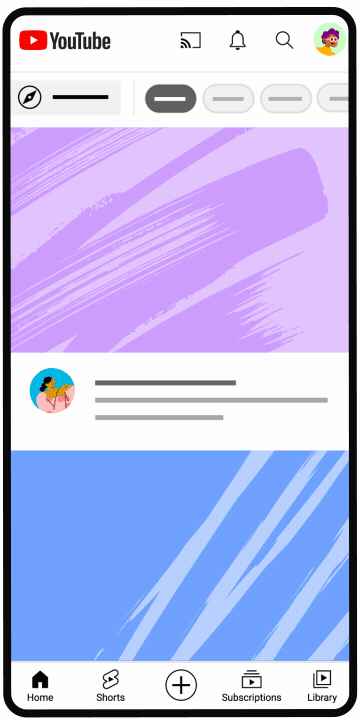

Title: Upload YouTube videos - Computer

URL Source: https://support.google.com/youtube/answer/57407

Markdown Content:
Upload YouTube videos - Computer - YouTube Help
===============
[Skip to main content](https://support.google.com/youtube/answer/57407#search-form)

[YouTube Help](https://support.google.com/youtube)

[Sign in](https://accounts.google.com/ServiceLogin?hl=en&passive=true&continue=http://support.google.com/youtube/answer/57407&ec=GAZAdQ)

[Google Help](https://support.google.com/)

[* Help Center](https://support.google.com/youtube/?hl=en)
    [* Fix a problem](https://support.google.com/youtube/topic/9257498?hl=en&ref_topic=3230811,3256124,)
    [* Watch videos](https://support.google.com/youtube/topic/9257500?hl=en&ref_topic=3230811,3256124,)
    [* Manage your account & settings](https://support.google.com/youtube/topic/9257107?hl=en&ref_topic=3230811,3256124,)
    [* Supervised experiences on YouTube](https://support.google.com/youtube/topic/10314939?hl=en&ref_topic=3230811,3256124,)
    [* YouTube Premium](https://support.google.com/youtube/topic/9257430?hl=en&ref_topic=3230811,3256124,)
    [* Create & grow your channel](https://support.google.com/youtube/topic/9257610?hl=en&ref_topic=3230811,3256124,)
    [* Monetize with the YouTube Partner Program](https://support.google.com/youtube/topic/9257986?hl=en&ref_topic=3230811,3256124,)
    [* Policy, safety, & copyright](https://support.google.com/youtube/topic/6151248?hl=en&ref_topic=3230811,3256124,)

[* Community](https://support.google.com/youtube/community?hl=en&help_center_link=CL_AAxIgVXBsb2FkIFlvdVR1YmUgdmlkZW9zIC0gQ29tcHV0ZXI)[* YouTube](https://www.youtube.com/)

[* Privacy Policy](https://www.google.com/intl/en/privacy.html)[* YouTube Terms of Service](http://youtube.com/t/terms)[* Submit feedback](https://support.google.com/youtube/answer/57407)

Send feedback on...

This help content & information 

General Help Center experience 

Next

*   [Help Center](https://support.google.com/youtube/?hl=en)
*   [Community](https://support.google.com/youtube/community?hl=en&help_center_link=CL_AAxIgVXBsb2FkIFlvdVR1YmUgdmlkZW9zIC0gQ29tcHV0ZXI)
*   [Creator Tips](https://support.google.com/youtube/announcements/11909013)

[YouTube](https://www.youtube.com/)

*   [Fix a problem](https://support.google.com/youtube/answer/57407)[Troubleshoot problems playing videos](https://support.google.com/youtube/topic/9257404?hl=en&ref_topic=9257498,3230811,3256124,)[Troubleshoot account issues](https://support.google.com/youtube/topic/3024171?hl=en&ref_topic=9257498,3230811,3256124,)[Fix upload problems](https://support.google.com/youtube/topic/2888603?hl=en&ref_topic=9257498,3230811,3256124,)[Fix YouTube Premium membership issues](https://support.google.com/youtube/topic/9257117?hl=en&ref_topic=9257498,3230811,3256124,)[Get help with the YouTube Partner Program](https://support.google.com/youtube/topic/9153641?hl=en&ref_topic=9257498,3230811,3256124,)[Learn about recent updates on YouTube](https://support.google.com/youtube/topic/13401449?hl=en&ref_topic=9257498,3230811,3256124,)[Get help with YouTube](https://support.google.com/youtube/topic/13343244?hl=en&ref_topic=9257498,3230811,3256124,) 
*   [Watch videos](https://support.google.com/youtube/answer/57407)[Find videos to watch](https://support.google.com/youtube/topic/9257408?hl=en&ref_topic=9257500,3230811,3256124,)[Change video settings](https://support.google.com/youtube/topic/9257502?hl=en&ref_topic=9257500,3230811,3256124,)[Watch videos on different devices](https://support.google.com/youtube/topic/9257096?hl=en&ref_topic=9257500,3230811,3256124,)[Comment, subscribe, & connect with creators](https://support.google.com/youtube/topic/9257418?hl=en&ref_topic=9257500,3230811,3256124,)[Save or share videos & playlists](https://support.google.com/youtube/topic/9257423?hl=en&ref_topic=9257500,3230811,3256124,)[Troubleshoot problems playing videos](https://support.google.com/youtube/topic/9257404?hl=en&ref_topic=9257500,3230811,3256124,)[Purchase & manage movies, TV shows & products on YouTube](https://support.google.com/youtube/topic/9257105?hl=en&ref_topic=9257500,3230811,3256124,) 
*   [Manage your account & settings](https://support.google.com/youtube/answer/57407)[Sign up and manage your account](https://support.google.com/youtube/topic/9267757?hl=en&ref_topic=9257107,3230811,3256124,)[Manage account settings](https://support.google.com/youtube/topic/9257108?hl=en&ref_topic=9257107,3230811,3256124,)[Manage privacy settings](https://support.google.com/youtube/topic/9257518?hl=en&ref_topic=9257107,3230811,3256124,)[Manage ad settings](https://support.google.com/youtube/topic/15848873?hl=en&ref_topic=9257107,3230811,3256124,)[Manage accessibility settings](https://support.google.com/youtube/topic/9257112?hl=en&ref_topic=9257107,3230811,3256124,)[Troubleshoot account issues](https://support.google.com/youtube/topic/3024171?hl=en&ref_topic=9257107,3230811,3256124,)[YouTube updates](https://support.google.com/youtube/topic/13401752?hl=en&ref_topic=9257107,3230811,3256124,) 
*   [Supervised experiences on YouTube](https://support.google.com/youtube/answer/57407)[Supervised experiences for pre-teens](https://support.google.com/youtube/topic/15279060?hl=en&ref_topic=10314939,3230811,3256124,)[Supervised experiences for teens](https://support.google.com/youtube/topic/15279671?hl=en&ref_topic=10314939,3230811,3256124,) 
*   [YouTube Premium](https://support.google.com/youtube/answer/57407)[Join YouTube Premium](https://support.google.com/youtube/topic/12155486?hl=en&ref_topic=9257430,3230811,3256124,)[Learn about YouTube Premium benefits](https://support.google.com/youtube/topic/9257431?hl=en&ref_topic=9257430,3230811,3256124,)[Manage your Premium membership](https://support.google.com/youtube/topic/9257116?hl=en&ref_topic=9257430,3230811,3256124,)[Manage Premium billing](https://support.google.com/youtube/topic/9516474?hl=en&ref_topic=9257430,3230811,3256124,)[Fix YouTube Premium membership issues](https://support.google.com/youtube/topic/9257117?hl=en&ref_topic=9257430,3230811,3256124,)[Troubleshoot billing & charge issues](https://support.google.com/youtube/topic/9995067?hl=en&ref_topic=9257430,3230811,3256124,)[Request a refund for YouTube paid products](https://support.google.com/youtube/topic/12013284?hl=en&ref_topic=9257430,3230811,3256124,) 
*   [Create & grow your channel](https://support.google.com/youtube/answer/57407)[Upload videos](https://support.google.com/youtube/topic/16547?hl=en&ref_topic=9257610,3230811,3256124,)[Edit videos & video settings](https://support.google.com/youtube/topic/9257530?hl=en&ref_topic=9257610,3230811,3256124,)[Create Shorts](https://support.google.com/youtube/topic/10343432?hl=en&ref_topic=9257610,3230811,3256124,)[Edit videos with YouTube Create](https://support.google.com/youtube/topic/13521391?hl=en&ref_topic=9257610,3230811,3256124,)[Customize & manage your channel](https://support.google.com/youtube/topic/9257786?hl=en&ref_topic=9257610,3230811,3256124,)[Analyze performance with analytics](https://support.google.com/youtube/topic/9257532?hl=en&ref_topic=9257610,3230811,3256124,)[Translate videos, subtitles, & captions](https://support.google.com/youtube/topic/9257536?hl=en&ref_topic=9257610,3230811,3256124,)[Manage your posts & comments](https://support.google.com/youtube/topic/9257889?hl=en&ref_topic=9257610,3230811,3256124,)[Live stream on YouTube](https://support.google.com/youtube/topic/9257891?hl=en&ref_topic=9257610,3230811,3256124,)[YouTube Creator Community](https://support.google.com/youtube/topic/12182592?hl=en&ref_topic=9257610,3230811,3256124,)[Become a podcast creator on YouTube](https://support.google.com/youtube/topic/12751231?hl=en&ref_topic=9257610,3230811,3256124,)[Creator and Studio App updates](https://support.google.com/youtube/topic/13401855?hl=en&ref_topic=9257610,3230811,3256124,) 
*   [Monetize with the YouTube Partner Program](https://support.google.com/youtube/answer/57407)[YouTube Partner Program](https://support.google.com/youtube/topic/9153567?hl=en&ref_topic=9257986,3230811,3256124,)[Make money on YouTube](https://support.google.com/youtube/topic/9240125?hl=en&ref_topic=9257986,3230811,3256124,)[Get paid](https://support.google.com/youtube/topic/11407695?hl=en&ref_topic=9257986,3230811,3256124,)[Understand ads and related policies](https://support.google.com/youtube/topic/9257894?hl=en&ref_topic=9257986,3230811,3256124,)[Get help with the YouTube Partner Program](https://support.google.com/youtube/topic/9153641?hl=en&ref_topic=9257986,3230811,3256124,)[YouTube for Content Managers](https://support.google.com/youtube/topic/9153648?hl=en&ref_topic=9257986,3230811,3256124,) 
*   [Policy, safety, & copyright](https://support.google.com/youtube/answer/57407)[YouTube policies](https://support.google.com/youtube/topic/2803176?hl=en&ref_topic=6151248,3230811,3256124,)[Reporting and enforcement](https://support.google.com/youtube/topic/2803138?hl=en&ref_topic=6151248,3230811,3256124,)[Privacy and safety center](https://support.google.com/youtube/topic/2803240?hl=en&ref_topic=6151248,3230811,3256124,)[Copyright and rights management](https://support.google.com/youtube/topic/2676339?hl=en&ref_topic=6151248,3230811,3256124,) 

*   [Upload videos](https://support.google.com/youtube/topic/16547?hl=en&ref_topic=9257610)
*   [Upload YouTube videos](https://support.google.com/youtube/answer/57407)

Upload YouTube videos
=====================

You can upload videos to YouTube in a few easy steps. Use the instructions below to upload your videos from a computer or mobile device.

**Note:**Uploading may not be available with [supervised experiences](https://support.google.com/youtube/answer/10314940) on YouTube.

[How To Upload Videos with YouTube Studio](https://www.youtube.com/watch?v=y9Dk6wMc8UM)

 Subscribe to the [YouTube Creators channel](https://www.youtube.com/channel/UCkRfArvrzheW2E7b6SVT7vQ)for the latest news, updates, and tips.

Upload videos in YouTube Studio
----------------------------------------------------------------------------------

1.   Sign in to [YouTube Studio](https://studio.youtube.com/).
2.   In the top-right corner, click**CREATE****Upload videos**.
3.   Select the file you’d like to upload. 
    *   You can upload up to 15 videos at a time.
    *   Be sure to click Edit  on each file to edit your video [details](https://support.google.com/youtube/answer/57407#details).

**Note:**
*   **Video resolution:** Your video will be converted to the highest resolution available to ensure successful playback on different devices and networks. Learn more about[video resolution and aspect ratios](https://support.google.com/youtube/answer/6375112).
*   **Processing time:**You can view the estimated processing time for SD, HD, and 4K videos. Higher qualities such as 4K or HD may take more time to process. Video processing time can depend on a number of factors including quality, video length, video format, and traffic. For optimal processing time, [verify your YouTube account](https://support.google.com/youtube/answer/171664).
*   **Privacy setting:** If you close the upload window before you finish choosing your [Visibility](https://support.google.com/youtube/answer/57407#visibility) settings, your video will be saved as [private](https://support.google.com/youtube/answer/157177#private) on your [Content](https://youtube.com/my_videos) page in YouTube Studio.

If you're having issues with uploading videos, check out our [common uploading errors](https://support.google.com/youtube/answer/10383400) guide.

[Details](https://support.google.com/youtube/answer/57407)

Add important details to your video. **Note:** You can click **REUSE DETAILS**to copy select details from a previously uploaded video. 

Title The title of your video.

Note: Video titles have a character limit of 100 characters and cannot include invalid characters.
Description Info that shows below your video. For video attributions, use the following format: [Channel Name] [Video Title] [Video ID]

For corrections in your video, add “Correction:” or “Corrections:” Correction or Corrections must be in English regardless of the language of the video or the rest of the description. On a separate line, you can add the timestamp and explanation of your correction. For example:

Correction:

0:35 Reason for correction

This section should appear after any video chapters. When your audience watches your video, a **View Corrections** info card will appear.

For formatted text in your descriptions, select bold, italicize, or strikethrough from the options at the bottom of the description box.

Video descriptions have a character limit of 5,000 characters and cannot include invalid characters.

**Note:** If the channel has any active strikes, or if the content may be inappropriate to some viewers, the corrections feature won't be available.
[Thumbnail](https://support.google.com/youtube/answer/72431)The image viewers will view before choosing your video.
[Playlist](https://support.google.com/youtube/answer/10232933)Add your video to one of your existing playlists, or create a playlist.
[Audience](https://support.google.com/youtube/answer/9527654)To comply with the Children’s Online Privacy Protection Act (COPPA), you’re required to tell us whether your videos are made for kids.
[Age restriction](https://support.google.com/youtube/answer/2950063)Age-restrict videos that may not be appropriate for certain audiences.
Related Video A video from your channel that appears as a [link](https://support.google.com/youtube/answer/13748639) in the Shorts player to help direct viewers from your Shorts to your other YouTube content.

With [advanced feature access](https://support.google.com/youtube/answer/9890437), you can edit Shorts to include a link to a video from your channel. Videos, Shorts and Live content can be linked.

 Note: The video you select has to be public or unlisted and must follow our [Community Guidelines](https://support.google.com/youtube/answer/9288567).

At the bottom of the Details page, select **SHOW MORE** to choose your advanced settings.

[Paid promotion](https://support.google.com/youtube/answer/154235)Let viewers and YouTube know that your video has a paid promotion.
Altered content To follow YouTube’s policy, you’re required to tell us if your content is altered or synthetic and seems real. [Learn more on how to disclose use of altered or synthetic content](https://support.google.com/youtube/answer/14328491?hl=en).
[Automatic chapters](https://support.google.com/youtube/answer/9884579)You can add video chapter titles and timestamps to your videos to make them easier to watch. You can [create your own video chapters](https://support.google.com/youtube/answer/9884579) or use the automatically generated chapters by checking the 'Allow automatic chapters (when available and eligible)' checkbox.

Any video chapters entered will override auto generated video chapters.
Featured places Featured places (when available and eligible) uses destinations you have prominently highlighted in your description, video transcript and video frames to highlight key places in the description of your video or in the Shorts Player. To opt out of automatic Featured places, unselect the 'Allow automatic Featured places' checkbox. **Note:** Featured places doesn’t use your device location data or affect what ads are shown in your video (if you’re monetizing).
[Tags](https://support.google.com/youtube/answer/146402)Add descriptive keywords to help correct search mistakes.

Tags can be useful if the content of your video is commonly misspelled. Otherwise, tags play a minimal role in your video's discovery.
[Language](https://support.google.com/youtube/answer/6304325) and caption certification Choose the original video language and caption certification.
Recording date and location Enter the date the video was recorded and the location where your video was filmed.
[License](https://support.google.com/youtube/answer/2797468) and [distribution](https://support.google.com/youtube/answer/2453875)Select if your video can be embedded on a different website. Indicate if you’d like to send notifications to your subscribers for your new video.
[Shorts remixing](https://support.google.com/youtube/answer/10623810#opt-out)Allow others to create Shorts using the audio of your video.
Category Select a category so viewers can find your video more easily. For Education, you can choose the following options:

*   **Type:** Select activity, concept overview, how-to, lecture, problem walkthrough, real life application, science experiment, tips, or other as your education type.
*   **Problems:**Add the timestamp and the question that is answered in your video.**Note:**this option is only available for the problem walkthrough education type.
*   **Academic system:** Select the country/region that your video aligns to. This allows you to further specify the level and exam, course, or academic standard. **Note:** This may be automatically selected based on your channel’s default country/region.
*   **Level:** Choose the level for your video, such as Grade 9 or advanced.
*   **Exam, course, or standard:**Search our database to add an academic standard, exam, or course that relates to your video.
[Comments](https://support.google.com/youtube/answer/4409780) and ratings Choose whether viewers can leave comments on the video. Choose whether viewers can find how many likes are on your video.
[Visibility](https://support.google.com/youtube/answer/157177)Choose the privacy settings of your video to control where your video can appear and who can watch it.
[Subtitles and captions](https://support.google.com/youtube/answer/2734796)Add subtitles and captions to your video to reach a broader audience.
[End screen](https://support.google.com/youtube/answer/6388789)Add visual elements to the end of your video. Your video must be 25 seconds or longer to add an end screen.
[Cards](https://support.google.com/youtube/answer/6140493)Add interactive content to your video.

[Monetization](https://support.google.com/youtube/answer/57407)

If you're in the [YouTube Partner Program](https://support.google.com/youtube/answer/72851), you can 
*   Turn monetization on or off for your video
*   Choose your [advertising format](https://support.google.com/youtube/answer/2467968)
*   Manage [mid-roll ad breaks](https://support.google.com/youtube/answer/6175006)

[Ad suitability](https://support.google.com/youtube/answer/57407)

If you're in the [YouTube Partner Program](https://support.google.com/youtube/answer/72851), you can use the Ad suitability page to rate your videos against our [advertiser-friendly content guidelines](https://support.google.com/youtube/answer/6162278). This action helps us make monetization decisions faster and accurately. Learn more about [self-certification](https://support.google.com/youtube/answer/7687980).

[Copyright & Ad-Suitability "Checks" in Upload Flow: Address Issues Before Your Video Goes Public](https://www.youtube.com/watch?v=-wymgcEJWyM)

[Video elements](https://support.google.com/youtube/answer/57407)

Add cards and end screens to show your audience related videos, websites, and calls to action.

**[Subtitles and captions](https://support.google.com/youtube/answer/2734796)**Add subtitles and captions to your video and reach a broader audience.
**[End screen](https://support.google.com/youtube/answer/6388789)**Add visual elements to the end of your video. Your video must be 25 seconds or longer to add an end screen.
**[Cards](https://support.google.com/youtube/answer/6140493)**Add interactive content to your video.

[Checks](https://support.google.com/youtube/answer/57407)

Use the **Checks** page to screen your video for [copyright issues](https://support.google.com/youtube/answer/6013276). Checks help you fix issues before your video is published.

The Copyright check searches for copyrighted content in your video. If issues are found, you can [remove the claimed content](https://support.google.com/youtube/answer/2902117) from your video or choose to [dispute a claim](https://support.google.com/youtube/answer/2797454).

Checks can take some time, but they run in the background, so you can return to the process later. You can also publish your video while checks are running and fix issues later.

Keep in mind that **Copyright check results aren’t final**. For example, future [manual Content ID claims](https://support.google.com/youtube/answer/9374251), [copyright strikes](https://support.google.com/youtube/answer/2814000), and [edits to your video settings](https://support.google.com/youtube/answer/57404) may impact your video.

**Note:** During the Checks step, [Likeness detection](https://support.google.com/youtube/answer/16440338) will also run in the background. Likeness detection does a one-time scan of your video for enrolled creators’ faces that may have been altered or AI-generated. These checks will not restrict your video’s visibility, but your video may be removed later if it violates our policies. Learn more about [Likeness detection on YouTube](https://support.google.com/youtube/answer/16440338).

[Visibility](https://support.google.com/youtube/answer/57407)

On the **Visibility** page, choose when you want your video to publish and who you want to find your video. You can also share your video privately.

**Note:** The default video privacy setting for creators aged 13–17 is **private**. If you’re 18 or older, your default video privacy setting is set to **public**.

*   **Save or publish:**To publish your video now, choose this option and select **Private**, **Unlisted**, or **Public** as your video’s [privacy setting](https://support.google.com/youtube/answer/157177#privacy_settings). If you choose to make your video public, you can also set your video as an instant [Premiere](https://support.google.com/youtube/answer/9080341). 
    *   Your video can be published once SD processing is complete.
    *   For creators aged 13–17, you can save your visibility setting for next time by checking the box “Remember this setting for next upload.

*   **Schedule:**To publish your video later, choose this option and select the date you want your video to be published. Your video will be private until that date. You can also set your video as a [Premiere](https://support.google.com/youtube/answer/9080341). Learn more about [scheduling video publish times](https://support.google.com/youtube/answer/1270709).

Preview your changes and make sure they follow [YouTube policies](https://support.google.com/youtube/topic/2803176), then click **SAVE**.

**Note:** If your account has a [Community Guidelines strike](https://support.google.com/youtube/answer/2802032), your scheduled video won't be published during the penalty period. Your video is set to [private](https://support.google.com/youtube/answer/157177#private) for the penalty period duration and you have to reschedule publishing the video when the penalty period ends.

Get [video upload tips](https://support.google.com/youtube/answer/11913617) for creators.

Learn more about uploading videos
------------------------------------------------------------------------------------

[How many videos you can upload per day](https://support.google.com/youtube/answer/57407)

There's a limit to how many videos a channel can upload each day across desktop, mobile, and [YouTube API](https://developers.google.com/youtube/v3/guides/uploading_a_video). To increase your daily limit, visit[this article](https://support.google.com/youtube/answer/9890437).

[Upload audio files](https://support.google.com/youtube/answer/57407)

You can’t upload audio files to create a YouTube video. Here is a list of [supported file formats](https://support.google.com/youtube/troubleshooter/2888402) for content that can be uploaded to YouTube.

To add your content to YouTube, try converting your audio file to a video file by adding an image. YouTube doesn’t have a tool to upload audio files, but you can try other [video editing software](https://en.wikipedia.org/wiki/List_of_video_editing_software).

[Learn the difference between “upload” and “publish”](https://support.google.com/youtube/answer/57407)

When you **upload** a video, the video file is imported to YouTube.

When you **publish** a video, the video is made available for anyone to watch.

[Upload vertical videos](https://support.google.com/youtube/answer/57407)

When you upload and publish your video, YouTube will figure out the best way to display the content. For the best experience, don’t add black bars to the sides of your vertical video. Whether the video is vertical, square, or horizontal, the video will fit the screen.

[Figure out why your video’s upload date and publish date are different](https://support.google.com/youtube/answer/57407)

*   **Upload date:** The date you uploaded your video. Shows next to your private or unlisted video on your [Content page](https://www.youtube.com/my_videos).
*   **Publish date:** The date your video became public. Shows beneath your live video and is set to Pacific Standard Time (PST).

These two dates can be different if you uploaded your video as private or unlisted, and made it public later.

**Tip:** You can [schedule your video to be published](https://support.google.com/youtube/answer/1270709) at a specific time.

Was this helpful?
-----------------

How can we improve it?

Yes No

Submit

[Computer](https://support.google.com/youtube/answer/57407?co=GENIE.Platform%3DDesktop)[Android](https://support.google.com/youtube/answer/57407?co=GENIE.Platform%3DAndroid)[iPhone & iPad](https://support.google.com/youtube/answer/57407?co=GENIE.Platform%3DiOS)

Need more help?
---------------

### Try these next steps:

[Post to the help community Get answers from community members](https://support.google.com/youtube/community?hl=en&help_center_link=CL_AAxIgVXBsb2FkIFlvdVR1YmUgdmlkZW9zIC0gQ29tcHV0ZXI)

true

[Upload videos](https://support.google.com/youtube/topic/16547?hl=en&ref_topic=9257610)
---------------------------------------------------------------------------------------

*   1 of 4 [Upload YouTube videos](https://support.google.com/youtube/answer/57407#)
*   2 of 4 [Upload videos longer than 15 minutes](https://support.google.com/youtube/answer/71673?hl=en&ref_topic=9257439)
*   3 of 4 [Upload High Dynamic Range (HDR) videos](https://support.google.com/youtube/answer/7126552?hl=en&ref_topic=9257439)
*   4 of 4 [Record & upload a video](https://support.google.com/youtube/answer/57409?hl=en&ref_topic=9257439)

*    ©2026 Google 
*   [Privacy Policy](https://www.google.com/intl/en/privacy.html)
*   [YouTube Terms of Service](http://youtube.com/t/terms)

 Language  

Enable Dark Mode

Send feedback on...

This help content & information General Help Center experience

Search

Clear search

Close search

Google apps

Main menu

6593306705619831157

true

Search Help Center

false

true

true

true

true

true

59

false

false

false

false
