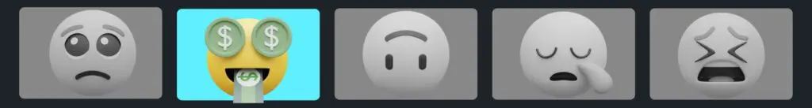
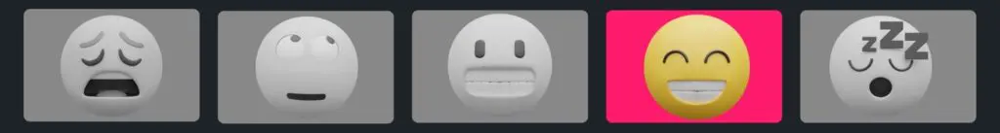

Title: 11 killer YouTube thumbnail tips s̶t̶o̶l̶e̶n̶ f̶r̶o̶m̶ inspired by big creators

URL Source: https://www.tubebuddy.com/blog/11-youtube-thumbnail-tips-from-big-creators/

Published Time: 2024-12-18T19:50:28+00:00

Markdown Content:
A killer YouTube thumbnail can make the difference between your content flying or dying.What YouTube thumbnail tips can we ~~steal~~~~borrow~~ learn from top creators?

With millions of content creators vying for attention, you need thumbnails that stand out whether your viewer is watching on their TV, laptop, tablet, or smartphone. Effective YouTube thumbnails grab attention. They tell would-be viewers what they’re in for and compel them to click.

It’d be hard to overstate just how important thumbnails are. Thumbnails are [key to growing on YouTube](https://www.tubebuddy.com/blog/a-b-testing-youtube-ctr/), meeting and exceeding the 4,000 YouTube watch hours and the 1,000 YouTube subscribers required to get into the YouTube Partner Program.

So what’s a creator to do? Well, let’s start by taking inspiration from these 11 attention-grabbing thumbnail design hacks from some of the top YouTube creators.

11 Thumbnail Design Tips Top Creators Use on YouTube
----------------------------------------------------

### 1. Attention jacking: use bright colors to grab attention

Bright, contrasting colors are your allies in the thumbnail game. They make your video pop among a sea of samesies, improving your click-through rate (CTR) and boosting watch time.

Remember, your thumbnail is competing with dozens of others on a viewer’s screen. Make yours the easy choice.

### 2. Make it crispy: low-resolution images need not apply

Quality matters. High-resolution, crisp images just look better. They’re more professional and give your videos instant credibility. Don’t use a low-quality from your video. Plan a photo session each time you shoot a video. Feel free to bust out the pro gear but a smartphone pic is fine too.

### 3. Deliver the feeling: make an emotional connection with thumbnails

People [respond to human faces](https://www.sciencedirect.com/science/article/pii/S2451958823000167). It’s biology. Emotionally resonant thumbnails, especially those with close-up shots of faces, create a direct connection with viewers. They convey the mood of your video and spark curiosity. Tools like [TubeBuddy](https://www.tubebuddy.com/) can help you analyze which emotions work best for your audience.

### 4. Less is more: go minimal with text

For YouTube thumbnails that evoke a response (i.e. a click), the less text, the better. Use concise, punchy text to complement your video’s title and add context to your image. Opt for scroll-stopping words. Numbers, especially currency, work too.

### 5. Build your brand: be consistent with your YouTube thumbnails

Your thumbnails should be as unique as your content, but they need to be consistent too. Viewers should _know_ when they see one of your thumbnails. Choose a font, pick a color palette, include a logo, and be consistent (there’s that word again).

Your thumbnails are part of your brand as a creator. Your goal is to build a brand reputation.

### 6. Before and after: add contrast to your thumbnails

Add contrasting elements to your thumbnails to create curiosity. Before and after is probably the most obvious example of this contrast but it’s not the only one: how it started / how it’s going, with / without, pre / post are others,. Whether it’s a fitness journey, a recipe, a room makeover, or whatever, finding a contrast invites viewers to discover the story behind the change.

### 7. Worth 1,000 words: tell a story with your graphics

Graphics can communicate complex ideas quickly and effectively, often better than words. They’re particularly useful for videos where visual representation can intrigue viewers, like sports or tech reviews.

### 8. Action: Freeze a key moment

Action shots are great for grabbing attention. Create a thumbnail that freezes a key moment of the action, whatever the action is. As with all thumbnails, you need to ensure your teaser accurately represents your content. The last thing you want is to see your video being seen as clickbait. Authenticity is key to retaining viewer trust.

### 9. Try, try again: test thumbnail variations

Try different thumbnail styles until you find your groove. [A/B test YouTube thumbnail](https://www.tubebuddy.com/tools/youtube-thumbnail-test/) variations to see which one gets the most traction. Take the lesson to heart and test, test again.

### 10. On the big/small screen: optimize for TV + mobile

With a significant portion of YouTube’s viewership coming from mobile and TV, your thumbnails need to look great on all screens. Check how your thumbnails appear on different devices to for maximum impact. This can be as simple as zooming way out in your image editor to ensure your thumbnail works at smaller sizes.

### 11. Always be learning: keep an eye on the trends

Finally, keep an eye on what’s trending in your niche. Analyze successful thumbnails for their color schemes, branding, and style. Take this as inspiration for how you can improve your own content as you settle into your unique brand and style.

> What makes a great YouTube thumbnail is equal parts art and science. Use these 11 YouTube thumbnail design tips as you create thumbnails that stand out in a sea of options vying for the viewer’s time and attention.
> 
> 
> Develop your own style and brand so that your audience will recognize and engage with your videos. Experiment, improve, and remember: a great thumbnail is like a billboard for your video; make it count.

### Get an unfair advantage on YouTube

Give your YouTube channel the upper hand and easily optimize for more views, more subs, and more of every metric that matters.

[get started](https://www.tubebuddy.com/pricing?utm_source=site&utm_medium=blog&utm_campaign=blog-cta&utm_id=standard-cta)
YouTube thumbnail tips video transcript
---------------------------------------

[00:00](https://www.youtube.com/watch?v=undefined&t=0s)

I’m going to share with you 11 thumbnail design hacks some of the top creators on YouTube are using right now to Skyrocket their growth on YouTube when it comes to thumbnails your CTR or click-through rate matters a lot CTR is a metric that measures the amount of people who clicked on your thumbnail based on the amount of people it was shown to for example if you have a CTR of 7% that means out of 100 people it was shown to seven of them clicked on it the average CTR on YouTube is between 2 and 10% and the best creators are getting above the average and you can too.

[00:33](https://www.youtube.com/watch?v=undefined&t=33s)

If you have a low percentage let’s be honest you have a boring thumbnail and that won’t get views if you have a high one that’s where the magic lies and that’s where you can get more views make more money and start to grow your channel let’s dive in first bright gets it right dark misses the mark bright and contrasting colors on your thumbnails are a great strategy to draw people’s attention let’s compare these two videos which one would you want to to click on the one on

[01:01](https://www.youtube.com/watch?v=undefined&t=61s)

the left or the one on the right using contrasting colors and vibrant colors help draw the viewer’s eye to your thumbnail remember your thumbnail gets placed amongst dozens of other thumbnails having a great thumbnail that stands out makes your video the easy option to click on HD is key high quality images are crucial having crisp high resolution images ensure that thumbnails look clean and professional this thumbnail is clean and crisp and psychologically what’s happening is it’s communicating to the audience that this

[01:34](https://www.youtube.com/watch?v=undefined&t=94s)

is a good thumbnail it looks great I got to watch this the best way to capture high quality images for your thumbnails is using your phone or a camera to capture the best photo possible not using a still image from your video that’s lower quality close-ups using close-up shots of faces showing strong emotions to create a personal and emotional connection is a great strategy for creating thumbnails I even use Tu budy on this channel on my channel to see which which thumbnails are resonating best with the audience what

[02:02](https://www.youtube.com/watch?v=undefined&t=122s)

emotions I’m using in my thumbnails whether I show my face or not that way I can get data to know what to do next close-ups like this psychologically communicate to the viewer the emotion in the video why is he shocked is he happy at what he’s looking at it makes you want to find out what’s going on another example here is great this makes me curious as to why he’s even sitting in a shopping cart and if he’s going to be okay here and why are the shelves so empty and did it get this bad the video

[02:31](https://www.youtube.com/watch?v=undefined&t=151s)

the less the better that is with the text you use on your thumbnails minimal text is always the goal using minimal but impactful text to convey the message of the video without cluttering the thumbnail and distracting the audience is exactly what you want to aim for this thumbnail here uses little words and allows for the text to support the title of the video along with communicating a message in the photo itself this thumbnail gets me curious because it’s saying if he quit his 9 to5 and made billions how do he do it I need to know

[03:01](https://www.youtube.com/watch?v=undefined&t=181s)

he’s clearly flying on a private plane so it must be true having the look this one is underrated and highly overlooked that’s why I call it having the look because if you look at the channel That I just showed you if you scroll through Noah’s thumbnails they follow a certain style and they all look alike GQ Sports does this as well they follow this with their series on 10 things blank can’t live without the background of their thumbnail is the exact same design every time and you begin to become familiar

[03:30](https://www.youtube.com/watch?v=undefined&t=210s)

with it psychologically this builds familiarity with the audience and they begin to know what your thumbnails look like and they can recognize your videos just by the thumbnail alone I look at these videos and I already know what they’re about because I see them so often when I just scroll on YouTube having consistent fonts colors and logos are key so your audience can establish a consistent brand and identity with your thumbnails before and afters before and afters create a massive amount of curiosity for the audience to want to

[03:58](https://www.youtube.com/watch?v=undefined&t=238s)

click showing a transform or comparison using before and afters is great this is one of my favorite channels on YouTube gravity transformation they do a great job of showing before and after thumbnails by showing a situation on the left side and a different version on the right and you’ll notice they incorporate The Branding component in there as well like we just talked about keep in mind you don’t have to just be a finish Channel you can show before and afters with anything whether it’s a new desk

[04:24](https://www.youtube.com/watch?v=undefined&t=264s)

setup a new room setup a home renovation a recipe the possibilities are endless here’s a key tip if you are making before and after thumbnails pay attention I know this may sound obvious on the left hand side that is the before and on the right that is the after I see so many channels mixing this up and it’s confusing to the audience massive error do not do this use Graphics eye-catching Graphics are a unique way to communicate to the audience what is happening without using any words take this one for example I personally am a massive

[04:57](https://www.youtube.com/watch?v=undefined&t=297s)

football fan and I’ve never seen this video before when I I saw it roll across my feet I said to myself did he actually wear a camera then I said wow that must be the POV shot of him playing on the field I have to watch this that’s so cool finding ways where you can communicate to the audience what is happening without having to tell them and you can show them will win take action action shots great strategy to capture people’s attention one of the best thumbnails that does this perfectly is from Dude Perfect when they went to

[05:25](https://www.youtube.com/watch?v=undefined&t=325s)

space it creates a level of intrigue and excitement because you want to see in that moment what happen happened when they got to that point in the video here’s the thing if you are using action shots in your video you must I mean must deliver this channel is one I watch all the time because I’m a massive Aviation fan and what’s happening in the thumbnail is always happening in the video because they use an action shot and a screen grab from the video as their thumbnail it works for them let’s

[05:50](https://www.youtube.com/watch?v=undefined&t=350s)

be honest no one wants to be baited into a video from a thumbnail that didn’t deliver in the video at all that is clickbait and no one will come back to watch your videos test test test am testing is a great strategy underrated but a great strategy for this creating different variations for your thumbnails is something to consider personally one of my favorite features with using tubebuddy is the AB testing feature I even used it on a video that I thought the original thumbnail was better and I ran the test and the variation ended up

[06:22](https://www.youtube.com/watch?v=undefined&t=382s)

winning with AB testing specifically with tubebuddy a thumbnail will be swapped out every 24 hours so the same audiences are promoted different variations and you could see which one the audience liked better it’s great feedback for you to see what the audience likes and what they don’t like optimize for mobile and TV when creating a thumbnail you should take into account how it looks on mobile and on TV that’s because 45% of viewership of YouTube is happening on TV honestly before I made this video I didn’t even know that

[06:51](https://www.youtube.com/watch?v=undefined&t=411s)

that’s wild to me meaning you need to stand out one of my favorite ways to do this is use thumbnail check phenomenal website to ensure that your thumbnail and title is up to part with best practices and that your title doesn’t get cut off when people are surfing YouTube finally do your research this goes overlooked heavily see what’s working out there search to see what other people in your Niche industry are doing it’s a great way for you to collect data on what’s working right now and what people are resonating with

[07:19](https://www.youtube.com/watch?v=undefined&t=439s)

check the colors The Branding the style of thumbnail then check the views on the video and I can guarantee you if there’s a high view count with a solid thumbnail it means people are clicking on it to watch and they’re interested that is 11 that’s 10 11 thumbnail design hacks that top creators are using right now on YouTube to grow their Channel get more views and make more money if you enjoyed this video you’re going to love this one right here where I share with you five strategies that you can use in 2024 with your YouTube shorts. I’ll see you there.
