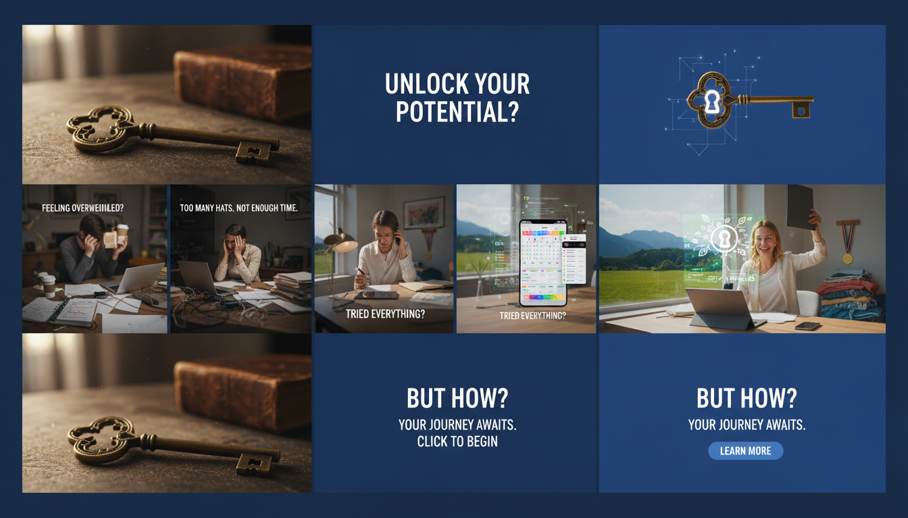
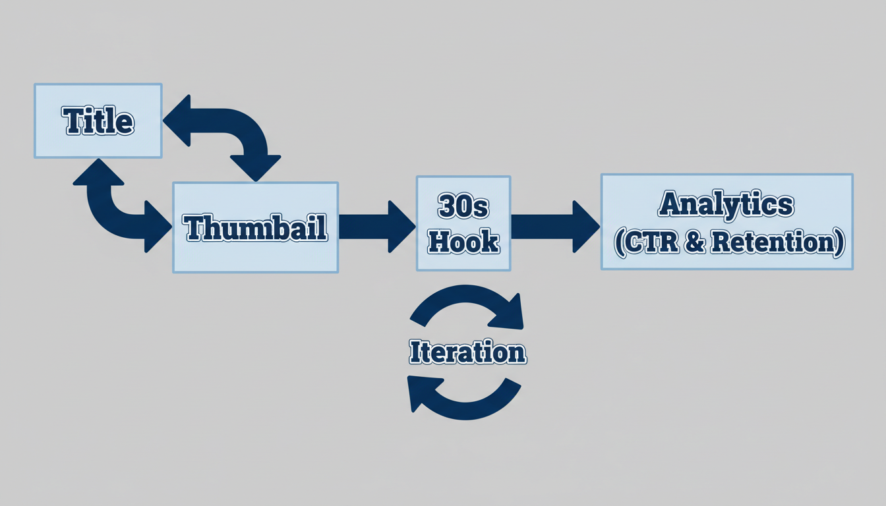
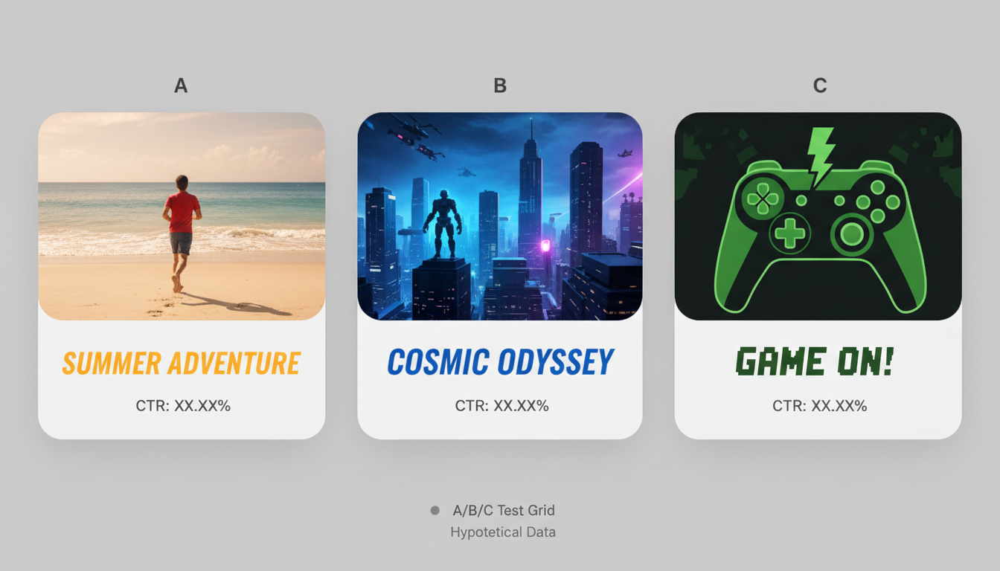
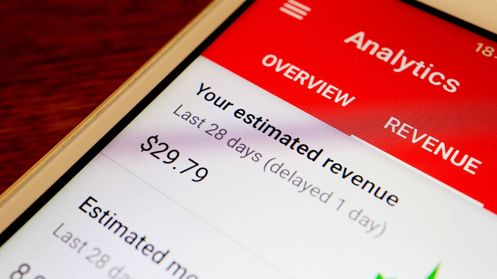

# 小频道如何增长：Thumbnail‑First 全流程（人性化改写 v4）

> 你不是在和“算法”对话，而是在和一个匆忙刷手机的人对话。Thumbnail‑First 的核心，是先让这位路过的陌生人明白你要给他的那一口“答案”。

## Key Takeaways（要点前置）
- 先赢点击再稳观看：图上只说“一件事”，视频开头先兑现。
- 标题×缩略图“同义复述”：标题完整说事，图上用 2–3 个词点题。
- 前 30 秒“四步走”：钩子→常见错→结果预览→路径说明。
- 用 CTR × 留存四象限做决定：该换图就换图，该重剪就重剪。
- 两周一轮：差异显著的 A/B + 赢图沉淀。

---

## 1）把承诺放到图上：像跟朋友打字那样直白
当你把手机递给朋友，他只有一秒看图。问自己：他会读到哪 2–3 个词？他理解了吗？

把“频道承诺”翻成口语：
- 我帮【谁】在不【某痛点】的前提下拿到【结果】。

把这句话压缩成图上的 2–3 个词；多余的统统交给标题和描述。很像写短信：越短越像人话。

---

## 2）标题×缩略图：像合唱而不是抢麦
标题是长句，图是短句；两个人唱同一段副歌。比如：
- 标题：Why Your CTR Stuck at 2%（问题）
- 图上：Fix CTR（解决）

观众在手机上一滑而过时，只来得及读“Fix CTR”。他点进来，是想看“怎么修”。所以别在图上塞进第二个话题，比如“脚本怎么写”之类——那是另一个视频。

---

## 3）开场 30 秒：把“图上的承诺”先兑付掉
你可以把这 30 秒想成“当面给结果的一口”。
- 0–5 秒：先说今天要给什么，不要铺垫。
- 5–15 秒：把常见错误摆在桌面上，让对的人点头。
- 15–25 秒：给一个结果“快照”，帮助他确认“对味儿”。
- 25–30 秒：告诉他接下来按什么顺序走。

当你把“快照”放到 20 秒左右，观众会少很多不确定——这就是留存。

---

## 4）设计不是堆技巧，而是帮人“读得快”
把自己放到地铁上：单手握杆，另一只手刷视频。你需要的是“秒懂”。

经验做法
- 颜色：选能和 YouTube 背景拉开差距的 2–3 个色；深底配亮字、浅底配深字。
- 文字：≤ 3 个词，字重大一点、边距宽一点，让大拇指遮住一角也不怕。
- 主体：只放一件东西；人物也好、物件也罢，别和文字打架。
- 方向：让视线/手势去“指”文字，观众的眼睛就会跟过去。
- 导出：1280×720，别把要点放在四角，UI 有时会遮住。

如果你犹豫该不该加一个元素，先删掉它。读得更快，永远更对。

---

## 5）两周一轮（真的很轻）：从 A 到 B，再把赢图贴墙上
周一把题面定了，写 3 个标题：一个问问题、一个给结果、一个讲动作。周二做 3 张图，差异要大：颜色换掉、主体换掉、词性也换掉。别用“轻微改动”的舒适区。

周四发 A 版。等两三天，看三件事：CTR、前 30 秒留存、看完率。周末发 B 版，只改包装，内容别动。到下周一停表，谁赢用谁，全量替换，并把“赢图特征”贴到墙上（色板、词、主体）。

一个月后你会发现：你不再从 0 开始做图，而是从“会赢的那种图”开始做。

---

## 6）Shorts → 长视频：统一“脸”和“话”，好接人
Shorts 可以拉来很多路人，但你要接住他。把封面的颜色、词性、主体和长视频统一；Shorts 的文案直说“完整版在频道”，结尾卡片只给一个去处，置顶评论也只给一个链接。选择越少，动作越快。

---

## 7）当数据在说话：四象限的“下一步”
把 CTR 和留存画成一个坐标：
- 低 CTR × 低留存：题面/方向大概率不对，换包装 + 重剪开场。
- 低 CTR × 高留存：内容不错，但门面错了，重做图和标题。
- 高 CTR × 低留存：先别动图，优化结构与节奏，兑现承诺。
- 高 CTR × 高留存：把它做成系列，做一个“下一步”的播放列表。

你会越来越少凭感觉，越来越多凭证据。

---

## 8）“人手很少”的装配线：轻，但有节拍
如果你就一个人，也能跑起来：
- 周一：题面 + 3 个标题。
- 周二：3 张图 + 手机可读性测试（缩小/模糊/灰度）。
- 周三：开场 30 秒脚本。
- 周四：发 A（卡片与置顶评论只给一个去处）。
- 周五：读数、准备 B。
- 周末/下周一：发 B、停表、替换、贴“赢图墙”。

一旦节拍形成，焦虑就会小很多。

---

## 9）标题和词：像说人话，不像写文案
好标题是你说的第一句话。下面这些“话术”很好用：
- Why Your 【指标】 Stuck at 【数字】 → Fix It
- Get Your First 【结果】 in 【时间】
- Edit the First 【片段】 Like This
- Before/After: From 【失败状态】 to 【结果】
- 【数量】 Thumbnail Rules for 【对象】
- Stop 【错误做法】, Do This Instead

图上的 2–3 个词，就从这里面挑同义词。越短越有力。

---

## 10）小而稳的“品牌感”：不用 Logo，也能被认出来
把“固定的词性 + 固定的色板 + 相似构图”坚持几周，你就会被认出来。观众会在心里对你形成“这个人说话很直白”“这个图看上去就像有答案”的印象。

当下阶段不用执着于 Logo。你要先被“读法”记住，再被“图样”记住。

---

## 11）你的最小检查表（发布前 60 秒）
- 图上只有一个信息位（≤ 3 词）
- 1/4 屏预览仍可读，模糊/灰度也能看清
- 文字对比足够，边距足够
- 标题与图是同一件事
- 开场 30 秒先兑现图上承诺
- 结尾卡片与置顶评论只给一个下一步

---

## Source Attribution（来源与延伸阅读）
- vidIQ — How to Grow Your YouTube Channel in 2026: https://vidiq.com/blog/post/grow-youtube-channel/
- SocialPilot — 9 Expert Strategies and Tips to Get More Views on YouTube: https://www.socialpilot.co/youtube-marketing/how-to-grow-youtube-channel
- Neal Schaffer — 11 Tips on How to Grow Your YouTube Channel in 2026: https://nealschaffer.com/grow-your-youtube-channel/

---

## Next Step（下一步）
- 图位占位已在文中：后续第 8 步优先回填 sources/assets；缺口再考虑 AI 生图。
- 想用工具把“脚本→缩略图”这段做快：可试 Alici.ai 的 Thumbnail（支持 Script → Thumbnail、URL Reference、One‑Face）。

> CTA：开始制作你的下一张“会被点击”的封面：https://alici.ai/youtube-thumbnail

---

重述版（完整信息对照，便于团队执行）

$(cat /tmp/v3_head.txt)
$(cat /tmp/v3_tail.txt)
# 小频道如何增长：Thumbnail‑First 全流程（结构化升级 v3）

> Reframe（重构开篇）：多数人把“增长”理解为“拍得更好”。但对小频道，最先决定命运的是“是否被点击”。先把点击路径做通——用标题与缩略图传达单一承诺——再用内容结构把“观看”做稳，增长才有复利。

## Key Takeaways（要点前置）
- 缩略图优先是小频道的低成本突破口：2–3 词单一承诺，手机端可读；可在 48–72 小时获得快速反馈。
- 标题×缩略图“同义复述”：标题完整表达问题/结果；图上只保留 2–3 个关键词，不开第二个话题。
- 开场 30 秒“四步走”兑现封面承诺：钩子→常见错→结果预览→路径说明。
- CTR × 留存做决策：低 CTR 改包装；低留存改结构；高×高则做系列与播放列表。
- 两周一轮迭代：差异显著的 A/B；胜出后全量替换并沉淀“赢图特征”。

> 来源（参考扩展，非洗稿；不虚构数据）：vidIQ / SocialPilot / Neal Schaffer（见文末）。

---

## 1）定位与承诺：把“谁–结果–无痛”写成图
频道承诺（Channel Promise）模板：
> 我帮助【谁】在【不需要某痛点】的情况下获得【结果】。

承诺→图文的映射：
- 结果词（Result）：First 1K / Fix CTR / Faster Edit
- 问题词（Problem）：No Views? / Low CTR?
- 动作词（Action）：Hook First / Cut Boring

执行要点
- 只保留 1 个信息位（≤3 词），手机一眼读完。
- 人像可加入，但要给文字让位；视线/手势指向文字。
- 背景干净、对比强；避免图标堆叠与花哨纹理。

错误诊断（快速自查）
- 读不懂：信息位超过一个；词语抽象（如“提升你自己”）。
- 看不清：背景杂乱、对比不足、字重过细。
- 不相关：图上承诺与视频开头不匹配。

---

## 2）标题×缩略图：三种“同义复述”搭配
问题式（Problem → Fix）
- 标题：Why Your CTR Stuck at 2%
- 图文：Fix CTR

结果式（Outcome → Path）
- 标题：Get Your First 1,000 Subs in 90 Days
- 图文：First 1K

动作式（Process → First Step）
- 标题：Edit the First 30 Seconds Like This
- 图文：Hook First

协同检查：标题 55–65 字符；图上 ≤ 3 词；两者说同一件事。
负面示例：标题谈“首 1000 粉”，图上却写“如何写脚本”——两个话题，点击意图分裂。

---

## 3）开场 30 秒“四步走”：从图到片的兑现
1) 0–5s：抛出承诺/问题（无铺垫）
- “今天直接把 CTR 从 2% 拉到 6% 的方法给你看。”

2) 5–15s：场景与常错（被说中）
- “大多数人把 7 个元素堆在一张图里，手机上一眼读不完。”

3) 15–25s：结果预览（降低不确定）
- “这是改前改后的对比，下面一步步做给你看。”

4) 25–30s：路径说明（结构清晰）
- “先定 3 个词，再定主体，再选对比色，最后导出 3 个版本做 A/B。”

开场可替换话术（根据题型）
- 教程：先展示最终画面 2 秒，再回到步骤。
- 评测：先抛“对比维度”，不直接宣布胜负。
- 挑战：先给结果“一瞥”，再讲条件与限制。

---

## 4）设计执行：颜色、排版、主体（手机优先）
颜色与对比
- 与 YouTube 背景（黑/白/红）拉开差异；控制 2–3 种主色。
- 文本与背景亮度对比尽量 ≥4.5:1；灰度预览仍应清晰。

排版与边距
- 粗字重（Heavy/Bold），更厚的字形在移动端更可读。
- 充足边距与“安全区”，避免 UI 遮挡要点文字。

主体构图
- 单一主体，错位摆放文字与主体；视线/手势指向文字。
- 无人物题材优先“极简主体 + 大文字”，不要为“有人”而有人。

导出与兼容
- 1280×720（≥ 720p）JPG 高质量；四角不放要点文字。

类型化策略（四类常见视频）
- 教程（How‑to）：动作词优先（Fix/Build/Edit），工具或产物做主体。
- 评测（Review/VS）：两侧对称主体，中间克制“VS”，不宣布胜负。
- 挑战（Challenge/30 天）：数字/期限大字，人物情绪更强。
- 故事（Storytime/经验）：人物大特写 + 结果词，背景简化。

---

## 5）两周一轮迭代：对比足够大、停表够清晰
第 1 周（发布 A 版）
- 产出 2–3 组“标题×缩略图”，差异显著（颜色/主体/词性至少一项）。
- 发布 A；记录 48–72h 的 CTR、首 30s 留存、看完率与评论反馈。

第 2 周（发布 B 版对照）
- 只改“包装”，不改内容；避免因多变量导致判断失真。
- 以“观看时长/平均观看时间 + CTR”综合判定胜出。

看板字段（最小集）
- 主题 | 标题 | 图上 2–3 词 | 主色 | 主体 | CTR | 首 30s 留存 | 看完率 | 胜出？

停表规则
- 样本不足不下结论；小频道可适当延长，但避免跨两周。
- 无显著胜者则回退首个版本，进入下一轮更大差异的测试。

读数启发（经验法则）
- 评论区反复提及“看着像答案/一眼懂”：说明承诺表达清晰。
- CTR 上升但前 30s 掉：多为“标题/图过度承诺”。

---

## 6）Shorts → 长视频：做“风格桥接”，把流量接住
封面同构
- 色板、词性、主体统一；Shorts 文案直指“完整版”。

单一下一步
- 结尾卡片与置顶评论只指向一个视频或播放列表。

验证→迁移
- 用 Shorts 验证词性与配色；赢图迁移到长视频与系列。

细节补充
- Shorts 文案尽量“口语化同义词”，降低理解门槛。
- 纵横比导致可视面积差异，核心元素靠中间。

---

## 7）CTR × 留存四象限：从“猜图”到“判图”
- 低 CTR × 低留存：换包装 + 重剪开场，方向可能选错。
- 低 CTR × 高留存：重做缩略图与标题（内容好但门面错）。
- 高 CTR × 低留存：保留包装，优化结构与节奏（兑现不足）。
- 高 CTR × 高留存：做系列与播放列表，规模化复用“赢图特征”。

实操提示
- 用章节/时间戳降低跳出；合适位置放卡片承接“下一个”。
- 播放列表按“问题解决路径”组织，提升会话时长。

---

## 8）每周“包装装配线”：把抽象变成席位与动作
周一：选题与关键词 → 写 3 个标题草案（问题/结果/动作三型）。
周二：3 张图（差异显著）→ 移动端可读性测试（5 秒/模糊/灰度）。
周三：开场脚本与封面承诺对齐（30 秒四步）。
周四：发布 A；设置“单一下一步”的卡片与置顶评论。
周五：读首轮数据；准备 B（只改包装）。
周末/下周一：对照发布 B；停表、落地胜者、更新“赢图墙”。

品牌轻量统一法
- 色板 2–3 种 + 一句口头禅（图文同义）即可形成风格。
- 不以 Logo 为先，先以“词性/配色/构图”形成记忆点。

---

## 9）标题速查与风险边界（不要为点击牺牲信任）
可直接用的标题公式
- Why Your 【指标】 Stuck at 【数字】 → Fix It
- Get Your First 【结果】 in 【时间】
- Edit the First 【片段】 Like This
- Before/After: From 【失败状态】 to 【结果】
- 【数量】 Thumbnail Rules for 【对象】
- Stop 【错误做法】, Do This Instead

风险边界
- 避免虚假/夸大承诺；避免与内容不符的误导性元素。
- 医疗/金融等高敏主题，避免绝对化与未经证实主张。

---

## 10）质量自检清单（发布前 60 秒）
- 图上是否只有 1 个信息位（≤ 3 词）？
- 1/4 屏预览是否可读？灰度/模糊仍能分辨主体与文字？
- 文本与背景对比是否足够？
- 主体与文字是否错位摆放、互不遮挡？
- 标题与图文是否“同义复述”？
- 开场 30 秒是否先兑现图上承诺？
- 结尾卡片与置顶评论是否只指向“一个下一步”？

---

## Source Attribution（来源与延伸阅读）
- vidIQ — How to Grow Your YouTube Channel in 2026: https://vidiq.com/blog/post/grow-youtube-channel/
- SocialPilot — 9 Expert Strategies and Tips to Get More Views on YouTube: https://www.socialpilot.co/youtube-marketing/how-to-grow-youtube-channel
- Neal Schaffer — 11 Tips on How to Grow Your YouTube Channel in 2026: https://nealschaffer.com/grow-your-youtube-channel/

---

## Next Step（下一步）
- 第 7 步：去模板化与人性化（替换“过于模式化”的段落为更生活化的描述，不删不增信息）。
- 第 8 步：优先用 sources/assets 回填图位，占位不足再考虑 AI 生图与上传。

> CTA：开始制作你的下一张“会被点击”的封面：https://alici.ai/youtube-thumbnail

结语
- 小频道的优势不在于预算，而在于“试错速度”。
- 把点击路径变简单，把兑现路径变确定，把复盘路径变可复制——你就会看到增长从“随机好运”变成“可重复的方法”。
- 从下一支视频开始，先做三张差异显著的封面，再动剪辑。

---

## 11）配色与排版参数速查（手机优先）
颜色
- 主背景：单色或轻渐变；避免复杂纹理与照片噪点。
- 关键对比：文字与背景亮度对比≥ 4.5:1（经验值）。
- 安全色板：
  - 深蓝/墨黑 + 纯白/明黄（高对比方案）
  - 浅灰/米白 + 炭黑/亮红（清爽方案）

排版
- 字重：Heavy/Bold；避免细体与花体（手机端会糊）。
- 字号：以 1280×720 预览为准，缩放 25% 仍可读。
- 边距：四周留“指尖宽度”的安全边，避免被 UI 遮挡。

主体
- 单一主体：人物上半身或清晰对象；与文字错位摆放。
- 方向：人物目光/手势指向文字，形成自然阅读路径。

导出
- 分辨率：≥ 1280×720；JPG 高质量；避免过度压缩导致文字虚边。
- 四角：不放要点文字；考虑不同设备裁切差异。

---

## 12）移动端可读性测试（3 个快速方法）
1) 5 秒法：把缩略图缩小到手机 1/4 屏，5 秒内能否复述 2–3 个词？
2) 模糊法：高斯模糊 3–5px，主体与文字区块仍清晰吗？
3) 灰度法：转为黑白后，文字对比是否仍够？

任一失败，优先减少信息、提高对比、放大关键文字。

---

## 13）YouTube 测试与比较（A/B）操作细则（易执行版）
版本选择
- 最多 3 个版本；改动“单维度显著”（颜色/主体/词性其一）。
- 版本差异过小会拉长测试时间且难出胜者。

指标权重
- 观看时长/平均观看时间优先于 CTR 单项胜出（避免“诱点后掉”）。
- 若无显著胜者，回退第一个上传版本；继续迭代下一轮差异更大的版本。

时间窗口与样本
- 建议 48–72 小时观察；低流量频道可适度延长，但避免超过两周。
- 样本不足时不下结论；以趋势与对比为主，绝对值为辅。

落地与记录
- 胜者立即全量替换旧封面，并在“赢图墙”记录颜色/词性/主体。
- 失败版本也归档，避免重复踩坑（颜色冲突/词性不清等）。

---

## 14）12 周增长蓝图（Thumbnail‑First 节奏）
第 1–2 周：找“清晰承诺”的表达（问题/结果/动作三型）
- 每周 1 支长视频 + 1–2 支 Shorts；3 套封面做对比。

第 3–4 周：沉淀“赢图特征”并做系列
- 把胜出的词性/配色/构图固化成模板，连续 3 支相似主题。

第 5–6 周：开场 30 秒专项
- 把四步结构脚本模板化，降低“兑现落差”。

第 7–8 周：Shorts → 长视频桥接
- 统一词性与色板；置顶评论与结尾卡片只给一个下一步。

第 9–10 周：播放列表与会话时长
- 用“问题路径”组织播放列表；在描述与卡片中强化串联。

第 11–12 周：回顾与二次迭代
- 汇总 10+ 次 A/B 的“赢图墙”，把共性写入设计守则。

---

## 15）常见失败图谱（三类高频错误）
1) 信息过载型
- 现象：一张图同时讲多件事，手机端读不完。
- 修正：保留 1 个信息位；把次要信息交给标题/描述。

2) 宣布胜负型（对比类）
- 现象：封面里直接给“赢家”，观众失去探索兴趣。
- 修正：中性对比 + 过程导向，让观众参与判断。

3) 兑现落差型
- 现象：封面承诺强，前 30 秒没有兑现导致留存断崖。
- 修正：按四步结构重写开场；把“结果预览”前移到 15–25 秒。

---

## 16）小频道品牌一致性轻法则
- 2–3 色固定色板 + 一句口头禅（与图文同义）。
- 标题与图上词性保持“家族化”（如结果词优先）。
- 不以 Logo 为先，先以“词性/配色/构图”形成记忆点。

---

## 17）数据记录模板（可复制）
表头：日期 | 视频主题 | 标题 | 图上 2–3 词 | 主色 | 主体 | CTR | 首 30s 留存 | 看完率 | 观看时长 | 胜出 | 经验

示例经验记录：
- 颜色：深蓝底 + 亮黄字在“教程类”胜率更高。
- 词性：动作词在“剪辑类”更易赢；结果词在“增长类”更稳。
- 主体：无人物极简在“问题类”更高效；人物表情在“挑战类”更有效。

---

## 18）实操演练蓝图（文字版，无素材展示）
目标：以“how to grow small youtube channel”为主题，从零到发布一条长视频与 2 条 Shorts。

步骤
- 关键词细化：grow youtube channel / small channel / first 1000 subs / fix CTR。
- 草拟 3 个标题：问题/结果/动作三型各 1 个。
- 选 2–3 词图文：对应三型各一套；构图采用单主体 + 高对比色。
- 开场脚本：按四步结构写 120–160 字，准备 2 个 B‑roll 点。
- 发布 A：设置结尾卡片与置顶评论的“单一下一步”。
- 读数：48–72 小时内收集 CTR、首 30s 留存、看完率与评论。
- 发布 B：只改包装；确保差异显著（颜色/主体/词性其一）。
- 停表与替换：胜者全量替换；失败版本归档并标注原因。
- Shorts：复用长视频的“结果预览”，压缩说辞，封面同构，指向完整版。

交付物
- 3 张封面（A/B + Shorts）、四步开场脚本、赢图墙记录、数据看板一条。

---

## 19）词库建议（结果/动作/问题）
结果词（Outcome）
- First 1K, More Views, Higher CTR, Better Hook, Watch More, Faster Edit

动作词（Action）
- Fix CTR, Hook First, Cut Boring, Pack Better, Title First, Test Now

问题词（Problem）
- No Views?, Low CTR?, Stuck Subs?, Weak Hook?, Bad Title?

替换技巧
- 动词优先名词；短词优先长词；具体优先抽象。

---

## 20）封面构图网格（易上手）
- 单主体网格：左/右放主体，另一侧放 2–3 词；背景干净。
- 对称对比网格：左右对称主体，中间克制“VS”；不宣布胜负。
- 结果聚焦网格：大字 + 小成果物（如 1K 图标/小奖杯），简化一切装饰。

提示：网格是起点，不是枷锁；最终以“手机上一眼读懂”为准。

---

## 21）流程风险清单（在问题出现前预防）
- 同时改内容与包装 → 对照失真 → 固定内容，只改包装。
- 版本差异太小 → 难出胜者 → 至少改一项核心变量（颜色/主体/词性）。
- 只看 CTR → 诱点后掉 → 以观看时长/平均观看时间 + CTR 综合判断。
- 把 Logo 当主角 → 降低可读 → 小频道优先“词性/配色/构图”。
- 一图多事 → 手机端难读 → 一个信息位（≤ 3 词）。

---

## 22）团队协作分工（1–2 人也适用）

---

## 23）问题清单模板（复用于每条视频）
- 这张图上“唯一的信息位”是什么？（≤ 3 词）
- 它与标题是否“同义复述”？
- 手机 1/4 屏能在 5 秒内读完吗？
- 若转成灰度/加轻微模糊，仍能分辨主体与文字吗？
- 开场 30 秒的脚本是否先兑现图上承诺？
- 版本 A 与 B 的核心差异是什么？（颜色/主体/词性其一）
- 胜者的“赢图特征”是什么？（颜色/词性/构图）
- 这条视频的“单一下一步”是什么？（结尾卡片/置顶评论）

---

## 24）时间检查：发布前 10 分钟 / 发布后 24 小时
发布前 10 分钟
- 导出尺寸与清晰度复核；四角无要点文字；文件名可读。
- 标题、描述、标签、章节/时间戳；卡片与结尾屏设置完毕。
- 缩略图是否与标题同义；拼写无误；色彩不过饱和。

发布后 24 小时
- 记录关键指标的初始值（CTR、前 30s 留存、看完率、平均观看时间）。
- 留言区是否出现“答案感/读懂感”的反馈？（说明承诺表达清晰）
- 若 CTR 与留存同时低：准备方向性更大的 B 版；同时审视题面是否过宽。

---

## 25）数据 → 行动映射（记在赢图墙上）
- CTR 上升、留存下降：保留包装，重写开场与节奏（兑现落差）。
- CTR 下降、留存上升：重做包装，词性/配色/构图回归“赢图特征”。
- CTR 与留存都上升：复制到系列；做“看下一个”的播放列表。
- CTR 与留存都下降：换题面或换承诺；回顾观众是否被说中。
- 策划：选题与标题三型草案；确定 2–3 词。
- 设计：3 张封面（差异显著），移动端可读性测试。
- 剪辑：落实 30 秒四步；卡片与置顶评论设置。
- 复盘：读数、停表、替换、更新赢图墙与看板。
