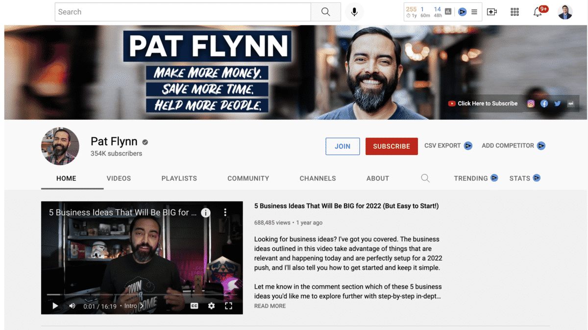
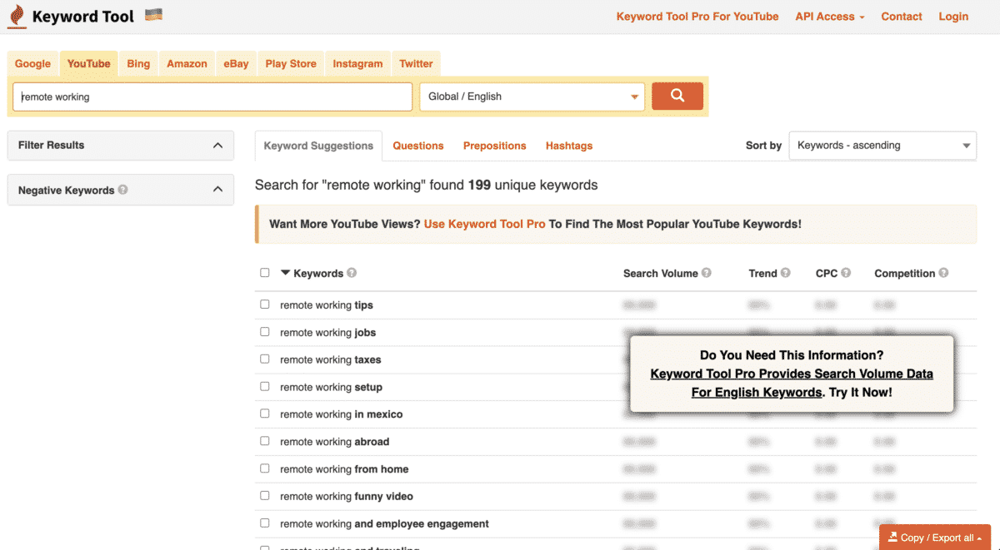
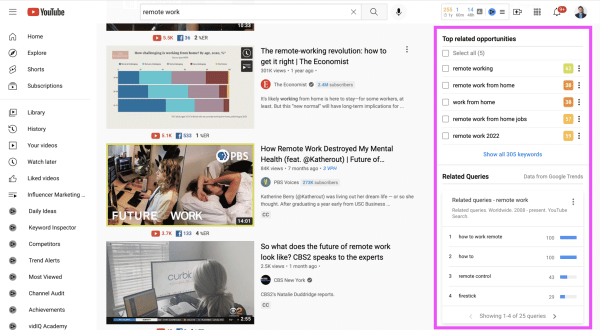
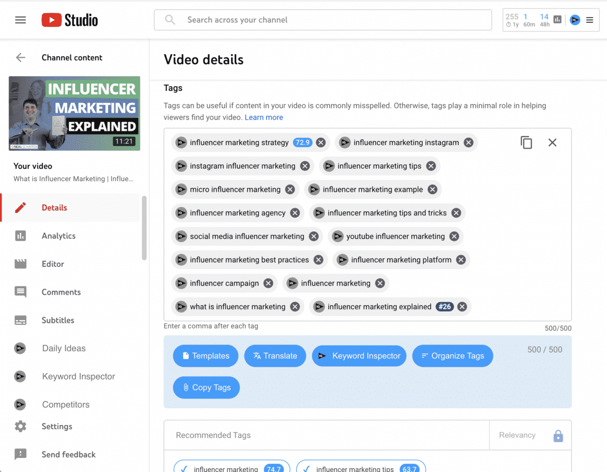
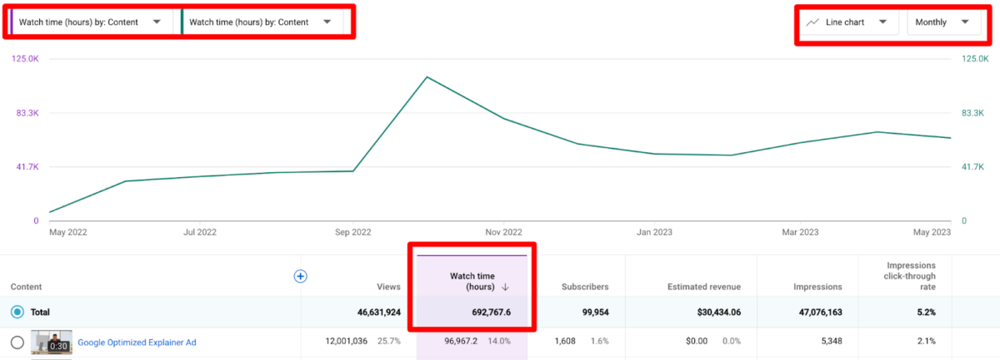

Title: 11 Tips on How to Grow Your YouTube Channel in 2026

URL Source: https://nealschaffer.com/grow-your-youtube-channel/

Published Time: 2022-09-27T11:15:00+00:00

Markdown Content:
YouTube has clearly become one of the most rapidly growing digital platforms. In the last few years, vlogging and YouTube marketing have become increasingly popular. Organically building your YouTube channel can help you reach a greater audience and bring attention to your brand in an intriguingly short amount of time.

Just like the famous saying goes, [you can’t be everything to everyone](https://www.entrepreneur.com/article/300461). Everyone has a distinct set of talents and ideas as a creative service provider. The first step towards finding and growing an audience who will benefit from your knowledge is to understand where those abilities and ideas intersect with prospective themes.

YouTube is mostly about taking advantage of the data game at hand. While there are substantial advantages to success on the platform, it should also be a fun element of your business growth. Enjoying the process of development will make the whole process much more enjoyable! We say it’s a numbers game, but having the enthusiasm and determination to keep moving forward with content creation is the key to long-term success.

In order to be successful on YouTube today, you must delve deeply into the platform’s dynamics. It will ultimately help you understand what works for others and where you can make a difference. Here are a few pointers to help you grow your YouTube channel today.

**Further Reading: [How to Create a Successful YouTube Channel in 8 Easy Steps](https://nealschaffer.com/how-to-create-a-youtube-channel/)**

### 1. Use a Welcome Video

There may be more people than you think checking out your YouTube profile, but unless you have a proper welcome video, they might not understand what your channel is about and simply not subscribe and go elsewhere.

That’s why a welcome video is a very important element of your channel.

Let’s just say it’s like the introduction of yourself on your resume. This gives your audience a preview of who you are, what kind of content you make and what they can expect from your channel. So make sure to film a nice introduction for your potential and current followers. Try to make it engaging, funny, short and attractive. Remember, the first impression is usually the last impression.

And if you already have a welcome video, make sure it still best represents you and your channel, and if it doesn’t, it might be time to revise it.

For some inspiration, check out Pat Flynn’s YouTube channel, which features a welcome video that is very much aligned with the theme of his channel.

### 2. Make Sure You are Targeting Keywords for Each Video

Video keyword research is crucial when it comes to YouTube. Picking the appropriate keywords and applying them in your video title and description can greatly impact your video’s performance. This is because YouTube, like its parent company Google, is a huge search engine. YouTubers that recognize that and take appropriate actions have an easier way of growing their YouTube channel.

Here’s how to identify keywords for your YouTube videos:

#### A) Put Together a List of Seed Keywords

Seed keywords are phrases that cover a wide range of themes. If your business is a provider of a collaboration tool business, for example, your seed keywords would be:

*   Collaboration
*   Communication
*   Remote working
*   Hybrid working

Even though this is a broad list of topics on which you can make videos and may be very competitive, it is still important for the next phase.

#### B) Research The Seed Keywords

It takes dozens if not hundreds of videos to build up your library of content on YouTube, so one video apiece for each of the above 4 keywords will not help you grow your YouTube channel!

You need to further research these seed keywords looking for keyword combinations that you can target for your videos.

You can also take advantage of some useful tools for this purpose. One of them includes [KeywordTool.io](https://keywordtool.io/). This tool will spew out a lot of phrases from YouTube suggestions when you insert a seed keyword. It can help you specify the broad terms. Seeking for specific keywords can help you combat competition. As a result, you can tailor your content for keywords that receive a lot of traffic.

To give you an idea, this is what a search for “remote working” resulted in using this tool:

#### C) Add Less Competitive, Long-Tail Keywords

For this purpose, you can use a Google extension called [VidIQ](https://nealschaffer.com/vidiq). This tool can help you narrow down on keywords that are not too competitive. Being out of competition will help you save some fighting and being different in your own race.

Check out how VidIQ works inside YouTube as you make a search and it introduces to you top related opportunities and related queries for the keyword.

#### Is Your LinkedIn Working?

Just released: my new book to help professionals, entrepreneurs, and business owners maximize LinkedIn for real growth.

With years of LinkedIn expertise, Maximizing LinkedIn for Business Growth offers actionable steps to build your brand, expand your network, and drive results.

Start leveraging LinkedIn like never before—grab your copy now! Click the cover or button below to buy on Amazon.

**Further Reading: [How to Become a YouTuber in 2026 19 Steps to Success](https://nealschaffer.com/how-to-become-a-youtuber/)**

### 3. Optimize Your YouTube Videos for SEO

Now that you understand more about YouTube keyword research, you can apply your findings and make useful use of YouTube SEO by following these steps:

#### A) Tailor The Title of Your Video with Keywords

The title of your video can make a great difference. If your title revolves around the specific keywords, then it is most likely to appear in the search. So, make sure to optimize the title of your video in accordance with the relevant and thoroughly researched keywords.

#### B) Create Titles with a High Click-Through Rate

Appearing in search alone, however, is not enough. Make sure that your titles are encouraging enough that people will want to click on them! According to YouTube themselves, the more people who click on your video, the more it will be promoted by YouTube when it comes to recommending videos to viewers.

#### C) Write Video Descriptions That are SEO-Friendly

The majority of YouTube video descriptions are extremely brief. Short descriptions can hinder your video’s potential to rank in search.Make use of the space that YouTube provides you and make sure you flesh it out naturally sprinkling in keywords so that YouTube better understand what your video is all about.

#### D) Make Your Video Tags More Effective

Use tags with your target keywords and close alternatives. While it is debatable how much they can help, they certainly can’t hurt! Once again, using a tool like [VidIQ](https://nealschaffer.com/vidiq) can help make you efficiently choose appropriate tags as shown in the below recommendations for Neal Schaffer’s [What is Influencer Marketing video](https://www.youtube.com/watch?v=D-oRuOVcaRg).

### 4. Make Attractive Use of Custom Thumbnails

It’s not enough to just appear in YouTube search: Your thumbnail will decide whether or not someone clicks through to watch your video.

It should come as no surprise, then, that custom thumbnail images are used in [90%](https://www.bbtv.com/blog/the-impact-of-a-youtube-thumbnail-on-video-performance/) of the most popular YouTube videos.

You will need some creativity to make this strategy work for you. It’s also a good idea to employ colorful options other than black, red, and white. This will generate enough variety to pique people’s interest and, eventually, view your video.

Employing custom thumbnails is an approach you can use without affecting your YouTube strategy, so play around with thumbnail pictures regardless of where this roadmap leads you. In fact, some tools such as [TubeBuddy](https://nealschaffer.com/tubebuddy) give you the ability to A/B test your custom thumbnails and keep the high-performing one.

Here are some other tips on creating effective YouTube thumbnails:

*   Keep it simple and neat.
*   Create a consistent branded look.
*   Make sure there is a color contrast.
*   Be certain following through the promises mentioned in the thumbnails.
*   If you’re going to put your face on your thumbnails, make sure your emotions are obvious.
*   If you’re going to put text in the thumbnail, make sure it’s at a size and font that’s easy to read on a mobile device.

**Further Reading: [The Best 14 Thumbnail Makers for YouTube](https://nealschaffer.com/thumbnail-maker-for-youtube/)**

### 5. Look Out for The Watch Time

_[Source](https://www.tubebuddy.com/blog/quick-guide-watch-time/)_

YouTube prefers to have users stay on the platform for a longer period of time. This is because the longer a user stays, the more advertisements they will see. Therefore, YouTube’s search algorithms favor videos with longer viewing times.

**So, how can you increase your watch time?**

*   Try to avoid the fluffs from your video and stick to the script.
*   Of course, make long videos. Instead of a 5 – 6 minute video, aim for 15 – 20 minutes video to cover your topic thoroughly, but make sure it is interesting enough that someone will want to continue watching throughout its entirety.
*   Don’t use long intros as they will dull your video. Give your viewers what they want immediately up front if you want them to keep watching.
*   Don’t be a one-trick pony. When you talk to someone in a single frame, they will get bored too easily. Moving around, changing screens and backdrops, offering examples, asking questions, and maintaining a high energy level in your voice will all help to make your videos more engaging.

### 6. Time to Up Your Editing Game?

This should come as a no-brainer, but if you are finding it hard to increase your watch time, maybe it’s time to change your approach to video creation and become a better video editor?

I remember my film teacher used to tell us in school that a film is made two times – once when it’s shot and the second time when it’s edited. A good strategy would be to take multiple shots and choose the best ones in the end for editing. A poorly edited video can harm the reputation of your brand or you as an individual content creator.

Of course, your editing can only work when you have the right inputs. From lights, to the right background sounds, the correct backdrops – all of it adds up to an aesthetically well edited video.

### 7. Use YouTube Analytics Insights

The above elements are the critical ingredients you need to grow your YouTube channel. As you continue to publish videos, it’s time to assess their success and look for additional areas to improve.

That’s why it’s critical to review video analytics on a daily basis to assess your channel’s efficiency, what performs and what doesn’t, prospective growth, and more. You can make use of the following:

*   **Real-time views:**It’s critical to examine the video’s performance in real time. Examine the average view time of the videos as well as the moment at which people stopped watching them.
*   **Traffic source:**This can help you see the origin of views for your videos.
*   **Demographics:** It indicates the demographics of the audience that is most likely enjoying or watching your videos. Paying attention to this can help you generate content that they like the most.
*   **Click-through rate:**CTR is used to evaluate the video’s performance and make any necessary improvements.

Let’s now look at some other creative ideas to help you grow your YouTube channel that you might not have thought about before!

### 8. Interview Other YouTube Creators

Partnering with other creators and influencers in your niche is one of the smartest methods to expand your YouTube channel. Another advice would be to focus on leaders outside a niche and seek ways to collaborate with content creators who have a larger audience than you do. When you interview them on your channel, they’ll often share it with their followers and viewers, assisting you in rapidly growing your channel.

### 9. Face Reveal

A lot of times YouTubers make videos without revealing their face to the audience. However, over the years, YouTube analytics have proved that people who come in front of the camera and reveal their face to the audience they are catering to have a more successful channel. Although it is not important that you show yourself in every video, engaging with your audience every once in a while can prove to be beneficial for your channel. It is often believed that people like to connect with a real person on a video rather than a screen. It gives them a more real feel while watching your content.

### 10. Subscription Reminders and Giveaways

Some people may often watch your videos but have not subscribed to your channel. But because they often watch your videos, your content shows up on their feed automatically every time you upload something new. However, there is a great chance that they have forgotten to subscribe to your channel. So, it’s always a good idea to remind your audience to subscribe to your channel and even ask for likes and comments to engage the audience. One simple way of doing this is to ask them an interactive question and request for their answers in the comments below.

Another approach is to do giveaways – this is something that people from all platforms do to increase their reach. Content creators usually ask people to like, subscribe or share their content if they want to get a giveaway! These giveaways can be in collaboration with other YouTubers or solos. However, doing it in collaboration has greater chances of reaching out to maximum numbers as your audience and the audience of your collaborator both will be in the loop.

Besides, just like Albert Bandura said, [positive reinforcement can lead to some great things](https://www.verywellmind.com/social-learning-theory-2795074). Your giveaways are definitely a positive reinforcement for your audience to follow you. So get some gifts ready and give away the fun to your audience!

### 11. Expand Your YouTube Channel by Using Other Platforms

Knowing how to use each platform is essential and keeping the long game in mind will provide all the incentive you need to keep testing and tweaking until you find the appropriate mix for building your YouTube channel.

Any entrepreneur that wants to expand their business will need a marketing mix. Similarly, you need to use TikTok, Facebook, Instagram, Twitter, Email, and other platforms to help develop your YouTube channel. Share your videos on these platforms or get your videos linked from various channels to increase your reach.

The Bottom Line on How to Grow Your YouTube Channel
---------------------------------------------------

Starting a YouTube channel is an easy way to fuel the growth of your business but growing your channel is an art in itself. However, this is the kind of art that is nurtured and not natured – which means you can learn it easily and apply certain strategies to grow it. Although, growing your platform requires patience and hard work but it’s important that you also understand your viewers, what they like and want, and what might be beneficial to them. If you’re a [brand or company](https://www.chanty.com/blog/growing-saas-business-with-social-media/), releasing exceptional video material to YouTube will help you demonstrate your competence and strengthen your brand. It’s a tremendous approach to connect with the market and engage with the audience.

Having said that, are you ready to grow your YouTube channel? Hopefully, the tips provided above will assist you in doing so. Remember, a long term investment, consistency and patience coupled with hard work will get you to it for sure.

**Further Reading: [13 Powerful YouTube Tools You Need to Grow Your YouTube Audience](https://nealschaffer.com/youtube-tools/)**

**Author Bio**

Ammara Tariq is the Marketing Manager at [Chanty](https://www.chanty.com/), a collaborative team chat, with a plan to take her team to new heights. With an everlasting love for marketing tactics, she’s also very fond of research writing and hopes to spread delight and knowledge to her readers.

Actionable advice for your digital / content / influencer / social media marketing.

Join 13,000+ smart professionals who subscribe to my regular updates.
