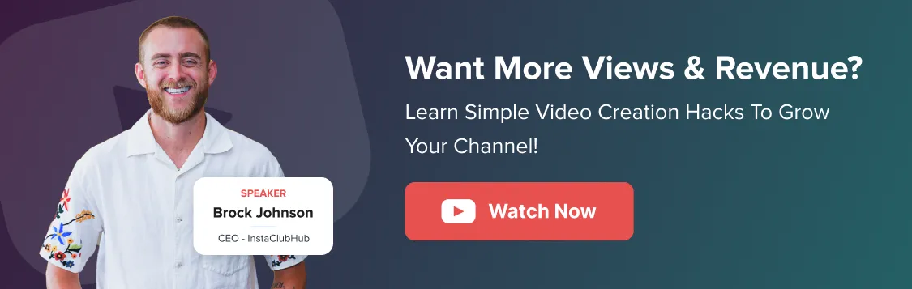

Title: 9 Expert Strategies and Tips to Get More Views on YouTube

URL Source: https://www.socialpilot.co/youtube-marketing/how-to-grow-youtube-channel

Markdown Content:
Every day, over [20 million videos are uploaded](https://blog.youtube/press/) to YouTube. That’s a staggering number, and it underscores the intense competition to get your videos the views they deserve.

So, how can you get more views on YouTube? Creating engaging video content is definitely the foundation of growing your channel, but it’s not enough on its own.

I’ve been where you are – overwhelmed and wondering if it’s worth the effort. **After 85K+ YouTube subscribers and over 300K+ monthly views**[**on my channel**](https://www.youtube.com/@BuildYourTribePodcast)**, I’ve cracked the code on what gets YouTube videos views.**

In this blog, I will document my experience and examine videos from multiple YouTube creators who went from no views to exponential growth.

How to Get More Views on YouTube Videos?
----------------------------------------

Firstly, you need to [build a solid YouTube marketing strategy](https://www.socialpilot.co/youtube-marketing/youtube-marketing-strategy "Youtube Marketing Strategy") that provides enough value to keep people interested. Along with that, you follow the tips below to attract more views and appear where the audience can find you and watch your video.

### 1. Use Popping Thumbnails

On YouTube, your audience will judge the video by its thumbnail. The more attractive your thumbnail is, the more likely viewers are to click it to view your video.

Your low CTR could be due to the boring thumbnails you have been using.

_“If you have a low CTR percentage, let’s be honest, you have a boring thumbnail, and that won’t get views. If you have a high one, that’s where the magic lies, and that’s where you can get more views,”_[said Enrico Incarnati](https://www.youtube.com/watch?v=dB6DXcZo6hE), Director of Social Media for Mel Robbins.

But what makes a thumbnail stand out? The color, the text, and the image. You need to:

*   Add contrasting colors that pop against the black, white, and red background of YouTube.
*   Use minimal (2-3 words) but impactful text that doesn’t clutter your thumbnail, yet gives context.
*   Add close-up shots of faces. They tend to connect emotionally with viewers and create curiosity.
*   Upload [YouTube thumbnails in the proper dimensions](https://www.socialpilot.co/youtube-marketing/youtube-thumbnail-size "Youtube Thumbnail Size").

These are the exact steps I follow on my YouTube page as well. Look at the words and the gestures I have added that are relevant to the context of the videos.

### 2. Cut Boring Parts to Improve Retention

Most videos don’t get views because they have a retention problem. They are good videos, but they have vague, boring, or overly long parts that cause users to bounce.

More video bounce in between gives the algorithm the wrong signals and, in return, YouTube stops or reduces showing your video to the right audience.

Now, the answer to increasing audience retention lies within [YouTube analytics](https://www.socialpilot.co/youtube-marketing/how-to-use-youtube-analytics "How To Use Youtube Analytics"). You can check the audience retention graph for each video to see when users are dropping off.

Youtuber [Marcus Jones did the same thing](https://www.youtube.com/watch?v=4Gw-HQvo9jY) with his underperforming videos.

*   He identified where viewers are dropping off (“dud moments” or a weak intro).
*   And then he used the YouTube Editor’s “trim and cut” feature to remove the disengaging sections in the published video.

This simple trick helped him grow his YouTube views tenfold.

Another technique you can use is [adding “Video cards”](https://support.google.com/youtube/answer/6140493?hl=en&co=GENIE.Platform%3DDesktop) at the place where views are dropping. This enables you to improve the session time.

When you place a card right at the drop-off point, it either gets viewers to click on another video or makes them stick around until the dip in retention passes.

When I started linking related videos in my descriptions, adding cards, and using end screens, I noticed a huge difference in my watch time and retention.

One thing I did was include a card in an Instagram video pointing to another about Instagram SEO strategies. That small tweak doubled views on the second video within a week.

Here’s how to do it:

*   Add cards at moments where viewers might want more details or examples.
*   Use end screens to suggest related videos or playlists.
*   Mention your other videos verbally during filming, like: “If you want more on this, check out my video on XYZ!”

This strategy keeps viewers on your channel longer and tells YouTube your content is binge-worthy. Simple tweaks, big results!

### 3. Create Titles That Spark Curiosity

The title of your YouTube video impacts your search ranking and your position in auto-suggestions. Once your video is discovered in either of these places, it’s also the title, along with the thumbnail, that encourages users to click.

Think of your title as the bait and your thumbnail as the hook. They work together to:

*   Grab attention in a sea of content.
*   Set expectations for what the video delivers.
*   Boost your CTR (click-through rate).

To write an effective title that drives more views, you need to look at it from a psychological perspective. Your title must spark curiosity in your audience when they read it.

Also, your title needs to justify the timing of your video so that people click on it.

[Mr. Beast suggests the same idea in this video](https://www.youtube.com/watch?v=9DBJXRy5dvk): “_So if it’s a 20-minute video and the title is ‘I stepped on a bug,’ the click-through rate is going to be much lower than if it were like a five-second video. Like, even nuances of the length of the video based on the title will affect whether people want to click it, because sometimes they just don’t add up._”

Of course, he walks the talk.

There are also a few best practices you can follow that most highly viewed videos follow:

*   Keep your title under 50 characters so the good part isn’t truncated.
*   Add numbers to your titles. If it’s a time-sensitive or a trend-related video, then adding the current year to your title can signal to viewers that your information is up-to-date.
*   Most experts suggest adding brackets to attract attention. Anything in brackets or parentheses tends to get noticed more by viewers.

### 4. Get Into the Session Chain

One powerful yet underrated signal that YouTube uses to decide which videos to recommend is something called **session chain power**.

_How does this work?_ See, YouTube just doesn’t auto-suggest any random video. It looks for a video that naturally fits within a viewer’s watch session.

That’s why you must also **focus on creating videos that can go in between the video sessions of a big YouTube channel in your niche**. For example, the playing video is of the creator talking about “_old laptops_” and “_making them fast_.” Now, in the suggestions column, YouTube is showing topics that make great follow-ups to the current video from different creators.

To find such topics easily, you need to:

*   Head to the Audience section in YouTube analytics and scroll down to see “**_Channels that your audience watches_**” and “**_What your audience watches_**” sections. These sections show you the most-viewed videos from other YouTube channels that your audience is watching. 

*   Click on a video, go to Reach, and scroll down to “**Content Suggesting This Video**.” This will show you which videos from other creators are recommending your video. 

Once you understand these patterns, start crafting topics that fit into the “session chain” of videos with high engagement to grow your channel.

### 5. Optimize with ‘Places Mentioned’

Adding Places in your YouTube videos can make you discoverable to the right audience. This works great for the local business as videos with Places mentioned are more likely to appear in local search results.

This technique works great to get views for niches like travel, food, events, news, and vlog-style videos. I never shoot any of these styles; that’s why I have borrowed the example from “CoolVision,” a travel blogger.

Here’s a [step-by-step process to turn on Places](https://support.google.com/youtube/answer/7638112?hl=en&co=GENIE.Platform%3DDesktop) on your videos

### 6. Add Video Tags Smartly

Although [YouTube tagging](https://www.socialpilot.co/youtube-marketing/how-to-tag-youtube-videos "How To Tag Youtube Videos") doesn’t carry as much weight as titles, descriptions, and thumbnails, you must not completely overlook it when planning your metadata.

Here’s what [YouTube says about video tags](https://support.google.com/youtube/answer/146402?hl=en):

Algorithms still consider tags to understand what your video content is about and boost your search ranking to get you more viewers. Don’t overdo it—focus on quality over quantity. I like to use a max of 15-20 tags per video.

Here are two things you must do to optimize your tags smartly:

*   **Use a Mix of Broad and Specific Tags**: For every video, use a combination of broad tags (like “recipe”) and specific long-tail tags (such as “best breakfast recipes for beginners”). This increases the chances that your videos will be discovered for both general searches and more specific queries.
*   **Set Default Tags for Each Upload**: You will find the “Upload Defaults” section in the channel settings. Here, you can set a default set of video tags that will automatically be added to every video you upload. Tags you add here must cover broad and long-tail relevant keywords that describe your YouTube channel as a whole.

### 7. Optimize YouTube Videos for SERP Results

Google SERP results include a dedicated video section for almost every other search query. They sometimes even appear before text results.

This is especially common with “how-to” queries because people are looking for step-by-step guidance that is easier to understand from a video. This gives your video a chance to gain traffic from another channel.

However, ranking well in Google search results is not easy. As a matter of fact, ranking on YouTube also doesn’t mean you will show up in the Google rankings.

Look at the ranking result of the query “how to bake cookies” on YouTube.

They are not the same ones ranking in the Google SERP. This is because YouTube results depend on factors like user location and past engagement patterns, whereas Google results do not.

So, what does it take to rank your video on Google? There is no exact answer, but [mastering YouTube SEO](https://www.socialpilot.co/blog/youtube-seo "Youtube Seo") and applying it effectively is a good starting point.

*   **Keyword research:**Use low competition and untapped keywords to help you get more visibility and rank high in the YouTube search. I use [keywordtool.io](http://keywordtool.io/) to spot untapped keywords and create detailed and helpful videos on them better than my competition.
*   **Adding long-tail keywords:** Use relevant keywords naturally in full sentences. Start by listing all primary keywords as tags first, then integrate them into your description. Include them in your title and channel keywords as well.
*   **Speaking long-tail keywords:**It’s 2026; adding keywords in the title and description is not sufficient. YouTube uses LLMs and machine learning to understand each and every video. Speak your target keyword naturally in your video so they appear in the transcript.
*   **Adding timestamps:**Include timestamps in your video description to improve user experience and SEO.

### 8. Post on Optimal Timings

A well-known technique to get more views on your YouTube videos is to post when your audience is active. This best time varies from channel to channel, which is why it’s best to figure out your personal [optimal posting time on YouTube](https://www.socialpilot.co/blog/best-time-to-post-on-youtube "Best Time To Post On Youtube").

However, SocialPilot conducted research that helped us determine the average optimal timing you can use to gain more views on your YouTube videos.

### 9. Create Video Series and Playlist

[Creating a YouTube playlist](https://www.socialpilot.co/youtube-marketing/youtube-playlist "Youtube Playlist") sets you up to get more views on your videos. _How?_ Every video on the YouTube playlist is set to Autoplay.

It means that once you have played a video from the playlist, YouTube will automatically play the next video.

Therefore, creating a playlist can ensure more views on your videos. Look at the tons of YouTube playlists “The Home Depot,” a home improvement retailer, has created to promote its different products.

[source](https://www.youtube.com/@HomeDepot/playlists)

Also, as you create more videos, it will become harder for your audience to find your older ones. It is again where a playlist can come in handy.

How to Promote Your YouTube Channel for More Views?
---------------------------------------------------

Once you have perfectly optimized your video content, structure, length, and every technical option available on YouTube, move to the next stage. The second way to get more views on your YouTube videos is by using promotional strategies. Let me share how I promote my YouTube videos across different channels.

Start actively promoting your videos through social media channels and forums like Reddit and Quora.

Sharing your complete video on channels might not be the best idea. Social media platforms are designed to keep users on the platform, so adding links that take them away could hurt reach.

Instead:

*   **Use Instagram DM automation**: Set up keyword-based DM triggers using tools like Manychat and nudge users to comment for the complete link. I’ve been using this approach, and it’s been driving solid views from my Instagram followers. 

*   **Use Stories**: Stories with a link sticker across multiple channels are a good way to promote.
*   **Share video links in comments**: Add your video link inside the comments section on Facebook and LinkedIn. Use Link in bios for other channels.

Having a hard time cross-promoting on other social media channels while chasing views on YouTube? Bring every platform together with SocialPilot.

SocialPilot enables you to schedule and share posts on all major networks, [including scheduling YouTube videos and shorts](https://www.socialpilot.co/youtube-scheduler "Youtube Scheduler"), from a single dashboard. Plan and schedule your cross-promotion content along with your video, so you don’t have to manage every platform at the last minute.

[Start Your 14-day Trial](https://www.socialpilot.co/plans "Start Your 14-day Trial")

When it comes to forums, be mindful. Not all communities will appreciate direct promotion. It’s important to be subtle and add value to the discussion. If you get flagged for over-promoting, don’t do it again in the same community.

Ask yourself these questions:

*   Is this Subreddit open to such posts?
*   Is my promotion rate under 10% compared to other content?
*   Is this Subreddit a suitable place to share my content?

### 2. Collaborate with Other YouTubers

Collaborating with YouTubers who already have a decent following is a great way to make people aware of your channel.

Previously, marketers or creators would do it by coming in each other’s videos or creating the same video with different perspectives on the same event. But now YouTube has made it simple by launching the “Collaboration” feature.

**Since it’s a new feature, YouTube will reward videos that use it early on and help them attract more eyeballs**. You can use it to collaborate with a creator or a brand that aligns with your business and has a good following among your target audience demographics.

### 3. Tease With YouTube Shorts

An [academic study found that](https://research.google/pubs/shorts-vs-regular-videos-on-youtube-a-comparative-analysis-of-user-engagement-and-content-creation-trends/) Shorts received four times as many views as regular YouTube videos, which comes as no surprise. YouTube has been prioritizing Shorts to keep users on its platform.

Leverage the reach of YouTube Shorts to get more views on your YouTube videos. [Start creating Shorts](https://www.socialpilot.co/youtube-marketing/youtube-shorts "Youtube Shorts") that tease the audience to watch the longer video on your channel.

Your Shorts need to hook the audience, then leave part of the story unfinished to drive people to the full video.

Of course, don’t do it often, or else people will get frustrated.

### 4. Embed Video on Websites

Enable the embedding option on YouTube so people can add your videos to their websites. Look at how many informational videos we have embedded in this blog.

Similarly, if you create something of value, websites in your niche will add your video and send it views without any extra effort from your end. You can also run an outreach program to get your video added to blogs where it’s appropriate.

Look at how HubSpot embeds informative videos to support and cite the points they’ve written.

[Source](https://blog.hubspot.com/marketing/short-form-video-psychology?hubs_content=www.hubspot.com/&hubs_content-cta=nav-resources-blogs&_gl=1*col19b*_gcl_au*NTQ2NDkwODc2LjE3NjIxNDcxMTM.*FPAU*NTQ2NDkwODc2LjE3NjIxNDcxMTM.*_ga*OTY3MDk4NzE4LjE3NjIxNDcxMTM.*_ga_LXTM6CQ0XK*czE3NjM5NzUwMjIkbzUkZzAkdDE3NjM5NzUwMjIkajYwJGwwJGgw*_fplc*MmxPQTdsdnRsa3UwZkR2Zm11MVR0dHAlMkJlRE1VMGhLelJVZFFPWWtzayUyRkFLdkIzM3ZTa1ZGbXNFaVBjbnB0bmQyNm1TJTJGVkl3MiUyQnhsRjJvUG1mYWVSY1hyOEV0a1pXbXYlMkJhM0ZtQ3RncjhxSDdQaVRnZWh3VUVYR2hrRDE2USUzRCUzRA..)

Similarly, you also need to embed videos on your own website. Most of the time, you will be following the same keyword on Google and YouTube and adding the video around the same topic, not only to get views to your video but also to enrich your website content and boost session time.

What Counts As a View on YouTube and What Doesn’t?
--------------------------------------------------

**Views on YouTube are counted when your video has been watched for more than 30 seconds.**The [YouTube algorithm](https://www.socialpilot.co/youtube-marketing/youtube-algorithm "Youtube Algorithm") only counts intentional plays as views, which is why the time bar exists to track the viewer’s engagement.

However, for YouTube Shorts, the rules are a bit different. Views get counted when the video starts playing, since Shorts are short‑form content.

Also, rewatching the video counts as another view, as long as it meets the 30-second criterion. However, don’t go re-watching your own videos again and again. YouTube is pretty vigilant about spam views. It has a system that detects and rejects illegitimate views (bots, auto‑refresh, etc.), so just repeatedly refreshing won’t reliably raise your view count.

Here are a few more actions that don’t count as views:

*   If someone just loads the video and bounces right away, it doesn’t count.
*   Embeds autoplay videos that start playing when the page loads don’t count as a view. They only get counted when the user initiates them.
*   The time spent watching skippable or non-skippable ads doesn’t count as a view.

Start Getting More Views!

The YouTube you knew two years ago doesn’t exist anymore. The platform is chasing viewer satisfaction. Behind every spike, dip, and “suggested” placement lies an AI system that understands human attention better than ever.

YouTube’s algorithm cares less about how many keywords you add and more about _how long_ you keep people interested. **It focuses on session contribution, viewer satisfaction, and engagement.**

The tips shared above align with the same ideology of audience retention. Use them to get your videos in front of your audience and get more views.
