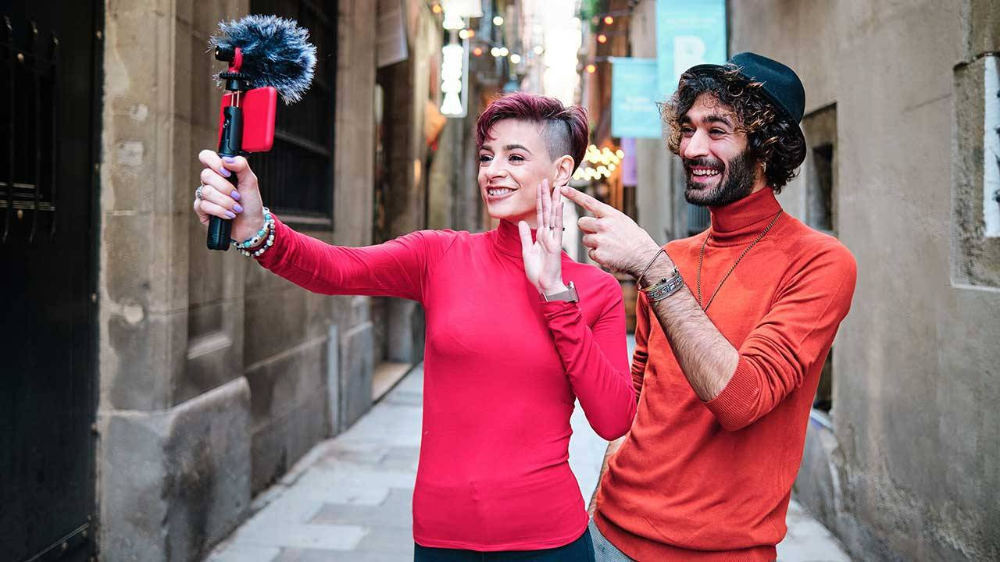
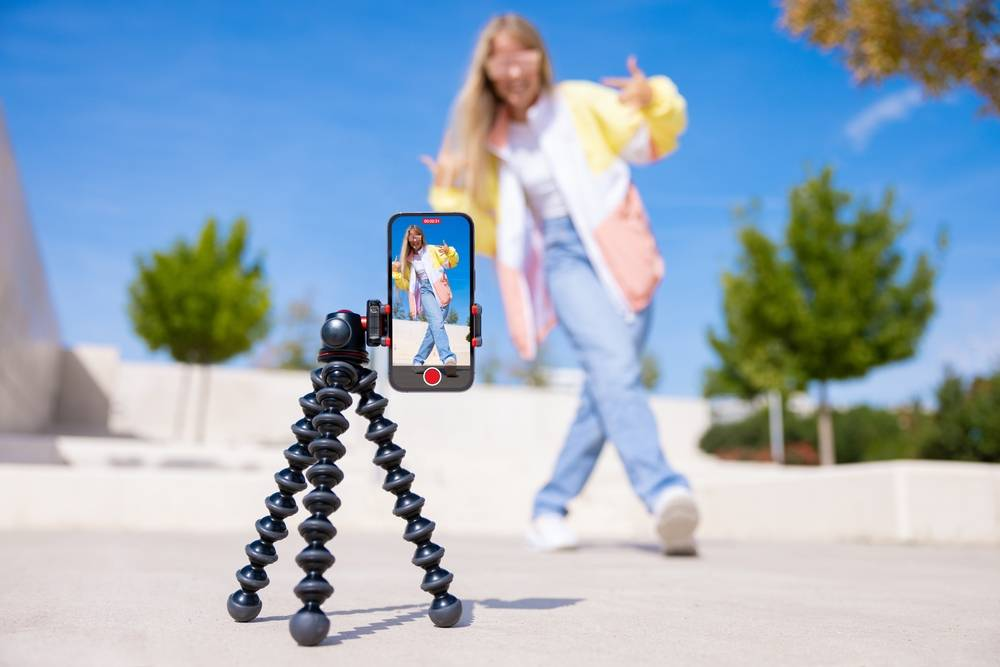
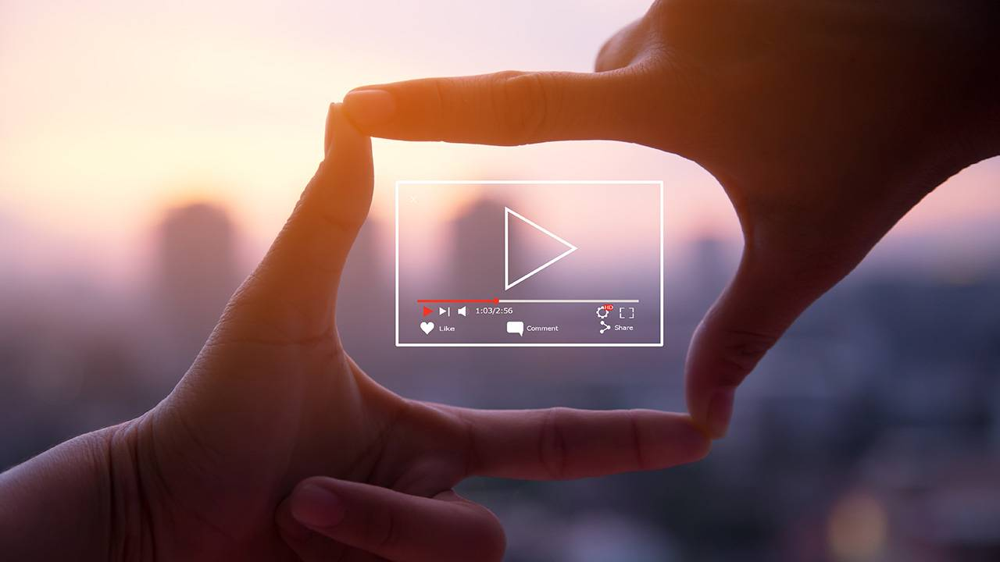
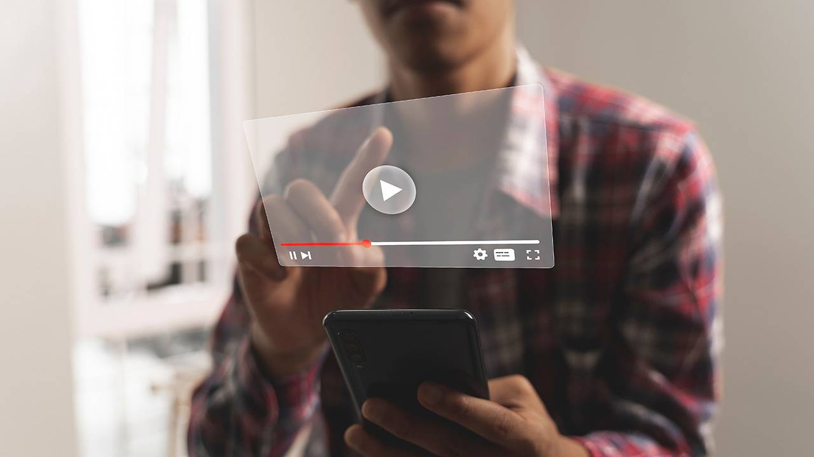

Title: How to Grow Your YouTube Channel in 2026: The Ultimate Guide

URL Source: https://vidiq.com/blog/post/grow-youtube-channel/

Published Time: 2023-03-03T22:16:27.000Z

Markdown Content:
Summary: Define your niche promise, validate topics in YouTube Search, improve titles and thumbnails, hook viewers in 30s, use playlists to binge, add Shorts that lead to long videos, track CTR + retention.

Starting a YouTube channel is tough, and growing it to thousands of subscribers (or more) is even tougher.

But it is absolutely doable in 2026. The creators who grow are not “lucky.” They are consistent about three things:

1.   They make videos for a specific viewer
2.   They package videos so people click
3.   They keep viewers watching so YouTube recommends them again

In this guide, we'll break down each of these fundamentals into proven steps on how to grow a YouTube channel.

Stop Guessing. Start Growing.

Join 20M+ creators using vidIQ to get more views, subscribers, and success on YouTube.

[Create Your Free Account](https://vidiq.com/blog/post/grow-youtube-channel/)

1. Pick a Niche and Channel Promise
-----------------------------------

Most channels do not fail because the creator “isn’t talented.” They fail because the channel is unclear. A clear niche fixes this.

If a new viewer lands on your channel, can they answer this in five seconds?

_“What do I get if I subscribe?”_

**Write your channel promise in one sentence by using this formula:**

_I help [who] get [result] without [pain]._

Examples:

*   “I help busy beginners cook real meals without complicated recipes.”
*   “I help new guitar players learn songs without boring theory.”
*   “I help first-time homeowners renovate without getting ripped off.”

**Choose 3 repeatable content lanes.**

You do not need 100 ideas. You need 3 “series” you can repeat.

Examples:

*   Tutorials (how-to)
*   Reviews (best vs worst)
*   Challenges (I tried X for 30 days)

When your lane is consistent, viewers know what to watch next. That is where growth speeds up.

2. Create High-Quality Videos
-----------------------------

“High quality” is not a fancy camera. It is a video that delivers a satisfying experience.

If you want people to subscribe, your videos should do at least one of these:

*   Teach something clearly
*   Entertain with a strong story
*   Inspire with a transformation

**Make your first 30 seconds unskippable**

People decide fast. Start with [an engaging hook](https://vidiq.com/blog/post/youtube-intros/) like one of these:

*   A bold promise: “By the end of this video, you’ll be able to…”
*   A quick reveal: “Here’s what this looks like when it works.”
*   A tension question: “Why does this keep happening to you?”

**Use pattern interrupters**

Every 10 to 20 seconds, give the viewer a reason to keep watching:

*   Cut to a new angle
*   Add quick text on screen
*   Show a screenshot, clip, or example
*   Change pace with a mini story

**Tell a simple story**

Know the [basics of story telling](https://vidiq.com/blog/post/youtube-storytelling-boost-watch-time/):

*   What problem are we solving?
*   What is the common mistake?
*   What is the fix?
*   What does success look like?

3. Optimize Your Content for Search Engines
-------------------------------------------

[As the world's second-largest search engine](https://www.oberlo.com/blog/youtube-statistics), YouTube processes over 3 billion searches monthly. For creators, this represents a massive discovery opportunity, but only if videos are properly optimized for search

Here's the only checklist you'll ever need when it comes to[optimizing videos on YouTube](https://vidiq.com/blog/post/youtube-seo/):

1.   Choose a[target keyword](https://vidiq.com/blog/post/how-to-rank-number-one-youtube-keyword-research/)for each video you want to make.
2.   Add the target keyword (plus related keywords) to your video title and description.
3.   Create a[custom thumbnail](https://vidiq.com/blog/post/youtube-custom-thumbnails-ctr/)that reinforces the title.
4.   Use relevant hashtags to reach more viewers.
5.   Add[captions and subtitles](https://vidiq.com/blog/post/youtube-captions/)so your video is accessible to all.
6.   Organize your videos into YouTube playlists.
7.   Promote your videos using cards and end screens.

When you use the right keywords, you can also show up on Google search pages. That's a lot of free promotion for your channel!

4. Design Attention-Grabbing Thumbnails
---------------------------------------

Custom thumbnails can make or break your YouTube growth. They're the first impression viewers get, a split-second decision point that determines whether someone clicks or scrolls past. Make them count.

**A strong thumbnail is**:

*   Simple
*   Easy to understand at a glance
*   Clearly connected to the title

**Quick thumbnail wins:**

*   Use one main subject (face or object)
*   Use high contrast
*   Use minimal text (or none)
*   Show emotion, stakes, or outcome
*   Keep a consistent style across your channel

Need design ideas?[Here are 12 thumbnails people love to click on YouTube.](https://vidiq.com/blog/post/types-youtube-thumbnails/)

5. Write Engaging YouTube Titles and Descriptions
-------------------------------------------------

With YouTube titles, you want to get in the habit of writing for emotion and not just describing the video. Plenty of videos on YouTube cover the same theme; the real question is, why should people care about _one_ particular video?

**Good titles do two things:**

1.   They clearly communicate what the video is about
2.   They create curiosity without lying

**Try these title frameworks:**

*   “I Tried [X] for [Time], Here’s What Happened”
*   “How to [Result] Without [Common Pain]”
*   “The Truth About [Topic]”
*   “[X] Mistakes That Are Killing Your [Result]”

Then make sure the video delivers what the title promised.

Want to test multiple angles quickly? [vidIQ’s title generator tool](https://vidiq.com/ai-title-generator/) can generate dozens of title options for you to refine.

**Upgrade your descriptions**

At minimum, your first 2 lines should:

*   Repeat the promise of the title
*   Tell the viewer what they will walk away with

After that, include:

*   Chapters (timestamps) if it helps
*   A link to a playlist or related video
*   A short CTA (subscribe, comment, next video)

[Of course, you can take it to another level by ensuring your description has these 11 elements](https://vidiq.com/blog/post/youtube-video-descriptions/)

6. Use Hashtags to Boost Your Reach
-----------------------------------

[Hashtags](https://vidiq.com/blog/post/youtube-hashtags/) can help YouTube categorize your video and help viewers discover you through topic pages.

Simple rules:

*   Use 2 to 3 hashtags max
*   Use specific hashtags, not overly broad ones (#fitness is usually too broad)
*   Put them in your description near the top or at the end, but stay consistent

7. Boost Your Engagement with a Call to Action
----------------------------------------------

Most viewers will not like, comment, or subscribe unless you ask with a [Call to Action](https://vidiq.com/blog/post/youtube-cta/).

But do not ask randomly. Ask at the moment it makes sense.

Examples:

*   After a win: “If that helped, hit like so YouTube shows you more videos like this.”
*   Before the key step: “Subscribe if you want the full series.”
*   For comments: “Comment ‘PLAN’ and I’ll reply with the checklist.”

One strong CTA beats three weak ones.

8. Build a Strong Relationship with Your Audience
-------------------------------------------------

A channel grows faster when viewers feel like they know you.

Engaging with your audience isn't too different from hanging out with a friend. All you have to do is get to know who they are!

Do these consistently:

*   [Reply to early comments](https://vidiq.com/blog/post/responding-youtube-comments/)in the first hour
*   Pin a comment that asks a question
*   Use [Community posts](https://vidiq.com/blog/post/community-tab-youtube/) (polls, updates, teasers)
*   Host [livestreams](https://vidiq.com/blog/post/youtube-livestream-tools/)
*   Reference viewer feedback in the next video (“A lot of you asked…”)

Your audience becomes your content engine.

9. Invest in YouTube Collaborations
-----------------------------------

[YouTube collaborations](https://vidiq.com/blog/post/youtube-collabs/)are a brilliant way to grow your channel by introducing new viewers to your content. But of course, not all collabs are successful. You have to find the right partners, make sure your audiences overlap, and do other things to make the project work.

Here are a few ways to execute the best YouTube collab:

*   Collaborate with creators in your niche.
*   Brainstorm video ideas before you reach out to collaborators.
*   Pick a video collab style (in-person, remote, video takeover, etc.).
*   Promote the collaboration to boost its reach.

10. Capitalize on YouTube Trends and Challenges
-----------------------------------------------

To speed up your channel's growth, why not participate in YouTube challenges or a couple of social media trends? This approach can work well for small YouTube creators, especially those looking to grow sooner rather than later.Trends can give you a spike. But spikes do not always convert into loyal viewers.

Before you chase a trend, ask:

*   Does this attract the same viewer I want long-term?
*   Can I connect this trend to my niche promise?

If the answer is no, skip it.

Use this guide to find trending topics for your videos, then ask yourself one question before settling on an idea: Does this help or hurt my channel long-term?

11. Build a 'Bridge' Between Shorts and Long-Form Content
---------------------------------------------------------

Shorts can introduce you to a lot of new viewers. The mistake is treating Shorts like a separate hobby.

Make Shorts feed your long videos.

Do this:

*   [Make Shorts from moments in a long video](https://vidiq.com/blog/post/Clip-youtube-videos-long-to-short/)
*   Use a pinned comment that links to the full video
*   Mention the long video in the Short: “Full breakdown is on my channel”
*   Build Shorts around the same topics as your long videos

Tip: Use [vidIQ’s Shorts Clipping tool](https://vidiq.com/features/clipping/) to easily create Shorts from your content.

12. Cross-Promote Your Videos
-----------------------------

YouTube wants sessions. The easiest way to grow is to guide viewers to the next video.

Ways to do that:

1.   Use cards to recommend another video mid-watch
2.   [Use an end screen](https://vidiq.com/blog/post/youtube-end-screens/) to recommend one clear “next video”
3.   Link a related video or playlist in the description
4.   Pin a comment with “Watch next” and a link

Tip: on end screens, promote ONE video or ONE playlist. Too many choices can kill action.

13. Create YouTube Playlists
----------------------------

Playlists are not just for organization. They are binge paths.

A good playlist:

*   Solves one problem from start to finish
*   Has videos in a logical order
*   Has a strong title that matches viewer intent

If your playlist increases session watch time, it gives YouTube a strong reason to recommend your channel more often.

[Do you need help creating or promoting your playlists on YouTube? This guide has you covered!](https://vidiq.com/blog/post/youtube-playlists/)

14. Use Analytics to Grow a YouTube Channel Faster
--------------------------------------------------

Seeing how your content performs and developing ways to improve it is the best way to grow a YouTube channel. Analytics tell you what to repeat and what to stop doing.

**Start with these metrics:**

1.   Click-through rate (CTR)
2.   Audience retention (especially the first 30 seconds)
3.   Traffic from suggested and browse
4.   Subscribers gained per video
5.   Engagement (comments, likes, shares)
6.   New vs returning viewers

[Read this guide to learn more about each one](https://vidiq.com/blog/post/youtube-channel-analytics/)!

15. Post Videos Consistently
----------------------------

Consistency is not “daily uploads.” It is a schedule you can sustain.

Pick a realistic plan. Something like:

*   1 great long video per week, or
*   1 long video every two weeks plus 2 Shorts per week

Then commit. Growth often shows up after momentum compounds.

To stay on track, make sure you have a solid[YouTube upload schedule](https://vidiq.com/blog/post/youtube-upload-schedule/). Then stick to it!

Conclusion
----------

Growing a YouTube channel in 2026 is still a grind, but the path is way clearer than most people think. If you want growth you can repeat, stop chasing hacks and get obsessive about the fundamentals: a clear channel promise, videos that deliver a satisfying experience, and packaging that earns the click and the watch.

Stick with the process, track what works, and your growth stops feeling random and starts feeling inevitable.

FAQs
----

Is it too late to grow a YouTube channel?
No, it's never too late to grow a YouTube channel. You just have to approach it from a different angle in 2026. What worked in the past, making straightforward videos that anyone with a camera could produce, won't help you stand out today. You have to win people over by being authentic, vulnerable, and unique in your storytelling approach.

Which type of YouTube channel grows fast?

There isn't one type of channel that grows the fastest on YouTube, but there is a specific type of content people love to watch. Those videos combine entertainment, education, and some form of inspiration to keep people coming back for more.

For example, take a look at [Ryan Trahan](https://www.youtube.com/channel/UCnmGIkw-KdI0W5siakKPKog) (12 million subscribers) and [The Financial Diet](https://www.youtube.com/channel/UCSPYNpQ2fHv9HJ-q6MIMaPw) (1 million subscribers). Both channels aim to educate and share powerful lessons, but they do so with superb storytelling and the best anecdotes you'll ever hear. Most of the videos leave you feeling inspired because there's an emotional undercurrent buzzing throughout.

If you can take viewers on a transformative journey, your channel will grow!

How long does it take to grow a YouTube channel?
Most creators see meaningful traction in 30 to 90 days when they publish consistently in one niche and improve based on CTR and retention.

What analytics should I track if I want to grow my channel faster?
Start with CTR and audience retention (especially the first 30 seconds). Then watch subscribers gained per video and returning viewers to confirm which topics and formats are building real momentum.

Blog Manager at vidIQ

Lydia Sweatt is a writer who loves balancing her article/blog time indoors with a healthy dose of nature. She bikes, hikes, and identifies edible plants along the way.
