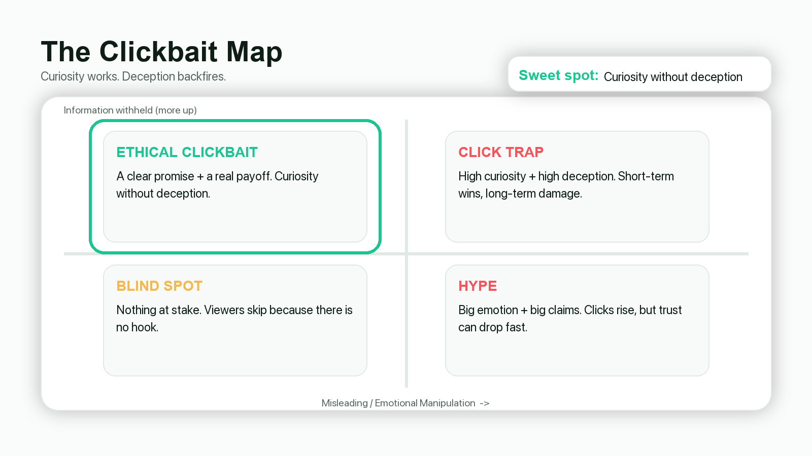
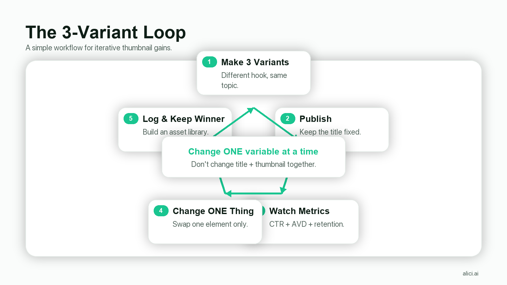

# Veritasium 怎么做出高点击 YouTube Thumbnail：从“合理标题党”到可复用的封面公式（2026）


## Key Takeaways

- **Thumbnail 的本质是“点击动机”**：不是总结视频，而是让陌生观众产生一个具体问题（为什么/怎么做到/真相是什么）。
- **信息差可以大，但误导性要低**：越靠近“吸引人但诚实”的边界，越容易拿到点击，也越能长期走得稳。
- **脸部表情是资产，不是灵感**：拍一套表情库（或用 One-Face 统一人脸），把“露脸”从创作瓶颈变成复用素材。
- **一个视频没有唯一正确的标题/封面**：合理角度有很多，关键是选“最能激起好奇、且内容能兑现”的那一个。
- **先做 2–3 个版本，再用数据迭代**：发布后按节奏替换，像做实验一样记录（一次只改一个变量）。
- **手机端可读性优先于美感**：单一焦点 + 高对比 + 少字大字，先让人“看懂”，再谈“好看”。

<!-- DIRECT_ANSWER -->
如果你想复刻 Veritasium 的高点击缩略图方法，抓住两件事就够了：

1) **把视频的核心价值压缩成一个“观众会在意的问题”**（而不是一个术语/主题名）。
2) **用封面 + 标题制造好奇心，但不跨过误导边界**；然后准备 2–3 套备选版本，发布后根据表现迭代。

一个很直观的“数据钩子”是：假设一条视频获得 100,000 次曝光，如果你把点击率提升 1 个百分点，等价于多拿到 1,000 次观看——**内容没变，只是封面更会“说话”**。
<!-- /DIRECT_ANSWER -->

## Quick Start：用 15 分钟做出 3 个“可测试版本”（Veritasium 风格）

如果你只想先把这套方法跑起来，不想一次性读完全文，可以按这个最小流程做。目标不是“做出完美封面”，而是做出 3 个彼此差异明确的候选，然后用数据去选。

### Step A：写出你的“封面一句话”（30 秒）

用这个句式写 1 句就够了：

> 观众以为是 A，但其实是 B；我会在视频里证明/解释它。

示例（你替换成自己的内容即可）：

> 大家以为缩略图拼得花就会点，但真正决定点击的是“问题感”。

### Step B：做 3 个标题角度（2 分钟）

同一条内容，至少写 3 个角度，分别对应不同观众入口：

- **结果角度**：只改封面，视频就翻盘（结果先行）
- **原因角度**：为什么“合理标题党”有效（原因先行）
- **方法角度**：怎么做出 3 个可测试版本（方法先行）

### Step C：做 3 张封面（10 分钟）

你不需要做 10 张。先做 3 张就够了，并且一次只改一个变量：

- 版本 A：表情更强（情绪钩子）
- 版本 B：主角更明确（结果/物体钩子）
- 版本 C：文字更短更狠（信息差钩子）

### Step D：用“单变量”方法迭代（2 分钟）

发布后别急着大改。你只需要决定下一轮改哪个变量：表情？主角？文字？保持其他都不变，你才能从“运气”走向“可复用”。

（后面正文会把每一步拆得更细，包括如何避免越界、如何做更科学的 A/B 测试记录。）

## 我们要学的不是“骗”，而是“让更多人愿意点进来”

在《Clickbait is Unreasonably Effective》里，Veritasium 把 clickbait 这件事讲得很现实：**如果观众不点进去，他们压根看不到你的内容**。这听起来像废话，但它解释了为什么“标题党”会在平台上自然进化——点击多的包装会被复制、放大、传播。

但他也强调：clickbait 不是单一概念。最让人反感的，是“点进去发现内容配不上承诺”的那种点击陷阱；而更值得创作者学习的，是一种更精准的包装：**吸引人，但不误导**。

这篇文章会把 Veritasium 的思路翻译成你能直接拿去做封面的流程：

- 先用一个二维框架判断“信息差”和“误导性”
- 再把它变成 4 个可复用的封面元素
- 最后给出一套“2–3 个版本 + 迭代记录”的低成本工作流

（声明：本文讨论 Veritasium 的公开视频内容，仅作学习与方法论拆解；Alici.ai 与 Veritasium 无商业关联。）

## 为什么 Veritasium 这套对科普/教育内容特别有效

很多创作者对“标题党”本能反感，尤其是科普、教程、教育类频道：你会觉得自己在做“严肃内容”，不应该用吸睛包装。

但 Veritasium 的观点其实更接近“传播学”：你做的是教育内容，不代表观众在刷推荐流时会突然变成学者。推荐流里，观众在做的不是“理性选择”，而是一个很短的判断：

- 这条看起来跟我有关系吗？
- 我现在点进去，能不能很快得到一个答案/反转/过程？
- 我会不会被浪费时间？

科普内容最常掉进的坑，是用“对作者准确、对观众无意义”的表达当入口：概念名词、领域术语、论文式标题。它们当然准确，但它们把点击门槛设得太高：只有本来就懂的人才看得见你的内容。

Veritasium 的“合理标题党”解决的就是这个矛盾：你可以保持准确性，同时把入口改成观众在意的问题。这不是为了取悦算法，而是为了让“原本不会点的人”愿意给你 30 秒时间。

换句话说：对教育向频道来说，高点击 thumbnail 不是“道德妥协”，更像“翻译工作”——把专业内容翻译成大众能立刻理解的疑问。

## Veritasium 的核心框架：把 clickbait 放到二维坐标系里

Veritasium 引用了 Wikipedia 对 clickbait 的描述：它通常带有情绪化或误导性，并通过“故意卖关子”激发好奇心，但不给完整信息。

他给出一个非常好用的分类法：把标题党（以及对应的封面）放进二维坐标系：

- **横轴：误导性 / 情绪化程度**（越右越像“骗”）
- **纵轴：为制造悬念而隐瞒的信息量**（越高越“卖关子”）

右上角是典型的“点击陷阱”：既误导、又极度藏信息；左下角则是“盲区”：平淡到没有点击动机。

真正的“甜蜜点”，在坐标系的中上部、靠近右侧边界：**信息差足够大（好奇心强），但误导性尽量低**。Brady Haran 把这种叫作“合理标题党”：听起来诱人，但并不误导。



### 把坐标系翻译成 thumbnail：3 个自检问题

做一张封面之前，先问自己 3 个问题：

1) **观众会好奇什么？**（你到底想让他产生哪个问题）
2) **你隐瞒了什么信息来制造悬念？**（缺口有多大）
3) **你有没有在“误导性”这条线越界？**（观众点进来后会不会觉得被耍）

这 3 个问题的价值在于：它会把你从“设计好看”拉回到“包装是否有效”。很多缩略图失败，不是配色不对，而是它落在盲区：

- 标题/封面只出现一个专业名词（圈外人无感）
- 画面塞得很满，但没有一个明确的问题
- “我做了 X”这种自我叙事，对陌生观众没有点击理由

### 把“卖关子”变成可控的好奇缺口：3 种常见缺口

所谓“信息差”不是胡乱藏信息，而是你要非常清楚：你让观众缺的究竟是哪一块。

你可以把好奇缺口分成三类（科普/教程尤其好用）：

1) **缺“原因”**：观众看到了结果，但不知道为什么
   - 关键词：为什么、如何、原来是因为……
   - 适合：解释类、原理类、辟谣类

2) **缺“后果”**：观众看到了一个动作/选择，但不知道会发生什么
   - 关键词：如果……会怎样、最后发生了什么
   - 适合：实验类、测试类、挑战类

3) **缺“关键变量”**：观众以为决定因素是 A，但你暗示其实是 B
   - 关键词：真正、其实、你以为、不是……
   - 适合：反直觉内容、纠错内容、方法论内容

三类缺口都很“点击”，但也都很容易越界。越界的信号通常不是“夸张”，而是你在封面上暗示了一个视频里根本没有给到的结论或画面。

一个实用的自检方法是：把封面/标题当成一句承诺，问自己——“如果观众只看前 60 秒，是否已经能确定我会兑现？”如果答案是否，那你就已经在往“点击陷阱”那一侧滑了。

## Veritasium 的三个改标题/改封面案例：从“盲区”到“可点”

看完框架以后，最有价值的是看“他怎么改”。Veritasium 在视频里提到的几个例子，都非常适合当作你自己的改稿模板。

### 案例 1：从“马格努斯效应的奇怪用法”到“从水坝上扔下的篮球”

他提到自己最火的视频讲的是把回旋的篮球从水坝上扔下去，内容在外部网站被大量转载，但在 YouTube 平台内部表现并不好。原因之一，是他最初给的标题和封面过于“学术化”：它能描述主题，但很难让陌生观众在 1 秒内产生画面和好奇。

后来有人重投并换了更聪明的标题（例如“从水坝上扔下的篮球”），在 YouTube 上获得了数千万观看。

你该抄的不是这个具体标题，而是它背后的改写逻辑：

- 把“概念名词”换成“具体物体 + 具体动作”
- 让观众在没点进来之前，就已经能脑补一个画面
- 让好奇缺口落在“结果/过程”（会发生什么）而不是“术语解释”

### 案例 2：同一个视频，换标题/封面后“立刻有起色”

他举了一个更极端的例子：一条关于小行星的话题视频，最初的标题和封面改了几次都没起色；到第三天他把标题与封面换成更能激起好奇、同时仍然准确的版本（例如“这些小行星撞击地球，才是我们真正该担心的”），视频表现出现明显上升。

这个例子最值得学的是两点：

- 你不是在找“更夸张”，你是在找“更贴近观众的担心点”
- 你只需要把“问题”换个角度说，就能把同一内容变成更好点的入口

### 案例 3：不做标题党也能增长：把标题改得更清晰、更具体

他也提到：对一些老视频，只是把标题从“看起来很奇怪、对大多数人无意义”的写法，改成更清晰、更精确的表达，播放量就可能出现增长。这个提醒很重要：并不是所有优化都要变得更“悬念”，有时候你缺的是“让观众一眼看懂你在讲什么”。

如果你正在做教程/科普，尤其要记住这个顺序：先清晰，再悬念。清晰解决“可理解”，悬念解决“可点击”。

## Veritasium 的可复制细节 1：把“表情”当作可复用资产库

视频里有个很重要、但常被忽略的生产细节：他们会专门拍一组“适合封面”的表情，挑出最好的，并存成素材库，后期再做微调。

你可以从这里得到一个很务实的结论：**表情不是灵感，是库存**。

对经常露脸的创作者来说，这个动作会立刻降低成本：

- 你不需要每条视频临场挤表情
- 你只要一次性解决“在封面上好看、可读、能传递情绪”的人脸
- 之后做的只是：选一张表情、裁切放大、配合主题文本/道具


### 最小可行方案：10 分钟拍一套“封面表情库”

你不需要摄影棚。你只需要“统一”和“可复用”：

- **固定机位**：手机 + 三脚架，镜头高度略高于眼睛
- **固定光线**：窗边自然光或一盏补光灯，避免强阴影
- **固定背景**：越干净越好（纯色墙面就够）
- **固定裁切思路**：预留额头与下巴空间，方便后期放大裁

表情建议从“能让陌生观众一眼读懂”的开始：震惊、困惑、怀疑、兴奋、害怕、恍然大悟。一次拍 30–50 张，按情绪分文件夹。

如果你不想拍、或者你需要更强的“一致性”，可以把这一步交给工具：

- **One-Face（Alici.ai）**：上传 1 张照片，让所有缩略图自动统一使用你的脸——AI还会协助你完成“问题”挖掘和“构图”设计。

## 可复制细节 2：一个视频没有“唯一正确”的标题/封面

Veritasium 强调了一个反直觉但很重要的事实：**任何一个视频，都不存在唯一准确的标题和封面图**。

同一条内容，可以合理地从不同角度命名：

- 从机制角度：解释为什么/原理是什么
- 从体验角度：我做了什么、发生了什么
- 从结果角度：最意外的发现是什么
- 从问题角度：观众真正关心的疑问是什么

而“最有诱惑力（但合理）”的那一对标题/封面，往往会非常接近“点击陷阱”的边界——这也是为什么很多优质内容最后都学会了更会包装。

### 关键不是“最准确”，而是“最准观众想点的那个问题”

你不需要纠结“这张封面是不是最准确”。你更应该问：

- 这张封面能不能让陌生观众在 1 秒内明白：**点进去会得到什么**？
- 这张封面能不能让观众产生一个具体问题：**为什么会这样/怎么做到/真相是什么**？
- 你的内容能不能在前 30–60 秒兑现这个问题（payoff）？

如果三个问题里至少有两个是否，就算封面再“严谨”，也可能落在盲区。

## 可复制工作流 3：先做 2–3 个版本，把它当成实验

Veritasium 提到，YouTube 引入更实时的度量指标后，创作者会进入“发布后迭代”的状态：不断更换封面，看哪套对点击率更友好。

他也举过非常典型的例子：视频内容不变，仅替换标题和封面，就让播放表现出现数量级差异；并且就算是大频道，也不能保证一次选中最佳方案——甚至 MrBeast 也会做多套备选，再根据表现迭代。



### 小频道怎么做“低成本版本测试”？

你可能没有 YouTube 的实验功能，但你仍然能用一个低成本方法做出接近的效果：

1) **发布前准备 2–3 套封面**（只变一个变量：表情/文字/主体）
2) **发布后按节奏替换**（例如 24–48 小时一轮，固定时间点观察）
3) **记录变化趋势**：曝光、点击率、前 30 秒留存（如果你能看到）

关键原则：不要一小时换一次。过密的切换会让你看不清趋势，也会把复盘变成玄学。

## Hook Matrix：把“点击动机”拆成 4 种可测试钩子

关键思路：别在同一轮测试里同时改“概念”和“风格”。否则你永远不知道到底是哪件事带来的变化。

把这个思路迁移到 thumbnail，你可以先把“钩子”拆成 4 类，每次只测试其中一类：

1) **情绪钩子（Emotion Hook）**：靠表情/情绪把注意力拉过来
   - 画面：脸部表情 + 极简背景
   - 文案：1–3 个词（“WAIT…”, “NO WAY”, “WHY?”）
   - 风险：表情强但问题不清晰，会变成“像在演戏”

2) **结果钩子（Result Hook）**：先给结果预告，让人想看过程
   - 画面：结果画面/对比画面（前后/好坏/成败）
   - 文案：少字，强调结果而不是步骤
   - 风险：结果如果不可视化，别硬做“结果图”，会显得假

3) **知识钩子（Knowledge Hook）**：暗示“你不知道的关键变量”
   - 画面：一个关键物体/关键词被强调（圈、箭头、遮挡都可以）
   - 文案：指向变量（“NOT THIS”, “THE REAL REASON”）
   - 风险：越界点在于暗示了视频里没有的结论

4) **对比钩子（Comparison Hook）**：让观众参与判断
   - 画面：A vs B（两个元素、两个选择、两个结果）
   - 文案：更像问题而不是答案（避免“剧透式赢家”）
   - 风险：对比对象不在同一维度，会让人困惑

你不需要每条视频都用 4 类。关键是：当你要做 2–3 个版本时，你至少要明确“这三张分别在测什么”。

## 把 Veritasium 思路变成“封面公式”：4 个必选元素

当你不知道从哪下手时，用这 4 个元素把封面从“好看”拉回到“有效”。

### 1) 一个明确的“问题主语”（观众要看的是谁/什么）

封面里必须有一个主角：

- 你（人脸 + 情绪）
- 一个关键物体（设备、道具、实验对象）
- 一个结果画面（前后对比、异常现象、破坏性结果）

如果你的封面有两个主角在抢戏，观众的注意力会被撕裂。记住：你只有 1 秒。

### 2) 一个清晰的“冲突/反差”（为什么值得点）

反差不是夸张，它可以来自任何一种“直觉被挑战”：

- 你以为是 A，但其实是 B
- 你担心的不是 X，而是 Y
- 看起来不可能，但真的发生了

当你找不到反差时，多半是你还没找到“观众真正会在意的问题”。

### 3) 一句手机端能读懂的短文本（或干脆不放字）

封面文字的目标不是讲完内容，而是给出“点击理由”。

如果你需要更系统的“少字、大字、强对比”的最佳实践清单，可以内链这篇：

- https://alici.ai/blog/how-to-make-youtube-thumbnails-best-practices-2026

### 4) 一个能兑现的 payoff（让观众不觉得被耍）

高点击≠长期高表现。观众点进来后的体验，会反过来影响推荐。

你可以把它当成一个契约：

- 标题/封面负责提出问题（promise）
- 视频开头 30–60 秒负责让观众确信“这个问题会被回答”（payoff setup）
- 视频中段负责兑现（payoff）

当你把 promise 做得很强，但 payoff 很弱，你就会往“点击陷阱”那一侧滑。

## 把标题和封面配对：同一个问题，标题负责“说清”，封面负责“让人想点”

很多人做封面只是在“配图”，于是经常出现一种尴尬：标题讲的是 A，封面表现的是 B，观众在推荐流里读到的信息彼此打架。

更有效的方式是：先确定“一个问题”，再让标题和封面分工合作。

- **标题**：把问题说清楚一点点，让观众知道自己点进去不会被浪费时间
- **封面**：把问题的情绪、冲突、反差视觉化，让观众觉得“我得点进去”

你可以用一个很简单的“翻译表”把文本变成画面（不是死规则，是为了避免你卡住）：

| 你想让观众问的问题 | 标题写法（更清楚一点） | 封面写法（更想点一点） | 画面主角建议 |
|---|---|---|---|
| 为什么会这样？ | “X 发生的真正原因是 Y” | “WHY?” / “HOW?” + 强反差画面 | 结果画面 + 你的表情 |
| 如果我这么做会怎样？ | “我做了 X，发生了 Y” | “I DID THIS…” + 结果预告 | 前后对比 / 极端结果 |
| 你以为是 A，其实是 B？ | “大家以为是 A，但真正决定的是 B” | “NOT A” / “IT’S B” | 两个元素对比（A vs B） |

这张表的重点不在于照抄，而在于你会立刻发现：你到底是没找到“问题”，还是没找到“画面主角”。只要其中一个缺失，你就会在封面制作阶段反复纠结字体、颜色、装饰，却很难提升点击动机。

## 10 分钟实操：用 1 条脚本做出 3 张可测试封面

下面这套流程适合每条视频复用（尤其适合教程、科普、评测）。

### Step 1：把内容压缩成一个“陌生观众也在乎的问题”

不要从“我做了什么”开始，从观众的好奇开始。你可以用这些句式触发问题：

- “为什么会这样？”
- “怎么做到的？”
- “真相是什么？”
- “你担心的其实不是这个？”
- “最危险/最关键的不是你以为的那个？”

如果你只能写出一个学术名词，那说明你还停留在“盲区表达”。

一个更硬核、但非常有效的技巧是：把你的脚本开头 60–90 秒复制出来，只做一件事——圈出“观众会在意的动词”和“可视化的名词”。比如：

- 动词：翻车、失效、暴涨、失败、证明、揭穿、解释、对比
- 名词：一张图、一个装置、一段实验、一个结果、一组对比

thumbnail 不是对脚本全文的总结，而是从脚本里挑一个“最像海报”的瞬间，再把它变成问题。你把“名词”找出来，封面主角就不再抽象；你把“动词”找出来，冲突点就不再靠想象。

### Step 2：写 3 条标题（同一内容，不同角度）

给自己一个硬性约束：至少写 3 条。你可以这样分工：

- **解释型（偏准确）**：解释 X 背后的原因
- **体验型（偏代入）**：我做了 X，结果发生了 Y
- **反直觉型（偏吸引）**：你以为是 X，其实是 Y

你会发现：你不是在“变得更标题党”，你是在寻找“更适合陌生观众的入口”。

这里有一个很实用的约束：**每条标题必须带一个可被验证、可视化的名词**。比如“零重力飞机”比“物理学”更能让人产生画面；“从水坝扔下的篮球”比“马格努斯效应”更具体。

当你强迫自己加入可视化名词，你的封面构图会自动变得简单：主角是谁、放多大、背景留多少空、文字要不要放，都更好决定。

反过来，如果标题里全是抽象名词（“机制”“原理”“方法论”“系统”），你就会在封面制作阶段不停补救：加更多字、加更多图标、加更多小元素，结果往往更乱、更不可读。

### Step 3：做 3 张封面（一次只改一个变量）

给每张封面一个明确的变量：

- 版本 A：表情更强（情绪）
- 版本 B：物体更大（主角）
- 版本 C：文字更短更狠（信息差）

只改一个变量的好处是：你能清楚知道“到底是哪一件事在起作用”。

如果你做完 3 张仍然“感觉都一般”，很可能不是设计问题，而是你缺少一个清晰的“冲突点”。这时候不要在字体上打磨两个小时，回到更上游：重新写问题。

你可以用两个问句逼自己把冲突写出来：

- 观众原本以为会发生什么？
- 但实际发生了什么？

把这两句写清楚，你就知道封面该放“预期”和“现实”的哪一个，以及文字到底要强调“预期被打破”，还是强调“真实结果有多离谱”。

### Step 4：发布后迭代（像做实验一样复盘）

- 固定观察窗口（例如每天同一时间）
- 每次只换一个版本
- 记录：曝光、点击率、前 30 秒留存（如果你能看到）

你可以把复盘写得非常简单，甚至像一个表格笔记就够了：

| 日期 | 版本 | 改动点 | 你当时的假设 | 结果（趋势） | 下一步 |
|---|---|---|---|---|---|
| Day 1 | A | 表情更强 | 情绪更抓眼 | CTR 上升/下降 | 保留/换 B |
| Day 2 | B | 主体更大 | 一秒更看得懂 | CTR 上升/下降 | 保留/换 C |
| Day 3 | C | 文字更短 | 信息差更清晰 | CTR 上升/下降 | 合并/重做 |

长期做下去，你会积累出属于自己赛道的“有效模式”。这比抄任何模板都更值钱。

## BONUS：不用设计软件，也能快速产出 6 个可测试版本（用 Alici.ai）

invideo 的 How-to 文章常见一个套路：先把传统方法教完（建立专业度），再给一个“更快的替代方案”（不否定传统方法，但把转化入口放到“读者刚好需要”的位置）。

把它迁移到 thumbnail 的场景也很自然：当你已经知道“要做 2–3 个版本去测试”，真正卡住你的往往不是策略，而是产能。

你可以用 Alici.ai 的 YouTube Thumbnail Expert 把“多版本”从一件耗时的设计工作，变成一个几分钟的迭代循环：

1) **选择输入方式**（推荐从最贴近内容的开始）
   - 你有脚本/提纲：用 “Script → Thumbnail”
   - 你有对标参考：用 “URL Reference”
   - 你想统一人脸：先设置 “One-Face”

2) **把输入写成“问题 + 冲突 + 主角”**（别只写主题）
   - 问题：观众会问什么？
   - 冲突：你以为 A，但其实是 B
   - 主角：我希望封面里最大、最清楚的是什么？

3) **一次生成 6 个版本，并明确分组**
   - 3 个偏“反直觉”（测试信息差角度）
   - 3 个偏“结果预告”（测试结果钩子）

4) **从 6 选 2–3 个，再去做发布后迭代**
   - 这一步你不是在选“最好看”，你在选“最像一个问题、且内容能兑现”的

如果你不知道怎么写输入，可以直接复制这个“最小模板”（把方括号替换掉即可）：

```text
Video topic (one sentence):
[用一句话说清你的视频在讲什么]

Curiosity question:
[观众会问的一个问题：为什么/怎么做到/真相是什么/真正原因是什么]

Conflict / contrast:
People think [A], but actually [B].

Main visual subject:
[你的脸 / 一个关键物体 / 一个结果画面]

Text candidates (2-4 words each):
1) [短词1]
2) [短词2]
3) [短词3]

Constraints:
- Create curiosity but do NOT imply conclusions that aren't in the video.
- Generate 6 variants: 3 counterintuitive, 3 result-focused.
- Keep text under 4 words and readable on mobile.
```

这个模板的意义在于：它把“策略”写在最前面，把“画面”放在最后。你会发现 AI 生成的差异变得更可控，你也更容易做单变量测试，而不是在一堆随机风格里挑“看着顺眼的”。

想直接开始的话，产品页在这里：

- https://alici.ai/youtube-thumbnail

## 反向拆解练习：把“盲区标题”改成“合理标题党”

下面给你一个很实用的改写方法：

1) 先写一个最准确但很无聊的标题（盲区）
2) 再写一个观众会在意的问题（入口）
3) 最后写一个“诱人但诚实”的版本（甜蜜点）

示例（你可以替换成自己的内容）：

- 盲区：“角谷猜想”
  - 入口：“这道看似简单的数学题为什么没人能证明？”
  - 甜蜜点：“一个小学生也能懂的数学问题，为什么困住了数学家？”（内容能兑现就合理）

- 盲区：“小行星撞击：我们能做什么”
  - 入口：“真正需要担心的不是‘小行星撞击’本身”
  - 甜蜜点：“这些小行星撞击地球，才是我们真正该担心的”（信息差强，但不必撒谎）

- 盲区：“马格努斯效应的奇怪用法”
  - 入口：“从水坝扔下一个篮球，会发生什么？”
  - 甜蜜点：“从水坝上扔下的篮球”（更具体、更可视化）

你会发现：所谓“变得更会点击”，很多时候只是**变得更具体、更贴近观众的语言**。

## 快速自测：你做的封面在手机上真的“读得出来”吗？

很多封面在 Photoshop 里看起来很酷，但在推荐流里会死得很快。原因非常朴素：观众根本读不出来你想说什么。

你可以用这 5 个小测试把问题暴露得很快（不需要任何工具）：

1) **一秒测试**：把封面缩到手机宽度，快速瞟一眼，能不能说出“主角是谁 + 我被引导去好奇什么”。
2) **眯眼测试**：眯眼或拉远距离看，主角是否仍然是画面里最亮、最大、最清楚的东西。
3) **灰度测试**：把封面转成黑白，你的主角是否仍然突出（对比是否足够）。
4) **字数测试**：把文字减半后，封面是否更好（多数情况下会）。
5) **裁切测试**：想象它被裁掉四周 10% 后，关键信息是否还在。

如果你在这些测试里频繁失败，通常不是你不会设计，而是你在封面上塞了太多信息。回到最底层原则：单一焦点。把“观众要好奇的那件事”做成主角，其他都应该为它让路。

## 技术规格别踩坑：尺寸、文件大小、裁切安全区

很多 thumbnail 的“糊”和“字看不清”，并不是设计审美问题，而是规格与压缩问题。

最关键的规格（以及 Shorts 的尺寸建议）可以直接看这篇：

- https://alici.ai/blog/youtube-thumbnail-size-2026

你可以先记住 3 个实操点：

- **先在手机上预览**：电脑上看清楚不算数
- **让文字在 10% 屏幕宽度以内也可读**：不行就删字
- **预留裁切空间**：重要元素尽量居中，避免贴边

再补充 6 个更“细节但救命”的建议（很多人就是卡在这些小地方）：

1) **文字要么大到离谱，要么干脆不要**：中间尺寸最危险，既占空间又读不清。
2) **给文字加描边/投影**：不是为了花哨，而是为了抵抗推荐流里各种背景干扰。
3) **别迷信 4K**：清晰度主要来自“对比”和“简洁”，不是像素堆砌。
4) **主体边缘要干净**：如果抠图边缘毛糙，观众会下意识把它归类为“廉价内容”。
5) **颜色更少更好**：一张封面 2–3 个主色足够，越多越像海报墙。
6) **先黑白、后彩色**：黑白下你都能读懂，再上色才不会变成“彩色噪音”。

如果你想把“可读性”做成一个可执行的标准，可以把这一段当成一个小 KPI：每次做完封面，都强迫自己删掉一个元素（一个图标、一行字、一个背景纹理）。能删说明它不是主角；删完更强，说明你找对了主角。

## 常见错误与快速修复：10 分钟救回一张“看起来很努力，但没人点”的封面

下面这些问题几乎是所有创作者都会踩的坑。你不需要重做，只要按顺序修一遍，封面往往就能从“能看”变成“能点”。

### 错误 1：主角不明确（画面里没有最重要的东西）

表现：你放了人物、放了道具、放了背景，结果三者差不多大。观众看不出你想让他先看哪里。

修复：只做一件事——把主角放大到让你自己都觉得“有点夸张”。然后把其他元素整体变暗/模糊/缩小，让主角成为第一眼能看懂的东西。

### 错误 2：文字在解释，而不是在制造问题

表现：封面文字像摘要，比如“本视频将介绍……”。它很认真，但没有点击动机。

修复：把文字改成“观众会问的问题”，而不是“作者要讲的主题”。你可以先写成问句，再改成更短的陈述句。

### 错误 3：反差不够（封面没有“为什么值得点”）

表现：封面看起来就是一个正常的截图或正常的合影，没有冲突、没有反直觉、没有未知。

修复：从脚本里找一个“转折点”或“结论句”，把它变成封面信息差：你以为 A，但其实是 B；真正要担心的不是 X，而是 Y。

### 错误 4：太相信观众会读小字

表现：你在封面上堆了很多补充说明，字很小，电脑上看得清，手机上几乎不可见。

修复：删到只剩一句话。你可以把剩下的解释移到标题里，让标题和封面分工。

### 错误 5：风格不稳定，观众记不住你

表现：每条视频封面都像换了一个频道，观众很难形成“我见过你”的熟悉感。

修复：固定 1–2 个“不会影响点击动机，但能形成识别”的元素：比如固定的字体风格、固定的边框、固定的色系、固定的人脸裁切比例。稳定不是重复，而是让观众一眼知道“这是你的”。

做完这 5 步后再回到前面的“5 个小测试”，你会很快发现：封面变得更简单、更像一个问题、更像一个承诺。

## 用 Alici.ai 把 Veritasium 方法变成可批量产出的流程

Veritasium 的方法论最难的不是“懂”，而是“每次都做得出来”。当你需要稳定地产出 2–3 个可测试版本时，制作成本会成为真正的瓶颈。

Alici.ai 的 YouTube Thumbnail 产品把这件事拆成了几个可以规模化的输入方式（适合 YouTuber）：

- **AI 快速生成**：从一个想法直接生成多张可测试封面
- **Script → Thumbnail**：把脚本/大纲丢进去，让封面更对齐内容承诺
- **URL Reference**：粘贴参考视频 URL，生成类似风格的封面方向
- **One-Face**：上传 1 张照片，让缩略图使用你的脸

### 你该怎么写输入，才会得到“更像 Veritasium 的问题感”？

大多数人用 AI 工具做封面时，输入写得太“主题化”：比如“做一个关于量子力学的缩略图”。这会让输出变得像海报，而不是像问题。

更有效的写法，是把输入写成“承诺”+“冲突”+“主角”。你可以直接照这个格式写：

- **视频一句话**：我在视频里做了什么 / 解释了什么？
- **观众会在意的冲突**：大家以为是 A，但其实是 B（或：真正要担心的不是 X，而是 Y）
- **封面主角**：你的人脸/一个关键物体/一个结果画面
- **封面短文案候选（3 个）**：每个 2–4 个词，尽量像问题

这样写的好处是：你在输入阶段就已经决定了“信息差在哪”，AI 只是在帮你生成不同的视觉实现，而不是替你想策略。

### Script → Thumbnail：把“兑现承诺”写进封面

如果你的视频是教程/科普，这个功能特别适合你做“合理标题党”，因为它会逼你对齐内容承诺。建议你不要把整篇脚本全丢进去，而是丢这些更关键的片段：

- 开头 60–90 秒（你如何提出问题、如何承诺会解决）
- 中段 3 个关键结论句（每句 1 行即可）
- 一个“最好画面化”的瞬间（例如一个结果、一个对比、一个反转）

### URL Reference：用“结构参考”，不要用“照抄”

你想借助 Veritasium 的品牌力和赛道认知是合理的，但最稳妥的方式是“参考结构”，而不是“复刻某一张图”。

所谓结构参考，就是你在输入里明确你想借鉴的：单一焦点、强对比、极简文字、表情驱动、结果画面驱动。你可以把参考 URL 当作“风格锚点”，然后把自己的主角和问题换进去。

### One-Face：把“风格稳定”变成默认设置

当你开始做多版本测试时，“人脸一致性”会成为隐形成本：每次换封面都要重新找表情、重新裁切、重新调色。

One-Face 的价值在于：你把“人脸”这件事固定下来，测试就能更聚焦在变量上（文字/主角/构图），而不是每次都在重做头像海报。

一个简单、但非常实用的落地工作流是：

1) 把脚本（或开头 60 秒的讲稿）丢进 Alici.ai
2) 让它生成设计方案（不同表情/文本/构图）
3) 选出你觉得“准确但诱人”的候选
4) 发布后按节奏替换版本，做轻量测试

产品页在这里（本文所有导流统一用这个链接）：

- https://alici.ai/youtube-thumbnail

如果你还想对比一下“有哪些 AI thumbnail 工具、怎么选”，可以内链：

- https://alici.ai/blog/best-ai-youtube-thumbnail-makers-2025

## 结论：把 thumbnail 当成“问题”，而不是“海报”

Veritasium 这条视频最大的价值，是把 thumbnail 从“美术作业”拉回到“传播机制”。你要做的不是把内容缩成一张海报，而是让观众在 1 秒内产生一个清晰问题，并相信你会兑现。

如果你愿意把封面当成可迭代的实验：先做 2–3 套备选、一次只改一个变量、用固定窗口观察趋势，你会很快从“凭感觉”进化到“可复用”。

## CTA Card

**想把这套方法变成稳定产能？**

- 用 “Script → Thumbnail” 让封面与内容承诺对齐
- 用 “URL Reference” 快速做出风格接近的候选版本
- 用 “One-Face” 一次性解决人脸一致性

现在就试试：https://alici.ai/youtube-thumbnail

## FAQ

### Q1：Clickbait 会不会被 YouTube 惩罚？
如果你的标题/封面长期“高点击但低兑现”（观众很快退出、强烈负反馈），它更像“点击陷阱”，会拖累整体表现。Veritasium 讨论的是“吸引人但诚实”的包装。

### Q2：封面一定要放人脸吗？
不一定，但“人脸 + 清晰情绪”在很多赛道更容易抓注意力。更重要的是：你必须有一个单一清晰的焦点（人脸只是最常见的焦点）。

### Q3：封面上放多少字合适？
越少越好，优先保证手机端可读。你可以先做一版“只放 2–4 个词”的极简版本，再做一版“多一点解释”的版本，发布后测试。

### Q4：我应该多久换一次封面？
不要频繁切换。更像做实验：固定窗口观察（例如 24–48 小时一轮），一次只换一个版本，留足时间看趋势。

### Q5：Shorts 的封面要不要单独做？
如果你的 Shorts 主要来自移动端，建议单独考虑竖版构图与安全区。尺寸建议与注意事项见本文的“尺寸”内链。

### Q6：我没有设计基础，怎么开始做第一张“合理标题党”封面？
从“问题 + 反差”开始：把视频的核心好奇写成一句短文本，然后配一个清晰的单焦点主体。需要快速出多版本，就先用工具生成变体，再挑最符合内容承诺的那张。

## Source Attribution

- Veritasium YouTube: *Clickbait is Unreasonably Effective*（本文方法论拆解的主要来源）
- 内链参考：
  - https://alici.ai/blog/how-to-make-youtube-thumbnails-best-practices-2026
  - https://alici.ai/blog/youtube-thumbnail-size-2026
  - https://alici.ai/blog/best-ai-youtube-thumbnail-makers-2025
- 产品页：https://alici.ai/youtube-thumbnail
