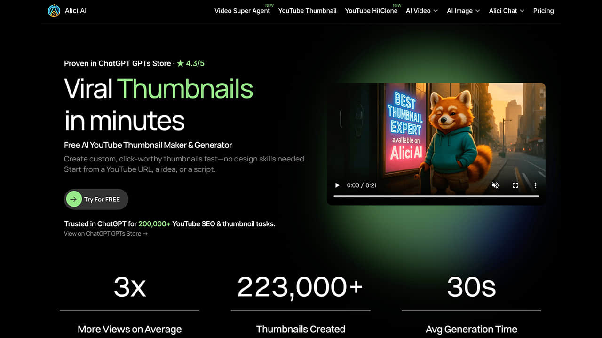
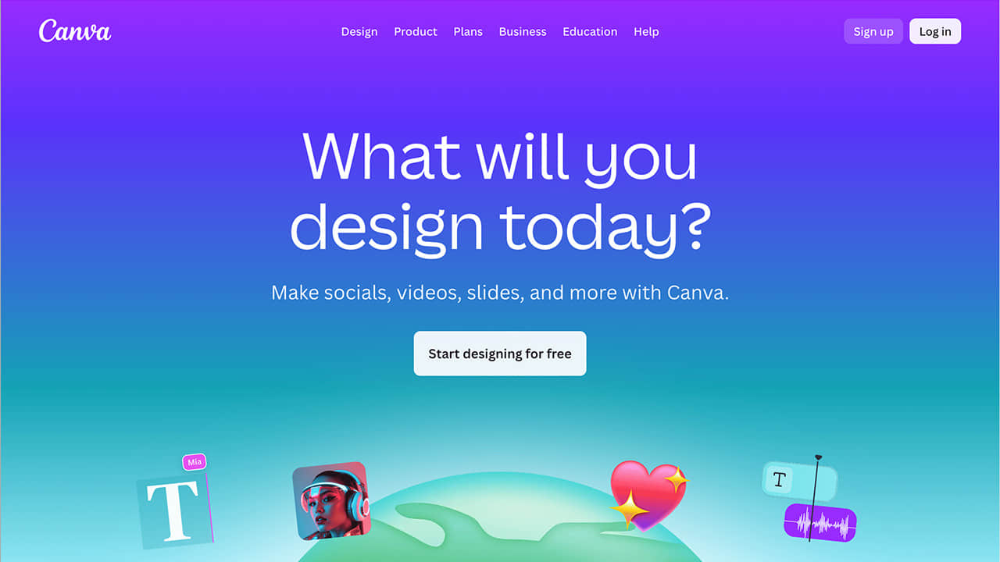
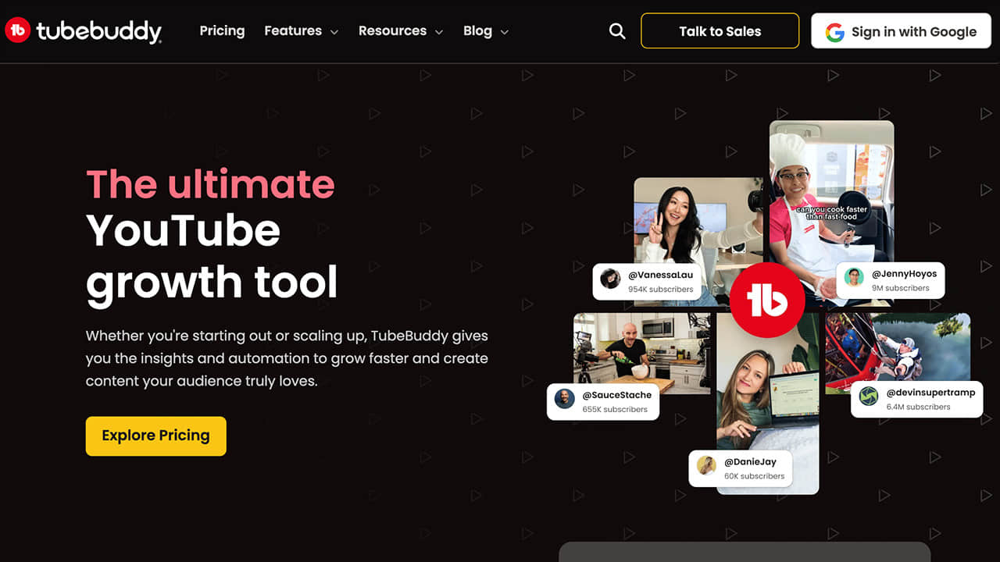
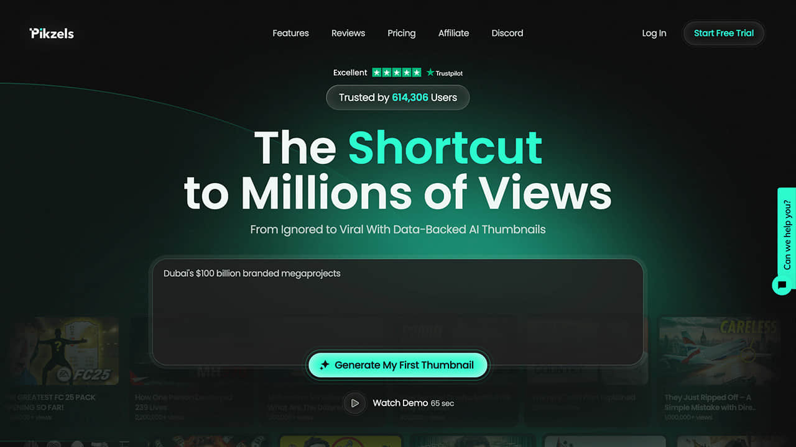

Title: Best AI YouTube Thumbnail Makers in 2025 | Top 4 Tools Compared - Alici.AI

URL Source: https://alici.ai/blog/best-ai-youtube-thumbnail-makers-2025

Markdown Content:
###### TL;DR

###### Discover the best AI YouTube thumbnail makers in 2025. Compare Alici, Canva, TubeBuddy, and Pikzels for features, pricing, and use cases to boost your video CTR by up to 40%.

Creating thumbnails that drive clicks requires balancing visual impact, brand consistency, and psychological engagement. AI thumbnail makers streamline this process, enabling creators to generate professional thumbnails in minutes rather than hours. With 90% of top-performing YouTube videos using custom thumbnails, choosing the right AI tool can significantly impact your channel's growth.

We've tested and compared the leading AI thumbnail makers available in 2025 to help you find the perfect solution. Our selection criteria include ease of use, output quality, pricing, and feature set. Whether you're a solo creator or running a production agency, this guide has you covered.

**Want to create professional YouTube thumbnails instantly?**[alici.ai](https://alici.ai/) offers AI-powered thumbnail generation that accepts video scripts, ideas, or YouTube URLs to produce click-worthy designs.

###### **Why AI Thumbnail Makers Matter in 2025**

The YouTube algorithm heavily weighs click-through rate (CTR) when recommending videos. A compelling thumbnail can make the difference between a video going viral or getting buried. Traditional thumbnail creation requires design skills, expensive software, and hours of work. AI thumbnail makers have changed this landscape:

*   **Speed**: Generate professional thumbnails in seconds instead of hours

*   **Consistency**: Maintain brand identity across all videos automatically

*   **Testing**: Create multiple variants for A/B testing to optimize CTR by 20-40%

*   **Accessibility**: No design expertise required to produce professional results

###### **1. Alici YouTube Thumbnail Expert**

**Core Feature**: AI-powered thumbnail generator that accepts multiple input formats including video scripts, ideas, or YouTube URLs, producing multiple testable variants in single sessions.

**Best For**: Solo creators needing rapid, professional thumbnails without design expertise. The tool has completed over 200,000 thumbnail tasks according to its ChatGPT store listing.

**Key Advantages**:

*   Accepts multiple input formats for maximum flexibility

*   Maintains face consistency across thumbnails for brand recognition

*   Agent-guided iteration until you're completely satisfied

*   Free tier available for getting started

**Considerations**: Best results come from providing detailed input about your video content and target audience.

**Pricing**: Free tier available; paid plans start at $9.90/month (credit-based)

###### **2. Canva**

**Core Feature**: Drag-and-drop editor with thousands of YouTube thumbnail templates and AI-powered design suggestions.

**Best For**: Design-oriented creators who prioritize full creative control and need cross-platform branding consistency.

**Key Advantages**:

*   Extensive template library with thousands of options

*   Works across multiple social platforms for unified branding

*   Team collaboration features for agencies and teams

*   Brand kit tools available in Pro tier

**Considerations**: Requires more manual design work compared to fully automated AI tools.

**Pricing**: Free plan available; Pro at $12.95/month (annual) or $14.99/month (monthly)

###### **3. TubeBuddy**

**Core Feature**: Thumbnail analyzer with AI-powered heatmaps, A/B testing capabilities, and predictive CTR scoring integrated directly into YouTube Studio.

**Best For**: Data-driven creators focused on testing and optimizing existing thumbnails rather than generating from scratch.

**Key Advantages**:

*   AI-powered heatmaps showing where viewers look first

*   Built-in A/B testing to compare thumbnail performance

*   Predictive CTR scoring before publishing

*   Seamless YouTube Studio integration

**Considerations**: Better suited for optimization than initial thumbnail creation.

**Pricing**: Free plan available; Pro at $4.99/month; Legend at $24.99/month

###### **4. Pikzels**

**Core Feature**: Prompt-to-thumbnail generation in just 30 seconds with FaceSwap and Persona training for maintaining character consistency.

**Best For**: High-volume producers and agencies with budget for premium features and need for rapid bulk creation.

**Key Advantages**:

*   Ultra-fast 30-second generation time

*   FaceSwap feature for placing yourself in any scene

*   Persona training for consistent character appearance

*   Video title suggestions included

**Considerations**: Higher price point compared to other options.

**Pricing**: $20-$80/month (credit-based)

###### **Technical Requirements for YouTube Thumbnails**

Regardless of which tool you choose, your thumbnails should meet YouTube's specifications:

*   **Resolution**: 1280×720 pixels (minimum 640px width)

*   **Aspect ratio**: 16:9

*   **Formats**: JPG, GIF, or PNG

*   **File size**: Under 2MB

###### **How to Choose the Right AI Thumbnail Maker**

**For Solo Creators on a Budget:**

If you're just starting out or need an affordable solution, Alici's free tier or Canva's free plan provide excellent value. Both offer professional results without monthly investment.

**For Data-Driven Optimizers:**

If you already have thumbnails but want to improve CTR through testing, TubeBuddy's analytics and A/B testing features are unmatched. The predictive CTR scoring helps you choose winners before publishing.

**For High-Volume Production:**

Agencies and channels producing multiple videos daily benefit from Pikzels' 30-second generation and batch processing capabilities, despite the higher price point.

**For Brand Consistency:**

If maintaining visual identity across hundreds of thumbnails is critical, Alici's face consistency feature and Canva's brand kit tools ensure recognition across your content library.

###### **Conclusion**

The right AI thumbnail maker depends on your specific needs, budget, and workflow. After comparing these four leading options, our recommendations are:

*   **Alici** - Best overall for solo creators seeking speed and quality

*   **Canva** - Best for design control and cross-platform branding

*   **TubeBuddy** - Best for optimization and A/B testing

*   **Pikzels** - Best for high-volume production needs

With A/B testing improving CTR by 20-40%, investing in the right thumbnail tool pays dividends in channel growth.

**Ready to create thumbnails that drive clicks?**[Try Alici's AI Thumbnail Expert](https://alici.ai/youtube-thumbnail) and generate professional, click-worthy thumbnails in minutes.
