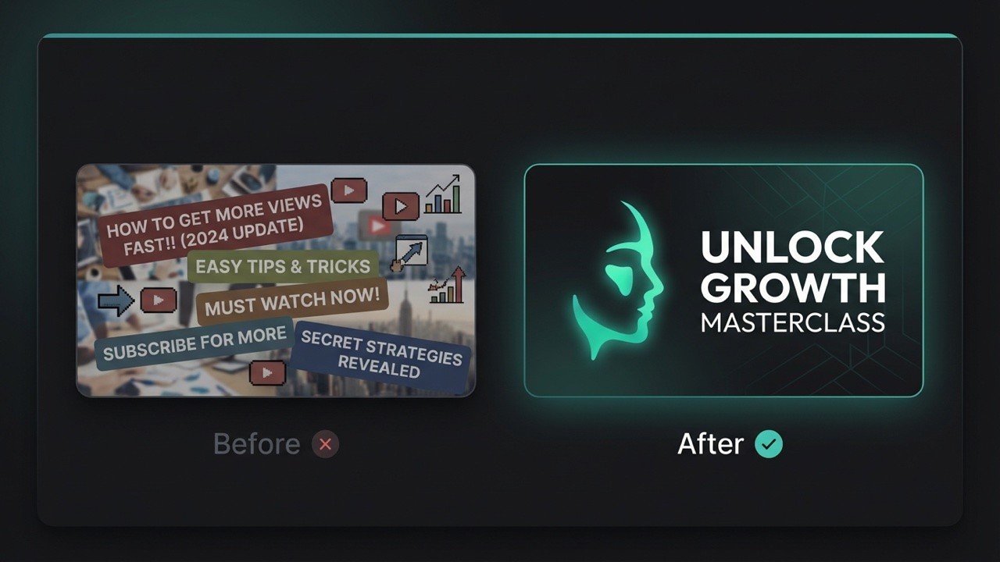
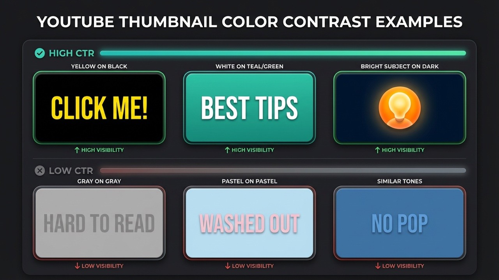

Title: How to Make YouTube Thumbnails: 10 Best Practices 2026 - Alici.AI

URL Source: https://alici.ai/blog/how-to-make-youtube-thumbnails-best-practices-2026

Published Time: Wed, 28 Jan 2026 13:09:40 GMT

Markdown Content:
###### TL;DR

###### Creating effective YouTube thumbnails requires three core elements: a single clear focal point, high-contrast colors, and bold text under 4 words. Research shows 90% of top-performing videos use custom thumbnails, faces with emotion boost CTR by 20-30%, and thumbnails with fewer than 4 words achieve 30% higher click rates.

**What makes a YouTube thumbnail get clicks?** Three design fundamentals: a single clear focal point, high-contrast colors, and bold text under 4 words.

According to [YouTube Creator Academy](https://creatoracademy.youtube.com/), **90% of top-performing videos use custom thumbnails**. Research shows faces with emotion boost CTR by 20-30%, while thumbnails with fewer than 4 words achieve 30% higher click rates. Visual cues like arrows and circles can increase clicks by up to 25%.

These aren't opinions - they're data-backed design principles that separate viral thumbnails from invisible ones. In this guide, you'll learn 10 proven best practices that can boost your click-through rate by 20-40%.

> **In a hurry?** Jump to 10 Best Practices or Quick Checklist.

###### **Key Takeaways**

*   **Keep it simple**: One focal point beats cluttered designs every time

*   **Use faces with emotion**: Thumbnails with expressive faces get 20-30% higher CTR

*   **Limit text to 4 words or less**: Short text increases CTR by 30%

*   **High contrast is non-negotiable**: Contrasting colors boost visibility by 30%

*   **Visual cues work**: Arrows and circles can boost CTR by up to 25%

*   **Background matters**: Blur or gradient backgrounds increase subject visibility and focus

> **Quick Start**: [Thumbnail Expert Pro](https://alici.ai/youtube-thumbnail) lets you generate click-worthy thumbnails in seconds using AI. [Try it free](https://alici.ai/youtube-thumbnail)

###### **Why YouTube Thumbnails Matter**

YouTube thumbnails are the single most important factor in whether viewers click on your video. Research shows that 90% of the best-performing YouTube videos use custom thumbnails, and viewers make click decisions in just 1-3 seconds while scrolling. With 63% of watch time happening on mobile devices, your thumbnail must communicate value instantly at tiny sizes.

Think of thumbnails as movie posters for your videos. They compete for attention in a crowded feed where users scroll past dozens of options per second.

**The math is simple**: A 1% CTR improvement on a video with 100,000 impressions means 1,000 extra views - from the same content, same algorithm, just a better thumbnail.

###### **10 Best Practices for YouTube Thumbnails**

**1. Keep It Simple - One Focal Point Only**

The hottest trend in thumbnail design for 2026 is simplicity. Cluttered thumbnails with multiple elements fail because viewers can't process them fast enough.

**The rule**: One subject, one message, one second to understand.

A great thumbnail guides the viewer's eye to the most important element first. Research from ThumbnailTest shows that thumbnails with more than three distinct visual elements experience 23% lower CTR compared to simpler alternatives. Stick to one focal point - whether that's a face, a product, or a key visual - and let it dominate the frame.

**What works**:

*   Single subject centered in frame

*   Clean, uncluttered backgrounds

*   Clear visual hierarchy

**What fails**:

*   Multiple competing elements

*   Busy backgrounds that distract

*   Trying to tell the whole story in one image

**2. Use Bold, Readable Text (4 Words or Less)**

Less text almost always leads to better results. Cramming too many words overwhelms viewers, especially on mobile screens where thumbnails appear at just 168x94 pixels.

**The data**: According to [1of10 research](https://1of10.com/blog/the-psychology-behind-high-ctr-thumbnails/), thumbnails with fewer than 4 words of text achieve 30% higher CTR than text-heavy designs.

**Text best practices**:

*   Use bold, sans-serif fonts (Arial, Impact, Bebas)

*   Minimum 30pt font size equivalent

*   Add thick outlines or drop shadows for readability

*   Position text where it won't cover faces

**Examples of effective thumbnail text**:

*   "I WAS WRONG" (3 words, creates curiosity)

*   "THE TRUTH" (2 words, implies revelation)

*   "$0 to $10K" (shows transformation)

> **Pro Tip**: If you need more context, let your video title handle it. The thumbnail sparks curiosity; the title provides detail.

**3. High-Contrast Colors Are Non-Negotiable**

Contrast matters more than color choice. A bright subject on a busy background fails. A bright subject on a dark background wins.

High-contrast color combinations make thumbnails impossible to ignore in crowded feeds. According to a 2023 Vidooly study, thumbnails with contrasting colors saw 30% higher CTR. The key is pairing complementary colors - red against green, yellow against purple - or using bright subjects on dark backgrounds to ensure visibility even at small sizes.

**Colors that pop on YouTube**:

*   Yellow on black (highest visibility)

*   Red on white (urgency signal)

*   Cyan/teal on dark backgrounds (stands out from YouTube's red)

*   Orange on blue (complementary contrast)

**Colors to avoid**:

*   Red as primary (blends with YouTube's UI)

*   Low-saturation pastels (fade in feeds)

*   Similar tones without contrast

**4. Show Human Faces with Strong Emotions**

Our brains are hardwired to recognize faces. Including expressive human faces creates instant emotional connection and dramatically increases click rates.

**The science**: [VidIQ reports](https://vidiq.com/blog/post/youtube-thumbnail-design-tips/) that thumbnails featuring faces with strong emotions can increase CTR by 20-30%. Expressions showing surprise, excitement, or curiosity perform best because they trigger emotional mirroring in viewers.

**Most clickable expressions**:

*   Wide eyes (surprise/shock)

*   Open mouth (excitement/disbelief)

*   Raised eyebrows (curiosity)

*   Genuine smile (connection)

**Face positioning tips**:

*   Eyes in upper third of frame (natural eye-tracking)

*   Direct eye contact with camera

*   Face takes up 30-50% of thumbnail

*   Leave room for text that doesn't cover the face

For deeper insights on thumbnail psychology, check our guide on [how to design thumbnails that get clicks](https://alici.ai/blog/how-to-design-youtube-thumbnails-that-get-clicks-psychology-ai-tools-2025).

**5. Use Visual Cues to Direct Attention**

Arrows, circles, and spotlight highlights are powerful design tools that can [boost CTR by up to 25%](https://ampifire.com/blog/best-youtube-thumbnail-guide-examples-best-practices-2025-for-high-ctr/). These visual cues leverage human psychology - our brains are wired to follow directional elements and notice highlighted areas.

Visual cues like arrows and circles can increase thumbnail CTR by up to 25% according to design studies. The key is using them sparingly - limit to 1-2 cues per thumbnail to avoid visual clutter. These elements work by creating a focal point that cuts through the noise on a crowded YouTube homepage, directing the viewer's eye exactly where you want it.

**Best practices for visual cues**:

*   Limit to 1-2 cues per thumbnail (more creates clutter)

*   Use contrasting colors so cues stand out at small sizes

*   Combine with facial expressions for maximum impact

*   Point arrows toward the most intriguing element

**When to use visual cues**:

*   Tutorials and how-to videos (point to key steps)

*   Unboxings and product reveals (highlight the product)

*   Before/after comparisons (circle the difference)

*   Highlighting surprising or unexpected elements

> **Pro Tip**: A red arrow pointing at something blurred or partially hidden creates instant curiosity. Viewers want to know what you're highlighting.

**6. Maintain Brand Consistency**

Building a recognizable thumbnail style helps viewers spot your content instantly while scrolling. Over time, this recognition translates to higher click rates from your existing audience.

**Brand consistency elements**:

*   Consistent color palette (2-3 primary colors)

*   Same font family across all thumbnails

*   Logo placement in a consistent corner

*   Recurring visual elements (borders, badges, text styles)

**Examples of branded consistency**:

*   MrBeast: Yellow text, dramatic expressions, bold numbers

*   Marques Brownlee: Clean minimalism, red accents, product focus

*   Veritasium: Blue tones, question-driven imagery

**Warning**: Consistency doesn't mean identical. Keep your style recognizable while varying the content enough to show each video is unique.

**7. Create a Curiosity Gap**

The curiosity gap is the psychological space between what viewers know and what they want to know. Great thumbnails open this gap and make viewers feel they must click to close it.

**Techniques to create curiosity**:

*   Show a result without explaining how

*   Use arrows or circles highlighting something interesting

*   Blur or partially hide key elements

*   Show "before" images that imply dramatic "after"

*   Display expressions that suggest surprising content

**Curiosity gap examples**:

*   Shocked face + blurred background = "What did they see?"

*   Arrow pointing at something unexpected = "What's that?"

*   "Before" image with transformation hint = "How did they do it?"

> **Caution**: There's a line between curiosity and clickbait. Your thumbnail should accurately represent your content - misleading viewers hurts retention and channel trust.

**8. Use the Right Technical Specifications**

Technical specs might seem boring, but wrong settings can make even great designs look unprofessional.

**YouTube thumbnail requirements**:

*   **Size**: 1280 x 720 pixels (16:9 aspect ratio)

*   **Minimum width**: 640 pixels

*   **File formats**: JPG, PNG, or GIF

*   **Maximum file size**: 2MB

*   **Recommended**: PNG for sharp text, JPG for photos

For detailed specifications and sizing tips, see our complete guide to [YouTube thumbnail size in 2026](https://alici.ai/blog/youtube-thumbnail-size-2026).

**9. Master Background Design**

Your background can make or break thumbnail clarity. A busy background competes with your subject; a well-designed background makes your subject pop.

Background design is a critical but often overlooked element of thumbnail optimization. The key principle is contrast: dark backgrounds make light subjects pop, and vice versa. Studies show that blurring or desaturating backgrounds while placing a bright subject in front dramatically increases visibility in crowded feeds. Whether you choose blur, gradient, or solid color, the goal is always the same - eliminate distractions and focus attention on your main subject.

**Three effective background approaches**:

1.   **Blur technique**: Isolate your subject and blur the background for instant focus. This works especially well for vlog-style videos using frame grabs - the blurred background keeps attention on the face.

2.   **Gradient backgrounds**: More professional than solid colors, gradients add depth and visual interest. A subtle fade from one color to another creates a polished look without distracting from the subject.

3.   **Solid colors**: Bold, clean, and simple. Yellow, red, and blue work best when you need maximum contrast with your text and subject.

**Key principle**: Contrast is king. Dark background = light subject. Light background = dark subject. Never let your subject blend into the background.

For more AI-powered thumbnail creation tools, explore our list of [best AI YouTube thumbnail makers](https://alici.ai/blog/best-ai-youtube-thumbnail-makers-2025).

**10. Avoid These Common Mistakes**

Even experienced creators fall into these traps. Avoiding them puts you ahead of 90% of the competition.

**Mistake #1: Misleading thumbnails**

*   **Problem**: Thumbnail promises something the video doesn't deliver

*   **Result**: High bounce rates, poor retention, algorithm penalties

*   **Fix**: Ensure thumbnail accurately represents content

**Mistake #2: Text overload**

*   **Problem**: Cramming entire titles onto thumbnails

*   **Result**: Unreadable on mobile, visual clutter

*   **Fix**: Maximum 4 words; let the title handle details

**Mistake #3: Low resolution images**

*   **Problem**: Blurry or pixelated thumbnails

*   **Result**: Looks unprofessional, reduces trust

*   **Fix**: Always use 1280x720 minimum, high-quality source images

**Mistake #4: Ignoring mobile preview**

*   **Problem**: Designing only for desktop viewing

*   **Result**: Details lost at mobile sizes

*   **Fix**: Always preview at 168x94 pixels before publishing

**Mistake #5: Copying exactly what works for others**

*   **Problem**: Duplicating successful thumbnails without understanding why they work

*   **Result**: Looks derivative, doesn't match your brand

*   **Fix**: Understand principles, adapt to your style

###### **Tools for Creating Better Thumbnails**

You don't need expensive software to create professional thumbnails. Here are options for every skill level:

**Traditional design tools**:

*   **Canva**: Free tier with thumbnail templates

*   **Adobe Photoshop**: Professional control, subscription required

*   **Figma**: Free, browser-based, great for collaboration

**AI-powered tools**:

*   [**Thumbnail Expert Pro**](https://app.alici.ai/chat?agent_id=alici_thumbnail_pro_fn38b2o): Generate click-optimized thumbnails instantly using AI that understands CTR psychology

> **Pro Tip**: AI thumbnail tools like [Thumbnail Expert Pro](https://app.alici.ai/chat?agent_id=alici_thumbnail_pro_fn38b2o) can apply all these best practices automatically - high contrast, optimal text placement, emotional expressions - saving hours of design work while improving results.

###### **Thumbnail Checklist**

Before publishing any video, run through this checklist:

*   **Single focal point** - Is there one clear subject?

*   **Text under 4 words** - Is text minimal and bold?

*   **High contrast colors** - Does it pop against YouTube's interface?

*   **Expressive face** - Is there emotion that connects?

*   **Visual cues** - Are arrows/circles used sparingly (1-2 max)?

*   **Brand consistent** - Does it match your channel style?

*   **Curiosity gap** - Does it make viewers want to know more?

*   **Background optimized** - Is the background blur/gradient/solid enhancing focus?

*   **Correct specs** - Is it 1280x720, under 2MB?

*   **No misleading elements** - Does it accurately represent content?

###### **Conclusion**

Creating click-worthy YouTube thumbnails isn't about artistic talent - it's about understanding psychology and following proven principles. By keeping designs simple, using faces with emotion, maintaining high contrast, and testing variations, you can systematically improve your click-through rates.

Ready to create thumbnails that actually get clicks? [Thumbnail Expert Pro](https://app.alici.ai/chat?agent_id=alici_thumbnail_pro_fn38b2o) uses AI to generate optimized thumbnails in seconds - applying all these best practices automatically.

[**Create Click-Worthy Thumbnails**](https://app.alici.ai/chat?agent_id=alici_thumbnail_pro_fn38b2o) | Free to try

###### **Frequently Asked Questions**

**What is the best YouTube thumbnail size?**

The optimal YouTube thumbnail size is **1280 x 720 pixels** with a 16:9 aspect ratio. YouTube requires a minimum width of 640 pixels, and file size must be under 2MB. Use PNG format for sharp text and graphics, or JPG for photo-heavy thumbnails. For detailed specifications, see our [YouTube thumbnail size guide](https://alici.ai/blog/youtube-thumbnail-size-2026).

**How many words should be on a YouTube thumbnail?**

Keep thumbnail text to **4 words or fewer**. Research shows thumbnails with minimal text achieve 30% higher click-through rates than text-heavy designs. Your thumbnail should spark curiosity; let your video title provide additional context. Focus on bold, readable fonts that work at small mobile sizes.

**Do thumbnails affect the YouTube algorithm?**

Yes, thumbnails significantly affect YouTube's algorithm through click-through rate (CTR). Higher CTR signals to YouTube that your content is engaging, leading to more recommendations. However, YouTube also tracks watch time after clicks - misleading thumbnails that cause viewers to leave quickly will ultimately hurt your video's performance.

**Should I use faces in my thumbnails?**

Using faces with strong emotions is one of the most effective thumbnail strategies. According to VidIQ, thumbnails featuring expressive faces can increase CTR by 20-30%. Expressions showing surprise, excitement, or curiosity perform best. If your content doesn't naturally include faces, consider using reaction shots or find creative alternatives that create emotional connection.

**Should I use arrows or circles in my thumbnails?**

Visual cues like arrows and circles can increase CTR by up to 25% when used correctly. The key is restraint - limit yourself to 1-2 cues per thumbnail to avoid visual clutter. Use contrasting colors so the cues remain visible at small mobile sizes (168x94 pixels). These elements work best for tutorials, unboxings, before/after comparisons, and highlighting surprising elements. Combine visual cues with expressive faces for maximum impact.
