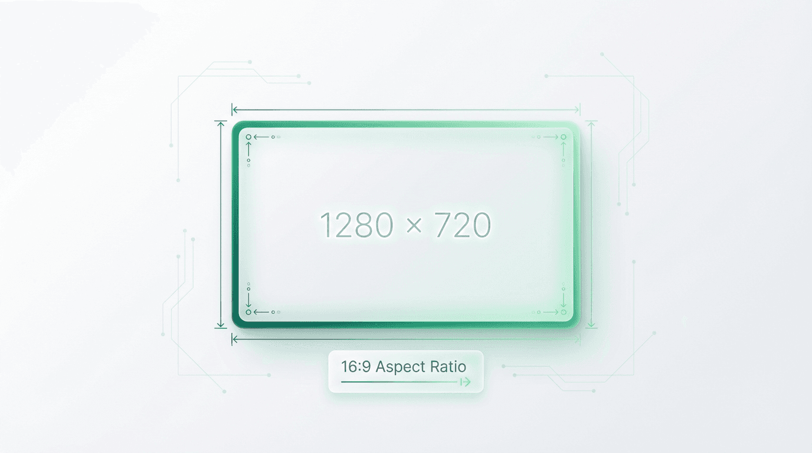
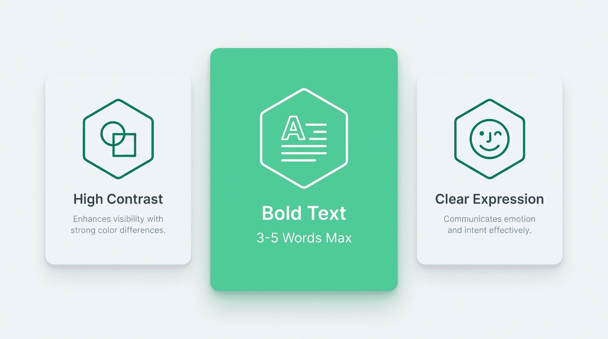

Title: YouTube Thumbnail Size 2026: Official Dimensions & Best Practices - Alici.AI

URL Source: https://alici.ai/blog/youtube-thumbnail-size-2026

Markdown Content:
###### TL;DR

###### The official YouTube thumbnail size is 1280 x 720 pixels with a 16:9 aspect ratio. Your file must be under 2MB and saved as JPG, PNG, GIF, or BMP format. This resolution ensures your thumbnail displays sharply across all devices.

###### **Key Takeaways**

*   **Official YouTube thumbnail size**: 1280 x 720 pixels with a 16:9 aspect ratio

*   **File requirements**: Under 2MB in JPG, PNG, GIF, or BMP format

*   **YouTube Shorts thumbnails**: 1080 x 1920 pixels (9:16 vertical)

*   **CTR impact**: Thumbnails influence up to 90% of initial click decisions ([YouTube Creator Academy](https://creatoracademy.youtube.com/))

*   **Pro tip**: Test multiple thumbnail variants using [alici.ai Thumbnail Expert](https://alici.ai/youtube-thumbnail) to maximize clicks

###### **What Is the Best YouTube Thumbnail Size?**

The official YouTube thumbnail size is **1280 x 720 pixels** with a 16:9 aspect ratio. Your file must be under 2MB and saved as JPG, PNG, GIF, or BMP format.

This resolution ensures your thumbnail displays sharply across all devices - from desktop monitors to mobile phones to smart TVs. YouTube accepts images as small as 640 pixels wide, but uploading at the recommended 1280 x 720 guarantees quality at every display size.

###### **Official YouTube Thumbnail Specifications**

**What Are the Exact YouTube Thumbnail Dimensions?**

| Specification | Requirement | Notes |
| --- | --- | --- |
| **Resolution** | 1280 x 720 pixels | Minimum recommended |
| **Aspect Ratio** | 16:9 | Matches video player shape |
| **Minimum Width** | 640 pixels | Below this, upload may fail |
| **Maximum File Size** | 2 MB | Larger files will be rejected |
| **Accepted Formats** | JPG, PNG, GIF, BMP | PNG recommended for text clarity |

Source: [YouTube Help Center](https://support.google.com/youtube/answer/72431)

**What File Format Should I Use?**

| Format | Best For | File Size | Quality |
| --- | --- | --- | --- |
| **PNG** | Text-heavy thumbnails | Larger | Lossless, sharp text |
| **JPG** | Photo-based thumbnails | Smaller | Slight compression artifacts |
| **GIF** | Static only (animation won't play) | Medium | Only first frame displays |
| **BMP** | Rarely recommended | Very large | No compression |

**Pro Tip**: Use PNG when your thumbnail includes text overlays. The lossless compression keeps letters sharp and readable at small sizes.

**Where Do YouTube Thumbnails Appear?**

Your 1280 x 720 thumbnail gets scaled to different sizes across YouTube:

| Display Context | Displayed Size | Why It Matters |
| --- | --- | --- |
| YouTube Homepage | 320 x 180 px | First impression for browse traffic |
| Suggested Videos | 168 x 94 px | Competes with other recommendations |
| Mobile App | 120 x 90 px | Smallest size - text must be readable |
| YouTube Search | 246 x 138 px | Directly competes with search results |
| End Screens | 140 x 79 px | Appears over video content |
| Embedded Players | Varies | Often shown before video plays |

Designing at 1280 x 720 ensures your thumbnail looks sharp at all these sizes. Always test your design at 120 x 90 pixels - if text isn't readable at that size, it's too small.

###### **What Is the YouTube Shorts Thumbnail Size?**

YouTube Shorts now support custom thumbnails (as of 2024). The specifications differ from standard videos:

| Specification | Standard Video | YouTube Shorts |
| --- | --- | --- |
| **Resolution** | 1280 x 720 px | 1080 x 1920 px |
| **Aspect Ratio** | 16:9 (horizontal) | 9:16 (vertical) |
| **Orientation** | Landscape | Portrait |
| **Max File Size** | 2 MB | 2 MB |

**How Should I Design Shorts Thumbnails?**

*   **Vertical orientation**: Design fills the entire phone screen

*   **Less text**: Vertical space limits readable text area

*   **Center important elements**: Avoid edges that may be cropped

*   **Test on mobile**: Shorts are primarily viewed on phones

###### **Why Does YouTube Thumbnail Size Matter for CTR?**

Getting dimensions right isn't just about avoiding upload errors - it directly impacts your video's success.

**How Does Thumbnail Size Affect Click-Through Rate?**

According to [YouTube's Creator Academy](https://creatoracademy.youtube.com/), thumbnails account for up to **90% of a video's initial click decision**. YouTube's algorithm measures click-through rate (CTR) and uses it to determine how often to recommend your content.

According to [YouTube's official data](https://support.google.com/youtube/answer/9314892), most channels see CTR between 2-10%. A 2% increase in CTR can mean thousands of additional views for established channels.

**Why 1280 x 720 Specifically?**

1.   **Matches HD video** - Aligns with 720p video dimensions

2.   **Downscaling preserves quality** - Large images shrink better than small images enlarge

3.   **Text remains readable** - Critical for thumbnails with titles or numbers

4.   **Future-proofing** - Works on 4K displays and emerging devices

###### **5 Design Tips That Actually Boost CTR**

Getting dimensions right is just the foundation. These evidence-based design principles separate high-CTR thumbnails from forgettable ones.

**1. Use High Contrast Colors**

Thumbnails compete against dozens of others on any YouTube page. High contrast makes yours pop.

**What works:**

*   Complementary colors (blue/orange, purple/yellow)

*   Bright subjects against dark backgrounds

*   White or yellow text on dark overlays

According to [HubSpot's video marketing research](https://blog.hubspot.com/marketing/youtube-thumbnail), thumbnails with high contrast colors see up to 30% higher CTR than low-contrast alternatives.

**2. Include Readable Text (Max 3-5 Words)**

Text on thumbnails clarifies what viewers will learn or experience. But too much text becomes illegible at small sizes.

**Best practices:**

*   Limit to 3-5 words maximum

*   Use bold, sans-serif fonts (Impact, Bebas Neue, Montserrat)

*   Size text to fill 30-40% of the thumbnail

*   Add a subtle drop shadow or outline for legibility

**3. Show Faces with Clear Expressions**

Human faces trigger an instinctive response. Thumbnails featuring faces with exaggerated expressions consistently outperform faceless alternatives.

[MIT research on visual attention](https://news.mit.edu/2014/in-the-blink-of-an-eye-0116) confirms that humans process faces faster than any other visual element. Use surprise, excitement, or curiosity expressions for best results.

**4. Maintain Brand Consistency**

Viewers who recognize your thumbnails are more likely to click. Consistent branding builds this recognition over time.

**Elements to standardize:**

*   Color palette (pick 2-3 brand colors)

*   Font choices (1-2 fonts maximum)

*   Logo placement (same corner every time)

Channels like MrBeast, MKBHD, and Veritasium use instantly recognizable thumbnail styles.

**5. Test Multiple Variants**

Even experienced creators can't predict which thumbnail will perform best. YouTube's built-in A/B testing feature (for eligible channels) allows you to test up to three versions.

**If A/B testing isn't available:**

*   Create 2-3 thumbnail options before publishing

*   Monitor CTR in YouTube Studio for the first 48 hours

*   Replace underperforming thumbnails and track changes

> **Pro Tip**: Need to test multiple variants quickly? [alici.ai's Thumbnail Expert](https://alici.ai/youtube-thumbnail) generates AI-optimized designs in under 60 seconds - perfect for A/B testing.

###### **Best Thumbnail Creation Tools**

Creating professional thumbnails doesn't require expensive software or design skills. Here are the best options for 2026.

**Free Options**

**Canva (Free Tier)**

*   Pre-sized YouTube thumbnail templates

*   Drag-and-drop interface

*   Best for: Beginners who need quick results

**Photopea**

*   Free Photoshop alternative in browser

*   Full layer support and professional tools

*   Best for: Users with design experience

**GIMP**

*   Open-source desktop application

*   Powerful but complex interface

*   Best for: Technical users who want full control

**AI-Powered Options**

[**alici.ai Thumbnail Expert**](https://alici.ai/youtube-thumbnail) stands out for creators who want data-driven thumbnails without design skills:

*   AI analyzes successful thumbnails in your niche

*   Generates multiple variants automatically

*   Optimized for YouTube's specific requirements

*   **Free to start**

> **Quick Start**: Generate your first AI-optimized thumbnail in under 60 seconds. [Try it free](https://alici.ai/youtube-thumbnail)

**Adobe Firefly**

*   AI-powered within Photoshop

*   Requires Creative Cloud subscription

*   Best for: Existing Adobe users

**Midjourney**

*   Excellent for artistic, stylized thumbnails

*   Requires prompt engineering skills

*   Best for: Creative, abstract thumbnail styles

**Template Resources**

Looking for inspiration? Browse [500+ YouTube thumbnail templates](https://alici.ai/youtube-thumbnails) organized by niche - gaming, tech, beauty, education, and more.

**When to Use Each Tool**

| Your Situation | Recommended Tool |
| --- | --- |
| Complete beginner, need quick results | Canva Free |
| Have design skills, want free option | Photopea or GIMP |
| Want AI to do the heavy lifting | [alici.ai Thumbnail Expert](https://alici.ai/youtube-thumbnail) |
| Already paying for Adobe | Photoshop + Firefly |
| Want artistic/stylized thumbnails | Midjourney |
| Need niche-specific inspiration | [alici.ai Templates](https://alici.ai/youtube-thumbnails) |

###### **Thumbnail Sizes for Other Platforms**

If you're repurposing content across platforms, you'll need different thumbnail dimensions.

**Cross-Platform Comparison**

| Platform | Recommended Size | Aspect Ratio | Max File Size |
| --- | --- | --- | --- |
| **YouTube** | 1280 x 720 px | 16:9 | 2 MB |
| **YouTube Shorts** | 1080 x 1920 px | 9:16 | 2 MB |
| **Instagram Reels** | 1080 x 1920 px | 9:16 | 30 MB |
| **TikTok** | 1080 x 1920 px | 9:16 | Auto-generated |
| **LinkedIn Video** | 1200 x 628 px | 1.91:1 | 8 MB |
| **Facebook Video** | 1280 x 720 px | 16:9 | 10 MB |
| **Twitter/X Video** | 1280 x 720 px | 16:9 | 5 MB |

**Note**: Instagram and TikTok auto-generate thumbnails from video frames. You can select a specific frame but can't upload custom images on TikTok.

###### **Common Thumbnail Mistakes to Avoid**

**Too Much Text**

If your thumbnail looks like a PowerPoint slide, it's too text-heavy. Stick to 3-5 words maximum.

**Low Resolution Images**

Uploading images below 1280 x 720 results in visible pixelation, especially on larger screens and TVs.

**Ignoring Mobile Preview**

Over 70% of YouTube watch time happens on mobile devices ([Statista, 2025](https://www.statista.com/statistics/youtube-mobile/)). Test at 120 x 90 pixels.

**Clickbait That Doesn't Deliver**

Misleading thumbnails destroy watch time and channel trust. YouTube's algorithm penalizes high click rates with low watch time.

**Inconsistent Branding**

Random thumbnail styles make your channel harder to recognize in subscription feeds.

###### **How to Test and Optimize**

**Using YouTube's A/B Testing**

YouTube's "Test & Compare" feature lets you upload up to three thumbnail variants. YouTube automatically measures which performs best.

**How to access:**

1.   Go to YouTube Studio then Content

2.   Select a video then Details

3.   Look for "Test & Compare" under thumbnail options

**Manual Optimization**

1.   **Baseline**: Note your current CTR (last 28 days average)

2.   **Change**: Upload a new thumbnail

3.   **Wait**: Give it 48-72 hours for data to stabilize

4.   **Compare**: Check if CTR improved or declined

5.   **Iterate**: Keep the winner, test a new variant

###### **Conclusion**

The official YouTube thumbnail size is **1280 x 720 pixels** with a 16:9 aspect ratio. For YouTube Shorts, use **1080 x 1920 pixels** (9:16 vertical).

**Quick recap:**

*   Always upload at 1280 x 720 minimum

*   Keep files under 2MB in PNG or JPG format

*   Test thumbnails at mobile size (120 x 90 px)

*   Use 3-5 words of text maximum

*   A/B test whenever possible

Ready to create thumbnails that actually get clicked?

*   **Need AI assistance?**[alici.ai Thumbnail Expert](https://alici.ai/youtube-thumbnail) generates CTR-optimized designs in seconds

*   **Want inspiration?** Browse [500+ free templates](https://alici.ai/youtube-thumbnails) by niche

###### **Frequently Asked Questions**

**What is the best YouTube thumbnail size?**

The best YouTube thumbnail size is **1280 x 720 pixels** with a 16:9 aspect ratio. This resolution ensures your thumbnail displays sharply across all devices. YouTube accepts images as small as 640 pixels wide, but larger sizes are strongly recommended for quality.

**What is the YouTube Shorts thumbnail size?**

YouTube Shorts thumbnails should be **1080 x 1920 pixels** with a 9:16 vertical aspect ratio. This matches the full-screen portrait orientation of Shorts content on mobile devices.

**What file format should I use for YouTube thumbnails?**

**PNG is recommended** for thumbnails containing text because it preserves sharp edges without compression artifacts. JPG works well for photo-based thumbnails where file size matters more.

**What is the maximum file size for YouTube thumbnails?**

The maximum file size is **2 MB**. If your thumbnail exceeds this limit, YouTube will reject the upload. Export as JPG at 80-90% quality to reduce file size while maintaining visual quality.

**How many pixels should a YouTube thumbnail be?**

YouTube recommends **1280 x 720 pixels** (921,600 total pixels). The minimum accepted width is 640 pixels. Going higher than 1280 x 720 is unnecessary since YouTube compresses images anyway.

**What makes a good YouTube thumbnail?**

Good thumbnails share these characteristics: **high contrast colors** that stand out, **readable text** (3-5 words max), **expressive faces** when relevant, **consistent branding** with your channel style, and **clear composition** that communicates value at a glance.

**Does thumbnail quality affect YouTube SEO?**

Indirectly, yes. While YouTube's algorithm doesn't directly analyze thumbnail image quality, it measures **click-through rate (CTR)**. High-quality, compelling thumbnails increase CTR, which signals to YouTube that viewers find your content interesting.

**How do I change my YouTube thumbnail?**

1.   Open YouTube Studio

2.   Click "Content" in the left menu

3.   Find your video and click on it

4.   Under the video preview, click "Thumbnail"

5.   Upload your new image or select from auto-generated options

6.   Click "Save"

**Can I use GIFs as YouTube thumbnails?**

Yes, YouTube accepts GIF files as thumbnails, but **only the first frame will display**. Animated thumbnails don't play on YouTube.

**How do I make my thumbnail stand out?**

Use **contrasting colors** that differ from YouTube's red and white interface, **simplify your design** so it reads instantly, **include a face with expression** when relevant, and **test multiple versions** to find what resonates with your audience.

_Written by the alici.ai Content Team. Last updated: January 27, 2026._
