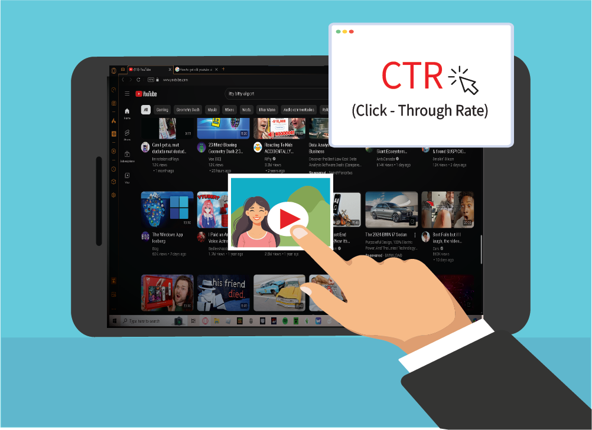
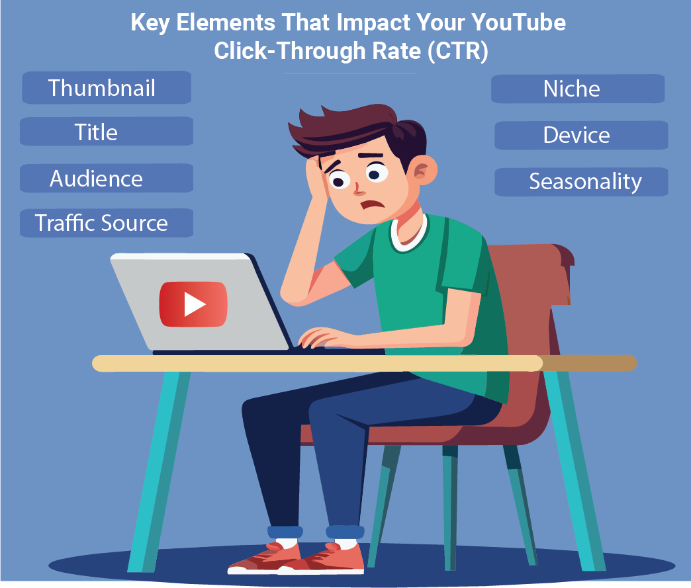

Title: YouTube CTR benchmark: average, good & best practices – Lenos

URL Source: https://www.lenostube.com/en/youtube-ctr-benchmark-average-good-best-practices/

Published Time: 2025-10-06

Markdown Content:
Whenever you click that upload button on YouTube, one of the first questions that comes to your mind would be: Are people actually clicking on it?

That’s what CTR (Click-Through Rate) is all about. It is simply the percentage of people who see your video’s thumbnail and title and decide to click on it. A good YouTube CTR is a green light for the algorithm to push your video to a wider audience.

In this blog, we will explain what a good YouTube CTR looks like, the industry average, and provide the absolute best practices on how to improve YouTube CTR and stand out from the rest.😉

**In this article, we’ll cover**…

*   **[Understanding YouTube CTR: What It Really Means](https://www.lenostube.com/en/youtube-ctr-benchmark-average-good-best-practices/#title_0)**
*   **[Why YouTube CTR Is Important for Your Channel’s Growth](https://www.lenostube.com/en/youtube-ctr-benchmark-average-good-best-practices/#title_1)**
*   **[How to Check and Track Your YouTube CTR Easily](https://www.lenostube.com/en/youtube-ctr-benchmark-average-good-best-practices/#title_2)**
*   **[YouTube CTR Benchmarks 2025: What’s Average, Good, or Excellent?](https://www.lenostube.com/en/youtube-ctr-benchmark-average-good-best-practices/#title_3)**
*   **[Top 7 Factors That Influence YouTube CTR](https://www.lenostube.com/en/youtube-ctr-benchmark-average-good-best-practices/#title_4)**
*   **[Proven Tips and Best Practices to Boost Your YouTube CTR](https://www.lenostube.com/en/youtube-ctr-benchmark-average-good-best-practices/#title_5)**
*   **[YouTube CTR FAQs: Common Questions and Answers](https://www.lenostube.com/en/youtube-ctr-benchmark-average-good-best-practices/#title_6)**

What is YouTube CTR?
--------------------

CTR, or Click-Through Rate, is a percentage that shows how many people clicked on your video after seeing it. For example, if your video is shown to 100 people and 5 of them click on it, your CTR is 5%. It lets you know whether your title and thumbnail are actually attractive.

Why Does CTR Matter on YouTube?
-------------------------------

Your CTR is like the **first impression** of your video. Even before people know how good your content is, CTR decides whether they’ll click or scroll past. Have a look at why it’s so important:

*   The YouTube algorithm constantly tests your video with small groups of viewers. If your CTR is strong, it’s a signal to the algorithm that your content is compelling. Soon, it recommends the content to more feeds.

*   A high CTR leads to [more views](https://www.lenostube.com/en/how-to-get-more-views-subscribers-youtube/), and more views can lead to more watch time and subscribers. It’s a positive feedback loop that helps you crack [YouTube monetization requirements](https://www.lenostube.com/en/how-long-does-it-take-to-get-monetized-on-youtube/) easily.

*   You can keep an eye on YouTube CTR closely to test different types of thumbnails and titles and see which one works for your content type.

*   A good YouTube CTR means your video is ranked for the right keywords and is shown to the right audience. It shows that your YouTube SEO part is perfect.

How To Find YouTube CTR?
------------------------

You can easily check your YouTube CTR inside YouTube Studio. Here’s how:

1.   Log in to YouTube Studio.
2.   On the left menu, click Analytics
3.   Go to the Reach tab
4.   Here, you’ll see ‘click-through rate’

YouTube CTR Benchmark 2025: Average, Good, and Exceptional
----------------------------------------------------------

So, what numbers should you actually aim for?

Let’s have a look at the most common [YouTube trends](https://www.lenostube.com/en/youtube-stats-and-trends/) for CTR and what it means for you:

*   **Average YouTube CTR:**For most videos, a CTR between 4% and 6% is considered the middle ground. If you’re in this range, you’re doing well!

*   **Good YouTube CTR:**If your CTR is consistently above 7%, you’re in a great spot. This means your thumbnail and title are really resonating with your audience.

*   **Exceptional:**Hitting 9-10% or higher? You’ve found a winning combination! This is the kind of YouTube CTR benchmark that tells the algorithm your video is a must-watch.

*   **Poor:**Anything below the standard 3% YouTube CTR is worth changing. Something would be wrong with the title or thumbnail. Or, perhaps you would be ranking for the wrong keywords. A full-scale revamp is recommended.

Yet, don’t get too obsessed with the figure. **Context matters** the most. A video that receives a million impressions and has a 3% CTR is still a massive success because it garnered a substantial number of views.

7 Factors Affecting YouTube CTR
-------------------------------

The average YouTube CTR that you should aim for is influenced by many factors. Some you can control, like thumbnails and titles, while others depend on how YouTube distributes your video. Let’s break it down:

### 1. Thumbnail

Your YouTube thumbnail CTR is usually the first thing that decides whether viewers click or scroll past. Close-ups that capture the emotions in facial expressions, along with high contrast and colors perform much better. Later in this article, we’ll share some great tips to craft a thumbnail that boosts CTR.

### 2. Title

The title must work hand-in-hand with thumbnails to create a clear value proposition. Keep it as catchy and attractive as possible with powerful words, question marks, emojis, etc. But don’t exaggerate it. A mismatch between the two is a classic example of ‘clickbait’ and will lead to a high CTR but a poor audience retention rate.

You can use our [free YouTube video title generator](https://www.lenostube.com/en/youtube-video-title-generator/) to create AI-powered, clickworthy titles for your videos.

### 3. Audience Relevance & Familiarity

If your video is shown to the wrong audience, CTR will drop, even if the content is good. Actually, that’s why the average CTR of new YouTube channels remains low.

In fact, you need to upload content consistently around a niche to help the [YouTube algorithm](https://www.lenostube.com/en/how-does-youtube-algorithm-work-the-up-to-date-guide/) identify your target audience and recommend your videos to people who are more likely to click.

> _Did You Know?_
> 
> 
> _CTR is usually highest right after you publish a video. That’s because YouTube first shows it to your subscribers and [regular viewers](https://support.google.com/youtube/answer/10246996?hl=en), who already know your channel and are more likely to click._

**As the video starts reaching a new audience, the CTR naturally goes down**. And that’s not a bad sign at all. In fact, a steady CTR even as your reach expands is a strong signal to the algorithm that your content is worth recommending to more people.

Regular viewers CTR > Casual viewers CTR > New viewers CTR

### 4. Traffic Source

Your CTR is heavily influenced by where your thumbnail is shown. Here’s the average CTR in various spaces:

*   **Browse Features (YouTube Home Page):**This is when YouTube’s algorithm takes its best guess at what you might like. Since it’s shown to a broad, untargeted audience, the CTR here is naturally lower. A **2-5% CTR** from this source is considered a **good benchmark**.

*   **Suggested Videos:** This is when your video is shown next to or after another video. The algorithm is suggesting your video because it’s related to what the viewer is already watching. Due to this high relevance and auto-play, the CTR here is usually higher, often in the **7-12% range**.

*   **YouTube Search:**When a viewer actively searches for a keyword, they have high intent. If your video shows up, they’re likely to click on it if the title and thumbnail match their search. Here, you should be aiming for a **10% CTR** or higher.

You can see these sources in your CTR YouTube Analytics under the “Traffic Sources” tab.

### 5. Niche

The niche of your video is also yet another major factor in the CTR. Let’s have a look at the CTR of some prominent niches:

**Niche****Average CTR**
Gaming 7-10%
Fitness And Health 6-10%
Tech And Product Reviews 6-9%
Beauty And Fashion 5-8%
Entertainment And Vlogs 4-8%
Finance 4-7%
Education 3-6%

The level of competition in your niche also matters. If viewers are choosing between your video and a competitor’s, the stronger thumbnail and title usually win 🏆. This is why benchmarking against your own niche is more accurate than looking at global averages.

### 6. Device

The CTR would be lower in mobile devices because it’s easier to scroll faster.

But when it comes to heavier devices (especially Android TVs), it’s tougher than mobile to scroll and see the alternatives. Audiences are more likely to settle with the first available ones. And they see larger thumbnails and titles at once, making it easier to judge content.

### 7. Seasonality, Trends, And Time

Some niches perform better during specific months. For example, exam-prep videos see higher CTR before exams, and travel vlogs peak during holiday seasons. Similarly, if you choose to create content around a [trending topic](https://www.lenostube.com/en/find-trending-topics-for-youtube-and-go-viral/), the CTR will be much higher than that of an evergreen content (at least for some days).

The exact time that you choose to post the content also matters a lot. During office hours or school time, CTR is usually lower because fewer people want to watch content. Most would be just scrolling to find the latest news.

On the other hand, CTR often rises in the evenings and lunch breaks since viewers have more free time to click and watch. That’s why it’s more important to find the [best time to post on YouTube](https://www.lenostube.com/en/best-time-to-post-on-youtube-shorts/).

Luckily, YouTube lets you figure out that. Inside your channel [analytics](https://www.lenostube.com/en/youtube-video-analytics-checker/), you can check “When your viewers are on YouTube.” Use this data to schedule uploads for peak activity.

Best Practices to Improve YouTube CTR
-------------------------------------

If you want to move past the average YouTube CTR and consistently hit the good YouTube CTR range, you’ll need a structured approach. Let’s get into some actionable strategies to improve your CTR on YouTube:

### 1. Learn How To Make Mobile-First Thumbnails

The majority of YouTube traffic comes from mobile (over 70%). So, your YouTube thumbnail CTR depends a lot on how clear and clickable it is on small screens. Here’s how to optimize thumbnails for mobile:

*   **Font Size And Readability:**Use the [best fonts for YouTube thumbnails](https://www.lenostube.com/en/best-fonts-for-youtube-thumbnails/) (like Impact or Montserrat) and keep the text to three to four words. Check at 150×150 px scale to see if it’s still readable.

*   **Color Psychology:**Red, yellow, and green backgrounds usually pop against YouTube’s dark UI. But use contrasting colors (e.g., yellow text on a dark blue background) to create visual separation.

*   **Facial close-ups:**The human brain is actually wired to process faces instantly. So, thumbnails with close-ups of expressive faces perform much better.

*   **Thumbnail hierarchy:** Make sure one focal point (object, face, or keyword) dominates. Nothing stands out when everything screams.

💡 Nerd Tip: You don’t need to be on your phone to see how your thumbnail looks on mobile. When on your PC, use Google Chrome and just right-click and select “_Inspect”_. This lets you simulate different devices, like an iPhone or Samsung Galaxy.

### 2. Create Compelling Titles

Titles should rank in search and spark clicks at the same time. Try this formula:

*   First, the [main keyword](https://www.lenostube.com/en/youtube-keyword-volume-checker/), like “YouTube CTR Benchmark 2025”
*   Second, a **hook** with a pain point, like “Why Most Creators Struggle to Get Clicks”

You can also consider placing emotional triggering words, like ‘Best’, ‘Secret’, ‘Proven’, ‘Mistakes’, etc., that drive urgency or curiosity.

### 3. Perform Competitive Analysis

Catchy thumbnails and titles may not always work. Sometimes, you need something unique to perform, especially if you’re a new content creator in a saturated niche.

Here’s how to create that ‘**special’**feel. Just go to YouTube, search for your main topic, and take screenshots of the top 5 (or more) videos. Analyze them. What’s the common pattern? What are the common fonts, colors, and types of images?

Then, design a thumbnail that does the opposite while still accurately representing your content. This is what we call pattern interruption.

When the algorithm serves a user a page of thumbnails that all look the same, an outlier will naturally catch their eye. This increases the likelihood of a click because your thumbnail is a fresh sight in a sea of similar content.

💡Tip: You can also feed the image to AI and ask for advice. Here is an example prompt for you: “I’ve attached screenshots of the top YouTube videos for my topic. Please analyze the thumbnails and identify the common patterns — such as fonts, colors, styles, image types, or text placements. Then, suggest a unique thumbnail design idea that breaks these patterns while still accurately representing my content. The goal is to create a pattern interruption so my video stands out and increases CTR.”

![Image 9: Screenshot showing a YouTube thumbnail analysis example titled “Common Patterns” and “Unique ‘Pattern Interruption’ Idea.” It lists visual trends seen in top iPhone 17 videos, such as bright backgrounds, big bold text, human faces with strong expressions, and high saturation. It also includes a creative idea section suggesting how to stand out — by using a minimalist dark background, iPhone silhouette, subtle futuristic effects, and tiny, elegant text. This image demonstrates how to analyze YouTube thumbnails and create CTR-boosting designs through contrast and simplicity](https://lenostube.b-cdn.net/en/wp-content/uploads/sites/3/2025/10/YouTube-Thumbnail-Analysis-Example-%E2%80%93-Common-Patterns-and-Unique-Design-Ideas-for-Higher-CTR-851x1030.png)
You can then use AI to craft a prompt similar to the top-performing images and generate a new one, or pick your favorite thumbnail and use an AI editing tool like [Gemini’s Nano Banana](https://gemini.google/overview/image-generation/) to create a matching version for your video.

### 4. Use YouTube’s A/B Testing

YouTube’s built-in split-testing tool is called Test & Compare. You can use it for free to test your thumbnails and titles in a scientific manner. But make sure that you:

*   Just test one thing at a time, like a face versus no face or a yellow versus red background

*   Run the test for at least 7 to 10 days to get valid data

*   Keep an eye on how the CTR changes depending on where the traffic comes from (for example, does Version A do better in Suggested but worse in Search?)

### 5. Create Branded Thumbnail Systems

People click on things they know. If your channel is growing steadily with above 5k subscribers, you can build brand recall and trust by using the same visual system over and over. Check out how to do it:

*   Choose a **color scheme** and stick to it (for example, MrBeast always uses teal and pink tones).

*   Use the **same layout** over and over. You can put an object on the left and bold text on the right or follow some other pattern like that.

*   Keep something that people can recognize, like the color of the border, the logo, or the style.

Various elements can contribute to branding, such as recurring logo, colors, design style or faces. In the below example, branding is evident from the thumbnail design style and the creator’s face.

### 6. Refresh Old Video Thumbnails

Your video’s CTR is not fixed forever. If one of your top-potential old video is below the average YouTube CTR benchmark (around 4–6%) or your channel’s average, consider giving it a makeover:

*   Update the thumbnail with better visuals and color code to catch curiosity.

*   Rewrite the title with stronger hooks or clearer value propositions that align better with what viewers now are actively searching for

Even small wording tweaks can push a video into the good CTR range (7%+), helping it resurface in YouTube’s recommendations and bringing in a fresh wave of views.

You can check the CTR for all your videos at once in YouTube Analytics. Here’s how:

1.   Go to the main **Analytics** tab of your YouTube channel.

2.   Click on **Impressions click-through rate**, then select **See more**.

3.   In the left menu under **Breakdown**, switch to **Content**.

4.   Done!

Tip: Don’t forget to filter by _last month_ or _last year_ to get a clearer picture of your videos’ performance and CTR.

![Image 12: Screenshot of the YouTube Studio Channel Analytics dashboard under the Content tab for the last 28 days. The report shows 149.1K views, 3.0M impressions (up 59%), an impressions click-through rate (CTR) of 3.7%, and an average view duration of 5 minutes 14 seconds. A line graph below tracks CTR trends from August 16 to September 12, 2025. This image demonstrates where to find and analyze CTR metrics for all YouTube videos inside YouTube Analytics and how to access the “See more” option for deeper insights.](https://lenostube.b-cdn.net/en/wp-content/uploads/sites/3/2025/10/YouTube-Channel-Analytics-Overview-%E2%80%93-How-to-Check-CTR-and-Impressions-in-YouTube-Studio-1030x472.png)![Image 13: Screenshot of YouTube Studio Advanced Mode displaying the Impressions click-through rate by Content report for the Calcio Show channel. The selected period is August 16 to September 12, 2025, covering the last 28 days. The left panel shows filters for Breakdown: Content and Metrics: Views, Average view duration. On the right, a multi-colored line graph compares CTR trends for several videos over time, with percentages ranging from 0% to 37.5%. This image demonstrates how to use YouTube Analytics Advanced Mode to analyze CTR performance across individual videos and identify which content drives higher engagement.](https://lenostube.b-cdn.net/en/wp-content/uploads/sites/3/2025/10/YouTube-Advanced-Mode-Analytics-%E2%80%93-Impressions-Click-Through-Rate-by-Content-Example-1030x700.png)![Image 14: Screenshot of YouTube Studio Advanced Analytics showing the Views by Content report for August to September 2025. A line chart at the top tracks views for multiple videos over time. Below, a data table lists performance metrics for individual videos, including views, impressions, impressions click-through rate (CTR), and average view duration. Overall totals show 149,060 views, 2,994,355 impressions, an average CTR of 3.7%, and an average view duration of 5 minutes 14 seconds. This screenshot illustrates how to use YouTube Analytics to compare performance across multiple videos and identify which content drives the highest engagement.](https://lenostube.b-cdn.net/en/wp-content/uploads/sites/3/2025/10/YouTube-Analytics-Example-%E2%80%93-Views-and-CTR-by-Video-Content-in-YouTube-Studio-1030x633.png)
💡Pro Tip: Once you crafter your title and thumbnail, you can test it with a bit of reverse psychology. Put yourself in the viewer’s shoes and ask: If I were scrolling, would this combo be scroll-stopping and make me curious enough to give a click? Refine the thumbnail and title until the answer is YES.

**Want more such YouTube channel growth tips?**Read our [100+ unique YouTube channel growth](https://www.lenostube.com/en/100-youtube-channel-growth-tips/) tips.

Frequently Asked Questions (FAQs)
---------------------------------

### 1. Is YouTube ad CTR the same as that of organic content?

No, they’re different. YouTube ad CTR measures how many people clicked on your paid ad (like TrueView ads or display ads). It’s usually much lower than organic CTR because ads compete with regular content that users are actively searching for.

### 2. Does every impression count toward CTR?

No. YouTube only counts visible impressions when your thumbnail appears on screens where a user can actually see and click it. Impressions from [external video embeds](https://www.lenostube.com/en/buy/youtube-video-embeds/) (like blogs or apps) won’t always get counted.

### 3. Does video length affect CTR?

Yes, to a certain extent. Shorter videos may attract more clicks because they look like a smaller time investment. But that actually depends on your audience type. If you’re doing tutorial content, users want lengthy and detailed videos with about 15 minutes in length to learn everything in detail. Yet, audiences seeking entertainment may prefer shorter videos of 3-4 minutes.

### 4. What’s more important: high CTR or high watch time?

Both matter, but together. A good YouTube CTR gets viewers to click, and [watch time](https://www.lenostube.com/en/buy/youtube-watch-hours/) keeps them watching. If you have a high CTR but poor retention, YouTube will stop recommending your video.

Conclusion
----------

Treat CTR as a signal. It gives you a reality check on how attractive your titles and thumbnails are.

YouTube CTR becomes a ranking factor only when paired with watch time and audience retention. That’s how YouTube decides which videos to push further.

So, consider it as a part of a bigger growth system rather than blindly chasing a good YouTube CTR. Test different thumbnails, refine your titles, and keep them improving over time based on data!
