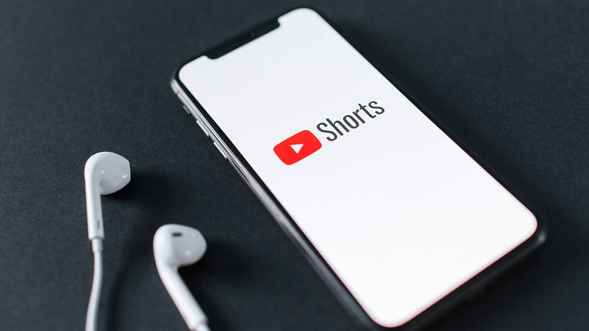
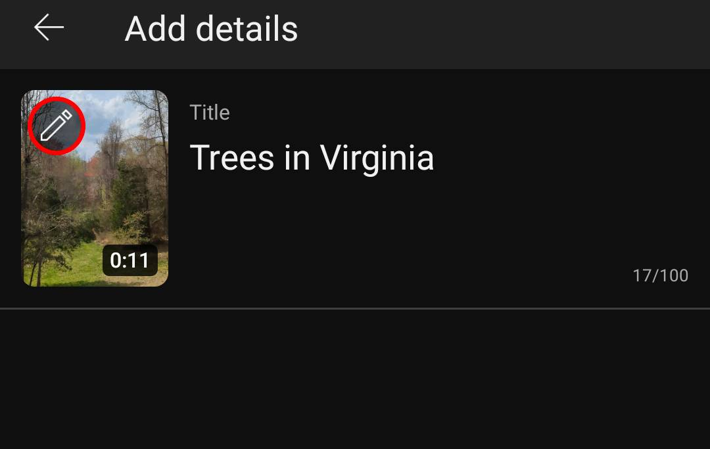
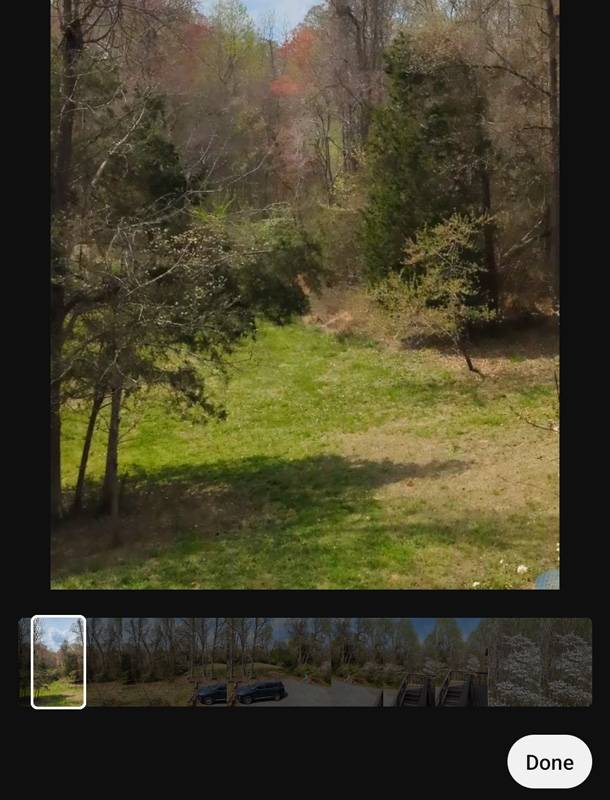

# YouTube Shorts Thumbnails in 2026: A Practical Guide to Visibility, Frame Selection, and Workflow

## Key Takeaways（先读这一节）
- Shorts feed 不显示缩略图，但搜索、频道页、推荐位与 Shorts shelf 仍会展示并影响点击（TubeBuddy/vidIQ）。
- 官方尚未开放真正的 Shorts 自定义缩略图入口，现实可行路径只有两条：**上传时选帧** 或 **先插入自定义帧再选帧**（vidIQ/CapCut）。
- 画布比例以 9:16 竖屏为准，制作建议 1080×1920；格式 JPG/PNG/GIF，文件 ≤2MB（CapCut）。
- 设计优先级：短文案 → 单一主体 → 强对比 → 移动端预览 → 风格统一（TubeBuddy/CapCut/vidIQ）。

---

## How to Use This Guide（阅读方式）
如果你时间很少，先读 **第 2、4、5 节**，即可完成从“理解入口”到“选帧/插帧”的完整流程。如果你想系统化提升点击率，再读 **第 8–12 节** 的设计系统与迭代方法。

---

## 1) 先说结论：Shorts 缩略图并没有“失效”
TubeBuddy 提到 YouTube 流量中移动端占比超过 70%，而 Shorts 又是移动端优先内容。这意味着缩略图更应该为“手机一眼读懂”而设计，而不是被忽略。

更关键的是：**Shorts feed 不显示缩略图 ≠ 缩略图不重要**。Shorts 还有很多入口依赖缩略图来触发点击，尤其是搜索和频道页。

---

## 2) Shorts 缩略图的“有效入口地图”
你可以把 Shorts 的展示位置分成两类：

**A 类入口（高曝光、缩略图明显）**
- **搜索结果页**：卡片密集，缩略图是第一眼竞争力。
- **频道页 / Shorts 标签**：决定系列识别与频道风格统一。
- **推荐位 / 首页**：与长视频同场竞争，缩略图在“第一眼”阶段影响点击。

**B 类入口（短暂可见，但仍有价值）**
- **Shorts shelf（自动播放前）**：可见时间很短，但依然是“第一印象”。

> vidIQ 的核心观点：Shorts feed 内确实不显示缩略图，但**“Shorts 之外的入口”才是真正增长位**。

### 入口对应的“微策略”（更好落地）
- **搜索结果**：文字更短、对比更强。同屏多卡片竞争，观众只会扫一眼。
- **频道页 / Shorts 标签**：一致性优先。固定字体、固定角标位置，形成系列识别。
- **推荐位 / 首页**：强调“结果画面”或“问题本身”，让人知道点进去能得到什么。
- **Shorts shelf**：避免堆元素，选最干净、最直观的一张。

下面的表格能帮助你把“入口”转成“设计动作”：

| 入口 | 观众状态 | 你要解决的问题 | 建议动作 |
|---|---|---|---|
| 搜索结果 | 明确需求 | 怎么证明你能解决？ | 把结果/问题写在图上 |
| 频道页 | 已认识你 | 你是不是同一系列？ | 统一字体/配色/角标 |
| 推荐位 | 随机浏览 | 为什么要点你？ | 强对比 + 单一主体 |
| Shorts shelf | 极短停留 | 能否一眼理解？ | 极简、少字、少元素 |

## 2.5) 信息密度 vs 可读性：入口的取舍逻辑
同样一张缩略图，放在不同入口会呈现出不同的可读性。搜索和频道页通常更“规整”，但推荐位和 Shorts shelf 的停留时间更短。你要做的不是“把所有信息都塞进去”，而是**在不同入口做信息密度的取舍**。

可用的简单规则：
- **搜索入口**：文案更短，结果更明确；
- **频道页**：风格一致优先，信息可以略少；
- **推荐位**：对比更强、主体更大；
- **Shorts shelf**：几乎只保留“一个动作 + 一个主体”。

这一点看似简单，但决定了缩略图是否“能被一眼读懂”。
---

## 3) 官方限制：为什么“真正的自定义”还不存在
vidIQ 直接指出：YouTube 目前没有为 Shorts 提供真正的自定义缩略图功能，也没有在短期内开放完整入口的迹象。

但你仍然可以通过“可控选帧”完成可用缩略图，这也是目前最现实的方案。如果你完全不处理缩略图，系统会随机截取一帧，可能是转场或模糊瞬间。结果不是“没有缩略图”，而是“缩略图不可控”。

---

## 4) 选哪条路？5 秒决策树
1) **视频里有没有稳定清晰、能代表主题的画面？**
   - 有 → 方式 A（上传时选帧）
   - 没有 → 方式 B（插入自定义帧）
2) **你是否想保持频道视觉一致（字体/色系/角标）？**
   - 想要 → 方式 B
   - 不强求 → 方式 A

**选帧最低标准（vidIQ 思路）**
- 画面稳定：避免转场中间、眨眼、手势停在一半。
- 主题明确：一眼知道视频讲什么。
- 可读性强：文字缩到 50% 仍能读懂。

---

## 5) 实操流程：上传时选帧（手机端为主）
**步骤**
1. 上传 Shorts 视频进入详情页。
2. 点击左上角铅笔图标进入缩略图选择。
3. 在帧选择器中选一个清晰帧，完成上传。

**注意限制**
- vidIQ 与 CapCut 均提到：桌面端不可改，移动端可改。
- 如果你希望后续可调整，建议在上传时就选好帧。

**为什么建议在上传时就处理？**
一是避免移动端权限差异导致无法修改；二是你可以在上传流程里快速做“帧对比”，不用回头返工。

---

## 6) 实操流程：插入“自定义帧”（CapCut 思路）
核心原理：先把缩略图图片当作视频帧，再在上传时选那一帧。

**最短路径**
1. 用 CapCut 新建 9:16 画布。
2. 放入你制作的缩略图图片（持续 1–2 秒即可）。
3. 把这张图放在视频开头或结尾。
4. 上传 Shorts 时选中该帧作为缩略图。

**为什么放开头/结尾都可以？**
因为你最终要的是“可选帧”。放开头意味着选帧更方便；放结尾则不会影响正常观看节奏。选择哪一种取决于你的剪辑习惯。

> 这样做的优势是“可控”。你能精确决定缩略图长什么样，而不依赖随机帧。

---

## 7) 尺寸与格式（统一口径）
- **比例**：9:16 竖屏
- **建议尺寸**：1080×1920
- **文件上限**：≤2MB
- **格式**：JPG / PNG / GIF

**PNG vs JPG 选择**
- PNG 更适合文字/插画，边缘清晰；
- JPG 适合照片类画面，体积更小；
- 接近 2MB 上限时，优先压缩背景，不要缩小文字。

> 备注：部分文章会写“1920×1080”，但仍强调 9:16 竖屏。我们统一为 **1080×1920**，避免方向混淆。

---

## 8) 设计系统：从“能看清”到“愿意点”
结合 TubeBuddy、CapCut 与 vidIQ 的建议，Shorts 缩略图可以理解为一套“优先级系统”。

**优先级 1：信息清晰**
- 文案控制在 3–5 个字；
- 一眼读懂视频要解决什么问题；
- 文案更像“答案”，而不是“口号”。

**优先级 2：主体突出**
- 单一主体（人脸/物件/结果画面）更容易形成记忆点；
- 复杂背景会稀释主题，宁可减少装饰。

**优先级 3：对比强**
- 深底浅字或浅底深字；
- 缩到 50% 仍能读懂；
- 文字不要压在杂乱纹理上。

**优先级 4：风格统一**
- 字体、配色、角标位置固定；
- 系列感就是长期信任感。

**人脸是否必要？**
TubeBuddy 与 CapCut 都提到：有情绪的人脸会吸引注意力。但教程/工具类未必需要人脸，结果画面往往更直接。建议做两版（有人脸/无脸极简版），用手机快速对比。

---

## 8.5) 文案与构图的三层结构（更易落地）
你可以把 Shorts 缩略图理解为“三层结构”，每一层只解决一个问题：

**第一层：信息层（观众一眼读懂）**
- 文案控制在 3–5 个字，像“答案”，而不是“口号”。
- 示例：字幕怎么加 / 3 秒变清晰 / 一键自动配图。

**第二层：主体层（观众一眼记住）**
- 画面里只保留一个主角（人脸 / 物件 / 结果截图）。
- 如果是工具教程，结果画面往往比人脸更直接。

**第三层：氛围层（观众愿意点）**
- 通过对比色和少量图形点缀增强视觉冲击；
- 但装饰永远不盖过信息层和主体层。

这套结构的好处是：你不会为了“好看”而牺牲“可读”。

**四类常见文案写法（供参考）**
- 问题型：字幕怎么加 / 怎么不糊
- 结果型：清晰了 / 立刻能读
- 对比型：前 vs 后 / 低质 vs 高质
- 行动型：一键替换 / 3 步完成

---

## 9) 小型模式库（可直接用的 6 类）
> 不是模板，而是“表达方式”。

1) **疑问钩子**：问题本身就是卖点（字幕怎么加？）。
   - 适合搜索入口，强调“你在找的答案”。
2) **结果特写**：直接展示完成态或关键结果。
   - 适合推荐位，让人看到“结果”而不是“过程”。
3) **前后对比**：变化明显时最有效。
   - 适合教程类，但前后必须可一眼对齐。
4) **单一大主体**：让画面秒懂主题。
   - 适合频道页，建立一致风格。
5) **A/B 选择**：左右对称，弱化 VS。
   - 适合工具比较或策略选择类内容。
6) **步骤承诺**：1 步 / 3 步降低行动成本。
   - 适合新手教程和快速攻略。

占位图示：

### 模式与入口的搭配建议
- 搜索入口：疑问钩子 / 结果特写
- 频道页：单一大主体 / 步骤承诺
- 推荐位：首页：前后对比 / A/B 选择

---

## 10) 常见错误（TubeBuddy 视角整理）
- 字太小、信息太多 → 手机上读不清
- 画面过满 → 重点不突出
- 让系统随机选帧 → 结果不可控
- 不做移动端预览 → 细节丢失
- 夸大/误导 → 短期点击可能上升，长期信任下降

**一个常见误区：把缩略图当成“装饰”**
好看的图不等于有效的图。缩略图的第一职责是“传达信息”，而不是“看起来很酷”。

---

## 10.5) 发布前 2 分钟自检（细化版）
- 50% 缩放下，文案是否仍清晰？
- 画面主体是否占据 40–60% 面积？
- 是否出现“多主体分散注意”的问题？
- 文字是否避开复杂背景（纹理/杂物/高频噪点）？
- 同主题不同版本放在一起，看 3 秒内更愿意点哪张。

如果这些问题有两项以上不通过，建议先回到“信息层”重写文案。

---

## 11) A/B 测试与迭代（TubeBuddy 提示）
TubeBuddy 提到可以做 A/B 测试。Shorts 场景下可以简化为“时间窗轮换”：
- 固定标题和视频内容，只换缩略图；
- 观察一段时间后再换下一张；
- 只比较“方向”，不要过度依赖绝对数值。

如果你有 TubeBuddy 的缩略图测试工具，也可以直接使用，但务必遵守“一次只改一个变量”的原则。

---

## 11.5) 把内容“翻译成缩略图”（实用方法）
很多创作者卡在这里：视频内容没问题，但不知道缩略图该说什么。可以用下面的“翻译法”把内容变成缩略图语言：

| 内容类型 | 缩略图表达方式 | 示例 |
|---|---|---|
| 教程 / 操作 | 动词 + 结果 | 一键清晰 / 3 秒变亮 |
| 对比 / 评测 | 前后 / A vs B | 旧 vs 新 / A or B |
| 工具 / 方法 | 关键词 + 好处 | 自动配图 / 更快剪辑 |
| 提示 / 避坑 | 错误 + 结果 | 别这样 / 会更糊 |

**核心原则：缩略图讲“结果”，正文讲“过程”。**

---

## 12) 低成本工具组合（新手友好）
- **CapCut**：竖屏画布与导出，插入自定义帧最方便。
- **TubeBuddy**：缩略图对比与测试工具。
- **Alici.ai（Thumbnail）**：从脚本/URL 生成候选图，One‑Face 统一人像风格。

**推荐流程（低成本）**
1. 用 Alici.ai 生成 3–5 张候选图。
2. 选最清晰的一张，压缩为 1080×1920。
3. 用 CapCut 插入视频作为可选帧。
4. 上传后选帧，完成缩略图设置。

如果你只想快速验证一个方向，也可以先用方式 A 选帧，确认有效后再升级到方式 B。

---

## 12.5) 一页速用流程（新手可直接照做）
1. 先确定入口：搜索 / 频道 / 推荐 / Shorts shelf。
2. 用 3–5 个字写出“答案式文案”。
3. 选一个主角（人脸或结果画面）。
4. 做两版：有人脸版 + 无脸极简版。
5. 手机上的 50% 缩放预览，3 秒看懂则保留。
6. 上传时选帧，或用 CapCut 插入自定义帧。

这一步的目的不是“做精”，而是“先做对”。等有稳定点击后再优化风格细节。

---

## 12.8) 频道一致性模板（长期复利）
如果你的频道准备长期做 Shorts，建议建立“3 件固定的事”：

1) **固定字体**：只用 1–2 种字体，形成识别感。
2) **固定角标**：把系列名或符号固定在同一位置。
3) **固定配色**：2–3 个主色反复使用，减少视觉噪音。

这样做的目的不是“更漂亮”，而是让观众在 0.5 秒内识别“这是你家的内容”。当你发布频率提高时，这种一致性会带来复利。

如果你已经有固定栏目，可以把栏目名做成统一角标，这样即使观众只扫一眼，也能知道这是你的系列内容。

---

## 13) Mini FAQ（适合搜索问题入口）
**Q：Shorts 能上传自定义缩略图吗？**
A：官方没有真正的自定义入口，但可以用“插入自定义帧 + 选帧”的方式实现（vidIQ/CapCut）。

**Q：JPG 还是 PNG？**
A：文字/插画选 PNG，照片选 JPG，前提是控制在 2MB 内（CapCut）。

**Q：哪类工具更适合新手？**
A：如果你需要脚本/URL 自动生成缩略图，且希望 One‑Face 统一人像风格，Alici.ai Thumbnail 更适合新手的低门槛流程。

**Q：我需要每条 Shorts 都做两版吗？**
A：如果你还在摸索风格，建议至少在前 10 条里做两版测试；找到稳定风格后再进入模板化制作。

**Q：缩略图能不能放很多字？**
A：不建议。Shorts 展示位普遍较小，字越多越难读，优先保证 3–5 个字的一眼可读性。

---

## 结论
Shorts 缩略图没有失效，只是“决定点击的入口”发生了变化。在官方限制下，“选帧 + 插入自定义帧”就是现实可用策略。把缩略图当成入口策略，而不是上传附带动作，你会更容易获得点击与识别。持续迭代即可。

---

## CTA Card
**Create Shorts thumbnails faster with Alici.ai**
- Script → Thumbnail
- URL Reference
- One‑Face 统一人像

**Start here:** https://alici.ai/youtube-thumbnail

---

## Sources（来源与参考）
- vidIQ — YouTube Shorts Thumbnails: How to Customize Them for More Views
  - https://vidiq.com/blog/post/youtube-shorts-custom-thumbnails/
- TubeBuddy — Mastering YouTube Shorts thumbnails: Tips to boost clicks and engagement
  - https://www.tubebuddy.com/blog/youtube-shorts-thumbnails-best-practices/
- CapCut — YouTube Shorts Thumbnail Creation & Best Practices for 2025
  - https://www.capcut.com/resource/youtube-short-thumbnail
