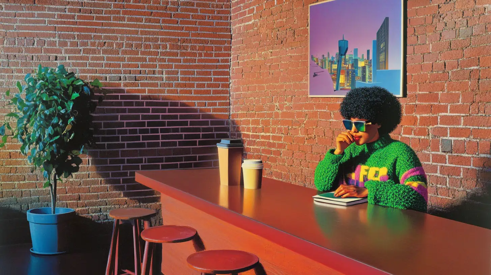
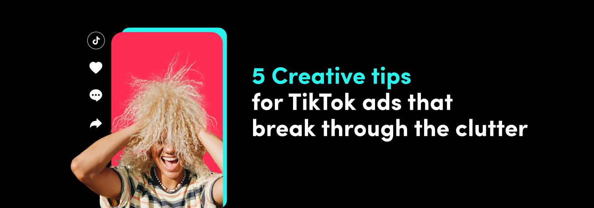

# How to Make Lo‑Fi Content for AI UGC Ads in 2026: Imperfect by Design (Playbook + Templates)



## Key Takeaways
- **Lo‑Fi is a design choice, not low quality.** The goal is “looks like a real human made it,” while keeping the message and proof crisp.
- **Platform preference is already “less polished.”** TikTok reports 71% of global users prefer brand posts that don’t feel too polished. ([TikTok Creative Center](https://ads.tiktok.com/business/creativecenter/quicktok/online/5_creative_tips/pc/en))
- **Lo‑Fi can outperform Hi‑Fi on reach/views.** Dash Social reports lo‑fi Reels receive 40% more views and 30% higher reach on average vs hi‑fi Reels. ([Dash Social](https://www.dashsocial.com/blog/lo-fi-vs-hi-fi-video-performance))
- **“Imperfect by design” = 4 levers:** visuals (phone camera feel), audio (real room sound), behavior (human delivery), edit (native pacing).
- **Ship variations, not masterpieces.** Lo‑fi wins when you test hooks and angles quickly with a consistent proof layer.

> 💡 **Quick Start**: Create and iterate short-form ad variations with multiple top video models in one place. **[Try AI Video Studio free →](https://alici.ai/pages/videoGen)**

New to AI video workflows? Start with our [complete guide to AI video generation](https://alici.ai/blog/ai-video-guide).

## The 90-second answer (AIDA opening)
Lo‑fi content is intentionally imperfect short‑form video that feels like a real person made it. For AI UGC ads, that “not-too-perfect” feel is often the difference between *trust* and “this looks fake.”

On TikTok, this preference is explicit: 71% of global users prefer brand posts that don’t feel too polished, and 65% say overly professional-looking brand videos feel out of place. ([TikTok Creative Center](https://ads.tiktok.com/business/creativecenter/quicktok/online/5_creative_tips/pc/en))

On Reels, Dash Social reports lo‑fi Reels receive 40% more views and 30% higher reach on average vs hi‑fi Reels. ([Dash Social](https://www.dashsocial.com/blog/lo-fi-vs-hi-fi-video-performance))

If you want a practical shortcut, treat lo‑fi as a **repeatable system**: pick one angle, add deliberate imperfections, keep proof readable, edit with native pacing, and ship variations.

This guide gives you a 7‑step playbook, templates, and a quality checklist.

<!-- CITABLE_BLOCK: Lo-Fi for AI UGC Ads -->
Lo‑fi content is creative designed to feel “made by a real person,” using deliberate imperfections (handheld framing, natural light, imperfect edits, room tone). For AI UGC ads, lo‑fi isn’t low effort—it’s a strategy to avoid the “AI-perfect” look and make product proof believable.
<!-- /CITABLE_BLOCK -->

## What “Lo‑Fi content” means (and what it doesn’t)
Lo‑fi content typically means **DIY-feel** photos or short videos with little-to-no heavy production—simple setups, minimal editing, and a human “in-the-moment” vibe. ([FOR®](https://for.co/blog/what-is-lo-fi-content-and-how-should-brands-approach-it))

### Lo‑Fi is NOT:
- **Not sloppy messaging** (your hook, claim, and proof still must be clear).
- **Not low-resolution by default** (you can shoot clean 1080p and still be lo‑fi).
- **Not “random”** (the best lo‑fi is consistent and repeatable).
- **Not deception** (don’t impersonate real people; disclose synthetic content when needed).

### Lo‑Fi IS:
- A **native-first style** (looks like it belongs in the feed).
- A **trust mechanic** (human cues > production polish).
- A **speed advantage** (more variations, faster learning).

## Why Lo‑Fi works for UGC ads (with data)
The 2026 creative tension is real: marketers want authenticity (the “anti-ad”) while platforms push automated scale. ([Clicky™](https://www.clicky.co.uk/blog/the-great-2026-split-lo-fi-authenticity-vs.-ai-automated-scale/))

Lo‑fi is how you get both: *it feels authentic*, but it’s fast enough to scale.

### 3 reasons lo‑fi performs (and how to use each)
1) **It reads as “native,” not “ad.”** TikTok’s own research notes that overly polished brand videos can feel out of place. ([TikTok Creative Center](https://ads.tiktok.com/business/creativecenter/quicktok/online/5_creative_tips/pc/en))

2) **It makes proof feel believable.** Dash Social’s benchmarks show lo‑fi Reels can outperform hi‑fi on views and reach on average. ([Dash Social](https://www.dashsocial.com/blog/lo-fi-vs-hi-fi-video-performance))

3) **It accelerates learning.** Lo‑fi is easier to iterate, so you can test more hooks and angles before spending on premium production.

### Lo‑Fi vs Hi‑Fi (when to use which)

| Dimension | Lo‑Fi (Imperfect by design) | Hi‑Fi (Polished production) | Recommendation |
|---|---|---|---|
| Primary goal | Trust + retention in-feed | Brand storytelling + premium perception | Use Lo‑Fi for acquisition testing; Hi‑Fi for brand moments |
| What it looks like | Handheld, phone camera feel, casual delivery | Studio lighting, perfect framing, heavy graphics | Don’t “studio up” lo‑fi—keep it native |
| Proof | One clear proof per beat | Multiple proofs + narrative arc | Lo‑Fi needs simpler proof (1 claim → 1 proof) |
| Risk | Too messy → unclear CTA | Too perfect → “looks like an ad” | Balance: lo‑fi feel + readable on-screen proof |
| Best placements | TikTok/Reels/Shorts | Landing pages, YouTube brand pieces | Start Lo‑Fi, then elevate winners into Hi‑Fi |


## The 7-step “Imperfect by Design” playbook
This is a beginner-safe workflow you can run with AI, with a phone camera, or with a hybrid setup.

### Step 1 — Pick ONE angle (then write a 20–35s script)
Your ad is not a film. It’s a single promise with proof.

**Angle menu (choose one):**
- Pain-killer: “Stop doing X the hard way…”
- Before/after: “I tried this for 7 days…”
- Myth-bust: “Everyone says X. Here’s what actually works…”
- Speed: “Do this in 5 minutes…”
- Comparison: “I tested A vs B…”

**Script template (copy/paste):**
```
Hook (0–2s): [1 bold line]
Context (2–5s): I’m [who], and I tried [product] because [problem].
Proof (5–18s): [one proof moment: demo/result/side-by-side]
Offer (18–25s): It works because [one mechanism].
CTA (last 2–4s): Do [one action] to get [one benefit].
```

**Checklist**
- [ ] 1 angle only (no stacking)
- [ ] 1 proof moment only
- [ ] CTA is one action, one reason

### Step 2 — Build an “Imperfection Library” (your reusable lo‑fi ingredients)
Lo‑fi is consistent when you have reusable “ingredients” you can mix and match.

**Imperfection Library (copy/paste list):**
- **Visual:** handheld micro‑shake, slight motion blur, imperfect framing, natural window light, mild digital noise
- **Audio:** room tone, tiny breaths, subtle plosives, non-perfect pauses, realistic volume changes
- **Behavior:** unscripted cadence, small gestures, imperfect eye contact, quick self-corrections (“wait—let me show you”)
- **Edit:** jump cuts, hard cuts, on-screen captions, simple overlays, no “brand montage” energy



<!-- CITABLE_BLOCK: Imperfection Library -->
Imperfect-by-design lo‑fi is a repeatable system: build an “imperfection library” across four levers—visual (handheld + natural light), audio (room tone + human cadence), behavior (unscripted delivery), and edit (jump cuts + captions). Reusing the same library makes AI UGC outputs feel consistently human.
<!-- /CITABLE_BLOCK -->

**Checklist**
- [ ] You have at least 2 options per lever (so you can vary without chaos)
- [ ] Imperfections do not hide the product name/offer

### Step 3 — Create a “Proof Layer” (what the viewer must believe)
Most AI UGC fails because it’s vibes without proof.

**Proof types (pick one):**
- Product-in-hand or product demo (most direct)
- UI proof (screen recording + callouts)
- Social proof (review snippet; keep it honest)
- Comparison (before/after or A vs B)

**Proof Layer template:**
```
Claim: [one sentence]
Proof: [one visual proof]
Constraint: [one honest limitation]
```

**Checklist**
- [ ] Claim and proof match (no “magic” claims)
- [ ] Proof is readable on a phone screen (big text, tight crop)
- [ ] If it’s AI-generated, you don’t imply a real customer said it

### Step 4 — Generate/record the base clip (lo‑fi camera rules)
Whether you shoot on a phone or generate with AI, emulate **phone camera logic**.

**Lo‑Fi camera rules**
- 9:16, selfie distance, face + product in the same “truth frame”
- Simple background (messy is fine; clutter is not)
- One light direction (window light beats “studio glow”)

**Prompt template (Beginner, copy/paste):**
```
Format: UGC-style selfie video, 9:16, handheld phone footage.
Location: [simple real place: kitchen / car / bedroom / office].
Lighting: natural window light, slightly uneven, not studio lighting.
Action: creator holds [PRODUCT] and talks to camera with small gestures.
Motion: subtle handheld shake, micro head movement, natural blinks.
Audio: natural speaking cadence, slight room tone, sound-on.
Dialogue: "[your script here]"
```

**Checklist**
- [ ] No “beauty filter” look (keep skin/texture natural)
- [ ] Product stays visible for at least one full sentence

### Step 5 — Edit for “native pacing” (the lo‑fi edit recipe)
Lo‑fi doesn’t mean “no edit.” It means **the edit looks like the feed**.

**Lo‑Fi edit recipe**
1) Hook in the first 1–2 seconds (big captions, one line)
2) Hard cut into proof (don’t “build suspense”)
3) Keep captions literal (no marketing poetry)
4) Add sound that matches platform norms (sound-on assumption matters on TikTok). ([TikTok Creative Center](https://ads.tiktok.com/business/creativecenter/quicktok/online/5_creative_tips/pc/en))

**Caption template:**
```
Line 1 (Hook): [bold claim]
Line 2 (Proof): [what you show]
Line 3 (CTA): [one action]
```

**Checklist**
- [ ] Captions are readable at arm’s length
- [ ] No long intros
- [ ] Every 2–4 seconds, something changes (cut, caption, proof zoom)

### Step 6 — Ship variations (hooks, captions, CTAs) with one stable proof
Scale comes from variations, not from rewriting everything.

**Variation grid (copy/paste):**
| Variable | Version A | Version B | Version C |
|---|---|---|---|
| Hook | Pain-killer | Myth-bust | Before/after |
| Proof | Product close-up | UI close-up | Side-by-side |
| Caption style | Big literal | Minimal | “Text message” look |
| CTA | “Try it today” | “See how it works” | “Get the template” |

**Checklist**
- [ ] Only change 1–2 variables per batch
- [ ] Keep the proof constant for fair comparisons

### Step 7 — QA + compliance (lo‑fi is not “license to mislead”)
Lo‑fi is persuasive because it feels real. That means compliance matters more, not less.

**Reality checklist**
- [ ] Product scale and hand/face details look physically plausible
- [ ] No flickering logos/text
- [ ] Audio matches mouth movement well enough (or use captions to carry meaning)

**Ethics checklist**
- [ ] No impersonation of real people
- [ ] No synthetic “testimonials” presented as real customers
- [ ] Disclose AI generation when needed for your platform/category

<!-- CITABLE_BLOCK: Lo-Fi Compliance Rule -->
Lo‑fi creative should feel human, but it must not mislead. Don’t impersonate real people, don’t present synthetic testimonials as real, and disclose “AI-generated” when needed for your platform or category. Lo‑fi works because of trust—don’t break it.
<!-- /CITABLE_BLOCK -->

## Understanding prompt structure for Lo‑Fi AI UGC
If you’re using AI generation, better prompting is the fastest way to keep outputs believable instead of “AI glossy.”

### 7 essential prompt elements (lo‑fi version)
1) **Format & style** (UGC selfie, 9:16)
2) **Camera & lens behavior** (handheld, phone feel, minor shake)
3) **Location & framing** (simple room, face + product in frame)
4) **Lighting & color** (natural, slightly uneven, not studio)
5) **Motion & action beats** (show product, point to proof, quick cut)
6) **Dialogue blocks** (exact lines to say)
7) **Audio cues** (sound-on, room tone, natural cadence)

### Complete prompt example (Beginner)
```
Create a UGC-style selfie video ad in 9:16.
A creator casually talks to camera and holds [PRODUCT] up close for one moment.
Natural window light, simple background, imperfect handheld framing.
They say: "[HOOK] ... [PROOF] ... [CTA]".
```

### Complete prompt example (Pro)
```
Format: UGC selfie ad, vertical 9:16, handheld phone footage, minimal editing.
Framing: real kitchen, chest-up, creator + product in the same frame.
Lighting: natural window light, slightly uneven exposure, not studio lighting.
Beats: show product label (1s) → hook → cut to proof close-up → back to face → CTA.
Audio: sound-on, subtle room tone, natural cadence (not “perfect VO”).
Dialogue: "[HOOK]" / "[PROOF LINE]" / "[CTA LINE]"
Constraints: no cinematic lighting, no dramatic camera moves, keep product readable.
```

## Common mistakes (and fixes)
### 1) “Lo‑fi” becomes “unclear”
Fix: keep one claim + one proof. If the viewer can’t repeat your promise, it’s not lo‑fi—it’s noise.

### 2) It looks “AI-perfect”
Fix: reduce studio vibes: simpler backgrounds, natural lighting, handheld motion, and imperfect pacing.

### 3) Proof is too small to read
Fix: crop tighter, use fewer words, and dedicate 1–2 seconds to proof close-up.

### 4) Too many variations at once
Fix: keep a variation grid and change 1–2 variables per batch.

## Pro tips for scaling variations
- **Build a reusable “lo‑fi pack.”** One caption style, one font, one proof frame layout, and a small imperfection library.
- **Turn winners into hi‑fi later.** Test cheaply in lo‑fi; upgrade only the angles that earn attention.
- **Keep the first 2 seconds sacred.** If the hook doesn’t land, nothing else matters. ([TikTok Creative Center](https://ads.tiktok.com/business/creativecenter/quicktok/online/5_creative_tips/pc/en))

## FAQ
### Is lo‑fi content the same as UGC?
Not exactly. UGC is a creator-style format; lo‑fi is the production feel (DIY, minimal polish). Many UGC ads are lo‑fi, but you can keep UGC structure while adding a cleaner proof shot or branded end card when it helps clarity.

### Can lo‑fi still be “high quality”?
Yes. High-quality lo‑fi means the offer and proof are clear: readable captions, stable audio, and one well-lit frame where the product is unmistakable. Put the imperfections in delivery and pacing, not in legibility. Shoot 1080p if you can most days.

### How do I avoid “AI glossy” outputs?
Use directive prompts: specify phone footage, natural light, handheld motion, and a simple background. Add constraints like “no cinematic lighting” and “no dramatic camera moves.” Then edit with jump cuts and captions so clarity comes from proof, not polish alone.

### Do I need to disclose AI-generated content?
It depends on platform norms and your category. If an AI-generated creator could be mistaken for a real customer or spokesperson, disclose it and avoid synthetic testimonials. When in doubt, use clear on-screen labels and follow local advertising rules closely.

### Should I start with lo‑fi or hi‑fi for paid ads?
Start with lo‑fi for angle testing. If an angle wins, turn it into hi‑fi versions for broader placements and brand consistency. This aligns with the “test fast, then scale winners” workflow. ([Clicky™](https://www.clicky.co.uk/blog/the-great-2026-split-lo-fi-authenticity-vs.-ai-automated-scale/))

### What’s the fastest way to scale variations?
Keep proof constant and rotate hooks/captions. Change 1–2 variables per batch, label each version, and export 6–12 variants before you judge performance. Lo‑fi wins when you learn fast, not when you perfect one cut. Then scale the angle that wins.

## Start creating (CTA card)
Ready to ship your first batch of lo‑fi AI UGC ads?

alici.ai **AI Video Studio** helps you generate, iterate, and export short-form ad variations from a single workflow—so you can test hooks and angles faster.

Disclosure: alici.ai is our product.

🚀 **[Try AI Video Studio free →](https://alici.ai/pages/videoGen)**
