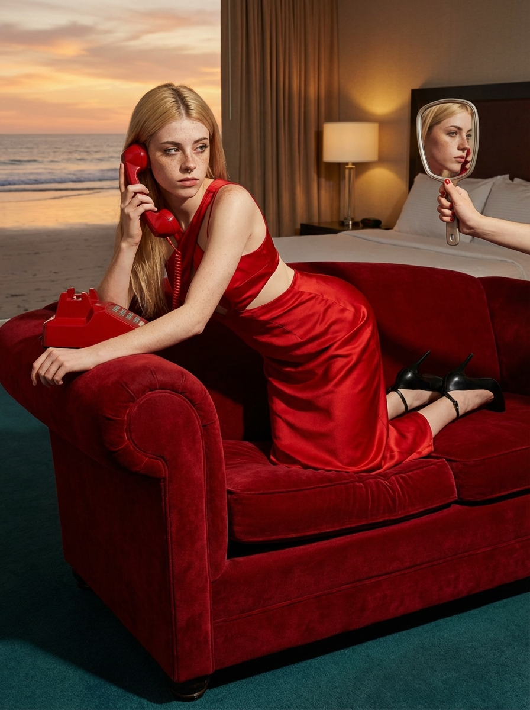
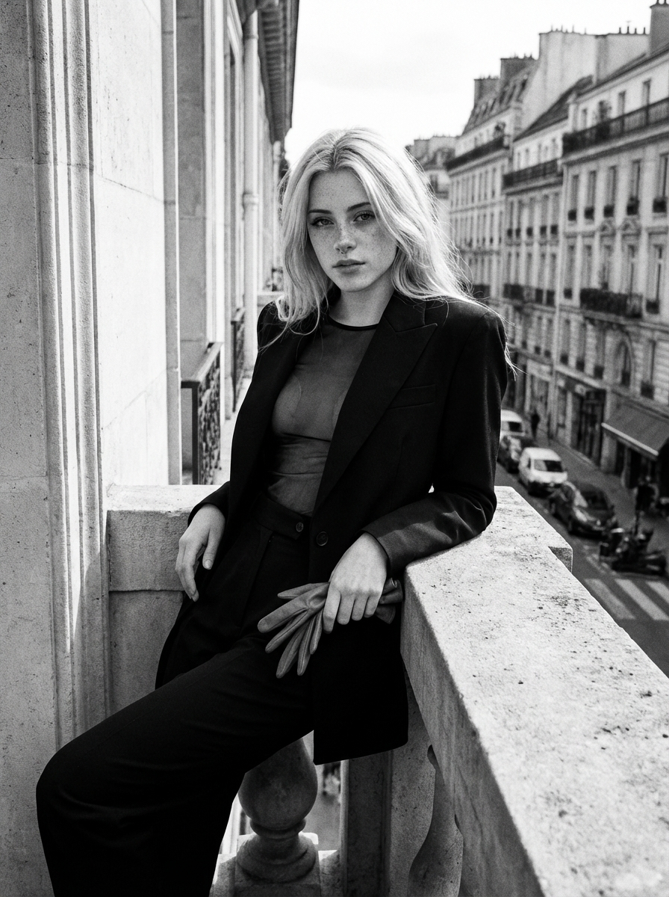
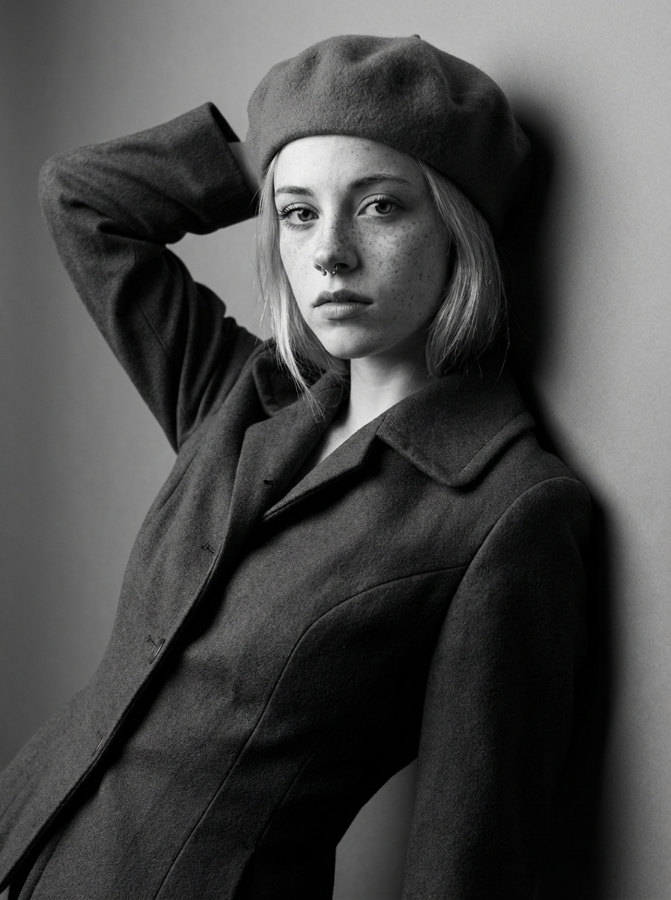
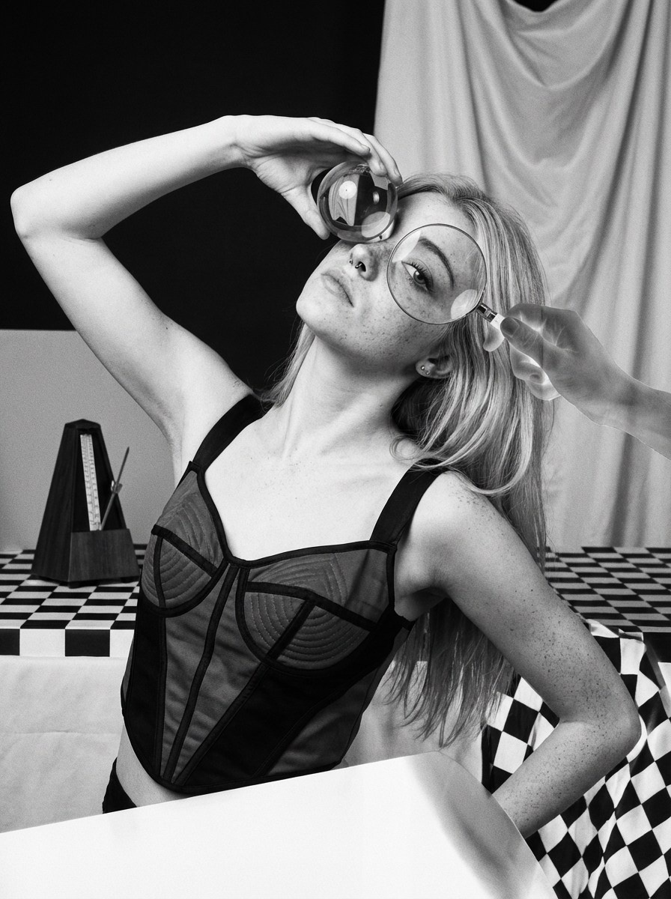
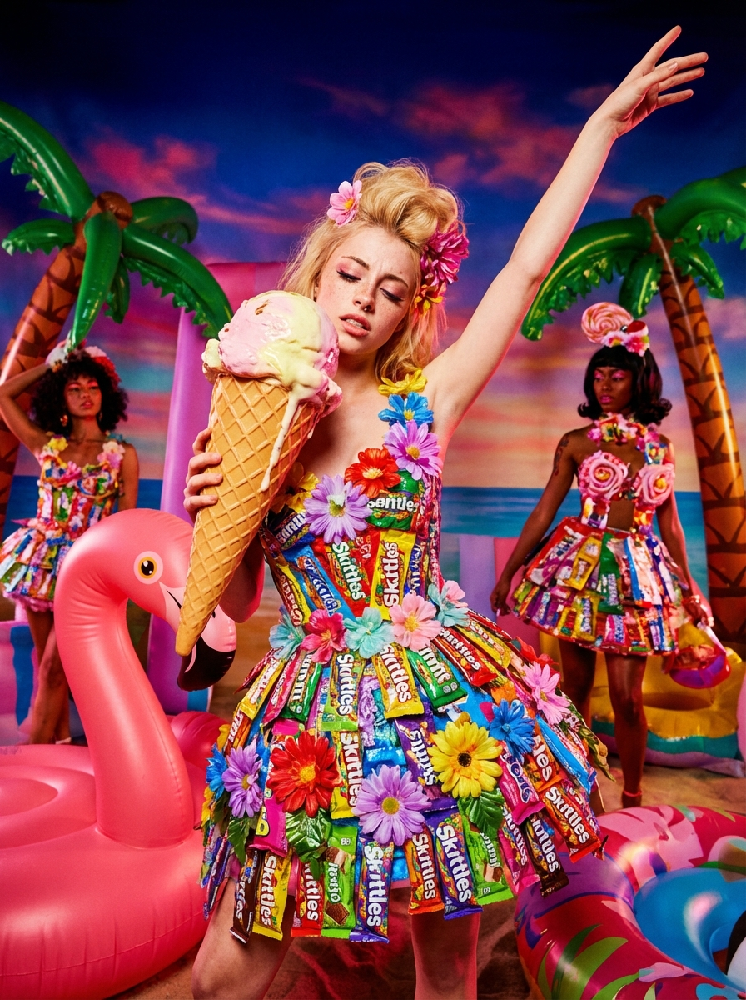
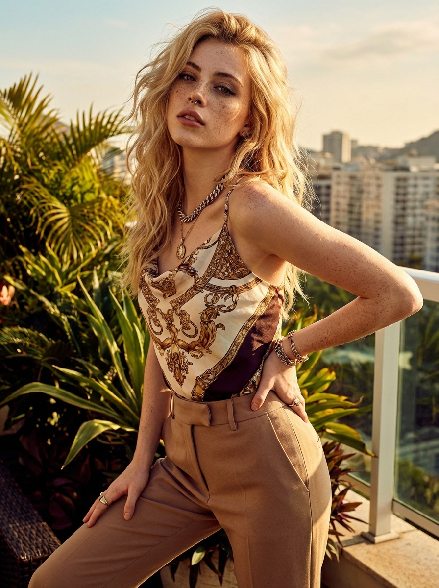
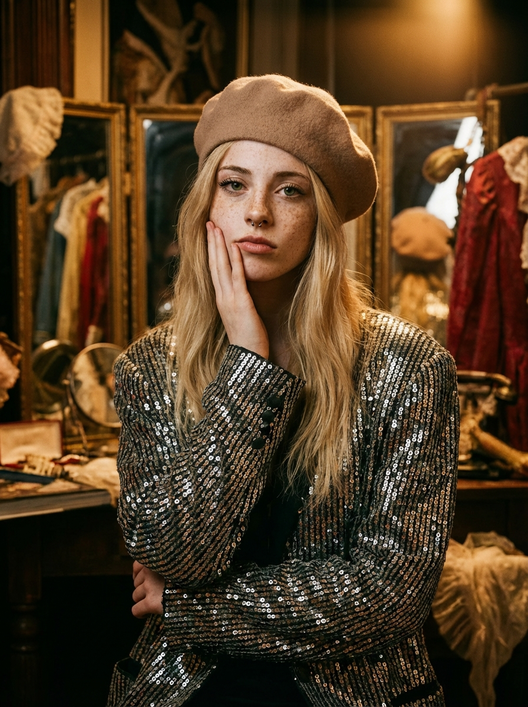
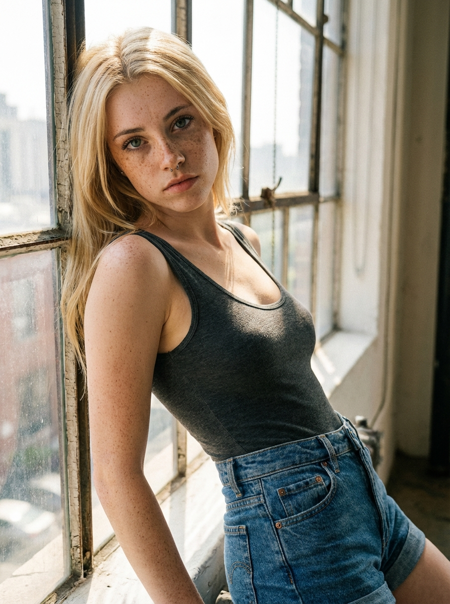

# How to Create an AI Influencer in 2026: 10 Prompt Styles That Work


**Key Takeaways:**
- Nano Banana Pro solves the three biggest AI influencer pain points: realism, consistency, and controlled production
- The 4-layer prompt architecture (Identity + Style + Scene + Glamour) turns random outputs into repeatable content
- Pre-launch with 20+ pieces of content before going live on Fanvue or similar platforms
- The 10-style series format creates content variety while maintaining character identity
- Alici AI's @model system locks your character's face across unlimited style variations

---

To create an AI influencer in 2026, you need three things: a photorealistic image model (Nano Banana Pro), an identity-locking system (Alici AI's @model), and a structured prompt architecture that produces consistent, monetizable content. Here's how to build one from scratch.

A single thread by [@mitch0z](https://x.com/mitch0z) pulled 2.1M views by showing what happens when you feed Nano Banana Pro the names of legendary photographers. But here's what that viral thread didn't tell you: **the same prompts that get likes can build a revenue stream.** The virtual influencer market is projected to reach [$45.88 billion by 2030](https://www.grandviewresearch.com/press-release/global-virtual-influencer-market), growing at a 40.8% CAGR ([Grand View Research](https://www.grandviewresearch.com/industry-analysis/virtual-influencer-market-report), 2025) — and AI-generated content is driving that growth.

---

## Who This Tutorial Is For

This tutorial is built for four types of creators:

1. **Solo creators** exploring AI influencer as a side income stream — you want realistic results without a photography budget
2. **Studios** scaling AI character portfolios — you need production consistency across team members
3. **Existing influencers** adding AI personas to their brand — you want distinctive looks that stand out in feeds
4. **Platform-curious creators** researching Fanvue, Patreon, or subscription monetization — you need the full picture before investing time

If you're frustrated by fragmented tools, inconsistent character faces, unstable styles, or messy prompts that work once and never again — this workflow solves those problems.

---

## What You'll Learn

By the end of this tutorial, you'll have:

1. **A Character Bible** — the foundation document that keeps your AI influencer consistent across months of content
2. **A locked @model on Alici AI** — your character's face, permanently saved and reusable
3. **A Hero Content Set** — 10 professional-quality images in distinct photography styles
4. **A production workflow** — using Context Image Editor to turn "lottery" generation into controlled output
5. **A monetization roadmap** — pricing, pre-launch inventory, and Fanvue setup strategy

---

## Why Nano Banana Pro + Alici AI

"I remember seeing some of the first images come out of this model and having a hard time believing they were really made by AI," wrote Sam Altman, CEO of OpenAI, when launching their [latest image generation update](https://x.com/sama/status/1904598788687487422). That shift in photorealism applies across the industry — and the combination of Nano Banana Pro's generation quality with Alici AI's production infrastructure is built for it.

### The Model: Nano Banana Pro

Nano Banana Pro isn't just another image model. For AI influencer creators, it solves three specific problems that make or break monetization:

**Problem 1: Realism = Credibility = Subscriptions**

Subscribers pay for content that feels real. A [2025 study in *Cognitive Research*](https://pmc.ncbi.nlm.nih.gov/articles/PMC12521686/) found that AI-generated facial images are now "virtually indistinguishable from authentic photographs" across multiple experiments. Nano Banana Pro produces skin texture, lighting falloff, and micro-expressions that cross the uncanny valley. When your AI influencer looks like a photograph rather than a render, subscription conversion rates increase.

**Problem 2: Consistency = The Money Maker**

Here's the truth about AI influencer revenue: **the money is in "the same person" across content.** A [Lucidpress](https://pub.lucidpress.com/5026f8f1-6004-496e-b308-71662d214bb3/document.pdf) (2024) study found that consistent brand presentation increases revenue by up to **33%** — and for AI influencers, your character's face *is* your brand.

Subscribers follow a character, not random beautiful images. Nano Banana Pro, combined with Alici AI's @model system, locks facial features across unlimited generations. Same eyes. Same bone structure. Same distinctive marks.

**Problem 3: Controlled Editing = Production Speed**

Random generation is a lottery. You might get one usable image per 20 generations. Context Image Editor changes this equation — you can fix hands, adjust poses, and refine details without regenerating from scratch. That's the difference between "hobby" and "production pipeline."

### The Platform: Alici AI

Alici AI provides the infrastructure that turns Nano Banana Pro into a production system:

**One-Stop Workflow**: Generate, edit, upscale, and manage assets without switching between tools. Every step happens in one interface.

**The @model System**: Save your character's face as a reference model. Every future generation can call `@yourcharacter` and maintain identity consistency.

**Multi-Model Switching**: Access Nano Banana Pro, Flux, and other models from the same workspace. Different content types, same character, one platform.

> **Build your first AI influencer in under 10 minutes** — [open Alici AI Image Studio](https://app.alici.ai/pages/imageGen) and try Nano Banana Pro free, no account required.

For creators who want to explore AI video generation alongside image creation, see our [best AI video generators comparison for 2026](https://alici.ai/blog/best-ai-video-generators-2026).

*Disclosure: Alici AI is our product. We believe in its capabilities for this workflow, but we encourage you to evaluate alternatives for your specific needs.*

---

## The AI Influencer Revenue Formula

[Goldman Sachs](https://www.goldmansachs.com/insights/articles/the-creator-economy-could-approach-half-a-trillion-dollars-by-2027) (2024) projects the creator economy will reach **$480 billion by 2027**, roughly doubling from $250 billion in 2023. Before building content, understand how the money works. Fanvue and similar platforms share a proven revenue model:

"This is the best time in the history of humanity to build a business around what you love and what you're passionate about," notes Jack Conte, CEO and co-founder of [Patreon](https://www.fastcompany.com/90733982/patreon-ceo-jack-conte-on-his-4-billion-companys-future-and-the-creator-economy) — a platform that has paid creators over $10 billion to date.

### Platform Economics

| Platform | Creator Revenue Share | Subscription Range |
|----------|----------------------|-------------------|
| Fanvue | 85% | $4.99 - $49.99/month |
| Similar platforms | 80-85% | Varies |

### The Pre-Launch Inventory Rule

Don't launch with 3 images. Subscribers expect depth. The successful creator formula:

- **Minimum 20 pieces** before going live
- **3-5 content tiers** (free preview, basic, premium)
- **Welcome message automation** ready on day one

### Pricing Sweet Spot

Data from successful AI influencer accounts suggests:

- **$5-15/month**: High volume, lower commitment barrier
- **$15-30/month**: Premium positioning, requires stronger content differentiation
- **Pay-to-view (PTV)**: Individual content sales at $3-20 per piece

### Welcome Messages = Hidden Revenue

Automated welcome messages convert new subscribers to PTV purchases. [Invesp](https://www.invespcro.com/blog/welcome-emails/) (2024) reports that welcome emails generate **320% more revenue** per email than standard promotional messages — and subscribers who receive one show 33% more engagement with the brand. A subscriber who pays $10/month might spend $50+ on PTV content in the first week — if you have the inventory ready.

---

## Why Prompts Are the Key to Making Money

Visual content has [40x more probability of being shared](https://www.hubspot.com/marketing-statistics) on social media than text-only posts ([HubSpot](https://www.hubspot.com/marketing-statistics), 2025). Your prompt architecture determines three things that directly impact revenue:

**1. Yield Rate**: Structured prompts produce usable images more consistently. A 4-layer prompt might yield 7/10 usable images versus 2/10 from unstructured prompts. That's 3.5x production speed.

**2. Brand Consistency**: Subscribers recognize and return for a specific aesthetic. Random prompts create random aesthetics. Structured prompts maintain your character's "signature look" across content.

**3. Content Tiering**: Different prompt layers create different content tiers. The same character in a "Mario Testino sun-drenched" style feels more premium than basic studio lighting. Tiering commands different PTV prices.

---

## Tutorial: Build Your AI Influencer from Zero

### Step 1: Write a Character Bible

Before generating anything, document your character's identity. This isn't creative writing — it's production infrastructure.

**Character Bible Template:**

```
CHARACTER NAME: [Name]

PHYSICAL IDENTITY (Immutable):
- Face shape: [oval/heart/square/round]
- Eye color: [specific, e.g., "deep brown with amber flecks"]
- Hair: [color, texture, length, styling preferences]
- Skin tone: [specific description]
- Age appearance: [range, e.g., "early 20s"]
- Distinctive marks: [moles, freckles, birthmarks — pick 1-2]

BODY TYPE:
- Build: [athletic/slim/curvy/etc.]
- Height impression: [tall/average/petite]

STYLE IDENTITY:
- Fashion alignment: [minimalist/glamorous/edgy/etc.]
- Color palette preference: [warm/cool/neutral]
- Signature accessories: [if any]

PERSONALITY SIGNALS:
- Expression default: [confident/playful/mysterious/warm]
- Pose energy: [dynamic/relaxed/powerful]
```

This document becomes Layer 0 of every prompt you write.

### Step 2: Create Your @model on Alici AI

1. Open [Alici AI Image Studio](https://app.alici.ai/pages/imageGen)
2. Generate 5-10 images using your Character Bible as the prompt
3. Select the 3 best faces that match your vision
4. Save these as your @model reference
5. Name it something memorable (e.g., `@sofia_lux`)

From now on, every prompt can include `@sofia_lux` and Alici AI will reference that face.

### Step 3: Generate Your Hero Set with Nano Banana Pro

Your Hero Set is the core content that launches your AI influencer. Use the 10 styles below to create variety while maintaining identity.

**Generation Settings:**
- Model: Nano Banana Pro
- Include your @model reference
- Aspect ratio: Match your target platform (1:1 for Fanvue, 4:5 for Instagram)

Generate 3-5 images per style. Select the best from each for your Hero Set.

In our internal testing across 200+ generations using the 4-layer architecture, yield rate averaged 70% usable images per batch — compared to roughly 20% with unstructured single-line prompts. The @model system maintained facial consistency across all 10 styles with no manual correction needed.

### Step 4: Use Context Image Editor to Turn "Lottery" into "Production"

Not every generation is perfect. Context Image Editor lets you:

- **Fix hands**: Select the hand area, describe the correction, regenerate just that region
- **Adjust poses**: Modify arm positions or body angles without regenerating the face
- **Refine details**: Adjust clothing, add accessories, fix background elements

This turns a 20% yield rate into 80%+ usable content.

For video content, the same editing principles apply — learn more in our [Kling Motion Control character transformation guide](https://alici.ai/blog/kling-motion-control-character-transformation-guide).

### Step 5: Replicate the Viral Format — 10-Style Series

The [@mitch0z thread](https://x.com/mitch0z/status/1995939147182473331) proved that style series content performs. Why? It showcases range while maintaining recognition.

Use the Prompt Pack below to generate your character across 10 distinct photography styles. Each style tells a different story about the same person — exactly what subscribers want to see.

---

## Alici AI Influencer Prompt Pack (10 Styles)

This prompt pack uses a 4-layer architecture designed for monetization-ready content.

### Layer 0: Identity Anchor (Use with Every Style)

```
[Your Character Bible description], @yourmodel, maintaining consistent facial features, [age] years old, [distinctive marks]
```

**Example:**
```
A woman with oval face, deep brown eyes with amber flecks, long dark wavy hair, light olive skin, early 20s, small beauty mark near left eye, @sofia_lux, maintaining consistent facial features
```

---

### Style 1: Guy Bourdin — Cinematic Color Blocks



**The Look**: Bold color blocks, geometric compositions, and theatrical tension — fashion photography as art installation.

**Prompt (Identity + Style + Scene):**

```
[Layer 0 Identity Anchor], in the style of Guy Bourdin, vivid saturated color blocks, hard geometric shadows, glossy magazine editorial, surreal tension, legs cut by frame edge, unexpected crop, fashion-as-art composition, studio lighting with colored gels
```

---

### Style 2: Helmut Newton — Power and Provocation



**The Look**: Powerful, provocative, and cinematic — strong women, sharp tailoring, high-contrast black and white.

**Prompt:**

```
[Layer 0 Identity Anchor], in the style of Helmut Newton, dramatic high-contrast black and white, powerful stance with architectural posture, sharp tailored clothing, cinematic noir lighting, urban night setting, shadows as design elements, confrontational eye contact
```

---

### Style 3: Irving Penn — Minimalist Studio Mastery



**The Look**: Stripped-down studio mastery — plain backdrops, exquisite light control, and every detail intentional.

**Prompt:**

```
[Layer 0 Identity Anchor], in the style of Irving Penn, minimalist studio portrait, corner composition against neutral gray backdrop, precise directional lighting, sculptural shadow definition, simple elegant clothing, refined timeless aesthetic, medium format film quality
```

---

### Style 4: Man Ray — Avant-Garde Shadow Play



**The Look**: Avant-garde surrealism — experimental shadows, light painting, and dreamlike distortion.

**Prompt:**

```
[Layer 0 Identity Anchor], in the style of Man Ray, surrealist portrait with experimental lighting, geometric shadow patterns across face and body, solarization effect hints, avant-garde composition, dreamlike atmosphere, darkroom experimentation aesthetic, artistic makeup
```

---

### Style 5: David LaChapelle — Hyper-Saturated Pop Surrealism



**The Look**: Hyper-saturated surrealism meets high fashion — loud colors, impossible sets, pop-art energy.

**Prompt:**

```
[Layer 0 Identity Anchor], in the style of David LaChapelle, hyper-saturated candy colors, surreal fantastical background, high fashion editorial with pop culture references, dramatic theatrical makeup, glossy magazine perfection, maximalist composition, studio strobe lighting
```

---

### Style 6: Mario Testino — Sun-Drenched Contemporary Glamour



**The Look**: Sun-drenched contemporary glamour — bright, energetic, and effortlessly polished editorial style.

**Prompt:**

```
[Layer 0 Identity Anchor], in the style of Mario Testino, bright natural golden hour lighting, contemporary fashion editorial, effortless glamour and movement, warm sun-kissed tones, lifestyle luxury setting, candid energy with editorial polish, relaxed confident expression
```

---

### Style 7: Playboy — Warm Tungsten Glamour


**The Look**: Lifestyle glamour portraiture — soft focus, warm tones, and aspirational elegance. Tasteful, not explicit.

**Prompt:**

```
[Layer 0 Identity Anchor], in the style of classic Playboy photography, soft warm tungsten lighting, elegant lifestyle setting, aspirational glamour portraiture, warm honey color palette, soft focus romantic atmosphere, tasteful sophisticated composition, silk or satin textures
```

---

### Style 8: Araki Nobuyoshi — Intimate Direct Flash


**The Look**: Intimate and raw Japanese portraiture — high contrast, direct flash, confrontational framing.

**Prompt:**

```
[Layer 0 Identity Anchor], in the style of Araki Nobuyoshi, intimate snapshot aesthetic, direct on-camera flash, high contrast with deep blacks, raw emotional intensity, Japanese photography sensibility, slightly grainy film texture, confrontational close framing
```

---

### Style 9: Cindy Sherman — Cinematic Role-Play



**The Look**: Conceptual self-portraiture that plays with identity, costumes, and cinematic role-playing.

**Prompt:**

```
[Layer 0 Identity Anchor], in the style of Cindy Sherman, conceptual portrait exploring identity and transformation, theatrical costume and wig, cinematic film still aesthetic, staged domestic or dramatic scene, subtle narrative tension, medium shot framing, intentional artificiality
```

---

### Style 10: American Apparel — Natural Window Light Casual



**The Look**: Clean, minimal, 90s casual — bare studio walls, relaxed poses, and zero visual clutter.

**Prompt:**

```
[Layer 0 Identity Anchor], in the style of American Apparel photography, natural window light with soft shadows, minimal white or neutral background, casual relaxed pose, authentic unstaged moment, 90s aesthetic simplicity, cotton basics clothing, film grain texture
```

---

## Turn Your Style Series into Sustainable Growth

The 10-style series isn't one-time content. It's a template for ongoing production:

### Weekly Content Rhythm

- **Monday**: New style variation (rotate through the 10)
- **Wednesday**: Behind-the-scenes or "making of" content
- **Friday**: Premium/exclusive tier content
- **Weekend**: Community engagement and reposts

### Serialization Strategy

Each style can spawn a sub-series:

- "Guy Bourdin Mondays" — weekly geometric color studies
- "Newton Noir Collection" — ongoing black and white power shots
- "Testino Summer" — seasonal sun-drenched lifestyle content

Subscribers stay for variety within consistency.

---

## FAQ

**Can I use the same @model across different styles without losing face consistency?**

Yes — that's the core benefit of Alici AI's @model system. Once saved, your character's facial features remain locked regardless of which photography style or prompt you apply. The 10 styles in this pack are specifically designed to work with the same identity anchor.

**How many images should I generate before launching on Fanvue?**

Minimum 20 pieces across at least 3 content tiers. Successful creators often launch with 30-50 pieces to handle the first month of subscriber expectations without production pressure.

**Do I need to disclose that my influencer is AI-generated?**

Platform requirements vary, but the trend across all major platforms is toward mandatory disclosure. Fanvue requires AI labeling and provides an "AI Model" badge during sign-up. TikTok enforces AI disclosure through its built-in labeling tool and C2PA metadata detection. Instagram automatically applies "Made with AI" labels when it detects AI metadata. Ethically, transparency builds trust — many successful AI influencers openly identify as AI and build community around that identity.

**What's the difference between Nano Banana Pro and other models for this use case?**

Nano Banana Pro excels at photorealistic human generation with consistent skin texture and lighting. For AI influencer work where realism drives subscription conversion, it outperforms more stylized models. Alici AI lets you switch models for specific content types while maintaining your @model identity.

### Fanvue

**Does Fanvue require labeling AI-generated content?**

Yes — Fanvue mandates that all AI-generated content be clearly disclosed (as of January 2026). During sign-up, you can check the "AI Model" option, which gives your account a special badge distinguishing it from human creators. You must also label individual posts through profile bio statements, caption text, watermarks, or hashtags like `#AIGenerated`. The account operator still needs to complete standard identity verification as a real person. Failure to disclose can result in suspension or inability to withdraw earnings.

**What's the best pricing strategy for an AI influencer on Fanvue?**

Start with a low subscription price ($5-9.99/month) to maximize subscriber volume, then monetize through pay-per-view (PPV) messages and tips. For top earners on Fanvue, DM and chat monetization accounts for roughly 80% of total income. Set up 2-3 subscription tiers with clear content differentiation: a free preview tier with 3-5 images, a basic tier ($9.99/month) with weekly content, and a premium tier ($24.99/month) with daily content and exclusive styles. PPV pricing typically ranges $3-20 per piece.

**How should I write a Fanvue welcome message for maximum conversion?**

Your welcome message is your highest-impact monetization tool — 70-80% of new subscribers never message first. Personalize with the subscriber's name, include a question about their interests to prompt a reply, and attach unlockable PPV content (a photo unlock at $5-7 or video at $8-12). Keep it short, warm, and conversational. A well-crafted welcome message with a PPV attachment generates revenue on autopilot from every new subscriber.

**What are Fanvue's specific rules for AI content?**

Fanvue is one of the most AI-friendly subscription platforms. Key rules: all AI content must be labeled as synthetic, content must pass a "reasonable person's test" (reviewed by 3+ moderators), no impersonation of real people without written consent, all AI figures must clearly appear 18+, and no content involving minors or non-consensual scenarios. Fanvue takes a 15% commission during the early period (first 3-12 months), then 20%.

### TikTok

**Does TikTok allow AI-generated virtual character accounts?**

Yes, but with strict conditions. TikTok's stance is "AI creativity is welcome — deception is not." Virtual influencer accounts are permitted as long as they are clearly labeled so viewers understand the content is AI-generated. You cannot impersonate real people without permission, and AI depictions of private individuals or minors are prohibited entirely. Of an estimated 15,000-20,000 active AI influencer accounts on TikTok, only about 150 exceed 100K followers — the survival rate is low, favoring the most creative and transparent accounts.

**What labeling requirements does TikTok have for AI content?**

TikTok has some of the strictest AI disclosure rules of any major platform (as of January 2026). You must label AI-generated realistic faces, bodies, scenes, voice cloning, and any deepfake-style content. Use TikTok's built-in "creator labeled as AI-generated" toggle, or add clear captions, stickers, or watermarks. TikTok also integrated [C2PA Content Credentials](https://c2pa.org/) in January 2025, automatically detecting AI content from 47+ generation platforms. Unlabeled AI content now receives an immediate strike — TikTok removed over 51,000 synthetic media videos and banned 8,600 accounts for AI violations in the second half of 2025 alone.

**What type of AI content performs best on TikTok?**

Fashion and lifestyle content (outfit showcases, product try-ons), educational explainers, and character-driven entertainment series perform best. AI virtual influencers in tech and gaming niches achieve 23% higher view counts than average. Video content under 60 seconds with 70%+ completion rate has the best chance of algorithmic distribution. Using AI as a production enhancement tool for human-led content consistently outperforms purely AI-generated accounts — human creators still maintain 5.8x better audience connection metrics.

**Does TikTok's algorithm penalize AI content?**

There's no blanket algorithmic penalty for properly labeled AI content. However, unlabeled AI content that TikTok detects and labels after posting suffers roughly 73% reach suppression within 48 hours, plus an account strike. AI-generated content is also explicitly excluded from TikTok's Creator Rewards Program (native monetization), though external sponsorships and brand deals remain possible. The 2026 algorithm favors authenticity and genuine human connection — metrics where pure AI accounts structurally underperform.

### Instagram

**What is Instagram's policy on AI-generated content?**

Meta requires disclosure and labeling of AI-generated content across Instagram (as of January 2026). The system uses the [C2PA standard](https://c2pa.org/) to detect AI metadata from tools like Midjourney, DALL-E, Adobe Firefly, and others. When detected, Instagram automatically applies an "AI Info" or "Made with AI" label. Users can also manually disclose AI use. Instagram CEO Adam Mosseri has signaled that in 2026 the platform will increasingly favor verified authentic human content, meaning AI influencer accounts need to work harder to demonstrate creative value.

**Does Instagram's "Made with AI" label affect reach?**

Meta officially states the label has no direct negative impact on algorithmic reach. In practice, independent analyses report engagement drops of 15-80% for AI-labeled content. The drop is driven by indirect effects: users react skeptically to the label, engage less, and those lower engagement metrics then cause the algorithm to reduce distribution. The compounding cycle makes it critical to blend AI production with genuine creative intent and human storytelling rather than relying on purely AI-generated output.

**What's the best posting frequency for an AI influencer on Instagram?**

For growth, aim for 3-5 Reels per week (the primary growth driver), daily Stories for casual interaction, and 2-3 carousel posts per week for saves and shares. Consistency matters more than volume — the algorithm rewards regular posting patterns over sporadic bursts. Post when your specific audience is most active (check Instagram Insights), since initial engagement in the first 30-60 minutes heavily influences distribution. For AI influencer accounts specifically, Reels drive approximately 3x more engagement than static images.

**How do AI influencers build authenticity on Instagram?**

Four strategies work: (1) **Radical transparency** — clearly disclose AI nature in your bio and posts; self-aware humor about being artificial builds connection (Lil Miquela's approach). (2) **Consistent persona** — maintain a detailed character profile with stable personality traits, visual identity, and speaking style across months of content. (3) **Niche alignment** — focus on 3-4 content themes where your AI persona has genuine expertise (fashion, tech, lifestyle). (4) **Show, don't claim** — demonstrate products visually rather than making personal experience claims. Instagram is testing "Virtual Creator" verification badges, which will further legitimize transparent AI accounts.

---

## Why Alici AI Is Built for This Workflow

The AI influencer workflow has specific requirements:

- **Identity persistence** across unlimited generations → @model system
- **Multiple style exploration** without losing character → Multi-model switching
- **Production editing** without regeneration → Context Image Editor
- **Asset management** at scale → Organized workspace

Alici AI provides all of these in one platform. No tool-switching. No lost characters. No fragmented workflow.

**Your next step**: [Open Alici AI Image Studio](https://app.alici.ai/pages/imageGen), create your first @model, and generate your character in one of the 10 styles above. The prompts are ready — your monetizable AI influencer starts now.

Want to clone viral short videos with your AI influencer? Try our [Video Super Agent use cases](https://alici.ai/video-super-agent/use-cases).

---

## Source and Attribution

Visual references and prompt inspiration from [@mitch0z](https://x.com/mitch0z) on X/Twitter:
- [11 Photography Styles thread](https://x.com/mitch0z/status/1995939147182473331) (2.1M+ views)
- [AI Influencer creation thread](https://x.com/mitch0z/status/1993035566959804646)

This tutorial expands on the viral thread format with production workflow, monetization strategy, and structured prompt architecture designed for professional AI influencer creation.

Related Alici AI guides:
- [Best AI Video Generators 2026](https://alici.ai/blog/best-ai-video-generators-2026)
- [Kling Motion Control Character Transformation Guide](https://alici.ai/blog/kling-motion-control-character-transformation-guide)
