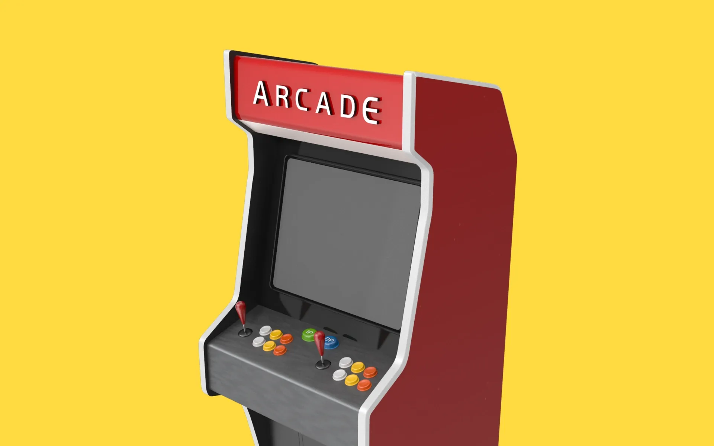
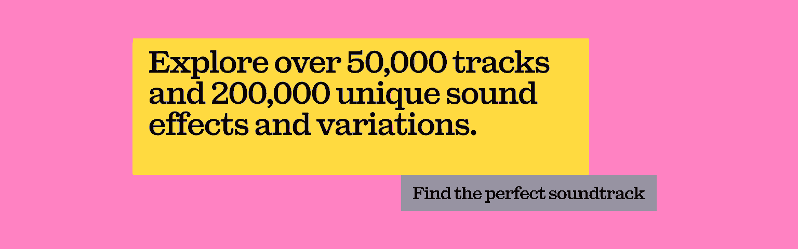

Title: How to A/B test YouTube thumbnails | Epidemic Sound

URL Source: https://www.epidemicsound.com/blog/a-b-test-youtube-thumbnails/

Published Time: 2024-06-12T05:23:00.000Z

Markdown Content:
YouTube thumbnails are something of an art. So, how important is it to A/B test them, how do you do it, and what’s Test & Compare all about?

*   

💡

****TL;DR:****A/B testing YouTube thumbnails is a process that presents randomized sets of users with different thumbnails. The design with the highest score “wins,” suggesting that you should use that thumbnail. YouTube’s own tool, Test & Compare, makes this process relatively simple to conduct in-platform.

Today, we’ll discuss:

*   [What is A/B testing for YouTube thumbnails?](https://www.epidemicsound.com/blog/a-b-test-youtube-thumbnails/#what-is-ab-testing-for-youtube-thumbnails)
*   [Why is A/B testing important for YouTube thumbnails?](https://www.epidemicsound.com/blog/a-b-test-youtube-thumbnails/#why-is-ab-testing-important-for-youtube-thumbnails)
*   [Can you A/B test thumbnails on YouTube?](https://www.epidemicsound.com/blog/a-b-test-youtube-thumbnails/#can-you-ab-test-thumbnails-on-youtube)
*   [How to use Test & Compare](https://www.epidemicsound.com/blog/a-b-test-youtube-thumbnails/#how-to-use-test-and-compare)
*   [How does YouTube measure A/B thumbnail tests?](https://www.epidemicsound.com/blog/a-b-test-youtube-thumbnails/#how-does-youtube-measure-ab-thumbnail-tests)
*   [How else can you A/B test YouTube thumbnails?](https://www.epidemicsound.com/blog/a-b-test-youtube-thumbnails/#how-else-can-you-ab-test-youtube-thumbnails)
*   [How do you know if your YouTube thumbnail is good or bad?](https://www.epidemicsound.com/blog/a-b-test-youtube-thumbnails/#how-do-you-know-if-your-youtube-thumbnail-is-good-or-bad)

What is A/B testing for YouTube thumbnails?
-------------------------------------------

A/B testing is a user-experience technique through which you compare two variants of a webpage or app, scoring them against certain criteria to figure out which is best. In the context of [YouTube](https://www.epidemicsound.com/blog/tag/youtube/) thumbnails, A/B testing would show two different thumbnails to two randomized sets of users. You’d then analyze the responses to decide which thumbnail performed best.

A/B testing is sometimes called split testing or bucket testing, and can include more than two variants. However, for clarity, we’ll assume that you only want to A/B test two YouTube thumbnails today.

Why is A/B testing important for YouTube thumbnails?
----------------------------------------------------

Thumbnails are really, _really_ important for YouTube clicks and views. In fact, 90% of the best-performing videos on the platform have custom thumbnails — think of [the most-subscribed and -viewed YouTube channels,](https://www.epidemicsound.com/blog/most-subscribed-and-viewed-youtube-channels/) and you’ll notice that pretty much all of them use custom thumbnails.

A/B testing YouTube thumbnails helps you understand what your current — and potential — audience wants to see, and will give your content a stronger chance within [YouTube’s algorithm.](https://www.epidemicsound.com/blog/youtube-algorithm/) Once you get the A/B test results, you can fine-tune your thumbnail strategy to get your videos the clicks they deserve.

If you need to brush up on your knowledge or want to learn [how to make a YouTube thumbnail, click here.](https://www.epidemicsound.com/blog/how-to-make-a-youtube-thumbnail/)

Can you A/B test thumbnails on YouTube?
---------------------------------------

In mid-2023, YouTube introduced a free thumbnail A/B test feature called Test & Compare. Initially rolled out to a few hundred creators, Test & Compare was reported to be available to more than 50,000 creators in April 2024. As of June of the same year, the feature was rolled out more widely, but is still only accessible via desktop.

How to use Test & Compare
-------------------------

Let’s look at how Test & Compare works, and how you can check if you have it:

1.   **Upload your video as usual via [YouTube Studio.](https://www.epidemicsound.com/blog/how-to-use-youtube-studio/)** When you head to the ‘Thumbnail’ section, the ‘Test & Compare’ option should appear. If it doesn’t, then you don’t have it yet — but don’t worry! Skip ahead to work out how else you can A/B test YouTube thumbnails.
2.   **Click ‘Test & Compare.’** You can upload two or three thumbnails here. If you’re part of a larger business and have the time, we’d recommend uploading radically different thumbnails, as the point of this is to work out which type of thumbnail is most effective. If you’re a solo creator, more subtle, less time-consuming changes might be the best use of your resources.
3.   **Results should start coming in a few hours after your video’s published.** Click on your video in YouTube Studio, then ‘Reach’ and ‘Thumbnail test.’ Alternatively, go to ‘Video details,’ then click the three-dot menu in the corner of your video’s thumbnail. Hit ‘View test report.’
4.   **If your YouTube thumbnail A/B test is complete, it should say ‘Thumbnail test completed.’** If there’s a clear winner, YouTube will use that thumbnail for all viewers going forward. If the competition’s too tight, it will say that the test was finished ‘without a conclusive result.’ Tests can take anywhere between a few hours to a few days.
5.   **If you’d like to stop the test, run another, or manually add your own thumbnail, you can do so.** The latter option is handy if the results keep coming back with no clear winner.

You can use Test & Compare for long-form videos, finished [live streams,](https://www.epidemicsound.com/blog/how-to-live-stream/) and video podcasts. However, you can’t use it for content aimed at kids, private videos, [YouTube Shorts](https://www.epidemicsound.com/blog/everything-you-need-to-know-about-youtube-shorts/) content, or mature videos.

How does YouTube measure A/B thumbnail tests?
---------------------------------------------

Given how important click-through rate (CTR) is nowadays, you’d assume that YouTube would use it as the main metric for A/B thumbnail tests. Nope. In fact, measuring by click-through rate wouldn’t be an accurate way to A/B test thumbnails. Why?

Let’s look at it like this: one of your thumbnails could have an off-the-charts CTR, but at the same time, it could be top-tier [clickbait.](https://www.epidemicsound.com/blog/what-is-clickbait/) You might reel people in with a larger-than-life headline and epic image, but they’ll click away once they realize you don’t, in fact, have the real answers to the Bermuda Triangle. The clicks prove quantity here, rather than quality.

That’s why Test & Compare measures A/B thumbnail tests through watch time share — this spreads the exact watch time across the thumbnails. So, if thumbnail A racked up 30 hours’ watch time and thumbnail B got 70, that would be a split of 30% for A and 70% for B. This is even more accurate than metrics like average view duration, as it splits the watch time by a hair’s breadth.

Once viewers click that thumbnail, it’s your job to hold their attention. One of the most effective ways to do this is with music — after all, [the soundtrack can make or break your content.](https://www.epidemicsound.com/blog/how-the-soundtrack-will-make-or-break-your-content/) Find the perfect match today with Epidemic Sound’s catalog of more than 50,000 tracks and 200,000 unique sound effects and variations.

How else can you A/B test YouTube thumbnails?
---------------------------------------------

If you don’t have access to Test & Compare, don’t sweat it — the tool should be available to all YouTubers later in 2024. However, you _can_ use a paid-for tool like [TubeBuddy’s Thumbnail Analyzer,](https://www.tubebuddy.com/tools/thumbnail-analyzer/) which does a similar thing to Test & Compare. There’s even a generative heatmap, showing where viewers’ eyes land.

You can still A/B test for free directly through YouTube, though — you just have to do it manually, and it doesn’t offer quite the same granular insight as Test & Compare.

Here’s how to manually A/B test YouTube thumbnails:

1.   **Look at your current content in YouTube Studio.**Check out the different stats in the ‘Reach’ section, and choose the ‘best’ performer — consider figures like watch time, CTR, impressions, and more.
2.   **Change the video’s thumbnail.**Leave it live for a few days, so it has enough time to perform with the new visuals.
3.   **After a few days, go to that video’s ‘Analytics’ section, then ‘Advanced Mode.’**In the top-right, click ‘Compare to…’ and select the same video.
4.   **Head to the navigation bar above the graph,**then look for ‘Content.’ Click ‘More metrics’ from that dropdown menu, then select the metrics you’d like to analyze. ‘Watch time (hours),’ ‘Average view duration,’ and ‘Average percentage viewed’ are all solid choices here.
5.   **Find the date field near the top of the screen,**and choose the date you first published the video with the first thumbnail — if that video’s been live for years, maybe choose a shorter time-frame. Then, for the second thumbnail, choose the appropriate date.
6.   **Compare the stats based on the graph below.**It’s not as foolproof as Test & Compare, as the test periods were consecutive, rather than at the same time. But until you get your hands on Test & Compare, it’s not too shabby.

How do you know if your YouTube thumbnail is good or bad?
---------------------------------------------------------

Once you’ve A/B tested your YouTube thumbnails, you’ll have some changes to make. Look at which thumbnails were the most successful, and try picking out common threads. Did they have a particular color, text placement, hero image, or something equally identifiable?

As long as your thumbnails work on both desktop and mobile, you’ll be able to use your A/B test results to improve and finesse your work. And, if you’re still struggling for ideas, look at what your competitors are doing. If every other brand or creator in your sector is doing thumbnails that look nothing like yours, you’ve either stumbled upon a massive gap in the market, or you might have to reconsider your thumbnail strategy.

Now that you’ve learned what YouTube thumbnail A/B testing is, how it works, and how you can access tools to get the job done, it’s time to experiment. After all, A/B testing is all about trial and error — sometimes, you’ve got to get it wrong before you find the right fit.

One thing you can’t leave to chance, though, is the soundtrack. Bad music kills good video, and if you fall foul of copyright laws, your content could be muted, demonetized, or even removed. It’s not worth the risk.

But don’t worry — we’ve got you covered. Our catalog is high-quality, affordable, and safe. An Epidemic Sound subscription goes beyond [royalty-free music,](https://www.epidemicsound.com/music/) removing the headache of licensing and freeing you up to do what you do best. You can enjoy the safety of our license hand-in-hand with our massive catalog of 50,000 tracks, covering just about every genre you can think of. You’ll also gain unlimited access to our advanced search functions — finding the right sound’s never been easier.

It’s better than royalty-free. It’s worry-free. Get started with Epidemic Sound below.

Looking to take your [YouTube](https://www.epidemicsound.com/youtube/) channel to the next level? Browse our catalog of [sound effects for YouTube videos](https://www.epidemicsound.com/youtube/sound-effects-for-youtube-videos/) and our massive collection of [YouTube music.](https://www.epidemicsound.com/youtube/music-for-youtube/)

**Related posts:**

*   [The YouTube Shorts algorithm explained: Your guide](https://www.epidemicsound.com/blog/youtube-shorts-algorithm/)
*   [How to monetize your YouTube channel](https://www.epidemicsound.com/blog/how-to-monetize-your-channel/)
*   [What are YouTube tags and how important are they?](https://www.epidemicsound.com/blog/what-are-youtube-tags/)
