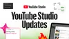
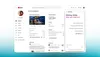
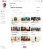
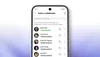
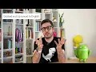
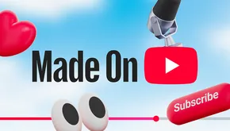

Title: Transform your creative journey with the latest YouTube Studio updates

URL Source: https://blog.youtube/news-and-events/youtube-studio-made-on-youtube-2025/

Published Time: 2025-09-16T14:30:00+00:00

Markdown Content:
New in YouTube Studio: Ask AI, Title A/B Testing & More - YouTube Blog
===============
[Skip to Main Content](https://blog.youtube/news-and-events/youtube-studio-made-on-youtube-2025/#jump-content)

### Suggested Searches

*   [What specific tools does YouTube offer creators?](https://blog.youtube/search/?query=What%20specific%20tools%20does%20YouTube%20offer%20creators%3F)
*   [Neal Mohan](https://blog.youtube/search/?query=Neal%20Mohan)
*   [What are the latest AI features on YouTube?](https://blog.youtube/search/?query=What%20are%20the%20latest%20AI%20features%20on%20YouTube%3F)

*   [News & Events](https://blog.youtube/news-and-events/ "News & Events")
*   [Creator & Artist Stories](https://blog.youtube/creator-and-artist-stories/ "Creator & Artist Stories")
*   [Culture & Trends](https://blog.youtube/culture-and-trends/ "Culture & Trends")
*   [Inside YouTube](https://blog.youtube/inside-youtube/ "Inside YouTube")
*   [Made On YouTube](https://blog.youtube/madeonyoutube/ "Made On YouTube")

*   [Feed](https://blog.youtube/feed/ "Feed")

 Subscribe 

Submit Search Search Input  Search with AI

 Subscribe 

 Transform your creative journey with the latest YouTube Studio updates 

*   
*   
*   
*    Copy link    

Submit Search Search Input  Search with AI

[News and Events](https://blog.youtube/news-and-events/ "News and Events")

Transform your creative journey with the latest YouTube Studio updates
======================================================================

By **Amjad Hanif****,**_Vice President of Creator Products, YouTube_

* * *

Sep 16, 2025[[read-time]] minute read

### Share

*   
*   
*   
*    Copy link    

Today at [Made On YouTube](https://blog.youtube/news-and-events/made-on-youtube-2025/), we announced a suite of YouTube Studio tools designed to be a true creative partner for you, no matter where you are in your journey.

Your creative journey starts here: with new YouTube Studio features to find inspiration, provide deeper audience insights, and give hands-on support to help you create.

**Ask Studio: Your creative partner realized**
----------------------------------------------

Every creator wants to know how their videos are landing and how to continue growing, so meet Ask Studio, an AI-powered partner to help Creators answer their most important questions. This conversational chat tool provides quick insights and ideas to help you understand your analytics, community and get new inspiration. Try asking, "catch me up on how my last video is performing,” or “tell me what my community is saying about my editing style.”

Our vision is for Ask Studio to become the ultimate creative partner for every Creator — a trusted companion that Creators turn to first. It’ll provide personalized and actionable strategic insights based on knowledge of you as a Creator, your channel, and how YouTube works. We’ll keep adding more capabilities in the future.

**Inspiration Tab**
-------------------

Getting started on your next video doesn’t have to be hard. You just need a good idea. The latest version of the Inspiration tab offers many new ways to spark your creativity. Get started easily with suggested topics on your feed. You can combine them, add your own and explore any creative direction you like. If you see an idea you like but want to tweak it further, you can build and iterate on it. No matter what you choose, we’ll deliver 9 fresh ideas with every prompt, helping you build out your content plan.

And we won’t just give you ideas: we’ll also tell you _why_ they could work. Pulling from audience behavior, we’ll provide insights to help you decide whether to invest in an idea. Inspiration can come from anywhere, but it starts with you.

 Video format not supported 

**Title A/B Testing**
---------------------

A compelling title and thumbnail are essential for attracting an audience. We know creators spend a lot of time on these, so now you can test and compare up to three titles and thumbnails per video. This expands on our popular thumbnail A/B testing feature, which has been used over 15 million times since it launched in 2023.

**Collaborations**
------------------

Some of YouTube's best moments happen when creators come together, and now you can more easily make those collabs happen right in YouTube Studio. You can add up to five collaborators to one video, which will get shown to the audiences of all participating creators. This helps introduce you and your co-creators to a new group of engaged viewers, helping everyone grow their channel. Revenue earned will be attributed to the channel that posts the video.

Made On YouTube 2025: Auto-Dubbing

**Auto dubbing with lip sync**
------------------------------

We're making auto dubbing more realistic than ever. With upcoming lip sync technology, translated videos will now visually match the speaker's lips with the newly dubbed language, making your content more accessible and engaging for global audiences. We support dubbing across 20 different languages, and we’ll begin testing this new lip sync feature in the coming months.

**Likeness detection**
----------------------

Our goal is to build AI technology that empowers human creativity responsibly, and that includes protecting creators and their businesses. We're expanding our likeness detection tool in an open beta to all YouTube Partner Program creators. This technology lets you easily detect, manage, and request the removal of unauthorized videos made with your facial likeness — a critical way to safeguard your identity and ensure your audience isn't misled.

More like this
--------------

[News and Events](https://blog.youtube/news-and-events/ "News and Events")[### The next 20: Powering the future of entertainment together at Made on YouTube](https://blog.youtube/news-and-events/made-on-youtube-2025/ "News and Events, The next 20: Powering the future of entertainment together at Made on YouTube")

We know that every creator has a different workflow and style, and we hope these tools provide just the amount of support you need to get and keep going! The human desire to create and connect has always been at the heart of YouTube — so explore in [Studio](https://studio.youtube.com/) and give it a try today!

More like this
--------------

[News and Events](https://blog.youtube/news-and-events/ "News and Events")[### The next 20: Powering the future of entertainment together at Made on YouTube](https://blog.youtube/news-and-events/made-on-youtube-2025/ "News and Events, The next 20: Powering the future of entertainment together at Made on YouTube")

Related Topics
--------------

*   [Made On YouTube](https://blog.youtube/search/?query=Made%20On%20YouTube&tags=Made%20On%20YouTube "Made On YouTube")
*   [YouTube Studio](https://blog.youtube/search/?query=YouTube%20Studio&tags=YouTube%20Studio "YouTube Studio")
*   [AI](https://blog.youtube/topic-hub/ai/ "AI")
*   [Trending](https://blog.youtube/search/?query=Trending&tags=Trending "Trending")
*   [Products and Features](https://blog.youtube/search/?query=Products%20and%20Features&tags=Products%20and%20Features "Products and Features")
*   [Creation](https://blog.youtube/search/?query=Creation&tags=Creation "Creation")

Want more from The YouTube Blog? Join our newsletter!

[Subscribe](https://blog.youtube/news-and-events/youtube-studio-made-on-youtube-2025/)

Explore the latest company news, creator and artist profiles, culture and trends analyses, and behind-the-scenes insights on the YouTube Official Blog.

Our Channels
------------

*   [YouTube](https://www.youtube.com/user/YouTube)
*   [YouTube Creators](https://www.youtube.com/user/creatoracademy)
*   [Creator Insider](https://www.youtube.com/channel/UCGg-UqjRgzhYDPJMr-9HXCg)
*   [TeamYouTube [Help]](https://www.youtube.com/user/YouTubeHelp)
*   [YouTube Liaison](https://www.youtube.com/@YouTubeInsider)

X (Twitter)
-----------

*   [YouTube](https://x.com/YouTube)
*   [YouTube Liaison](https://x.com/YouTubeInsider)
*   [YouTube Creators](https://x.com/YouTubeCreators)
*   [TeamYouTube](https://x.com/teamyoutube)
*   [YouTube Gaming](https://x.com/youtubegaming)
*   [YouTube TV](https://x.com/youtubetv)
*   [YouTube Music](https://x.com/youtubemusic?ref_src=twsrc%5Egoogle%7Ctwcamp%5Eserp%7Ctwgr%5Eauthor)
*   [YouTubeInsider](https://x.com/YouTubeInsider)

Connect

*   
*   

About YouTube
-------------

*   [About](https://about.youtube/)
*   [Press](https://blog.youtube/press/)
*   [Jobs](https://www.youtube.com/jobs/)
*   [How YouTube Works](https://www.youtube.com/howyoutubeworks/)
*   [YouTube Culture & Trends](https://www.youtube.com/trends/)
*   [Community Forum](https://support.google.com/youtube/community)

YouTube Products
----------------

*   [YouTube Kids](https://www.youtube.com/kids/)
*   [YouTube Music](https://www.youtube.com/musicpremium)
*   [YouTube Originals](https://www.youtube.com/channel/UCqVDpXKLmKeBU_yyt_QkItQ)
*   [YouTube Premium](https://www.youtube.com/premium/)
*   [YouTube TV](https://tv.youtube.com/welcome/?zipcode=78702)

For Business
------------

*   [Advertising](https://www.youtube.com/ads/)
*   [Developers](https://developers.google.com/youtube)

For Creators
------------

*   [Artists](https://artists.youtube/)
*   [Creators](https://www.youtube.com/creators/)
*   [Creator Academy](https://www.youtube.com/channel/UCkRfArvrzheW2E7b6SVT7vQ)
*   [Creating for Kids](https://www.youtube.com/yt/family/)
*   [Creators Research](https://www.youtube.com/creators/research/)
*   [Creators Services Directory](https://servicesdirectory.withyoutube.com/)
*   [YouTube VR](https://www.youtube.com/@360/featured)

Our Commitments
---------------

*   [Creators for Change](https://www.youtube.com/creators/)
*   [CSAI Match](https://www.youtube.com/csai-match/)
*   [Social Impact](https://socialimpact.youtube.com/)

*   [Policy & Safety](https://www.youtube.com/howyoutubeworks/policies/community-guidelines/#community-guidelines)
*   [Copyright](https://www.youtube.com/howyoutubeworks/policies/copyright/#support-and-troubleshooting)
*   [Brand Guidelines](https://www.youtube.com/howyoutubeworks/resources/brand-resources/#logos-icons-colors)
*   [Privacy](https://policies.google.com/privacy)
*   [Terms](https://www.youtube.com/t/terms)

[Help](https://support.google.com/youtube/community)

 Please check your network connection and try again.

Join our newsletter to receive the latest news, trends, and features straight to your inbox!

Your information will be used in accordance with Google's privacy policy. You may opt out at any time.

Let's get contenting! You'll receive a confirmation soon.

OK, got it
