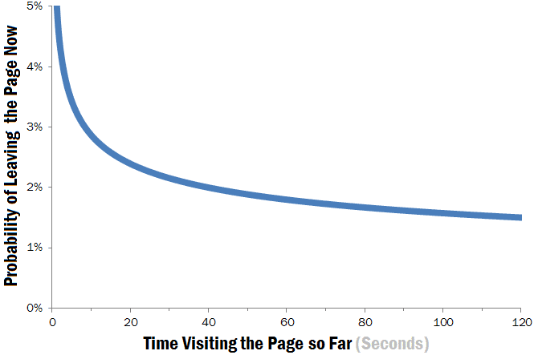

Title: How Long Do Users Stay on Web Pages?

URL Source: https://www.nngroup.com/articles/how-long-do-users-stay-on-web-pages/

Published Time: 2011-09-12T05:00:00+0000

Markdown Content:
How Long Do Users Stay on Web Pages? - NN/G
===============

*   [Consent](https://www.nngroup.com/articles/how-long-do-users-stay-on-web-pages/#)
*   [Details](https://www.nngroup.com/articles/how-long-do-users-stay-on-web-pages/#)
*   [[#IABV2SETTINGS#]](https://www.nngroup.com/articles/how-long-do-users-stay-on-web-pages/#)
*   [About](https://www.nngroup.com/articles/how-long-do-users-stay-on-web-pages/#)

This website uses cookies

Nngroup.com relies on cookies to improve your online experience. Cookies are used to play videos, display tweets, and to analyze our website traffic.

Consent Selection

**Necessary** 

- [x] 

**Preferences** 

- [x] 

**Statistics** 

- [x] 

**Targeting** 

- [x] 

[Customize cookies](https://www.nngroup.com/articles/how-long-do-users-stay-on-web-pages/#)

Details

*   
Necessary  6- [x]   Necessary cookies help make a website usable by enabling basic functions like page navigation and cookie consent. The website cannot function properly without these cookies. 

    *   [Cookiebot 1](https://www.nngroup.com/articles/how-long-do-users-stay-on-web-pages/#)[Learn more about this provider](https://www.cookiebot.com/goto/privacy-policy/ "Cookiebot's privacy policy")**CookieConsent**Stores the user's cookie consent state for the current domain**Maximum Storage Duration**: 1 year**Type**: HTTP Cookie   
    *   [LinkedIn 2](https://www.nngroup.com/articles/how-long-do-users-stay-on-web-pages/#)[Learn more about this provider](https://www.linkedin.com/legal/privacy-policy "LinkedIn's privacy policy")**bcookie**Used in order to detect spam and improve the website's security. **Maximum Storage Duration**: 1 year**Type**: HTTP Cookie  **li_gc**Stores the user's cookie consent state for the current domain**Maximum Storage Duration**: 180 days**Type**: HTTP Cookie   
    *   [w3.org 1](https://www.nngroup.com/articles/how-long-do-users-stay-on-web-pages/#)**__cf_bm**This cookie is used to distinguish between humans and bots. This is beneficial for the website, in order to make valid reports on the use of their website.**Maximum Storage Duration**: 1 day**Type**: HTTP Cookie   
    *   [www.nngroup.com 2](https://www.nngroup.com/articles/how-long-do-users-stay-on-web-pages/#)**csrftoken**Helps prevent Cross-Site Request Forgery (CSRF) attacks.**Maximum Storage Duration**: 1 year**Type**: HTTP Cookie  **SESS#**Preserves users states across page requests.**Maximum Storage Duration**: 14 days**Type**: HTTP Cookie   

*   
Preferences  1- [x]   Preference cookies enable a website to remember information that changes the way the website behaves or looks, like your preferred language. 

    *   [LinkedIn 1](https://www.nngroup.com/articles/how-long-do-users-stay-on-web-pages/#)[Learn more about this provider](https://www.linkedin.com/legal/privacy-policy "LinkedIn's privacy policy")**lidc**Registers which server-cluster is serving the visitor. This is used in context with load balancing, in order to optimize user experience. **Maximum Storage Duration**: 1 day**Type**: HTTP Cookie   

*   
Statistics  2- [x]   These cookies are used to analyze our web traffic. They allow us to count visits and traffic sources so we can measure and improve the performance of our site. They help us to know which pages are the most and least popular and see how visitors move around the site.All information these cookies collect is aggregated and therefore anonymous. If you do not allow these cookies we will not know when you have visited our site, and will not be able to monitor its performance. 

    *   [Google 2](https://www.nngroup.com/articles/how-long-do-users-stay-on-web-pages/#)[Learn more about this provider](https://business.safety.google/privacy/ "Google's privacy policy")Some of the data collected by this provider is for the purposes of personalization and measuring advertising effectiveness.

**_ga**Registers a unique ID that is used to generate statistical data on how the visitor uses the website.**Maximum Storage Duration**: 2 years**Type**: HTTP Cookie  **_ga_#**Used by Google Analytics to collect data on the number of times a user has visited the website as well as dates for the first and most recent visit. **Maximum Storage Duration**: 2 years**Type**: HTTP Cookie   

*   
Targeting  29- [x]   These cookies are set by third parties such as YouTube or Twitter. They track your behavior such as playing videos or which tweets you have already viewed. If you do not allow these cookies you will not be able to watch videos on this website. These cookies may be used by the cookie provider to build a profile of your interests and show you relevant advertisements on other sites. They do not store directly personal information, but are based on uniquely identifying your browser and internet device. 

    *   [Google 2](https://www.nngroup.com/articles/how-long-do-users-stay-on-web-pages/#)[Learn more about this provider](https://business.safety.google/privacy/ "Google's privacy policy")Some of the data collected by this provider is for the purposes of personalization and measuring advertising effectiveness.

**_gcl_au**Used by Google AdSense for experimenting with advertisement efficiency across websites using their services. **Maximum Storage Duration**: 3 months**Type**: HTTP Cookie  **_gcl_ls**Tracks the conversion rate between the user and the advertisement banners on the website - This serves to optimise the relevance of the advertisements on the website. **Maximum Storage Duration**: Persistent**Type**: HTML Local Storage   
    *   [Vimeo 7](https://www.nngroup.com/articles/how-long-do-users-stay-on-web-pages/#)[Learn more about this provider](https://vimeo.com/privacy "Vimeo's privacy policy")**_cf_bm**Cloudflare bot manager manages incoming traffic that matches the criteria associated with bots.**Maximum Storage Duration**: 1 day**Type**: HTTP Cookie  **_cfuvid** Cloudflare cookie used to enforce rate-limiting rules.**Maximum Storage Duration**: 1 day**Type**: HTTP Cookie  **cf_clearance**Cloudflare cookie used for bot prevention.**Maximum Storage Duration**: 1 year**Type**: HTTP Cookie  **flags**Specifies feature flags enabled by the video owner.**Maximum Storage Duration**: 1 year**Type**: HTTP Cookie  **player**Stores preferences for player controls (i.e. volume, stream quality, captions).**Maximum Storage Duration**: 1 year**Type**: HTTP Cookie  **player_clearance**Vimeo cookie used for bot prevention **Maximum Storage Duration**: 7 days**Type**: HTTP Cookie  **vuid**Vimeo-generated ID used for generating analytics information for the video owner.**Maximum Storage Duration**: 2 years**Type**: HTTP Cookie   
    *   [YouTube 20](https://www.nngroup.com/articles/how-long-do-users-stay-on-web-pages/#)[Learn more about this provider](https://business.safety.google/privacy/ "YouTube's privacy policy")**__Secure-ROLLOUT_TOKEN**Pending**Maximum Storage Duration**: 180 days**Type**: HTTP Cookie  **__Secure-YEC**Stores the user's video player preferences using embedded YouTube video**Maximum Storage Duration**: Session**Type**: HTTP Cookie  **__Secure-YNID**Pending**Maximum Storage Duration**: 180 days**Type**: HTTP Cookie  **LAST_RESULT_ENTRY_KEY**Used to track user’s interaction with embedded content.**Maximum Storage Duration**: Session**Type**: HTTP Cookie  **LogsDatabaseV2:V#||LogsRequestsStore**Used to track user’s interaction with embedded content.**Maximum Storage Duration**: Persistent**Type**: IndexedDB  **remote_sid**Necessary for the implementation and functionality of YouTube video-content on the website. **Maximum Storage Duration**: Session**Type**: HTTP Cookie  **ServiceWorkerLogsDatabase#SWHealthLog**Necessary for the implementation and functionality of YouTube video-content on the website. **Maximum Storage Duration**: Persistent**Type**: IndexedDB  **TESTCOOKIESENABLED**Used to track user’s interaction with embedded content.**Maximum Storage Duration**: 1 day**Type**: HTTP Cookie  **VISITOR_INFO1_LIVE**Tries to estimate the users' bandwidth on pages with integrated YouTube videos.**Maximum Storage Duration**: 180 days**Type**: HTTP Cookie  **YSC**Registers a unique ID to keep statistics of what videos from YouTube the user has seen.**Maximum Storage Duration**: Session**Type**: HTTP Cookie  **yt-icons-last-purged**Pending**Maximum Storage Duration**: Persistent**Type**: HTML Local Storage  **ytidb::LAST_RESULT_ENTRY_KEY**Stores the user's video player preferences using embedded YouTube video**Maximum Storage Duration**: Persistent**Type**: HTML Local Storage  **YtIdbMeta#databases**Used to track user’s interaction with embedded content.**Maximum Storage Duration**: Persistent**Type**: IndexedDB  **yt-remote-cast-available**Stores the user's video player preferences using embedded YouTube video**Maximum Storage Duration**: Session**Type**: HTML Local Storage  **yt-remote-cast-installed**Stores the user's video player preferences using embedded YouTube video**Maximum Storage Duration**: Session**Type**: HTML Local Storage  **yt-remote-connected-devices**Stores the user's video player preferences using embedded YouTube video**Maximum Storage Duration**: Persistent**Type**: HTML Local Storage  **yt-remote-device-id**Stores the user's video player preferences using embedded YouTube video**Maximum Storage Duration**: Persistent**Type**: HTML Local Storage  **yt-remote-fast-check-period**Stores the user's video player preferences using embedded YouTube video**Maximum Storage Duration**: Session**Type**: HTML Local Storage  **yt-remote-session-app**Stores the user's video player preferences using embedded YouTube video**Maximum Storage Duration**: Session**Type**: HTML Local Storage  **yt-remote-session-name**Stores the user's video player preferences using embedded YouTube video**Maximum Storage Duration**: Session**Type**: HTML Local Storage   

*   Unclassified 1  

    *   [media.nngroup.com 1](https://www.nngroup.com/articles/how-long-do-users-stay-on-web-pages/#)**algoliasearch-client-js-#.#.#-01234VWXYZ**Pending**Maximum Storage Duration**: Persistent**Type**: HTML Local Storage   

[Cross-domain consent[#BULK_CONSENT_DOMAINS_COUNT#]](https://www.nngroup.com/articles/how-long-do-users-stay-on-web-pages/#) [#BULK_CONSENT_TITLE#]

List of domains your consent applies to: [#BULK_CONSENT_DOMAINS#]

Cookie declaration last updated on 1/7/26 by [Cookiebot](https://www.cookiebot.com/ "Cookiebot")

[#IABV2_TITLE#]

[#IABV2_BODY_INTRO#]

[#IABV2_BODY_LEGITIMATE_INTEREST_INTRO#]

[#IABV2_BODY_PREFERENCE_INTRO#]

[#IABV2_LABEL_PURPOSES#]

[#IABV2_BODY_PURPOSES_INTRO#]

[#IABV2_BODY_PURPOSES#]

[#IABV2_LABEL_FEATURES#]

[#IABV2_BODY_FEATURES_INTRO#]

[#IABV2_BODY_FEATURES#]

[#IABV2_LABEL_PARTNERS#]

[#IABV2_BODY_PARTNERS_INTRO#]

[#IABV2_BODY_PARTNERS#]

About

Cookies are small text files that can be used by websites to track user actions and enhance website content and functionality.

This site uses different types of cookies. Some cookies are strictly necessary for the operation of this site; for all other types of cookies we need your permission. Some cookies are placed by third party services that appear on our pages.

Learn more about how we process personal data and how you can contact us in our [Privacy Policy](https://www.nngroup.com/privacy-policy/).

- [x] **Do not sell or share my personal information** 

Allow all cookies Customize cookies Allow selection Use necessary cookies only

[Skip to content](https://www.nngroup.com/articles/how-long-do-users-stay-on-web-pages/#main)

*    UX Training & Courses 
    *   ### Live Online

        *   [All Live Online Courses](https://www.nngroup.com/courses/)
        *   [Upcoming Live Online Training](https://www.nngroup.com/training/live-courses/)
        *   [UX Certification](https://www.nngroup.com/ux-certification/)
        *   [Private Team Training](https://www.nngroup.com/team-training/)
        *   [Bulk Discounts](https://www.nngroup.com/training/bulk-discounts/)

    *   ### Self-Paced

        *   [Self-Paced Courses](https://www.nngroup.com/contents/self-paced-courses/)

*    Articles & Resources 
    *           *   [Articles & Videos](https://www.nngroup.com/articles/)
        *   [Reports & Books](https://www.nngroup.com/reports/)
        *   [The NN/G UX Podcast](https://podcasters.spotify.com/pod/show/nngroup)

*    Consulting 
    *           *   [All Consulting Services](https://www.nngroup.com/consulting/)
        *   [Customized Research](https://www.nngroup.com/consulting/user-research/)
        *   [Expert Review](https://www.nngroup.com/consulting/expert-review/)
        *   [Intensive Applied Workshops](https://www.nngroup.com/consulting/applied-workshops/)
        *   [Keynote Speaking](https://www.nngroup.com/consulting/keynote-speaking/)
        *   [User Testing](https://www.nngroup.com/consulting/user-testing/)
        *   [UX Maturity Assessment](https://www.nngroup.com/consulting/ux-maturity-assessment/)

*    About Us 
    *           *   [About NNGroup](https://www.nngroup.com/about/)
        *   [People](https://www.nngroup.com/people/)
        *   [Clients](https://www.nngroup.com/about/about-client-list/)
        *   [News & Careers](https://www.nngroup.com/news/)
        *   [FAQs](https://www.nngroup.com/faqs/)
        *   [Contact Us](https://www.nngroup.com/about/contact/)

Search 

When autocomplete results are available use up and down arrows to review and enter to select. Touch device users, explore by touch or with swipe gestures.

[0](https://www.nngroup.com/products/basket/)

[Log In](https://www.nngroup.com/login/)

3

How Long Do Users Stay on Web Pages?
====================================

Jakob Nielsen

[Jakob Nielsen](https://www.nngroup.com/articles/author/jakob-nielsen/)
September 11, 2011 2011-09-11

[Share](https://www.nngroup.com/articles/how-long-do-users-stay-on-web-pages/#)

*   [Email article](mailto:?subject=NN/g%20Article:%20How%20Long%20Do%20Users%20Stay%20on%20Web%20Pages?&body=https://www.nngroup.com/articles/how-long-do-users-stay-on-web-pages/)
*   [Share on LinkedIn](http://www.linkedin.com/shareArticle?mini=true&url=http://www.nngroup.com/articles/how-long-do-users-stay-on-web-pages/&title=How%20Long%20Do%20Users%20Stay%20on%20Web%20Pages?&source=Nielsen%20Norman%20Group)
*   [Share on Twitter](https://twitter.com/intent/tweet?url=http://www.nngroup.com/articles/how-long-do-users-stay-on-web-pages/&text=How%20Long%20Do%20Users%20Stay%20on%20Web%20Pages?&via=nngroup)

 Summary:Users often leave Web pages in 10–20 seconds, but pages with a clear value proposition can hold people's attention for much longer. To gain several minutes of user attention, you must clearly communicate your value proposition within 10 seconds. 

How long will users stay on a web page before leaving? It's a perennial question, yet the answer has always been the same:

*   _Not very long._

The average page visit lasts a little less than a minute.

As users rush through web pages, they have [time to read only a quarter of the text](https://www.nngroup.com/articles/how-little-do-users-read/ "Alertbox: How Little Do Users Read?") on the pages they actually visit (let alone all those they don't). So, unless your writing is extraordinarily clear and focused, little of what you say on your website will get through to customers.

However, while users are always in a hurry on the web, the time they spend on individual page visits varies widely: sometimes people [bounce away](https://www.nngroup.com/articles/reduce-bounce-rates/ "Alertbox: Reduce Bounce Rates: Fight for the Second Click") immediately, other times they linger for far longer than a minute. Given this, **the average is not the most fruitful way of analyzing** user behaviors. Users are human beings — their [behaviors are highly variable](https://www.nngroup.com/articles/variability-in-user-performance/ "Alertbox: Variability in User Performance") and are [not captured fully by a single number](https://www.nngroup.com/articles/interaction-elasticity/ "Alertbox: Interaction Elasticity").

In This Article:
----------------

[Leaving Web Pages: The Weibull Hazard Function](https://www.nngroup.com/articles/how-long-do-users-stay-on-web-pages/#toc-leaving-web-pages-the-weibull-hazard-function-1)

*   [Leaving Web Pages: The Weibull Hazard Function](https://www.nngroup.com/articles/how-long-do-users-stay-on-web-pages/#toc-leaving-web-pages-the-weibull-hazard-function-1)
*   [Negative Aging: Leave Quick or Stay Long](https://www.nngroup.com/articles/how-long-do-users-stay-on-web-pages/#toc-negative-aging-leave-quick-or-stay-long-2)

Leaving Web Pages: The Weibull Hazard Function
----------------------------------------------

[Research by Chao Liu and colleagues](https://dl.acm.org/citation.cfm?doid=1835449.1835513 "ACM Digital Library: Chao Liu, Ryen W. White, and Susan Dumais. 2010. Understanding web browsing behaviors through Weibull analysis of dwell time. In Proceedings of the 33rd international ACM SIGIR conference on Research and development in information retrieval (SIGIR '10)") from Microsoft Research now provides a mathematical understanding of users' page-leaving behaviors. The scientists collected data from "a popular web browser plug-in," analyzing page-visit durations for **205,873 different web pages** for which they had captured upwards of **10,000 visits**. Suffice it to say: these guys crunched _a lot_ of data (more than 2 billion dwell times).

*   The result: **the time users spend on a web page follows a Weibull distribution**.

99.9% of readers will now ask: _What's a Weibull distribution?_

**Weibull is a reliability-engineering concept that's used to analyze the time-to-failure for components**. The model's _hazard function_ indicates the probability that a component will fail at time _t_, given that it has worked fine up until time _t_.

So, after replacing a spare part in a piece of equipment, Weibull analysis predicts when you'll have to replace it again. It also lets you conduct risk analysis beyond simplistic mean-time to failure. And, if you own a lot of equipment, you can use aggregate analysis to, say, manage your spare parts inventory.

Of course, **when analyzing Web visits, we simply replace "component failure" with "user leaving the page."** In their research paper, Liu and colleagues provide intensive statistical analysis to show that the Weibull model closely matches users' empirically observed behavior.

According to earlier research, there are 2 different kinds of Weibull distributions:

*   **Positive aging**: The longer the component has been in service, the **more likely** it is to fail. In other words, the hazard function increases for larger values of _t_. This makes intuitive sense, because the longer stuff is used, the more it wears down. Thus, something that has been in use for a long time will be approaching its breaking point.
*   **Negative aging**: The longer the component has been in service, the **less likely** it is to fail. Here, the hazard function decreases for larger values of _t_. This makes sense when individual components vary in quality: poorly made components usually fail early, so anything that has been in service for a long time is likely to be particularly robust and will usually survive even longer.

Negative Aging: Leave Quick or Stay Long
----------------------------------------

The researchers discovered **that 99% of web pages have a negative aging effect**. In human–computer interaction (HCI) research, it's extremely rare to get this strong a finding, and Liu and colleagues should be credited with discovering a major new insight.

Why negative aging? Because web pages are indeed of highly variable quality. Users know this and spend their initial time on a page in ruthless triage to abandon the dross ASAP. It's rare for people to linger on web pages, but when users do decide that a page is valuable, they may stay for a bit.

The following chart shows the hazard function — that is, the likelihood of leaving — for the median Weibull parameters fitted across the scientists' humongous dataset:

It's clear from the chart that the **first 10 seconds of the page visit are critical** for users' decision to stay or leave. The probability of leaving is very high during these first few seconds because users are extremely skeptical, having suffered countless poorly designed web pages in the past. People know that most web pages are useless, and they behave accordingly to avoid wasting more time than absolutely necessary on bad pages.

If the web page survives this first — extremely harsh — 10-second judgment, users will look around a bit. However, they're still highly likely to leave during the subsequent 20 seconds of their visit. Only after people have stayed on a page for about 30 seconds does the curve become relatively flat. People continue to leave every second, but at a much slower rate than during the first 30 seconds.

So, if you can convince users to stay on your page for half a minute, there's a fair chance that they'll stay much longer — often 2 minutes or more, which is an eternity on the web.

So, roughly speaking, there are two cases here:

*   **bad pages**, which get the chop in a few seconds; and
*   **good pages**, which might be allocated a few minutes.

Note: **"good" vs. "bad" is a decision that each individual user makes** within those first few seconds of arriving. The design implications are clear:

*   To gain several minutes of user attention, you must clearly **communicate your value proposition within 10 seconds**.

### Reference and Related Reading

[Chao Liu, Ryen W. White, and Susan Dumais. 2010. Understanding web browsing behaviors through Weibull analysis of dwell time.](https://dl.acm.org/citation.cfm?doid=1835449.1835513) In Proceedings of the 33rd international ACM SIGIR conference on Research and development in information retrieval (SIGIR '10)

[Optimize for Return Visits, Not Bounce Rate](https://www.nngroup.com/articles/return-visits-not-bounce/)

[Related Content Boosts Pageviews, When Done Right](https://www.nngroup.com/articles/related-content-pageviews/)

[Why Site Tourists are Worthless](https://www.nngroup.com/articles/why-site-tourists-are-worthless/)

Related Courses
---------------

*   [#### The Human Mind and Usability Use psychology to predict and explain how your customers think and act Interaction](https://www.nngroup.com/courses/human-mind/?lm=how-long-do-users-stay-on-web-pages&pt=article)
*   [#### Web Page UX Design Strategically combine content, visuals, and interactive components to design successful web pages Interaction](https://www.nngroup.com/courses/web-page-design/?lm=how-long-do-users-stay-on-web-pages&pt=article)

Human Computer Interaction,Web Usability,timing

Related Topics
--------------

*   Human Computer Interaction[Human Computer Interaction](https://www.nngroup.com/topic/human-computer-interaction/)
*   [Web Usability](https://www.nngroup.com/topic/web-usability/)

Learn More:
-----------

*   [ Steering Law for Cursor and Mouse Movements in a GUI Tunnel Lexie Kane · 3 min](https://www.nngroup.com/videos/steering-law/?lm=how-long-do-users-stay-on-web-pages&pt=article)  
*   [ Fitts's Law Lexie Kane · 2 min](https://www.nngroup.com/videos/fittss-law/?lm=how-long-do-users-stay-on-web-pages&pt=article)  
*   [ Observe, Test, Iterate, and Learn (Don Norman) Don Norman · 4 min](https://www.nngroup.com/videos/observe-test-iterate-and-learn-don-norman/?lm=how-long-do-users-stay-on-web-pages&pt=article)  

Related Articles:
-----------------

*   [The Role of Enhancement in Web Design Raluca Budiu · 7 min](https://www.nngroup.com/articles/enhancement/?lm=how-long-do-users-stay-on-web-pages&pt=article)
*   [Computer-Assisted Embarrassment Susan Farrell · 10 min](https://www.nngroup.com/articles/embarrassment/?lm=how-long-do-users-stay-on-web-pages&pt=article)
*   [Powers of 10: Time Scales in User Experience Jakob Nielsen · 8 min](https://www.nngroup.com/articles/powers-of-10-time-scales-in-ux/?lm=how-long-do-users-stay-on-web-pages&pt=article)
*   [Direct Access vs. Sequential Access: Definition Raluca Budiu · 7 min](https://www.nngroup.com/articles/direct-vs-sequential-access/?lm=how-long-do-users-stay-on-web-pages&pt=article)
*   [TV Meets the Web Jakob Nielsen · 5 min](https://www.nngroup.com/articles/tv-meets-the-web/?lm=how-long-do-users-stay-on-web-pages&pt=article)
*   [Signal–to–Noise Ratio Xinyi Chen · 6 min](https://www.nngroup.com/articles/signal-noise-ratio/?lm=how-long-do-users-stay-on-web-pages&pt=article)

Never miss an update
--------------------

Get weekly UX articles, videos, upcoming courses, and job openings straight to your inbox with our newsletter.

Email Subscribe

*   ### Courses

    *   [Live Online Courses](https://www.nngroup.com/courses/)
    *   [Self-Paced Courses](https://www.nngroup.com/contents/self-paced-courses/)

*   ### Consulting

    *   [Intensive Applied Workshops](https://www.nngroup.com/consulting/applied-workshops/)
    *   [Customized Research](https://www.nngroup.com/consulting/user-research/)
    *   [Expert Review](https://www.nngroup.com/consulting/expert-review/)
    *   [Keynote Speaking](https://www.nngroup.com/consulting/keynote-speaking/)
    *   [User Testing](https://www.nngroup.com/consulting/user-testing/)
    *   [UX Maturity Assessment](https://www.nngroup.com/consulting/ux-maturity-assessment/)

*   ### Help

    *   [Terms & Conditions](https://www.nngroup.com/terms-and-conditions/)
    *   [Privacy Policy](https://www.nngroup.com/privacy-policy/)
    *   [Live Course Tech Support](https://www.nngroup.com/virtual-help)
    *   [FAQs](https://www.nngroup.com/faqs/)

*   ### Company

    *   [About NNGroup](https://www.nngroup.com/about/)
    *   [People](https://www.nngroup.com/people/)
    *   [News & Careers](https://www.nngroup.com/news/)
    *   [Contact Us](https://www.nngroup.com/about/contact/)

Copyright © 1998-2026 Nielsen Norman Group, All Rights Reserved.

*   Cookie Preferences
*   [Cookie Declaration](https://www.nngroup.com/cookie-declaration/)

Follow Us
---------

*   [Youtube](https://www.youtube.com/channel/UC2oCugzU6W8-h95W7eBTUEg)
*   [LinkedIn](https://www.linkedin.com/company/nielsen-norman-group)
*   [Instagram](https://www.instagram.com/nngux)
*   [Threads](https://www.threads.com/@nngux)
*   [Bluesky](https://bsky.app/profile/nngroupux.bsky.social)
*   [X](https://x.com/nngroup)
*   [Facebook](https://www.facebook.com/nngux)
*   [Spotify](https://podcasters.spotify.com/pod/show/nngroup)

Top
