Title: The Ultimate Guide to YouTube

URL Source: https://aliabdaal.com/youtube/the-ultimate-guide-to-youtube/

Published Time: 2023-02-21T10:00:52+00:00

Markdown Content:
Starting a YouTube channel is one of the best decisions I’ve ever made. It’s helped me build a business and a life doing the things that give me joy. If you’re thinking of doing the same, you’ve come to the right place.

In the summer of 2017, I decided to start a YouTube channel.

Like everybody does I started from the ground up: with 0 subscribers and 0 views.

In 6 months, I’d made 52 videos and hit my first 1,000 subscribers.

Another year and I’d hit 100k subs and started to make real money.

6 years on and I’ve built a business around the channel that generates $5 million per year and I’ve become a New York Times bestselling author with my first bok Feel-Good Productivity.

It really was a life-changing decision.

I wanted to create this page to document some of my core learnings over the years and get you started on your YouTube journey. This is a _**really**_ long page, that has a **tonne** of links and resources on it so please feel free to take your time and use this as a resource that you come back to whenever you need additional support or advice.

You can click one of these buttons to scroll to the appropriate section for your level of experience.

1.   I’m a total beginner to YouTube. But I know that I want to start a channel
2.   I’ve made at least 3 videos and I’m looking to grow
3.   I’m a professional YouTuber and I want some of Ali’s secret sauce
4.   I’m a $1m+ business owner and I want a done-for-you agency to help me grow on YouTube because of the value I see in organic long-form video content for growing my brand and business.

Before We Start…
----------------

If you’re serious about growing your YouTube channel and turning it into a sustainable, money-making machine, you may like to check out my online course. There are plenty of free resources available on this website and on my YouTube channel. But if you want to shortcut your learning curve, there’s nothing out there that beats these.

### **[ Part-Time YouTuber Academy ($995)](https://aliabdaal.com/part-time-youtuber-academy)**

The _Academy_ is our flagship product – it’s the ultimate self-paced online course that teaches you everything you need to know to grow on YouTube, while saving you months (if not years)along the way.

Over the past 5 years, over 6,000 students have gone through this course and we’ve had some incredible success stories along the way too which you can check out on the page. If you’re interested in starting, growing or scaling your YouTube channel and your creator business, but in a sustainable way that allows you to leverage your time and energy effectively, then check out the page below. There’s over 40 hours of content in the course as well as a tonne of guest interviews plus resources and templates to help you along your YouTube journey.

Learn more about [Part-Time YouTuber Academy](https://aliabdaal.com/part-time-youtuber-academy)

### [The 7 Video Challenge ($295)](https://aliabdaal.com/7-video-challenge/)

If you’re a complete beginner, you’ve not made a single video and you’re worried about taking that first step and hitting publish, then you might want to check out the 7 Video Challenge.

The purpose of this challenge is to help you overcome all the fears and barriers preventing you from starting that channel, hitting publish on those videos and taking the first step on your YouTube journey.

It not only teaches you how to create great videos but also rewards you for taking action– if you enrol in the challenge, publish 7 videos within 7 months and reflect on your learnings, we’ll refund your entire fee 

### How to Grow on YouTube – My 3-Part Framework

My Interviews with Huge YouTubers
---------------------------------

As part of my podcast, Deep Dive with Ali Abdaal, I’ve interviewed (and continue to interview) huge creators making literally millions every year from their YouTube channels and other creative endeavours. If you’re looking for the ultimate advice in how to grow your channel, you should have a listen to some or all of these interviews 

And here are some more long-form interviews with YouTuber friends…

The Ultimate Guide to Growing on YouTube
----------------------------------------

If all that wasn’t quite enough for you, here’s a behemoth of an article all about getting started on YouTube.

Introduction
------------

### My YouTube Story

Starting a YouTube channel is hands down the best decision I’ve ever made in my life. It all started for me in 2017. When I was in my final year of medical school at Cambridge University and training to be a doctor. Inspired by my favorite YouTuber [Peter McKinnon](https://www.youtube.com/@PeterMcKinnon/featured), I decided to pick up a camera and document my journey.

Like everyone else, I started from the ground up: with 0 subscribers and 0 views. And my videos were a little bit cringe:

I started off by teaching medical school applicants how to do well in entrance exams and interviews. But pretty soon I started vlogging, making more general content about study techniques, tech, and productivity. And over time, I slowly improved. A [few of my videos](https://www.youtube.com/watch?v=ukLnPbIffxE&t=966s) went viral. The channel started to grow, and within a year and a half, I hit 100,000 subscribers. Which was mind-blowing. For context, this is what that 100,000 people looks like:

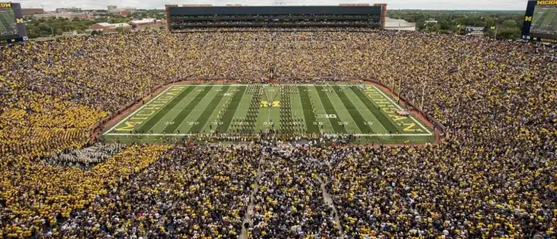
Since then though, it’s truly been a wild ride. I started working as a doctor in the UK’s National Health Service in 2018. During my first two years of working full-time, I was churning out 1-3 YouTube videos each week. Along with a [weekly email newsletter](https://aliabdaal.com/newsletter?utm_source=ultimate-guide-yt&utm_medium=link) and [weekly podcast](https://www.notoverthinking.com/) that I started with my brother. In that time, the channel grew to over a million subscribers. I expanded my team to include a full-time editor and writer as well. To date my channel has 3.5 million+ subscribers, and I make over £100,000 ($130k) each month. All from YouTube ads and sponsorships. I get to interview some of my heroes (like [author Brandon Sanderson](https://www.youtube.com/watch?v=3U4QCamdLas)), collaborate with amazing creators like [Marques Brownlee](https://www.youtube.com/c/mkbhd) and [Matt D’Avella](https://www.youtube.com/@MattDAvella), and make frankly whatever videos I like.

All while putting in about 8 hours of effort a week. Which in all honesty is bloody ridiculous, and I didn’t think it’d ever be possible.

I even started my own course teaching people how to be YouTubers. It’s called the [Part-Time YouTuber Academy](https://ptya.com/?utm_source=ultimate-guide-yt&utm_medium=link), which to date has had 2000+ students. In my humble opinion, it’s the best YouTube course in the world.

### The Power of YouTube

So, in this guide I want to show you exactly how to start your own YouTube channel, based on my years of trial and error, and from coaching thousands of Part-Time YouTuber Academy students through the process. Here’s how I’ve structured the three stages of your YouTube journey:

1.   **Get Going** –The most important part: how to actually get started on YouTube.
2.   **Get Good** – How to improve your video quality, and grow an audience.
3.   **Get Smart** – How to develop a strong YouTube niche, and make money from your channel.

But it’s important to remember – there’s no magic bullet that’ll net you millions of subscribers within a few weeks. These stats show the average number of videos you need to make to reach certain subscriber milestones:

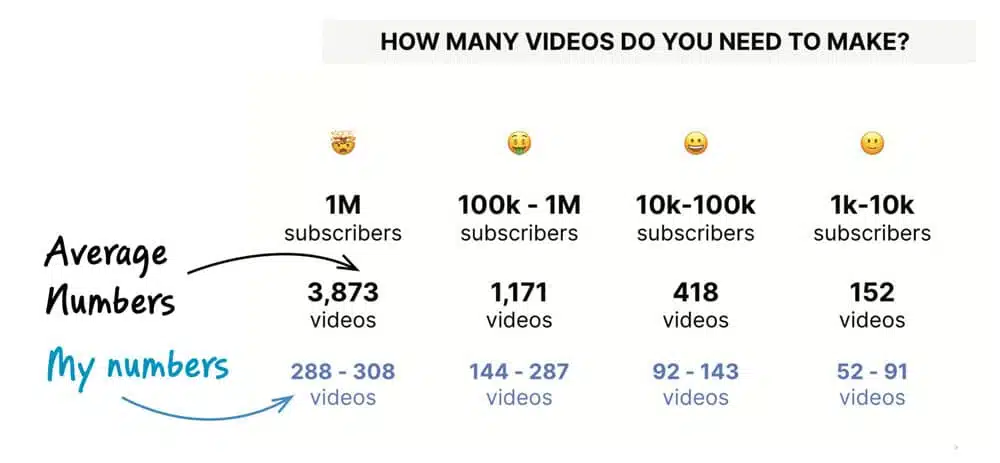
If you approach YouTube strategically (eg by reading this guide), you’ll improve a lot on those average numbers. But starting and growing a YouTube channel still takes a **lot** of work. Especially if you want to take it seriously.

*    You won’t see much growth, or money, in the early stages.
*    You’ll have to get over the fear of judgment from friends, family and strangers on the internet.
*    You’ll have to work out what you’re going to talk about + why anyone would care what you’ve got to say.
*    You’ll need to learn about cameras, microphones, lights, video editing and post-production.
*    You’ll worry that you’re going to run out of ideas.

But here’s one thing I can guarantee. If you publish about once a week, for 1–2 years your life will change. Often in ways you can’t imagine. By doing YouTube I:

*    Unlocked the ability to live and work from anywhere in the world
*    Made a lot of new friends and met my heroes.
*   Achieved financial freedom
*    Learned to speak confidently to camera

Most importantly, making YouTube videos is a blast. You learn so much from each video. You get to express yourself creatively, and when you hit publish it’s like your little creation is going out into the world. You’ll find yourself improving over time. You start getting messages from friends saying they saw your video and thought it was cool. The likes and comments are wholesome and supportive 99.9% of the time. It’s all rather fun.

### The Fear of Getting Started

After I tell people about the benefits of starting a YouTube channel, they tend to say ‘amazing, I’ll give it a go’. But 90% never do. And the main reason is usually “what will my friends and family think?”. Before starting YouTube I was worried about this as well. But very quickly, as I started making videos, I realised three things:

**1. No one really cares** Everyone is too worried about their own lives to care about what you’re doing for more than a few seconds. Psychologists call this _The Spotlight Effect:_ we all go through life as if we have a spotlight trained on us, with other people watching and judging. But in reality, they’re all thinking the exact same thing. As Eleanor Roosevelt famously said, “You wouldn’t worry so much about what others think of you if you realised how seldom they do.”

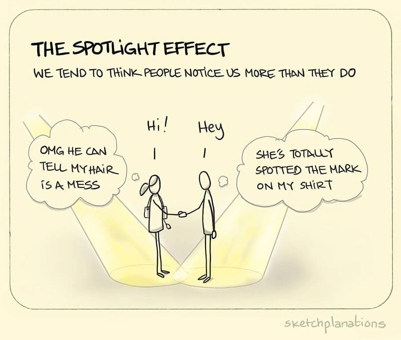
**2. No one is going to know** Unless you actively tell people or spread the word on social media, no one is going to know that you started a YouTube channel. You could post your book reviews/music videos/video essays for a very long time before anyone you know IRL would ever find out. By which time your videos would probably be pretty good, and they’d say ‘why didn’t you mention your awesome videos sooner?!’

**3. The reaction is almost always positive** 99% of people who start a YouTube channel and tell people about it get a positive reaction. This was definitely true for me: friends were excited to appear in vlogs, professors asked me to help film conferences, and my tiny audience was super-supportive of even my poorly-made early videos. And this **makes****sense**. When did you last judge someone for doing something new and exciting? Chances are, if your friend tells you they’re starting a YouTube channel or blog, you’d actually be excited for them and maybe a little inspired or motivated to do something similar. So go for it, and don’t look back 

### Notion

By the way – I use the amazing (free) productivity app [Notion](https://www.notion.so/) to produce all my YouTube videos. If you haven’t used Notion before I recommend trying it out. Here’s [a quick introduction](https://www.youtube.com/watch?v=uJgv0XQOehs&t=412s) to my YouTube workflow using Notion. But for a full introductory guide to Notion check out my crash course [Notion: Maximise Your Productivity and Organisation](https://www.skillshare.com/en/classes/Notion-Masterclass-Maximise-Your-Productivity-Organisation/1533502361?via=blog-internal&coupon=blog1month).

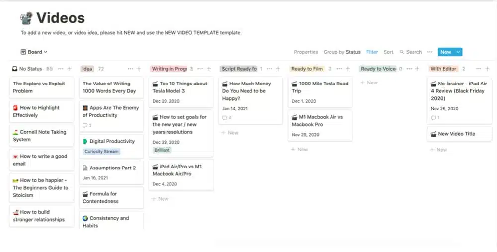
I’ll include links to my [various Notion templates](https://aliabdaal.com/youtube-notion-templates/?utm_source=ultimate-guide-yt&utm_medium=link) (scriptwriting, managing my filming schedule, competitor analysis, etc) throughout this guide. Feel free to use or take inspiration from them for your own system. But remember: Notion is just a useful extra. You don’t **need** a fancy production system to make YouTube videos. It’s totally possible to manage everything from a single Google Doc.

1. Get Going
------------

###  1. Discover Your YouTube Niche

The most exciting, open-ended aspect of starting out on YouTube is **discovering your niche**. What do you want to make videos about?

For me, there are two main approaches you can take to finding your niche. You can be an Architect or an Archaeologist.

If you’re an Architect, you meticulously plan everything before even thinking about laying the first brick (ie, filming your first video). You won’t begin your YouTube journey without a channel strategy, meticulous market research, and a filming and editing workflow ready.

Archaeologists, on the other hand, approach their task through a process of iteration and discovery, not really knowing what they’ll find. They start off with some digging (filming a few videos). Eventually, they see the beginnings of something interesting, and a niche emerges.

I’d recommend the Archaeologist approach for 90% of people. Unless they have experience already or have a very specific idea of what to make videos about.

Start creating content and, over time, you’ll find what you enjoy and your niche will emerge. Good questions to ask yourself though, are:

1.   What do I love to watch or listen to already on YouTube?
2.   What topics do I know a lot about?
3.   What do I wish I had known three years ago, five or ten years ago that I could help people with now?
4.   Can I imagine making 50 videos on this general topic? Or would I get bored after 10?

Those questions will set you on the right path if you’re not sure what to make videos about yet.

Remember, _it’s easier to change direction if you’re already moving_. I started off doing videos about med school. Now I do all sorts of stuff like tech reviews, productivity advice, and book summaries.

For now, the main thing is _just getting started._ No excuses.

###  2. Create Your YouTube Channel

But here are the basic steps, along with a few of my main recommendations

**1. Creating a New Account** I suggest you create a new business account instead of a personal one for your channel. This means you can later give more people (editors, collaborators) easy access to your channel.

**2. Naming Your Channel** For 99% of people I suggest using your own name. This is super flexible, helping you build a personal brand. And makes people feel like they’re connecting with a real person. You can always change your channel name to something like ‘[Binging with Babish](https://www.youtube.com/@babishculinaryuniverse)’ or ‘[Keep Productive](https://www.youtube.com/@keepproductive/videos)’ later down the line.

**3. Choosing a Profile Picture**Your YouTube channel needs two main visuals: your profile picture, and your channel banner.

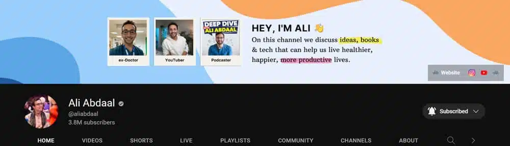
I think the best profile picture is a fairly clear picture of yourself, like this. If your phone has a portrait mode, use that to get shots in a few different locations. Keep going until you find one you like.

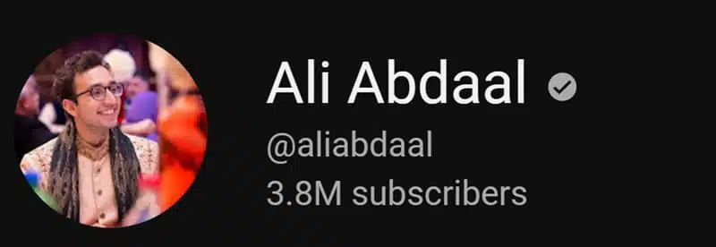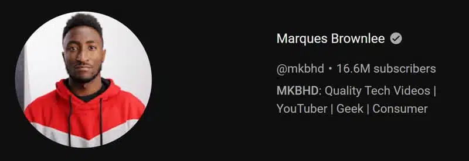
**4. Choosing a YouTube Channel Banner**

Next up you need a channel banner for your YouTube homepage.

[Canva](https://www.canva.com/) is a good resource for this. Go to their YouTube Channel Cover templates, and choose an option that fits your vibe. Again, there’s zero reason to overthink this – you’re just getting started, and you can change everything further down the line.

### 3. Beat Perfectionism

Congratulations, you have your channel up and running! Now you’re ready to make some videos.

At this point I’d like to challenge you to film a completely unscripted video on your phone. Then upload it to your YouTube channel – with zero preparation.

Yes, that might sound scary. But the whole point of this exercise is to beat your perfectionism. Don’t worry about lighting, audio, or looking stupid. Just record something quickly (preferably in the next 15 minutes) and post it to YouTube.

The best option is probably to make a video introducing yourself and your channel. Eg ‘Hi my name’s Ali, this is just a quick video I’m making to introduce my channel. I’ll be posting videos about cooking, which I’ve loved doing since I was 13 years old. I love channels like Binging with Babish and Ethan Cheblowski, so I thought I’d give it a shot […]’

That’s literally all you need.

1.   Prop your phone up on a pile of books (or hold it in your hand).
2.   Press ‘record’ and talk to the camera.
3.   Once you’re done, upload it quickly to YouTube via the YT mobile app.
4.   Title the video ‘Welcome to [channel name here] – My First Video’, and write a short description.
5.   You can use a still frame from the video as a thumbnail. Or just take a selfie horizontally on your phone.
6.   Now, publish the video.

[Here’s an example](https://www.youtube.com/watch?v=UpjL8fgOlag) of me doing this for the hypothetical ‘Ali’s Kitchen’ YouTube channel.

The point here isn’t to get views or anything. It’s to get over your perfectionism and just post something. I can’t emphasise enough how important it is to get your first few video out there. Even if you haven’t decided on a niche, dip your toe in the water.

If it makes you feel better, say ‘Ali Abdaal told me to do this.’ 

###  4. Script Your First Video

Once you’ve published that first first video, it’s time to look at scripting in earnest.

Some people film vlogs and other video types completely off the cuff, like [Emma Chamberlain](https://www.youtube.com/watch?v=CWgs97shAH0).

For most people, it helps to have a rough plan of what to say on camera. This way you don’t ramble on for ages, have a weak video structure, or get frustrated during filming.

You really don’t want to overthink scripting at this point, so here’s the process I’d recommend for now:

1.   Decide on a few simple concepts that you can easily talk about (eg your desk setup). Think of a short intro. Something like ‘I work a lot from home, and my desk is where I spend 80% of my time. So I thought I’d run you through my complete desk setup, which I’ve built up over the last 2 years.’
2.   Think about what you’d say to a friend about one of those topics (your favourite type of desk, type of chair, lighting, laptop choice, etc).
3.   Write about 2-5 bullet points for each of those main points. (Why that desk in particular? Best features? Flaws?)
4.   Write a brief conclusion, touching on the most important information in your video.

This is how I scripted my first 20-30 videos, and it honestly works really well when you’re just getting started.

###  5. YouTube Video Technical Basics

When starting a YouTube channel, it’s easy to think you need a ton of fancy gear and a super expensive camera before you start filming.

But, in reality, this isn’t necessary. If you’re on a budget or just want to trial out YouTube for a bit, all you need to get started is your phone. This gives you pretty decent video/audio quality. It’s more than enough to build an audience. But there are still a few important things you need to keep in mind if you’re looking to create the best possible videos.

####  i. Video Quality

You don’t really get the best video quality with the default camera app on your phone. It’s usually not possible to control all the possible settings.

So, the app that you want to use and that most people recommend to sort this out is called _[Filmic Pro](https://www.filmicpro.com/)_. The great thing about this app is that you can manually control a lot of the camera settings. This really helps to boost the visual appeal of your videos.

In particular, you need to change the following settings:

**1. Frame rate**– normally iPhones film in 30 frames per second (FPS). This is just a little bit too smooth and isn’t really the vibe you usually want to be going for (unless you like it, in which case you do you). I normally shoot in a frame rate of 25 FPS, which looks far more cinematic. And hopefully looks quite reasonable when using your phone too.

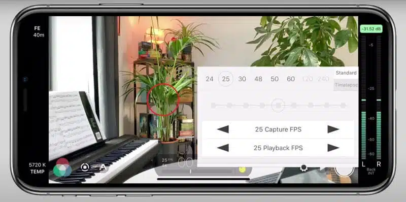
**2.Resolution and Bitrate**–this sounds complicated but basically you want to film in 4K resolution, because you might as well and most modern phones offer that. And then you want to crank up the bitrate as high as possible too. On iPhones this is called ‘FiLMiC Extreme’ and on Android I think it may say something like ‘100 Mbps’. This just means there’s more information encoded and takes up a bigger file size, which generally means your videos are going to be higher quality.

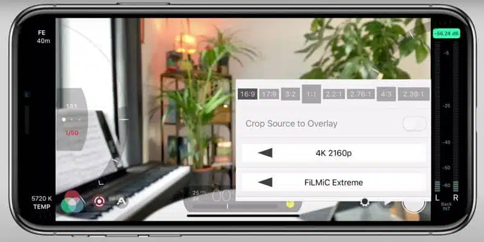
**3. White balance**– you want to set your white balance so it doesn’t vary massively.

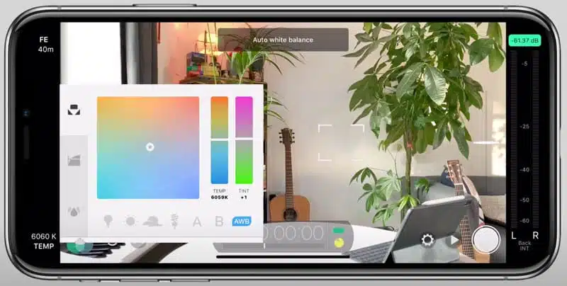
**4. Shutter speed**– finally, there’s this kind of rule with filmmaking that if your frame rate is 25 FPS you want your shutter speed to be double that. So you want your shutter speed to be 1/50 of a second. Essentially, that gives you the best amount of cinematic motion blur, which should make the video look natural when you’re moving your hands as you talk. If you cranked up the shutter speed really high (like 1/200), it would look a lot more choppy.

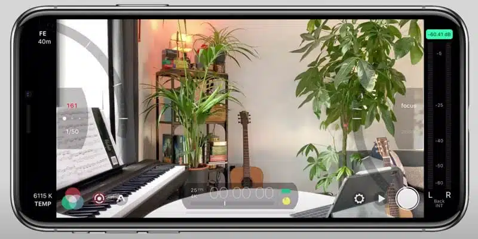
This all sounds complicated. But once you’ve got the settings sorted the first time, you can save them as a preset on _[Filmic Pro](https://www.filmicpro.com/)_ and never have to touch them again.

[This video from me](https://www.youtube.com/watch?v=JwhsPdN2RNg)explains how you can film YouTube videos on your smartphone. But for now, don’t spend more than about 30 minutes thinking about video quality.

####  ii. Audio Quality

If you’re just getting started with YouTube, the audio with just your phone isn’t actually too bad. It definitely isn’t the sort of quality where people would be like “oh god, that’s garbage, I’m going to turn this off immediately”.

For your first few videos, this will be fine. I film plenty of vlogs and Instagram posts using my iPhone’s built-in mic. But if you want to invest a bit more, get a cheap lavalier mic and plug it into your phone / camera.

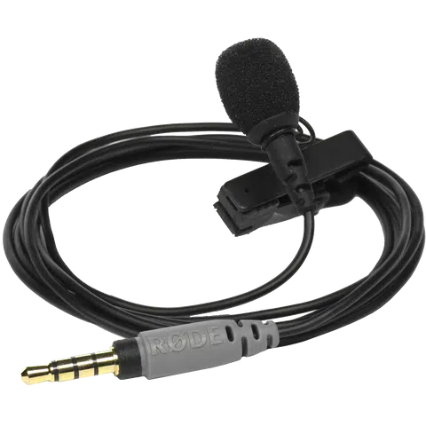
These are better than using your phone to record audio. They get the microphone closer to the audio source (aka your mouth), giving a clearer result. Search YouTube for “Best lavalier mic 202X” or “best lavalier mic under $100” and you’ll find something decent. Don’t sweat it.

>  A wireless lav mic (gold standard is the [RØDE Wireless Go II](https://geni.us/xLci)) is great for when you’re moving around (eg: [my apartment tour video](https://www.youtube.com/watch?v=5wDfRwAmIVY)), but costs a bit more ($260)

For good audio at a beginner level, another super-important thing is to create a clean canvas for your voice. Get rid of as many irritating background noises as you can:

*   Turn off loud air conditioning, fans, or humming fridges.
*   Avoid filming in crowded or windy spaces
*   Experiment with different spaces. A small room with lots of hard surfaces for sound waves to bounce around on (like a bathroom) will have a lot of tinny echoing. A much better option would be a medium-sized living room with pillows, carpets, and furniture to soak up those sound waves. This will give a cosier vibe.

>  Tip: if you find the audio is too tinny, try spreading some cushions on the floor, out of shot. This should help.

####  iii. Lighting, Framing and Background

As a beginner, the natural light through your window is usually enough to light your video. Try to record with the window to your side so your face is lit up by soft natural light.

“Framing the shot” means getting yourself and your background positioned perfectly, so there’s a nice visual feel to your videos. You want the top of the camera frame to be a little bit above the top of your head, and for the camera to be roughly eye-level (so you’re looking straight ahead at it, not up or down).

Back when I recorded with my iPhone, I connected it to my MacBook. I used QuickTime Player to share/mirror whatever my phone was recording. That let me use the normal camera on the back of my phone (as it has a higher quality than the selfie camera), helping me easily frame my shot and see exactly what I’m recording.

As for your actual background, don’t overthink it – it’ll evolve over time. But it’s good to get some basic principles right:

*   Have some depth of field (aka space behind you). This will make your videos feel more alive and dynamic, instead of you filming with your back to a wall.
*   Plants or interesting objects in the background also add personality.
*   Light up objects in the background using lamps or LED strips – these are your ‘accent lights’. Just make sure they don’t shine directly towards the camera/phone.

Looking at other creators’ backgrounds is always good for inspiration:

**[Pick Up Limes](https://www.youtube.com/watch?v=CiCPO1cnA-U):** the plants and homey feel matches her vibe, and the ‘green’ theme of her channel.

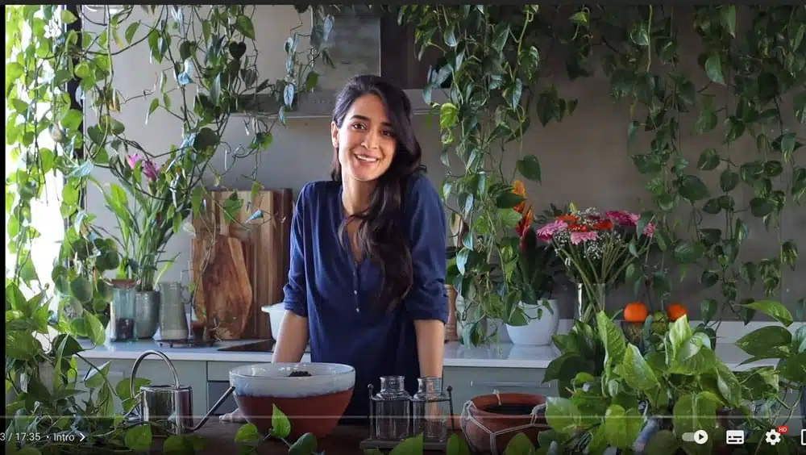
[NPR Tiny Desk](https://www.youtube.com/watch?v=ferZnZ0_rSM): The channel personalise the background by having one item added to it by every guest artist. Yup it’s messy, but also a signature vibe.

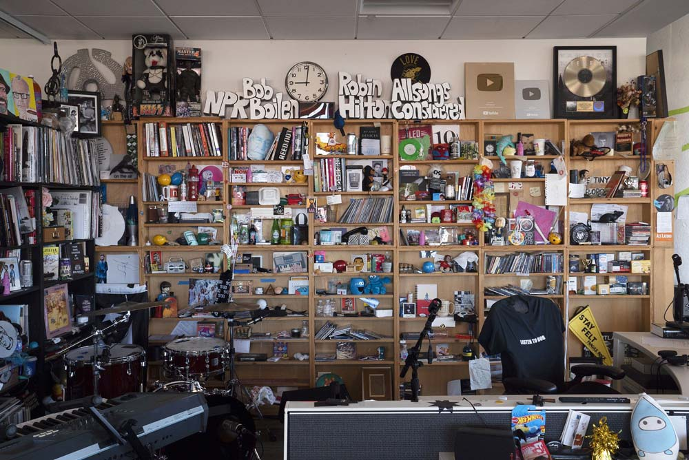
[Casey Neistat](https://www.youtube.com/@casey): He uses his real workshop as a background. Legit, cool, laidback vibes that match his “go for it” attitude.

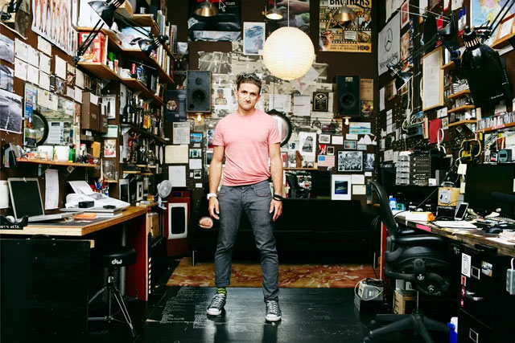
The main point is that you don’t actually need a lot to start a YouTube channel and begin filming. If you’re on a budget you can do everything on your phone and then upgrade later when you decide to start taking things a bit more seriously.

###  6. Editing

Once you’ve scripted and filmed your video, it’s time for the edit. There’s an old saying from the film industry:

> A movie is made three times: it’s made when it’s written, it’s made in production, and it’s made again in post.

And this is really true. There’s a whole art to video editing, and it massively affects your video’s whole look, feel, and narrative.

As a beginner, the free editing software on your laptop (such as iMovie) is enough to do some basic edits to your videos and get them on to YouTube.

A written guide really isn’t the best place to describe **how** to edit though, as it’s such a visual craft. To learn the basics (and lots of advanced techniques), check out my [Final Cut Pro X course](https://www.skillshare.com/en/tedx?teacherRef=3785132&via=teacher-referral&utm_campaign=teacher-referral&utm_source=ShortUrl&utm_medium=teacher-referral&t=Video-Editing-with-Final-Cut-Pro-X-From-Beginner-to-YouTuber&sku=317873419), where I cover everything from basic footage and A-cuts to special effects and colour correction.

But to give you a general idea, here’s my three-part workflow for editing videos:

1.   **A-Cut Assembly.** Create your project, import footage, and assemble your A-cut by choosing the best takes. Trimming out any silence to make a sharp, snappy edit.
2.   **B-Roll Shenanigans.** Once your basic timeline is created, you want to add in interesting B-roll. These could be second camera clips, titles, transitions, and lower thirds. Or even images, screen recordings, and even handwritten animations.
3.   **Coats of Polish.** With all the footage added, you want to add in background music to sound more pro, sound effects to your titles and transitions, add vocal effects to your audio track (compression and EQ), and do some colour grading to give your edit the right look and feel (eg warm and cosy, or bright and clinical).

The three edits that make the most difference are:

*   **Tighter A-cuts**– whenever we hear a pause in a video it sounds weird. So you want to cut those out in the edit so everything flows smoothly.
*   **Titles, lower thirds & transitions**– these make your video more engaging, easier to follow, and are useful ways to include branded elements.
*   **Subtle sound effects**– Sound effects can massively elevate your production value when used subtly. They make your videos feel polished. I tend to use a sound effect whenever something appears on the screen.

###  The Next Step

Having a YouTube channel is a bit like being in a relationship.

And by this point in the journey, you’ve made a few videos, and you probably know whether you like making videos enough to keep ‘the relationship’ going or not.

If the answer is ‘no’, that’s great – you tried it out and learned it’s not your jam. But if the answer is ‘yes’, the next big question is ‘do you want to make this a serious relationship?’ Do you want to move beyond casual dating?

If your answer is “Yes, I’m ready to commit to this relationship”, then the next step is to Get Good at your craft. And it might be the most fun part of being a YouTuber.

2. Get Good
-----------

###  1. Quantity vs Quality

So you’ve uploaded a few videos to your channel, you’re enjoying YouTube, and you’ve decided to take the next step – to Get Good.

You now have an important choice to make: **quantity or quality?** In other words, will you improve most from trying to make every video perfect? Or from cranking out several decent videos in the same time, aiming for incremental, 1% improvement (quantity)?

It’s an age-old question. And for 90% of people I’d say quantity is the way to go – especially if you’re just starting out. You’ll get so many new data points from publishing videos regularly, about your choice of topic, your presenting style, the type of editing that works best, and loads more.

The classic _Parable of the Pottery Class_(adapted from the book _[Art & Fear](https://geni.us/artandfear))_ illustrates this point:

> There was once a pottery teacher called Brian. One month, he decided to split his class into two groups. Group A had to make a pot every day for 30 days (so 30 pots in total). Group B had to work on a single pot for the whole 30 days.
> 
> 
> At the end of the month, Brian judged the quality of the pots. Without exception, every one of the top 10 pots came from Group A, the guys that made one pot per day. None came from the group that focused on perfecting their single pot.

So, in an ideal world, you’d be making a minimum of 1 video per week to start with. That’s 52 videos per year. That could be more or less, depending on how demanding video production is for your niche. React-style gaming videos are super-quick to film. But outdoorsy mini-documentaries (eg [Beau Miles](https://www.youtube.com/@BeauMiles)) take ages to film + edit.

There are exceptions to this quantity>quality rule. Video essayist [James Jani](https://www.youtube.com/@JamesJani) hit 1.36M subscribers with just 18 videos, and DIY/science experiment channel [Stuff Made Here](https://www.youtube.com/@StuffMadeHere/videos) has 4.8M subscribers from just 29 videos (all with 1M+ views).

But these are outliers who put an insane amount of effort into every video. James spends 100s of hours researching each of his video essays, and didn’t publish for 9 months in 2022. Likewise, Stuff Made Here do insane engineering challenges like [building a moving basketball hoop that won’t let you miss](https://www.youtube.com/watch?v=myO8fxhDRW0), which is beyond most people’s expertise and also takes a lot of time and equipment.

###  2. So, What Makes a Good Video?

This is the next logical question – what actually makes a good YouTube video?

Well you just need to get people to click on it, and you need to get people to watch it. That’s it! You can make genius videos that get millions of views by [screen-recording yourself playing Minecraft](https://www.youtube.com/watch?v=CrtuA5HWFoU), or [cooking with a GoPro strapped to your head](https://www.youtube.com/watch?v=9OVNG7JpnJA).

But generally speaking, a lot of other technical elements go into making a good video. Firstly, there are several YouTube-specific skills to learn:

*   Topic choice
*   Titles
*   Thumbnails
*   Scripting
*   Camera Presence

Then there’s the filmmaking component. The more you hone these skills, the better your videos will look and sound:

*   Videography
*   Audio
*   Music + Sound Design
*   Editing

You can spend years improving all of these things – there are whole university degrees focused on editing and scriptwriting. But in this part of the guide I’ll focus on the absolute essential things for a new YouTuber to get right, if they want to make good videos.

### Part I: YouTuber Skills

####  1. Generating Good Ideas

Success on YouTube relies on making good videos **consistently** – around once per week.

So the main bottleneck most people come to is the problem of ideas: ‘What if I run out of content? How can I make sure I have enough ideas to make a good video every week?’

I used to worry about this, but over time I’ve figured out a system that I call the Idea Generation Machine. This means I never have to worry about running out of video ideas.

There are two components to this machine – Capture and Generate. And the aim is to create more video ideas than you’ll ever even have time to film.

####  Capture

**Eureka Moments**

The most important thing you can do is to have a system in place for capturing ideas from your own mind. If you’re going for a walk or sat on the toilet and an idea for a video (even a tiny one) pops into your mind, have a quick solution for capturing it.

This could be an Apple Notes folder, a voice memo into your smart watch, or a notebook you take everywhere. The key thing is to capture that idea before you forget it. You’ll gradually build a list that you can return to when you’re thinking of what to film next.

I like to store specific ideas in my Notion Video Homebase: [The Infinite Content Engine](https://aliabdaal.notion.site/b961cf5f65b24dcbbda0240decfd7112)

**Birdsong Technique**

As a YouTuber, you should get into the habit of treating other people’s content (books, podcasts, videos) as a source of inspiration. A bit like birdwatchers no longer just hear birdsong – they can identify all the individual bird songs, including the one they’re keeping an ear out for.

If you come across an interesting tweet, podcast episode, or newsletter, make a note of it. Include what you specifically found interesting. You can set up an automation on your phone to automatically forward interesting ideas to your Notion if you’re using that system.

I’ve made so many videos purely based on a tweet I saw (often from Naval Ravikant lol) that prompted some interesting thoughts. So keep your ear to the ground.

**Coal Mines**

As well as capturing specific ideas, you want to create an inventory of potential websites, social media feeds, YouTube channels, newsletters, and any other places on the web for you to mine for content ideas that are relevant for your channel.

If you’re ever stuck for content ideas in the future, you can return to this list. Use the simple Notion template below to create your own list of Coal Mines.

[My Coal Mines](https://www.notion.so/My-Coal-Mines-886552a405814b5194dc87809d9834b8)

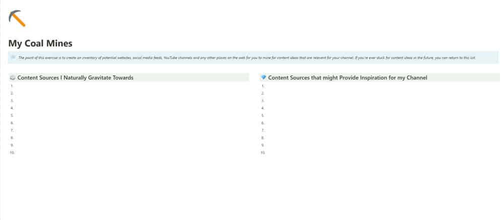
####  Generate

Once you’ve set up a good system for capturing ideas, you’ll also want a way of **generating** them without outside input. My favourite method for doing this (which I learned from my friend [Sean McCabe](https://seanwes.com/)) is called ‘5 Months of Content in 5 Minutes’.

As the title suggests, it’ll help you create a massive amount of ideas in a very short amount of time. Here’s how it works:

1.   List out the 5–10 topics your audience (or your future audience) wants to learn.
2.   Then create another list of 5–10 topics you would want to teach. Don’t worry if there’s overlap between the lists – just concentrate on trying to populate each one with 10 ideas. Try to come up with more if you can: as always, quantity leads to quality. Here’s your list of topics right now: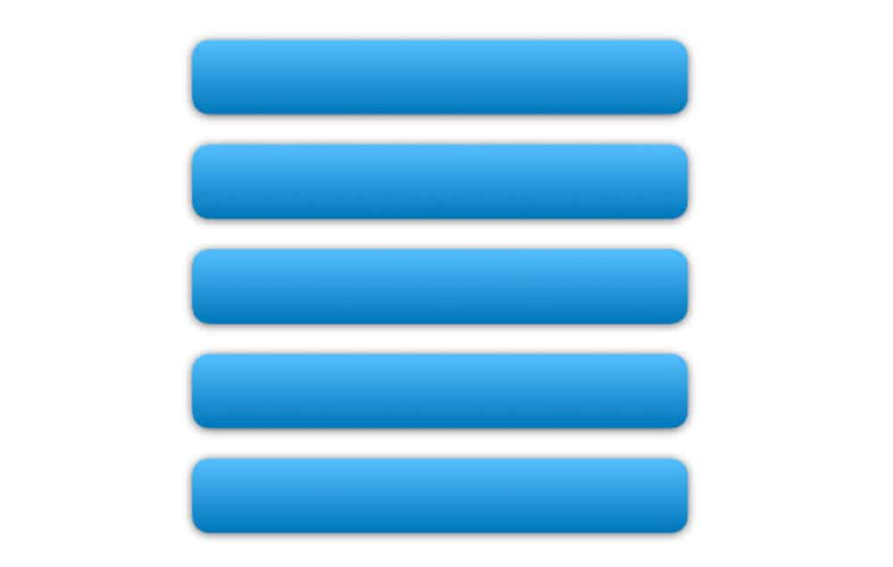
3.   Now, it’s time to break up each of the 10-20 topics above into smaller points. For example, let’s say I’ve identified a topic my audience wants to learn as being writing newsletters. My first sub-point might be “newsletters for beginners”. Then, in step three, this could be broken down into “should you start a newsletter”, “best platform to host a newsletter” and “how to start a newsletter in 3 easy steps”.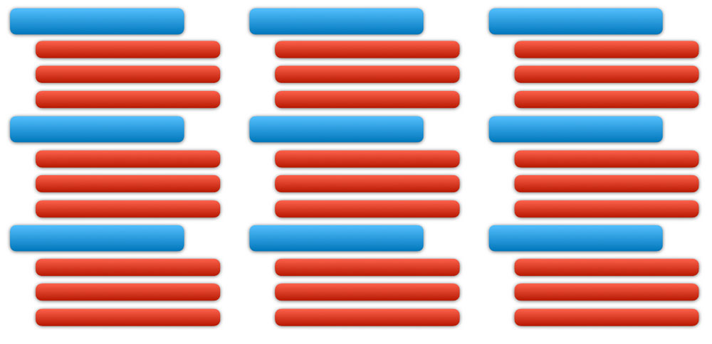
4.   Finally, repeat step 3 for each of those sub-niches. You’ll find you have countless things to discuss, so long as you get specific enough. Sure, some might be too niche, but a lot of them will be worthy of a whole video.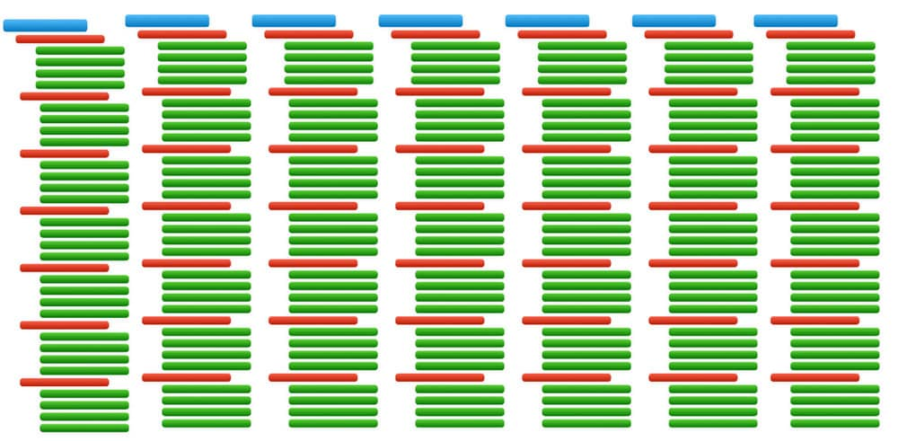

Rather than being scattered and making content about ‘stress management’, then ‘building newsletters’, and then ‘study techniques’, you could niche down and make 10 separate videos about the different aspects of stress management. And if you did that well, I’m pretty sure your channel could blow up.

Here’s my Notion template for this exercise:

[5 Months of Content in 5 Minutes](https://www.notion.so/5-Months-of-Content-in-5-Minutes-b520ec8a84e14d5c8269d3e47f106feb)

####  2. YouTube Thumbnails

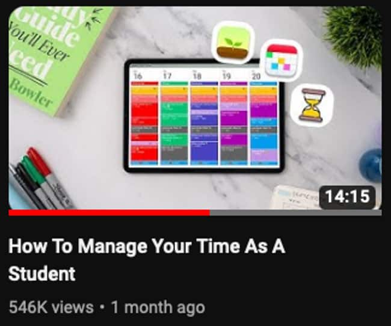
Getting your thumbnails right is absolutely crucial on YouTube. No matter how good your content is, it just won’t get seen if your thumbnail isn’t good.

The main job of your thumbnail is to **stop the viewer scrolling**. You want to stop people in their tracks, and make them think ‘huh, what’s that?’ They’ll then look at the thumbnail properly, before reading the title and deciding whether or not to click and watch the video.

Some elements that work well for catching the eye:

1.   **Expressive human faces.** Our eyes are attracted to human faces, particularly if they’re making eye contact with us. That’s why top YouTubers like MrBeast almost exclusively use thumbnails with their face on them, often with an extreme ‘reaction’ expression. Once the viewer sees emotion on your face, they’re automatically **slightly** invested in your story/what’s happening in the video.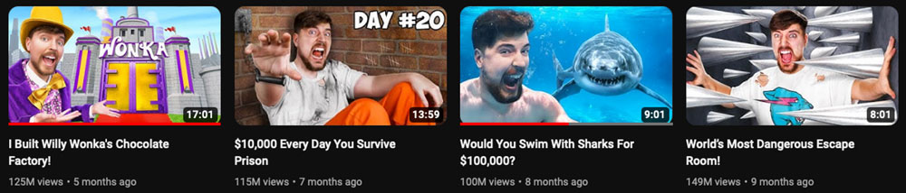
2.   **Hi-res photo**. You want your photo to be high resolution – poor photo quality tells people that your video will also have low production quality.
3.   **Flashes of colour.**Our eyes are also drawn to high-contrast images with colours that ‘pop’. Try to keep things colourful, and avoid bland thumbnails.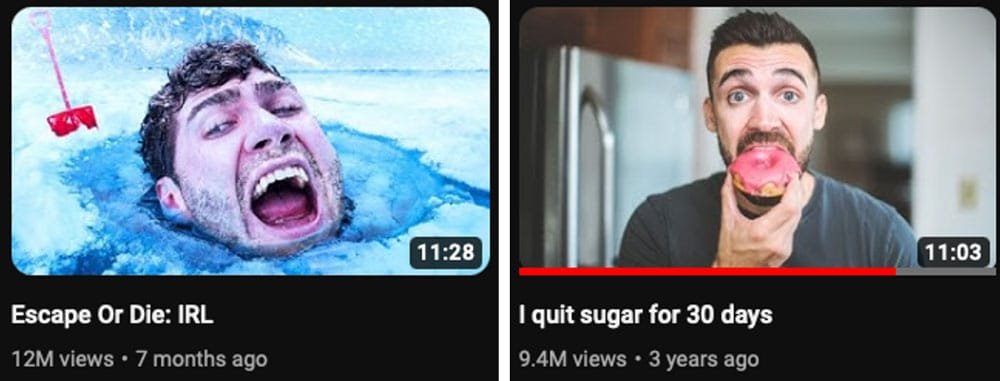
4.   **Tell a story.** Lots of great thumbnails tell a story using the image. A snapshot of what’ll happen in the video. This will create open feedback loops in the viewer’s mind (they see one part of the story, but not how it plays out), which makes them want to click the video to find out what actually happens.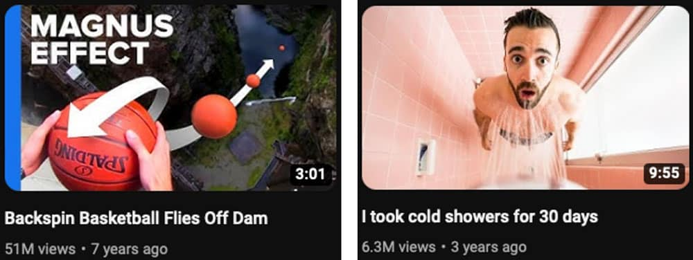

The most important thing a good thumbnail does is **plant a question** in the viewer’s mind. You need to awaken their curiosity. You can add text to the thumbnail to literally ask a question/make a statement, or you can let the title do the heavy lifting.

Most of the titles+thumbnails on my channel are designed to make viewers curious about how their lives could change from watching my content.

This style of thumbnail has done pretty well for me, and it’s one you can easily use yourself:

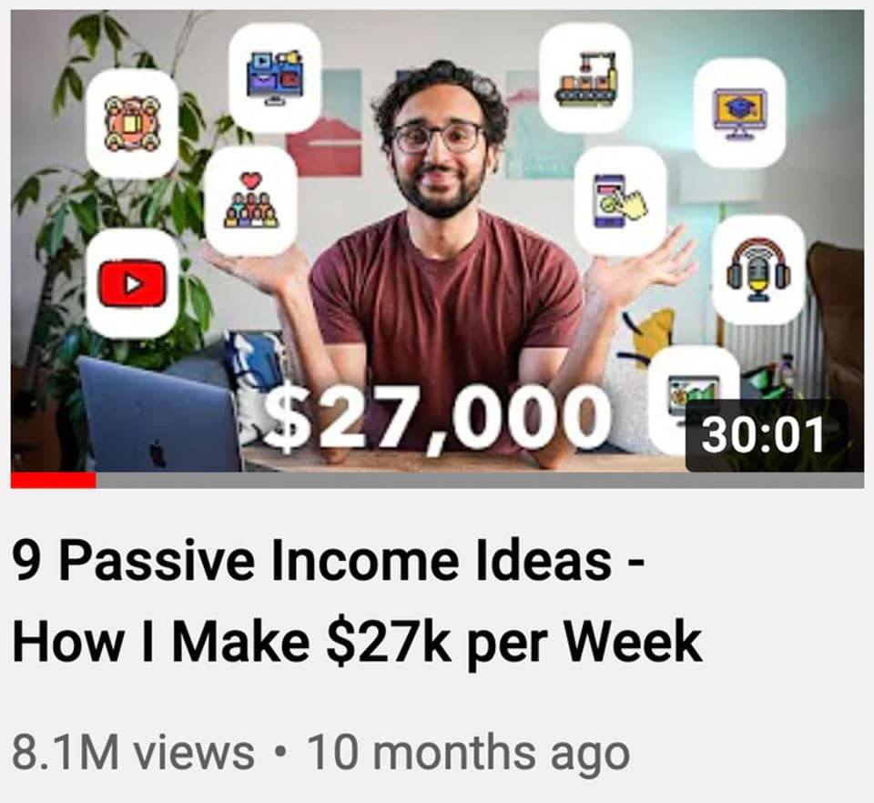
What works:

*   Icons to show lots of options
*   $$$ figure on-screen creates interest
*   Happy human face and bright background feels welcoming.

I recommend making your thumbnails on [Canva](https://www.canva.com/). Often all that’s needed is a good photo of you doing the thing you’re talking about (maybe edited a bit in Lightroom to up the contrast), and you can add text or extra images and emojis directly in Canva.

####  3. YouTube Titles

Titles are the second half of your pitch to the viewer – you’re saying “watch this video, not the other 20 on your YouTube homepage”.

Here are my top pieces of advice for writing good titles:

1.   Use language your viewers can understand at a glance. “How My Business Made $1 Million Dollars” is better than “How My Business Grew to $1 Million ARR”.
2.   Make it relevant to the here and now. This is why titles like ‘How to Build a Business in 2022’ often do well – because people can see that it’s very up to date and relevant to the current situation. 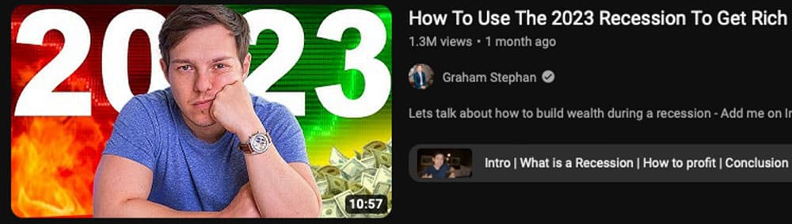
3.   Promise value. ‘How to’ titles are a great example of promising value – they tell the viewer that this video will give them all the necessary information to be able to do a specific thing. “How to Learn Basic Jazz Piano”, “How to Start a YouTube Channel”, etc. 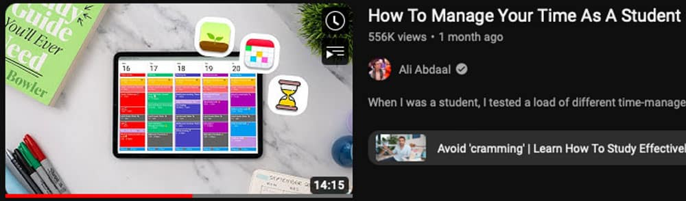
4.   Be intriguing. Some great titles are a bit mysterious, like Nathaniel Drew’s [For People Feeling Behind in Life](https://www.youtube.com/watch?v=eac-_ys_f_Q&t=2s). Make the viewer curious enough to click and find out what you’re talking about. 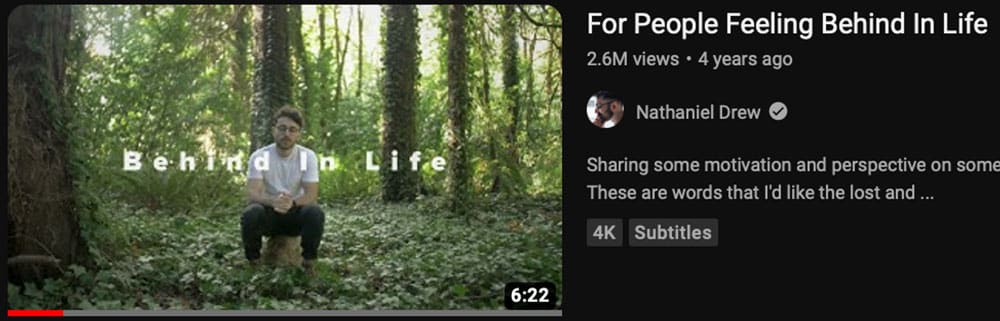
5.   Create tension. A good way of doing this is to introduce a timeframe/challenge. For example [I quit sugar for 30 days](https://www.youtube.com/watch?v=Ufm0yPA-kWc&t=526s), or [I Survived On $0.01 For 30 Days](https://www.youtube.com/watch?v=JEqi3VVLYkg). 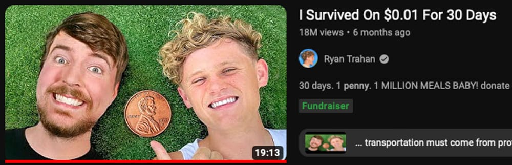
6.   Avoid false clickbait. Don’t say something untrue in your title that isn’t backed up by your video (”How I became a Gymshark Athlete”). Otherwise people will click away from your videos quickly, or not return to your channel.
7.   Reveal secrets. This often works well to build intrigue, but can easily become clickbait. Talking about yourself can work, even if you’re not famous. Eg ‘The Real Reason I Quit Law School’. 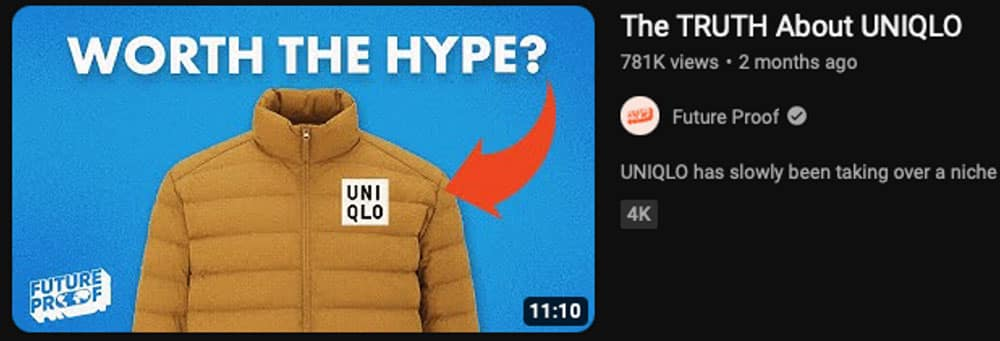
8.   Be fairly extreme. People want to be surprised, shocked, entertained. A video called ‘Day in the Life of an 88 Year-Old Man’ won’t do as well as ‘Day in the Life of a 103 Year-Old Cyclist’. Think about the most entertaining or extreme element of your video, and see if you can include that in the title.
9.   Use numbers. People always like specific information. “How I Got Rich” is less interesting than “How I Made $4.2 Million in 2022”.
10.   Stay under the YouTube character limit. Go beyond 54 characters, and your title won’t get shown in its entirety on some mobile devices.

To write really effective titles, you need to brainstorm a lot. Here’s a list of 20+ titles my team and I brainstormed for a ’How to Get Your Dream Job’ video:

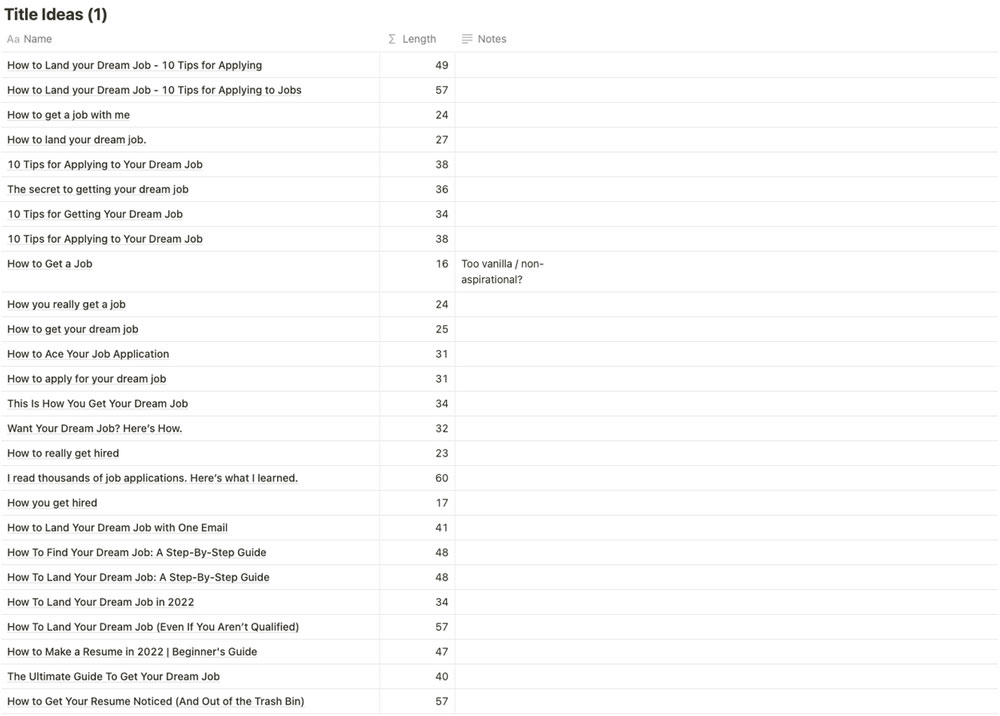
Over time you’ll figure out what types of thumbnail and title work best for you, based on how many views you get.

As an educational YouTuber, ‘How to ____’ titles have worked particularly well for me. As you can see from my top eight viewed videos of all time, seven use either a ‘How I…’ or ‘How to…’ in the title:

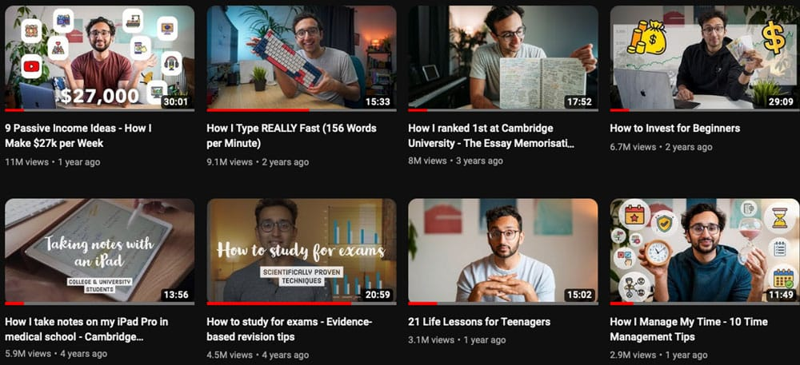
If one combination does particularly well, try doing a similar topic + thumbnail + title combination again, but mixing up a few things. [Elizabeth Filips](https://www.youtube.com/@elizabethfilips) did this for her ‘You’re Not Stupid: How to Easily Learn Difficult Things’. That was one of the most-viewed videos on her channel, so she replicated that style twice over the next 4 months:

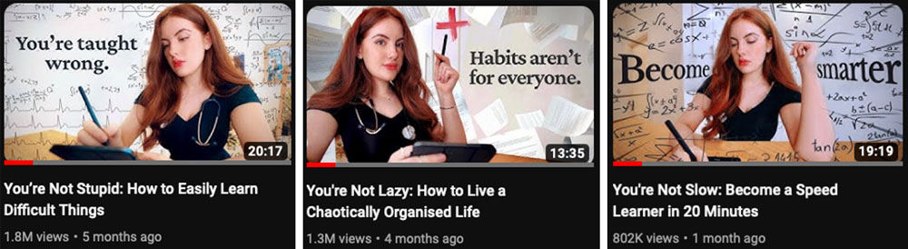
Taken together, your title and thumbnail make a promise to the viewer: watch this, and you’ll get the thing I’ve just promised you. It’s OK to be a bit clickbaity (otherwise you’ll never get views).

But you have to honour that promise, and not disappoint the viewer.

####  4. Scripting

Titles and thumbnails are crucial to getting people to click on your video. But to keep the viewer’s attention, your video needs to have a great structure. This is a huge topic, but the best way of deciding is to know what structures other YouTubers use most often.

**i. Classic Video Structures**

Here are some of the best, most common structures that you can use.

** Listicle**

This is where you just go through the points you want to make one by one. It requires minimal effort and can be super successful. I’ve used this method in a few of my[videos.](https://www.youtube.com/watch?v=Gg8_TA7U0Uw) Listicles are an easy way to provide value and structure a video: of you’re ever struggling for content, this is how you whip up a video in 30 minutes or less.

Example: [9 Passive Income Ideas – How I Make $27k per Week](https://www.youtube.com/watch?v=M5y69v1RbU0&t=50s)

** Essay Structure**

This is what we used to do in English Literature. And there’s a reason we used it – it makes sense and sounds good. You take an intro that explains the issue. You have a body divided into sections that ideally each make a single point. Then you weigh options. Compare pros and cons. Summarise in the end. It’s essentially an oral essay.

Example: [Why I Left Medicine… Forever](https://www.youtube.com/watch?v=mZOVLrLXKCE&)

** Story Structure**

This is the Gold Standard. This is what I wish I could be doing with every video and what I’m aiming for. Humans have evolved around stories, we love them. So if you can turn what you say into a story that follows a hero’s journey, everything will become endlessly more attractive to the viewer. Make what you say**personal**and show how it has**transformed**you, and more people will be compelled to listen. A better example of what the hero’s journey actually means is this[video](https://www.youtube.com/watch?t=53s&utm_campaign=Ali%27s%20Part-Time%20YouTuber%20Crash-Course&utm_medium=email&utm_source=Revue%20newsletter&v=Hhk4N9A0oCA). And if you want to get better at storytelling, get[Storyworthy](https://geni.us/js3Ax)by Matthew Dicks, it’ll change how you think about stories and the world in general.

Example: [How Writing Online Made me a Millionaire](https://www.youtube.com/watch?v=vyVpRiqOvt4&t=8s)

** ii. The Four Script Stages**

No matter what general structure you choose, you want your video to go through 4 stages to work on YouTube (definitely for educational content).

I call this the HIVES framework.

** Hook**

You always want to start each video with a hook – something that’ll grab your potential audience and keep them watching. This is the first 10–30 seconds of your video.

I suggest you spend at least 10-20 minutes thinking about ONLY the first 10 seconds of a video before you film it. Consider how you’ll keep the audience intrigued enough to keep watching more. This will pay massive dividends.

Try one of these techniques to create an effective hook:

*   Asking a question (”How often do you **really** get a good night’s sleep?”)
*   Sharing a fact (”70% of Americans suffer from bad sleep… which is really bad.”)
*   Offering a transformation (”I used to sleep really badly, but in the last month I ran an experiment that’s got me sleeping like a baby. Here’s what I did.”)
*   Giving a tip right from the start (”Most people don’t know this – but getting sunlight in the morning in **the** most effective way to get a good night’s sleep later on.”)
*   Showing enticing B-Roll to cause intrigue.

** Intro**

Then you move on to the Intro. Once the viewer has decided to watch your video beyond the hook, you need to explain _why_ they should keep watching, and what value you’re going to provide.

Make this short as well – just enough to set the scene and get the viewer more invested in your video. With simpler videos (like listicles) the hook and intro can be combined into one package.

** Value**

This is the most all-encompassing part of the video, and what will keep people returning to your channel for more. You want to pack your video with enough value for the viewer that they’re blow away.

Here’s how we can define value for the 2 main category of YouTube video:

*   Educational (eg [Ali Abdaal](https://www.youtube.com/@aliabdaal)): “Wow, Ali’s video was jam-packed with actionable advice – I’ll go away and apply to my own life right now. It was also quite fun to watch.”
*   Entertainment (eg [MrBeast](https://www.youtube.com/@MrBeast)): “Wow, that video was ridiculously entertaining and hilarious. I couldn’t help but watch the whole thing.”

The point is to make your video stand out in terms of quality compared to other videos in the same niche. You want your audience to say “Wow, they really took time to make this video special” – and then subscribe.

** End Screen Sales Pitch**

You want to finish every video with an end-screen sales pitch, a call to action for the viewer to do something specific.

YouTube best practice is to relate the last 10 seconds or so of your video to another video you’ve made on a correlating topic. Take a look at[the](https://www.youtube.com/watch?v=lhpY1frNqdA) last ten seconds of my video [The 5 Magical Apps That Changed My Life.](https://youtu.be/lhpY1frNqdA?t=656) I say “if you want to hear more about how I use Notion to supercharge my productivity, click on the little playlist over here for my top performing videos on how I use Notion.’

Remember, this is the **only time** you’ll be able to pitch viewers directly with an idea for what they should watch next. And given that they’ve already watched one of your videos until the end, chances are that they’ll like to watch the next one if you make it seem relevant enough.

####  5. Camera Confidence

Being comfortable on camera can be tough. It doesn’t come naturally to most of us – but everyone improves with time. Here are my main tips for improving as a presenter.

**1. Go Easy on Yourself**

Assume the audience are interested in what you’re saying. The sooner you can get comfortable with taking up space, the sooner you’ll start looking/sounding natural in front of camera.

I find it helps to treat the hypothetical audience like your friends, who you’re talking to over coffee.

**2. Warm Up**

Warm up for a few minutes before by continuously talking about anything. When you do that, you’re voice and mind loosen a bit and it feels a lot easier to speak on camera.

**3. Watch Your Speed**

When we talk to a camera we often become conscious of how fast we’re talking, and whether or not the audience will be able to follow along.

The truth is that you can be engaging with a range of speeds. You only have to think of Morgan Freeman to understand that talking slowly can actually increase how engaging you are. So do what feels natural. Don’t overthink it, and get someone neutral (and nice ) to watch the recording back and tell if you’re going too fast or too slow.

** 4. Make Good Eye Contact**

The amount of eye contact in a video can either make things look really natural or really awkward.

If you never looked at the camera it’d be weird. But if you stared at the camera the whole time it’d also be weird. There’s a sweet spot somewhere in the middle. The way I like to think about it is to treat the camera like a friend, and just make eye contact in the most normal way you can.

Again, try not to overthink it. As you become more comfortable in front of the camera, it’ll become something you don’t really have to worry about.

** 5.Speak With a Smile**

Always remember to smile. It helps a **lot** if you just look like you’re having a nice time while you’re talking, and subconsciously makes you more likeable to the audience.

Related to this, it just turns your personality up a touch (whilst still being yourself). The camera always makes people look a little less engaging than they actually are. So you just have to work a bit harder to appear to have a normal level of energy on camera than you do in real life.

**6. Finish strong.**

Whatever you’re saying, it always sounds better if you finish your point with some kind of momentum.

**7. Get the Reps In**

Ultimately though, the secret is simple:**practice**. The more you put yourself in uncomfortable situations and stretch your comfort zone, especially on camera, the more confident you’ll be.

So, even if you’re the sort of person right now that gets nervous, anxious, or experiences brain fog when stepping in front of a camera, with time and practise this _will_ go away. If you’re still not convinced, go to your favourite YouTuber’s first videos and enjoy the awkward mess that is everyone’s first few attempts at filming.  The sooner you start, the sooner you get past this mandatory learning curve.

If you want to deep dive on your presenting skills, and make them an asset rather than a weakness, I suggest trying my full [Camera Confidence course.](https://cameraconfidence.aliabdaal.com/?utm_source=ultimate-guide-yt&utm_medium=link) In the course, I cover a bunch of principles, strategies and tools for being more comfortable on camera. You’ll see real-life evidence of these techniques in action, as I take various members of my team through the exercises + give them feedback.

### Part II: Technical YouTube Video Production

####  1. Camera

Modern phones have pretty great camera quality, and most can now shoot in 4k.

But if you want to upgrade your video quality and unlock more advances settings, you’ll need a proper video camera. My favourite brand for video cameras is Sony. From their lineup there are three main options I’d recommend:

**Level 1: Sony A6400 ($900) –**the Sony A6400 (Crop Frame) is solid choice. It’s a crop frame camera (otherwise known as APS-C) with a smaller sensor, so it won’t look quite as good as full frame cameras (check out[this excellent video](https://www.youtube.com/watch?v=vOUxtszLICM)by Becki and Chris explaining the difference).But it will look a **lot** better than 99% of phone cameras, and shoots in full 4k.

**Level 2: Sony A7c ($1700) –**the[Sony A7c](https://amzn.to/3LaiACk)(Full Frame) is the camera I’d recommend if you’ve got $2000 to spare. As a full frame camera there’s a big bump in quality compared to the crop-frame A6400. It’s also very compact, so you don’t need to worry about travelling or storage.

**Level 3: Sony A7Siii ($3800) –**the Sony A7Siii (Full Frame) is the camera I currently use. It’s an amazing camera, but if unless you’ve got money to burn I suggest sticking to the A7c. Check out[this comparison video](https://www.youtube.com/watch?v=YvO1AN-4qf8)if you’re still not sure.

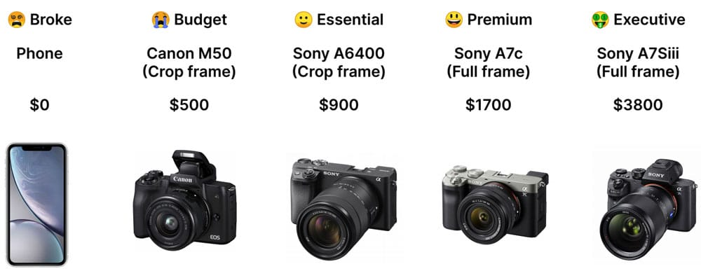
####  2. Lenses

The type of lens you use is massively important to your image quality. Luckily, most cameras come with a ‘kit lens’ included, which will be absolutely fine for most things.[This is a great video](https://www.youtube.com/watch?v=q7WDAP5fCKA&feature=youtu.be)showing how good your video can look with a relatively cheap camera (Canon M50) and its kit lens.

If you want to step it up a bit with one of the above Sony cameras, here are my recommendations:

**Level 1: Sigma 16mm f1.4 ($300)**– the[Sigma 16mm f1.4](https://geni.us/6kxFeK)(Crop Frame) is (in my opinion) the best lens you can get for a crop-sensor camera if you’re making ‘sit down and talk to camera’ style videos. I usually aim for a focal length between 16-35mm. I like the 16mm lens because it means I can be quite close to the camera, giving my videos a more ‘intimate’ feel and I achieve that appealing blurred background effect (AKA bokeh / depth of field). The lower the f number (e.g. f1.4) also helps increase the background blur.

**Level 2: Sony 24mm f1.4 ($1600) –**Once you’ve made the jump to full-frame cameras, you’re going to need full-frame (read: super expensive) lenses too. The[Sony 24mm f1.4](https://geni.us/2QSiU)(Full Frame) is a solid choice, and I’ve been using this and the Sony 16-35mm f2.8 for some time.

**Level 3: Sony 16-35mm f2.8 ($2300)**– if I could only use 1 lens for the rest of my life it would be the[Sony 16-35mm f2.8](https://geni.us/mcufQ)(Full Frame). It’s incredibly versatile because it can zoom. 16mm is great for vlogging and chatting to the camera and 35mm is great for B-roll.

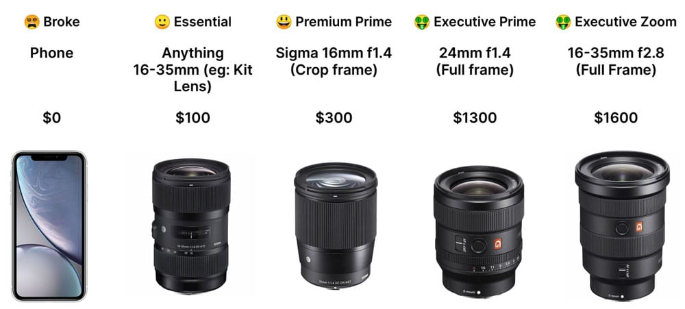
#### 3.Lighting

Sitting next to a window will give you some pretty decent lighting. But you can definitely upgrade the lighting for your videos by bringing in artificial lights.

This’ll give your video a nice clear look. It’s especially good if you want to film during the evening, or not rely on daylight coming through a window. Here’s the difference between sitting next to a good source of natural light, and lighting myself more ‘professionally’ using my Aputure 120Dii light:

[bafg id=”957″]

As you can see, my face is more evenly lit, with less shadows and a ‘light-mode’ feel.

Cinematographers typically set up their main light a little bit off to the side of the person they’re filming. Using a light stand at a 45-degree angle to the camera. That’ll create shadows on the other side of your face, adding a bit of dimension / depth. You can decide whether you want a high-key image (even, soft lighting, light-mode) or a low-key one (high contrast and deep shadows, dark mode).

What you need to upgrade your lighting is a combination of these three things:

1.   Main Light – this is the main engine of your lighting setup, the light itself. This will essentially be a really powerful lamp. Look for one where you can adjust the brightness up or down, so you can customise how brightly your face/subject is lit. The[Godox SL60W](https://geni.us/qePpg)($120) is what I’d recommend to most people due to its decent price and quality.
2.   Soft box. By default, the light that comes out of our LED light is very harsh, so a large soft box will make the light look more natural and flattering. The soft box will also make up the bulk of your lighting setup (the lights themselves are usually pretty small). If you need to light a very tight space, a [space light soft-box](https://www.aputure.com/products/space-light/) might be best. But a directional [light dome](https://geni.us/kyG4s) is even better because it gives you more control over atmospheric lighting – so your main subject can be lit up while keeping the background moody and relatively dark. 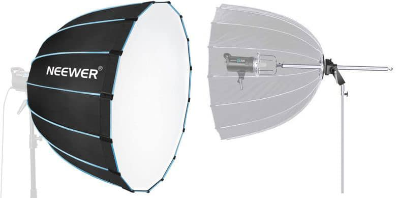
3.   Light Stand. This is the simple bit: you need a stand that’ll hold up your main light and soft-box. You can get these for about [$20-$40 from Amazon](https://geni.us/OnXPH) – don’t sweat it, all your stand needs to do is be sturdy enough to hold up your lighting rig. 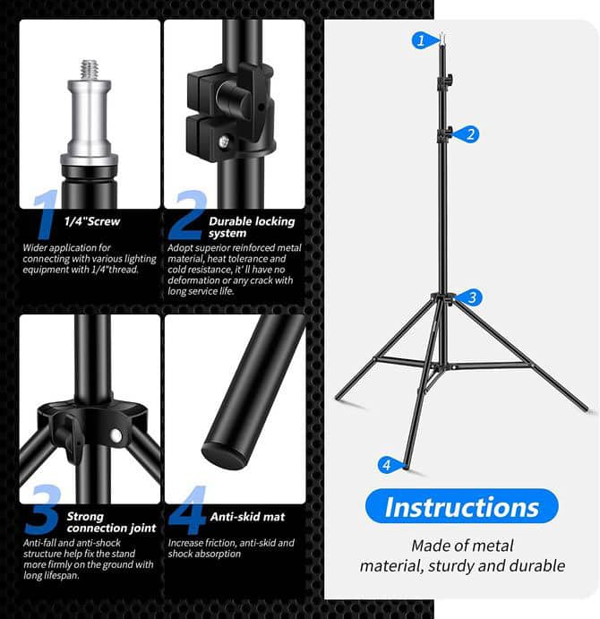

#### 4. Audio

Some people say that audio quality is even more important than video quality.

Viewers can happily sit through a low quality video if the audio is good. But nobody will watch if your voice is muffled or unclear, or if they’re getting uncomfortable audio spikes in their headphones.

So, as a beginner YouTuber one of the best early upgrades you can make to your filming setup is boosting your audio quality. If you’re a YouTuber who sits down quite a lot (like me lol), one of the biggest upgrades you can make is getting a shotgun mic. This is a pointy-looking microphone that you put on its own tripod and arrange so it’s as close as possible to your mouth (the main source of audio), but staying _just_ out of frame.

For beginners, I highly recommend the[Rode VideoMicro](https://geni.us/FfxFnR)(about $50), which you can also mount on your camera for vlogging or quick videos. Then you just connect it to your phone or camera using a[Rode adapter](https://geni.us/zguZKr), which costs about $10.

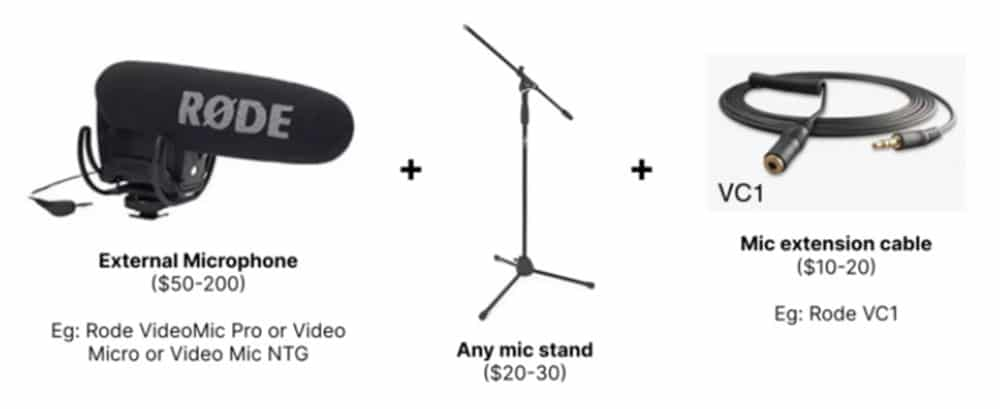
That’s a great level of audio for most people, but if you already have the [RØDE Go II lav mic](https://www.amazon.co.uk/R%C3%98DE-Microphones-WAVE-Wireless-400836009/dp/B08XFQ6KP9/ref=sr_1_2?crid=1CIM2Q0JDKROQ&keywords=rode+go+2&qid=1669826388&sprefix=rode+go+2%2Caps%2C95&sr=8-2), a cheap shotgun mic probably won’t make much of a difference to audio quality.

The next step up involves getting an XLR microphone. All the “pro” mics use XLR (a thick audio cable) rather than the tiny thin microphone ones.

I’ve used the[Rode NTG4+](https://geni.us/mLDs6n) ($230)a lot, and it has a decent price-to-quality ratio, definitely an upgrade on the VideoMicro. The issue is that most non-cinema cameras don’t have XLR audio input, so you’re going to have to record audio separately. To get around this issue we have the following setup, recording into an external audio receiver with its own memory card ([Zoom H5](https://geni.us/bPCf96)), before syncing audio and video using Final Cut Pro X.

If you really want to splash out, you can get a pro broadcast-quality shotgun microphone like the [Sennheiser MKH 416](https://en-uk.sennheiser.com/short-shotgun-tube-microphone-camera-films-mkh-416-p48u3) (I got one in December 2020). The audio isn’t massively different, but I think my voice sounds clearer with the Sennheiser. It might be worth it if you’re getting really serious about YouTube. Here’s [a video I made](https://www.youtube.com/watch?v=_u0k0tqGFUk) comparing the Senheiser MKH 416 vs Rode NTG4+ audio.

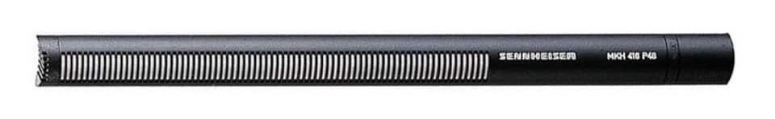
If you’ve upgraded to any of the above microphone setups, then you really don’t need to worry about audio any more, beyond experimenting with mic positioning and finding the right recording space.

Check out [this page for a full list of all my YouTube gear](https://aliabdaal.com/my-gear/?utm_source=ultimate-guide-yt&utm_medium=link) – I try to keep it relatively up-to-date.

####  5. Music & Sound Design

So my above advice is about **audio****recording**, especially capturing your voice clearly.

But music and sound design is hugely important part of upgrading your YouTube production quality. If you’re just talking to the camera, having a bit of background music is another brilliant way to up the production value. It makes such a big difference to the vibe of your video as long as you keep it fairly subtle.

I like to use relaxing or acoustic music, which I download from[Epidemic Sound](https://go.aliabdaal.com/epidemicsound) – this is totally worth the subscription to access a whole library of copyright-free tracks. Just be careful that you keep the background music at a level that doesn’t interfere with the main audio because then it becomes distracting and detracts rather than adds to the video itself.

Adding in sound effects like typing noises, transitions, and so on massively also improves the viewing experience, by giving the video a more ‘lifelike’ feel.

A few good rules of thumb:

1.   B-Roll should include sound effects. If you’re filming yourself making a coffee but didn’t catch the sound of the coffee brewing – add that in post. Likewise with doors slamming, cars driving, or the sound of the sea in the distance. Make your videos feel alive.
2.   Transitions between footage often benefit from a subtle sound effect, like a slight ‘whoosh’, ‘click’, or ‘bam’. It gives the viewer a gentle endorphin kick.
3.   Any time text comes on screen, you should have sound effects for typing, text messages and so on, to draw the viewer in. A good example of this is the texting sound effects from Ryan Trahan’s [I Invited 100 Celebrities To My Birthday](https://youtu.be/Ug4lB6XvUT0?t=87).

###  So How Do You Know If Your YouTube Videos are Good?

So you might have followed all the above advice… but how do you actually know if your videos are good? Well, I have two tests for this, which I call the Cringe Test and the Extrinsic Test.

#### The Cringe Test

This test is pretty simple. Imagine a friend, family member, or a randomer on the street comes up to you and says “Oh hey, I watched one of your videos the other day!”, or “wow, I can’t believe you started a YouTube channel!”

How much would you cringe?

If you cringe hard at that, you haven’t passed the cringe test: you don’t believe your videos are very good. And there’s a good chance that you’re right.

But if you only cringe a little bit, or you think ‘that’s OK’, then congratulations: you have passed the cringe test. In your mind, your videos are good enough that the thought of other people watching them causes dread and anxiety.

> Of course, some big creators still cringe at their videos – that’s OK, and obviously not a sign that their content is terrible.

Most people who start YouTube never get to that point of not cringing. If you’re still struggling with the cringe test, the answer is usually to make more videos and focus on quantity over quality.

#### The Extrinsic Test

Another way of knowing if your videos are ‘good’ is if they get decent traction on YouTube. These are the statistics to look out for which are extrinsic measures of how ‘good’ a video is:

*   Click-through Rate (CTR) – This is what percentage of people who were shown your title and thumbnail decided to click
*   Watch Time (Watch Time/Retention): This is how long people decided to watch your video once they clicked.
*   Positive engagement: good co
*   Subscribers: This is surprisingly not as important these days, as lots of subs doesn’t = lots of views.

I won’t give benchmark numbers, because they’ll differ for every niche. But ideally you want these stats to improve slowly over time – that’ll show your videos are getting better from an audience point of view.

But don’t focus on external measures of success too much at this point. You want to make videos YOU think are good first, otherwise what’s the point. This approach can lead to more original results as well. Also, you won’t have enough data to go off of until you’ve put out 50 – 100 videos.

Have a peek at the numbers – but don’t get obsessed.

###  The Next Step

So you know how to make your videos ‘good’. But now it’s time for some real talk. Is YouTube a hobby for you? Or a business?

Business can be a scary word. If you don’t want to think about YouTube optimisation, monetising your audience, or doing market analysis – stop here.

But if you do care about making money from increasing your viewership (which will let you do more of what you’re already doing), then business is the next step.

It’s time to Get Smart.

3. Get Smart
------------

If YouTube is just your creative hobby, anything goes. Maybe you want to make good videos, but ultimately, all that matters is that you’re having fun.

But if you’ve decided to take the next step and run your YouTube channel with the aim of getting lots of views and making money, you need to be more methodical. You need to understand your niche and brand, build a solid production system, and get smart about monetising your content.

That’s what this section of the guide is all about – running your channel like a business.

Don’t forget that this can still be fun: a creative project is often way more fulfilling if you have a solid direction and tangible rewards.

###  1. Understand Your YouTube Niche

The first step here is to understand and narrow down your niche. This will help you make successful videos that’ll connect with your viewers.

#### i. Define Your Goals + Advantages

First, think about what you want from your channel, and how you can best achieve that.

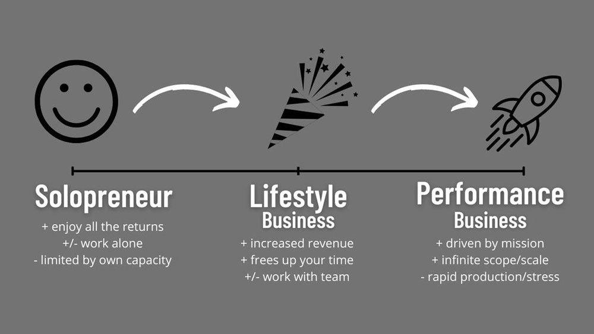
Do you want a lifestyle business (eg you + one editor) like [Oliur](https://www.youtube.com/watch?v=ilkT4lMk5Jk)? Or a big production team making crazy challenge videos like MrBeast? Maybe you want to keep things small and work solo, while holding down your main job.

All of this will affect the type of videos you’ll experiment with making, the creators you take advice from, and how much you decide to outsource (more on that later).

The second question to ask yourself is ‘what are my unfair advantages?’ In other words, what things are you fortunate (or unfortunate) enough to have that you can focus on?

For example, I was a medical student (‘hard’ to achieve), at Cambridge University (mysterious, prestigious). I had good camera gear and knew a thing or two about making things look pretty. So my videos seemed well-designed and stood out from other medics.

Your unfair advantage might be really obvious. Like having the money to buy the best gear out there and having sick production value from day one. Or it could be something less obvious, like having a huge collection of marbles that you can make videos about.

We all have unfair advantages, it’s just a matter of realising what they are. (I talk about this a lot more [here](https://www.youtube.com/watch?v=RGbCR_pq4_A&t=42s))

#### ii. Define Your Target Audience

Once you’ve figured out question you’re asking here is ‘who’s my audience and what do they want?’

*   What kind of person would value your content?
*   What would they want to hear?
*   What are they already watching?

But remember: it’s easy to try to appeal to everyone. Get specific about exactly who would benefit most from **your** specific content, and focus on those people. Eg when I started out I gave tips on studying for medicine, rather than studying in general. And that helped me build a committed core audience.

>  I suggest using this Notion template to create an imaginary ‘ideal’ audience member who you’ll create videos for. That’ll help you triangulate exactly what videos would help your audience most.
> 
> 
> [Template: My Target Audience](https://www.notion.so/Template-My-Target-Audience-79cf72d42dae4817af3c9c2bc0f296b4)

Figuring out your target audience’s current tastes and needs is an ongoing process. But you’ll know you’ve hit gold when your views start getting more views, and especially when you get super-positive comments.

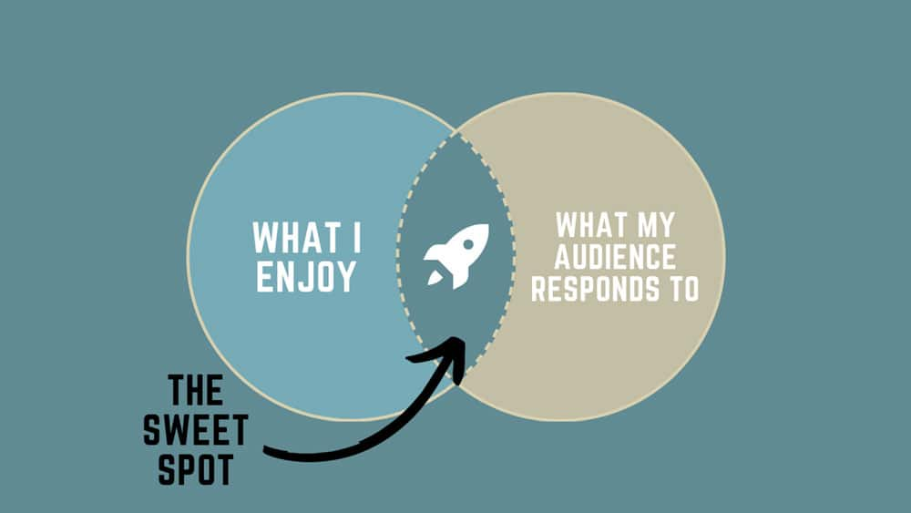
Ideally, you want to find that sweet spot where you’re making content that you enjoy, and that your audience also responds to well.

#### iii. Define Your Value Proposition

The question here is “what _value_ am I giving to my audience?”

Figure out how _you_ make the most valuable possible content for your audience, using your unfair advantages. You want people to be thinking ‘OMG how am I getting this much value/entertainment for free??’

A good way of defining your value proposition is to craft two hypothetical intros for your channel:

**Value Proposition (Explicit, ie what you’d actually say)** – “Hey guys, welcome back to the channel. If you’re new here, my name is Ali, I’m a doctor working in the UK. On this channel, we explore the strategies and tools that can help us live happier, more productive lives”

**Value Proposition (Implicit, ie this is what I wish/hope people will think)** – “This guy Ali looks like he’s super productive, he’s a full-time doctor and does all these other things on the side, and he’s always so positive and analyses tech really intellectually, and his recommendations for books, podcasts, apps, life lessons etc are really good. I think of him as a role-model who I can learn from to be more productive specifically, and just live a happier life generally”.

Once you’ve answered those questions, you should have a clearer content strategy.

###  2. Competitor Analysis

A key part of understanding your YouTube niche is analysing your ‘competitors’.

You need to be familiar with all the other major YouTubers making content in your niche, including:

*   What videos do well for them
*   Their title and thumbnail combinations
*   Their presentation style
*   The video formats they use (listicles, reviews, vlogs)
*   How they monetise their channel (merchandise, sponsorships)
*   Their presence on other social media platforms (TikTok, Twitter, Instagram)

The point of doing all this is so you can emulate what’s working in the market right now, avoid any pitfalls that other creators have fallen into, and understand your audience better. It’ll also help you spot gaps in the market or improve on what other people are doing.

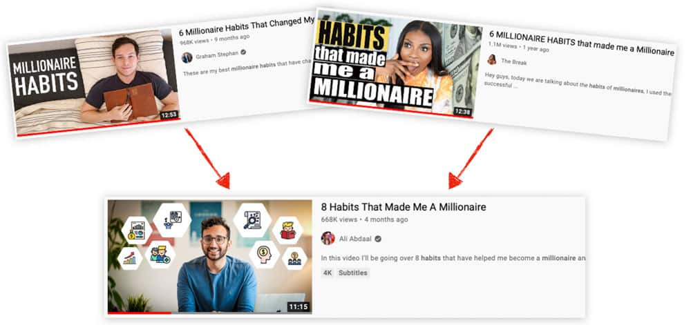
Here’s a [Notion template](https://aliabdaal.notion.site/f6f373883a8d40bfb8c70bb93168ee7f?v=e3fb6c27eb514da9ab8b3aee528da9d3) I made for analysing your competition, which you can add to gradually as you come across more creators in your niche.

I say ‘competitors’ in quotation marks for a reason, by the way. I actually like to think of other productivity/lifestyle YouTubers like [Matt D’Avella](https://www.youtube.com/channel/UCJ24N4O0bP7LGLBDvye7oCA) as my YouTube colleagues instead.

If someone’s following one productivity YouTuber, it’s likely they’ll follow another one as well. We’re not really competing, we’re just in the same ecosystem. And the rising tide lifts all boats: there’s a good chance that lots of viewers first came across my channel after watching someone else’s productivity content first.

I even have a regular Zoom call with other YouTubers in my niche ([Matt D’Avella](https://www.youtube.com/channel/UCJ24N4O0bP7LGLBDvye7oCA), [Nathaniel Drew](https://www.youtube.com/@nathanieldrew), Joey from [Better Ideas](https://www.youtube.com/@betterideas/videos), [Elizabeth Filips](https://www.youtube.com/@elizabethfilips), etc).

Working with others in the same boat is game changing, because you don’t feel alone in your journey. You get to learn from other people’s mistakes, and get inspiration from their successes. And you get constant support from others who know exactly what you’re going through.

###  3. YouTube Analytics

Go to YouTube, click on your profile picture in the top-right, then click ‘YouTube Studio’.

This will give you access to all of your channel’s analytics, including views for different videos, retention graphs, how your channel is doing overall, your revenue from ads, and about a million other things.

All of this data is a goldmine for experienced YouTubers. We can use it to perfect our videos, identify weaknesses, and sometimes change strategy completely.

You don’t want to focus on analytics too much early days – just get the first 50 videos out. Also, the data can be very noisy if you’re below say 1000 views per video.

That being said, here are 4 of the most useful metrics to keep track of:

1.   **Impressions Click-Through Rate** – Also known as CTR. This is what percentage of people decided to click on your video after it was shown to them by YouTube (either while browsing their homepage or in their ‘suggested’ sidebar). Monitor this closely – low CTR compared to your other videos means that your package of topic, title, and thumbnail isn’t attractive to viewers. 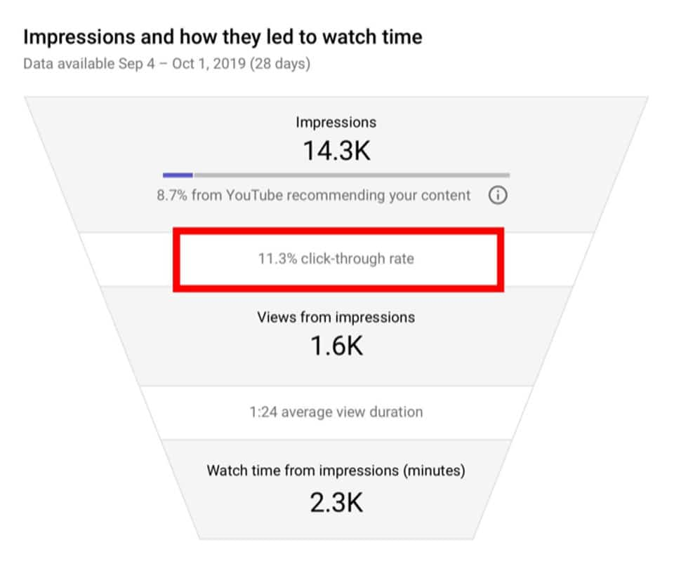
2.   **Watch Time**– You can find the watch time for all your videos in the last 28 days, and the watch time for each of your videos. This gives you a good idea of how much your videos are being watched in total. If a video has a high CTR % but low watch time, it’s a sign people didn’t stick around. This could be because they were underwhelmed/disappointed by the content. The same applies for you channel as a whole – increasing overall watch time is a great goal to set yourself. 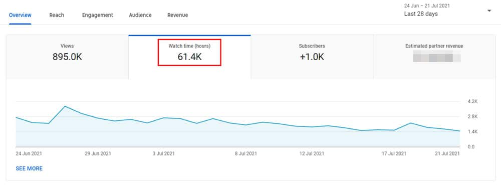
3.   **Retention Graph**– YouTube gives you a graph for each of your videos. This shows how long viewers watched your video before clicking away. The steeper it goes down, the more people left at that point in the video. The grey streak shows your average retention – this video has better-than-average retention. 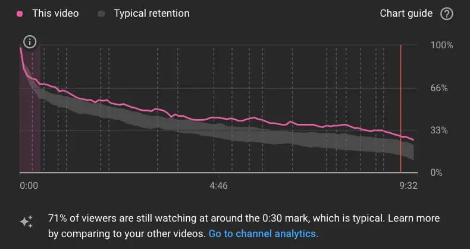You can use this to tell which parts of your video were interesting to viewers, and which made them click away. Try to spot patterns, and adjust the content accordingly in your next video. 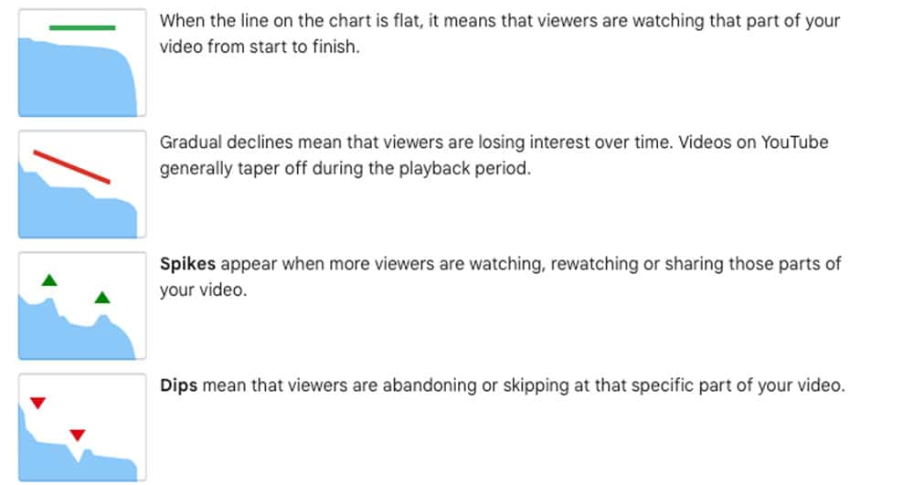
4.   New Vs Returning Viewers. This will show you how well your videos are doing with your current audience, and whether they’re attracting new ones. Increasing your ‘returning viewers’ number relative to your subscriber count is a sign that you’re building a loyal following of subscribers/returning viewers who actually watch your videos. Having a low number of returning viewers is a sign that you’re not keeping people’s interest long-term. 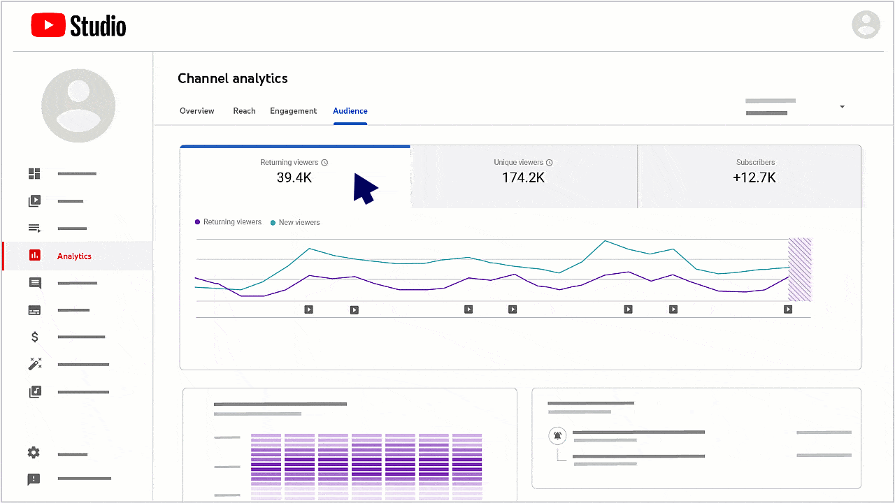

Ultimately though, your data sample size is so small until you hit around 2k subs that it’s difficult to interpret YouTube analytics in a meaningful way. If I was starting YouTube again from scratch, I’d focus most of my energy on the following (roughly in order of importance):

1.   Making videos that I like (improving incrementally)
2.   Hitting consistent output (eg x1 video a week)
3.   Getting **genuine** positive feedback from my target audience
4.   Correcting any obvious mistakes with individual videos that I’d find through analytics (big dips in retention, very low CTR or views).

There’s a ton more information to dig into with YouTube Analytics. For a full breakdown of how YouTube Analytics works, check out [YouTube’s own written guide](https://support.google.com/youtube/answer/9002587?hl=en-GB). It’s super-clear, concise, and up-to-date.

### 4. Optimise Your Systems

The real “secret” to producing videos consistently (if there is one at all), is that you need to build a**system**around your content production.

A system means that you can efficiently create valuable content that grows your audience and revenue, without it taking up large amounts of your own time.

Instead of thinking of your YouTube channel as a personal project, think about it like a machine. A machine that takes inputs in the form of ideas and refines them into valuable content that your audience loves.

To get that machine working smoothly, the first thing you need to do is **quantify your workflow.** Make an organisational chart like the one below, and write down all the stages of your current production process, but including the % of time that you’re spending on each stage.

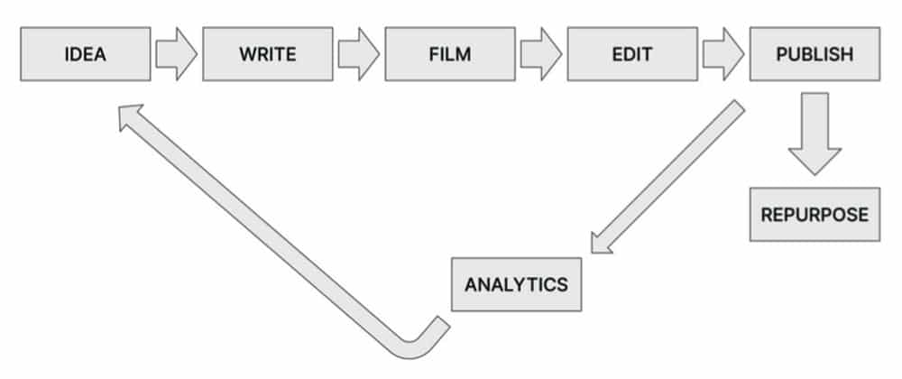
This lets you to isolate where you’re spending the most time (video setup, editing, scripting etc), and understand where your workflow and operation is least effective / efficient.

Now you can start to eliminate unnecessary steps and remove friction.

Another word for this is ‘refactoring’: the process of changing a system to improve its efficiency without changing the quality of the output. The term comes from computer programming – programmers will spend hours rewriting a program that does _exactly the same thing_ when they’re finished, but running much faster and requiring fewer resources to operate.

So, ask yourself:

1.   What friction can you find in your system?
2.   What can you do to get rid of this friction and make it more efficient?
3.   What are the 20% of tasks within your system that deliver 80% of the results? How can you redesign your system to focus on those 20% of tasks?

A good example is my YouTube filming setup at university..

When I was just starting out, I kept all of my camera gear in a cupboard, or behind the bedroom door. But that added a **lot** of extra friction, because every time I wanted to film I’d have to set up my camera, lights, and microphones from scratch. So I decided to remove that friction by having a permanent setup at my desk.

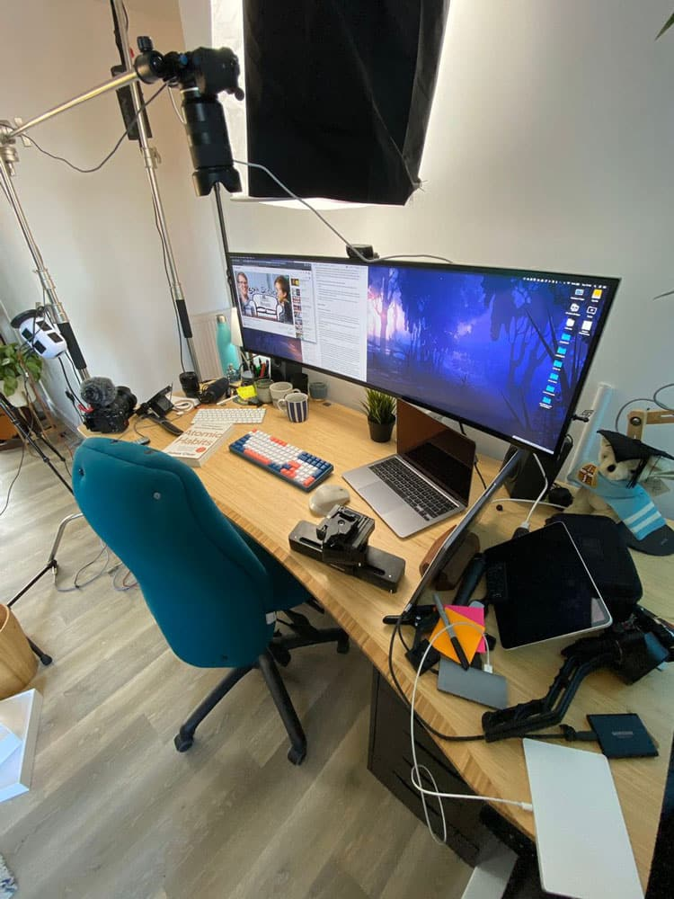
Sure, it made my living room a _little_ less cosy, but it meant I could eliminate that

If you don’t want a permanent setup, another way of removing friction as a YouTuber is to _batch_ your filming. Pick a day, maybe once a week or fortnight. Maybe if you’re super pro, once a month.

Sit down, and film yourself doing 2, 3, maybe 5 videos at a time. It’s honestly game-changing. This way you don’t need to keep setting things up again and again every time you want to get 30 minutes of filming done. It’s so simple but saves tons of time.

#### iii. Outsource

Outsourcing – hiring other people to do some of the work – is the final piece of the refactoring puzzle.

My recommendation is to outsource your editing before anything else. Not having to edit yourself will save you countless hours in front of a screen every month. And it lets you produce x2+ as many videos as before (or have more downtime).

>  The question you need to keep asking yourself is: How can I give my customer the results he wants systematically rather than personally? Put another way: How can I create a business whose results are systems-dependent rather than people-dependent?
> 
> 
> **Michael Gerber –**_[The E-Myth Revisited](https://geni.us/S4M2fl)_

As soon as you can afford to, this should be your first outsourcing move. It might take 4-6 hours for a decent editor to edit a 10 minute video. $60-80 an hour is reasonable for someone who’s not super experienced, so you’re looking at about $240-400 per video.

When you’re starting out, the easiest way to find an editor is through a gig-job website like [People Per Hour](https://www.peopleperhour.com/), Fiverr, or Upwork. You can also use a YouTube-specific site like [YT Jobs](https://ytjobs.co/) or [Editorof](https://www.editorof.com/). Just post an ad, wait for the applications to come in, and get the most promising applicants to edit a trial video for you (paid, of course).

It’ll cost a bit of money, but it’s a great investment to find a decent editor. Here’s a useful template advert for finding an editor, based on my first ad for one a few years ago:

[Finding an Editor Template](https://www.notion.so/Finding-an-Editor-Template-ecb426b9b9a3495fbe2e0bedb1c1f6d5)

When you do outsource, think of it as finding a collaborator as opposed to getting someone to do your grunt work. These people will be crucial to your channel and business’ success.

Some mistakes to avoid:

1.   Not trusting others with the creative process. You may have a unique editing style, and think that no one will be able to match it. But you’d be surprised by how quickly someone else can emulate your style and create or edit content for you near-perfectly.
2.   Being a control freak and wanting to micromanage everything. This will waste dozens of hours a month, and frustrate your editor. Lean into the discomfort of giving up control, and you’ll be grateful that you did.
3.   Spending too much time spent giving feedback. For the first few weeks, it can be easy to be frustrated with the time it takes to give feedback to others. I find that using Loom is useful, as I can record myself making corrections and explaining my thought processes, rather than back-and-forth over email. Here’s an example of some concise feedback I gave to an editor: 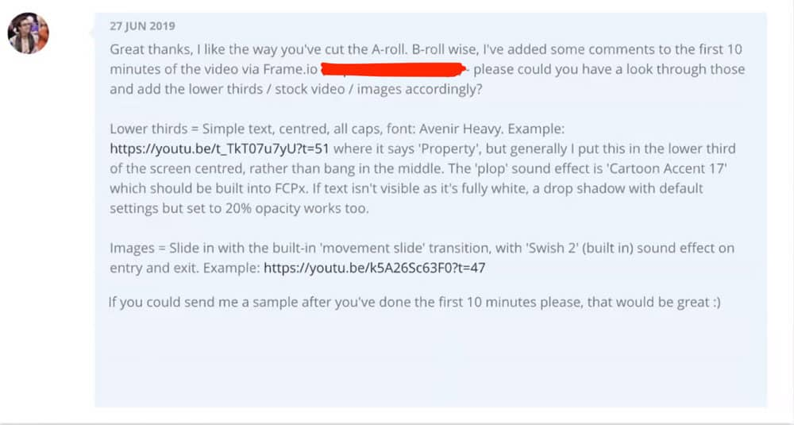

If you’re interested in diving deeper into the business of being a creator, check out my self-paced course [The Part-Time Creatorpreneur](https://creatorpreneur.aliabdaal.com/?utm_source=ultimate-guide-yt&utm_medium=link). It’s**6+ hours**of content spread across**40+ lessons**, where you’ll learn everything there is to know about transforming your creative side-hustle into a sustainable operation that’s highly profitable, hugely scalable, and ridiculously fun. Here’s a [sample lesson introduction](https://www.youtube.com/watch?v=W0sLCv3soKM&t=10s) from the course.

For something more bitesize, you can subscribe to my [Creatorpreneur Crash Course](https://aliabdaal.com/creatorpreneur-crash-course/?utm_source=ultimate-guide-yt&utm_medium=link), a free 5-day email course where I’ll teach you the basics of entrepreneurship for creators.

### 5. Repurposing YouTube Content

In the modern internet age with so many social media sites, it doesn’t make sense to build 100% of your business on a single platform.

Having brainstormed and created dozens of videos for your YouTube channel, it doesn’t take much to repost that content across different platforms. This helps get more eyes on it, improve your visibility, and grow your channel / personal brand.

Some options you have for repurposing:

1.   **Short-Form Video (Tik Tok, YouTube Shorts, Instagram)**

It doesn’t take much to cut up your long-form videos into bitesize, 60-second-or-less videos to post on TikTok, YouTube Shorts, or Instagram. These can get millions of views, and drive a lot of traffic to your main channel. You can also film dedicated short-form videos, ideally batch-filming several of them every week or two.

1.   **Text-Based Platforms (Facebook, LinkedIn, Twitter)**

Any video that you’ve scripted can be repurposed as a LinkedIn/Facebook post, or as a Tweet thread. Try to compress your main points into as short a space as you can, and pay attention to what works for other creators in your niche on those platforms.

The important thing with short form video is that it’s snappy, has great music, and makes people want to re-watch several times. Having a physical object in your Shorts is often a good way of grabbing attention, as in including loops

To start with, I suggest picking one or two platforms to repurpose on, and expand once you get the hang of those.

Personally, I regret not repurposing my content from the start. Since I’ve made more of a concerted effort to repurpose content, I’ve more than tripled my Instagram following, quadrupled my following on Twitter, grown an audience on TikTok and even started a second channel on YouTube for repurposed shorts.

Repurposing is also important in relation to building up an audience that’s not restricted to an open platform like YouTube. Relying purely on a single platform, if it disappeared, you’d be left high and dry without anyone watching your content. Ideally, you want to build an audience on an open platform (like YouTube). Then bring them onto an owned platform (like a blog and/or email newsletter). This way you’re not solely reliant on the open site.

Remember that repurposing does require more work. So identify where you can make changes in your current workflow to make repurposing easier. If you have the resources, you can hire third party services to do this for you. For example, some big YouTubers have dedicated Shorts/TikTok editors.

### 6. Monetise Your YouTube Channel

There are the four main ways you can monetise your channel.

#### **1. AdSense**

This is the most obvious form of earning money from your YouTube channel – through paid ads. These are automatically displayed on your videos. These are the ads you can’t skip on YouTube. However, to qualify for YouTube’s Partner Program and get monetised. You need to have over 1,000 subscribers and at least 4,000 watch time in the past 12 months.

>  Pro tip: get YouTube Premium. If you spend a lot of time on YouTube (which you should, as a YouTuber) it’s absolutely worth the $10 or so to not have to watch ads all the time. Do the free trial for a month and you’ll never look back.

Don’t worry too much about getting monetised to begin with. The money is just peanuts until you get several tens of thousands of subscribers. Some context: it took me about 7 months to switch on monetisation. Which made me about $10 each day (which I was thrilled about – free takeaway every day). Then after one of my videos went viral a few months later, I started making around $50 a day. This was serious money at last ($1500 every month).

And when 2020 lockdowns hit, that rocketed up to $200-$400 a day (at one point hitting $800). Which felt truly insane.

#### **2. Affiliate Links**

This is perhaps the most effective way of gaining revenue from your content as a beginner. By becoming part of programs such as Amazon Associates, you can share affiliate links to products. If people use your link to purchase an item you receive a kickback from that. A significant amount of my income comes from affiliates with sites like Amazon, Skillshare, and products like Paperlike and iQuinix.

Once your channel starts growing, it’s likely that you’ll start to receive offers from companies or brands who want to pay you a fee in return for you putting a short segment in your video where you promote their product for 30 – 60 seconds. These deals can be very lucrative, especially if you build an ongoing relationship with a big brand.

It can be a delicate balancing act though between, making money from your channel, providing value to your viewers without spamming them, and finding sponsors who fit your brand. It makes sense for me to be sponsored by a brand like Readwise or Notion. I genuinely love their products and talk about them in my videos already. But it’d be sketchy if I was promoting something I know nothing about, and has no connection to my personal brand.

Once you get big enough, you can sign with a creator sponsorship agency like [Sixteenth.](https://www.sixteenth.co/) They’ll negotiate these deals for you in return for a % cut, which makes life much easier.

#### **4. Personal Products + Services**

After cultivating an audience, one very broad area you can look at is creating your own personal products. These can include courses (like PTYA), books (like [this](https://geni.us/L6DHDid) from Thomas Frank), digital downloads, memberships (like [Patreon](https://www.patreon.com/en-GB)), consulting services, and, of course, physical products.

I also partnered with [Dbrand](https://dbrand.com/shop/special-edition/palettes) to produce a series of skins for Apple products like iPhone, AirPod Pro, and MacBooks.

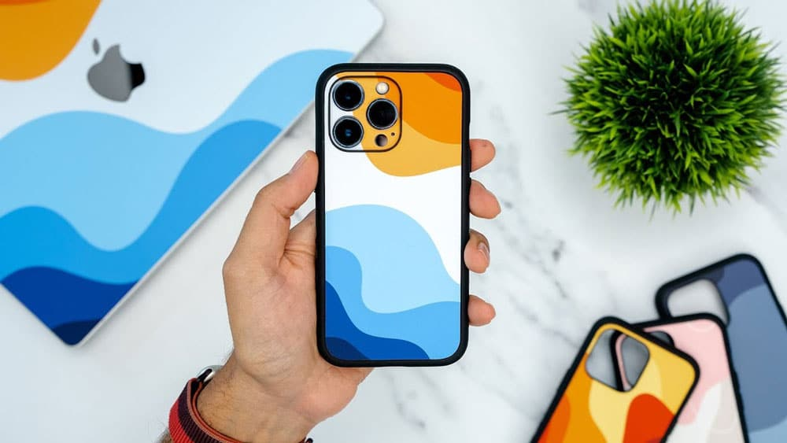
With an audience who like, know and trust you, a % of them will usually be excited to buy some merch in some shape or form, to show that they’re a part of your community.

Wrapping Up
-----------

I’ll leave you with three key pieces of advice on starting and running a YouTube channel. Which I’ve gathered from 5+ years of experience.

###  1. Have a Positive Mindset

Here’s the great thing about starting a YouTube channel: you’re making what’s known as a ‘positive asymmetrical bet’.

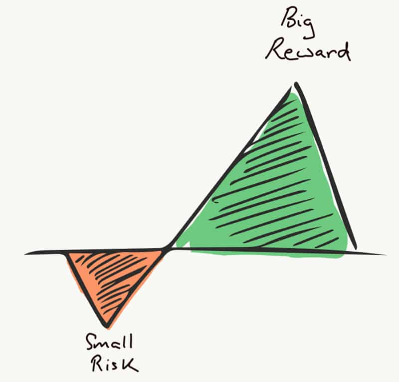
The potential reward is **huge.** If your channel does even moderately well it can get you new friends, contacts, jobs, skills, and even a full-time income. With a little luck and dedication, it could even make you millions.

And as we’ve already discussed, there’s very little real downside. It takes a big time investment. But even if you never make it big, you’ll still learn all about editing, camera confidence, and building an audience. Practically no one ever regrets starting a YouTube channel.

So if you’re remotely interested – just do it.

### 2. Be Consistent

The most important thing to remember with YouTube is that you have to be patient and consistent.

This is perhaps the single biggest, most non-negotiable, determinant of your success on YouTube. And it’s not glamorous.

It took me 6 months and posting 53 videos to hit 1,000 subscribers. That’s months of idea generating, editing, and churning out videos with little to no audience.

And before I hit 2 million subscribers, I was uploading 2-3 videos**every week** without fail, while working full-time. Things have changed a little now. I’ve got an established audience and have started to expand the business. But I attribute a huge amount of my early growth to my consistency.

This was my growth + revenue chart for 2017–2020. There was a long stretch with zero money and few subscribers, until things finally took off.

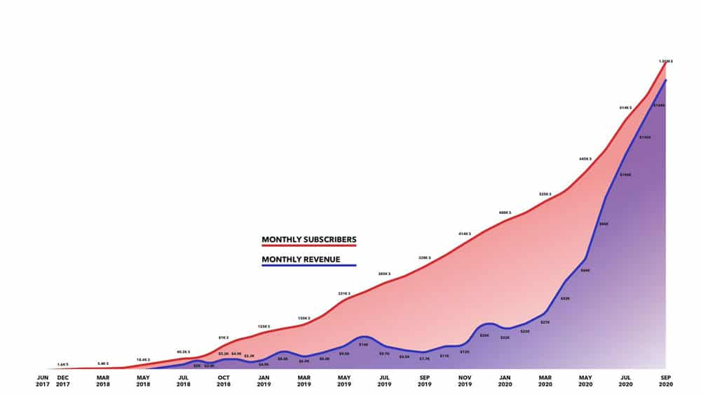
The difference between those who make it and those who don’t is giving up during that painful period of no views/income.

So if you do start: don’t give up. Just focus on making 1% improvements.

### 3. Enjoy the Journey

Finally, remember to have fun and enjoy the journey.

If there’s one thing that I’ve learned about productivity and success, it’s that these things don’t happen by trying to do more, and pushing ourselves to breaking point.

Instead, it’s about doing more of what matters to us, and choosing to have fun along the way.

### The Part-Time YouTuber Academy

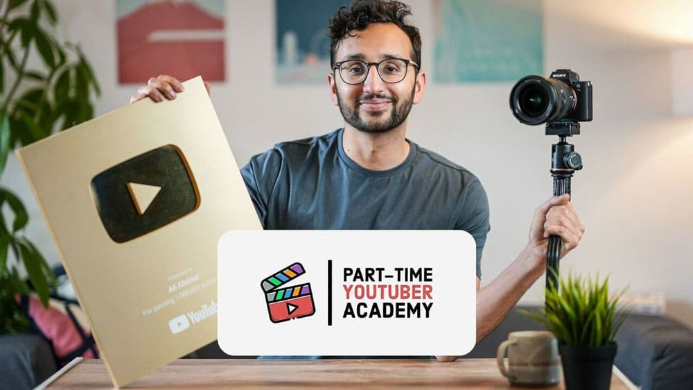
If you’ve arrived at the end of this guide, that can only mean one thing. You’re into YouTube,and you want to take it seriously. If that’s the case, I suggest you check out my course [The Part-Time YouTuber Academy](https://ptya.com/?utm_source=ultimate-guide-yt&utm_medium=link).

In the course I’ll help you implement everything I know about growing your YouTube channel into a sustainable machine that churns out valuable content and generates healthy passive income. If you’re committed to growing your online brand and putting yourself in the best position to succeed on YouTube… [PTYA](https://ptya.com/?utm_source=ultimate-guide-yt&utm_medium=link) might be perfect for you.

And if you don’t feel you got value from the course once you’ve finished, we have a 100% Satisfaction Guarantee Money-Back Promise. 
