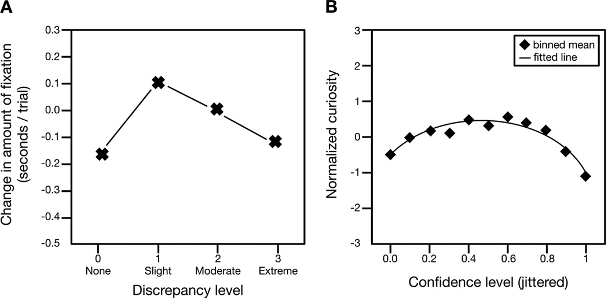
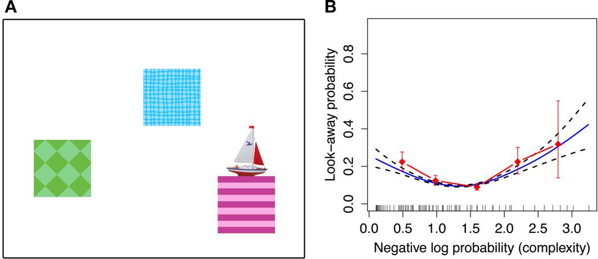
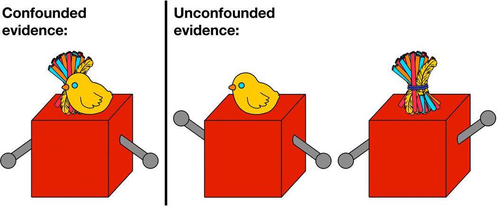
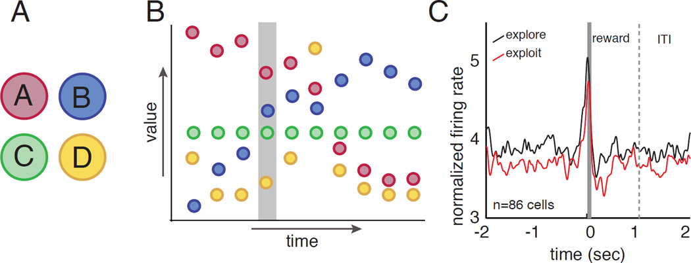
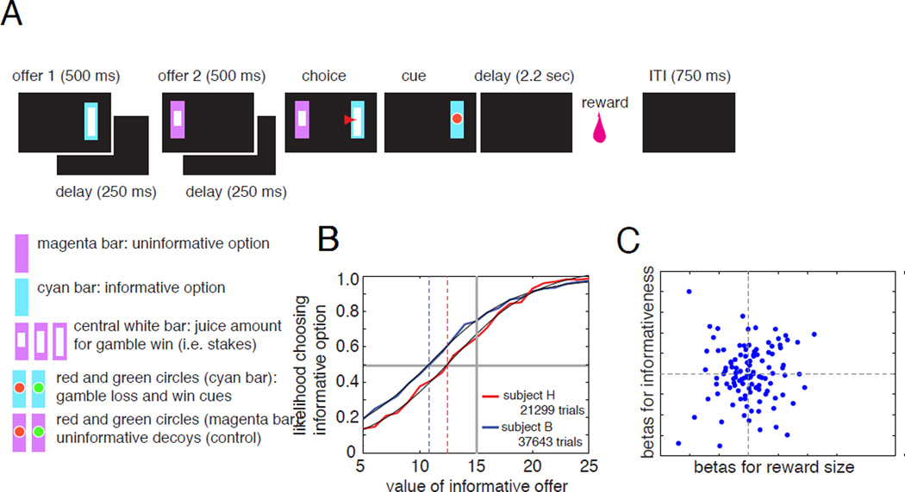

Title: The psychology and neuroscience of curiosity

URL Source: https://pmc.ncbi.nlm.nih.gov/articles/PMC4635443/

Markdown Content:
The psychology and neuroscience of curiosity - PMC
===============
[Skip to main content](https://pmc.ncbi.nlm.nih.gov/articles/PMC4635443/#main-content)

An official website of the United States government

Here's how you know

Here's how you know

**Official websites use .gov**

 A **.gov** website belongs to an official government organization in the United States.

**Secure .gov websites use HTTPS**

 A **lock** ( ) or **https://** means you've safely connected to the .gov website. Share sensitive information only on official, secure websites.

 Search 

Log in
*   [Dashboard](https://www.ncbi.nlm.nih.gov/myncbi/)
*   [Publications](https://www.ncbi.nlm.nih.gov/myncbi/collections/bibliography/)
*   [Account settings](https://www.ncbi.nlm.nih.gov/account/settings/)
*    Log out 

 Search…   Search NCBI 

Primary site navigation

 Search  

Logged in as:

*   [Dashboard](https://www.ncbi.nlm.nih.gov/myncbi/)
*   [Publications](https://www.ncbi.nlm.nih.gov/myncbi/collections/bibliography/)
*   [Account settings](https://www.ncbi.nlm.nih.gov/account/settings/)

 Log in 

Search PMC Full-Text Archive Search in PMC

*   [Journal List](https://pmc.ncbi.nlm.nih.gov/journals/)
*   [User Guide](https://pmc.ncbi.nlm.nih.gov/about/userguide/)

*   
*   

*   PERMALINK
---------

Copy   

 As a library, NLM provides access to scientific literature. Inclusion in an NLM database does not imply endorsement of, or agreement with, the contents by NLM or the National Institutes of Health.

 Learn more: [PMC Disclaimer](https://pmc.ncbi.nlm.nih.gov/about/disclaimer/) | [PMC Copyright Notice](https://pmc.ncbi.nlm.nih.gov/about/copyright/)

Neuron

. Author manuscript; available in PMC: 2016 Nov 4.

_Published in final edited form as:_ Neuron. 2015 Nov 4;88(3):449–460. doi: [10.1016/j.neuron.2015.09.010](https://doi.org/10.1016/j.neuron.2015.09.010)

*   [Search in PMC](https://pmc.ncbi.nlm.nih.gov/search/?term=%22Neuron%22[jour])
*   [Search in PubMed](https://pubmed.ncbi.nlm.nih.gov/?term=%22Neuron%22[jour])
*   [View in NLM Catalog](https://www.ncbi.nlm.nih.gov/nlmcatalog?term=%22Neuron%22[Title%20Abbreviation])
*   [Add to search](https://pmc.ncbi.nlm.nih.gov/articles/PMC4635443/?term=%22Neuron%22[jour])

The psychology and neuroscience of curiosity
============================================

[Celeste Kidd](https://pubmed.ncbi.nlm.nih.gov/?term=%22Kidd%20C%22[Author])

### Celeste Kidd

1 Department of Brain and Cognitive Sciences and Center for Visual Science, University of Rochester, Rochester, NY

Find articles by [Celeste Kidd](https://pubmed.ncbi.nlm.nih.gov/?term=%22Kidd%20C%22[Author])

1, [Benjamin Y Hayden](https://pubmed.ncbi.nlm.nih.gov/?term=%22Hayden%20BY%22[Author])

### Benjamin Y Hayden

1 Department of Brain and Cognitive Sciences and Center for Visual Science, University of Rochester, Rochester, NY

Find articles by [Benjamin Y Hayden](https://pubmed.ncbi.nlm.nih.gov/?term=%22Hayden%20BY%22[Author])

1,*

*   Author information
*   Copyright and License information

1 Department of Brain and Cognitive Sciences and Center for Visual Science, University of Rochester, Rochester, NY

*
Corresponding author: Benjamin Hayden, Department of Brain and Cognitive Sciences, University of Rochester, Rochester NY 14620, benhayden@gmail.com

[PMC Copyright notice](https://pmc.ncbi.nlm.nih.gov/about/copyright/)

PMCID: PMC4635443 NIHMSID: NIHMS722442 PMID: [26539887](https://pubmed.ncbi.nlm.nih.gov/26539887/)

The publisher's version of this article is available at [Neuron](https://doi.org/10.1016/j.neuron.2015.09.010)

SUMMARY
-------

Curiosity is a basic element of our cognition, yet its biological function, mechanisms, and neural underpinning remain poorly understood. It is nonetheless a motivator for learning, influential in decision-making, and crucial for healthy development. One factor limiting our understanding of it is the lack of a widely agreed upon delineation of what is and is not curiosity; another factor is the dearth of standardized laboratory tasks that manipulate curiosity in the lab. Despite these barriers, recent years have seen a major growth of interest in both the neuroscience and psychology of curiosity. In this Perspective, we advocate for the importance of the field, provide a selective overview of its current state, and describe tasks that are used to study curiosity and information-seeking. We propose that, rather than worry about defining curiosity, it is more helpful to consider the motivations for information-seeking behavior and to study it in its ethological context.

**Keywords:** Curiosity, information-seeking, learning, Goldilocks effect, uncertainty

BACKGROUND
----------

Curiosity is such a basic component of our natures that we are nearly oblivious to its pervasiveness in our lives. Consider, though, how much of our time we spend seeking and consuming information, whether listening to the news or music, browsing the internet, reading books or magazines, watching TV, movies, and sports, or otherwise engaging in activities not directly related to eating, reproduction, and basic survival. Our insatiable demand for information drives a much of the global economy and, on a micro-scale, motivates learning and drives patterns of foraging in animals. Its diminution is a symptom of depression, and its overexpression contributes to distractibility, a symptom of disorders such as attention-deficit/hyperactivity disorder. Curiosity is thought of as the noblest of human drives, and is just as often as it is denigrated as dangerous (as in the expression “curiosity killed the cat”). And despite its link with the most abstract human thoughts, some rudimentary forms of it can be observed even in the humble worm C. elegans.

Despite its pervasiveness, we lack even the most basic integrative theory of the basis, mechanisms, and purpose of curiosity. Nonetheless, as a psychological phenomenon, curiosity—and the desire for information more broadly—has attracted the interest of the biggest names in the history of psychology (e.g., [James, 1913](https://pmc.ncbi.nlm.nih.gov/articles/PMC4635443/#R63); [Pavlov, 1927](https://pmc.ncbi.nlm.nih.gov/articles/PMC4635443/#R87); [Skinner, 1938](https://pmc.ncbi.nlm.nih.gov/articles/PMC4635443/#R106)). Despite this interest, only recently have psychologists and neuroscientists begun widespread and coordinated efforts to unlock its mysteries (e.g., [Gottlieb et al., 2013](https://pmc.ncbi.nlm.nih.gov/articles/PMC4635443/#R43); [Gruber, Gelman & Ranganath, 2014](https://pmc.ncbi.nlm.nih.gov/articles/PMC4635443/#R46); [Kang et al., 2009](https://pmc.ncbi.nlm.nih.gov/articles/PMC4635443/#R67)). The present Perspective aims summarize this recent research, motivate new interested in the problem, and to tentatively propose a framework for future studies of the neuroscience and psychology of curiosity.

DEFINITION AND TAXONOMY OF CURIOSITY
------------------------------------

One factor that has hindered the development of a formal study of curiosity is the lack of a single widely accepted definition of the term. In particular, many observers think that curiosity is a special type of the broader category of information-seeking. But carving out a formal distinction between the curiosity and information-seeking has proven difficult. As a consequence, much research that is directly relevant to the problem of curiosity does not use the term curiosity and instead focuses on what are considered to be distinct phenomena. These phenomena include, for example, play, exploration, reinforcement learning, latent learning, neophilia, and self-reported desire for information (e.g., [Deci, 1975](https://pmc.ncbi.nlm.nih.gov/articles/PMC4635443/#R24); [Gruber, Gelman & Ranganath, 2014](https://pmc.ncbi.nlm.nih.gov/articles/PMC4635443/#R46); [Jirout & Klahr, 2012](https://pmc.ncbi.nlm.nih.gov/articles/PMC4635443/#R65); [Kang et al., 2009](https://pmc.ncbi.nlm.nih.gov/articles/PMC4635443/#R67); [Sutton & Barto, 1998](https://pmc.ncbi.nlm.nih.gov/articles/PMC4635443/#R112); [Tolman & Gleitman, 1949](https://pmc.ncbi.nlm.nih.gov/articles/PMC4635443/#R116)). Conversely, studies that do use the term curiosity range quite broadly in topic area. In laboratory studies, the term curiosity itself is broad enough to encompass both the desire for answers to trivia questions and the strategic deployment of gaze in free viewing ([Gottlieb et al., 2013](https://pmc.ncbi.nlm.nih.gov/articles/PMC4635443/#R43)).

We consider this diversity of definitions to be both characteristic of a nascent field and healthy. Here we consider some classic views with an aim towards helping us think about how to study curiosity in the future.

### Classic descriptions of curiosity

Philosopher and psychologist [William James (1899)](https://pmc.ncbi.nlm.nih.gov/articles/PMC4635443/#R62) called curiosity “the impulse towards better cognition,” meaning that it is the desire to understand what you know that you do not. He noted that, in children, it drives them towards objects of novel, sensational qualities—that which is “bright, vivid, startling”. This early definition of curiosity, he said, later gives way to a “higher, more intellectual form”—an impulse towards more complete scientific and philosophic knowledge. Psychologist-educators [G. Stanley Hall and Theodate L. Smith (1903)](https://pmc.ncbi.nlm.nih.gov/articles/PMC4635443/#R50) pioneered some of the earliest experimental work on the development of curiosity by collecting questionnaires and child biographies from mothers on the development of interest and curiosity. From these data, they describe children’s progression through four stages of development, starting with “passive staring” as early as the second week of life, on through “curiosity proper” at around the fifth month.

The history of studies of animal curiosity is nearly as long as the history of the study of human curiosity. Ivan Pavlov, for example, wrote about the spontaneous orienting behavior in dogs to novel stimuli (which he called the “What-is-it?” reflex) as a form of curiosity ([Pavlov, 1927](https://pmc.ncbi.nlm.nih.gov/articles/PMC4635443/#R87)). In the mid 20th century, exploratory behavior in animals began to fascinate psychologists, in part because of the challenge of integrating it into strict behaviorist approaches (e.g. [Tolman, 1948](https://pmc.ncbi.nlm.nih.gov/articles/PMC4635443/#R115)). Some behaviorists counted curiosity as a basic drive, effectively giving up on providing a direct cause (e.g. [Pavlov, 1927](https://pmc.ncbi.nlm.nih.gov/articles/PMC4635443/#R87)). This stratagem proved useful even as behaviorism declined in popularity. For example, this view was held by Harry Harlow—the psychologist best known for demonstrating that infant rhesus monkeys prefer the company of a soft, surrogate mother over a bare wire mother. Harlow referred to curiosity as a basic drive in and of itself—a “manipulatory motive”—that drives organisms to engage in puzzle-solving behavior that involved no tangible reward (e.g., Harlow, Blazek, & McClearn, 1956; [Harlow, Harlow, & Meyer, 1950](https://pmc.ncbi.nlm.nih.gov/articles/PMC4635443/#R52); Harlow & McClearn, 1954).

Psychologist Daniel Berlyne is among the most important figures in the 20th century study of curiosity. He distinguished between the types of curiosity most commonly exhibited by human and non-humans along two dimensions: perceptual versus epistemic, and specific versus diversive ([Berlyne, 1954](https://pmc.ncbi.nlm.nih.gov/articles/PMC4635443/#R4)). Perceptual curiosity refers to the driving force that motivates organisms to seek out novel stimuli, which diminishes with continued exposure. It is the primary driver of exploratory behavior in non-human animals and potentially also human infants, as well as a possible driving force of human adults’ exploration. Opposite perceptual curiosity was epistemic curiosity, which Berlyne described as a drive aimed “not only at obtaining access to information-bearing stimulation, capable of dispelling uncertainties of the moment, but also at acquiring knowledge”. He described epistemic curiosity as applying predominantly to humans, thus distinguishing the curiosity of humans from that of other species ([Berlyne, 1966](https://pmc.ncbi.nlm.nih.gov/articles/PMC4635443/#R7)).

The second dimension of curiosity that Berlyne described informational specificity. Specific curiosity referred to desire for a particular piece of information, while diversive curiosity referred to a general desire for perceptual or cognitive stimulation (e.g., in the case of boredom). For example, monkeys robustly exhibit specific curiosity when solving mechanical puzzles, even without food or any other extrinsic incentive (e.g., [Davis, Settlage, & Harlow, 1950](https://pmc.ncbi.nlm.nih.gov/articles/PMC4635443/#R20); [Harlow, Harlow, & Meyer, 1950](https://pmc.ncbi.nlm.nih.gov/articles/PMC4635443/#R52); [Harlow, 1950](https://pmc.ncbi.nlm.nih.gov/articles/PMC4635443/#R51)). However, rats exhibit diversive curiosity when, devoid of any explicit task, they robustly prefer to explore unfamiliar sections of a maze (e.g., Dember, 1956; [Hughes, 1968](https://pmc.ncbi.nlm.nih.gov/articles/PMC4635443/#R60); Kivy, Earl, & Walker, 1956). Both specific and diversive curiosity were described as species-general information-seeking behaviors.

### Contemporary views of curiosity

A common contemporary view of curiosity is that it is a special form of information-seeking distinguished by the fact that it is internally motivated ([Loewenstein, 1994](https://pmc.ncbi.nlm.nih.gov/articles/PMC4635443/#R76); [Oudeyer & Kaplan, 2007](https://pmc.ncbi.nlm.nih.gov/articles/PMC4635443/#R84)). By this view, curiosity is strictly an _intrinsic_ drive, while information-seeking refers more generally to a drive that can be either intrinsic or extrinsic. An example of an extrinsic type of information-seeking is paying a nominal price to know the outcome of a gamble before choosing it in order to make a more profitable choice. In other words, contexts in which agents seek information for immediately strategic reasons are not considered curiosity in the strict sense. While this definition is intuitively appealing (and most consistent with the use of the term curiosity in everyday speech), it is accompanied by some problems.

For example, it is often difficult for an external observer to know whether a decision-maker is motivated intrinsically or extrinsically. Animals and preverbal children, for example, cannot tell us why they do what they do, and may labor under biased theories about the structure of their environment or other unknown cognitive constraints. Consider a child choosing between a safe door and a risky one ([Butler, 1953](https://pmc.ncbi.nlm.nih.gov/articles/PMC4635443/#R17)). If the child chooses the risky option, should we call her curious or just risk-seeking? Or consider a rhesus monkeys who performs a color discrimination task to obtain the opportunity to visually explore their environment. Perhaps the monkey is laboring under the assumption that the view of the environment offers some actionable information, and we should put him in the same place on the curiosity spectrum as the child (whatever that place is). To make things more complicated, perhaps the monkey has decided—or even experienced selective pressure—to favor a policy of information-seeking in most contexts. It would be a challenging philosophical problem to classify this behavior as true or ersatz curiosity by the intrinsic definition.

Thus, for the moment, we favor the rough and ready formulation of curiosity as a drive state for information. Decision-makers can be thought of as wanting information for several overlapping reasons just as they want food, water, and other basic goods. This drive may be internal or external, conscious or unconscious, or slowly evolved, or some mixture of the above. We hope that future work will provide a solid taxonomy of different factors that constitute our umbrella term.

Instead of figuring out the taxonomy, we advocate a different approach: we suggest that it is helpful to think about curiosity in the context of Tinbergen’s Four Questions. Named after Dutch biologist Nikolaas Tinbergen, these questions are designed to provide four complementary scientific perspectives on any particular type of behavior ([Tinbergen, 1963](https://pmc.ncbi.nlm.nih.gov/articles/PMC4635443/#R114)). These questions in turn offer four vantage points from which we can describe a behavior or a broad class of behaviors, even if its boundaries are not yet fully delineated. In this spirit, our Perspective will discuss current work on curiosity as seen through the lens of Tinbergen’s Four Questions, here simplified to one word each: (1) function, (2) evolution, (3) mechanism, and (4) development.

THE FUNCTION OF CURIOSITY
-------------------------

Although information is intangible, it has real value to any organism with the capacity to make use of it. The benefits may accrue immediately or in the future; the delayed benefits require a learning system. Not surprisingly then, the most popular theory about the function of curiosity is to motivate learning. [George Loewenstein (1994)](https://pmc.ncbi.nlm.nih.gov/articles/PMC4635443/#R76) described curiosity as “a cognitive induced deprivation that arises from the perception of a gap in knowledge and understanding.” Lowenstein’s information gap theory holds that curiosity functions like other drive states, such as hunger, which motivates eating. Building on this theory, Loewenstein suggests that a small amount of information serves as a priming dose, which greatly increases curiosity. Consumption of information is rewarding but, eventually, when enough information is consumed, satiation occurs and information serves to reduce further curiosity.

Loewenstein’s idea is supported by a recent study by Kang and colleagues ([Figure 1B](https://pmc.ncbi.nlm.nih.gov/articles/PMC4635443/#F1), [Kang et al., 2009](https://pmc.ncbi.nlm.nih.gov/articles/PMC4635443/#R67)). They found that curiosity about the answer to a trivia question is a U-shaped function of confidence about knowing that answer. Decision-makers were least curious when they had no clue about the answer and if they were extremely confident; they were most curious when they had some idea about the answer, but lacked confidence. In these circumstances, compulsion to know the answer was so great that they were even willing to pay for the information even though curiosity could have been be sated for free after the session. (The neural findings of this study are discussed below.)

### Figure 1.

[Open in a new tab](https://pmc.ncbi.nlm.nih.gov/articles/PMC4635443/figure/F1/)

A: Data from [Kinney & Kagan (1976)](https://pmc.ncbi.nlm.nih.gov/articles/PMC4635443/#R72). Attention to auditory stimuli shows an inverted U-shaped pattern, with infants making the most fixations to auditory stimuli estimated to be moderately discrepant from the auditory stimuli for which infants already possessed mental representations. B: Data from [Kang et al. (2009)](https://pmc.ncbi.nlm.nih.gov/articles/PMC4635443/#R67): Subjects were most curious about the answers to trivia questions for which they were moderately confident about their answers. This pattern suggests that subjects exhibited the greatest curiosity for information that was partially—but not fully—encoded.

Kang and colleagues also found that curiosity enhances learning, consistent with the theory that the primary function of curiosity is to facilitate learning. This idea also motivated O’Keefe and Nadel’s thinking about the factors that promote spatial learning in rodents ([O’Keefe and Nadel, 1978](https://pmc.ncbi.nlm.nih.gov/articles/PMC4635443/#R81)). This idea is also popular in the education literature (e.g., [Day, 1971](https://pmc.ncbi.nlm.nih.gov/articles/PMC4635443/#R22); [Engel, 2011](https://pmc.ncbi.nlm.nih.gov/articles/PMC4635443/#R31), [2015](https://pmc.ncbi.nlm.nih.gov/articles/PMC4635443/#R32); [Gray, 2013](https://pmc.ncbi.nlm.nih.gov/articles/PMC4635443/#R45)), and has been for quite some time, as evidenced by attempts by education researchers to develop scales to quantify children’s degree of curiosity, both generally and in specific learning materials (e.g., [Harty & Beall, 1984](https://pmc.ncbi.nlm.nih.gov/articles/PMC4635443/#R53); [Jirout & Klahr, 2012](https://pmc.ncbi.nlm.nih.gov/articles/PMC4635443/#R65); [Pelz, Yung, & Kidd, 2015](https://pmc.ncbi.nlm.nih.gov/articles/PMC4635443/#R91); [Penney & McCann, 1964](https://pmc.ncbi.nlm.nih.gov/articles/PMC4635443/#R90)). One potential benefit of such research would be to improve education. More recently, the role of curiosity in enhancing learning is gaining adherents in cognitive science (see [Gureckis & Markant, 2012](https://pmc.ncbi.nlm.nih.gov/articles/PMC4635443/#R47), for a review). The idea is that allowing a learner to indulge their curiosity allows them to focus their effort on useful information that they do not yet possess. Further, there is a growing body of evidence suggesting that curiosity enables even infant learners to play an active role in optimizing their learning experiences ([Oudeyer & Smith, in press](https://pmc.ncbi.nlm.nih.gov/articles/PMC4635443/#R85)). This work suggests that allowing a learner to expose the information they require themselves—which would be inaccessible via passive observation—may further benefit the learner by enhancing the encoding and retention of the new information.

THE EVOLUTION OF CURIOSITY
--------------------------

Information allows for better choices, more efficient search, more sophisticated comparisons, and better identification of conspecifics. Acquiring information, of course, is the primary evolutionary purpose of the sense organs, and has been a major driver of evolution for hundreds of millions of years. Complex organisms actively control their sense organs to maximize intake of information. For example, we choose our visual fixations strategically to learn about the things that are important to us in the context ([Yarbus 1956](https://pmc.ncbi.nlm.nih.gov/articles/PMC4635443/#R125); [Gottlieb et al., 2012](https://pmc.ncbi.nlm.nih.gov/articles/PMC4635443/#R38), [2013](https://pmc.ncbi.nlm.nih.gov/articles/PMC4635443/#R43), [2014](https://pmc.ncbi.nlm.nih.gov/articles/PMC4635443/#R42)). Given its important role, it is not surprising that our visual search is highly efficient. It is nearly optimal when compared to an ‘ideal searcher’ that uses precise statistics of the visual scene to maximize search efficiency ([Najemnik & Geisler 2005](https://pmc.ncbi.nlm.nih.gov/articles/PMC4635443/#R80)). Moreover, the strong base of information we have about the visual system makes it an appealing target for studies of curiosity ([Gottlieb et al., 2013](https://pmc.ncbi.nlm.nih.gov/articles/PMC4635443/#R43), [2014](https://pmc.ncbi.nlm.nih.gov/articles/PMC4635443/#R42)). Just as eye movements can be highly informative, our overt behaviors, including choice, can provide evidence for and against specific theories about how we seek information, which can in turn help us understand the root causes of evolution. In this section we discuss the spectrum of basic information-seeking behaviors.

### Elementary information-seeking

Even very simple organisms trade off information for rewards. While their information-seeking behavior is not typically categorized as curiosity, the simplicity of their neural systems makes them ideally suited for studies that may provide its foundation. For example, C. elegans is a roundworm whose nervous system contains 302 neurons and that actively forages for food, mostly bacteria. When placed on a new patch (such as a petri dish in a lab), it first explores locally (for about 15 minutes), then abruptly adjusts strategies and makes large, directed movements in a new direction ([Calhoun, Chalasani, & Sharpee, 2014](https://pmc.ncbi.nlm.nih.gov/articles/PMC4635443/#R18)). This search strategy is more sophisticated and beneficial than simply moving towards food scents (or guesses about where food may be); instead, it provides better long-term payoff because it provides information as well. It maximizes a conjoint variable that includes both expected reward and information about the reward. This behavior, while computationally difficult, is not too difficult for worms. A small network of three neurons can plausibly implement it. Other organisms that have simple information-seeking behavior include crabs ([Zeil, 1998](https://pmc.ncbi.nlm.nih.gov/articles/PMC4635443/#R126)), bees ([Gould 1986](https://pmc.ncbi.nlm.nih.gov/articles/PMC4635443/#R44); Dyer, 1991) ants ([Wehner et al., 2002](https://pmc.ncbi.nlm.nih.gov/articles/PMC4635443/#R120)), and moths (Vergasolla et al., 2007). Information gained from such organisms can help us to understand how simple networks can perform information-seeking.

### Information-tradeoff tasks

In primates (including humans), one convenient way to study information-seeking is the _k-arm bandit task_ ([Gittins & Jones, 1974](https://pmc.ncbi.nlm.nih.gov/articles/PMC4635443/#R37), [Figure 2](https://pmc.ncbi.nlm.nih.gov/articles/PMC4635443/#F2)). In this task, decision-makers are faced with a series of choices between stochastic rewards ([Whittle, 1988](https://pmc.ncbi.nlm.nih.gov/articles/PMC4635443/#R121)). The optimal strategy requires adjudication between exploration (sampling to improve knowledge, and thus future choices) and exploitation (choosing known best options). Sampling typically gives lower immediate payoff but can provide information that improves choices in the future, leading to greater overall performance. Humans and monkeys can do quite well at this task ([Daw et al., 2006](https://pmc.ncbi.nlm.nih.gov/articles/PMC4635443/#R21); [Pearson et al., 2009](https://pmc.ncbi.nlm.nih.gov/articles/PMC4635443/#R88)). One particular advantage of such tasks is that they allow for sophisticated formal models of information tradeoffs; this level of rigor is often absent in conventional curiosity studies ([Averbeck, 2015](https://pmc.ncbi.nlm.nih.gov/articles/PMC4635443/#R2)).

#### Figure 2.

[Open in a new tab](https://pmc.ncbi.nlm.nih.gov/articles/PMC4635443/figure/F2/)

A. In a four-arm restless bandit task, subjects choose on each trial from one of four targets. B. The value associated with each option changes in value (uncued) stochastically on each trial. Consequently, when the subject has identified the best target, there is a benefit to occasionally interspersing trials where an alternative is chosen (exploration) into the more common pattern of choosing the known best option (exploitation). For example, the subject may choose option A (red color) for several trials but would not know that blue (B) will soon overtake A in value without occasionally exploring other options. C. In this task, neurons in posterior cingulate cortex show higher tonic firing on explore trials than on exploit trials.

Daw and colleagues showed that humans performing a 4-arm bandit task choose options probabilistically based on expected values of the options (a “softmax” policy, [Daw, 2006](https://pmc.ncbi.nlm.nih.gov/articles/PMC4635443/#R21)). This probabilistic element causes them to occasionally explore other possibilities, leading them to better overall choices. The frontopolar cortex and intraparietal sulcus are significantly more active during exploration, whereas striatum and ventromedial prefrontal cortex (vmPFC) are more active during exploitative choices ([Daw et al., 2006](https://pmc.ncbi.nlm.nih.gov/articles/PMC4635443/#R21)). These are canonical reward areas, thus these results link curiosity to the reward system (a theme that we will return to). They proposed that the activation of higher-level prefrontal regions during exploration indicates a control mechanism overriding the exploitative tendency.

In a similar task, neurons in the posterior cingulate cortex (PCC) have greater tonic firing rates on exploratory trials than on exploitative trials (even after controlling for reward expectation, [Pearson et al., 2009](https://pmc.ncbi.nlm.nih.gov/articles/PMC4635443/#R88), [Figure 2](https://pmc.ncbi.nlm.nih.gov/articles/PMC4635443/#F2)). Firing rates also predict adjustments from exploitative to exploratory strategy and vice versa. These results highlight the contribution of the PCC, a critical yet mostly mysterious hub of the reward system, in both the transition to exploration and in its maintenance ([Pearson et al., 2011](https://pmc.ncbi.nlm.nih.gov/articles/PMC4635443/#R89)). PCC is linked to both reward and regulation of learning, thus underscoring the possible linkage between these processes and curiosity ([Heilbronner & Platt, 2013](https://pmc.ncbi.nlm.nih.gov/articles/PMC4635443/#R58); [Hayden et al., 2008](https://pmc.ncbi.nlm.nih.gov/articles/PMC4635443/#R55)). PCC responses are also driven by the salience of an option, a factor that relates directly to its ability to motivate interest, rather than reward value per se ([Heilbronner et al., 2013](https://pmc.ncbi.nlm.nih.gov/articles/PMC4635443/#R56)). The precuneus, a region adjacent to, and closely interconnected with, the PCC, was also associated with curiosity in one study: it is enlarged in capuchins that are particularly curious ([Phillips, Subiaul, & Sherwood, 2012](https://pmc.ncbi.nlm.nih.gov/articles/PMC4635443/#R92)).

Above and beyond the strategic benefit of exploration, we have a tendency to seek out new and unfamiliar options, which may offer more information than familiar ones. The bandit task can be modified to measure this tendency ([Wittmann et al., 2008](https://pmc.ncbi.nlm.nih.gov/articles/PMC4635443/#R123)). In one case, subjects chose between four different images on each trial; the identity of the images was arbitrary and served to distinguish the options. The value of each image was stable but stochastic, so sampling was required to learn its value. Some images were familiar, others were novel; however, image novelty had no special meaning in the context of the task. Nonetheless, subjects were more likely to choose novel images (that is, they motivated exploratory choices). This bias towards choosing novel images was mathematically expressible as a novelty bonus ([Gittins & Jones, 1974](https://pmc.ncbi.nlm.nih.gov/articles/PMC4635443/#R37)). Interestingly, this novelty bonus increased the expected reward for the novel images (as measured by an increase in reward prediction error (RPE) signal in ventral striatum). These results support the idea that novelty-seeking reflects an injection into choice of motivation provided by the brain's reward systems.

Bandit tasks can also be used to measure the effect of strategic context on information-seeking. For example, if the information relates to future events that may not happen, it ought to be discounted. Thus, the horizon (the number of trials available to search the environment before it changes dramatically) matters ([Wilson et al., 2014](https://pmc.ncbi.nlm.nih.gov/articles/PMC4635443/#R122); see also [Averbeck, 2015](https://pmc.ncbi.nlm.nih.gov/articles/PMC4635443/#R2)). Humans can adjust appropriately to changes in horizon: with longer horizons, subjects were more likely to choose an exploratory strategy than an exploitative one. Together, these results highlight the power and flexibility of bandit tasks as a way of studying information-seeking in a rigorous and highly quantifiable way.

### Temporal resolution of uncertainty tasks

What about when the drive for information has no clear benefit? One convenient way to study this is to take advantage of the preference for immediate information about the outcome of a risky choice ([Kreps & Porteus, 1978](https://pmc.ncbi.nlm.nih.gov/articles/PMC4635443/#R74); [Lieberman et al., 1997](https://pmc.ncbi.nlm.nih.gov/articles/PMC4635443/#R75); [Luhmann et al., 2008](https://pmc.ncbi.nlm.nih.gov/articles/PMC4635443/#R77); [Prokasy, 1956](https://pmc.ncbi.nlm.nih.gov/articles/PMC4635443/#R94); [Wyckoff, 1952](https://pmc.ncbi.nlm.nih.gov/articles/PMC4635443/#R124)). In a _temporal resolution of uncertainty_ task, monkeys choose between two gambles with identical probabilities (50/50) and identical payoffs (a large or a small squirt of juice delayed by 2.25 seconds, [Bromberg-Martin & Hikosaka, 2009](https://pmc.ncbi.nlm.nih.gov/articles/PMC4635443/#R13)). The only difference between the two gambles is that one offers immediate information about win vs. loss (that is, immediate temporal resolution of uncertainty) while in the other the information is delayed. The reward is delayed in both cases, so preference for sooner reward would not affect choice. Despite the brevity of the delay, monkeys reliably choose the option with the immediate resolution of uncertainty (the informative option, [Bromberg-Martin & Hikosaka, 2009](https://pmc.ncbi.nlm.nih.gov/articles/PMC4635443/#R13), [2011](https://pmc.ncbi.nlm.nih.gov/articles/PMC4635443/#R15); [Blanchard et al., 2015](https://pmc.ncbi.nlm.nih.gov/articles/PMC4635443/#R10)). This preference for earlier temporal resolution of uncertainty is not strategic because the information cannot improve choices. Thus, these tasks satisfy a stricter notion of curiosity.

We modified this task to quantify the value of information by titrating the values of the rewards ([Blanchard, Hayden, & Bromberg-Martin, 2015](https://pmc.ncbi.nlm.nih.gov/articles/PMC4635443/#R10), [Figure 3](https://pmc.ncbi.nlm.nih.gov/articles/PMC4635443/#F3)). In the _curiosity tradeoff task_, by determining the indifference point between informative and uninformative options, we found that the value of information about a reward is about 25% of the value of the reward itself—surprisingly high. This finding indicates that monkeys choose information even when it has a measurable cost. In addition, the value of information increases with the stakes. In other words, monkeys will pay more for information about a high stakes gamble than for information about a low stakes gamble. These results are similar to some recent findings observed in pigeons ([Stagner and Zentall, 2010](https://pmc.ncbi.nlm.nih.gov/articles/PMC4635443/#R111)). Pigeons will choose a risky option that provides an average of 2 pellets over one that provides an average of 3 pellets as long as the one that provides 2 also provides what they call a discriminative cue—meaning a cue that reliably predicted whether a reward would come (see also [Gipson et al., 2009](https://pmc.ncbi.nlm.nih.gov/articles/PMC4635443/#R36)).

#### Figure 3.

[Open in a new tab](https://pmc.ncbi.nlm.nih.gov/articles/PMC4635443/figure/F3/)

A. In the curiosity tradeoff task, subjects choose between two gambles that vary in informativeness (cyan vs. magenta) and gamble stakes (the size of the white inset bar). On each trial, two gambles appear in sequence on a computer screen (indicated by a black rectangle); when both options appear, subjects shift gaze to one to select it. Then, following 2.25 seconds, they receive a juice reward. Following choice of the informative option, they receive a cue telling them whether they get the reward (50% chance); following choice of the uninformative option, subjects get not valid information. B. Two subjects both showed a preference for informative options (indicated by a left shift of the psychometric curve) over uninformative ones, despite the fact that this information provided no strategic benefit. C. In this task, OFC does not integrate value due to information (vertical axis) with value due to reward size (horizontal axis).

Zentall and colleagues _did_ make the link between their risk-seeking pigeons and human gamblers ([Zentall & Stagner, 2011](https://pmc.ncbi.nlm.nih.gov/articles/PMC4635443/#R127)). This link is potentially important: curiosity is often mooted as an explanation for risk-seeking behavior ([Bromberg-Martin & Hikosaka, 2009](https://pmc.ncbi.nlm.nih.gov/articles/PMC4635443/#R13)). Rhesus monkeys, for example, are often risk-seeking in laboratory tasks ([Blanchard & Hayden, 2014](https://pmc.ncbi.nlm.nih.gov/articles/PMC4635443/#R9); [Heilbronner & Hayden 2013](https://pmc.ncbi.nlm.nih.gov/articles/PMC4635443/#R56); [Monosov & Hikosaka, 2012](https://pmc.ncbi.nlm.nih.gov/articles/PMC4635443/#R79); [O’Neill & Schultz, 2010](https://pmc.ncbi.nlm.nih.gov/articles/PMC4635443/#R82); [So & Stuphorn, 2012](https://pmc.ncbi.nlm.nih.gov/articles/PMC4635443/#R108); [Strait et al., 2014](https://pmc.ncbi.nlm.nih.gov/articles/PMC4635443/#R109) and [2015](https://pmc.ncbi.nlm.nih.gov/articles/PMC4635443/#R110)). Risky choices provide information about the status of uncertain stimuli in the world, so animals may naturally seek such information. We trained monkeys to perform a gambling task in which both the location and value of a preferred high-variance option are uncertain; knowing the location of that option allowed the monkeys to perform better in the future, but knowing its value was irrelevant (Hayden, Pearson, & Platt, 2009). We found that, following choices of the low variance (and thus non-preferred) option, when it was too late to change anything, monkeys will spontaneously shift gaze to its position, suggesting they want to know information about it.

These findings demonstrate the power of the desire for temporal resolution of uncertainty as a motivator for choice, and thus as a potential tool for the study of information-seeking. This phenomenon is particularly useful because the information sought is demonstrably useless, making it a good potential model for more basic and fundamental (i.e. non-strategic) forms of information seeking than the bandit task. It is also, like the bandit task, one that works well in animals (meaning behavior is reliable and stable across large numbers of trials), so it has potential utility in circuit-level studies.

THE (NEURAL) MECHANISMS OF CURIOSITY
------------------------------------

Tinbergen’s third question is about the proximate mechanism of a behavior. The mechanism of any behavior is in device that produces it—the brain.

As noted above, Kang and colleagues used a curiosity induction task to test Loewenstein’s hypothesis that curiosity reflects an information gap ([Loewenstein, 1994](https://pmc.ncbi.nlm.nih.gov/articles/PMC4635443/#R76)). Human subjects read trivia questions and rated their feelings of curiosity while undergoing fMRI ([Kang et al., 2009](https://pmc.ncbi.nlm.nih.gov/articles/PMC4635443/#R67)). Brain activity in the caudate nucleus and inferior frontal gyrus (IFG) was associated with self-reported curiosity. These structures are activated by anticipation of many types of rewards, so these results suggest that curiosity elicits an anticipation of a reward state—consistent with Loewenstein’s theory ([Delgado et al., 2000](https://pmc.ncbi.nlm.nih.gov/articles/PMC4635443/#R25), [2003](https://pmc.ncbi.nlm.nih.gov/articles/PMC4635443/#R26), [2008](https://pmc.ncbi.nlm.nih.gov/articles/PMC4635443/#R27); [De Quervain et al., 2004](https://pmc.ncbi.nlm.nih.gov/articles/PMC4635443/#R30); [Fehr & Camerer, 2007](https://pmc.ncbi.nlm.nih.gov/articles/PMC4635443/#R34); [King-Casas et al., 2005](https://pmc.ncbi.nlm.nih.gov/articles/PMC4635443/#R71); [Rilling et al., 2002](https://pmc.ncbi.nlm.nih.gov/articles/PMC4635443/#R96)). Puzzlingly, the nucleus accumbens, which is one of the most reliably activated structures for reward anticipation, was not activated ([Knutson et al., 2001](https://pmc.ncbi.nlm.nih.gov/articles/PMC4635443/#R73)). When the answer was revealed, activations generally were found in structures associated with learning and memory, such as parahippocampal gyrus and hippocampus. Again this is a bit puzzling, because classic structures that respond to receipt of reward were not particularly activated. In any case, the learning effect was particularly strong on trials on which subjects’ guesses were incorrect—the trials on which learning was greatest.

[Jepma et al. (2012)](https://pmc.ncbi.nlm.nih.gov/articles/PMC4635443/#R64) showed subjects blurry photos with ambiguous contents that piqued their curiosity; curiosity activated the anterior cingulate cortex and anterior insula - regions sensitive to aversive conditions (but to many other things too); resolution of curiosity activated striatal reward circuits. Like Kang and colleagues, they found that resolution of curiosity activated learning structures and also drove learning. However, the differences between the two studies were larger than the similarities. In the Jepma study, curiosity is a fundamentally aversive state, while in the Kang study it is pleasurable. Specifically, curiosity is seen as a lack of something wanted (information) and thus unpleasant, and this unpleasantness motivates information, which will alleviate it.

[Gruber and colleagues (2014)](https://pmc.ncbi.nlm.nih.gov/articles/PMC4635443/#R46) measured brain activity while subjects answered trivia questions and rated their curiosity for each question. They were also shown interleaved photographs of neutral, unknown faces which acted as a probe for learning. When tested later, subjects recalled the faces shown in high curiosity trials better than faces shown on low curiosity trials. Thus, the curiosity state led to better learning, even for the things people weren’t curious about. Curiosity drove activity in both midbrain (implying the dopaminergic regions) and nucleus accumbens; memory was correlated with midbrain and hippocampal activity. These results suggest that, although curiosity reflects intrinsic motivation, it is mediated by the same mechanisms as extrinsically motivated rewards.

Single unit recordings from the temporal resolution of uncertainty task further support this overlap. In this task, dopamine neuron activity (DA) is enhanced by the prospect of both a possible reward and early information. Dopamine neurons provide a key learning and motivation signal that is critical for many types of reward-related cognition ([Redgrave & Gurney, 2006](https://pmc.ncbi.nlm.nih.gov/articles/PMC4635443/#R95); [Bromberg-Martin, Matsumoto & Hikosaka, 2010](https://pmc.ncbi.nlm.nih.gov/articles/PMC4635443/#R14); [Schultz & Dickinson, 2000](https://pmc.ncbi.nlm.nih.gov/articles/PMC4635443/#R105)). The phasic dopamine response is thought to serve as a general reward prediction error—indicating rewards or reward prospects of any type that are greater than expected ([Schultz et al., 1997](https://pmc.ncbi.nlm.nih.gov/articles/PMC4635443/#R104)). Information is not a primary reward (as juice or water would be in this context), but is a more indirect kind of reward. The fact that dopamine neurons signal both primary and informational reward suggests that the dopamine response reflects an integration of multiple reward components to generate an abstract reward response. This finding further suggests that dopamine responses not associated with rewards—such as surprising and aversive events—may reflect the value that information provides ([Horvitz, 2000](https://pmc.ncbi.nlm.nih.gov/articles/PMC4635443/#R59); [Matsumoto & Hikosaka, 2009](https://pmc.ncbi.nlm.nih.gov/articles/PMC4635443/#R78); [Redgrave & Gurney, 2006](https://pmc.ncbi.nlm.nih.gov/articles/PMC4635443/#R95);).

These results suggest that, to subcortical reward structures, informational value is treated the same as any other valued good. To further test this idea, the authors asked whether midbrain neurons encode information prediction error ([Bromberg-Martin & Hikosaka, 2011](https://pmc.ncbi.nlm.nih.gov/articles/PMC4635443/#R15)). While the positive RPE is carried by DA neurons, its inverse, the negative RPE, is carried by neurons in the lateral habenula (LHb). They made use of this fact in task in which there was an option to choose a stochastically informative gamble, meaning it would provide (50/50 chance) valid or invalid information about the upcoming reward. They found that neurons in the LHb encode the unexpected occurrence of information and the unexpected denial of information—just as they do with basic rewards (water and juice).

Where does the domain-general curiosity signal come from? It has recently been proposed that the dopamine reward signal is constructed out of input signals originating in the orbitofrontal cortex (OFC), which in turn receives input from basic sensory and association structures ([Öngür & Price, 2000](https://pmc.ncbi.nlm.nih.gov/articles/PMC4635443/#R83); [Schoenbaum et al., 2011](https://pmc.ncbi.nlm.nih.gov/articles/PMC4635443/#R101); [Takahashi et al., 2011](https://pmc.ncbi.nlm.nih.gov/articles/PMC4635443/#R113); [Rushworth et al., 2011](https://pmc.ncbi.nlm.nih.gov/articles/PMC4635443/#R99)). If OFC is an input to the evaluation system, then it should carry information about the reward value of curiosity but may not carry a single general reward signal. In other words, OFC may serve as a kind of workshop that represents elements of reward that can guide choice, but not a single domain general value signal. In the curiosity tradeoff task (see above and [Figure 3](https://pmc.ncbi.nlm.nih.gov/articles/PMC4635443/#F3)), OFC neurons encode both the stakes of the gamble, and also the information value of the options ([Blanchard, Hayden, & Bromberg-Martin, 2015](https://pmc.ncbi.nlm.nih.gov/articles/PMC4635443/#R10)). But it doesn't integrate them into a single value signal. Thus, at least within this one task, curiosity is computed separately from other factors that influence value and combined at a specific point (or points) in the pathway between the OFC and the DA nuclei.

THE DEVELOPMENT OF CURIOSITY
----------------------------

The fourth of Tinbergen’s questions concerns development of a behavior. Curiosity has been central to the study of infant and child attention and learning, and a major focus in research on early education for decades (e.g., [Berlyne, 1978](https://pmc.ncbi.nlm.nih.gov/articles/PMC4635443/#R8); [Dember & Earl, 1957](https://pmc.ncbi.nlm.nih.gov/articles/PMC4635443/#R28); [Kinney & Kagan, 1976](https://pmc.ncbi.nlm.nih.gov/articles/PMC4635443/#R72); Sokolov, 1960). The world of infants is full of potential sources for learning, but they possess limited information-processing resources. Thus, infants must solve what is known as _the sampling problem_: their attentional mechanisms must select a subset of material from everything available in their environments in order to make learning tractable. Furthermore, they must sample in a way that ensures that learning is efficient, which is tricky considering the fact that what material is most useful changes as the infant gains more knowledge.

Infants enter the world with some simple, low-level heuristics for guiding their attention towards certain informative features of the world. [Haith (1980)](https://pmc.ncbi.nlm.nih.gov/articles/PMC4635443/#R49) argued that these organizing principles for visual behavior are fundamentally stimulus-driven. For example, infants’ gaze is pulled towards areas of high contrast, which is useful for detecting objects and perceiving their shapes (e.g., [Salapatek & Kessen, 1966](https://pmc.ncbi.nlm.nih.gov/articles/PMC4635443/#R100)), and motion onset, which is useful for detecting animacy (e.g., [Aslin & Shea, 1990](https://pmc.ncbi.nlm.nih.gov/articles/PMC4635443/#R1)). Infants also have an innate bias to orient towards faces (e.g., [Farroni et al., 2005](https://pmc.ncbi.nlm.nih.gov/articles/PMC4635443/#R33); [Johnson et al., 1991](https://pmc.ncbi.nlm.nih.gov/articles/PMC4635443/#R66)), which relay both social information and cues that guide language learning (e.g., [Baldwin, 1993](https://pmc.ncbi.nlm.nih.gov/articles/PMC4635443/#R3)). While this desire for information is surely intrinsic, whether or not these low-level mechanisms that guide infants’ early attentional behavior could be explained with curiosity depends on the chosen definition. If curiosity requires an explicit mental representation of the need for new information, these low-level heuristics do not qualify. However, a broader definition, which sees curiosity as any mechanism that guides an organism towards new information, regardless of mental substrate, they certainly do. Regardless of how you classify them, these attentional biases get the infant started down the road of knowledge acquisition.

Externally driven motivation is not sufficient. Learners also must adapt to changing needs as they build up and modify their mental representations of the world. Many early researchers posited that novelty was the primary stimulus feature of relevance for infants (e.g., Sokolov, 1960). Infants prefer novel stimuli in many paradigms, such as those used by Fantz (1964), the high-amplitude sucking procedure (Siqueland & DeLucia, 1969), and head-turn preference procedure ([Kemler Nelson et al., 1995](https://pmc.ncbi.nlm.nih.gov/articles/PMC4635443/#R68)). Novelty preference is also seen in habituation procedures, in which infants’ attention to a recurring stimulus decreases with lengthened exposure. Novelty theories, however, cannot account for infants’ attested familiarity preferences, such as their affinity for their native languages and familiar faces (e.g., [Bushnell et al., 1989](https://pmc.ncbi.nlm.nih.gov/articles/PMC4635443/#R16); [DeCasper & Spence, 1986](https://pmc.ncbi.nlm.nih.gov/articles/PMC4635443/#R23)).

Later theories sought to unify infants’ novelty and familiarity preferences by explaining them in terms of infants’ changing knowledge states. In other words, an infant’s interest in a particular stimulus was theorized to be determined by that infant’s particular mental status. For example, as infants attempt to encode various features of a visual stimulus, the efficiency or depth of this encoding process determines their subsequent preferences. Infants were theorized to exhibit a preference for stimuli that were partially—but not fully—encoded into memory (e.g., [Dember & Earl, 1957](https://pmc.ncbi.nlm.nih.gov/articles/PMC4635443/#R28); [Hunter & Ames, 1988](https://pmc.ncbi.nlm.nih.gov/articles/PMC4635443/#R61); [Kinney & Kagan, 1976](https://pmc.ncbi.nlm.nih.gov/articles/PMC4635443/#R72); [Roder, Bushnell, & Sasseville, 2000](https://pmc.ncbi.nlm.nih.gov/articles/PMC4635443/#R97); [Rose et al., 1982](https://pmc.ncbi.nlm.nih.gov/articles/PMC4635443/#R98); [Wagner, S.H., & Sakovitsjkk, 1986](https://pmc.ncbi.nlm.nih.gov/articles/PMC4635443/#R119)). This idea recalls the fact that we are curious for things that we are moderately certain of ([Kang et al., 2009](https://pmc.ncbi.nlm.nih.gov/articles/PMC4635443/#R67)).

Among these theories was Kinney and Kagan’s _moderate discrepancy hypothesis_, which suggested that infants preferentially attend to stimuli that were “optimally discrepant,” meaning those that were just the right amount of distinguishable from mental representations that the infant already possessed ([Kinney & Kagan, 1976](https://pmc.ncbi.nlm.nih.gov/articles/PMC4635443/#R72)). Under Dember and Early’s _theory of choice/preference_, learners seek stimuli that match their preferred level of complexity, which increases over time as they build up mental representations and acquire more knowledge ([Dember & Earl, 1957](https://pmc.ncbi.nlm.nih.gov/articles/PMC4635443/#R28)). Berlyne, similarly, noted that complexity-driven preferences could represent an optimal strategy for learning ([Berlyne, 1960](https://pmc.ncbi.nlm.nih.gov/articles/PMC4635443/#R6)). Such _processing-based theories_ of curiosity predict that learners will exhibit a U-shaped pattern of preference for stimulus complexity, where complexity is defined in terms of the learner’s current set of mental representations. The theories predict that learners will preferentially select stimuli of an intermediate level of complexity—material that is neither overly simple (already encoded into memory) nor overly complex (too disparate from existing representations already encoded into memory).

Recent infant research supports these accounts (e.g., [Kidd, Piantadosi, & Aslin, 2012](https://pmc.ncbi.nlm.nih.gov/articles/PMC4635443/#R70), [2014](https://pmc.ncbi.nlm.nih.gov/articles/PMC4635443/#R69), [Figure 4](https://pmc.ncbi.nlm.nih.gov/articles/PMC4635443/#F4)). We showed 7- and 8-month-old infants visual event sequences of varying complexity, as measured by an idealized learning model, and measured points at which infants’ attention drifted (as indicate by looks away from the display). We found that infants’ probability of looking away was greatest to events of either very low information content (highly predictable) or very high information content (highly surprising). This attentional strategy holds in multiple types of visual displays ([Kidd, Piantadosi, & Aslin, 2012](https://pmc.ncbi.nlm.nih.gov/articles/PMC4635443/#R70)), for auditory stimuli ([Kidd, Piantadosi, & Aslin, 2014](https://pmc.ncbi.nlm.nih.gov/articles/PMC4635443/#R69)), and even within individual infants ([Piantadosi, Kidd, & Aslin, 2014](https://pmc.ncbi.nlm.nih.gov/articles/PMC4635443/#R93)). These results suggest that infants implicitly decide to direct attention in order to maintain intermediate rates of information absorption. This attentional strategy likely prevents them from wasting cognitive resources on overly predictable or overly complex events, thus helping to maximize their learning potential.

### Figure 4.

[Open in a new tab](https://pmc.ncbi.nlm.nih.gov/articles/PMC4635443/figure/F4/)

A: Example display from [Kidd, Piantadosi, & Aslin (2012)](https://pmc.ncbi.nlm.nih.gov/articles/PMC4635443/#R70). Each display featured 3 unique boxes hiding 3 unique objects that revealed themselves one at a time according to one of 32 sequences of varying complexity. The sequence continued until the infant looked away for 1-second. B: Infant look-away data plotted by complexity (information content) as estimated by an ideal observer model over the transitional probabilities. The U-shaped pattern indicates that infants were least likely to look away at events with intermediate information content. Infants probability of looking away was greatest to events of either very low information content (highly predictable) or very high information content (highly surprising), consistent with an attentional strategy that aims to maintain intermediate rates of information absorption.

Related findings show that children structure their play in a way that reduces uncertainty and allows them to discover causal structures in the world (e.g., [Schulz & Bonawitz, 2007](https://pmc.ncbi.nlm.nih.gov/articles/PMC4635443/#R102)). This work is in line with earlier theories of Jean Piaget (1930) that asserted that the purpose of curiosity and play was to “construct knowledge” through interactions with the world. If curiosity aims to reduce uncertainty in the world, we would expect learners to exhibit increased curiosity to stimuli in the world that they do not understand. In fact, this is a behavior that is well attested in recent developmental psychology studies, such as work by Bonawitz and colleagues ([Bonawitz, van Schijndel, Friel, & Schulz, 2012](https://pmc.ncbi.nlm.nih.gov/articles/PMC4635443/#R12)) that demonstrates that children prefer to play with toys that violate their expectations. Children also exhibit increased curiosity outside of pedagogical contexts, in the absence of explicitly given explanations ([Bonawitz et al., 2011](https://pmc.ncbi.nlm.nih.gov/articles/PMC4635443/#R11)). In an experiment in which Bonawitz and colleagues gave children a novel toy to explore, either prefaced or not with partial instruction of how the toy works, children played for longer and discovered more of the toys’ functions in the non-pedagogical conditions.

In line with the idea that the function of curiosity is to reduce uncertainty, children exhibit increased interest in situations with high degrees of uncertainty, such as preferentially playing with toys whose underlying mechanisms are not yet understood. Perhaps even more impressively, [Schulz and Bonawitz (2007)](https://pmc.ncbi.nlm.nih.gov/articles/PMC4635443/#R102) found that children preferentially engaged with toys that allowed them to deconfound potential causal variables underlying toys’ inner workings. In these experiments, Schulz and Bonawitz had children play with toys consisting of boxes and levers. In both the confounded and unconfounded conditions, the researcher would help a child play with a red box with two levers. In the confounded condition, the researcher and the child each pressed down on a lever at the same time and, in response, two small puppets (a chick and a pom-pom) popped out of the top of the red box ([Figure 5](https://pmc.ncbi.nlm.nih.gov/articles/PMC4635443/#F5)). The puppets’ location—dead center—was not informative about which of the two levers caused each one to rise. In the unconfounded conditions, the researcher and child took turns pressing down on their respective levers one at a time _or_ the researcher demonstrated each lever independently; thus, in both cases, it was clear which lever controlled each puppet. After this demonstration, the researcher uncovered a second, yellow box. After the demonstration and yellow-box reveal, children were left alone and instructed to play in the researcher’s absence for 60 seconds. During this period, children in the confounded condition preferentially explored the demonstrated red box over the novel yellow one.

### Figure 5.

[Open in a new tab](https://pmc.ncbi.nlm.nih.gov/articles/PMC4635443/figure/F5/)

Experimental stimuli from [Schulz & Bonawitz (2007)](https://pmc.ncbi.nlm.nih.gov/articles/PMC4635443/#R102). When both levers were pressed simultaneously, two puppets (a straw pompom and a chick) emerged from the center of the box. In this confounded case, the evidence was not informative about which of the two levers caused each puppet to rise. In the unconfounded conditions, one lever was pressed at a time, making it clear which lever caused each puppet to rise. During a free-play period following the toy's demonstration, children played more with the toy when the demonstrated evidence was confounded.

The idea that children structure their play in a way that is sensitive to information gain is further bolstered by a recent study by Cook and colleagues ([Cook, Goodman, & Schulz, 2011](https://pmc.ncbi.nlm.nih.gov/articles/PMC4635443/#R19)). They manipulated the ambiguity of various causal variables for a toy box that played music when certain—but not all—beads were place on top of it. A researcher initially demonstrated how the box worked by placing a pair of connected beads on top, thereby making it ambiguous which of the two beads was causally responsible for the music playing. Children were effective at both selecting and designing informative interventions to figure out the underlying causal structure when it was unclear from the demonstration. When given ambiguous evidence, children tested individual beads when possible and—even more impressively—when bead pair was permanently stuck connected together, children held them such that only one side was touching the box in order to isolate the effect of that particular bead on the box.

This hypothesis-testing behavior is now widely attested in the developmental psychology literature. Children appear to structure their play in order to deconfound variables when causal mechanisms at play in the world are unclear (e.g., [Denison et al., 2013](https://pmc.ncbi.nlm.nih.gov/articles/PMC4635443/#R29); [Gopnik, Meltzoff, & Kuhl, 1999](https://pmc.ncbi.nlm.nih.gov/articles/PMC4635443/#R39); [Gweon et al., 2014](https://pmc.ncbi.nlm.nih.gov/articles/PMC4635443/#R48); [Schulz, Gopnik, & Glymour, 2007](https://pmc.ncbi.nlm.nih.gov/articles/PMC4635443/#R103); [van Schijndel et al., 2015](https://pmc.ncbi.nlm.nih.gov/articles/PMC4635443/#R117)), and also make efficient use of information that they encounter in the world to learn correct causal structures (e.g., [Gopnik & Schulz, 2007](https://pmc.ncbi.nlm.nih.gov/articles/PMC4635443/#R40); [Gopnik at al., 2001](https://pmc.ncbi.nlm.nih.gov/articles/PMC4635443/#R41)). These findings are important because they highlight the fact that children’s curiosity appears specifically well suited to teaching them about the causal structure of the world. Thus, these strategic information-seeking behaviors in young children are far more sophisticated than the simple attentional heuristics that characterize early infant attention.

CONCLUSION
----------

Curiosity has long fascinated laymen and scholars alike, but remains poorly understood as a psychological phenomenon. We argue that one factor impeding our understanding has been too much focus on delineating what is and is not curiosity. Another has been too much emphasis on taxonomy. These divide-then-conquer approaches are premature because they do not rely on empirical data. Perhaps the plethora of definitions and schemes attests more to differences in scholars’ intuitions than to differences in their data. Thus we recommend that the definition stage follow a relatively solid characterization of curiosity, defined as broadly as possible. For this reason, we are reluctant to commit to a strict definition now. This approach has risks, of course. It means that there will be a variety of studies using similar terms to describe different phenomena, and different terms to describe the same phenomena, which can be confusing. Nonetheless, we think the benefits of open-mindedness outweigh the costs.

Broadening the scope of inquiry has several advantages. First, it allows us to study information-seeking in non-humans, including monkeys, rats, and even roundworms. Animal techniques allow for a granular view of mechanism, allows a greater range of manipulations, and allows cross-species comparisons. Second, it allows us to temporarily put aside speculation about decision-makers’ motivations and focus on other questions. Third, by refusing to isolate curiosity from other cognitive processes, we can make bridges with other phenomena, especially reward and learning. Finally, it lets us take advantage of powerful new tasks invented in the past decade for studying the cognitive neuroscience of information-seeking.

Tinbergen’s Four Questions are designed to provide a way to explain the causes of any behavior. This approach already provides a convenient framework for considering the knowledge we have so far. In the domain of _function_, it seems clear that curiosity serves to motivate acquisition of knowledge and learning. In the domain of _evolution_, it seems that curiosity can tentatively be said to improve performance, yielding fitness benefits to organisms with it, and is likely to be an evolved trait. In the domain of _mechanisms_, it seems that the drive for information augments internal representations of value, thus biasing decision-makers towards informative options and actions. It also seems that curiosity activates learning systems in the brain. In the domain of _development_, we can infer that curiosity is critical for learning and that it reflects both external features and internal representations of own knowledge.

In the future we hope to see answers to some of these questions:

*   In what ways does curiosity resemble other basic drive states? How does it differ? To what extent is curiosity fundamentally different from drives like hunger and thirst?

*   What is the most useful taxonomy of curiosity? How well does Berlyne’s categorization hold up? What factors unite distinct forms of curiosity?

*   How is curiosity controlled? What factors govern curiosity, and how does the brain integrate these factors into decision-making to produce decisions? To what extent is curiosity context-dependent?

*   To what extent does curiosity in nematodes overlap (if at all) with curiosity in children? How useful is it to think of curiosity as being a single construct across a broad range of taxa?

*   Does our continuing curiosity in adulthood serve a purpose or is it vestigial? Does continued curiosity serve to maintain cognitive abilities throughout adulthood?

*   What is the link between curiosity and learning?

*   Why and how is curiosity affected by diseases like depression and ADHD? Can sensitive measures of curiosity be used to predict and measure cognitive decline, senility, and Alzheimers’ Disease?

We can already sketch out rough guesses about how some of these questions will be answered. For example, we anticipate that, although useful in the past, Berlyne’s categories will be replaced with other, differently-formulated subtypes, and that these newer ones will be motivated by new neural and developmental data. We suspect that curiosity serves a similar purpose in adulthood as it does in childhood, albeit in perhaps a more refined way. Even as adults we need to continue to adjust our understanding of the world. Finally, we are optimistic that scientists will eventually uncover a consistent set of principles that characterize curiosity across a wide range of taxa.

Acknowledgments
---------------

This research was supported by a R01 (DA038615) to BYH. We thank Sarah Heilbronner, Steve Piantadosi, Shraddha Shah, Maya Wang, Habiba Azab, and Maddie Pelz for helpful comments.

Footnotes
---------

**Publisher's Disclaimer:** This is a PDF file of an unedited manuscript that has been accepted for publication. As a service to our customers we are providing this early version of the manuscript. The manuscript will undergo copyediting, typesetting, and review of the resulting proof before it is published in its final citable form. Please note that during the production process errors may be discovered which could affect the content, and all legal disclaimers that apply to the journal pertain.

REFERENCES
----------

1.   Aslin RN, Shea SL. Velocity thresholds in human infants: implications for the perception of motion. Developmental Psychology. 1990;26:589–598. [[Google Scholar](https://scholar.google.com/scholar_lookup?journal=Developmental%20Psychology&title=Velocity%20thresholds%20in%20human%20infants:%20implications%20for%20the%20perception%20of%20motion&author=RN%20Aslin&author=SL%20Shea&volume=26&publication_year=1990&pages=589-598&)]
2.   Averbeck B. Theory of choice in bandit, information sampling and foraging tasks. PLoS Computational Biology. 2015;11(3):e1004164. doi: 10.1371/journal.pcbi.1004164. [[DOI](https://doi.org/10.1371/journal.pcbi.1004164)] [[PMC free article](https://pmc.ncbi.nlm.nih.gov/articles/PMC4376795/)] [[PubMed](https://pubmed.ncbi.nlm.nih.gov/25815510/)] [[Google Scholar](https://scholar.google.com/scholar_lookup?journal=PLoS%20Computational%20Biology&title=Theory%20of%20choice%20in%20bandit,%20information%20sampling%20and%20foraging%20tasks&author=B%20Averbeck&volume=11&issue=3&publication_year=2015&pages=e1004164&pmid=25815510&doi=10.1371/journal.pcbi.1004164&)]
3.   Baldwin DA. Infants’ ability to consult the speaker for clues to word reference. Journal of Child Language. 1993;20(2):395–418. doi: 10.1017/s0305000900008345. [[DOI](https://doi.org/10.1017/s0305000900008345)] [[PubMed](https://pubmed.ncbi.nlm.nih.gov/8376476/)] [[Google Scholar](https://scholar.google.com/scholar_lookup?journal=Journal%20of%20Child%20Language&title=Infants%E2%80%99%20ability%20to%20consult%20the%20speaker%20for%20clues%20to%20word%20reference&author=DA%20Baldwin&volume=20&issue=2&publication_year=1993&pages=395-418&pmid=8376476&doi=10.1017/s0305000900008345&)]
4.   Berlyne DE. A theory of human curiosity. British Journal of Psychology. 1954;45(3):180–191. doi: 10.1111/j.2044-8295.1954.tb01243.x. [[DOI](https://doi.org/10.1111/j.2044-8295.1954.tb01243.x)] [[PubMed](https://pubmed.ncbi.nlm.nih.gov/13190171/)] [[Google Scholar](https://scholar.google.com/scholar_lookup?journal=British%20Journal%20of%20Psychology&title=A%20theory%20of%20human%20curiosity&author=DE%20Berlyne&volume=45&issue=3&publication_year=1954&pages=180-191&pmid=13190171&doi=10.1111/j.2044-8295.1954.tb01243.x&)]
5.   Berlyne DE. The influence of complexity and novelty in visual figures on orienting responses. Journal of Experimental Psychology. 1958;55:289–296. doi: 10.1037/h0043555. [[DOI](https://doi.org/10.1037/h0043555)] [[PubMed](https://pubmed.ncbi.nlm.nih.gov/13513951/)] [[Google Scholar](https://scholar.google.com/scholar_lookup?journal=Journal%20of%20Experimental%20Psychology&title=The%20influence%20of%20complexity%20and%20novelty%20in%20visual%20figures%20on%20orienting%20responses&author=DE%20Berlyne&volume=55&publication_year=1958&pages=289-296&pmid=13513951&doi=10.1037/h0043555&)]
6.   Berlyne DE. Conflict, arousal, and curiosity. New York: McGraw-Hill; 1960.  [[Google Scholar](https://scholar.google.com/scholar_lookup?title=Conflict,%20arousal,%20and%20curiosity&author=DE%20Berlyne&publication_year=1960&)]
7.   Berlyne DE. Curiosity and exploration. Science. 1966;153:25–33. doi: 10.1126/science.153.3731.25. [[DOI](https://doi.org/10.1126/science.153.3731.25)] [[PubMed](https://pubmed.ncbi.nlm.nih.gov/5328120/)] [[Google Scholar](https://scholar.google.com/scholar_lookup?journal=Science&title=Curiosity%20and%20exploration&author=DE%20Berlyne&volume=153&publication_year=1966&pages=25-33&pmid=5328120&doi=10.1126/science.153.3731.25&)]
8.   Berlyne DE. Curiosity and learning. Motivation and Emotion. 1978;2(2):97–175. [[Google Scholar](https://scholar.google.com/scholar_lookup?journal=Motivation%20and%20Emotion&title=Curiosity%20and%20learning&author=DE%20Berlyne&volume=2&issue=2&publication_year=1978&pages=97-175&)]
9.   Blanchard TC, Hayden BY. Neurons in dorsal anterior cingulate cortex signal postdecisional variables in a foraging task. The Journal of Neuroscience. 2014;34(2):646–655. doi: 10.1523/JNEUROSCI.3151-13.2014. [[DOI](https://doi.org/10.1523/JNEUROSCI.3151-13.2014)] [[PMC free article](https://pmc.ncbi.nlm.nih.gov/articles/PMC3870941/)] [[PubMed](https://pubmed.ncbi.nlm.nih.gov/24403162/)] [[Google Scholar](https://scholar.google.com/scholar_lookup?journal=The%20Journal%20of%20Neuroscience&title=Neurons%20in%20dorsal%20anterior%20cingulate%20cortex%20signal%20postdecisional%20variables%20in%20a%20foraging%20task&author=TC%20Blanchard&author=BY%20Hayden&volume=34&issue=2&publication_year=2014&pages=646-655&pmid=24403162&doi=10.1523/JNEUROSCI.3151-13.2014&)]
10.   Blanchard TC, Hayden BY, Bromberg-Martin ES. Orbitofrontal Cortex Uses Distinct Codes for Different Choice Attributes in Decisions Motivated by Curiosity. Neuron. 2015;85(3):1–13. doi: 10.1016/j.neuron.2014.12.050. [[DOI](https://doi.org/10.1016/j.neuron.2014.12.050)] [[PMC free article](https://pmc.ncbi.nlm.nih.gov/articles/PMC4320007/)] [[PubMed](https://pubmed.ncbi.nlm.nih.gov/25619657/)] [[Google Scholar](https://scholar.google.com/scholar_lookup?journal=Neuron&title=Orbitofrontal%20Cortex%20Uses%20Distinct%20Codes%20for%20Different%20Choice%20Attributes%20in%20Decisions%20Motivated%20by%20Curiosity&author=TC%20Blanchard&author=BY%20Hayden&author=ES%20Bromberg-Martin&volume=85&issue=3&publication_year=2015&pages=1-13&pmid=25619657&doi=10.1016/j.neuron.2014.12.050&)]
11.   Bonawitz EB, Shafto P, Gweon H, Goodman N, Spelke E, Schulz LE. The double-edged sword of pedagogy: Teaching limits children's spontaneous exploratoration and discovery. Cognition. 2011;120(3):322–330. doi: 10.1016/j.cognition.2010.10.001. [[DOI](https://doi.org/10.1016/j.cognition.2010.10.001)] [[PMC free article](https://pmc.ncbi.nlm.nih.gov/articles/PMC3369499/)] [[PubMed](https://pubmed.ncbi.nlm.nih.gov/21216395/)] [[Google Scholar](https://scholar.google.com/scholar_lookup?journal=Cognition&title=The%20double-edged%20sword%20of%20pedagogy:%20Teaching%20limits%20children%27s%20spontaneous%20exploratoration%20and%20discovery&author=EB%20Bonawitz&author=P%20Shafto&author=H%20Gweon&author=N%20Goodman&author=E%20Spelke&volume=120&issue=3&publication_year=2011&pages=322-330&pmid=21216395&doi=10.1016/j.cognition.2010.10.001&)]
12.   Bonawitz EB, van Schijndel T, Friel D, Schulz L. Balancing theories and evidence in children's exploration, explanations, and learning. Cognitive Psychology. 2012;64(4):215–234. doi: 10.1016/j.cogpsych.2011.12.002. [[DOI](https://doi.org/10.1016/j.cogpsych.2011.12.002)] [[PubMed](https://pubmed.ncbi.nlm.nih.gov/22365179/)] [[Google Scholar](https://scholar.google.com/scholar_lookup?journal=Cognitive%20Psychology&title=Balancing%20theories%20and%20evidence%20in%20children%27s%20exploration,%20explanations,%20and%20learning&author=EB%20Bonawitz&author=T%20van%20Schijndel&author=D%20Friel&author=L%20Schulz&volume=64&issue=4&publication_year=2012&pages=215-234&pmid=22365179&doi=10.1016/j.cogpsych.2011.12.002&)]
13.   Bromberg-Martin ES, Hikosaka O. Midbrain dopamine neurons signal preference for advance information about upcoming rewards. Neuron. 2009;63(1):119–126. doi: 10.1016/j.neuron.2009.06.009. [[DOI](https://doi.org/10.1016/j.neuron.2009.06.009)] [[PMC free article](https://pmc.ncbi.nlm.nih.gov/articles/PMC2723053/)] [[PubMed](https://pubmed.ncbi.nlm.nih.gov/19607797/)] [[Google Scholar](https://scholar.google.com/scholar_lookup?journal=Neuron&title=Midbrain%20dopamine%20neurons%20signal%20preference%20for%20advance%20information%20about%20upcoming%20rewards&author=ES%20Bromberg-Martin&author=O%20Hikosaka&volume=63&issue=1&publication_year=2009&pages=119-126&pmid=19607797&doi=10.1016/j.neuron.2009.06.009&)]
14.   Bromberg-Martin ES, Matsumoto M, Hikosaka O. Dopamine in motivational control: rewarding, aversive, and alerting. Neuron. 2010;68(5):815–834. doi: 10.1016/j.neuron.2010.11.022. [[DOI](https://doi.org/10.1016/j.neuron.2010.11.022)] [[PMC free article](https://pmc.ncbi.nlm.nih.gov/articles/PMC3032992/)] [[PubMed](https://pubmed.ncbi.nlm.nih.gov/21144997/)] [[Google Scholar](https://scholar.google.com/scholar_lookup?journal=Neuron&title=Dopamine%20in%20motivational%20control:%20rewarding,%20aversive,%20and%20alerting&author=ES%20Bromberg-Martin&author=M%20Matsumoto&author=O%20Hikosaka&volume=68&issue=5&publication_year=2010&pages=815-834&pmid=21144997&doi=10.1016/j.neuron.2010.11.022&)]
15.   Bromberg-Martin ES, Hikosaka O. Lateral habenula neurons signal errors in the prediction of reward information. Nature Neuroscience. 2011;14(9):1209–1216. doi: 10.1038/nn.2902. [[DOI](https://doi.org/10.1038/nn.2902)] [[PMC free article](https://pmc.ncbi.nlm.nih.gov/articles/PMC3164948/)] [[PubMed](https://pubmed.ncbi.nlm.nih.gov/21857659/)] [[Google Scholar](https://scholar.google.com/scholar_lookup?journal=Nature%20Neuroscience&title=Lateral%20habenula%20neurons%20signal%20errors%20in%20the%20prediction%20of%20reward%20information&author=ES%20Bromberg-Martin&author=O%20Hikosaka&volume=14&issue=9&publication_year=2011&pages=1209-1216&pmid=21857659&doi=10.1038/nn.2902&)]
16.   Bushnell EW, Sai F, Mullin JT. Neonatal recognition of the mother’s face. British. Journal of Developmental Psychology. 1989;7:3–15. [[Google Scholar](https://scholar.google.com/scholar_lookup?journal=Journal%20of%20Developmental%20Psychology&title=Neonatal%20recognition%20of%20the%20mother%E2%80%99s%20face.%20British&author=EW%20Bushnell&author=F%20Sai&author=JT%20Mullin&volume=7&publication_year=1989&pages=3-15&)]
17.   Butler RA. Discrimination learning by rhesus monkeys to visual-exploration motivation. Journal of Comparative and Physiological Psychology. 1953;46(2):95. doi: 10.1037/h0061616. [[DOI](https://doi.org/10.1037/h0061616)] [[PubMed](https://pubmed.ncbi.nlm.nih.gov/13044866/)] [[Google Scholar](https://scholar.google.com/scholar_lookup?journal=Journal%20of%20Comparative%20and%20Physiological%20Psychology&title=Discrimination%20learning%20by%20rhesus%20monkeys%20to%20visual-exploration%20motivation&author=RA%20Butler&volume=46&issue=2&publication_year=1953&pages=95&pmid=13044866&doi=10.1037/h0061616&)]
18.   Calhoun AJ, Chalasani SH, Sharpee TO. Maximally informative foraging by Caenorhabditis elegans. Elife. 2014;3:e04220. doi: 10.7554/eLife.04220. [[DOI](https://doi.org/10.7554/eLife.04220)] [[PMC free article](https://pmc.ncbi.nlm.nih.gov/articles/PMC4358340/)] [[PubMed](https://pubmed.ncbi.nlm.nih.gov/25490069/)] [[Google Scholar](https://scholar.google.com/scholar_lookup?journal=Elife&title=Maximally%20informative%20foraging%20by%20Caenorhabditis%20elegans&author=AJ%20Calhoun&author=SH%20Chalasani&author=TO%20Sharpee&volume=3&publication_year=2014&pages=e04220&pmid=25490069&doi=10.7554/eLife.04220&)]
19.   Cook C, Goodman ND, Schulz LE. Where science starts: Spontaneous experiments in preschoolers’ exploratory play. Cognition. 2011;120:341–349. doi: 10.1016/j.cognition.2011.03.003. [[DOI](https://doi.org/10.1016/j.cognition.2011.03.003)] [[PubMed](https://pubmed.ncbi.nlm.nih.gov/21561605/)] [[Google Scholar](https://scholar.google.com/scholar_lookup?journal=Cognition&title=Where%20science%20starts:%20Spontaneous%20experiments%20in%20preschoolers%E2%80%99%20exploratory%20play&author=C%20Cook&author=ND%20Goodman&author=LE%20Schulz&volume=120&publication_year=2011&pages=341-349&pmid=21561605&doi=10.1016/j.cognition.2011.03.003&)]
20.   Davis RT, Settlage PH, Harlow HF. Performance of Normal and Brain-Operated Monkeys on Mechanical Puzzles with and without Food Incentive. Journal of Genetic Psychology. 1950;77:305–311. doi: 10.1080/08856559.1950.10533556. [[DOI](https://doi.org/10.1080/08856559.1950.10533556)] [[PubMed](https://pubmed.ncbi.nlm.nih.gov/14803690/)] [[Google Scholar](https://scholar.google.com/scholar_lookup?journal=Journal%20of%20Genetic%20Psychology&title=Performance%20of%20Normal%20and%20Brain-Operated%20Monkeys%20on%20Mechanical%20Puzzles%20with%20and%20without%20Food%20Incentive&author=RT%20Davis&author=PH%20Settlage&author=HF%20Harlow&volume=77&publication_year=1950&pages=305-311&pmid=14803690&doi=10.1080/08856559.1950.10533556&)]
21.   Daw ND, O’Doherty JP, Dayan P, Seymour B, Dolan RJ. Cortical substrates for exploratory decisions in humans. Nature. 2006;441(7095):876–879. doi: 10.1038/nature04766. [[DOI](https://doi.org/10.1038/nature04766)] [[PMC free article](https://pmc.ncbi.nlm.nih.gov/articles/PMC2635947/)] [[PubMed](https://pubmed.ncbi.nlm.nih.gov/16778890/)] [[Google Scholar](https://scholar.google.com/scholar_lookup?journal=Nature&title=Cortical%20substrates%20for%20exploratory%20decisions%20in%20humans&author=ND%20Daw&author=JP%20O%E2%80%99Doherty&author=P%20Dayan&author=B%20Seymour&author=RJ%20Dolan&volume=441&issue=7095&publication_year=2006&pages=876-879&pmid=16778890&doi=10.1038/nature04766&)]
22.   Day HI. The measurement of specific curiosity. In: Day HI, Berlyne DE, Hunt DE, editors. Intrinsic motivation: A new direction in education. New York: Holt, Rinehart & Winston; 1971.  [[Google Scholar](https://scholar.google.com/scholar_lookup?title=Intrinsic%20motivation:%20A%20new%20direction%20in%20education&author=HI%20Day&publication_year=1971&)]
23.   DeCasper AJ, Spence MJ. Prenatal maternal speech influences newborns' perception of speech sounds. Infant Behavioral Development. 1986;9:133–150. [[Google Scholar](https://scholar.google.com/scholar_lookup?journal=Infant%20Behavioral%20Development&title=Prenatal%20maternal%20speech%20influences%20newborns%27%20perception%20of%20speech%20sounds&author=AJ%20DeCasper&author=MJ%20Spence&volume=9&publication_year=1986&pages=133-150&)]
24.   Deci EL. Intrinsic Motivation. New York: Plenum; 1975.  [[Google Scholar](https://scholar.google.com/scholar_lookup?title=Intrinsic%20Motivation&author=EL%20Deci&publication_year=1975&)]
25.   Delgado MR, Nystrom LE, Fissell C, Noll DC, Fiez JA. Tracking the hemodynamic responses to reward and punishment in the striatum. Journal of Neurophysiology. 2000;84(6):3072–3077. doi: 10.1152/jn.2000.84.6.3072. [[DOI](https://doi.org/10.1152/jn.2000.84.6.3072)] [[PubMed](https://pubmed.ncbi.nlm.nih.gov/11110834/)] [[Google Scholar](https://scholar.google.com/scholar_lookup?journal=Journal%20of%20Neurophysiology&title=Tracking%20the%20hemodynamic%20responses%20to%20reward%20and%20punishment%20in%20the%20striatum&author=MR%20Delgado&author=LE%20Nystrom&author=C%20Fissell&author=DC%20Noll&author=JA%20Fiez&volume=84&issue=6&publication_year=2000&pages=3072-3077&pmid=11110834&doi=10.1152/jn.2000.84.6.3072&)]
26.   Delgado MR, Locke HM, Stenger VA, Fiez JA. Dorsal striatum responses to reward and punishment: effects of valence and magnitude manipulations. Cognitive, Affective, & Behavioral Neuroscience. 2003;3(1):27–38. doi: 10.3758/cabn.3.1.27. [[DOI](https://doi.org/10.3758/cabn.3.1.27)] [[PubMed](https://pubmed.ncbi.nlm.nih.gov/12822596/)] [[Google Scholar](https://scholar.google.com/scholar_lookup?journal=Cognitive,%20Affective,%20&%20Behavioral%20Neuroscience&title=Dorsal%20striatum%20responses%20to%20reward%20and%20punishment:%20effects%20of%20valence%20and%20magnitude%20manipulations&author=MR%20Delgado&author=HM%20Locke&author=VA%20Stenger&author=JA%20Fiez&volume=3&issue=1&publication_year=2003&pages=27-38&pmid=12822596&doi=10.3758/cabn.3.1.27&)]
27.   Delgado MR, Schotter A, Ozbay EY, Phelps EA. Understanding overbidding: using the neural circuitry of reward to design economic auctions. Science. 2008;321(5897):1849–1852. doi: 10.1126/science.1158860. [[DOI](https://doi.org/10.1126/science.1158860)] [[PMC free article](https://pmc.ncbi.nlm.nih.gov/articles/PMC3061565/)] [[PubMed](https://pubmed.ncbi.nlm.nih.gov/18818362/)] [[Google Scholar](https://scholar.google.com/scholar_lookup?journal=Science&title=Understanding%20overbidding:%20using%20the%20neural%20circuitry%20of%20reward%20to%20design%20economic%20auctions&author=MR%20Delgado&author=A%20Schotter&author=EY%20Ozbay&author=EA%20Phelps&volume=321&issue=5897&publication_year=2008&pages=1849-1852&pmid=18818362&doi=10.1126/science.1158860&)]
28.   Dember WN, Earl RW. Analysis of Exploratory, Manipulatory, and Curiosity Behaviors. Psychological Review. 1957;64:91–96. doi: 10.1037/h0046861. [[DOI](https://doi.org/10.1037/h0046861)] [[PubMed](https://pubmed.ncbi.nlm.nih.gov/13420283/)] [[Google Scholar](https://scholar.google.com/scholar_lookup?journal=Psychological%20Review&title=Analysis%20of%20Exploratory,%20Manipulatory,%20and%20Curiosity%20Behaviors&author=WN%20Dember&author=RW%20Earl&volume=64&publication_year=1957&pages=91-96&pmid=13420283&doi=10.1037/h0046861&)]
29.   Denison S, Bonawitz EB, Gopnik A, Griffiths T. Rational Variability in Children’s Causal Inferences: The Sampling Hypothesis. Cognition. 2013;126(2):285–300. doi: 10.1016/j.cognition.2012.10.010. [[DOI](https://doi.org/10.1016/j.cognition.2012.10.010)] [[PubMed](https://pubmed.ncbi.nlm.nih.gov/23200511/)] [[Google Scholar](https://scholar.google.com/scholar_lookup?journal=Cognition&title=Rational%20Variability%20in%20Children%E2%80%99s%20Causal%20Inferences:%20The%20Sampling%20Hypothesis&author=S%20Denison&author=EB%20Bonawitz&author=A%20Gopnik&author=T%20Griffiths&volume=126&issue=2&publication_year=2013&pages=285-300&pmid=23200511&doi=10.1016/j.cognition.2012.10.010&)]
30.   De Quervain DJF, Fischbacher U, Treyer V, Schellhammer M, Schnyder U, Buck A, Fehr E. The neural basis of altruistic punishment. Science. 2004;305(5688):1254. doi: 10.1126/science.1100735. [[DOI](https://doi.org/10.1126/science.1100735)] [[PubMed](https://pubmed.ncbi.nlm.nih.gov/15333831/)] [[Google Scholar](https://scholar.google.com/scholar_lookup?journal=Science&title=The%20neural%20basis%20of%20altruistic%20punishment&author=DJF%20De%20Quervain&author=U%20Fischbacher&author=V%20Treyer&author=M%20Schellhammer&author=U%20Schnyder&volume=305&issue=5688&publication_year=2004&pages=1254&pmid=15333831&doi=10.1126/science.1100735&)]
31.   Engel S. Children’s Need to Know: Curiosity in Schools. Harvard Educational Review. 2011;81(4):625–645. [[Google Scholar](https://scholar.google.com/scholar_lookup?journal=Harvard%20Educational%20Review&title=Children%E2%80%99s%20Need%20to%20Know:%20Curiosity%20in%20Schools&author=S%20Engel&volume=81&issue=4&publication_year=2011&pages=625-645&)]
32.   Engel S. The Hungry Mind: The Origins of Curiosity in Childhood. Cambridge, MA: Harvard University Press; 2015.  [[Google Scholar](https://scholar.google.com/scholar_lookup?title=The%20Hungry%20Mind:%20The%20Origins%20of%20Curiosity%20in%20Childhood&author=S%20Engel&publication_year=2015&)]
33.   Farroni T, Johnson MH, Menon E, Zulian L, Faraguna D, Csibra G. Newborns’ preference for face-relevant stimuli: Effects of contrast polarity. Proceedings of the National Academy of Sciences. 2005;102(47):17245–17250. doi: 10.1073/pnas.0502205102. [[DOI](https://doi.org/10.1073/pnas.0502205102)] [[PMC free article](https://pmc.ncbi.nlm.nih.gov/articles/PMC1287965/)] [[PubMed](https://pubmed.ncbi.nlm.nih.gov/16284255/)] [[Google Scholar](https://scholar.google.com/scholar_lookup?journal=Proceedings%20of%20the%20National%20Academy%20of%20Sciences&title=Newborns%E2%80%99%20preference%20for%20face-relevant%20stimuli:%20Effects%20of%20contrast%20polarity&author=T%20Farroni&author=MH%20Johnson&author=E%20Menon&author=L%20Zulian&author=D%20Faraguna&volume=102&issue=47&publication_year=2005&pages=17245-17250&pmid=16284255&doi=10.1073/pnas.0502205102&)]
34.   Fehr E, Camerer CF. Social neuroeconomics: the neural circuitry of social preferences. Trends in Cognitive Sciences. 2007;11(10):419–427. doi: 10.1016/j.tics.2007.09.002. [[DOI](https://doi.org/10.1016/j.tics.2007.09.002)] [[PubMed](https://pubmed.ncbi.nlm.nih.gov/17913566/)] [[Google Scholar](https://scholar.google.com/scholar_lookup?journal=Trends%20in%20Cognitive%20Sciences&title=Social%20neuroeconomics:%20the%20neural%20circuitry%20of%20social%20preferences&author=E%20Fehr&author=CF%20Camerer&volume=11&issue=10&publication_year=2007&pages=419-427&pmid=17913566&doi=10.1016/j.tics.2007.09.002&)]
35.   Genovesio A, Tsujimoto S, Navarra G, Falcone R, Wise SP. Autonomous encoding of irrelevant goals and outcomes by prefrontal cortex neurons. The Journal of Neuroscience. 2014;34(5):1970–1978. doi: 10.1523/JNEUROSCI.3228-13.2014. [[DOI](https://doi.org/10.1523/JNEUROSCI.3228-13.2014)] [[PMC free article](https://pmc.ncbi.nlm.nih.gov/articles/PMC3905153/)] [[PubMed](https://pubmed.ncbi.nlm.nih.gov/24478376/)] [[Google Scholar](https://scholar.google.com/scholar_lookup?journal=The%20Journal%20of%20Neuroscience&title=Autonomous%20encoding%20of%20irrelevant%20goals%20and%20outcomes%20by%20prefrontal%20cortex%20neurons&author=A%20Genovesio&author=S%20Tsujimoto&author=G%20Navarra&author=R%20Falcone&author=SP%20Wise&volume=34&issue=5&publication_year=2014&pages=1970-1978&pmid=24478376&doi=10.1523/JNEUROSCI.3228-13.2014&)]
36.   Gipson CD, Alessandri JJ, Miller HC, Zentall TR. Preference for 50% reinforcement over 75% reinforcement by pigeons. Learning and Behavior. 2009;37(4):289–298. doi: 10.3758/LB.37.4.289. [[DOI](https://doi.org/10.3758/LB.37.4.289)] [[PubMed](https://pubmed.ncbi.nlm.nih.gov/19815925/)] [[Google Scholar](https://scholar.google.com/scholar_lookup?journal=Learning%20and%20Behavior&title=Preference%20for%2050%%20reinforcement%20over%2075%%20reinforcement%20by%20pigeons&author=CD%20Gipson&author=JJ%20Alessandri&author=HC%20Miller&author=TR%20Zentall&volume=37&issue=4&publication_year=2009&pages=289-298&pmid=19815925&doi=10.3758/LB.37.4.289&)]
37.   Gittins J, Jones D. Progress in statistics. Vol. 2. Amsterdam: North-Holland; 1974. p. 9. [[Google Scholar](https://scholar.google.com/scholar_lookup?title=Progress%20in%20statistics&author=J%20Gittins&author=D%20Jones&publication_year=1974&)]
38.   Gottlieb J. Attention, learning, and the value of information. Neuron. 2012;76(2):281–295. doi: 10.1016/j.neuron.2012.09.034. [[DOI](https://doi.org/10.1016/j.neuron.2012.09.034)] [[PMC free article](https://pmc.ncbi.nlm.nih.gov/articles/PMC3479649/)] [[PubMed](https://pubmed.ncbi.nlm.nih.gov/23083732/)] [[Google Scholar](https://scholar.google.com/scholar_lookup?journal=Neuron&title=Attention,%20learning,%20and%20the%20value%20of%20information&author=J%20Gottlieb&volume=76&issue=2&publication_year=2012&pages=281-295&pmid=23083732&doi=10.1016/j.neuron.2012.09.034&)]
39.   Gopnik A, Meltzoff AN, Kuhl PK. The Scientist in the Crib: Minds, Brains, & How Children Learn. New York: William Morrow & Co.; 1999.  [[Google Scholar](https://scholar.google.com/scholar_lookup?title=The%20Scientist%20in%20the%20Crib:%20Minds,%20Brains,%20&%20How%20Children%20Learn&author=A%20Gopnik&author=AN%20Meltzoff&author=PK%20Kuhl&publication_year=1999&)]
40.   Gopnik A, Schulz L, editors. Causal Learning: Psychology, Philosophy, and Computation. Oxford, UK: Oxford University Press; 2007.  [[Google Scholar](https://scholar.google.com/scholar_lookup?title=Causal%20Learning:%20Psychology,%20Philosophy,%20and%20Computation&publication_year=2007&)]
41.   Gopnik A, Sobel DM, Schulz LE, Gylmour C. Causal Learning Mechanisms in Very Young Children: Two-, Three-, and Four-Year-Olds Infer Causal Relations from Patterns of Variation and Covariation. Developmental Psychology. 2001;37(5):620–629. [[PubMed](https://pubmed.ncbi.nlm.nih.gov/11552758/)] [[Google Scholar](https://scholar.google.com/scholar_lookup?journal=Developmental%20Psychology&title=Causal%20Learning%20Mechanisms%20in%20Very%20Young%20Children:%20Two-,%20Three-,%20and%20Four-Year-Olds%20Infer%20Causal%20Relations%20from%20Patterns%20of%20Variation%20and%20Covariation&author=A%20Gopnik&author=DM%20Sobel&author=LE%20Schulz&author=C%20Gylmour&volume=37&issue=5&publication_year=2001&pages=620-629&pmid=11552758&)]
42.   Gottlieb J, Hayhoe M, Hikosaka O, Rangel A. Attention, reward, and information seeking. Journal of Neuroscience. 2014;34(46):15497–15504. doi: 10.1523/JNEUROSCI.3270-14.2014. [[DOI](https://doi.org/10.1523/JNEUROSCI.3270-14.2014)] [[PMC free article](https://pmc.ncbi.nlm.nih.gov/articles/PMC4228145/)] [[PubMed](https://pubmed.ncbi.nlm.nih.gov/25392517/)] [[Google Scholar](https://scholar.google.com/scholar_lookup?journal=Journal%20of%20Neuroscience&title=Attention,%20reward,%20and%20information%20seeking&author=J%20Gottlieb&author=M%20Hayhoe&author=O%20Hikosaka&author=A%20Rangel&volume=34&issue=46&publication_year=2014&pages=15497-15504&pmid=25392517&doi=10.1523/JNEUROSCI.3270-14.2014&)]
43.   Gottlieb J, Oudeyer P-Y, Lopes M, Baranes A. Information seeking, curiosity and attention: computational and neuronal mechanisms. Trends in Cognitive Science. 2013;17(11):585–593. doi: 10.1016/j.tics.2013.09.001. [[DOI](https://doi.org/10.1016/j.tics.2013.09.001)] [[PMC free article](https://pmc.ncbi.nlm.nih.gov/articles/PMC4193662/)] [[PubMed](https://pubmed.ncbi.nlm.nih.gov/24126129/)] [[Google Scholar](https://scholar.google.com/scholar_lookup?journal=Trends%20in%20Cognitive%20Science&title=Information%20seeking,%20curiosity%20and%20attention:%20computational%20and%20neuronal%20mechanisms&author=J%20Gottlieb&author=P-Y%20Oudeyer&author=M%20Lopes&author=A%20Baranes&volume=17&issue=11&publication_year=2013&pages=585-593&pmid=24126129&doi=10.1016/j.tics.2013.09.001&)]
44.   Gould JL. The locale map of honey bees: do insects have cognitive maps? Science. 1986;232(4752):861–863. doi: 10.1126/science.232.4752.861. [[DOI](https://doi.org/10.1126/science.232.4752.861)] [[PubMed](https://pubmed.ncbi.nlm.nih.gov/17755968/)] [[Google Scholar](https://scholar.google.com/scholar_lookup?journal=Science&title=The%20locale%20map%20of%20honey%20bees:%20do%20insects%20have%20cognitive%20maps?&author=JL%20Gould&volume=232&issue=4752&publication_year=1986&pages=861-863&pmid=17755968&doi=10.1126/science.232.4752.861&)]
45.   Gray Peter. Free to Learn: Why Unleashing the Instinct to Play Will Make Our Children Happier, More Self-Reliant, and Better Students for Life. New York: Basic Books; 2013.  [[Google Scholar](https://scholar.google.com/scholar_lookup?title=Free%20to%20Learn:%20Why%20Unleashing%20the%20Instinct%20to%20Play%20Will%20Make%20Our%20Children%20Happier,%20More%20Self-Reliant,%20and%20Better%20Students%20for%20Life&author=Peter%20Gray&publication_year=2013&)]
46.   Gruber MJ, Gelman BD, Ranganath C. States of Curiosity Modulate Hippocampus-Dependent Learning via the Dopaminergic Circuit. Neuron. 2014;84(2):486–496. doi: 10.1016/j.neuron.2014.08.060. [[DOI](https://doi.org/10.1016/j.neuron.2014.08.060)] [[PMC free article](https://pmc.ncbi.nlm.nih.gov/articles/PMC4252494/)] [[PubMed](https://pubmed.ncbi.nlm.nih.gov/25284006/)] [[Google Scholar](https://scholar.google.com/scholar_lookup?journal=Neuron&title=States%20of%20Curiosity%20Modulate%20Hippocampus-Dependent%20Learning%20via%20the%20Dopaminergic%20Circuit&author=MJ%20Gruber&author=BD%20Gelman&author=C%20Ranganath&volume=84&issue=2&publication_year=2014&pages=486-496&pmid=25284006&doi=10.1016/j.neuron.2014.08.060&)]
47.   Gureckis TM, Markant DB. Self-Directed Learning: A Cognitive and Computational Perspective. Perspectives on Psychological Science. 2012;7(5):464–481. doi: 10.1177/1745691612454304. [[DOI](https://doi.org/10.1177/1745691612454304)] [[PubMed](https://pubmed.ncbi.nlm.nih.gov/26168504/)] [[Google Scholar](https://scholar.google.com/scholar_lookup?journal=Perspectives%20on%20Psychological%20Science&title=Self-Directed%20Learning:%20A%20Cognitive%20and%20Computational%20Perspective&author=TM%20Gureckis&author=DB%20Markant&volume=7&issue=5&publication_year=2012&pages=464-481&pmid=26168504&doi=10.1177/1745691612454304&)]
48.   Gweon H, Pelton H, Konopka JA, Schulz LE. Sins of omission: Children selectively explore when agents fail to tell the whole truth. Cognition. 2014;132:335–341. doi: 10.1016/j.cognition.2014.04.013. [[DOI](https://doi.org/10.1016/j.cognition.2014.04.013)] [[PubMed](https://pubmed.ncbi.nlm.nih.gov/24873737/)] [[Google Scholar](https://scholar.google.com/scholar_lookup?journal=Cognition&title=Sins%20of%20omission:%20Children%20selectively%20explore%20when%20agents%20fail%20to%20tell%20the%20whole%20truth&author=H%20Gweon&author=H%20Pelton&author=JA%20Konopka&author=LE%20Schulz&volume=132&publication_year=2014&pages=335-341&pmid=24873737&doi=10.1016/j.cognition.2014.04.013&)]
49.   Haith MM. Rules That Babies Look By. Mahwah, NJ: L. Erblaum Associates, Inc.; 1980.  [[Google Scholar](https://scholar.google.com/scholar_lookup?title=Rules%20That%20Babies%20Look%20By&author=MM%20Haith&publication_year=1980&)]
50.   Hall GS, Smith TL. Curiosity and Interest. The Pedagogical Seminary. 1903;10(3):315–358. [[Google Scholar](https://scholar.google.com/scholar_lookup?journal=The%20Pedagogical%20Seminary&title=Curiosity%20and%20Interest&author=GS%20Hall&author=TL%20Smith&volume=10&issue=3&publication_year=1903&pages=315-358&)]
51.   Harlow HF. Learning and satiation of response in intrinsically motivated complex puzzle performance by monkeys. Journal of Computation and Physiological Psychology. 1950;43:289–294. doi: 10.1037/h0058114. [[DOI](https://doi.org/10.1037/h0058114)] [[PubMed](https://pubmed.ncbi.nlm.nih.gov/15436888/)] [[Google Scholar](https://scholar.google.com/scholar_lookup?journal=Journal%20of%20Computation%20and%20Physiological%20Psychology&title=Learning%20and%20satiation%20of%20response%20in%20intrinsically%20motivated%20complex%20puzzle%20performance%20by%20monkeys&author=HF%20Harlow&volume=43&publication_year=1950&pages=289-294&pmid=15436888&doi=10.1037/h0058114&)]
52.   Harlow HF, Harlow MK, Meyer DR. Learning motivated by a manipulation drive. Journal of Experimental Psychology. 1950;40:228–234. doi: 10.1037/h0056906. [[DOI](https://doi.org/10.1037/h0056906)] [[PubMed](https://pubmed.ncbi.nlm.nih.gov/15415520/)] [[Google Scholar](https://scholar.google.com/scholar_lookup?journal=Journal%20of%20Experimental%20Psychology&title=Learning%20motivated%20by%20a%20manipulation%20drive&author=HF%20Harlow&author=MK%20Harlow&author=DR%20Meyer&volume=40&publication_year=1950&pages=228-234&pmid=15415520&doi=10.1037/h0056906&)]
53.   Harty H, Beall D. Toward the Development of a Children's Science Curiosity Measure. Journal of Research in Science Teaching. 1984;21(4):425–436. [[Google Scholar](https://scholar.google.com/scholar_lookup?journal=Journal%20of%20Research%20in%20Science%20Teaching&title=Toward%20the%20Development%20of%20a%20Children%27s%20Science%20Curiosity%20Measure&author=H%20Harty&author=D%20Beall&volume=21&issue=4&publication_year=1984&pages=425-436&)]
54.   Hayden BY, Platt ML. Neurons in anterior cingulate cortex multiplex information about reward and action. The Journal of Neuroscience. 2010;30(9):3339–3346. doi: 10.1523/JNEUROSCI.4874-09.2010. [[DOI](https://doi.org/10.1523/JNEUROSCI.4874-09.2010)] [[PMC free article](https://pmc.ncbi.nlm.nih.gov/articles/PMC2847481/)] [[PubMed](https://pubmed.ncbi.nlm.nih.gov/20203193/)] [[Google Scholar](https://scholar.google.com/scholar_lookup?journal=The%20Journal%20of%20Neuroscience&title=Neurons%20in%20anterior%20cingulate%20cortex%20multiplex%20information%20about%20reward%20and%20action&author=BY%20Hayden&author=ML%20Platt&volume=30&issue=9&publication_year=2010&pages=3339-3346&pmid=20203193&doi=10.1523/JNEUROSCI.4874-09.2010&)]
55.   Hayden BY, Nair AC, McCoy AC, Platt ML. Posterior cingulate cortex mediates outcome-contingent allocation of behavior. Neuron. 2008;60:19–25. doi: 10.1016/j.neuron.2008.09.012. [[DOI](https://doi.org/10.1016/j.neuron.2008.09.012)] [[PMC free article](https://pmc.ncbi.nlm.nih.gov/articles/PMC2575690/)] [[PubMed](https://pubmed.ncbi.nlm.nih.gov/18940585/)] [[Google Scholar](https://scholar.google.com/scholar_lookup?journal=Neuron&title=Posterior%20cingulate%20cortex%20mediates%20outcome-contingent%20allocation%20of%20behavior&author=BY%20Hayden&author=AC%20Nair&author=AC%20McCoy&author=ML%20Platt&volume=60&publication_year=2008&pages=19-25&pmid=18940585&doi=10.1016/j.neuron.2008.09.012&)]
56.   Heilbronner SR, Hayden BY. Contextual factors explain risk-seeking preferences in rhesus monkeys. Frontiers in Neuroscience. 2013;7 doi: 10.3389/fnins.2013.00007. [[DOI](https://doi.org/10.3389/fnins.2013.00007)] [[PMC free article](https://pmc.ncbi.nlm.nih.gov/articles/PMC3561601/)] [[PubMed](https://pubmed.ncbi.nlm.nih.gov/23378827/)] [[Google Scholar](https://scholar.google.com/scholar_lookup?journal=Frontiers%20in%20Neuroscience&title=Contextual%20factors%20explain%20risk-seeking%20preferences%20in%20rhesus%20monkeys&author=SR%20Heilbronner&author=BY%20Hayden&volume=7&publication_year=2013&pmid=23378827&doi=10.3389/fnins.2013.00007&)]
57.   Heilbronner SR, Hayden BY, Platt ML. Decision salience signals in posterior cingulate cortex. Frontiers in Decision Neuroscience. 2011;5 doi: 10.3389/fnins.2011.00055. article 55. [[DOI](https://doi.org/10.3389/fnins.2011.00055)] [[PMC free article](https://pmc.ncbi.nlm.nih.gov/articles/PMC3082768/)] [[PubMed](https://pubmed.ncbi.nlm.nih.gov/21541308/)] [[Google Scholar](https://scholar.google.com/scholar_lookup?journal=Frontiers%20in%20Decision%20Neuroscience&title=Decision%20salience%20signals%20in%20posterior%20cingulate%20cortex&author=SR%20Heilbronner&author=BY%20Hayden&author=ML%20Platt&volume=5&publication_year=2011&pmid=21541308&doi=10.3389/fnins.2011.00055&)]
58.   Heilbronner SR, Platt ML. Causal evidence of performance monitoring by posterior cingulate cortex during learning. Neuron. 2013;80(6):1384–1391. doi: 10.1016/j.neuron.2013.09.028. [[DOI](https://doi.org/10.1016/j.neuron.2013.09.028)] [[PMC free article](https://pmc.ncbi.nlm.nih.gov/articles/PMC3892695/)] [[PubMed](https://pubmed.ncbi.nlm.nih.gov/24360542/)] [[Google Scholar](https://scholar.google.com/scholar_lookup?journal=Neuron&title=Causal%20evidence%20of%20performance%20monitoring%20by%20posterior%20cingulate%20cortex%20during%20learning&author=SR%20Heilbronner&author=ML%20Platt&volume=80&issue=6&publication_year=2013&pages=1384-1391&pmid=24360542&doi=10.1016/j.neuron.2013.09.028&)]
59.   Horvitz JC. Mesolimbocortical and nigrostriatal dopamine responses to salient non-reward events. Neuroscience. 2000;96(4):651–656. doi: 10.1016/s0306-4522(00)00019-1. [[DOI](https://doi.org/10.1016/s0306-4522(00)00019-1)] [[PubMed](https://pubmed.ncbi.nlm.nih.gov/10727783/)] [[Google Scholar](https://scholar.google.com/scholar_lookup?journal=Neuroscience&title=Mesolimbocortical%20and%20nigrostriatal%20dopamine%20responses%20to%20salient%20non-reward%20events&author=JC%20Horvitz&volume=96&issue=4&publication_year=2000&pages=651-656&pmid=10727783&doi=10.1016/s0306-4522(00)00019-1&)]
60.   Hughes RN. Behaviour of male and female fats with free choice of two environments differing in novelty. Animal Behavior. 1968;16(1):92–96. doi: 10.1016/0003-3472(68)90116-4. [[DOI](https://doi.org/10.1016/0003-3472(68)90116-4)] [[PubMed](https://pubmed.ncbi.nlm.nih.gov/5639909/)] [[Google Scholar](https://scholar.google.com/scholar_lookup?journal=Animal%20Behavior&title=Behaviour%20of%20male%20and%20female%20fats%20with%20free%20choice%20of%20two%20environments%20differing%20in%20novelty&author=RN%20Hughes&volume=16&issue=1&publication_year=1968&pages=92-96&pmid=5639909&doi=10.1016/0003-3472(68)90116-4&)]
61.   Hunter MA, Ames EW. A multifactor model of infant preferences for novel and familiar stimuli. Advances in Infancy Research. 1988;5:69–95. [[Google Scholar](https://scholar.google.com/scholar_lookup?journal=Advances%20in%20Infancy%20Research&title=A%20multifactor%20model%20of%20infant%20preferences%20for%20novel%20and%20familiar%20stimuli&author=MA%20Hunter&author=EW%20Ames&volume=5&publication_year=1988&pages=69-95&)]
62.   James W. Talks to Teachers on Psychology: And to Students on Some of Life’s Ideals. New York: Henry Holt & Company; 1899.  [[Google Scholar](https://scholar.google.com/scholar_lookup?title=Talks%20to%20Teachers%20on%20Psychology:%20And%20to%20Students%20on%20Some%20of%20Life%E2%80%99s%20Ideals&author=W%20James&publication_year=1899&)]
63.   James W. The principles of psychology. 1913;II [[Google Scholar](https://scholar.google.com/scholar_lookup?journal=The%20principles%20of%20psychology&author=W%20James&volume=II&publication_year=1913&)]
64.   Jepma M, Verdonschot RG, van Steenbergen H, Rombouts SARB, Nieuwenhuis S. Neural mechanisms underlying the induction and relief of perceptual curiosity. Frontiers in Behavioral Neuroscience. 2012;6(5):1–9. doi: 10.3389/fnbeh.2012.00005. [[DOI](https://doi.org/10.3389/fnbeh.2012.00005)] [[PMC free article](https://pmc.ncbi.nlm.nih.gov/articles/PMC3277937/)] [[PubMed](https://pubmed.ncbi.nlm.nih.gov/22347853/)] [[Google Scholar](https://scholar.google.com/scholar_lookup?journal=Frontiers%20in%20Behavioral%20Neuroscience&title=Neural%20mechanisms%20underlying%20the%20induction%20and%20relief%20of%20perceptual%20curiosity&author=M%20Jepma&author=RG%20Verdonschot&author=H%20van%20Steenbergen&author=SARB%20Rombouts&author=S%20Nieuwenhuis&volume=6&issue=5&publication_year=2012&pages=1-9&pmid=22347853&doi=10.3389/fnbeh.2012.00005&)]
65.   Jirout J, Klahr D. Children’s Scientific Curiosity: In Search of an Operational Definition of an Elusive Concept. Developmental Review. 2012;32(2):125–160. [[Google Scholar](https://scholar.google.com/scholar_lookup?journal=Developmental%20Review&title=Children%E2%80%99s%20Scientific%20Curiosity:%20In%20Search%20of%20an%20Operational%20Definition%20of%20an%20Elusive%20Concept&author=J%20Jirout&author=D%20Klahr&volume=32&issue=2&publication_year=2012&pages=125-160&)]
66.   Johnson MH, Dziurawiec S, Ellis HD, Morton J. Cognition. 1991;40:1–19. doi: 10.1016/0010-0277(91)90045-6. [[DOI](https://doi.org/10.1016/0010-0277(91)90045-6)] [[PubMed](https://pubmed.ncbi.nlm.nih.gov/1786670/)] [[Google Scholar](https://scholar.google.com/scholar_lookup?journal=Cognition&author=MH%20Johnson&author=S%20Dziurawiec&author=HD%20Ellis&author=J%20Morton&volume=40&publication_year=1991&pages=1-19&pmid=1786670&doi=10.1016/0010-0277(91)90045-6&)]
67.   Kang MJ, Hsu M, Krajbich IM, Loewenstein G, McClure SM, Wang JTY, Camerer CF. The wick in the candle of learning epistemic curiosity activates reward circuitry and enhances memory. Psychological Science. 2009;20(8):963–973. doi: 10.1111/j.1467-9280.2009.02402.x. [[DOI](https://doi.org/10.1111/j.1467-9280.2009.02402.x)] [[PubMed](https://pubmed.ncbi.nlm.nih.gov/19619181/)] [[Google Scholar](https://scholar.google.com/scholar_lookup?journal=Psychological%20Science&title=The%20wick%20in%20the%20candle%20of%20learning%20epistemic%20curiosity%20activates%20reward%20circuitry%20and%20enhances%20memory&author=MJ%20Kang&author=M%20Hsu&author=IM%20Krajbich&author=G%20Loewenstein&author=SM%20McClure&volume=20&issue=8&publication_year=2009&pages=963-973&pmid=19619181&doi=10.1111/j.1467-9280.2009.02402.x&)]
68.   Kemler Nelson DG, Jusczyk PW, Mandel DR, Myers J, Turk A, Gerken L. The Head-Turn Preference Procedure for Testing Auditory Perception. Infant Behavior and Development. 1995;18:111–116. [[Google Scholar](https://scholar.google.com/scholar_lookup?journal=Infant%20Behavior%20and%20Development&title=The%20Head-Turn%20Preference%20Procedure%20for%20Testing%20Auditory%20Perception&author=DG%20Kemler%20Nelson&author=PW%20Jusczyk&author=DR%20Mandel&author=J%20Myers&author=A%20Turk&volume=18&publication_year=1995&pages=111-116&)]
69.   Kidd C, Piantadosi ST, Aslin RN. The Goldilocks Effect in Infant Auditory Cognition. Child Development. 2014;85(5):1795–1804. doi: 10.1111/cdev.12263. [[DOI](https://doi.org/10.1111/cdev.12263)] [[PMC free article](https://pmc.ncbi.nlm.nih.gov/articles/PMC4807134/)] [[PubMed](https://pubmed.ncbi.nlm.nih.gov/24990627/)] [[Google Scholar](https://scholar.google.com/scholar_lookup?journal=Child%20Development&title=The%20Goldilocks%20Effect%20in%20Infant%20Auditory%20Cognition&author=C%20Kidd&author=ST%20Piantadosi&author=RN%20Aslin&volume=85&issue=5&publication_year=2014&pages=1795-1804&pmid=24990627&doi=10.1111/cdev.12263&)]
70.   Kidd C, Piantadosi ST, Aslin RN. The Goldilocks Effect: Human infants allocate attention to visual sequences that are neither too simple nor too complex. PLOS ONE. 2012;7(5):e36399. doi: 10.1371/journal.pone.0036399. [[DOI](https://doi.org/10.1371/journal.pone.0036399)] [[PMC free article](https://pmc.ncbi.nlm.nih.gov/articles/PMC3359326/)] [[PubMed](https://pubmed.ncbi.nlm.nih.gov/22649492/)] [[Google Scholar](https://scholar.google.com/scholar_lookup?journal=PLOS%20ONE&title=The%20Goldilocks%20Effect:%20Human%20infants%20allocate%20attention%20to%20visual%20sequences%20that%20are%20neither%20too%20simple%20nor%20too%20complex&author=C%20Kidd&author=ST%20Piantadosi&author=RN%20Aslin&volume=7&issue=5&publication_year=2012&pages=e36399&pmid=22649492&doi=10.1371/journal.pone.0036399&)]
71.   King-Casas B, Tomlin D, Anen C, Camerer CF, Quartz SR, Montague PR. Getting to know you: reputation and trust in a two-person economic exchange. Science. 2005;308(5718):78–83. doi: 10.1126/science.1108062. [[DOI](https://doi.org/10.1126/science.1108062)] [[PubMed](https://pubmed.ncbi.nlm.nih.gov/15802598/)] [[Google Scholar](https://scholar.google.com/scholar_lookup?journal=Science&title=Getting%20to%20know%20you:%20reputation%20and%20trust%20in%20a%20two-person%20economic%20exchange&author=B%20King-Casas&author=D%20Tomlin&author=C%20Anen&author=CF%20Camerer&author=SR%20Quartz&volume=308&issue=5718&publication_year=2005&pages=78-83&pmid=15802598&doi=10.1126/science.1108062&)]
72.   Kinney DK, Kagan J. Infant attention to auditory discrepancy. Child Development. 1976;47:155–164. [[PubMed](https://pubmed.ncbi.nlm.nih.gov/954493/)] [[Google Scholar](https://scholar.google.com/scholar_lookup?journal=Child%20Development&title=Infant%20attention%20to%20auditory%20discrepancy&author=DK%20Kinney&author=J%20Kagan&volume=47&publication_year=1976&pages=155-164&pmid=954493&)]
73.   Knutson B, Adams CM, Fong GW, Hommer D. Anticipation of increasing monetary reward selectively recruits nucleus accumbens. Journal of Neuroscience. 2001;21(16):RC159. doi: 10.1523/JNEUROSCI.21-16-j0002.2001. [[DOI](https://doi.org/10.1523/JNEUROSCI.21-16-j0002.2001)] [[PMC free article](https://pmc.ncbi.nlm.nih.gov/articles/PMC6763187/)] [[PubMed](https://pubmed.ncbi.nlm.nih.gov/11459880/)] [[Google Scholar](https://scholar.google.com/scholar_lookup?journal=Journal%20of%20Neuroscience&title=Anticipation%20of%20increasing%20monetary%20reward%20selectively%20recruits%20nucleus%20accumbens&author=B%20Knutson&author=CM%20Adams&author=GW%20Fong&author=D%20Hommer&volume=21&issue=16&publication_year=2001&pages=RC159&pmid=11459880&doi=10.1523/JNEUROSCI.21-16-j0002.2001&)]
74.   Kreps DM, Porteus EL. Temporal resolution of uncertainty and dynamic choice theory. Econometrica: Journal of the Econometric Society. 1978;46(1):185–200. [[Google Scholar](https://scholar.google.com/scholar_lookup?journal=Econometrica:%20Journal%20of%20the%20Econometric%20Society&title=Temporal%20resolution%20of%20uncertainty%20and%20dynamic%20choice%20theory&author=DM%20Kreps&author=EL%20Porteus&volume=46&issue=1&publication_year=1978&pages=185-200&)]
75.   Lieberman DA, Cathro JS, Nichol K, Watson E. The role of S− in human observing behavior: Bad news is sometimes better than no news. Learning and Motivation. 1997;28(1):20–42. [[Google Scholar](https://scholar.google.com/scholar_lookup?journal=Learning%20and%20Motivation&title=The%20role%20of%20S%E2%88%92%20in%20human%20observing%20behavior:%20Bad%20news%20is%20sometimes%20better%20than%20no%20news&author=DA%20Lieberman&author=JS%20Cathro&author=K%20Nichol&author=E%20Watson&volume=28&issue=1&publication_year=1997&pages=20-42&)]
76.   Loewenstein G. The Psychology of Curiosity: A Review and Reintrepretation. Psychological Bulletin. 1994;116(1):75–98. [[Google Scholar](https://scholar.google.com/scholar_lookup?journal=Psychological%20Bulletin&title=The%20Psychology%20of%20Curiosity:%20A%20Review%20and%20Reintrepretation&author=G%20Loewenstein&volume=116&issue=1&publication_year=1994&pages=75-98&)]
77.   Luhmann CC, Chun MM, Yi DJ, Lee D, Wang XJ. Neural dissociation of delay and uncertainty in intertemporal choice. The Journal of Neuroscience. 2008;28(53):14459–14466. doi: 10.1523/JNEUROSCI.5058-08.2008. [[DOI](https://doi.org/10.1523/JNEUROSCI.5058-08.2008)] [[PMC free article](https://pmc.ncbi.nlm.nih.gov/articles/PMC2742332/)] [[PubMed](https://pubmed.ncbi.nlm.nih.gov/19118180/)] [[Google Scholar](https://scholar.google.com/scholar_lookup?journal=The%20Journal%20of%20Neuroscience&title=Neural%20dissociation%20of%20delay%20and%20uncertainty%20in%20intertemporal%20choice&author=CC%20Luhmann&author=MM%20Chun&author=DJ%20Yi&author=D%20Lee&author=XJ%20Wang&volume=28&issue=53&publication_year=2008&pages=14459-14466&pmid=19118180&doi=10.1523/JNEUROSCI.5058-08.2008&)]
78.   Matsumoto M, Hikosaka O. Two types of dopamine neuron distinctly convey positive and negative motivational signals. Nature. 2009;459(7248):837–841. doi: 10.1038/nature08028. [[DOI](https://doi.org/10.1038/nature08028)] [[PMC free article](https://pmc.ncbi.nlm.nih.gov/articles/PMC2739096/)] [[PubMed](https://pubmed.ncbi.nlm.nih.gov/19448610/)] [[Google Scholar](https://scholar.google.com/scholar_lookup?journal=Nature&title=Two%20types%20of%20dopamine%20neuron%20distinctly%20convey%20positive%20and%20negative%20motivational%20signals&author=M%20Matsumoto&author=O%20Hikosaka&volume=459&issue=7248&publication_year=2009&pages=837-841&pmid=19448610&doi=10.1038/nature08028&)]
79.   Monosov IE, Hikosaka O. Regionally distinct processing of rewards and punishments by the primate ventromedial prefrontal cortex. The Journal of Neuroscience. 2012;32(30):10318–10330. doi: 10.1523/JNEUROSCI.1801-12.2012. [[DOI](https://doi.org/10.1523/JNEUROSCI.1801-12.2012)] [[PMC free article](https://pmc.ncbi.nlm.nih.gov/articles/PMC3438659/)] [[PubMed](https://pubmed.ncbi.nlm.nih.gov/22836265/)] [[Google Scholar](https://scholar.google.com/scholar_lookup?journal=The%20Journal%20of%20Neuroscience&title=Regionally%20distinct%20processing%20of%20rewards%20and%20punishments%20by%20the%20primate%20ventromedial%20prefrontal%20cortex&author=IE%20Monosov&author=O%20Hikosaka&volume=32&issue=30&publication_year=2012&pages=10318-10330&pmid=22836265&doi=10.1523/JNEUROSCI.1801-12.2012&)]
80.   Najemnik J, Geisler WS. Optimal eye movement strategies in visual search. Nature. 2005;434(7031):387–391. doi: 10.1038/nature03390. [[DOI](https://doi.org/10.1038/nature03390)] [[PubMed](https://pubmed.ncbi.nlm.nih.gov/15772663/)] [[Google Scholar](https://scholar.google.com/scholar_lookup?journal=Nature&title=Optimal%20eye%20movement%20strategies%20in%20visual%20search&author=J%20Najemnik&author=WS%20Geisler&volume=434&issue=7031&publication_year=2005&pages=387-391&pmid=15772663&doi=10.1038/nature03390&)]
81.   O’Keefe J, Nadel L. The Hippocampus as a Cognitive Map. Oxford, UK: Clarendon Press; 1978.  [[Google Scholar](https://scholar.google.com/scholar_lookup?title=The%20Hippocampus%20as%20a%20Cognitive%20Map&author=J%20O%E2%80%99Keefe&author=L%20Nadel&publication_year=1978&)]
82.   O’Neill M, Schultz W. Coding of reward risk by orbitofrontal neurons is mostly distinct from coding of reward value. Neuron. 2010;68(4):789–800. doi: 10.1016/j.neuron.2010.09.031. [[DOI](https://doi.org/10.1016/j.neuron.2010.09.031)] [[PubMed](https://pubmed.ncbi.nlm.nih.gov/21092866/)] [[Google Scholar](https://scholar.google.com/scholar_lookup?journal=Neuron&title=Coding%20of%20reward%20risk%20by%20orbitofrontal%20neurons%20is%20mostly%20distinct%20from%20coding%20of%20reward%20value&author=M%20O%E2%80%99Neill&author=W%20Schultz&volume=68&issue=4&publication_year=2010&pages=789-800&pmid=21092866&doi=10.1016/j.neuron.2010.09.031&)]
83.   Öngür D, Price JL. The organization of networks within the orbital and medial prefrontal cortex of rats, monkeys and humans. Cerebral Cortex. 2000;10(3):206–219. doi: 10.1093/cercor/10.3.206. [[DOI](https://doi.org/10.1093/cercor/10.3.206)] [[PubMed](https://pubmed.ncbi.nlm.nih.gov/10731217/)] [[Google Scholar](https://scholar.google.com/scholar_lookup?journal=Cerebral%20Cortex&title=The%20organization%20of%20networks%20within%20the%20orbital%20and%20medial%20prefrontal%20cortex%20of%20rats,%20monkeys%20and%20humans&author=D%20%C3%96ng%C3%BCr&author=JL%20Price&volume=10&issue=3&publication_year=2000&pages=206-219&pmid=10731217&doi=10.1093/cercor/10.3.206&)]
84.   Oudeyer P-Y, Kaplan F. What is intrinsic motivation? A typology of computational approaches. Frontiers in Neurorobotics. 2007;1:6. doi: 10.3389/neuro.12.006.2007. [[DOI](https://doi.org/10.3389/neuro.12.006.2007)] [[PMC free article](https://pmc.ncbi.nlm.nih.gov/articles/PMC2533589/)] [[PubMed](https://pubmed.ncbi.nlm.nih.gov/18958277/)] [[Google Scholar](https://scholar.google.com/scholar_lookup?journal=Frontiers%20in%20Neurorobotics&title=What%20is%20intrinsic%20motivation?%20A%20typology%20of%20computational%20approaches&author=P-Y%20Oudeyer&author=F%20Kaplan&volume=1&publication_year=2007&pages=6&pmid=18958277&doi=10.3389/neuro.12.006.2007&)]
85.   Oudeyer P-Y, Smith L. How Evolution May Work through Curiosity-Driven Developmental Process. Topics in Cognitive Science. doi: 10.1111/tops.12196. (In press). [[DOI](https://doi.org/10.1111/tops.12196)] [[PubMed](https://pubmed.ncbi.nlm.nih.gov/26969919/)] [[Google Scholar](https://scholar.google.com/scholar_lookup?journal=Topics%20in%20Cognitive%20Science&title=How%20Evolution%20May%20Work%20through%20Curiosity-Driven%20Developmental%20Process&author=P-Y%20Oudeyer&author=L%20Smith&pmid=26969919&doi=10.1111/tops.12196&)]
86.   Padoa-Schioppa C. Neurobiology of economic choice: a good-based model. Annual Review of Neuroscience. 2011;34:333. doi: 10.1146/annurev-neuro-061010-113648. [[DOI](https://doi.org/10.1146/annurev-neuro-061010-113648)] [[PMC free article](https://pmc.ncbi.nlm.nih.gov/articles/PMC3273993/)] [[PubMed](https://pubmed.ncbi.nlm.nih.gov/21456961/)] [[Google Scholar](https://scholar.google.com/scholar_lookup?journal=Annual%20Review%20of%20Neuroscience&title=Neurobiology%20of%20economic%20choice:%20a%20good-based%20model&author=C%20Padoa-Schioppa&volume=34&publication_year=2011&pages=333&pmid=21456961&doi=10.1146/annurev-neuro-061010-113648&)]
87.   Pavlov IP. Conditioned Reflexes: An Investigation of the Physiological Activity of the Cerebral Cortex. Oxford: Oxford University Press; 1927.  [[DOI](https://doi.org/10.5214/ans.0972-7531.1017309)] [[PMC free article](https://pmc.ncbi.nlm.nih.gov/articles/PMC4116985/)] [[PubMed](https://pubmed.ncbi.nlm.nih.gov/25205891/)] [[Google Scholar](https://scholar.google.com/scholar_lookup?title=Conditioned%20Reflexes:%20An%20Investigation%20of%20the%20Physiological%20Activity%20of%20the%20Cerebral%20Cortex&author=IP%20Pavlov&publication_year=1927&)]
88.   Pearson JM, Hayden BY, Raghavachari S, Platt ML. Neurons in posterior cingulate cortex signal exploratory decisions in a dynamic multioption choice task. Current Biology. 2009;19(18):1532–1537. doi: 10.1016/j.cub.2009.07.048. [[DOI](https://doi.org/10.1016/j.cub.2009.07.048)] [[PMC free article](https://pmc.ncbi.nlm.nih.gov/articles/PMC3515083/)] [[PubMed](https://pubmed.ncbi.nlm.nih.gov/19733074/)] [[Google Scholar](https://scholar.google.com/scholar_lookup?journal=Current%20Biology&title=Neurons%20in%20posterior%20cingulate%20cortex%20signal%20exploratory%20decisions%20in%20a%20dynamic%20multioption%20choice%20task&author=JM%20Pearson&author=BY%20Hayden&author=S%20Raghavachari&author=ML%20Platt&volume=19&issue=18&publication_year=2009&pages=1532-1537&pmid=19733074&doi=10.1016/j.cub.2009.07.048&)]
89.   Pearson JM, Heilbronner SR, Barack DL, Hayden BY, Platt ML. Posterior cingulate cortex: adapting behavior to a changing world. Trends Cognitive Science. 2011;15(4):143–151. doi: 10.1016/j.tics.2011.02.002. [[DOI](https://doi.org/10.1016/j.tics.2011.02.002)] [[PMC free article](https://pmc.ncbi.nlm.nih.gov/articles/PMC3070780/)] [[PubMed](https://pubmed.ncbi.nlm.nih.gov/21420893/)] [[Google Scholar](https://scholar.google.com/scholar_lookup?journal=Trends%20Cognitive%20Science&title=Posterior%20cingulate%20cortex:%20adapting%20behavior%20to%20a%20changing%20world&author=JM%20Pearson&author=SR%20Heilbronner&author=DL%20Barack&author=BY%20Hayden&author=ML%20Platt&volume=15&issue=4&publication_year=2011&pages=143-151&pmid=21420893&doi=10.1016/j.tics.2011.02.002&)]
90.   Penney RK, McCann B. The Children's Reactive Curiosity Scale. Psychological Reports. 1964;15:323–334. [[Google Scholar](https://scholar.google.com/scholar_lookup?journal=Psychological%20Reports&title=The%20Children%27s%20Reactive%20Curiosity%20Scale&author=RK%20Penney&author=B%20McCann&volume=15&publication_year=1964&pages=323-334&)]
91.   Pelz M, Yung A, Kidd C. Quantifying Curiosity and Exploratory Play on Touchscreen Tablets. Proceedings of the IDC 2015 Workshop on Digital Assessment and Promotion of Children's Curiosity. 2015 [[Google Scholar](https://scholar.google.com/scholar_lookup?journal=Proceedings%20of%20the%20IDC%202015%20Workshop%20on%20Digital%20Assessment%20and%20Promotion%20of%20Children%27s%20Curiosity&title=Quantifying%20Curiosity%20and%20Exploratory%20Play%20on%20Touchscreen%20Tablets&author=M%20Pelz&author=A%20Yung&author=C%20Kidd&publication_year=2015&)]
92.   Phillips KA, Subiaul F, Sherwood CC. Curious monkeys have increased gray matter density in the precuneus. Neuroscience Letters. 2012;518(2):172–175. doi: 10.1016/j.neulet.2012.05.004. [[DOI](https://doi.org/10.1016/j.neulet.2012.05.004)] [[PubMed](https://pubmed.ncbi.nlm.nih.gov/22579821/)] [[Google Scholar](https://scholar.google.com/scholar_lookup?journal=Neuroscience%20Letters&title=Curious%20monkeys%20have%20increased%20gray%20matter%20density%20in%20the%20precuneus&author=KA%20Phillips&author=F%20Subiaul&author=CC%20Sherwood&volume=518&issue=2&publication_year=2012&pages=172-175&pmid=22579821&doi=10.1016/j.neulet.2012.05.004&)]
93.   Piantadosi ST, Kidd C, Aslin RN. Rich Analysis and Rational Models: Inferring individual behavior from infant looking data. Developmental Science. 2014;17(3):321–337. doi: 10.1111/desc.12083. [[DOI](https://doi.org/10.1111/desc.12083)] [[PMC free article](https://pmc.ncbi.nlm.nih.gov/articles/PMC3996510/)] [[PubMed](https://pubmed.ncbi.nlm.nih.gov/24750256/)] [[Google Scholar](https://scholar.google.com/scholar_lookup?journal=Developmental%20Science&title=Rich%20Analysis%20and%20Rational%20Models:%20Inferring%20individual%20behavior%20from%20infant%20looking%20data&author=ST%20Piantadosi&author=C%20Kidd&author=RN%20Aslin&volume=17&issue=3&publication_year=2014&pages=321-337&pmid=24750256&doi=10.1111/desc.12083&)]
94.   Prokasy WF., Jr The acquisition of observing responses in the absence of differential external reinforcement. Journal of Comparative and Physiological Psychology. 1956;49(2):131. doi: 10.1037/h0046740. [[DOI](https://doi.org/10.1037/h0046740)] [[PubMed](https://pubmed.ncbi.nlm.nih.gov/13319523/)] [[Google Scholar](https://scholar.google.com/scholar_lookup?journal=Journal%20of%20Comparative%20and%20Physiological%20Psychology&title=The%20acquisition%20of%20observing%20responses%20in%20the%20absence%20of%20differential%20external%20reinforcement&author=WF%20Prokasy&volume=49&issue=2&publication_year=1956&pages=131&pmid=13319523&doi=10.1037/h0046740&)]
95.   Redgrave P, Gurney K. The short-latency dopamine signal: a role in discovering novel actions? Nature Reviews Neuroscience. 2006;7(12):967–975. doi: 10.1038/nrn2022. [[DOI](https://doi.org/10.1038/nrn2022)] [[PubMed](https://pubmed.ncbi.nlm.nih.gov/17115078/)] [[Google Scholar](https://scholar.google.com/scholar_lookup?journal=Nature%20Reviews%20Neuroscience&title=The%20short-latency%20dopamine%20signal:%20a%20role%20in%20discovering%20novel%20actions?&author=P%20Redgrave&author=K%20Gurney&volume=7&issue=12&publication_year=2006&pages=967-975&pmid=17115078&doi=10.1038/nrn2022&)]
96.   Rilling JK, Gutman DA, Zeh TR, Pagnoni G, Berns GS, Kilts CD. A neural basis for social cooperation. Neuron. 2002;35(2):395–405. doi: 10.1016/s0896-6273(02)00755-9. [[DOI](https://doi.org/10.1016/s0896-6273(02)00755-9)] [[PubMed](https://pubmed.ncbi.nlm.nih.gov/12160756/)] [[Google Scholar](https://scholar.google.com/scholar_lookup?journal=Neuron&title=A%20neural%20basis%20for%20social%20cooperation&author=JK%20Rilling&author=DA%20Gutman&author=TR%20Zeh&author=G%20Pagnoni&author=GS%20Berns&volume=35&issue=2&publication_year=2002&pages=395-405&pmid=12160756&doi=10.1016/s0896-6273(02)00755-9&)]
97.   Roder BJ, Bushnell EW, Sasseville AM. Infants’ preferences for familiarity and novelty during the course of visual processing. Infancy. 2000;1:491–507. doi: 10.1207/S15327078IN0104_9. [[DOI](https://doi.org/10.1207/S15327078IN0104_9)] [[PubMed](https://pubmed.ncbi.nlm.nih.gov/32680296/)] [[Google Scholar](https://scholar.google.com/scholar_lookup?journal=Infancy&title=Infants%E2%80%99%20preferences%20for%20familiarity%20and%20novelty%20during%20the%20course%20of%20visual%20processing&author=BJ%20Roder&author=EW%20Bushnell&author=AM%20Sasseville&volume=1&publication_year=2000&pages=491-507&pmid=32680296&doi=10.1207/S15327078IN0104_9&)]
98.   Rose SA, Gottfried AW, Melloy-Carminar P, Bridger WH. Familiarity and novelty preferences in infant recognition memory: Implications for information processing. Developmental Psychology. 1982;18:704–713. [[Google Scholar](https://scholar.google.com/scholar_lookup?journal=Developmental%20Psychology&title=Familiarity%20and%20novelty%20preferences%20in%20infant%20recognition%20memory:%20Implications%20for%20information%20processing&author=SA%20Rose&author=AW%20Gottfried&author=P%20Melloy-Carminar&author=WH%20Bridger&volume=18&publication_year=1982&pages=704-713&)]
99.   Rushworth MFS, Noonan MP, Boorman ED, Walton ME, Behrens TE. Frontal Cortex and Reward-Guided Learning and Decision-Making. Neuron. 2011;70(6):1054–1069. doi: 10.1016/j.neuron.2011.05.014. [[DOI](https://doi.org/10.1016/j.neuron.2011.05.014)] [[PubMed](https://pubmed.ncbi.nlm.nih.gov/21689594/)] [[Google Scholar](https://scholar.google.com/scholar_lookup?journal=Neuron&title=Frontal%20Cortex%20and%20Reward-Guided%20Learning%20and%20Decision-Making&author=MFS%20Rushworth&author=MP%20Noonan&author=ED%20Boorman&author=ME%20Walton&author=TE%20Behrens&volume=70&issue=6&publication_year=2011&pages=1054-1069&pmid=21689594&doi=10.1016/j.neuron.2011.05.014&)]
100.   Salapatek P, Kessen W. Visual scanning of triangles by the human newborn. Journal of Experimental Child Psychology. 1966;3:1955–1967. doi: 10.1016/0022-0965(66)90090-7. [[DOI](https://doi.org/10.1016/0022-0965(66)90090-7)] [[PubMed](https://pubmed.ncbi.nlm.nih.gov/5939107/)] [[Google Scholar](https://scholar.google.com/scholar_lookup?journal=Journal%20of%20Experimental%20Child%20Psychology&title=Visual%20scanning%20of%20triangles%20by%20the%20human%20newborn&author=P%20Salapatek&author=W%20Kessen&volume=3&publication_year=1966&pages=1955-1967&pmid=5939107&doi=10.1016/0022-0965(66)90090-7&)]
101.   Schoenbaum G, Takahashi Y, Liu TL, McDannald MA. Does the orbitofrontal cortex signal value? Annals of the New York Academy of Sciences. 2011;1239(1):87–99. doi: 10.1111/j.1749-6632.2011.06210.x. [[DOI](https://doi.org/10.1111/j.1749-6632.2011.06210.x)] [[PMC free article](https://pmc.ncbi.nlm.nih.gov/articles/PMC3530400/)] [[PubMed](https://pubmed.ncbi.nlm.nih.gov/22145878/)] [[Google Scholar](https://scholar.google.com/scholar_lookup?journal=Annals%20of%20the%20New%20York%20Academy%20of%20Sciences&title=Does%20the%20orbitofrontal%20cortex%20signal%20value?&author=G%20Schoenbaum&author=Y%20Takahashi&author=TL%20Liu&author=MA%20McDannald&volume=1239&issue=1&publication_year=2011&pages=87-99&pmid=22145878&doi=10.1111/j.1749-6632.2011.06210.x&)]
102.   Schulz L, Bonawitz EB. Serious fun: Preschoolers play more when evidence is confounded. Developmental Psychology. 2007;43(4):1045–1050. doi: 10.1037/0012-1649.43.4.1045. [[DOI](https://doi.org/10.1037/0012-1649.43.4.1045)] [[PubMed](https://pubmed.ncbi.nlm.nih.gov/17605535/)] [[Google Scholar](https://scholar.google.com/scholar_lookup?journal=Developmental%20Psychology&title=Serious%20fun:%20Preschoolers%20play%20more%20when%20evidence%20is%20confounded&author=L%20Schulz&author=EB%20Bonawitz&volume=43&issue=4&publication_year=2007&pages=1045-1050&pmid=17605535&doi=10.1037/0012-1649.43.4.1045&)]
103.   Schulz L, Gopnik A, Glymour C. Preschool children learn about causal structure from conditional interventions. Developmental Science. 2007;10(3):322–332. doi: 10.1111/j.1467-7687.2007.00587.x. [[DOI](https://doi.org/10.1111/j.1467-7687.2007.00587.x)] [[PubMed](https://pubmed.ncbi.nlm.nih.gov/17444973/)] [[Google Scholar](https://scholar.google.com/scholar_lookup?journal=Developmental%20Science&title=Preschool%20children%20learn%20about%20causal%20structure%20from%20conditional%20interventions&author=L%20Schulz&author=A%20Gopnik&author=C%20Glymour&volume=10&issue=3&publication_year=2007&pages=322-332&pmid=17444973&doi=10.1111/j.1467-7687.2007.00587.x&)]
104.   Schultz W, Dayan P, Montague PR. A neural substrate of prediction and reward. Science. 1997;275(5306):1593–1599. doi: 10.1126/science.275.5306.1593. [[DOI](https://doi.org/10.1126/science.275.5306.1593)] [[PubMed](https://pubmed.ncbi.nlm.nih.gov/9054347/)] [[Google Scholar](https://scholar.google.com/scholar_lookup?journal=Science&title=A%20neural%20substrate%20of%20prediction%20and%20reward&author=W%20Schultz&author=P%20Dayan&author=PR%20Montague&volume=275&issue=5306&publication_year=1997&pages=1593-1599&pmid=9054347&doi=10.1126/science.275.5306.1593&)]
105.   Schultz W, Dickinson A. Neuronal coding of prediction errors. Annual Review of Neuroscience. 2000;23(1):473–500. doi: 10.1146/annurev.neuro.23.1.473. [[DOI](https://doi.org/10.1146/annurev.neuro.23.1.473)] [[PubMed](https://pubmed.ncbi.nlm.nih.gov/10845072/)] [[Google Scholar](https://scholar.google.com/scholar_lookup?journal=Annual%20Review%20of%20Neuroscience&title=Neuronal%20coding%20of%20prediction%20errors&author=W%20Schultz&author=A%20Dickinson&volume=23&issue=1&publication_year=2000&pages=473-500&pmid=10845072&doi=10.1146/annurev.neuro.23.1.473&)]
106.   Skinner BF. The behavior of organisms: An experimental analysis. 1938 doi: 10.1901/jeab.1988.50-355. [[DOI](https://doi.org/10.1901/jeab.1988.50-355)] [[PMC free article](https://pmc.ncbi.nlm.nih.gov/articles/PMC1338883/)] [[PubMed](https://pubmed.ncbi.nlm.nih.gov/16812567/)] [[Google Scholar](https://scholar.google.com/scholar_lookup?Skinner%20BF.%20The%20behavior%20of%20organisms:%20An%20experimental%20analysis.%201938%20doi:%2010.1901/jeab.1988.50-355.)]
107.   Sokolov E. Perception and the Conditioned Reflex. Oxford, England: Pergamon; 1963.  [[Google Scholar](https://scholar.google.com/scholar_lookup?title=Perception%20and%20the%20Conditioned%20Reflex&author=E%20Sokolov&publication_year=1963&)]
108.   So N, Stuphorn V. Supplementary eye field encodes reward prediction error. The Journal of Neuroscience. 2012;32(9):2950–2963. doi: 10.1523/JNEUROSCI.4419-11.2012. [[DOI](https://doi.org/10.1523/JNEUROSCI.4419-11.2012)] [[PMC free article](https://pmc.ncbi.nlm.nih.gov/articles/PMC3296227/)] [[PubMed](https://pubmed.ncbi.nlm.nih.gov/22378869/)] [[Google Scholar](https://scholar.google.com/scholar_lookup?journal=The%20Journal%20of%20Neuroscience&title=Supplementary%20eye%20field%20encodes%20reward%20prediction%20error&author=N%20So&author=V%20Stuphorn&volume=32&issue=9&publication_year=2012&pages=2950-2963&pmid=22378869&doi=10.1523/JNEUROSCI.4419-11.2012&)]
109.   Strait CE, Blanchard TC, Hayden BY. Reward value comparison via mutual inhibition in ventromedial prefrontal cortex. Neuron. 2014;82(6):1357–1366. doi: 10.1016/j.neuron.2014.04.032. [[DOI](https://doi.org/10.1016/j.neuron.2014.04.032)] [[PMC free article](https://pmc.ncbi.nlm.nih.gov/articles/PMC4086796/)] [[PubMed](https://pubmed.ncbi.nlm.nih.gov/24881835/)] [[Google Scholar](https://scholar.google.com/scholar_lookup?journal=Neuron&title=Reward%20value%20comparison%20via%20mutual%20inhibition%20in%20ventromedial%20prefrontal%20cortex&author=CE%20Strait&author=TC%20Blanchard&author=BY%20Hayden&volume=82&issue=6&publication_year=2014&pages=1357-1366&pmid=24881835&doi=10.1016/j.neuron.2014.04.032&)]
110.   Strait CE, Sleezer BJ, Hayden BY. Signatures of value comparison in ventral striatum neurons. PLoS Biology. 2015 doi: 10.1371/journal.pbio.1002173. (in press). [[DOI](https://doi.org/10.1371/journal.pbio.1002173)] [[PMC free article](https://pmc.ncbi.nlm.nih.gov/articles/PMC4472856/)] [[PubMed](https://pubmed.ncbi.nlm.nih.gov/26086735/)] [[Google Scholar](https://scholar.google.com/scholar_lookup?journal=PLoS%20Biology&title=Signatures%20of%20value%20comparison%20in%20ventral%20striatum%20neurons&author=CE%20Strait&author=BJ%20Sleezer&author=BY%20Hayden&publication_year=2015&pmid=26086735&doi=10.1371/journal.pbio.1002173&)]
111.   Stagner JP, Zentall TR. Suboptimal choice behavior by pigeons. Psychonomic Bulletin and Review. 2010;17(3):412–416. doi: 10.3758/PBR.17.3.412. [[DOI](https://doi.org/10.3758/PBR.17.3.412)] [[PubMed](https://pubmed.ncbi.nlm.nih.gov/20551367/)] [[Google Scholar](https://scholar.google.com/scholar_lookup?journal=Psychonomic%20Bulletin%20and%20Review&title=Suboptimal%20choice%20behavior%20by%20pigeons&author=JP%20Stagner&author=TR%20Zentall&volume=17&issue=3&publication_year=2010&pages=412-416&pmid=20551367&doi=10.3758/PBR.17.3.412&)]
112.   Sutton RS, Barto AG. Introduction to reinforcement learning. MIT Press; 1998.  [[Google Scholar](https://scholar.google.com/scholar_lookup?title=Introduction%20to%20reinforcement%20learning&author=RS%20Sutton&author=AG%20Barto&publication_year=1998&)]
113.   Takahashi YK, Roesch MR, Wilson RC, Toreson K, O'Donnell P, Niv Y, Schoenbaum G. Expectancy-related changes in firing of dopamine neurons depend on orbitofrontal cortex. Nature Neuroscience. 2011;14(12):1590–1597. doi: 10.1038/nn.2957. [[DOI](https://doi.org/10.1038/nn.2957)] [[PMC free article](https://pmc.ncbi.nlm.nih.gov/articles/PMC3225718/)] [[PubMed](https://pubmed.ncbi.nlm.nih.gov/22037501/)] [[Google Scholar](https://scholar.google.com/scholar_lookup?journal=Nature%20Neuroscience&title=Expectancy-related%20changes%20in%20firing%20of%20dopamine%20neurons%20depend%20on%20orbitofrontal%20cortex&author=YK%20Takahashi&author=MR%20Roesch&author=RC%20Wilson&author=K%20Toreson&author=P%20O%27Donnell&volume=14&issue=12&publication_year=2011&pages=1590-1597&pmid=22037501&doi=10.1038/nn.2957&)]
114.   Tinbergen Nikolaas. On Aims and Methods of Ethology. Zeitschrift für Tierpsychologie. 1963;20:410–433. [[Google Scholar](https://scholar.google.com/scholar_lookup?journal=Zeitschrift%20f%C3%BCr%20Tierpsychologie&title=On%20Aims%20and%20Methods%20of%20Ethology&author=Nikolaas%20Tinbergen&volume=20&publication_year=1963&pages=410-433&)]
115.   Tolman EC. Cognitive maps in rats and men. Psychological Review. 1948;55(4):189. doi: 10.1037/h0061626. [[DOI](https://doi.org/10.1037/h0061626)] [[PubMed](https://pubmed.ncbi.nlm.nih.gov/18870876/)] [[Google Scholar](https://scholar.google.com/scholar_lookup?journal=Psychological%20Review&title=Cognitive%20maps%20in%20rats%20and%20men&author=EC%20Tolman&volume=55&issue=4&publication_year=1948&pages=189&pmid=18870876&doi=10.1037/h0061626&)]
116.   Tolman EC, Gleitman H. Studies in learning and motivation. Journal of Experimental Psychology. 1949;39(6):810–819. doi: 10.1037/h0062845. [[DOI](https://doi.org/10.1037/h0062845)] [[PubMed](https://pubmed.ncbi.nlm.nih.gov/15398592/)] [[Google Scholar](https://scholar.google.com/scholar_lookup?journal=Journal%20of%20Experimental%20Psychology&title=Studies%20in%20learning%20and%20motivation&author=EC%20Tolman&author=H%20Gleitman&volume=39&issue=6&publication_year=1949&pages=810-819&pmid=15398592&doi=10.1037/h0062845&)]
117.   van Schijndel TJP, Visser I, van Bers BMCW, Raijmakers MEJ. Preschoolers perform more informative experiments after observing theory-violating evidence. Journal of Experimental Child Psychology. 2015;131:104–119. doi: 10.1016/j.jecp.2014.11.008. [[DOI](https://doi.org/10.1016/j.jecp.2014.11.008)] [[PubMed](https://pubmed.ncbi.nlm.nih.gov/25544394/)] [[Google Scholar](https://scholar.google.com/scholar_lookup?journal=Journal%20of%20Experimental%20Child%20Psychology&title=Preschoolers%20perform%20more%20informative%20experiments%20after%20observing%20theory-violating%20evidence&author=TJP%20van%20Schijndel&author=I%20Visser&author=BMCW%20van%20Bers&author=MEJ%20Raijmakers&volume=131&publication_year=2015&pages=104-119&pmid=25544394&doi=10.1016/j.jecp.2014.11.008&)]
118.   Vergassola M, Villermaux E, Shraiman BI. ‘Infotaxis’ as a strategy for searching without gradients. Nature. 2007;445(7126):406–409. doi: 10.1038/nature05464. [[DOI](https://doi.org/10.1038/nature05464)] [[PubMed](https://pubmed.ncbi.nlm.nih.gov/17251974/)] [[Google Scholar](https://scholar.google.com/scholar_lookup?journal=Nature&title=%E2%80%98Infotaxis%E2%80%99%20as%20a%20strategy%20for%20searching%20without%20gradients&author=M%20Vergassola&author=E%20Villermaux&author=BI%20Shraiman&volume=445&issue=7126&publication_year=2007&pages=406-409&pmid=17251974&doi=10.1038/nature05464&)]
119.   Wagner SH, Sakovitsjkk LJ. A process analysis of infant visual and crossmodal recognition memory: Implications for an amodal code. Advances in Infancy Research. 1986;4:195–217. [[Google Scholar](https://scholar.google.com/scholar_lookup?journal=Implications%20for%20an%20amodal%20code.%20Advances%20in%20Infancy%20Research&title=A%20process%20analysis%20of%20infant%20visual%20and%20crossmodal%20recognition%20memory:&author=SH%20Wagner&author=LJ%20Sakovitsjkk&volume=4&publication_year=1986&pages=195-217&)]
120.   Wehner R, Gallizzi K, Frei C, Vesely M. Calibration processes in desert ant navigation: vector courses and systematic search. Journal of Comparative Physiology A. 2002;188(9):683–693. doi: 10.1007/s00359-002-0340-8. [[DOI](https://doi.org/10.1007/s00359-002-0340-8)] [[PubMed](https://pubmed.ncbi.nlm.nih.gov/12397439/)] [[Google Scholar](https://scholar.google.com/scholar_lookup?journal=Journal%20of%20Comparative%20Physiology%20A&title=Calibration%20processes%20in%20desert%20ant%20navigation:%20vector%20courses%20and%20systematic%20search&author=R%20Wehner&author=K%20Gallizzi&author=C%20Frei&author=M%20Vesely&volume=188&issue=9&publication_year=2002&pages=683-693&pmid=12397439&doi=10.1007/s00359-002-0340-8&)]
121.   Whittle P. Restless bandits: Activity allocation in a changing world. Journal of Applied Probability. 1988:287–298. [[Google Scholar](https://scholar.google.com/scholar_lookup?journal=Journal%20of%20Applied%20Probability&title=Restless%20bandits:%20Activity%20allocation%20in%20a%20changing%20world&author=P%20Whittle&publication_year=1988&pages=287-298&)]
122.   Wilson RC, Geana A, White JM, Ludvig EA, Cohen JD. Humans use directed and random exploration to solve the explore–exploit dilemma. Journal of Experimental Psychology: General. 2014;143(6):2074. doi: 10.1037/a0038199. [[DOI](https://doi.org/10.1037/a0038199)] [[PMC free article](https://pmc.ncbi.nlm.nih.gov/articles/PMC5635655/)] [[PubMed](https://pubmed.ncbi.nlm.nih.gov/25347535/)] [[Google Scholar](https://scholar.google.com/scholar_lookup?journal=Journal%20of%20Experimental%20Psychology:%20General&title=Humans%20use%20directed%20and%20random%20exploration%20to%20solve%20the%20explore%E2%80%93exploit%20dilemma&author=RC%20Wilson&author=A%20Geana&author=JM%20White&author=EA%20Ludvig&author=JD%20Cohen&volume=143&issue=6&publication_year=2014&pages=2074&pmid=25347535&doi=10.1037/a0038199&)]
123.   Wittmann BC, Daw ND, Seymour B, Dolan RJ. Striatal activity underlies novelty-based choice in humans. Neuron. 2008;58(6):967–973. doi: 10.1016/j.neuron.2008.04.027. [[DOI](https://doi.org/10.1016/j.neuron.2008.04.027)] [[PMC free article](https://pmc.ncbi.nlm.nih.gov/articles/PMC2535823/)] [[PubMed](https://pubmed.ncbi.nlm.nih.gov/18579085/)] [[Google Scholar](https://scholar.google.com/scholar_lookup?journal=Neuron&title=Striatal%20activity%20underlies%20novelty-based%20choice%20in%20humans&author=BC%20Wittmann&author=ND%20Daw&author=B%20Seymour&author=RJ%20Dolan&volume=58&issue=6&publication_year=2008&pages=967-973&pmid=18579085&doi=10.1016/j.neuron.2008.04.027&)]
124.   Wyckoff LB., Jr The role of observing responses in discrimination learning. Part I. Psychological Review. 1952;59(6):431. doi: 10.1037/h0053932. [[DOI](https://doi.org/10.1037/h0053932)] [[PubMed](https://pubmed.ncbi.nlm.nih.gov/13004146/)] [[Google Scholar](https://scholar.google.com/scholar_lookup?journal=Psychological%20Review&title=The%20role%20of%20observing%20responses%20in%20discrimination%20learning.%20Part%20I&author=LB%20Wyckoff&volume=59&issue=6&publication_year=1952&pages=431&pmid=13004146&doi=10.1037/h0053932&)]
125.   Yarbus AL. The motion of the eye in the process of changing points of fixation. Biofizika. 1956;1:76–78. [[Google Scholar](https://scholar.google.com/scholar_lookup?journal=Biofizika&title=The%20motion%20of%20the%20eye%20in%20the%20process%20of%20changing%20points%20of%20fixation&author=AL%20Yarbus&volume=1&publication_year=1956&pages=76-78&)]
126.   Zeil J. Homing in fiddler crabs (Uca lactea annulipes and Uca vomeris: Ocypodidae) Journal of Comparative Physiology A. 1998;183(3):367–377. [[Google Scholar](https://scholar.google.com/scholar_lookup?journal=Journal%20of%20Comparative%20Physiology%20A&title=Homing%20in%20fiddler%20crabs%20(Uca%20lactea%20annulipes%20and%20Uca%20vomeris:%20Ocypodidae)&author=J%20Zeil&volume=183&issue=3&publication_year=1998&pages=367-377&)]
127.   Zentall TR, Stagner J. Maladaptive choice behaviour by pigeons: an animal analogue and possible mechanism for gambling (sub-optimal human decision-making behaviour) Proceedings of the Royal Society B. Biological Sciences. 2011;278(1709):1203–1208. doi: 10.1098/rspb.2010.1607. [[DOI](https://doi.org/10.1098/rspb.2010.1607)] [[PMC free article](https://pmc.ncbi.nlm.nih.gov/articles/PMC3049069/)] [[PubMed](https://pubmed.ncbi.nlm.nih.gov/20943686/)] [[Google Scholar](https://scholar.google.com/scholar_lookup?journal=Proceedings%20of%20the%20Royal%20Society%20B.%20Biological%20Sciences&title=Maladaptive%20choice%20behaviour%20by%20pigeons:%20an%20animal%20analogue%20and%20possible%20mechanism%20for%20gambling%20(sub-optimal%20human%20decision-making%20behaviour)&author=TR%20Zentall&author=J%20Stagner&volume=278&issue=1709&publication_year=2011&pages=1203-1208&pmid=20943686&doi=10.1098/rspb.2010.1607&)]

ACTIONS
-------

*   [View on publisher site](https://doi.org/10.1016/j.neuron.2015.09.010)
*   [PDF (1.2 MB)](https://pmc.ncbi.nlm.nih.gov/articles/PMC4635443/pdf/nihms722442.pdf)
*   Cite
*   Collections
*   Permalink PERMALINK
---------

Copy   

RESOURCES
---------

### Similar articles

### Cited by other articles

### Links to NCBI Databases

Cite
----

*   Copy
*   [Download .nbib.nbib](https://pmc.ncbi.nlm.nih.gov/articles/PMC4635443/# "Download a file for external citation management software")
*   Format:  

Add to Collections
------------------

Create a new collection 

Add to an existing collection 

 Name your collection * 

 Choose a collection  

 Unable to load your collection due to an error

[Please try again](https://pmc.ncbi.nlm.nih.gov/articles/PMC4635443/#)

 Add  Cancel 

 Follow NCBI 

[NCBI on X (formerly known as Twitter)](https://twitter.com/ncbi)[NCBI on Facebook](https://www.facebook.com/ncbi.nlm)[NCBI on LinkedIn](https://www.linkedin.com/company/ncbinlm)[NCBI on GitHub](https://github.com/ncbi)[NCBI RSS feed](https://ncbiinsights.ncbi.nlm.nih.gov/)

Connect with NLM

[NLM on X (formerly known as Twitter)](https://twitter.com/nlm_nih)[NLM on Facebook](https://www.facebook.com/nationallibraryofmedicine)[NLM on YouTube](https://www.youtube.com/user/NLMNIH)

[National Library of Medicine 8600 Rockville Pike Bethesda, MD 20894](https://www.google.com/maps/place/8600+Rockville+Pike,+Bethesda,+MD+20894/%4038.9959508,%20%20%20%20%20%20%20%20%20%20%20%20-77.101021,17z/data%3D!3m1!4b1!4m5!3m4!1s0x89b7c95e25765ddb%3A0x19156f88b27635b8!8m2!3d38.9959508!%20%20%20%20%20%20%20%20%20%20%20%204d-77.0988323)

*   [Web Policies](https://www.nlm.nih.gov/web_policies.html)
*   [FOIA](https://www.nih.gov/institutes-nih/nih-office-director/office-communications-public-liaison/freedom-information-act-office)
*   [HHS Vulnerability Disclosure](https://www.hhs.gov/vulnerability-disclosure-policy/index.html)

*   [Help](https://support.nlm.nih.gov/)
*   [Accessibility](https://www.nlm.nih.gov/accessibility.html)
*   [Careers](https://www.nlm.nih.gov/careers/careers.html)

*   [NLM](https://www.nlm.nih.gov/)
*   [NIH](https://www.nih.gov/)
*   [HHS](https://www.hhs.gov/)
*   [USA.gov](https://www.usa.gov/)

Back to Top
