Title: YouTube Thumbnail Design – The Ultimate Guide

URL Source: https://thomasjfrank.com/creator/youtube-thumbnail-design-the-ultimate-guide/

Published Time: Wed, 28 Jan 2026 19:07:27 GMT

Markdown Content:
YouTube Thumbnail Design – The Ultimate Guide
===============

[Skip to content](https://thomasjfrank.com/creator/youtube-thumbnail-design-the-ultimate-guide/#primary)[Get $30 off **Ultimate Brain 3.0** with code SPRING30](https://thomasjfrank.com/brain)

*   ### NOTION FUNDAMENTALS

[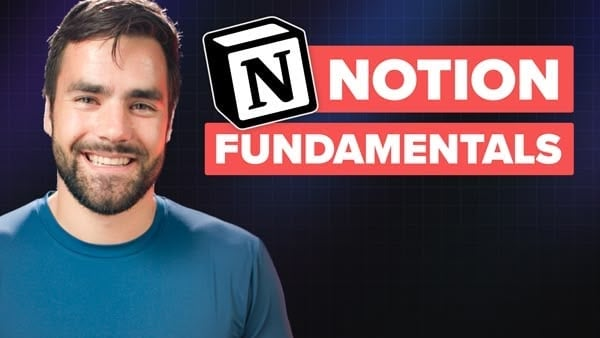 Learn Notion fast with my thorough, hands-on beginner's course.](https://thomasjfrank.com/fundamentals/) 
*   ### Notion Guides

    *   [Notion Pages](https://thomasjfrank.com/how-to-create-and-edit-notion-pages-notion-fundamentals/)
    *   [Notion Blocks](https://thomasjfrank.com/notion-blocks-guide/)
    *   [Notion Databases](https://thomasjfrank.com/notion-databases-the-ultimate-beginners-guide/)
    *   [Notion Formulas](https://thomasjfrank.com/formulas/notion-formula-reference/)
    *   [Notion Permissions](https://thomasjfrank.com/notion-sharing-permissions-the-ultimate-guide/)
    *   [Notion Automation](https://thomasjfrank.com/notion-automations/)
    *   [Notion API](https://thomasjfrank.com/notion-api-crash-course/)

*   ### Solutions

    *   [Recurring Tasks](https://thomasjfrank.com/notion-automated-recurring-tasks/)
    *   [Voice Notes to Notion](https://thomasjfrank.com/how-to-transcribe-audio-to-text-with-chatgpt-and-notion/)
    *   [Voice Tasks to Notion](https://thomasjfrank.com/notion-chatgpt-voice-tasks/)
    *    
    *   [Notion Newsletter](https://thomasjfrank.com/newsletter/)
    *   [All Notion Guides](https://thomasjfrank.com/notion/)

*   [ Ultimate Brain Run your entire life in Notion. Tasks, notes, PARA, and more.](https://thomasjfrank.com/brain/) [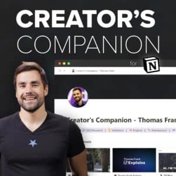 Creator's Companion The system I use to run my 3-million-subscriber YouTube channel.](https://thomasjfrank.com/creators-companion/) 
*   ### Free Templates

    *   [Task Manager](https://thomasjfrank.com/templates/task-and-project-notion-template/)
    *   [Notes Template](https://thomasjfrank.com/templates/notion-note-taking-template/)
    *   [Habit Tracker](https://thomasjfrank.com/templates/habit-tracker-notion-template/)
    *   [Expense Tracker](https://thomasjfrank.com/templates/expense-tracker-template-for-notion/)
    *    
    *   [All Free Templates](https://thomasjfrank.com/templates/)

*   ### Template Docs

    *   [Ultimate Brain](https://thomasjfrank.com/docs/ultimate-brain/)
    *   [Creator's Companion](https://thomasjfrank.com/docs/creators-companion/)
    *    
    *   [Customer Login](https://community.thomasjfrank.com/)

*   ### Mega Guides

    *   [Content Creation](https://thomasjfrank.com/creator/how-to-be-a-youtuber-the-ultimate-guide/)
    *   [Productivity](https://thomasjfrank.com/productivity/how-to-easily-organize-your-life-with-the-para-method/)

*   ### Articles by Type

    *   [Notion](https://thomasjfrank.com/articles/?category=notion)
    *   [AI & Automation](https://thomasjfrank.com/articles/?category=automation)
    *   [Productivity](https://thomasjfrank.com/articles/?category=productivity)
    *    
    *   [All Articles](https://thomasjfrank.com/articles/)

*   [About](https://thomasjfrank.com/about/)
*   Learn Notion
    *   ### NOTION FUNDAMENTALS

[ Learn Notion fast with my thorough, hands-on beginner's course.](https://thomasjfrank.com/fundamentals/) 
    *   ### Notion Guides

        *   [Notion Pages](https://thomasjfrank.com/how-to-create-and-edit-notion-pages-notion-fundamentals/)
        *   [Notion Blocks](https://thomasjfrank.com/notion-blocks-guide/)
        *   [Notion Databases](https://thomasjfrank.com/notion-databases-the-ultimate-beginners-guide/)
        *   [Notion Formulas](https://thomasjfrank.com/formulas/notion-formula-reference/)
        *   [Notion Permissions](https://thomasjfrank.com/notion-sharing-permissions-the-ultimate-guide/)
        *   [Notion Automation](https://thomasjfrank.com/notion-automations/)
        *   [Notion API](https://thomasjfrank.com/notion-api-crash-course/)

    *   ### Solutions

        *   [Recurring Tasks](https://thomasjfrank.com/notion-automated-recurring-tasks/)
        *   [Voice Notes to Notion](https://thomasjfrank.com/how-to-transcribe-audio-to-text-with-chatgpt-and-notion/)
        *   [Voice Tasks to Notion](https://thomasjfrank.com/notion-chatgpt-voice-tasks/)
        *    
        *   [Notion Newsletter](https://thomasjfrank.com/newsletter/)
        *   [All Notion Guides](https://thomasjfrank.com/notion/)

*   Notion Templates
    *   [ Ultimate Brain Run your entire life in Notion. Tasks, notes, PARA, and more.](https://thomasjfrank.com/brain/) [ Creator's Companion The system I use to run my 3-million-subscriber YouTube channel.](https://thomasjfrank.com/creators-companion/) 
    *   ### Free Templates

        *   [Task Manager](https://thomasjfrank.com/templates/task-and-project-notion-template/)
        *   [Notes Template](https://thomasjfrank.com/templates/notion-note-taking-template/)
        *   [Habit Tracker](https://thomasjfrank.com/templates/habit-tracker-notion-template/)
        *   [Expense Tracker](https://thomasjfrank.com/templates/expense-tracker-template-for-notion/)
        *    
        *   [All Free Templates](https://thomasjfrank.com/templates/)

    *   ### Template Docs

        *   [Ultimate Brain](https://thomasjfrank.com/docs/ultimate-brain/)
        *   [Creator's Companion](https://thomasjfrank.com/docs/creators-companion/)
        *    
        *   [Customer Login](https://community.thomasjfrank.com/)

*   [Courses](https://thomasjfrank.com/courses/)
*   Blog
    *   ### Mega Guides

        *   [Content Creation](https://thomasjfrank.com/creator/how-to-be-a-youtuber-the-ultimate-guide/)
        *   [Productivity](https://thomasjfrank.com/productivity/how-to-easily-organize-your-life-with-the-para-method/)

    *   ### Articles by Type

        *   [Notion](https://thomasjfrank.com/articles/?category=notion)
        *   [AI & Automation](https://thomasjfrank.com/articles/?category=automation)
        *   [Productivity](https://thomasjfrank.com/articles/?category=productivity)
        *    
        *   [All Articles](https://thomasjfrank.com/articles/)

*    

Search

Search

System Light Dark

Creator Atlas Thumbnail Design

On This Page Close mobile table of contents menu

*   [When to Design Your Thumbnail](https://thomasjfrank.com/creator/youtube-thumbnail-design-the-ultimate-guide/#when-to-design-your-thumbnail)
*   [How to Get Clicks on Your Videos: The AIDA Principle](https://thomasjfrank.com/creator/youtube-thumbnail-design-the-ultimate-guide/#how-to-get-clicks-on-your-videos-the-aida-principle)
    *   [Attention](https://thomasjfrank.com/creator/youtube-thumbnail-design-the-ultimate-guide/#attention)
    *   [Interest](https://thomasjfrank.com/creator/youtube-thumbnail-design-the-ultimate-guide/#interest)
    *   [Desire](https://thomasjfrank.com/creator/youtube-thumbnail-design-the-ultimate-guide/#desire)
    *   [Action](https://thomasjfrank.com/creator/youtube-thumbnail-design-the-ultimate-guide/#action)

*   [How to Speed Up Your Thumbnail Process](https://thomasjfrank.com/creator/youtube-thumbnail-design-the-ultimate-guide/#how-to-speed-up-your-thumbnail-process)
    *   [Shooting Thumbnail Poses](https://thomasjfrank.com/creator/youtube-thumbnail-design-the-ultimate-guide/#shooting-thumbnail-poses)
    *   [Building a Thumbnail](https://thomasjfrank.com/creator/youtube-thumbnail-design-the-ultimate-guide/#building-a-thumbnail)

*   [Watch Me Design a Thumbnail](https://thomasjfrank.com/creator/youtube-thumbnail-design-the-ultimate-guide/#watch-me-design-a-thumbnail)
*   [Thumbnail Design Tricks](https://thomasjfrank.com/creator/youtube-thumbnail-design-the-ultimate-guide/#thumbnail-design-tricks)
*   [More Thumbnail Design Tips](https://thomasjfrank.com/creator/youtube-thumbnail-design-the-ultimate-guide/#more-thumbnail-design-tips)
*   [The Best Thumbnail Design Tool](https://thomasjfrank.com/creator/youtube-thumbnail-design-the-ultimate-guide/#the-best-thumbnail-design-tool)
*   [Thumbnail Inspiration Gallery](https://thomasjfrank.com/creator/youtube-thumbnail-design-the-ultimate-guide/#thumbnail-inspiration-gallery)

[» Back to Top](https://thomasjfrank.com/creator/youtube-thumbnail-design-the-ultimate-guide/#)

Creator Atlas Close mobile documentation menu

*   Getting Started
    *   [How to Be a YouTuber: The Ultimate Guide](https://thomasjfrank.com/creator/how-to-be-a-youtuber-the-ultimate-guide/)
    *   [Read This if You’re a Perfectionist](https://thomasjfrank.com/creator/the-1-rule-read-this-if-youre-a-perfectionist/)
    *   [The Video Gear List](https://thomasjfrank.com/creator/the-video-gear-list/)
    *   [Apps, Tools, and Digital Resources](https://thomasjfrank.com/creator/apps-tools-and-digital-resources/)

*   Video Development
    *   [Writing a Script](https://thomasjfrank.com/creator/writing-a-script/)

*   Filming
    *   [Camera Confidence](https://thomasjfrank.com/creator/camera-confidence/)
    *   [Audio Quality](https://thomasjfrank.com/creator/improving-your-audio-quality/)
    *   [Teleprompter Tips](https://thomasjfrank.com/creator/working-with-a-teleprompter/)

*   Marketing
    *   [Video Packaging](https://thomasjfrank.com/creator/video-packaging-how-not-to-waste-80-hours-of-effort/)
    *   [The YouTube Algorithm](https://thomasjfrank.com/creator/mastering-the-youtube-algorithm/)
    *   [Thumbnail Design](https://thomasjfrank.com/creator/youtube-thumbnail-design-the-ultimate-guide/)

*   Scaling Your Business
    *   [Hiring an Editor](https://thomasjfrank.com/creator/hiring-an-editor/)

*   Building a Website
    *   [Website Speed](https://thomasjfrank.com/creator/the-ultimate-guide-to-website-speed/)
    *   [Minimizing Site Downtime](https://thomasjfrank.com/creator/how-to-minimize-website-downtime/)

*   Tech
    *   [NAS (Network-Attached Storage) Options for Creators](https://thomasjfrank.com/creator/nas-network-attached-storage-options-for-creators/)

*   Recommended Tools
    *   [Business 101 for Creators](https://thomasjfrank.com/creator/business-101-for-creators/)
    *   [Creator’s Companion](https://thomasjfrank.com/creators-companion/)

*   My Collections
    *   [Studio/Film Set Gallery](https://thomasfrank.notion.site/Studio-Film-Set-Gallery-41a6898515fc4d59ab7d9ddcb5d6ff3f)
    *   [Thumbnail Gallery](https://thomasfrank.notion.site/1cac7b8eb82e42948c633bd2b8432535?v=95f84cae26a84a1ab7b3dcb73495373a&pvs=4)
    *   [More Learning Resources](https://thomasfrank.notion.site/More-Learning-Resources-ab79331e7d084d93b83c3dfafaba1663)

YouTube Thumbnail Design – The Ultimate Guide
=============================================

This article may contain affiliate links.This article may contain affiliate links.

Copy Show copy options

Copy as Markdown Copy article as Markdown View as Markdown Open Markdown in new tab[Ask ChatGPT Send this page to ChatGPT](https://thomasjfrank.com/creator/youtube-thumbnail-design-the-ultimate-guide/#)[Ask Claude Send this page to Claude](https://thomasjfrank.com/creator/youtube-thumbnail-design-the-ultimate-guide/#)

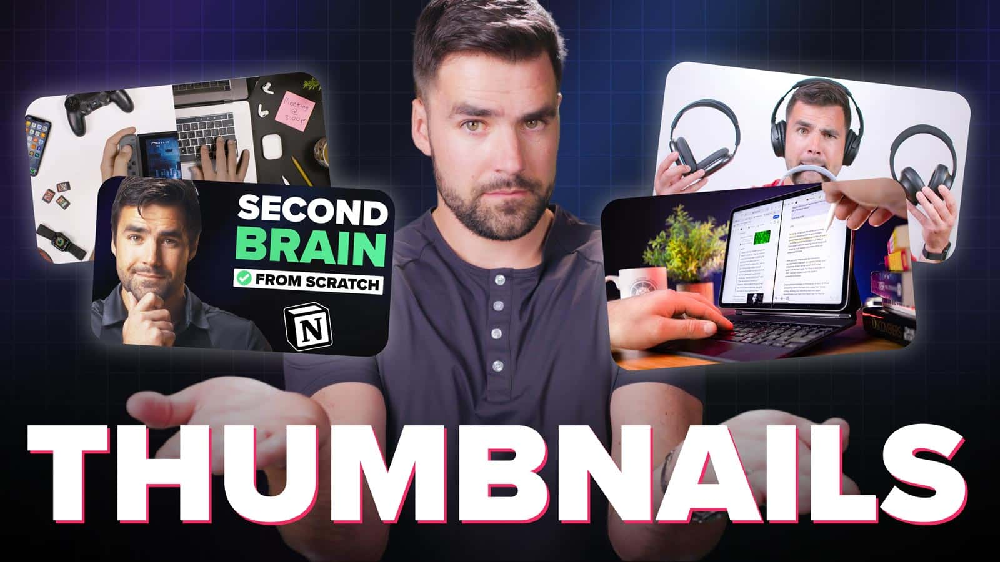

Your thumbnail’s #1 job, which it shares with your title, is to put a **burning question in the mind of your viewer.**

Not just a question, but a **burning** question. A question that _**must**_ be answered.

This is what will cause a person to click.

I used to spend time staring at my thumbnails, convincing myself that specific elements of that thumbnail were important. I’ve since learned: If you have to convince yourself that a part of your thumbnail is compelling, other people **will not care.**

A thumbnail’s imagery should hit you like a ton of bricks **immediately.** Your audience is scrolling through dozens of thumbnails at a time on the home page.

Your thumbnail must catch their eye and create a **burning question** in a split-second.

[Copy link to heading](https://thomasjfrank.com/creator/youtube-thumbnail-design-the-ultimate-guide/#when-to-design-your-thumbnail)
When to Design Your Thumbnail
-----------------------------

Make your thumbnail _before_ you shoot your video. The same applies to your title.

Why?

Creating a thumbnail is **hard work.**It forces you to sit down and really think about how to best position your video in a way that will **serve your audience best.**

Thumbnail design isn’t just about Photoshop skills or graphic design. In fact, this is why it’s so hard for creators to hire good thumbnail designers – thumbnail design is **80% marketing psychology, and only 20% design skill.**

The real work of designing a thumbnail is in answering this question:

> What design will _immediately_ communicate what my video is about, get my audience interested, and make them want to click?

If you do the work of answering this question before you shoot your video, it will actually help you make a better video. You’ll be more clear on:

*   Who you’re trying to reach
*   What level of expertise they have around your video’s topic
*   How to write your hook, structure your script, etc

**Designing your thumbnail and brainstorming titles are alignment exercises.**They force you to understand exactly what you’re trying to make and who it’s trying to serve.

Most creators get this backwards. They invest dozens of hours into writing, shooting, and editing –only to realize that the video they’ve made locks them into a certain kind of thumbnail.

I can’t tell you how many times I’ve done feedback sessions with other creators where this becomes a problem. We’ll hit upon a thumbnail or title idea that **ROCKS,**but then the creator will say,

> “Yeah… but I already shot the video, and it doesn’t cover that very well…”

Seriously, make your thumbnail and title first. You can always make more versions later, after you’ve finished the video. But try to make at least one **great**thumbnail before you even start scripting.

If you’re the sketching type, we recently released a thumbnail design notebook in the Nebula merch shop:

[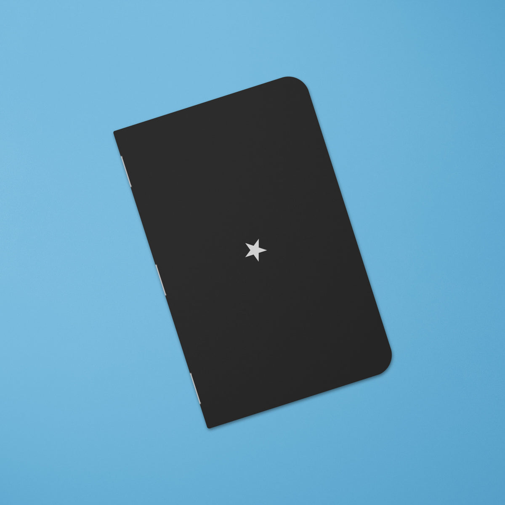 Nebula Thumbnail Notebook – Nebula Merch Store Make a good first impression. The first thing your potential audience sees is your thumbnail and title. We call that “packaging.” If you want to catch eyes, you should treat your packaging like part of pre-production. Jot down ideas. Iterate. Tell a great story about the great story you’re about to tell. Our handy Nebu store.nebula.tv](https://store.nebula.tv/products/nebula-thumbnail-notebook)[Copy link to heading](https://thomasjfrank.com/creator/youtube-thumbnail-design-the-ultimate-guide/#how-to-get-clicks-on-your-videos-the-aida-principle)
How to Get Clicks on Your Videos: The AIDA Principle
----------------------------------------------------

People are persuaded to make decisions in a **very specific order.** That order can be described with the acrynym **AIDA:**

*   **Attention:**Can you get (and hold) their attention? How well does your offering do this in the context of the competitive environment?
*   **Interest:**Once you have their attention, can you get them interested? To do so, you must **connect to something they already care about.**A pain point, a goal, an existing interest. You must also create a **curiosity gap.** If they already know everything, they won’t care.
*   **Desire:**After interest is established, can you make them **desire** what you’re offering? Again, your offer must **connect**to something they _already care about._
*   **Action:**If desire is strong enough, you’re likely to inspire them to take action. However, there may be **roadblocks,**so you’ll have to clear them.

AIDA applies 100% to your videos, and your thumbnails play a **crucial**role in guiding people through it. Let’s break it down:

[Copy link to heading](https://thomasjfrank.com/creator/youtube-thumbnail-design-the-ultimate-guide/#attention)
### Attention

Attention: **This is your thumbnail’s first job.**The title usually doesn’t grab attention. Why? Let’s look at a screenshot of the YouTube homepage:

[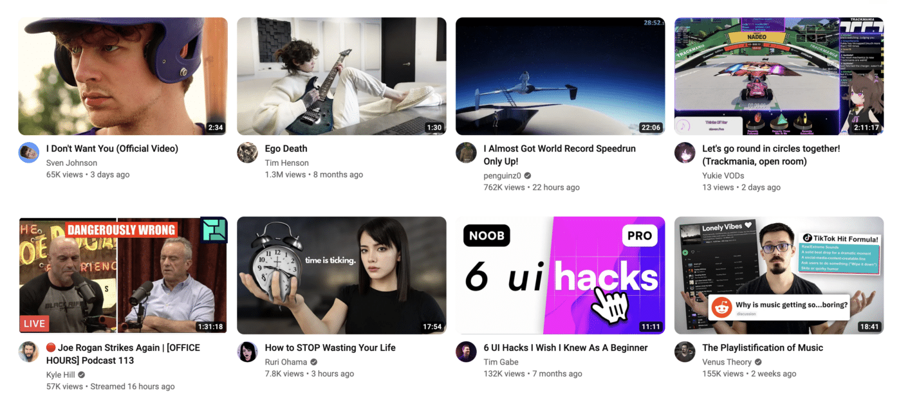](https://thomasjfrank.com/wp-content/uploads/2023/06/CleanShot-2023-06-28-at-10.25.21@2x.png)

What grabs your attention first? Personally, my attention is first drawn to the baseball player in the first thumbnail. There are few reasons for that:

*   Humans are naturally drawn to other human faces
*   The thumbnail is placed top-left, and western audiences read (and scan image) left-to-right, top-to-bottom
*   The player’s expression is interesting

After that, my eyes tend to scan over all the other thumbnails.

**Only once a thumbnail has caught my attention do I read the title.** Your thumbnail **must**grab the viewer’s attention, and it has to do a better job at that than the other thumbnails.

You meet your viewer in the middle here; part of what will get their attention are their own interests, which you can’t control. A viewer’s interests are also constantly shifting:

*   What are they currently interested in? Are they in a phase? (I’m currently in a 3D animation phase. Last week I was obsessed with Magic: The Gathering.)
*   What time of day is it?
*   What device are they using?
*   Where are they?

Your viewer might be in bed at 10pm, watching YouTube on their TV. Or they might be sitting on the toilet, watching YouTube on their phone. Interests will differ in these very different contexts.

But you can do a lot to grab attention as well:

*   Don’t make your thumbnail too busy
*   Make sure your thumbnail stands out vs. other thumbnails
*   Use exciting colors
*   Make the important elements very prominent (e.g. a face or an important prop)
*   If you’re using text, make it BIG and don’t use too many words

[Copy link to heading](https://thomasjfrank.com/creator/youtube-thumbnail-design-the-ultimate-guide/#interest)
### Interest

Once you have a viewer’s attention, you need to garner **interest.**After all, attention is fleeting.

I can get your attention right now:

**SEX!**

But if I have nowhere to direct your attention, then I’ve accomplished nothing.

_(Side note: This is a **huge**reason why YouTube’s algorithm prioritizes a metric they call **satisfied watchtime** over everything else. If they only prioritized clickthrough rates, all the top creators would just be putting cleavage in their thumbnails. I’m old enough to remember when it actually was like that.)_

This is why you have to create a strong pathway that goes from **Attention**to **Interest.**

How do you create interest? Here’s the formula:

*   Connect your topic to something your audience **already cares about**
*   Create a **curiosity gap**

Which of these thumbnails would you click on?

[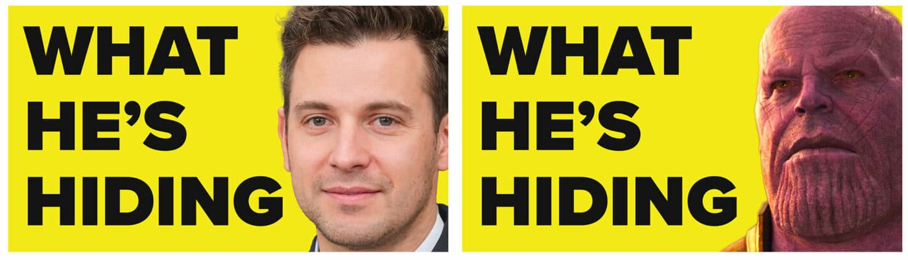](https://thomasjfrank.com/wp-content/uploads/2023/06/interest-comparison.jpg)

These two thumbnails are almost exactly the same; the only difference is the face. One is of a [non-existant person](https://thispersondoesnotexist.com/), while the other is a character that perhaps billions of people are very familiar with.

If you’ve seen _Avengers: Infinity War_, then the picture of Thanos no doubt already connects to many other things in your mind – stories, emotions, etc.

This means that you’ll naturally be more interested in the Thanos thumbnail. And to build interest further, the text creates that all-important **curiosity gap:**“This character has a secret that you don’t know about.”

I’ll also note that **this is where your title comes in.**

If your thumbnails works alone to grab attention, your **thumbnail + title combo** is what builds interest.

Take [this video of mine](https://www.youtube.com/watch?v=Xi6MLjPc-hw), for example:

[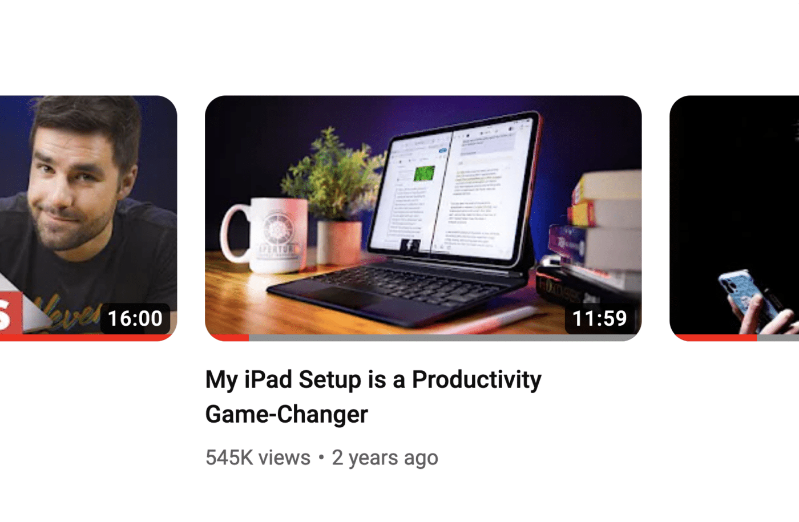](https://thomasjfrank.com/wp-content/uploads/2023/06/CleanShot-2023-06-28-at-10.55.17@2x.png)

The thumbnail is well shot. The colors pop. Anyone interested in iPads or Apple products will likely take notice. But there’s no real curiosity gap in the thumbnail itself.

Add the title in, however, and you get that all-important gap.

[Copy link to heading](https://thomasjfrank.com/creator/youtube-thumbnail-design-the-ultimate-guide/#desire)
### Desire

When it comes to earning a click, it all comes down to the **burning question.**Your thumbnail + title create interest by putting a **question** in the mind of the viewer.

I’m going to bold this whole sentence: **Your viewer’s desire to click is directly related to how badly they want to get that question answered.**

Some topics are just so interesting that they stoke desire themselves. Michelle’s [most popular video](https://www.youtube.com/watch?v=Zak_e_QB4OU) is a perfect example:

[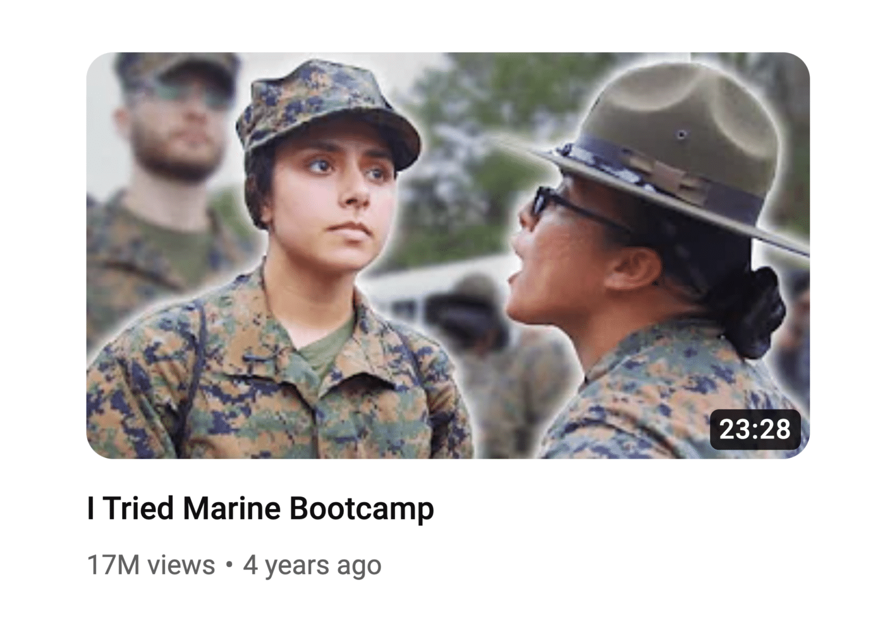](https://thomasjfrank.com/wp-content/uploads/2023/06/CleanShot-2023-06-28-at-11.17.05@2x.png)

In this case, I’d say the work of desire-building was done in the topic-choice stage.

“What’s it really like at Marine boot camp?” is a question many people are very curious about – but very few of them would be willing to go through it themselves to find out. Michelle takes one for the team by stepping up and giving us the inside look.

Other topics are not as inherently interesting right off the bat. You have to sell them a bit to a general audience.

This is where a little dose of **“clickbait”** comes in. You can spot it here in [one of my most popular videos](https://www.youtube.com/watch?v=eVajQPuRmk8):

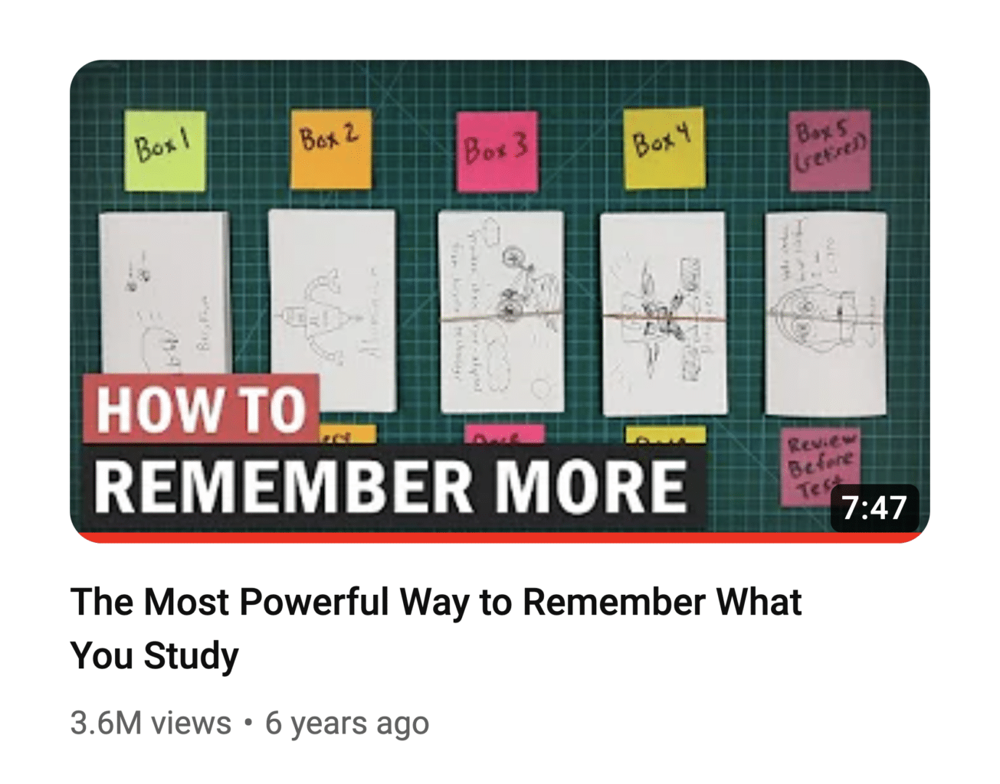
This video is about [spaced repetition](https://collegeinfogeek.com/spaced-repetition-memory-technique/). But very few people know what “spaced repetition” even means, and it’s not a term that connects well to anything the average viewer cares about.

“The Most Powerful Way to Remember What You Study” does a _far_ better job at that. By using a powerful term in the title, the entire thumbnail + title combo builds more desire to click in the mind of the viewer.

I put “clickbait” in quotes earlier because this is a tactic that many people would _call_ clickbait… but it’s not clickbait if the video **delivers on the promise.**

I’ll let you be the judge on how successful I was at that with this particular video, but the main idea I’d like to impart to you here is this: **Don’t be afraid to use powerful, desire-stoking words and images.**

If you go too far, maybe you get called out by a couple of people in the comments. Big deal; pull it back a bit if that happens.

**If you don’t go far enough, no one clicks.** You get fewer views and _less feedback you can learn from._

[Copy link to heading](https://thomasjfrank.com/creator/youtube-thumbnail-design-the-ultimate-guide/#action)
### Action

When it comes to clicking on a video, this one’s pretty simple. If the viewer wants their burning question answered, they’re going to click.

From that point, you start AIDA all over again – your video’s hook must grab their attention and keep them watching, you have to build interest and desire to keep watching, yada yada yada. We’ll cover all of that in another article.

I’ll mention that in other areas (like sales), the Action step might be a lot more involved.

Maybe I do a great job at stoking desire for you to buy my [Ultimate Brain template for Notion](https://thomasjfrank.com/brain/) (which gives you a complete productivity system all in one place, so you don’t have to juggle productivity apps anymore – see what I’m doing here?)…

…but the action I want you to take is way more significant than clicking a YouTube thumbnail. Every action has a cost; clicking a video has a miniscule cost, but buying my template has a significant cost (well over $100).

To move you from Desire to Action, I have to:

1.   Convince you that the cost is worth it
2.   Get rid of road blocks

Some ways I might do that:

1.   Include testimonials, from both authority figures and people who are like you (this increases trust and decreases uncertainty)
2.   Offer a discount (the original price acts as an [anchor](https://en.wikipedia.org/wiki/Anchoring_(cognitive_bias)), so the discounted price seems like a great deal)
3.   Include a refund guarantee (makes the purchase seem way less risky)
4.   Make it clear that we offer tutorials and support (inspires confidence that you’ll be able to use the product without getting stuck)

We’ll cover these points in far more detail in future parts of this guide.

[Copy link to heading](https://thomasjfrank.com/creator/youtube-thumbnail-design-the-ultimate-guide/#how-to-speed-up-your-thumbnail-process)
How to Speed Up Your Thumbnail Process
--------------------------------------

One thing I never mentioned in all the thumbnail advice above: **Your thumbnail does not have to be a totally unique piece of art!**

It can be if you want it to be, but it doesn’t have to be. In fact, creating a **consistent** look across all your channel’s thumbnails can help to build familiarity with your audience, and makes it easier for returning viewers to spot your newest videos on their home page.

For that reason, I’ve developed several **templating**techniques for my [Thomas Frank Explains](https://www.youtube.com/@ThomasFrankExplains/videos) channel:

[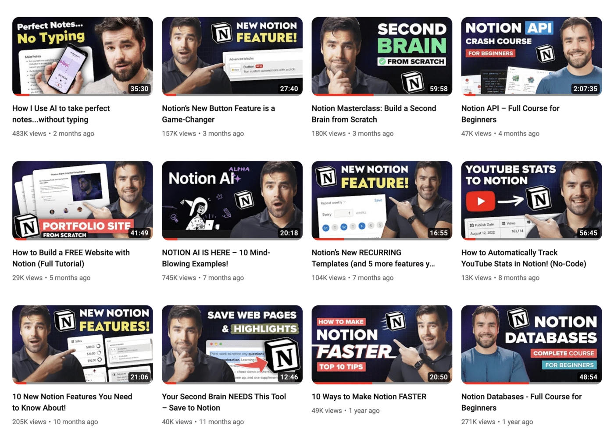](https://thomasjfrank.com/wp-content/uploads/2023/06/CleanShot-2023-06-28-at-11.31.20@2x.png)

And I’m far from the only one. Here’s a look at [MrBeast Gaming](https://www.youtube.com/@MrBeastGaming/videos):

[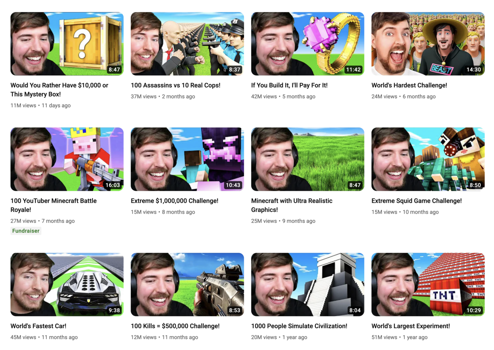](https://thomasjfrank.com/wp-content/uploads/2023/06/CleanShot-2023-06-28-at-11.33.36@2x.png)

By using a **templating strategy**, you can build a consistent look for your channel and massively speed up your thumbnail creation process – without sacrificing the elements that build curiosity and get people to click.

In this section, I’ll share my exact templating process.

[Copy link to heading](https://thomasjfrank.com/creator/youtube-thumbnail-design-the-ultimate-guide/#shooting-thumbnail-poses)
### Shooting Thumbnail Poses

First, let’s talk about thumbnail poses. I’m an on-camera creator, so I use my face as a primary element in my thumbnails.

Remember, humans are [naturally drawn to other human faces](https://info.keylimeinteractive.com/eye-tracking-shows-the-power-of-the-face). And I’ll be blunt here –they’re even more attracted to _attractive_ faces. So go get a nice haircut, and don’t shy away from a little bit of makeup even if you’re a guy.

I used to shoot thumbnail poses after every video, but that was inefficient. Often, our shooting location didn’t lend itself to a good thumbnail.

Here’s how I do it now: Every few months, I’ll stand in front of my green screen, turn on my camera, and make tons of thumbnail faces.

Here are a few photos of my green screen setup. I’ll write an article on building a great green screen setup soon. The main keys are:

*   Even lighting on the green screen
*   Subject distance from the green screen (the further, the better – reduces green light spill)
*   Flat green screen (wrinkles/marks are bad. This is why I use paper instead of fabric)

[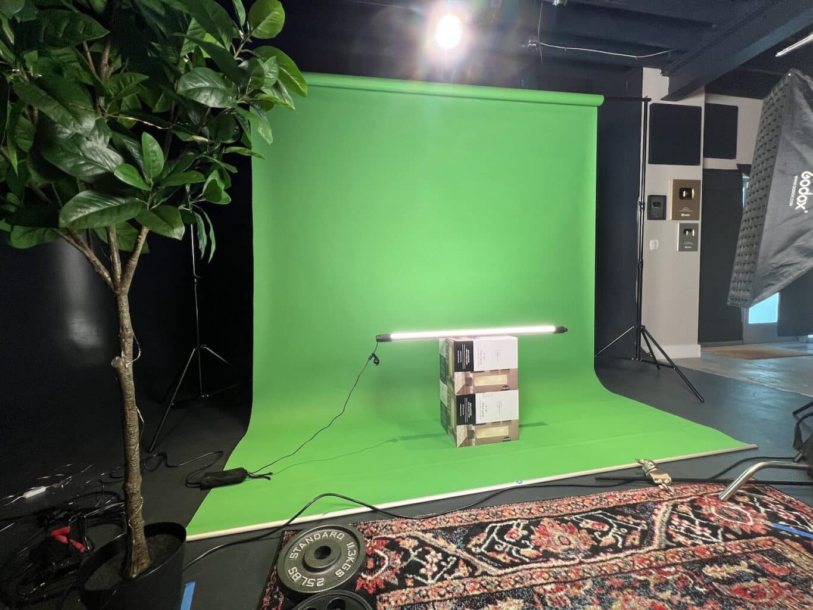](https://thomasjfrank.com/wp-content/uploads/2023/06/IMG_4394.jpg)[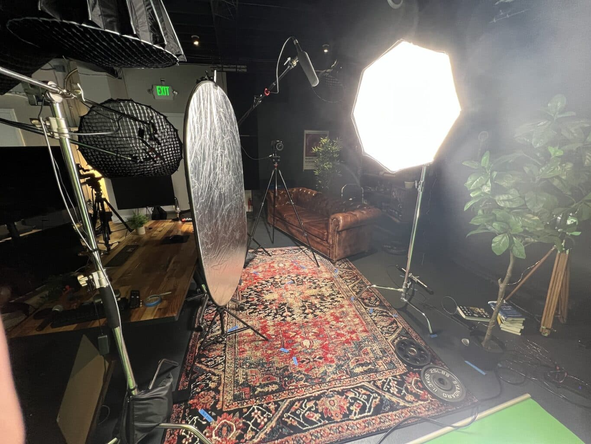](https://thomasjfrank.com/wp-content/uploads/2023/06/IMG_4395.jpg)[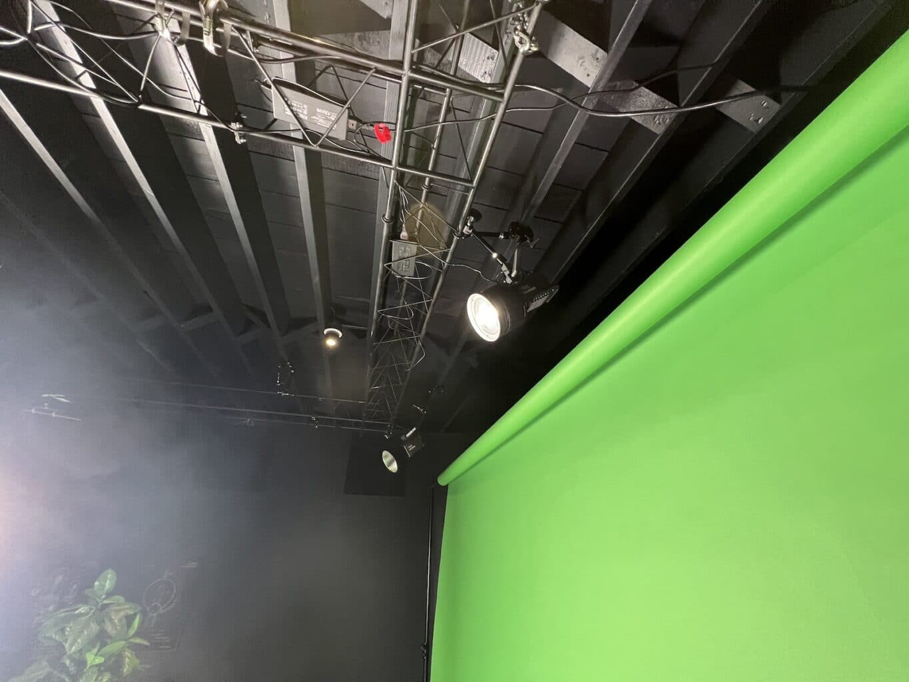](https://thomasjfrank.com/wp-content/uploads/2023/06/IMG_4396.jpg)[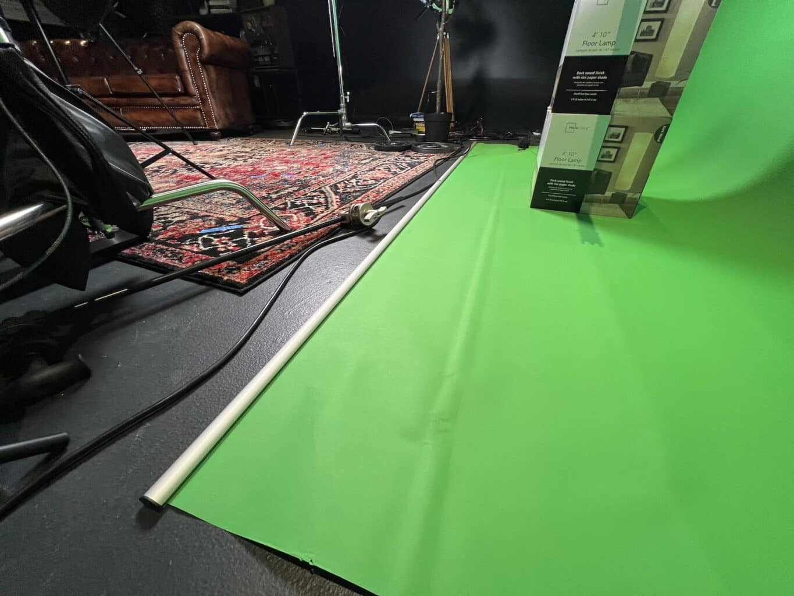](https://thomasjfrank.com/wp-content/uploads/2023/06/IMG_4397.jpg)
If you’re in a smaller space, I’d recommend the Elgato pop-up green screen instead of getting paper:

[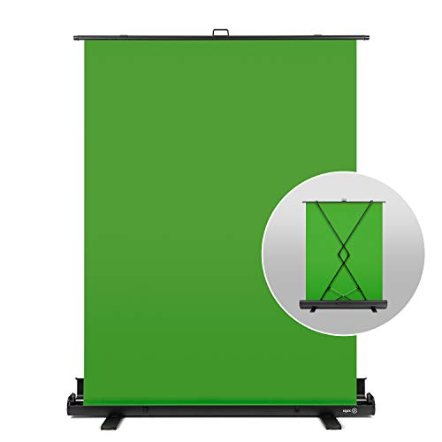](https://www.amazon.com/Elgato-Green-Screen-auto-locking-wrinkle-resistant/dp/B0743Z892W?tag=colinfgee-20&ref_=as_li_ss_tl "Elgato Green Screen - Collapsible Chroma Key Backdrop")

[Elgato Green Screen - Collapsible Chroma Key Backdrop](https://www.amazon.com/Elgato-Green-Screen-auto-locking-wrinkle-resistant/dp/B0743Z892W?tag=colinfgee-20&ref_=as_li_ss_tl "Elgato Green Screen - Collapsible Chroma Key Backdrop")

If you're in a small space, this is probably the best green screen you can buy. Collapses and stores easily, and the fabric is never wrinkled.

[Buy Now](https://www.amazon.com/Elgato-Green-Screen-auto-locking-wrinkle-resistant/dp/B0743Z892W?tag=colinfgee-20&ref_=as_li_ss_tl "Elgato Green Screen - Collapsible Chroma Key Backdrop")

**I’m not taking photos.**Instead, I’m filming myself –and later on, I’ll go through and find the best frames for thumbnail poses. This makes it much easier to capture natural, great-looking poses – especially if you’re not used to posing for photoshoots. Cracking a natural smile on command is tough!

**Camera settings are crucial here.**You want crisp, high-resolution frames without motion blur. To get these, I use my Canon R5 with the following settings:

*   4K resolution
*   60 FPS (this is the **most important**setting)
*   ALL-I (instead of IPB)
*   LOG color

60 FPS is what matters most. 24 or 30 FPS video doesn’t look blurry when you’re playing it, but individual frames will often look blurry.

**Here are a few tricks I use to get great poses:**

*   Film for a long time. I’ve learned that the first 5 minutes are basically a warm-up. It feels awkward and embarassing to do this, so you have to let yourself get into it.
*   Be silly. Seriously! All my best smiling poses happen when I make myself laugh by saying “farts” or something similar. Yes, I have the humor sense of a third-grader. So do you; don’t deny it.
*   Get creative. Go beyond facial expressions and just do anything that comes to mind.

Here’s a list of pose ideas you can start with. For each of these, try variations – looking directly at the camera, off to each side, with fingers held up, etc:

*   Smiling
*   Surprised face (the “Mr. Beast” face)
*   Frowning
*   “Rant” face
*   Serious face
*   Confident smirk
*   Eyebrow raised (can you smell what The Rock is cookin’?)
*   Disappointed
*   Disgusted
*   Scared
*   Embarrased
*   Jump-scared
*   Quizzical
*   Confused
*   Holding up an imaginary product
*   Holding up a number of fingers
*   “Talk to the hand”
*   Shrugging shoulders
*   Face-palm

These are just some initial ideas. Try out anything you can think of; you can always ignore anything you don’t like when you’re selecting your posts later.

Once I’m done shooting poses, I bring the footage into Premiere Pro and start looking through it. When I find a frame I like, I add a **marker** on the timeline:

[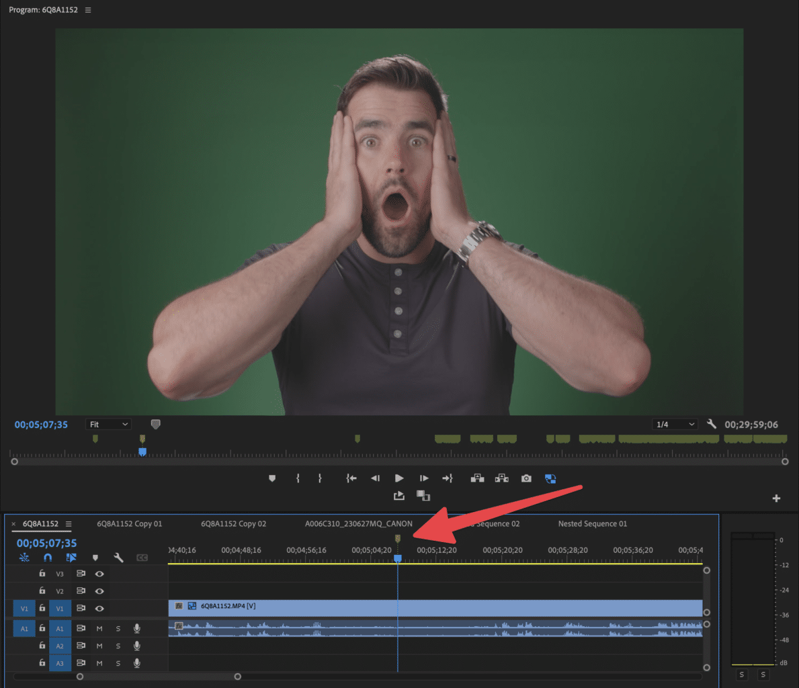](https://thomasjfrank.com/wp-content/uploads/2023/06/CleanShot-2023-06-28-at-12.02.57@2x.png)

I’ll go through the whole file, adding markers to all the poses I like. When I’m done, I use a very handy Premiere Pro plugin called **Still Exporter**, which automatically exports all the marked frames as PNG files.

[ Still Exporter – aescripts + aeplugins – aescripts.com Super-fast exporter of still images from your Premiere Pro timeline – exports frames at markers as jpg, png, tiff or dpx images. aescripts.com](https://aescripts.com/still-exporter/)
This $30 plugin is worth its weight in gold, as it used to take me **forever**to export stills one-by-one. Premiere doesn’t have a built-in bulk still exporter.

**Note:**Still Exporter tends to get stuck if after the first 200 markers, and Premiere doesn’t have a tool for selecting multiple markers at once. You can either delete one marker or all of them. For this reason, you shouldn’t add more than 200 markers at once.

After the export is done, I drag all the poses into Lightroom:

[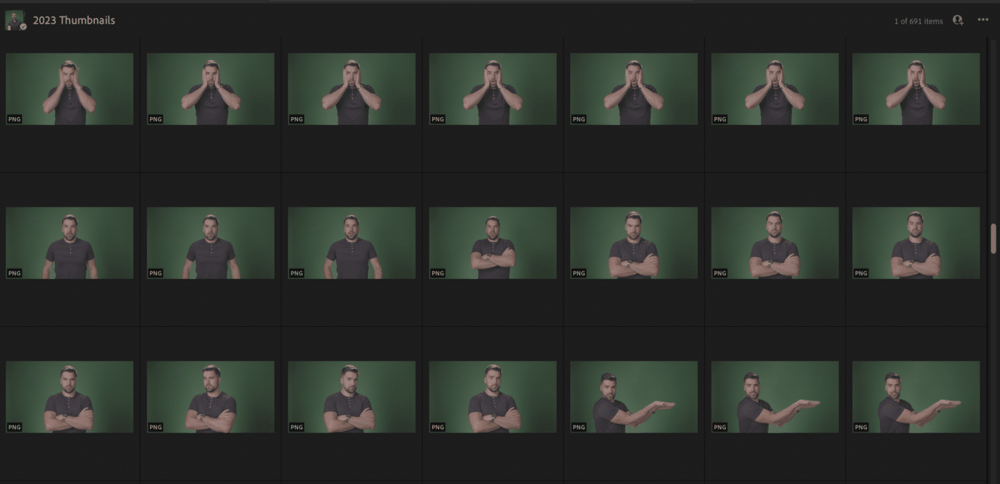](https://thomasjfrank.com/wp-content/uploads/2023/06/CleanShot-2023-06-28-at-12.07.53@2x.png)

This allows me to very quickly browse through my poses. I can also **Flag** the good ones, which lets me created a filtered view of them.

Since I shoot my footage in LOG, I do a quick color grade on one of the poses in Lightroom:

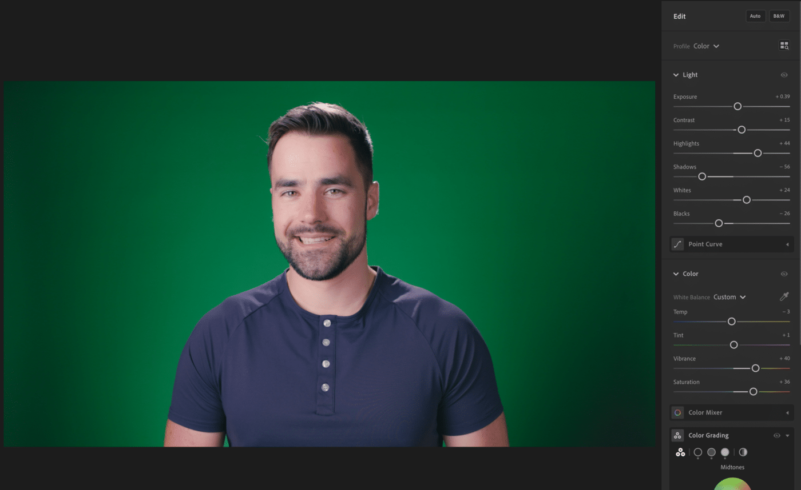
From there, I copy the Edit Settings from that pose:

[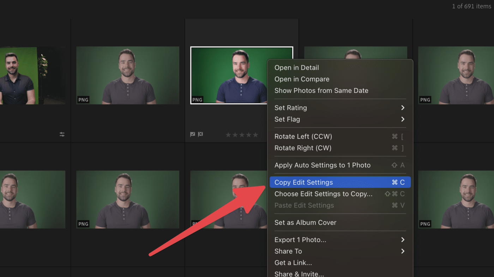](https://thomasjfrank.com/wp-content/uploads/2023/06/CleanShot-2023-06-28-at-12.09.35@2x.png)

Then I select all the other ones (at least the ones with the same lighting and distance from the camera) and choose **Paste Edit Settings:**

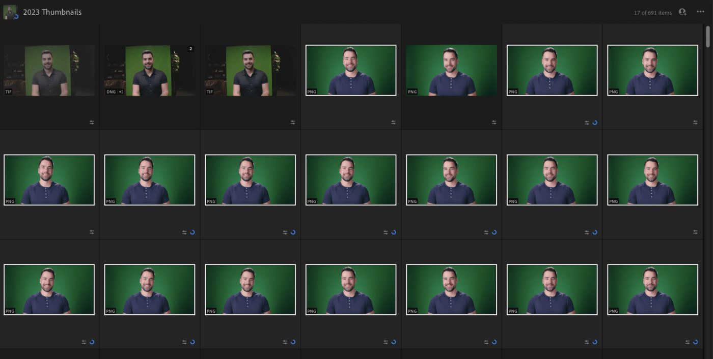
This lets me apply quick grade to all the poses at once! I’ll still likely do additional grading when I’m making an individual thumbnail, but this gets the color grading 80% of the way there in one fell swoop.

Now I have hundreds of poses I can choose from when it’s time to make a thumbnail.

[Copy link to heading](https://thomasjfrank.com/creator/youtube-thumbnail-design-the-ultimate-guide/#building-a-thumbnail)
### Building a Thumbnail

When it comes time to build a thumbnail, I start from a **template**that I’ve built for my channel.

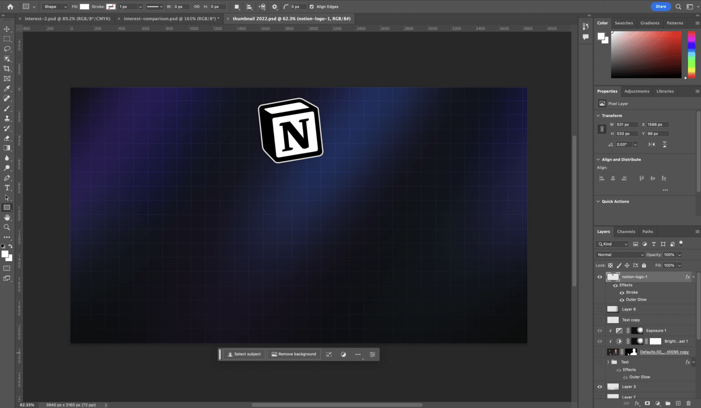
All of my videos use the same thumbnail background, and nearly all of them feature the Notion logo. So I’ve created a template PSD document that contains both.

I open that document, choose **Save As…** and save it to a new directory for the video I’m working on:

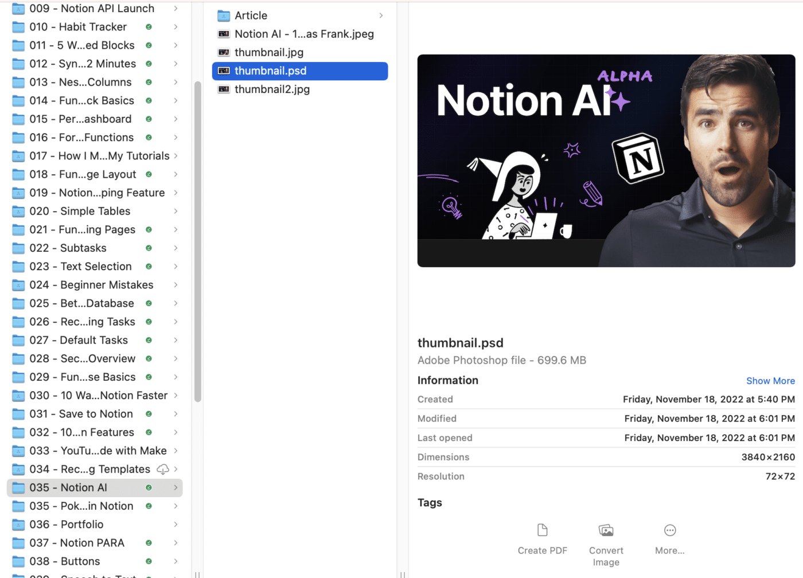
From Lightroom, I’ll choose a pose I like and choose **Export.**I export at the highest quality possible (typically a TIF file), then drag it into my Photoshop document:

[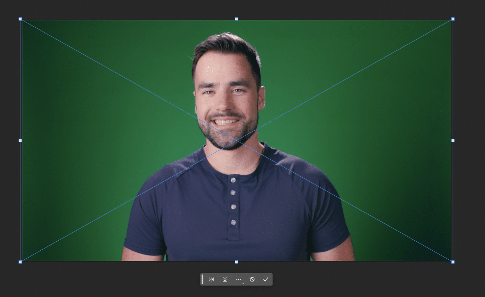](https://thomasjfrank.com/wp-content/uploads/2023/06/CleanShot-2023-06-28-at-12.18.25@2x.png)

I choose the Marquee Tool, then hit Select and Mask:

[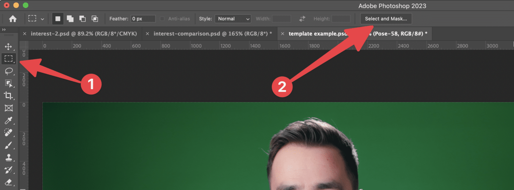](https://thomasjfrank.com/wp-content/uploads/2023/06/CleanShot-2023-06-28-at-12.19.32@2x.png)

Then Select Subject:

[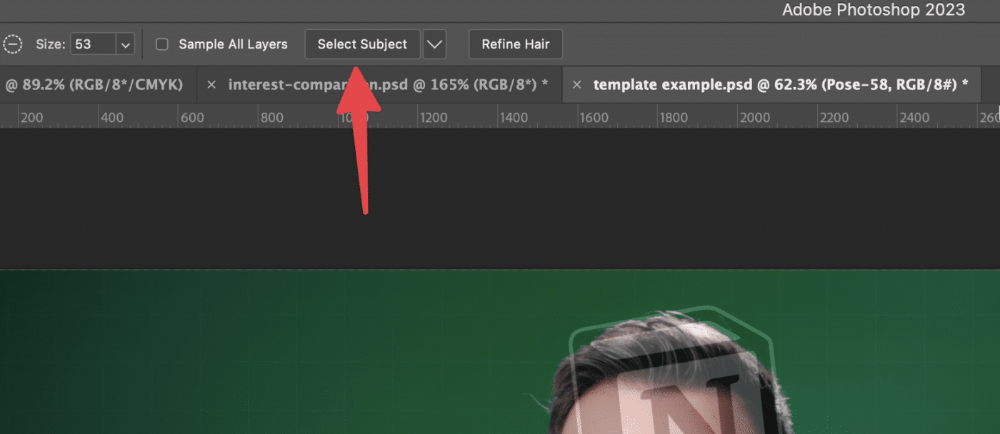](https://thomasjfrank.com/wp-content/uploads/2023/06/CleanShot-2023-06-28-at-12.20.22@2x.png)

Photoshop typically does a pretty good job at selecting the subject, particularly if the background is a flat color and there’s not a lot of color spill on the subject.

Still, you may need to mess with the settings and do some masking. Check out the video in the next section to see me do that.

Once I’m done masking, I choose **New Layer with Layer Mask.**

After that, I’ll go through my design process until I land on a finished thumbnail:

[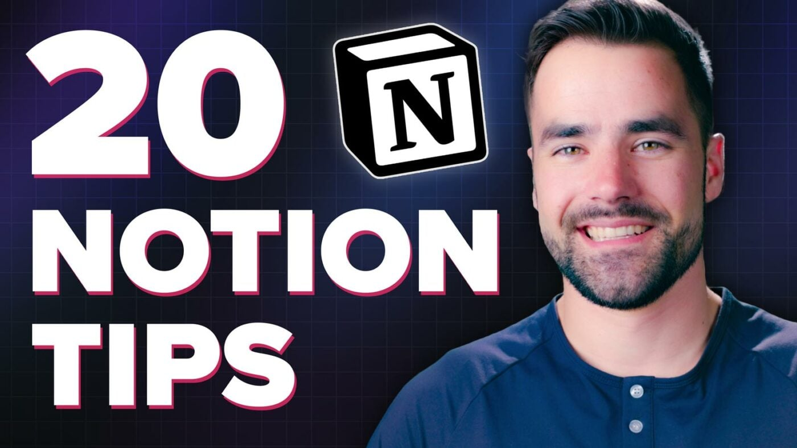](https://thomasjfrank.com/wp-content/uploads/2023/06/template-example-small.jpg)

Remember, your thumbnail first job is to **grab attention!**

When it comes to building interest, that’s the job of your **thumbnail + title combo.** Think about how your thumbnail will look next to your title, and test variations of each on ThumbsUp:

[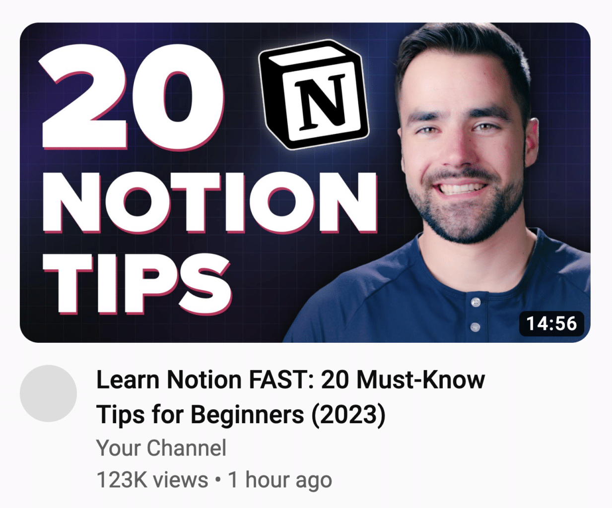](https://thomasjfrank.com/wp-content/uploads/2023/06/CleanShot-2023-06-28-at-12.49.47@2x.png)

[Copy link to heading](https://thomasjfrank.com/creator/youtube-thumbnail-design-the-ultimate-guide/#watch-me-design-a-thumbnail)
Watch Me Design a Thumbnail
---------------------------

In this video, you can watch me design a thumbnail from scratch. We originally shot this video for a paid course on content creation that we were going to make, but I decided to post it here for free instead.

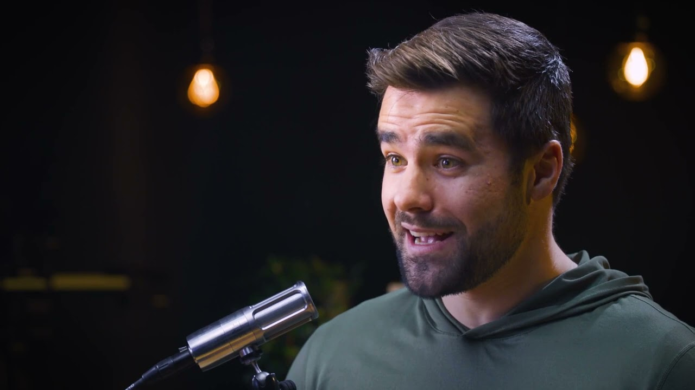

[Copy link to heading](https://thomasjfrank.com/creator/youtube-thumbnail-design-the-ultimate-guide/#thumbnail-design-tricks)
Thumbnail Design Tricks
-----------------------

In this section, I’ll point out some of the more subtle thumbnail tricks I’ve learned over the years.

**Trick 1: Gradients Under Text**

[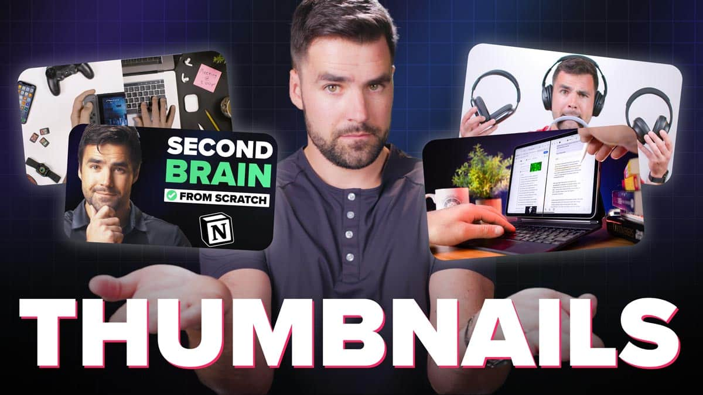](https://thomasjfrank.com/wp-content/uploads/2023/06/With-Gradient.jpg)[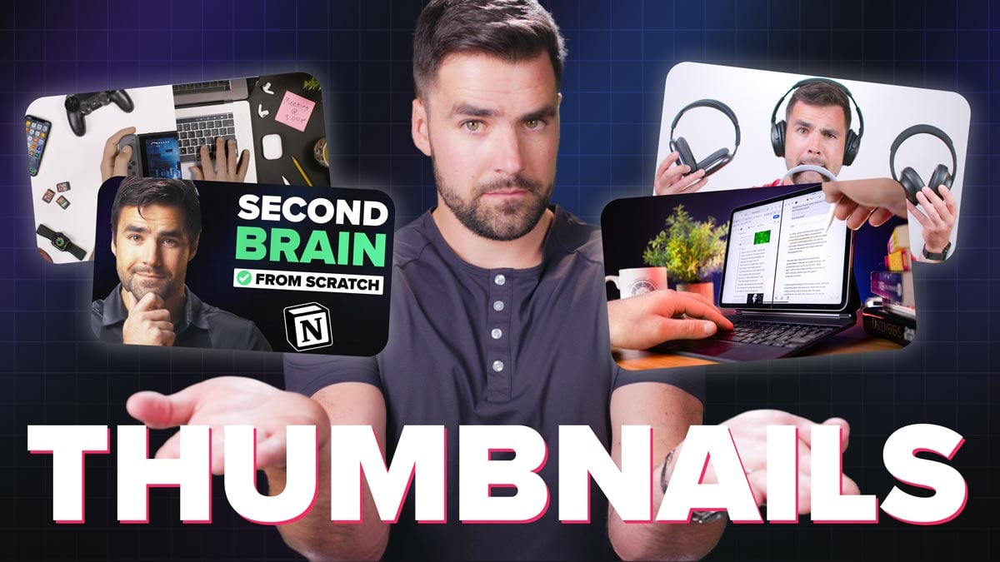](https://thomasjfrank.com/wp-content/uploads/2023/06/Without-Gradient.jpg)
If you need to put text over a visual element, try putting a **black-to-transparent gradient**over the element first.

Check out the comparison; you can see how the version without the gradient is much harder to read.

You can also use a soft drop shadow (and sometimes I combine that with a gradient), but I find that a gradient can often be more aesthetically pleasing.

[Copy link to heading](https://thomasjfrank.com/creator/youtube-thumbnail-design-the-ultimate-guide/#more-thumbnail-design-tips)
More Thumbnail Design Tips
--------------------------

*   Thumbnails are like stamps and flags; they are normally viewed at quite a small size. Make sure everything in your thumbnail is clear and easily recognizable.
*   Don’t mirror your title text in your thumbnail. If the thumbnail is going to contain text, make it complement the title text. Mirroring the text is a missed opportunity.
*   Don’t use too many words in a thumbnail if you are going to use text. Try to keep it under 5 words; otherwise, things get crowded and people won’t stop and take the time to read your text.
*   Faces are extremely powerful in thumbnails.
*   Recognizability + novelty = the winning combo. (Why do you think franchise movies and sequels are so successful? It’s something you’re familiar with, along with an injection of novelty.)
*   Make **many**variations of your thumbnail. Your best ideas often won’t come out until you’ve executed on a few crappier ones.

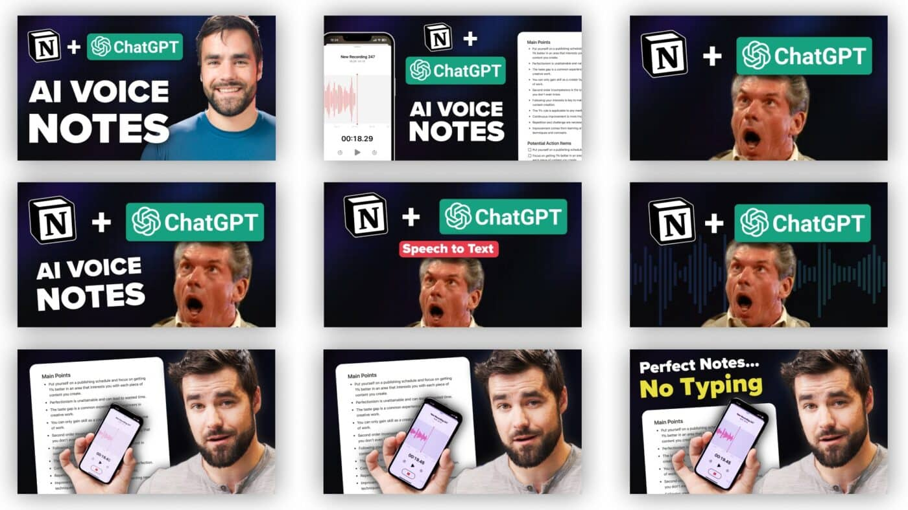

This video is one of the highest-performing on my channel. I went through 9 iterations before landing on the best one.

[Copy link to heading](https://thomasjfrank.com/creator/youtube-thumbnail-design-the-ultimate-guide/#the-best-thumbnail-design-tool)
The Best Thumbnail Design Tool
------------------------------

Run all your thumbnails through ThumbsUp:

[Thumbs Up – Standard thumbsup.tv](https://thumbsup.tv/)
This tool shows you what your title and thumbnail will look like at all the different sizes on YouTube – Home Page, sidebar, mobile app, etc.

Too YouTubers make the mistake of designing thumbnails on **huge**monitors. They fill their thumbnails with tiny details that no one will notice when the thumbnail is shrunken down the the size of a postage stamp.

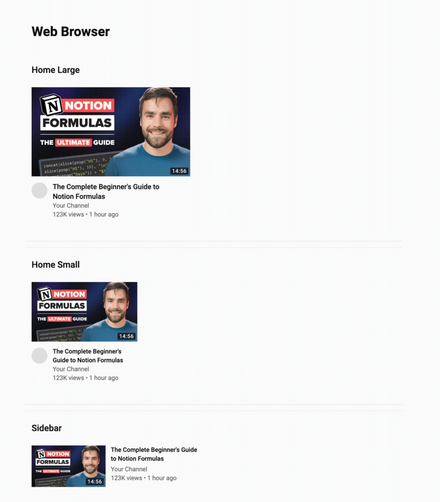[Copy link to heading](https://thomasjfrank.com/creator/youtube-thumbnail-design-the-ultimate-guide/#thumbnail-inspiration-gallery)
Thumbnail Inspiration Gallery
-----------------------------

When I see a great thumbnail, I add it to an inspiration gallery inside my team’s copy of [Creator’s Companion](https://thomasjfrank.com/creators-companion/) (my complete Notion template for content creators).

I’ve made our database public, and [you can check it out here](https://thomasfrank.notion.site/1cac7b8eb82e42948c633bd2b8432535?v=95f84cae26a84a1ab7b3dcb73495373a&pvs=4).

[Previous The YouTube Algorithm](https://thomasjfrank.com/creator/mastering-the-youtube-algorithm/)[Next Hiring an Editor](https://thomasjfrank.com/creator/hiring-an-editor/)

On This Page Close mobile table of contents menu

*   [When to Design Your Thumbnail](https://thomasjfrank.com/creator/youtube-thumbnail-design-the-ultimate-guide/#when-to-design-your-thumbnail)
*   [How to Get Clicks on Your Videos: The AIDA Principle](https://thomasjfrank.com/creator/youtube-thumbnail-design-the-ultimate-guide/#how-to-get-clicks-on-your-videos-the-aida-principle)
    *   [Attention](https://thomasjfrank.com/creator/youtube-thumbnail-design-the-ultimate-guide/#attention)
    *   [Interest](https://thomasjfrank.com/creator/youtube-thumbnail-design-the-ultimate-guide/#interest)
    *   [Desire](https://thomasjfrank.com/creator/youtube-thumbnail-design-the-ultimate-guide/#desire)
    *   [Action](https://thomasjfrank.com/creator/youtube-thumbnail-design-the-ultimate-guide/#action)

*   [How to Speed Up Your Thumbnail Process](https://thomasjfrank.com/creator/youtube-thumbnail-design-the-ultimate-guide/#how-to-speed-up-your-thumbnail-process)
    *   [Shooting Thumbnail Poses](https://thomasjfrank.com/creator/youtube-thumbnail-design-the-ultimate-guide/#shooting-thumbnail-poses)
    *   [Building a Thumbnail](https://thomasjfrank.com/creator/youtube-thumbnail-design-the-ultimate-guide/#building-a-thumbnail)

*   [Watch Me Design a Thumbnail](https://thomasjfrank.com/creator/youtube-thumbnail-design-the-ultimate-guide/#watch-me-design-a-thumbnail)
*   [Thumbnail Design Tricks](https://thomasjfrank.com/creator/youtube-thumbnail-design-the-ultimate-guide/#thumbnail-design-tricks)
*   [More Thumbnail Design Tips](https://thomasjfrank.com/creator/youtube-thumbnail-design-the-ultimate-guide/#more-thumbnail-design-tips)
*   [The Best Thumbnail Design Tool](https://thomasjfrank.com/creator/youtube-thumbnail-design-the-ultimate-guide/#the-best-thumbnail-design-tool)
*   [Thumbnail Inspiration Gallery](https://thomasjfrank.com/creator/youtube-thumbnail-design-the-ultimate-guide/#thumbnail-inspiration-gallery)

[» Back to Top](https://thomasjfrank.com/creator/youtube-thumbnail-design-the-ultimate-guide/#)

[**ThomasJFrank.com**](https://thomasjfrank.com/)[About Me](https://thomasjfrank.com/about/)[Articles](https://thomasjfrank.com/articles/)[Book Notes](https://thomasjfrank.com/notes/)[Courses](https://thomasjfrank.com/courses/)[**Learn Notion**](https://thomasjfrank.com/fundamentals/)[Notion Databases](https://thomasjfrank.com/notion-databases-the-ultimate-beginners-guide/)[Notion Formulas](https://learn.thomasjfrank.com/notion-formula-reference/)[Notion Automations](https://thomasjfrank.com/notion-automations/)[**Notion Templates**](https://thomasjfrank.com/templates/)[Notion Second Brain](https://thomasjfrank.com/brain/)[Content Creation HQ](https://thomasjfrank.com/creators-companion/)[Task Manager](https://thomasjfrank.com/templates/task-and-project-notion-template/)[Habit Tracker](https://thomasjfrank.com/templates/habit-tracker-notion-template/)[Customer Login](https://community.thomasjfrank.com/)**Template Docs**[Ultimate Brain](https://thomasjfrank.com/docs/ultimate-brain/)[Creator's Companion](https://thomasjfrank.com/docs/creators-companion/)

© Thomas Frank 2026 — [Privacy Policy](https://thomasjfrank.com/privacy/) | [Terms](https://thomasjfrank.com/terms/) | [Cookie Preferences](https://thomasjfrank.com/creator/youtube-thumbnail-design-the-ultimate-guide/#)

*   
*   
*   
*   
*   

Search
------

Close search window

All

*   [All](https://thomasjfrank.com/creator/youtube-thumbnail-design-the-ultimate-guide/#)
*   [Notion Formulas](https://thomasjfrank.com/creator/youtube-thumbnail-design-the-ultimate-guide/#)
*   [UB Docs](https://thomasjfrank.com/creator/youtube-thumbnail-design-the-ultimate-guide/#)
*   [CC Docs](https://thomasjfrank.com/creator/youtube-thumbnail-design-the-ultimate-guide/#)

↑↓to navigate

←→for pages

↵to select

esc to close

🤔 Have an UB Question?
-----------------------

Fill out the form below and I’ll answer as soon as I can! ~Thomas

 Name  

 Email  

 Message  

Send

🤔 Have a Question?
-------------------

Fill out the form below and I’ll answer as soon as I can! ~Thomas

 Name  

 Email  

 Message  

Send
