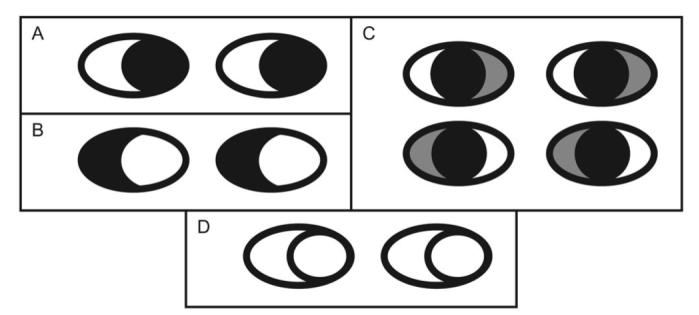
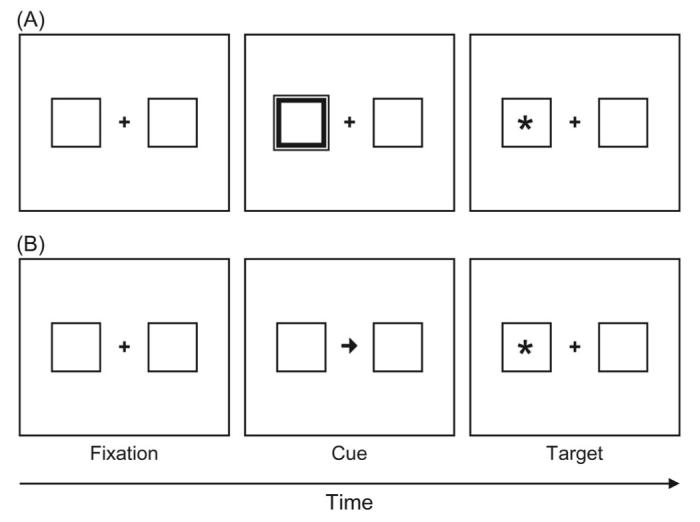
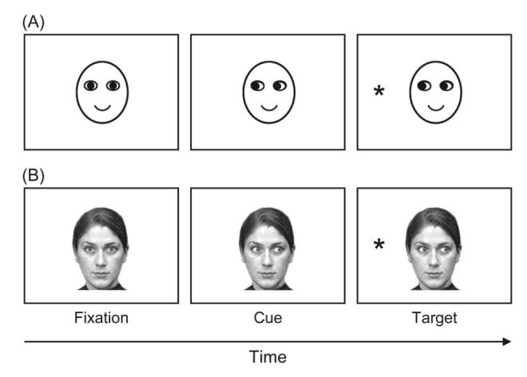
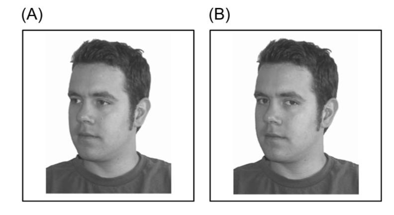
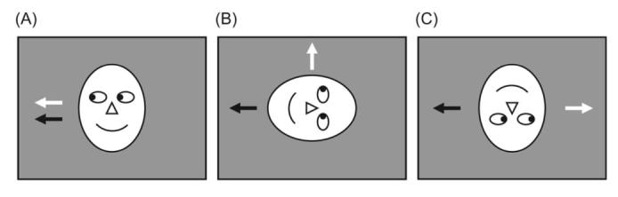

Title: Gaze Cueing of Attention: Visual Attention, Social Cognition, and Individual Differences

URL Source: https://pmc.ncbi.nlm.nih.gov/articles/PMC1950440/

Markdown Content:
. Author manuscript; available in PMC: 2007 Aug 21.

Abstract
-------------------------------------------------------------

During social interactions, people’s eyes convey a wealth of information about their direction of attention and their emotional and mental states. This review aims to provide a comprehensive overview of past and current research into the perception of gaze behavior and its effect on the observer. This encompasses the perception of gaze direction and its influence on perception of the other person, as well as gaze-following behavior such as joint attention, in infant, adult, and clinical populations. Particular focus is given to the gaze-cueing paradigm that has been used to investigate the mechanisms of joint attention. The contribution of this paradigm has been significant and will likely continue to advance knowledge across diverse fields within psychology and neuroscience.

**Keywords:** attention, social cognition, gaze cueing, joint attention, face perception

* * *

The “language of the eyes” is a rich and varied vocabulary. The eyes and their highly expressive surrounding region can communicate complex mental states such as emotions, beliefs, and desires. This review is inspired by one aspect of gaze perception: the use of perceived gaze direction to shift visual attention, that is, the seemingly automatic propensity to orient to the same object that other people are looking at. This _joint attention_ has been studied in infants for decades (e.g., [Farroni, Massaccesi, Pividori, & Johnson, 2004](https://pmc.ncbi.nlm.nih.gov/articles/PMC1950440/#R108); [Scaife & Bruner, 1975](https://pmc.ncbi.nlm.nih.gov/articles/PMC1950440/#R294)). Recently, interest has been engaged in describing the mechanisms of attention underlying this feature of social interaction in adults as well as infants. In doing so, visual attention, a classic area of cognitive research, has been reinvigorated with the use of ecologically valid stimuli (i.e., eyes). Equally, research into joint attention has benefited from the use of cognitive spatial cueing paradigms. The fusion of these two domains has allowed perhaps one of the most interesting fields of research in social cognition to emerge. This review will focus on the contribution of gaze-cueing research to our knowledge about social cognition and attention as well as the complex processes that allow these mechanisms to interact so dynamically.

Although the primary focus of this review is the effect of perceived gaze direction on attention, we also aim to give an overview of the gaze perception abilities of humans and to look at the effects that averted gaze and gaze contact can have on people’s perception of the individuals they interact with. We note that, with regard to these issues, models such as Perrett’s description of how gaze, head, and body position cues are integrated in the neural responses of superior temporal sulcus (STS; [Perrett, Hietanen, Oram, & Benson, 1992](https://pmc.ncbi.nlm.nih.gov/articles/PMC1950440/#R257)) and Baron-Cohen’s idea that some aspects of gaze perception are performed by innate modules (an Eye Direction Detector; [Baron-Cohen, 1995](https://pmc.ncbi.nlm.nih.gov/articles/PMC1950440/#R24)) have been reviewed more extensively elsewhere (e.g., [Emery, 2000](https://pmc.ncbi.nlm.nih.gov/articles/PMC1950440/#R99); [Langton, Watt, & Bruce, 2000](https://pmc.ncbi.nlm.nih.gov/articles/PMC1950440/#R194)), as has the development of joint attention and its neural basis (e.g., [Allison, Puce, & McCarthy, 2000](https://pmc.ncbi.nlm.nih.gov/articles/PMC1950440/#R9); [Moore & Dunham, 1995](https://pmc.ncbi.nlm.nih.gov/articles/PMC1950440/#R222)). Our discussion of these issues is intended to provide a context in which we can then place the new evidence from gaze-cueing studies. We aim to address the following issues in recent and ongoing research into gaze cueing: What can gaze cueing tell us about the mechanisms of visual attention? What can gaze cueing of attention tell us about social interactions? What can the attention literature on gaze cueing say about the processing of gaze in development and in clinical populations? What can gaze cueing reveal about the origins and neural bases of symbolic attention cueing? Tackling these questions as well as ideas for how this field might succeed in furthering knowledge in these areas are the major objectives of this review.

Gaze Perception
--------------------------------------------------------------------

The eyes fascinate us from the day we are born. The human neonatal visual system, although underdeveloped, is efficient at distinguishing these stimuli from others. The infant will come to find that those two oval shapes can be used to gain otherwise inaccessible information, to learn the names for objects in the world, and to ultimately unlock the secrets of other minds. Over the years into adulthood, the pervasive influence of the eyes and social gaze will continue, leading to ever more elaborate skills in engaging in collaboration, deception, and inference of intentions and mental states. Even though the linguistically adept adult possesses many other skills to aid navigation of the social world, reliance on eye-gaze perception to guide and interpret social behavior remains a central facet of social interactions throughout life.

In this section on how gaze perception is achieved, we look at the development of gaze perception in the infant as well as the effect that eye contact can have on the observer and briefly discuss the gaze perception abilities of nonhuman primates. We also examine the mechanisms of joint attention in infants and clinical populations. First, though, we provide an overview of the neural basis of gaze perception, as the neural mechanisms underpinning such behaviors as joint attention will be a recurring theme throughout this review.

### The Neural Basis of Gaze Perception

The perception of direct and averted gaze has been investigated extensively with brain imaging techniques and electrophysiology in humans as well as nonhuman primates. The following brief overview of the neural substrates of gaze perception is by no means exhaustive. It should serve as a reference frame in which to place some neuropsychological and neuroimaging findings that will be reported in subsequent sections of this article. More extensive reviews of the neural architecture of gaze perception can be found elsewhere (e.g., [Allison et al., 2000](https://pmc.ncbi.nlm.nih.gov/articles/PMC1950440/#R9); [Emery, 2000](https://pmc.ncbi.nlm.nih.gov/articles/PMC1950440/#R99); [Grosbras, Laird, & Paus, 2005](https://pmc.ncbi.nlm.nih.gov/articles/PMC1950440/#R139); [Hooker et al., 2003](https://pmc.ncbi.nlm.nih.gov/articles/PMC1950440/#R162); [Jellema, Baker, Wicker, & Perrett, 2000](https://pmc.ncbi.nlm.nih.gov/articles/PMC1950440/#R167); [Perrett et al., 1992](https://pmc.ncbi.nlm.nih.gov/articles/PMC1950440/#R257)).

A central component of the neural system for social perception is the cortical region within and near the STS. The STS is responsive to movements of the hands and body, as well as the eyes and the mouth, and therefore is supposed to code biological motion ([Bonda, Petrides, Ostry, & Evans, 1996](https://pmc.ncbi.nlm.nih.gov/articles/PMC1950440/#R45); [Oram & Perrett, 1994](https://pmc.ncbi.nlm.nih.gov/articles/PMC1950440/#R247); [Pelphrey, Morris, Michelich, Allison, & McCarthy, 2005](https://pmc.ncbi.nlm.nih.gov/articles/PMC1950440/#R252); [Puce, Allison, Bentin, Gore, & McCarthy, 1998](https://pmc.ncbi.nlm.nih.gov/articles/PMC1950440/#R271)). However, this region is also activated by static images of different postures of the face and body. Cells in the macaque STS are sensitive to different orientations of another’s head and eyes. Although many cells are most responsive to the combined direction of head and gaze (i.e., frontal view of the face with eye contact or profile view with averted gaze), others are tuned independently to body, head, and gaze information ([Perrett et al., 1990](https://pmc.ncbi.nlm.nih.gov/articles/PMC1950440/#R256); [Perrett, Smith, Potter, et al., 1985](https://pmc.ncbi.nlm.nih.gov/articles/PMC1950440/#R259); [Wachsmuth, Oram, & Perrett, 1994](https://pmc.ncbi.nlm.nih.gov/articles/PMC1950440/#R346)). [Perrett et al. (1992)](https://pmc.ncbi.nlm.nih.gov/articles/PMC1950440/#R257) suggested that such view selectivity could be used to infer the direction of attention of another individual under a variety of viewing conditions. [Jellema et al. (2000)](https://pmc.ncbi.nlm.nih.gov/articles/PMC1950440/#R167) supported this idea with their finding that the response magnitude of a subset of cells in STS that are sensitive to reaching movements of an arm can be influenced by the apparent direction of attention (as indicated by gaze and/or head orientation) of the agent performing the action. They proposed that this brain area, which is specialized in processing the orientation of faces in general and eye gaze in particular, is part of a distributed network that allows the observer to determine another person’s intentions.

There is evidence from behavioral paradigms that humans also have neurons that code for specific gaze directions (i.e., left vs. right) rather than simply distinguish between direct and averted eye gaze ([R. Jenkins, Beaver, & Calder, 2006](https://pmc.ncbi.nlm.nih.gov/articles/PMC1950440/#R169); [Seyama, 2006](https://pmc.ncbi.nlm.nih.gov/articles/PMC1950440/#R304); [Seyama & Nagayama, 2006](https://pmc.ncbi.nlm.nih.gov/articles/PMC1950440/#R305)). In an adaptation paradigm, observers were exposed to several presentations of a particular gaze direction (e.g., right) and then presented with a test stimulus. There was a strong tendency to erroneously judge test stimuli with eyes that were deviated in the adapted direction as looking straight ahead. This is presumably because cells coding for rightward gaze become habituated, with reduced responding relative to cells encoding leftward gaze direction. These effects were not due to low-level stimulus properties as they survived across changes in size and orientation ([R. Jenkins et al., 2006](https://pmc.ncbi.nlm.nih.gov/articles/PMC1950440/#R169); [Seyama & Nagayama, 2006](https://pmc.ncbi.nlm.nih.gov/articles/PMC1950440/#R305)). This observation is also reflected in dedicated neural activity responsive to left- and rightward gaze ([Calder et al., 2007](https://pmc.ncbi.nlm.nih.gov/articles/PMC1950440/#R57)).

As with macaques, the human brain region that is responsive to perceived gaze direction is the STS area, with both dynamic ([Hooker et al., 2003](https://pmc.ncbi.nlm.nih.gov/articles/PMC1950440/#R162); [Puce et al., 1998](https://pmc.ncbi.nlm.nih.gov/articles/PMC1950440/#R271)) and static face displays ([Hoffman & Haxby, 2000](https://pmc.ncbi.nlm.nih.gov/articles/PMC1950440/#R156)).[1](https://pmc.ncbi.nlm.nih.gov/articles/PMC1950440/#FN1) This activation does not appear to depend on the presence of a face per se because averted eyes viewed in isolation are sufficient to modulate brain activity ([Puce, Smith, & Allison, 2000](https://pmc.ncbi.nlm.nih.gov/articles/PMC1950440/#R272)). In addition, the STS is more responsive to eye movements that provide meaningful directional information compared with other gaze shifts (e.g., cross-eyed; [Hooker et al., 2003](https://pmc.ncbi.nlm.nih.gov/articles/PMC1950440/#R162)). It is interesting to note that neural activity in response to faces with deviated gaze is modulated depending on whether the gaze is directed toward an object or toward empty space ([Pelphrey, Singerman, Allison, & McCarthy, 2003](https://pmc.ncbi.nlm.nih.gov/articles/PMC1950440/#R254)). This implies that gaze processing is influenced by the perceived goal of the action and therefore is context sensitive. Viewing faces with direct and, in particular, averted gaze compared with those with eyes closed activates some of the same brain areas that are involved in tasks that require the attribution of other people’s intentions and beliefs ([Calder et al., 2002](https://pmc.ncbi.nlm.nih.gov/articles/PMC1950440/#R58); [Castelli, Frith, Happé, & Frith, 2002](https://pmc.ncbi.nlm.nih.gov/articles/PMC1950440/#R62)). These findings are in line with [Baron-Cohen’s (1995)](https://pmc.ncbi.nlm.nih.gov/articles/PMC1950440/#R24) proposal that encoding of another’s eye-gaze direction is an integral part of a theory of mind.

The STS is part of a wider network for social perception that embodies other aspects of face perception, including the processing of face identity. Haxby and colleagues ([Haxby, Hoffman, & Gobbini, 2002](https://pmc.ncbi.nlm.nih.gov/articles/PMC1950440/#R147); [Haxby et al., 1999](https://pmc.ncbi.nlm.nih.gov/articles/PMC1950440/#R148); [Hoffman & Haxby, 2000](https://pmc.ncbi.nlm.nih.gov/articles/PMC1950440/#R156)) proposed that these different functions (i.e., encoding of face identity and of face properties that are important for social communication such as gaze perception) are distinct cognitive aspects of face perception that are also anatomically dissociable, taking place in lateral fusiform gyrus and STS, respectively (see also [Hasselmo, Rolls, & Baylis, 1989](https://pmc.ncbi.nlm.nih.gov/articles/PMC1950440/#R146); [Kanwisher, McDermott, & Chun, 1997](https://pmc.ncbi.nlm.nih.gov/articles/PMC1950440/#R175); [McCarthy, Puce, Gore, & Allison, 1997](https://pmc.ncbi.nlm.nih.gov/articles/PMC1950440/#R213)). For example, when participants are instructed to attend to the identity of face stimuli, a stronger response is evoked in the fusiform gyrus than in STS. When the task requires attention to the direction of gaze of a face, the STS region is activated more strongly than is the fusiform gyrus ([Hoffman & Haxby, 2000](https://pmc.ncbi.nlm.nih.gov/articles/PMC1950440/#R156)). This anatomical distinction lends support to the idea that aspects of face perception that are changeable, are communicative, and therefore require continual on-line monitoring (e.g., emotional expression, eye gaze) are processed in functionally separate systems to those that involve analysis of invariant features (e.g., identity and gender; [Andrews & Ewbank, 2004](https://pmc.ncbi.nlm.nih.gov/articles/PMC1950440/#R14); [Bruce & Young, 1986](https://pmc.ncbi.nlm.nih.gov/articles/PMC1950440/#R50); [Haxby et al., 2002](https://pmc.ncbi.nlm.nih.gov/articles/PMC1950440/#R147); [Hoffman & Haxby, 2000](https://pmc.ncbi.nlm.nih.gov/articles/PMC1950440/#R156); but see [Calder & Young, 2005](https://pmc.ncbi.nlm.nih.gov/articles/PMC1950440/#R59), for arguments that suggest that the issue is not by any means settled).

Further input-output connections from the STS project to the amygdala, a structure of the limbic system that is heavily implicated in the processing of the emotional content of stimuli, including facial expressions, and in linking this information to emotional responses in the observer ([Aggleton, 1993](https://pmc.ncbi.nlm.nih.gov/articles/PMC1950440/#R5); [Aggleton, Burton, & Passingham, 1980](https://pmc.ncbi.nlm.nih.gov/articles/PMC1950440/#R6); [Thomas et al., 2001](https://pmc.ncbi.nlm.nih.gov/articles/PMC1950440/#R323)). Lesions of the amygdala result in deficits in judgments of both gaze direction and facial expression ([Aggleton, 1993](https://pmc.ncbi.nlm.nih.gov/articles/PMC1950440/#R5); [Young et al., 1995](https://pmc.ncbi.nlm.nih.gov/articles/PMC1950440/#R355)), suggesting that it plays a critical role in both tasks. The role of the amygdala in gaze monitoring has been highlighted by several recent functional neuroimaging studies, which showed that amygdala activity occurs in response to passive viewing of direct and averted gaze ([Wicker, Michel, Henaff, & Decety, 1998](https://pmc.ncbi.nlm.nih.gov/articles/PMC1950440/#R348)) as well as when active detection of eye contact versus deviated gaze is required ([Kawashima et al., 1999](https://pmc.ncbi.nlm.nih.gov/articles/PMC1950440/#R176)), even when the face holds a neutral emotional expression. A further study by [Hooker and colleagues (2003)](https://pmc.ncbi.nlm.nih.gov/articles/PMC1950440/#R162) suggested that amygdala response to observed gaze reflects the observer’s monitoring for emotional gaze events (e.g., eye contact; see also [Whalen, 1998](https://pmc.ncbi.nlm.nih.gov/articles/PMC1950440/#R347)).

The STS is also heavily connected with the parietal cortex, which is implicated in orienting of attention ([Harries & Perrett, 1991](https://pmc.ncbi.nlm.nih.gov/articles/PMC1950440/#R145); [Rafal, 1996](https://pmc.ncbi.nlm.nih.gov/articles/PMC1950440/#R274)). Specifically, there are reciprocal connections between STS and the intraparietal sulcus (IPS), an area that is associated with spatial processing and covert shifts of attention ([Corbetta, Miezin, Shulman, & Petersen, 1993](https://pmc.ncbi.nlm.nih.gov/articles/PMC1950440/#R76); [Nobre et al., 1997](https://pmc.ncbi.nlm.nih.gov/articles/PMC1950440/#R241)). Via these connections, information about eye-gaze direction could project to spatial attention systems to initiate orienting of attention in the corresponding direction, as in joint attention. Indeed, passive viewing of a face with averted gaze elicits a stronger response in the IPS than viewing a face with direct gaze ([Hoffman & Haxby, 2000](https://pmc.ncbi.nlm.nih.gov/articles/PMC1950440/#R156)). In addition, activity in the STS and fusiform area is correlated with activity in the IPS when a face with deviated gaze is seen ([George, Driver, & Dolan, 2001](https://pmc.ncbi.nlm.nih.gov/articles/PMC1950440/#R132); [Pelphrey et al., 2003](https://pmc.ncbi.nlm.nih.gov/articles/PMC1950440/#R254); see also [Wicker et al., 1998](https://pmc.ncbi.nlm.nih.gov/articles/PMC1950440/#R348)). The relation between gaze perception and spatial attention is apparent in recent behavioral studies that demonstrated that perceived gaze direction can trigger reflexive attention shifts in the corresponding direction in the observer.

### How Is Accurate Gaze Perception Achieved?

A wide range of species, from black iguanas and hog-nosed snakes to nonhuman primates and humans, have a very accurate ability to determine whether they are being looked at (e.g., [Burger, Gochfeld, & Murray, 1992](https://pmc.ncbi.nlm.nih.gov/articles/PMC1950440/#R52); [Burghardt & Greene, 1990](https://pmc.ncbi.nlm.nih.gov/articles/PMC1950440/#R53); [Perrett & Mistlin, 1991](https://pmc.ncbi.nlm.nih.gov/articles/PMC1950440/#R258)). The unique morphology of the human eye means that “useful information can be recovered from it with robust simple processing mechanisms” ([Langton et al., 2000](https://pmc.ncbi.nlm.nih.gov/articles/PMC1950440/#R194), p. 52). Compared with other primates, humans have a relatively small dark region (the pupil and iris) and large regions of white sclera to either side of the iris ([Kobayashi & Kohshima, 1997](https://pmc.ncbi.nlm.nih.gov/articles/PMC1950440/#R183)). This makes the discrimination of gaze direction much easier in humans than in other animals. [J. J. Gibson and Pick (1963)](https://pmc.ncbi.nlm.nih.gov/articles/PMC1950440/#R134) showed that the participant’s threshold for accepting truly deviated gaze as direct gaze is just 2.8°. However, the accuracy of discerning deviated gaze declines as the angle of gaze becomes smaller (e.g., 98% correct at 10° compared with 71% correct at 5°; [R. Jenkins et al., 2006](https://pmc.ncbi.nlm.nih.gov/articles/PMC1950440/#R169)). Nonhuman primates such as adult rhesus monkeys can discriminate between photographs depicting direct gaze and gaze averted by 5°, the same ability that has been reported in human infants ([Campbell, Heywood, Cowey, Regard, & Landis, 1990](https://pmc.ncbi.nlm.nih.gov/articles/PMC1950440/#R60); [Symons, Hains, & Muir, 1998](https://pmc.ncbi.nlm.nih.gov/articles/PMC1950440/#R320)).

When participants observe eyes with inverted polarity (i.e., dark sclera, light iris), gaze perception is severely disrupted ([Ricciardelli, Baylis, & Driver, 2000](https://pmc.ncbi.nlm.nih.gov/articles/PMC1950440/#R279); [Sinha, 2000](https://pmc.ncbi.nlm.nih.gov/articles/PMC1950440/#R312)). That is, participants fail to report that the face is looking in the direction of the (now white) pupil, which is the same shape and size as before, but often report the direction of the (now dark) sclera (see [Figure 1](https://pmc.ncbi.nlm.nih.gov/articles/PMC1950440/#F1), compare Panels A and B). [Ando (2002)](https://pmc.ncbi.nlm.nih.gov/articles/PMC1950440/#R13) showed that a similar effect is found when participants are presented with a face with direct gaze but either the left or right section of sclera is presented as grey ([Figure 1](https://pmc.ncbi.nlm.nih.gov/articles/PMC1950440/#F1), Panel C). However, as [Ando (2002)](https://pmc.ncbi.nlm.nih.gov/articles/PMC1950440/#R13) noted, the geometry of the eye must also be important because an eye represented only by the outlines of an oval and a circle, with no luminance contrast at all, is sufficient to determine gaze direction (see [Figure 1](https://pmc.ncbi.nlm.nih.gov/articles/PMC1950440/#F1), Panel D). Ando suggested that both luminance and geometry may be important but that their processing demands may mean that luminance is computed quickly for a raw representation of gaze direction, whereas a geometric analysis of gaze direction is more resource consuming and more vulnerable to noise.

#### Figure 1.

Illustration of the influence of luminance contrast and geometry on gaze perception. Panel A shows “normal” cartoon eyes with geometry and luminance preserved. Panel B is the contrast inverted version of Panel A, which has been shown to result in difficulty in gaze discrimination tasks. Panel C shows how making the left or right sclera of the eyes darker (which could happen in shadow or other suboptimal lighting conditions) can influence gaze perception. Panel D shows an example in which both sclera and pupil are white, but the geometry is preserved.

Higher level factors also influence where we think someone is looking. For example, people usually look at objects rather than empty space. [Lobmaier, Fischer, and Schwaninger (2006)](https://pmc.ncbi.nlm.nih.gov/articles/PMC1950440/#R201) demonstrated this flexibility in the system by showing that the presence of an object near the line of observed sight causes the perceived gaze direction to gravitate toward the object. Hence, assumptions about where people tend to look override pure perceptual geometry (see also [Todorovic, 2006](https://pmc.ncbi.nlm.nih.gov/articles/PMC1950440/#R330), for further evidence that geometry cannot fully explain gaze perception). The perception of gaze direction can further be influenced by its face context. For instance, although people are generally highly accurate in assessing whether someone else’s gaze is directed at them, these judgments tend to err when the observed face is not oriented toward the observer but at an angle to the left or right ([Anstis, Mayhew, & Morley, 1969](https://pmc.ncbi.nlm.nih.gov/articles/PMC1950440/#R16); [Cline, 1967](https://pmc.ncbi.nlm.nih.gov/articles/PMC1950440/#R70); [J. J. Gibson & Pick, 1963](https://pmc.ncbi.nlm.nih.gov/articles/PMC1950440/#R134)). Perception of gaze direction is also impaired when the face is inverted, a manipulation thought to disrupt holistic or configural processing (e.g., [Vecera & Johnson, 1995](https://pmc.ncbi.nlm.nih.gov/articles/PMC1950440/#R336); [Yin, 1969](https://pmc.ncbi.nlm.nih.gov/articles/PMC1950440/#R354)). However, inverting the eye region alone (independently of the face context) impairs judgments of gaze direction, too, suggesting that configural processing of the eye region itself rather than, or perhaps in addition to, configural processing of the face as a whole contributes to perception of gaze direction ([J. Jenkins & Langton, 2003](https://pmc.ncbi.nlm.nih.gov/articles/PMC1950440/#R168)).

### What Are the Effects of Eye Contact?

Eye contact has profound effects on the receiver (e.g., [Kleinke, 1986](https://pmc.ncbi.nlm.nih.gov/articles/PMC1950440/#R182)). Indeed, the ability to discriminate between direct and averted gaze that is found across different species may have evolved because direct gaze can signal that a predator is attending, making its detection an important tool for survival ([Emery, 2000](https://pmc.ncbi.nlm.nih.gov/articles/PMC1950440/#R99)). Many animal species respond to the presence of staring eyes with displays of fear and submission, indicating that such stimuli act as warning cues ([Gallup, Cummings, & Nash, 1972](https://pmc.ncbi.nlm.nih.gov/articles/PMC1950440/#R130); [Hennig, 1977](https://pmc.ncbi.nlm.nih.gov/articles/PMC1950440/#R149); [Ristau, 1991](https://pmc.ncbi.nlm.nih.gov/articles/PMC1950440/#R281); [Schwab & Huber, 2006](https://pmc.ncbi.nlm.nih.gov/articles/PMC1950440/#R298); see also [Beausoleil, Stafford, & Mellor, 2006](https://pmc.ncbi.nlm.nih.gov/articles/PMC1950440/#R43)). In humans, prolonged eye contact can also be perceived as an aggressive approach signal, as it leads to increases in galvanic skin response, as compared with observation of averted eye gaze in adults ([Nichols & Champness, 1971](https://pmc.ncbi.nlm.nih.gov/articles/PMC1950440/#R238)).

Establishing eye contact also acts as a signal of attraction between people. For example, recent research has shown that when a person is seen to move their eyes to engage in eye contact, they are perceived as more likable and attractive than if they are seen to disengage eye contact ([Mason, Tatkow, & Macrae, 2005](https://pmc.ncbi.nlm.nih.gov/articles/PMC1950440/#R209)). [Mason et al. (2005)](https://pmc.ncbi.nlm.nih.gov/articles/PMC1950440/#R209) further found that the (female) faces shifting their gaze toward the observer were rated as more attractive by male participants but not by female participants (see also [Vuilleumier, George, Lister, Armony, & Driver, 2005](https://pmc.ncbi.nlm.nih.gov/articles/PMC1950440/#R345)). A study by [Jones, DeBruine, Little, Conway, & Feinberg (2006)](https://pmc.ncbi.nlm.nih.gov/articles/PMC1950440/#R172) showed that this kind of effect is modulated by emotional expression. That is, faces looking at you are perceived as more attractive when smiling than when holding a neutral expression, whereas faces looking away from you are less attractive when smiling than when holding a neutral expression. This not only shows that eye contact influences perception of another’s attractiveness but also that this effect is modulated by the social context of the judgment, that is, the perceived relationship between the observer and the observed party.

It is not surprising that people are highly sensitive to being attended to (i.e., gazed at) by others. The subjective feeling of being “looked at” is a common experience, suggesting that people may have a predisposition to the detection of the gaze of others. Such a predisposition may be supported by a dedicated module, an “eye direction detector,” for example ([Baron-Cohen, 1995](https://pmc.ncbi.nlm.nih.gov/articles/PMC1950440/#R24)). During visual search, eyes that are looking at the observer are found more efficiently than are eyes that are looking elsewhere, suggesting that attention is guided or captured by direct gaze ([Conty, Tijus, Hugueville, Coelho, & George, 2006](https://pmc.ncbi.nlm.nih.gov/articles/PMC1950440/#R74); [Senju, Hasegawa, & Tojo, 2005](https://pmc.ncbi.nlm.nih.gov/articles/PMC1950440/#R300); [von Grünau & Anston, 1995](https://pmc.ncbi.nlm.nih.gov/articles/PMC1950440/#R343)). [Senju & Hasegawa (2005)](https://pmc.ncbi.nlm.nih.gov/articles/PMC1950440/#R299) showed that detection of peripherally presented targets was delayed when a central face stimulus was gazing ahead compared with when its gaze was averted or the eyes were closed. When a temporal gap was introduced between the offset of the face stimulus and the appearance of the target, this delay was no longer evident. Thus, it appears that direct gaze both captures attention and delays disengagement of attention from the face stimulus.

Seeing a face with direct gaze engages the observer’s attention, perhaps because of the social significance conveyed by eye contact (see [Baron-Cohen, 1995](https://pmc.ncbi.nlm.nih.gov/articles/PMC1950440/#R24)). Indeed, activity in the fusiform area is enhanced when the observed face is looking at the observer compared with when its gaze is directed away from the observer, indicating that it receives preferential processing in the former condition ([George et al., 2001](https://pmc.ncbi.nlm.nih.gov/articles/PMC1950440/#R132)). It is known that attended faces elicit stronger fusiform activity than do faces that are presented outside the focus of attention ([Wojciulik, Kanwisher, & Driver, 1998](https://pmc.ncbi.nlm.nih.gov/articles/PMC1950440/#R351)). Thus, the differential fusiform activation observed by [George et al. (2001)](https://pmc.ncbi.nlm.nih.gov/articles/PMC1950440/#R132) likely reflects attentional modulation. The notion that direct gaze facilitates processing of the observed face is supported by behavioral evidence showing improved performance on gender categorization and face recognition tasks when the face stimuli display direct rather than averted gaze ([Hood, Macrae, Cole-Davies, & Dias, 2003](https://pmc.ncbi.nlm.nih.gov/articles/PMC1950440/#R160); [Macrae, Hood, Milne, Rowe, & Mason, 2002](https://pmc.ncbi.nlm.nih.gov/articles/PMC1950440/#R204); [Mason, Hood, & Macrae, 2004](https://pmc.ncbi.nlm.nih.gov/articles/PMC1950440/#R208); see also [Smith, Hood, & Hector, 2006](https://pmc.ncbi.nlm.nih.gov/articles/PMC1950440/#R313), for a similar finding in children). Furthermore, when an approaching person is seen to suddenly shift gaze toward the participant, greater STS activity is elicited as compared with that when the person disengages mutual gaze ([Pelphrey, Viola, & McCarthy, 2004](https://pmc.ncbi.nlm.nih.gov/articles/PMC1950440/#R255)). Similar effects have been found in the superior temporal gyrus, where greater activity is shown while making judgments of emotional expression when the face is making eye contact ([Wicker, Perrett, Baron-Cohen, & Decety, 2003](https://pmc.ncbi.nlm.nih.gov/articles/PMC1950440/#R349)).

As well as modulating affective and neurophysiological responses to “lookers,” being looked at can influence seemingly unrelated behavior, even when the eyes are simple “eyespots” on a computer screen. [Haley and Fessler (2005)](https://pmc.ncbi.nlm.nih.gov/articles/PMC1950440/#R140) showed that in an experimental economic game in which participants could choose whether to share money with their fellow participants, more money was shared by participants whose irrelevant computer backdrop contained schematic eye stimuli compared with a backdrop with no eyes present. In this situation, increased economic fairness and collaboration presumably resulted from the feeling of being watched.

### Gaze Perception and Joint Attention in Development

As already noted, a strikingly strong sensitivity to eye gaze is observed from birth ([Farroni, Csibra, Simion, & Johnson, 2002](https://pmc.ncbi.nlm.nih.gov/articles/PMC1950440/#R103)), and this sensitivity is key to the development of social cognition in early life (see [Striano & Reid, 2006](https://pmc.ncbi.nlm.nih.gov/articles/PMC1950440/#R317), for a recent review). The behavior of joint attention may emerge because of the activation of an innate module attuned to the visual appearance of eyes ([Baron-Cohen, 1995](https://pmc.ncbi.nlm.nih.gov/articles/PMC1950440/#R24)) or because of a less dedicated mechanism that develops from associating high contrast black stimuli (pupils) with interesting objects and reward ([Moore & Corkum, 1994](https://pmc.ncbi.nlm.nih.gov/articles/PMC1950440/#R221)). Young infants smile more at faces with visible eyes (Spitz & Wolf, 1946, as cited in [Argyle & Cook, 1976](https://pmc.ncbi.nlm.nih.gov/articles/PMC1950440/#R17)) and even neonates prefer to gaze at a face with the eyes visible ([Batki, Baron-Cohen, Wheelwright, Connellan, & Ahluwalia, 2000](https://pmc.ncbi.nlm.nih.gov/articles/PMC1950440/#R35); [Farroni et al., 2002](https://pmc.ncbi.nlm.nih.gov/articles/PMC1950440/#R103)). Evidence for enhanced processing of direct gaze, as compared with averted gaze, also comes from event-related potentials recorded from 4-month-olds ([Farroni et al., 2002](https://pmc.ncbi.nlm.nih.gov/articles/PMC1950440/#R103); [Farroni, Johnson, & Csibra, 2004](https://pmc.ncbi.nlm.nih.gov/articles/PMC1950440/#R105)). Around this age, this sensitivity to direct gaze results in deeper face processing ([Farroni, Massaccesi, Menon, & Johnson, 2007](https://pmc.ncbi.nlm.nih.gov/articles/PMC1950440/#R107)), just as it does in adults ([Hood et al., 2003](https://pmc.ncbi.nlm.nih.gov/articles/PMC1950440/#R160)). At 5 months, infants can already discriminate between very small horizontal deviations (5°) of eye gaze ([Symons et al., 1998](https://pmc.ncbi.nlm.nih.gov/articles/PMC1950440/#R320)). However, the ability to explicitly determine whether an adult is making eye contact, or where an adult is looking, may not develop until the age of 3 years ([Doherty & Anderson, 1999](https://pmc.ncbi.nlm.nih.gov/articles/PMC1950440/#R91)).

Gaze following is the behavior of central relevance to this review. Orienting one’s own attention (overtly, through eye movements or head turns, or covertly through a shift of spatial attention) to the direction of another’s gaze has been the subject of intense research in infant development. [Scaife and Bruner (1975)](https://pmc.ncbi.nlm.nih.gov/articles/PMC1950440/#R294) found that infants reliably follow caregivers’ head turns within the 1st year of life, whereas [Hood, Willen, and Driver (1998)](https://pmc.ncbi.nlm.nih.gov/articles/PMC1950440/#R161) showed that observing shifts of eye gaze by a face presented on a computer screen resulted in facilitated saccades to the direction of gaze in infants as young as 3 months old. The possibility that even neonates can follow gaze has been suggested by one study, as long as the pupils are seen to move ([Farroni, Massaccesi, et al., 2004](https://pmc.ncbi.nlm.nih.gov/articles/PMC1950440/#R108)). Clearly, the capacity to use another person’s eye gaze as a cue to attention develops very early in life.

Despite its early emergence, the use of gaze cues by young infants seems to be based on rather low-level factors. As noted by [Farroni, Massaccesi, et al. (2004)](https://pmc.ncbi.nlm.nih.gov/articles/PMC1950440/#R108), neonates must see the eyes move to be able to follow the gaze of another person. That is, if the eyes are seen statically looking left or right, joint attention is not established. Therefore, the depth to which the infant understands another person’s gaze behavior is unclear (see [Butterworth, 1991](https://pmc.ncbi.nlm.nih.gov/articles/PMC1950440/#R54); [Moore & Corkum, 1994](https://pmc.ncbi.nlm.nih.gov/articles/PMC1950440/#R221), for reviews). Further evidence for “naïve” gaze following that really relies on following motion comes from [Moore, Angelopoulos, and Bennett (1997)](https://pmc.ncbi.nlm.nih.gov/articles/PMC1950440/#R220), who found that 9-month-old infants who had already developed gaze following could follow gaze on the basis of the observation of static stimuli. However, infants who had not yet developed spontaneous gaze following needed to see the motion of the head turn to learn to follow gaze—learning from static models was not found. Furthermore, if a gaze cue is produced by a lateral translation of the stimulus face independently of the pupils, such that the pupils are stationary but the facial movement results in averted gaze, 4- to 5-month-old infants orient to the direction of motion rather than to the opposite side of space cued by gaze ([Farroni, Johnson, Brockbank, & Simion, 2000](https://pmc.ncbi.nlm.nih.gov/articles/PMC1950440/#R104)), whereas adults always orient to the direction of gaze and not head movement ([Bayliss, di Pellegrino, & Tipper, 2005](https://pmc.ncbi.nlm.nih.gov/articles/PMC1950440/#R37)). The importance of motion to gaze following in infants was confirmed in another study that showed that eye contact prior to the motion of the pupils was necessary for early gaze following ([Farroni, Mansfield, Lai, & Johnson, 2003](https://pmc.ncbi.nlm.nih.gov/articles/PMC1950440/#R106)). This suggests that _gaze contact_—engaging attention on the face—followed by pupil motion, is vital to give rise to the more complex behaviors involved in joint attention in infancy.

Although gaze cueing may be based on basic perceptual processes initially, infants soon learn to use gaze cues flexibly. Between the ages of 12 and 18 months, infants begin to show signs that they are not simply following the motion of head turns because when the actors’ eyes are closed during the head turn, gaze following occurs less often (Brooks & Meltzoff, [​2002](https://pmc.ncbi.nlm.nih.gov/articles/PMC1950440/#R47), [​2005](https://pmc.ncbi.nlm.nih.gov/articles/PMC1950440/#R48)). Furthermore, if another attention-engaging facial expression (such as the expression of happiness or sadness) is made by the looking face, joint attention is less likely to be engaged ([Flom & Pick, 2005](https://pmc.ncbi.nlm.nih.gov/articles/PMC1950440/#R112)). Brooks and Meltzoff ([2002](https://pmc.ncbi.nlm.nih.gov/articles/PMC1950440/#R47)​, [2005](https://pmc.ncbi.nlm.nih.gov/articles/PMC1950440/#R48)) and [Flom and Pick (2005)](https://pmc.ncbi.nlm.nih.gov/articles/PMC1950440/#R112) found that 7-month-olds follow the gaze of a face with a neutral emotional expression more strongly than they do when the face looks happy or sad. Hence, although infantile joint attention may be based on simple mechanisms, it quickly becomes sensitive to the context in which the observed gaze behavior occurs. It is interesting that around the same age that this new flexibility emerges, other skills involved in face processing, such as recognition of facial identity and emotional expression, become more robust and sophisticated (see, e.g., [Nelson, 2001](https://pmc.ncbi.nlm.nih.gov/articles/PMC1950440/#R237), for a review). The flexible use of other’s gaze direction to orient attention may arise from higher level social cognition interacting with and building on a perhaps innate basic mechanisms for analyzing gaze direction (cf. [Baron-Cohen, 1995](https://pmc.ncbi.nlm.nih.gov/articles/PMC1950440/#R24)).

Despite emerging from arguably simple origins, gaze following has a remarkable influence in the development of higher level representations of other people’s perceptions. For example, orienting to the object of a caregiver’s attention might allow the speedy acquisition of nouns, through the pairing of an observed object and its vocalized name ([Baldwin, 1995](https://pmc.ncbi.nlm.nih.gov/articles/PMC1950440/#R19)). Indeed, gaze following at 6 months has been shown to correlate with vocabulary size at 18 months ([Morales et al., 2000](https://pmc.ncbi.nlm.nih.gov/articles/PMC1950440/#R223); [Morales, Mundy, & Rojas, 1998](https://pmc.ncbi.nlm.nih.gov/articles/PMC1950440/#R224)). The development of joint attention at 20 months can predict theory of mind abilities at 44 months ([Charman et al., 2001](https://pmc.ncbi.nlm.nih.gov/articles/PMC1950440/#R65)), demonstrating the importance of gaze following in the development of social cognition. The development of joint attention behavior is also associated with an increase in frontal lobe activity, crucial for higher order representations ([Mundy, Card, & Fox, 2000](https://pmc.ncbi.nlm.nih.gov/articles/PMC1950440/#R232)).

One fundamental concept that the developing child has to grasp to achieve successful joint attention is the understanding that people attend to their own actions. As such, observed gaze direction can be used as an indicator of another person’s future actions. In fact, some cells in monkey temporal cortex that respond to the observation of actions make this very distinction: They fire only when the action is attended to by the actor; if the actor is gazing away from their own hand, the cells do not respond ([Jellema et al., 2000](https://pmc.ncbi.nlm.nih.gov/articles/PMC1950440/#R167)). These cells may therefore form part of an intentionality detection system. There is behavioral evidence supporting the idea that during observation of actions, the observed person’s motor intentions can be inferred by monitoring their eye gaze (that is, whether they are focusing on the target of their action; [Castiello, 2003](https://pmc.ncbi.nlm.nih.gov/articles/PMC1950440/#R63); see also [Pierno, Becchio, et al., 2006](https://pmc.ncbi.nlm.nih.gov/articles/PMC1950440/#R261)). Discerning another’s intentions is a vital building block in social cognition. In line with this notion, [Amano, Kezuka, and Yamamoto (2004)](https://pmc.ncbi.nlm.nih.gov/articles/PMC1950440/#R10) found that looking from an adult’s head to their hand was one of the first joint attention abilities that emerge in development (after around 3 to 4 months). This is certainly an important skill because using joint attention to understand and predict others’ actions is an integral part of theory of mind and social perception.

Another central part of joint attention is orienting to the object that is the current focus of another’s attention rather than showing a simple spatial orienting response in the general direction of observed gaze. It would be disadvantageous if an infant consistently failed to orient to the exact object that an adult is looking at. For example, language acquisition (specifically, naming objects) may be slowed if the referent of a novel word, as indexed by the speaker’s gaze, is not accurately identified. There is no clear consensus at what age infants stop simply orienting to the nearest object in the general vicinity of the adult and instead turn their attention more precisely toward the looked-at object (see [Butterworth & Jarrett, 1991](https://pmc.ncbi.nlm.nih.gov/articles/PMC1950440/#R55); [Corkum & Moore, 1998](https://pmc.ncbi.nlm.nih.gov/articles/PMC1950440/#R78); [Moore & Corkum, 1994](https://pmc.ncbi.nlm.nih.gov/articles/PMC1950440/#R221), for evidence that this does not happen until after at least 12 months). One study, however, has suggested that by 9 months, infants can correctly orient to an object even in the presence of closer-by distractor objects as long as the target object is in their field of view ([Flom, Deák, Phill, & Pick, 2004](https://pmc.ncbi.nlm.nih.gov/articles/PMC1950440/#R111)). Further evidence for a relatively early appreciation for adults’ gaze behavior comes from [Moll and Tomasello (2004)](https://pmc.ncbi.nlm.nih.gov/articles/PMC1950440/#R219), who showed that 12- and 18-month-olds will crawl a short distance to peek around a barrier (obscuring the infant’s view) to inspect what an adult is looking at.

Hence, the infant rapidly learns that gaze can provide very reliable information about another person’s likely object of reference or imminent action. Once these building blocks of joint attention are in place, children can begin to use other people’s orienting behavior for a more sophisticated “mind-reading” purpose ([Baron-Cohen, 1994](https://pmc.ncbi.nlm.nih.gov/articles/PMC1950440/#R23)). [Baron-Cohen, Campbell, Karmiloff-Smith, Grant, and Walker (1995)](https://pmc.ncbi.nlm.nih.gov/articles/PMC1950440/#R28) found that not only can children ages 3 and 4 years old deduce the direction of gaze of a schematic face, but they can ascribe mental states such as desires on the basis of the direction of gaze. That is, if Charlie is looking toward the chocolate bar, Charlie wants the chocolate bar (see also [Lee, Eskritt, Symons, & Muir, 1998](https://pmc.ncbi.nlm.nih.gov/articles/PMC1950440/#R197)). Thus, understanding that direction of gaze can indicate which objects a person knows exists, is currently attending to, and holds a mental state about can help a child infer much about the current visual world. Nevertheless, children of the same age have difficulty coping with conflicting information ([Friere, Eskritt, & Lee, 2004](https://pmc.ncbi.nlm.nih.gov/articles/PMC1950440/#R116); [Pellicano & Rhodes, 2003](https://pmc.ncbi.nlm.nih.gov/articles/PMC1950440/#R250)). [Pellicano and Rhodes (2003)](https://pmc.ncbi.nlm.nih.gov/articles/PMC1950440/#R250) found that when an arrow pointed in a different direction to the eyes, children were unable to correctly choose the object that was looked at by Charlie as the one he wanted. This suggests that children’s use of eye-gaze direction is vulnerable to interference at least into the 5th year of life.

By about the age of 5, children learn that the eyes can give information that people want to hide from them. That is, the eyes can help children detect deception—another vital step in the development of theory of mind ([Baron-Cohen, 1992](https://pmc.ncbi.nlm.nih.gov/articles/PMC1950440/#R22); [Leslie, 1987](https://pmc.ncbi.nlm.nih.gov/articles/PMC1950440/#R200)). In the study by [Friere et al. (2004)](https://pmc.ncbi.nlm.nih.gov/articles/PMC1950440/#R116), children ages 3-5 years were lied to by an adult who claimed that she did not know the true location of a toy, which was hidden under one of three cups. Meanwhile, the adult looked toward the cup hiding the toy. The 3-year-olds performed poorly, unable to use the eyes to infer the location of the cup, as if the verbal information dominated their decision. The 4- and 5-year-olds, however, performed well (Experiment 1). A further experiment found that children of these ages also act differently when verbal and gaze cues are in direct opposition—if the toy is in the looked-at cup but the adult says it is in a different location, 3-year-olds inspect the cup indicated verbally, whereas the 5-year-olds correctly inspect the looked-at cup (Experiment 3). It is interesting to note at this stage that children’s increasingly subtle and flexible use of gaze is reflected in recruitment of neural structures. That is, by at least 7 years of age, children activate similar brain regions to adults when analyzing gaze direction ([Mosconi, Mack, McCarthy, & Pelphrey, 2005](https://pmc.ncbi.nlm.nih.gov/articles/PMC1950440/#R226)).

The development of gaze perception in infants may be due to the use of simple systems (gaze perception) by higher level systems dedicated to the establishment of a sophisticated picture of other people’s overt behavior, future intentions, and mental states. Gaze perception is crucial for joint attention and social cognition. Hence, should this normal development of these simple gaze perception and gaze-following mechanisms be impeded in any way, profound implications for social cognition could result and persist throughout development. This may indeed be the case in children with autism, a developmental disorder affecting social cognition.

### Gaze Perception and Joint Attention in Clinical Populations

The developmental disorder _autism_ is characterized by a triad of symptoms that relate to poor social, communicative, and imagination skills in affected individuals ([Baron-Cohen, 2000](https://pmc.ncbi.nlm.nih.gov/articles/PMC1950440/#R25)). Children with autism perform poorly on first-order tests of theory of mind (e.g., understanding that “Mary thinks the marble is in the basket”) and often fail on second-order tests (e.g., understanding that “Mary thinks that John thinks the marble is in the basket”) compared with normal children and children with Down syndrome ([Baron-Cohen, 1989](https://pmc.ncbi.nlm.nih.gov/articles/PMC1950440/#R21)). Social interactions are also different from those of normally developing children, as there are fewer attention-sharing behaviors with other children and caregivers in children with autism ([Sigman, Mundy, Sherman, & Ungerer, 1986](https://pmc.ncbi.nlm.nih.gov/articles/PMC1950440/#R309)). Shifts of attention are more often made between two (nonsocial) objects rather than between people ([Dawson, Meltzoff, Osterling, & Brown, 1998](https://pmc.ncbi.nlm.nih.gov/articles/PMC1950440/#R85); [Swettenham et al., 1998](https://pmc.ncbi.nlm.nih.gov/articles/PMC1950440/#R318)). Imitation, another index of learning through experience sharing, is also impaired in children with autism (Charman et al., [​2001](https://pmc.ncbi.nlm.nih.gov/articles/PMC1950440/#R65), [​1997](https://pmc.ncbi.nlm.nih.gov/articles/PMC1950440/#R66); [Stone, Ousley, & Littleford, 1997](https://pmc.ncbi.nlm.nih.gov/articles/PMC1950440/#R316)). Furthermore, whereas normally developing children use the speaker’s direction of gaze to infer the referent of a novel word, children with autism tend not to use gaze cues in this manner, which could play a role in the sometimes profound language deficits prevalent in this population ([Baron-Cohen, Baldwin, & Crowson, 1997](https://pmc.ncbi.nlm.nih.gov/articles/PMC1950440/#R27)).

Thus, along with general learning, language, and IQ deficits, children with autism present a highly impaired cognitive profile. A variety of underlying problems have been postulated for the deficits found in autism. For example, theory of mind may not have developed fully ([Baron-Cohen, 1989](https://pmc.ncbi.nlm.nih.gov/articles/PMC1950440/#R21)), emotional systems may be disrupted (e.g., the amygdala, [Baron-Cohen et al., 2000](https://pmc.ncbi.nlm.nih.gov/articles/PMC1950440/#R30)), or abnormal function of the frontal lobes may lead to executive dysfunction ([Hill, 2004](https://pmc.ncbi.nlm.nih.gov/articles/PMC1950440/#R155)). Other theories postulate that the presence of “islets of ability” or even superior performance in certain tests of cognitive ability demonstrate that a more comprehensive framework, for example based on weak central coherence, is necessary to explain autism ([U. Frith & Happé, 1994](https://pmc.ncbi.nlm.nih.gov/articles/PMC1950440/#R126)). It has further been proposed that the autistic cognitive profile trades off empathizing skills for systemizing skills ([Baron-Cohen, 2002](https://pmc.ncbi.nlm.nih.gov/articles/PMC1950440/#R26); [Baron-Cohen, Richler, Bisarya, Gurunathan, & Wheelwright, 2003](https://pmc.ncbi.nlm.nih.gov/articles/PMC1950440/#R29); [Baron-Cohen, Wheelwright, Skinner, Martin, & Clubley, 2001](https://pmc.ncbi.nlm.nih.gov/articles/PMC1950440/#R33)). One major question of current research into autism is whether these two sets of indicators of autism (weak central coherence and weak theory of mind) are related or independent (e.g., [Jarrold, Butler, Cottington, & Jiminez, 2000](https://pmc.ncbi.nlm.nih.gov/articles/PMC1950440/#R166); [Morgan, Maybery, & Durkin, 2003](https://pmc.ncbi.nlm.nih.gov/articles/PMC1950440/#R225)).

With regard to gaze processing, the evidence is clear that it is treated very differently by people with autism than by people without autism. When observing a face, normally developed adults tend to scan the eye and mouth region in a highly consistent manner ([Mertens, Siegmund, & Grüsser, 1993](https://pmc.ncbi.nlm.nih.gov/articles/PMC1950440/#R215)). In contrast, people with autism often dislike and avoid eye contact (see [Baron-Cohen, 1988](https://pmc.ncbi.nlm.nih.gov/articles/PMC1950440/#R20); [Dalton et al., 2005](https://pmc.ncbi.nlm.nih.gov/articles/PMC1950440/#R79); [Pelphrey et al., 2002](https://pmc.ncbi.nlm.nih.gov/articles/PMC1950440/#R253)). Normal children detect gaze contact quicker than averted gaze, whereas children with autism are equally quick at detecting either gaze type ([Senju, Yaguchi, Tojo, & Hasegawa, 2003](https://pmc.ncbi.nlm.nih.gov/articles/PMC1950440/#R303); [Senju, Hasegawa, & Tojo, 2005](https://pmc.ncbi.nlm.nih.gov/articles/PMC1950440/#R300)). When the task demands exploring the eye region of a face, people with autism show greater galvanic skin response and greater neural activity in the fusiform gyrus and amygdala compared with that of control participants, suggesting eye-region avoidance is an arousal modulation strategy on the part of people with autism ([Dalton et al., 2005](https://pmc.ncbi.nlm.nih.gov/articles/PMC1950440/#R79)). Such behavioral traits are mirrored in people with social phobia, in whom scanning of faces rarely includes the eye region ([Horley, Williams, Gonsalvez, & Gordon, 2002](https://pmc.ncbi.nlm.nih.gov/articles/PMC1950440/#R163); [Larsen & Shackelford, 1996](https://pmc.ncbi.nlm.nih.gov/articles/PMC1950440/#R195)).

Normally developing children make eye contact more readily if a person is performing an ambiguous action than if the action is unambiguous, whereas children with autism make little eye contact whatever the action’s semantic context ([Phillips, Baron-Cohen, & Rutter, 1992](https://pmc.ncbi.nlm.nih.gov/articles/PMC1950440/#R260)). Indeed, when normally developed adults see a person unexpectedly look away from an object, higher STS activity is elicited compared with when the person looks toward the object. This modulation of neural activity in relation to violation or confirmation of expected behavior is absent in autism ([Pelphrey, Morris, & McCarthy, 2005](https://pmc.ncbi.nlm.nih.gov/articles/PMC1950440/#R251); see [Zilbovicius et al., 2006](https://pmc.ncbi.nlm.nih.gov/articles/PMC1950440/#R356), for a review of the STS and autism). Ignoring contextual information can be seen as a symptom of weak central coherence (see [Brosnan, Scott, Fox, & Pye, 2004](https://pmc.ncbi.nlm.nih.gov/articles/PMC1950440/#R49)). Furthermore, adults and children with autism are poor at attributing emotions to people on the basis of the eye region, something that normal attributers are proficient at ([Baron-Cohen et al., 1995](https://pmc.ncbi.nlm.nih.gov/articles/PMC1950440/#R28); [Baron-Cohen, Wheelwright, Hill, Raste, & Plumb, 2001](https://pmc.ncbi.nlm.nih.gov/articles/PMC1950440/#R31); [Baron-Cohen, Wheelwright, & Jolliffe, 1997](https://pmc.ncbi.nlm.nih.gov/articles/PMC1950440/#R32)).

Electrophysiological evidence for deviant gaze processing was provided by [Senju, Tojo, Yaguchi, & Hasegawa (2005](https://pmc.ncbi.nlm.nih.gov/articles/PMC1950440/#R302); see also [Grice et al., 2005](https://pmc.ncbi.nlm.nih.gov/articles/PMC1950440/#R138)), who found different brain responses for direct versus averted gaze in normally developing children, but such differences were absent in children with autism. Because these differences arise from processes thought to take place in occipitotemporal areas, it is interesting to note that children with autism appear to have lower gray matter densities in the STS ([Boddaert et al., 2004](https://pmc.ncbi.nlm.nih.gov/articles/PMC1950440/#R44))—exactly the area considered to be responsible for gaze processing ([Perrett et al., 1992](https://pmc.ncbi.nlm.nih.gov/articles/PMC1950440/#R257); [Wicker et al., 1998](https://pmc.ncbi.nlm.nih.gov/articles/PMC1950440/#R348)). This, along with structural differences in the cerebellum ([Boddaert et al., 2004](https://pmc.ncbi.nlm.nih.gov/articles/PMC1950440/#R44)), the frontal lobe ([Hill, 2004](https://pmc.ncbi.nlm.nih.gov/articles/PMC1950440/#R155)), and functional differences in the amygdala ([Baron-Cohen et al., 2000](https://pmc.ncbi.nlm.nih.gov/articles/PMC1950440/#R30); [Dalton et al., 2005](https://pmc.ncbi.nlm.nih.gov/articles/PMC1950440/#R79)) demonstrates the substantial anatomical divergence between people with and without autism.

Given the well-established patterns of gaze aversion, it is no surprise to find that joint attention is also impaired in people with autism (e.g., [Charman et al., 1997](https://pmc.ncbi.nlm.nih.gov/articles/PMC1950440/#R66); [Dawson et al., 2004](https://pmc.ncbi.nlm.nih.gov/articles/PMC1950440/#R86); [Leekam, López, & Moore, 2000](https://pmc.ncbi.nlm.nih.gov/articles/PMC1950440/#R199); [Roeyers, van Oost, & Bothuyne, 1998](https://pmc.ncbi.nlm.nih.gov/articles/PMC1950440/#R289)). However, as with normal participants, better joint attention skills are associated with larger vocabularies, and fewer social and communicative difficulties, in people with autism, illustrating the vital importance of joint attention in the social development of children with autism as well as normally developing children ([Charman, 2003](https://pmc.ncbi.nlm.nih.gov/articles/PMC1950440/#R64)). Furthermore, orienting to the direction of another’s gaze can occur at normal levels in children with high-functioning autism (for whom IQ is within the normal range), perhaps based on the same low-level motion cues from which joint attention develops in normally developing children ([Chawarska, Klin, & Volkmar, 2003](https://pmc.ncbi.nlm.nih.gov/articles/PMC1950440/#R67); [Leekam, Hunnisett, & Moore, 1998](https://pmc.ncbi.nlm.nih.gov/articles/PMC1950440/#R198); [Swettenham, Condie, Campbell, Milne, & Coleman, 2003](https://pmc.ncbi.nlm.nih.gov/articles/PMC1950440/#R319); but see [Kylliäinen & Hietanen, 2004](https://pmc.ncbi.nlm.nih.gov/articles/PMC1950440/#R186), who demonstrated gaze cueing in children with autism by using statically averted gaze). Thus, it is possible that although the low-level perceptual aspects of gaze cueing (e.g., motion, luminance contrast, and geometry of sclera and pupil) are intact in children with autism, it is the higher level social cognition skills (e.g., attribution of emotional states) or their interactions with those basic processes that are impaired; in other words, the flexibility with which normally developing children use gaze cues is lacking in autism.

Differences between children with and without autism are found not only in how they orient attention to social stimuli (e.g., [Dawson et al., 1998](https://pmc.ncbi.nlm.nih.gov/articles/PMC1950440/#R85); [Swettenham et al., 1998](https://pmc.ncbi.nlm.nih.gov/articles/PMC1950440/#R318)) but also with other attentional abilities. Children with autism have been found to display normal or superior attentional processing in visual search and selective attention ([Brian, Tipper, Weaver, & Bryson, 2003](https://pmc.ncbi.nlm.nih.gov/articles/PMC1950440/#R46); [O’Riordan, Plaisted, Driver, & Baron-Cohen, 2001](https://pmc.ncbi.nlm.nih.gov/articles/PMC1950440/#R249)), and slowed orienting of covert attention has also been noted in autism ([Townsend, Courchesne, & Egaas, 1996](https://pmc.ncbi.nlm.nih.gov/articles/PMC1950440/#R333)). We will return to these issues when we have introduced the gaze-cueing paradigm more comprehensively, so that we can evaluate how this and other attention paradigms can contribute to knowledge about autism.

Theory of mind impairments often accompany the cognitive and affective deficits encountered in _schizophrenia_. For example, failing to correctly attribute the agent of an action is a feature of schizophrenia ([C. D. Frith, Blakemore, & Wolpert, 2000](https://pmc.ncbi.nlm.nih.gov/articles/PMC1950440/#R125)). People with schizophrenia tend to misattribute actions of others to themselves, whereas normal participants are proficient at telling the difference between their gloved hand performing an action on a TV screen and the experimenter’s gloved hand performing the same action ([Daprati et al., 1997](https://pmc.ncbi.nlm.nih.gov/articles/PMC1950440/#R81)). Self–other confusion is characteristic of mentalizing problems associated with schizophrenia ([Langdon et al., 1997](https://pmc.ncbi.nlm.nih.gov/articles/PMC1950440/#R190)), and when processing facial affect, people with schizophrenia recruit premotor areas as opposed to the amygdala. This suggests that a “mirror system,” which links the internal representations of observed and executed actions, is hyperactive in people with schizophrenia as they process other people’s mental states ([Quintana, Davidson, Kovalik, Marder, & Mazziotta, 2001](https://pmc.ncbi.nlm.nih.gov/articles/PMC1950440/#R273)). Such overactivation of a facial mirror system may contribute to the blurring of boundaries between potential mentalistic agents in the environment. Despite all this, the accuracy of eye direction determination is good in people with schizophrenia, for whom performance does not differ significantly from that of normal participants (Franck et al., [​1998](https://pmc.ncbi.nlm.nih.gov/articles/PMC1950440/#R114), [​2002](https://pmc.ncbi.nlm.nih.gov/articles/PMC1950440/#R115)). This demonstrates that the lower level aspects of gaze perception are normal in people with schizophrenia. However, [Langdon, Corner, McLaren, Coltheart, and Ward (2006)](https://pmc.ncbi.nlm.nih.gov/articles/PMC1950440/#R189) present evidence that gaze-following systems are somewhat overactive in people with schizophrenia.

Other syndromes that affect social cognition, such as Turner syndrome ([Elgar, Campbell, & Skuse, 2002](https://pmc.ncbi.nlm.nih.gov/articles/PMC1950440/#R98); [Lawrence et al., 2003](https://pmc.ncbi.nlm.nih.gov/articles/PMC1950440/#R196)) and Williams syndrome, have also been investigated in gaze perception studies ([Mobbs et al., 2004](https://pmc.ncbi.nlm.nih.gov/articles/PMC1950440/#R217)). Nevertheless, further work is needed with these populations to more comprehensively determine the effect these syndromes have on gaze perception.

### Use of Gaze Cues by Primates

The establishment of a dyadic joint attention relationship may be a behavior that originally develops from stimulus-response relationships and reinforcement, yet it is a higher level interpersonal skill that requires at least some level of theory of mind. To take [Emery’s (2000)](https://pmc.ncbi.nlm.nih.gov/articles/PMC1950440/#R99) definition, “Joint attention requires that two individuals . . . are attending to the same object . . . based on one individual using the attention cues of the second individual” (p. 588). This definition demands that attention is directed to the appropriate feature of the environment, whereas gaze following is perhaps simple orienting to the appropriate region or hemifield. _Shared attention_ is a higher state of the dyadic relationship whereby both individuals are attending the same object, as with joint attention, but both are aware of each other’s attentional state ([Emery, 2000](https://pmc.ncbi.nlm.nih.gov/articles/PMC1950440/#R99)). The subtle differences between gaze following, joint attention, and shared attention are highlighted not only by work with human infants but also in work with nonhuman primates.

For example, [Myowa-Yamakoshi, Tomonaga, Tanaka, and Matsuzawa (2003)](https://pmc.ncbi.nlm.nih.gov/articles/PMC1950440/#R235) showed that chimp infants (ages 10-32 weeks) have a preference for attending to direct human gaze. This result mirrors that of [Batki et al. (2000)](https://pmc.ncbi.nlm.nih.gov/articles/PMC1950440/#R35) in 36-hour-old human infants. Furthermore, adult chimpanzees, like human infants, follow gaze direction to appropriate objects in the environment ([Tomasello, Hare, & Agnetta, 1999](https://pmc.ncbi.nlm.nih.gov/articles/PMC1950440/#R332)). These animals have been shown to display behaviors that suggest they possess the ability to comprehend psychological states, such as understanding that, relative to themselves, a conspecific might have a different visual perspective, and hence might have access to different knowledge ([Tomasello, Call, & Hare, 2003](https://pmc.ncbi.nlm.nih.gov/articles/PMC1950440/#R331)).

On the other hand, macaque monkeys ([Deaner & Platt, 2003](https://pmc.ncbi.nlm.nih.gov/articles/PMC1950440/#R87); [Emery, Lorincz, Perrett, Oram, & Baker, 1997](https://pmc.ncbi.nlm.nih.gov/articles/PMC1950440/#R100); [Ferrari, Kohler, Fogassi, & Gallese, 2000](https://pmc.ncbi.nlm.nih.gov/articles/PMC1950440/#R109); [S. V. Shepherd, Deaner, & Platt, 2006](https://pmc.ncbi.nlm.nih.gov/articles/PMC1950440/#R308)) show gaze following and some aspects of joint attention but cannot use such cues to solve simple object-choice problems ([Anderson, Montant, & Schmitt, 1996](https://pmc.ncbi.nlm.nih.gov/articles/PMC1950440/#R12); see also [Vick, Toxopeus, & Anderson, 2006](https://pmc.ncbi.nlm.nih.gov/articles/PMC1950440/#R340)). Tamarind monkeys ([Santos & Hauser, 1999](https://pmc.ncbi.nlm.nih.gov/articles/PMC1950440/#R292)), squirrel monkeys, and capuchin monkeys ([Anderson, Kuroshima, Kuwahata, & Fujita, 2004](https://pmc.ncbi.nlm.nih.gov/articles/PMC1950440/#R11)) seem to understand that the object of a human’s action is likely to be the object they are looking at as they perform the action (see also [Jellema et al., 2000](https://pmc.ncbi.nlm.nih.gov/articles/PMC1950440/#R167)). However, baboons fail to use gaze cues unless these are perfect predictors of stimulus location ([Fagot & Deruelle, 2002](https://pmc.ncbi.nlm.nih.gov/articles/PMC1950440/#R102)) or if they have competitive motivation to do so ([Vick & Anderson, 2003](https://pmc.ncbi.nlm.nih.gov/articles/PMC1950440/#R339)). These data suggest that joint attention abilities vary between species, with some primates (especially chimpanzees) using social gaze to higher levels than do others. Research is not restricted to primates. For example, domestic dogs show stronger patterns of gaze perception than do wolves ([Miklósi et al., 2003](https://pmc.ncbi.nlm.nih.gov/articles/PMC1950440/#R216); see also [Gácsi, Miklósi, Varga, Topál, & Csányi, 2004](https://pmc.ncbi.nlm.nih.gov/articles/PMC1950440/#R128); and [Emery, 2000](https://pmc.ncbi.nlm.nih.gov/articles/PMC1950440/#R99), for reviews on primates and other species). In some ways, the differences in primate use of gaze resemble early stages in human infant development, before the child learns to use those cues in a more flexible manner, and also stages at which some people develop difficulties with social cognition because of developmental disorders such as autism, adult-onset disorders such as schizophrenia, or difficulties in face perception caused by brain damage.

In summary, research on gaze processing has demonstrated that humans are highly adept at detecting and encoding other people’s eyes and direction of gaze in particular. This sensitivity develops very early in life and allows for the development of a plethora of other social and cognitive skills. Thus, the basic and perhaps innate skills that enable the analysis of another person’s gaze direction serve as building blocks for more higher level social cognition abilities. In some clinical populations, this development is impaired, leading to profound social and cognitive difficulties. In the following sections, the mechanisms that may be underlying this joint attention behavior are discussed.

Gaze Cues and Orienting of Attention
-----------------------------------------------------------------------------------------

We receive an abundance of visual information whenever our eyes are open, but not all of this input may be relevant for our current behavioral goals. Therefore, it is highly beneficial for our cognitive system to be able to select pertinent input for further processing by attending selectively to relevant aspects of the environment. _Orienting_ of attention refers to the alignment of some internal mechanism with an external sensory input source that results in the preferential processing of that input. This article concerns visual attention specifically, therefore the term _orienting_ will henceforth refer to orienting to visual input. Orienting of attention may be elicited and controlled in different ways, and, consequently, a great deal of research has centered on attempts to distinguish between different types of orienting or orienting processes.

For example, [Posner (1980)](https://pmc.ncbi.nlm.nih.gov/articles/PMC1950440/#R263) differentiated between _overt_ and _covert_ orienting. Overt orienting involves the directly observable orientation of sensory receptors and/or body parts toward a spatial location or object to enable better processing of the target stimulus. Thus, you may move your eyes and head toward an object of interest that will allow the visual input to be foveated and to receive optimal processing. Covert orienting refers to alignment of an internal mechanism with some sensory input in the absence of overt responses. Such “invisible” shifts of attention can be detected by using response accuracy or reaction times (RTs) as a measure of processing efficiency of a visual target. In the next section, we briefly review prior research investigating attentional orienting to set the scene for comparing and contrasting such orienting effects with those evoked by gaze cues.

### Spatial Cueing

Usually, some variation of the spatial cueing paradigm ([Posner, 1980](https://pmc.ncbi.nlm.nih.gov/articles/PMC1950440/#R263); [Posner & Cohen, 1984](https://pmc.ncbi.nlm.nih.gov/articles/PMC1950440/#R265); [Posner, Nissen, & Ogden, 1978](https://pmc.ncbi.nlm.nih.gov/articles/PMC1950440/#R266)) is used to investigate covert orienting. In a typical example of this paradigm, participants are instructed to fixate on a marker at the center of the screen and to respond to the onset of a target stimulus that can appear to the left or right of the fixation marker by making a speeded keypress response. The onset of the target is preceded by some cue that elicits a shift of attention to either the left or right (see [Figure 2](https://pmc.ncbi.nlm.nih.gov/articles/PMC1950440/#F2)). Faster RTs and/or more accurate performance with targets appearing in the previously cued location (compared with those in the uncued location) indicate attention shifts to the cued location.

#### Figure 2.

Basic spatial cueing paradigm, using a peripheral sudden-onset cue (Panel A) or a central symbolic cue (Panel B). In Panel A, the target appears in the previously cued location (valid trial), whereas Panel B shows an invalid trial in which the target appears in the uncued location.

One way of distinguishing between different forms of orienting is to examine the effects of different types of attention cues, in other words, how attention is controlled. Such control is commonly assumed to manifest itself in two major types: (a) bottom-up (_exogenous_, reflexive, or stimulus driven), and (b) top-down (_endogenous_, voluntary, or goal driven).

Traditionally, bottom-up control is achieved by the capture and guidance of attention by events in the visual field, often in the periphery ([Eriksen & Hoffman, 1974](https://pmc.ncbi.nlm.nih.gov/articles/PMC1950440/#R101)). Any dynamic perceptual change such as a sudden change in luminance, texture, motion, or depth automatically attracts attention (e.g., [Oonk & Abrams, 1998](https://pmc.ncbi.nlm.nih.gov/articles/PMC1950440/#R246); [Yantis & Hillstrom, 1994](https://pmc.ncbi.nlm.nih.gov/articles/PMC1950440/#R353)). In the basic peripheral cueing paradigm (e.g., [Posner & Cohen, 1984](https://pmc.ncbi.nlm.nih.gov/articles/PMC1950440/#R265)), two empty placeholder boxes are arranged to the left and right of the central fixation marker. The outline of one of the peripheral boxes is briefly brightened before a target appears randomly in either box after variable cue-target stimulus-onset asynchronies (SOAs). As soon as the target is detected, the participant responds by pressing a key. The abrupt increase in luminance of the peripheral box is assumed to trigger a reflexive attention shift to the cued location that should facilitate stimulus processing at that point in space (see [Figure 2](https://pmc.ncbi.nlm.nih.gov/articles/PMC1950440/#F2) Panel A). Indeed, RTs are faster when the target occurs in the box that had been brightened (i.e., cued) compared with targets in the opposite (uncued) box. This type of orienting occurs rapidly and even though the cue is not predictive of the actual target location. Furthermore, instructions to ignore the cue fail to disrupt the cueing effect that is observed even if the target is more likely to appear in the uncued location ([Jonides, 1981](https://pmc.ncbi.nlm.nih.gov/articles/PMC1950440/#R173); [Remington, Johnston, & Yantis, 1992](https://pmc.ncbi.nlm.nih.gov/articles/PMC1950440/#R277)). Thus, this kind of orienting is considered automatic and reflexive because it cannot be suppressed.

The initial beneficial effect of peripheral cues on target detection is short lived. Facilitation declines between 150 ms and 300 ms after cue onset ([Müller & Findlay, 1988](https://pmc.ncbi.nlm.nih.gov/articles/PMC1950440/#R229)). Even more striking, this initial facilitation triggered by peripheral exogenous cues is overcome by inhibitory effects at longer cue-target intervals. That is, RTs to targets on valid trials (i.e., when the target appears in the cued location) are now slower than are responses on invalid trials (inhibition of return [IOR]; [Maylor, 1985](https://pmc.ncbi.nlm.nih.gov/articles/PMC1950440/#R211); [Maylor & Hockey, 1985](https://pmc.ncbi.nlm.nih.gov/articles/PMC1950440/#R212); [Posner & Cohen, 1984](https://pmc.ncbi.nlm.nih.gov/articles/PMC1950440/#R265)). [Posner and Cohen (1984)](https://pmc.ncbi.nlm.nih.gov/articles/PMC1950440/#R265) reasoned that this result reflects the operation of two distinct components of orienting. A sudden event in the environment triggers both facilitatory and inhibitory processes whose joint effect influences responses to targets in the environment (see also [Maylor, 1985](https://pmc.ncbi.nlm.nih.gov/articles/PMC1950440/#R211)). If a target occurs in close temporal proximity to a peripheral event, facilitation dominates at the cued location resulting in speeded detection of the target. Once attention is drawn to new locations, inhibition becomes evident at the previously cued location, expressed in elevated RTs. They argued that such a two-fold orienting mechanism would aid the detection of new events in the environment by preventing attention from repeatedly returning to a location that has already been examined. Hence, this phenomenon has been coined “inhibition of return” (IOR) in reference to the presumed purpose of the inhibitory orienting mechanism ([Posner, Rafal, Choate, & Vaughan, 1985](https://pmc.ncbi.nlm.nih.gov/articles/PMC1950440/#R267)).

In contrast to this automatic control of attention, orienting in response to centrally presented symbolic cues appears to be, at least partly, under voluntary control (i.e., top-down). Such cues may be an arrow pointing to one direction (see [Figure 2](https://pmc.ncbi.nlm.nih.gov/articles/PMC1950440/#F2) Panel B) or other semantic cues such as a word indicating the likely target location (e.g., LEFT). What these central cues have in common is that, unlike peripheral cues, they do not directly indicate a spatial location but rather require interpretation. [Jonides (1981)](https://pmc.ncbi.nlm.nih.gov/articles/PMC1950440/#R173) presented a central arrow that was, like peripheral cues, not predictive of the target location. He found no evidence for the rapid attention shifts associated with peripheral cues. In many subsequent studies, the central cue correctly predicted the target location on most trials to provide an incentive for the participant to orient in the direction of the cue, bringing orienting of attention under voluntary control. Under these circumstances, attention shifts were observed in response to central cues (e.g., [Posner, Snyder, & Davidson, 1980](https://pmc.ncbi.nlm.nih.gov/articles/PMC1950440/#R268)).

However, more recent studies obtained cueing effects even with spatially nonpredictive arrow cues (e.g., [Eimer, 1997](https://pmc.ncbi.nlm.nih.gov/articles/PMC1950440/#R97); [Hommel, Pratt, Colzato, & Godijn, 2001](https://pmc.ncbi.nlm.nih.gov/articles/PMC1950440/#R159); [Pratt & Hommel, 2003](https://pmc.ncbi.nlm.nih.gov/articles/PMC1950440/#R269); [Ristic, Friesen, & Kingstone, 2002](https://pmc.ncbi.nlm.nih.gov/articles/PMC1950440/#R282); [M. Shepherd, Findlay, & Hockey, 1986](https://pmc.ncbi.nlm.nih.gov/articles/PMC1950440/#R307); [Tipples, 2002](https://pmc.ncbi.nlm.nih.gov/articles/PMC1950440/#R327)). This suggests that orienting in response to symbolic cues is not entirely under strategic control. It appears that any reflexive component of symbolic cues may be evoked only when the cue is asymmetric (like an arrow), allowing spatial correspondence between the central cue and the target location to be automatically paired ([Lambert, Roser, Wells, & Heffer, 2006](https://pmc.ncbi.nlm.nih.gov/articles/PMC1950440/#R188); see also [Lambert & Duddy, 2002](https://pmc.ncbi.nlm.nih.gov/articles/PMC1950440/#R187)). Nevertheless, there are differences in the effects produced by arrow and peripheral cues, respectively. As opposed to peripheral cueing, orienting evoked by the directional information of central cues can be suppressed if that information conflicts with task demands, indicating that orienting to central cues is less automatic than orienting to peripheral cues ([Jonides, 1981](https://pmc.ncbi.nlm.nih.gov/articles/PMC1950440/#R173); see also [Friesen, Ristic, & Kingstone, 2004](https://pmc.ncbi.nlm.nih.gov/articles/PMC1950440/#R121)). Also, unlike peripheral cueing, attention shifts incited by central cues are susceptible to interference arising from processing demands of concurrent secondary tasks or orienting reflexes triggered by task-irrelevant peripheral events ([Jonides, 1981](https://pmc.ncbi.nlm.nih.gov/articles/PMC1950440/#R173); [Müller & Rabbitt, 1989](https://pmc.ncbi.nlm.nih.gov/articles/PMC1950440/#R230)).

Different neural systems appear to be specialized in exogenous and endogenous control of attention. Exogenous orienting is assumed to be subserved largely by a posterior attention system involving subcortical structures such as the pulvinar and the superior colliculus (SC; [Posner, Cohen, & Rafal, 1982](https://pmc.ncbi.nlm.nih.gov/articles/PMC1950440/#R264); [Rafal, Calabresi, Brennan, & Sciolto, 1989](https://pmc.ncbi.nlm.nih.gov/articles/PMC1950440/#R276)). Endogenous orienting is presumably supported more strongly by cortical areas in anterior (e.g., the cingulate gyrus and the supplementary motor area, which are involved in executive functions such as developing and maintaining expectancies; [Carr, 1992](https://pmc.ncbi.nlm.nih.gov/articles/PMC1950440/#R61); see also [Corbetta et al., 1993](https://pmc.ncbi.nlm.nih.gov/articles/PMC1950440/#R76)) and posterior regions of the brain (e.g., intraparietal sulcus; [Corbetta, Kincade, Ollinger, McAvoy, & Shulman, 2000](https://pmc.ncbi.nlm.nih.gov/articles/PMC1950440/#R75)). Both systems, which are specialized in bottom-up and top-down control, respectively, are assumed to interact such that salient sensory events can attract attention in a bottom-up fashion regardless of the ongoing task, thereby interrupting top-down control ([Corbetta & Shulman, 2002](https://pmc.ncbi.nlm.nih.gov/articles/PMC1950440/#R77)).

The time courses of the attentional effects produced by peripheral and central cues, respectively, appear to be characteristic and different. Orienting in response to symbolic cues may arise more slowly than does orienting to peripheral cues ([Müller & Rabbitt, 1989](https://pmc.ncbi.nlm.nih.gov/articles/PMC1950440/#R230)); whereas peripheral cues produce their maximum facilitatory effects at cue-target intervals of approximately 100 ms, the effects of central cues build up more gradually and achieve their largest effects at SOAs of circa 300 ms ([Cheal & Lyon, 1991](https://pmc.ncbi.nlm.nih.gov/articles/PMC1950440/#R68)). Another distinction between the two forms of orienting is apparent in the maintenance of cueing effects across time. Facilitation effects triggered by central cues are sustained at optimum level beyond their peak activation at 300 ms, whereas it is around this time that the inhibitory effects of peripheral cues begin to reveal IOR.

Although spatial visual attention has been studied extensively over the past decades, the cues in these experiments were typically artificial and arbitrary (e.g., the brightening of the outlines of geometric shapes). In recent years, cognitive research has begun to use more naturalistic, social cues of attention that had been used by studies in developmental psychology for decades: the perceived direction of another person’s eye gaze. As noted, another’s eye-gaze direction communicates information about important events in the environment. People are typically looking toward the objects to which they are attending so that the relevant input receives optimal perceptual processing. Therefore, the encoding and interpretation of another person’s gaze direction enables the observer to detect that person’s focus of attention and to align their own attention accordingly.

### Gaze Cueing

In studying the precise cognitive mechanisms underlying attention shifts in response to observed eye-gaze direction, modifications of Posner’s cueing paradigm have been used (see [Figure 3](https://pmc.ncbi.nlm.nih.gov/articles/PMC1950440/#F3)). Participants view a face stimulus at the center of the display. The gaze direction of that face substitutes the peripheral onset or symbolic arrow cues used in previous studies of attention orienting. In one of the first investigations of eye-gaze cueing, [Friesen and Kingstone (1998)](https://pmc.ncbi.nlm.nih.gov/articles/PMC1950440/#R117) explored whether observed gaze shifts, like traditional attention cues such as peripheral luminance increases or central arrows, produce orienting responses in adults. Participants were asked to respond to target letters that appeared to either the left or the right of a schematic face with varying SOAs after the pupils of the face appeared, constituting a directional gaze cue. The response required was either the mere detection of the target’s appearance or the indication of its location or its identity by pressing appropriate response keys. The eyes of the face looked either left, right, or straight ahead. On valid trials, the target appeared in the gazed-at location, whereas on invalid trials, it occurred in the opposite location. On neutral trials, the face gazed ahead, and the target appeared randomly on either side. Participants were informed that the direction in which the eyes looked was not predictive of the location or the identity of the target or of when it would appear. Thus, the eye gaze of the face was used as a centrally presented but spatially uninformative cue. The results of the experiment showed that RT was facilitated on valid-cue trials relative to neutral and invalid-cue trials, independent of response type. This cueing effect emerged relatively rapidly at short cue-target SOAs (105 ms in two response conditions and 300 ms in all response conditions) and disappeared with longer SOAs (1,005 ms). Thus, another’s gaze shift results in a corresponding shift of attention in the observer, which has been labeled _reflexive_ and therefore likened to orienting in response to peripheral cues.

#### Figure 3.

Basic gaze-cueing paradigm, using a schematic drawing (Panel A) or a real-life photograph of a face (Panel B). Panel A shows a valid trial, and Panel B an invalid trial. The photograph shown in Panel B is from the “AR Face Database,” by [A. M. Martinez and R. Benavente, June 1998](https://pmc.ncbi.nlm.nih.gov/articles/PMC1950440/#R206), _CVC Technical Report #24._ Reprinted with permission.

A separate study by [Driver et al. (1999)](https://pmc.ncbi.nlm.nih.gov/articles/PMC1950440/#R95) used photographs of a face whose eyes were looking to the right or to the left as a central, spatially uninformative cue. Participants were required to discriminate a target letter that could appear on either side of the face after 100, 300, or 700 ms. The pattern of results they obtained was comparable with the findings of [Friesen and Kingstone (1998)](https://pmc.ncbi.nlm.nih.gov/articles/PMC1950440/#R117). RTs were significantly faster on valid compared with invalid trials at 300- and 700-ms SOAs, even though the direction of gaze was entirely nonpredictive of target location or identity. Indeed, in one of their experiments (Experiment 3), participants were informed that the target was four times as likely to appear at the uncued side so that they would endogenously orient away from the gazed-at location. Under these circumstances, facilitation was still obtained for the cued location, but only at the 300-ms SOA. At the later interval, a trend toward facilitation at the expected target side emerged, suggesting that participants were able to eventually voluntarily shift their attention in that direction (see also [Downing, Dodds, & Bray, 2004](https://pmc.ncbi.nlm.nih.gov/articles/PMC1950440/#R94); [Friesen et al., 2004](https://pmc.ncbi.nlm.nih.gov/articles/PMC1950440/#R121)). Together, these studies demonstrated automatic shifts of attention in response to central, spatially unpredictive cues that apparently cannot be suppressed at short SOAs.

Gaze cues also trigger automatic overt orienting responses ([Mansfield, Farroni, & Johnson, 2003](https://pmc.ncbi.nlm.nih.gov/articles/PMC1950440/#R205)). [Mansfield et al. (2003)](https://pmc.ncbi.nlm.nih.gov/articles/PMC1950440/#R205) recorded eye movement latencies to a target presented to the left or right of a face with averted gaze. Reliable facilitation effects were obtained at a fixed SOA of 300 ms. It is interesting to note that observing averted gaze could also elicit spontaneous saccades in the direction of the cue prior to target onset, even though participants were instructed to fixate on the center during this period (however, see [Itier, Villate, & Ryan, 2007](https://pmc.ncbi.nlm.nih.gov/articles/PMC1950440/#R165), who showed that when overt attention is voluntarily directed away from the eyes by task instruction, such spontaneous gaze following is less frequent, presumably because the gaze direction signals are weaker when presented further from the fovea). This suggests that observing another’s gaze shifts may evoke a similar motoric program in the observer. Such simulated or “mirrored” activations of motor programs by the mere observation of actions have previously been reported with hand reaching and grasping actions (e.g., [di Pellegrino, Fadiga, Fogassi, Gallese, & Rizzolatti, 1992](https://pmc.ncbi.nlm.nih.gov/articles/PMC1950440/#R90); [Grafton, Arbib, Fadiga, & Rizzolatti, 1996](https://pmc.ncbi.nlm.nih.gov/articles/PMC1950440/#R137)). The notion that a similar mirror system may also exist for the oculomotor domain is supported by the finding that similar cortical regions are recruited during execution and observation of eye movements ([Grosbras et al., 2005](https://pmc.ncbi.nlm.nih.gov/articles/PMC1950440/#R139)). The involuntary cue-driven saccades recorded by Mansfield et al. did not, however, account for their observed cueing effects because the results for target-driven saccades were the same when cue-saccade trials were excluded.

In a somewhat different task, [Ricciardelli, Bricolo, Aglioti, and Chelazzi (2002)](https://pmc.ncbi.nlm.nih.gov/articles/PMC1950440/#R280) investigated whether seen gaze can interfere with goal-driven saccades. In their experiments, potential saccade targets were presented to the left or right of fixation. An instruction cue signaled that a saccade was to be made to one of those targets. A distractor face with averted gaze was then displayed at the center. Saccadic performance to the target was less accurate when the gaze cue was incongruent with the saccade instruction (i.e., when the face gazed at the nontarget). This effect was less pronounced if an arrow was used as the distracting direction indicator. Taken together, these two studies demonstrated that observation of averted gaze can trigger both covert and overt automatic orienting responses (see also [Friesen & Kingstone, 2003a](https://pmc.ncbi.nlm.nih.gov/articles/PMC1950440/#R118)). Furthermore, observing gaze, but not arrow cues, evokes a tendency to execute saccades in the corresponding direction, imitating the observed behavior.

Early demonstrations of gaze cueing consistently lacked evidence of IOR. [Friesen & Kingstone (2003b)](https://pmc.ncbi.nlm.nih.gov/articles/PMC1950440/#R119) used an elegant procedure showing that facilitation effects of gaze cueing and inhibition effects of peripheral cueing co-occur at the same SOA and at different locations in response to the same stimulus. In their study, four empty circles were presented. The features of a cartoon face, with its gaze straight ahead or averted, then appeared abruptly in one of the circles. Thus, the same stimulus could serve as a directional gaze cue as well as a sudden-onset cue. RTs were fast when the target appeared in the gazed-at location (facilitation effect) but were slow when it occurred in the location that was cued by the sudden onset of features (IOR). Critically, the magnitude of the IOR effect was unaffected by whether a gaze cue was concurrently presented. Because the magnitude of IOR is known to decrease when distributed over several locations (e.g., [Tipper, Weaver, & Watson, 1996](https://pmc.ncbi.nlm.nih.gov/articles/PMC1950440/#R326)), [Friesen and Kingstone (2003b)](https://pmc.ncbi.nlm.nih.gov/articles/PMC1950440/#R119) argued that IOR and gaze-triggered facilitation effects were separate and independent phenomena and that gaze cues do not elicit inhibition processes. However, facilitation and inhibition processes have been shown to co-occur even when triggered by the same type of cue ([Danziger & Kingstone, 1999](https://pmc.ncbi.nlm.nih.gov/articles/PMC1950440/#R80)). Therefore, the coexistence of gaze cueing and peripheral cueing effects may not be a reliable indicator for a lack of IOR with gaze cues.

[Friesen and Kingstone (2003a)](https://pmc.ncbi.nlm.nih.gov/articles/PMC1950440/#R118) also provided evidence that gaze cueing and IOR are subserved by different neural systems. They found that unlike IOR, gaze cueing does not interact with an attention phenomenon known as the gap effect.[2](https://pmc.ncbi.nlm.nih.gov/articles/PMC1950440/#FN2) This term refers to speeded responses to a peripheral target when the onset of the target is preceded by the offset of the fixation stimulus, compared with those of conditions in which the fixation point remains visible during presentation of the target ([Fischer & Ramsperger, 1984](https://pmc.ncbi.nlm.nih.gov/articles/PMC1950440/#R110)). Like IOR, the gap effect is thought to be mediated by the SC ([Dorris & Munoz, 1995](https://pmc.ncbi.nlm.nih.gov/articles/PMC1950440/#R93); Munoz & Wurtz, [1995a](https://pmc.ncbi.nlm.nih.gov/articles/PMC1950440/#R233), [1995b](https://pmc.ncbi.nlm.nih.gov/articles/PMC1950440/#R234); [Schiller, Sandell, & Maunsell, 1987](https://pmc.ncbi.nlm.nih.gov/articles/PMC1950440/#R297); [Sparks & Mays, 1983](https://pmc.ncbi.nlm.nih.gov/articles/PMC1950440/#R315)). The lack of an interaction between gaze cueing and the gap effect suggests that in contrast to IOR, the SC is not directly implicated in gaze cueing. Rather, the SC may be activated only as a consequence of the engagement of attentional networks ([Nummenmaa & Hietanen, 2006](https://pmc.ncbi.nlm.nih.gov/articles/PMC1950440/#R242)) as revealed by saccade curvature analysis (e.g., [Sheliga, Riggio, Craighero, & Rizzolatti, 1995](https://pmc.ncbi.nlm.nih.gov/articles/PMC1950440/#R306); [Tipper, Howard, & Paul, 2001](https://pmc.ncbi.nlm.nih.gov/articles/PMC1950440/#R324)).

Nevertheless, IOR is a multifaceted phenomenon that implicates various cortical areas as well as established subcortical structures such as the SC (e.g., [Dorris, Klein, Everling, & Munoz, 2002](https://pmc.ncbi.nlm.nih.gov/articles/PMC1950440/#R92); [Ro, Farné, & Chang, 2003](https://pmc.ncbi.nlm.nih.gov/articles/PMC1950440/#R288); [Tipper, Weaver, Jerreat, & Burak, 1994](https://pmc.ncbi.nlm.nih.gov/articles/PMC1950440/#R325); [Vivas, Humphreys, & Fuentes, 2003](https://pmc.ncbi.nlm.nih.gov/articles/PMC1950440/#R341)) and is not necessarily restricted to one type of cueing. Indeed, although initial studies failed to demonstrate IOR with centrally presented symbolic cues such as arrows (e.g., [Posner & Cohen, 1984](https://pmc.ncbi.nlm.nih.gov/articles/PMC1950440/#R265)), inhibition is obtained with these cues if the observer’s oculomotor system is activated ([Abrams & Dobkin, 1994](https://pmc.ncbi.nlm.nih.gov/articles/PMC1950440/#R1); [Posner et al., 1985](https://pmc.ncbi.nlm.nih.gov/articles/PMC1950440/#R267)). For example, [Rafal et al. (1989)](https://pmc.ncbi.nlm.nih.gov/articles/PMC1950440/#R276) compared cueing effects in response to peripheral and central cues while manipulating eye movement responses to the cue: Participants were instructed to either keep fixated at the center, to execute a saccade in the direction of the cue, or to prepare a saccade to the cued location that was to be executed only if a target appeared subsequently (a brightening of the central fixation box otherwise signaled that the saccade should be cancelled). Inhibition at the cued location was observed in all peripheral cue conditions but also emerged in the central cue conditions that required direct activation of the oculomotor system (i.e., saccade execution and preparation). Akin to these experiments, gaze studies present the cue at the center of the display, and saccades are evoked in response to the cue but typically suppressed ([Ricciardelli et al., 2002](https://pmc.ncbi.nlm.nih.gov/articles/PMC1950440/#R280)). It is therefore puzzling that IOR should not be observed in response to these cues.

In a series of experiments, [Frischen and Tipper (2004)](https://pmc.ncbi.nlm.nih.gov/articles/PMC1950440/#R123) demonstrated that inhibition effects can be obtained in response to eye-gaze cues. They noted that previous demonstrations of gaze-cueing effects possessed experimental features associated with failures to obtain IOR effects: Usually, the gaze cue was presented until target appearance. However, even with peripheral sudden-onset exogenous cues, IOR is not observed if there is a temporal overlap between cue and target onset ([Collie, Maruff, Yucel, Danckert, & Currie, 2000](https://pmc.ncbi.nlm.nih.gov/articles/PMC1950440/#R71); [Maruff, Yucel, Danckert, Stuart, & Currie, 1999](https://pmc.ncbi.nlm.nih.gov/articles/PMC1950440/#R207)). Furthermore, [Posner and Cohen (1984)](https://pmc.ncbi.nlm.nih.gov/articles/PMC1950440/#R265) proposed that attention needs to be withdrawn from the cued location for inhibition to be observable (see also [Danziger & Kingstone, 1999](https://pmc.ncbi.nlm.nih.gov/articles/PMC1950440/#R80)). This is usually achieved by presenting a second cue at fixation, a feature that was also lacking in gaze-cueing paradigms. [Frischen and Tipper (2004)](https://pmc.ncbi.nlm.nih.gov/articles/PMC1950440/#R123) attempted to draw attention away from the gazed-at location by shifting the gaze of the face back to the center and by offsetting the face stimulus between cue and target appearance. In these conditions, they did indeed observe reliable inhibition effects, but only at a considerably extended SOA of 2,400 ms, whereas at shorter intervals of 1,200 ms, no cueing effects were observed (cf. [Friesen & Kingstone, 1998](https://pmc.ncbi.nlm.nih.gov/articles/PMC1950440/#R117); [Langton & Bruce, 1999](https://pmc.ncbi.nlm.nih.gov/articles/PMC1950440/#R192)). This gaze-evoked IOR contrasts dramatically with that evoked by peripheral cues, with which IOR is usually observed from around 200 ms following cue onset and reliably within 1,000 ms (see [Samuel & Kat, 2003](https://pmc.ncbi.nlm.nih.gov/articles/PMC1950440/#R291), for a review and meta-analysis). [Frischen and Tipper (2004)](https://pmc.ncbi.nlm.nih.gov/articles/PMC1950440/#R123) speculated that another’s gaze direction is a very powerful attentional cue potentially signaling important events in the environment so that the observer is reluctant to withdraw attention from the gazed-at location. At 1,200 ms, concurrent facilitation and inhibition processes may cancel each other out so that the observed net effect shows no difference between valid and invalid trials (cf. [Danziger & Kingstone, 1999](https://pmc.ncbi.nlm.nih.gov/articles/PMC1950440/#R80); [Posner & Cohen, 1984](https://pmc.ncbi.nlm.nih.gov/articles/PMC1950440/#R265)). Thus, only after a fairly long interval, inhibition becomes dominant and is revealed behaviorally.

The observation of IOR with gaze cues seems to depend on an active trigger to draw attention away from the gazed-at location. [Frischen, Smilek, Eastwood, and Tipper (in press)](https://pmc.ncbi.nlm.nih.gov/articles/PMC1950440/#R122) observed inhibition at a 2,400-ms SOA only when the face stimulus disappeared between cue and target onset, but no significant effect emerged at the same interval when the face remained in view throughout the trial. When a sudden luminance change around a visible face stimulus was used as a perceptual cue between gaze cue and target onset, inhibition was again evident at a 2,400-ms interval. Again, however, no cueing effect was observed at a shorter SOA (1,200 ms). Together, these findings show that gaze-cueing results in both prolonged facilitation and a delayed onset of inhibition processes at the gazed-at location.

In summary, gaze cueing is a very robust phenomenon that in some ways resembles the effects traditionally obtained with peripheral sudden-onset cues. Perceiving another’s gaze direction reliably triggers both covert and overt shifts of attention in the corresponding direction. Given that eye gaze is typically seen in the context of a face, we will now examine the extent to which gaze cueing is affected by face perception, and vice versa.

### Gaze Cueing and Face Perception

The perception of another person involves many different facets of face processing, from lower level configural aspects such as head orientation, to semantic representations such as face identity, and to affective and social inferences such as liking and personality judgments. In this section, we review the literature on how these different aspects of face perception influence gaze following as well as to what extent the perception of another person is affected by their direction of gaze.

A number of studies have investigated the relationship between gaze and head orientation in cueing attention. Neurophysiological evidence showed that cells in the macaque STS code for head and gaze direction in the perception of social interactions and that cells coding for gaze direction are dominant in determining the neural response ([Perrett et al., 1992](https://pmc.ncbi.nlm.nih.gov/articles/PMC1950440/#R257)). In other words, when presented with both gaze and head direction as cues for the other’s focus of attention, gaze takes precedence over head direction. Accordingly, [Perrett and colleagues (1992)](https://pmc.ncbi.nlm.nih.gov/articles/PMC1950440/#R257) proposed that directional information from gaze, head, and body cues is combined hierarchically in a mechanism dedicated to detect another’s direction of attention ([Perrett, Smith, Potter, et al., 1985](https://pmc.ncbi.nlm.nih.gov/articles/PMC1950440/#R259)). Nevertheless, recall that behavioral studies showed that the perception of gaze direction is affected by the orientation of the gazing head ([Anstis et al., 1969](https://pmc.ncbi.nlm.nih.gov/articles/PMC1950440/#R16); [Cline, 1967](https://pmc.ncbi.nlm.nih.gov/articles/PMC1950440/#R70); [J. J. Gibson & Pick, 1963](https://pmc.ncbi.nlm.nih.gov/articles/PMC1950440/#R134)). Similarly, judgments of both head and gaze direction are equally impaired when they are incongruent, implying that head orientation plays a larger role in discerning social attention than was suggested by Perrett’s model ([Langton, 2000](https://pmc.ncbi.nlm.nih.gov/articles/PMC1950440/#R191); see also [Langton & Bruce, 2000](https://pmc.ncbi.nlm.nih.gov/articles/PMC1950440/#R193)). Indeed, there is evidence that gaze and head orientation interact dynamically rather than in a strictly hierarchical fashion in triggering orienting responses in the observer.

[Langton and Bruce (1999)](https://pmc.ncbi.nlm.nih.gov/articles/PMC1950440/#R192) demonstrated that, like gaze direction, head orientation yields robust cueing effects. They presented head stimuli that were averted to the left or right (full profile view), up or down. RTs to targets that appeared at congruent locations were faster than those to targets at incongruent locations. Whereas head and gaze direction were always compatible in their study (that is, the face was looking in the same direction that the head was turned toward), [Hietanen (1999)](https://pmc.ncbi.nlm.nih.gov/articles/PMC1950440/#R151) manipulated both cues independently. In apparent conflict to [Langton and Bruce (1999)](https://pmc.ncbi.nlm.nih.gov/articles/PMC1950440/#R192), he found that congruency of head and eye orientation reduced the cueing effect when the faces were averted by 30°. Similar results were also obtained when head and body orientation were used as cues; cueing effects were observed with incongruent but not congruent signals ([Hietanen, 2002](https://pmc.ncbi.nlm.nih.gov/articles/PMC1950440/#R152)). This may appear counterintuitive, as one would expect combined cues to result in stronger orienting responses. However, he argued that in this condition, the eye gaze is not “averted” in terms of the observed person’s frame of reference; that is, although the head is averted, the face is in fact gazing straight ahead. When the gaze of the laterally averted face is shifted toward the opposite direction, the observer’s attention is oriented accordingly (see [Figure 4](https://pmc.ncbi.nlm.nih.gov/articles/PMC1950440/#F4)). This suggests that the other person’s direction of attention is computed before being related to the observer’s own frame of reference. Furthermore, when another person is facing away from the observer (as in the congruent head and gaze condition), no interaction between both parties is established. As a consequence, the other’s behavior is perceived to be unrelated to the observer so that their direction of attention has less signal value. Orienting in response to another’s direction of attention therefore appears to be sensitive to social context in terms of their relation with the observer, which in turn is conveyed by a dynamic interaction between perceived gaze, head, and body orientation.

#### Figure 4.

Illustration of the combined effects of head and gaze orientation. Panel A shows congruently averted head and gaze cues, as in [Hietanen (1999)](https://pmc.ncbi.nlm.nih.gov/articles/PMC1950440/#R151). Note that although head and gaze are averted to the left in relation to the observer’s frame of reference, the face is in fact gazing straight ahead. Accordingly, no cueing effects were obtained in this condition. Panel B shows incongruent gaze and head cues. Although the head is turned to the left, its gaze is averted toward the opposite direction. Thus, the face is actually gazing to the right. In this condition, detection of targets was facilitated when they appeared on the “gazed-at” side (in this case, on the right).

Whereas averting the head laterally clearly changes the perceived social interaction between the observed person and the observer, head orientation can also be manipulated in a nonsocial manner by turning the stimulus upside down. Inverting the face has been used extensively in face perception research, as it is known to disrupt holistic processing, which is assumed to underlie face recognition ([Bartlett & Searcy, 1993](https://pmc.ncbi.nlm.nih.gov/articles/PMC1950440/#R34); [Yin, 1969](https://pmc.ncbi.nlm.nih.gov/articles/PMC1950440/#R354)). As noted before, face inversion can also affect gaze processing ([J. Jenkins & Langton, 2003](https://pmc.ncbi.nlm.nih.gov/articles/PMC1950440/#R168)). This suggests that gaze and face processing interact at some level. If this interaction takes place at a level prior to the engagement of attentional orienting mechanisms, then gaze cueing could be disrupted. In paradigms using inverted faces, [Kingstone, Friesen, and Gazzaniga (2000)](https://pmc.ncbi.nlm.nih.gov/articles/PMC1950440/#R179) and [Langton and Bruce (1999)](https://pmc.ncbi.nlm.nih.gov/articles/PMC1950440/#R192) did produce some evidence supporting this idea in which gaze cueing was abolished when faces were inverted (however, see [Tipples, 2005](https://pmc.ncbi.nlm.nih.gov/articles/PMC1950440/#R328), who demonstrated that such an interaction between face orientation and gaze cueing is not mandatory).

Rotating the face isomorphically (i.e., clockwise or counter-clockwise from the upright) serves a different purpose than does using a laterally averted face: Rather than acting as an additional attentional cue (cf. [Langton & Bruce, 1999](https://pmc.ncbi.nlm.nih.gov/articles/PMC1950440/#R192)), the face provides a context for a head-centered frame of reference. Previous research suggested that face stimuli are encoded in terms of intrinsic head-centered representations ([Hommel & Lippa, 1995](https://pmc.ncbi.nlm.nih.gov/articles/PMC1950440/#R158); [Proctor & Pick, 1999](https://pmc.ncbi.nlm.nih.gov/articles/PMC1950440/#R270)). For example, the viewed left side of a face is encoded as the left side regardless of its orientation in space. Thus, the left cheek of an upside-down face would be encoded as the left part of the face even though it is in fact presented on the right side of the stimulus in pure spatial terms. This might explain why gaze-cueing effects are sometimes disrupted when the face stimulus is presented upside down ([Kingstone et al., 2000](https://pmc.ncbi.nlm.nih.gov/articles/PMC1950440/#R179); [Langton & Bruce, 1999](https://pmc.ncbi.nlm.nih.gov/articles/PMC1950440/#R192)) as attention would be simultaneously biased toward the actual gazed-at side (spatial frame of reference) as well as the opposite side that would be gazed at if the face was upright (head-centered frame of reference, see [Figure 5](https://pmc.ncbi.nlm.nih.gov/articles/PMC1950440/#F5), Panel C).

#### Figure 5.

Frames of reference in gaze cueing of attention. White arrows indicate direction of cue in a spatial frame of reference, and black arrows indicate the head-centered cueing direction. Panel A: Both spatial and head-centered frames of reference are congruent with each other, so cueing is strong. Panel B: Cueing occurs both in the direction that the eyes actually look and at the location to where the eyes would have been looking had the face been presented upright. Panel C: An inversion of the face now puts the dual reference frames in direct opposition. Although never tested by [Bayliss and colleagues (2004)](https://pmc.ncbi.nlm.nih.gov/articles/PMC1950440/#R36), this condition was predicted to produce no cueing, due to the competition between two frames of reference for control of attention.

To investigate how such head-centered frames of reference would interact with spatial frames of reference, [Bayliss, di Pellegrino, and Tipper (2004)](https://pmc.ncbi.nlm.nih.gov/articles/PMC1950440/#R36) used a face that was rotated 90° clockwise or anticlockwise. The face would in fact be gazing toward the top or the bottom, but the detection targets would appear to the left or right of the face. Hence, the targets were never directly looked at. Without an active head-centered frame of reference, gaze-cueing effects would be impossible. However, they did find significant cueing effects as if the face had been presented upright. For example, if the face was rotated clockwise 90° from the upright position and gazed toward the top of the display, responses were faster for left targets compared with right targets (see [Figure 5](https://pmc.ncbi.nlm.nih.gov/articles/PMC1950440/#F5), Panel B). [Bayliss and Tipper (2006a)](https://pmc.ncbi.nlm.nih.gov/articles/PMC1950440/#R41) further showed that viewing a rotated face simultaneously induces shifts of attention in the direction where the face would have been looking if it had been presented upright (i.e., left or right) and toward the actual spatial direction of gaze (i.e., up or down). This showed that head orientation influences gaze cueing such that attention is biased in accordance with the canonical view of the stimulus as well as in purely spatial frames of reference. It should also be noted that observed gaze direction induces spatial “Simon” effects ([Simon, 1969](https://pmc.ncbi.nlm.nih.gov/articles/PMC1950440/#R310); [Zorzi, Mapelli, Rusconi, & Umilta, 2003](https://pmc.ncbi.nlm.nih.gov/articles/PMC1950440/#R357)). That is, although irrelevant to the task, the direction of observed gaze facilitates responses made by the corresponding hand. For example, a face looking left will result in quicker left-handed responses (as compared with right-handed responses) made to another feature (e.g., the color of the iris). It is interesting to note that head-centered gaze effects as reported by [Bayliss et al. (2004](https://pmc.ncbi.nlm.nih.gov/articles/PMC1950440/#R36); [Bayliss & Tipper, 2006a](https://pmc.ncbi.nlm.nih.gov/articles/PMC1950440/#R41)) generalize to this procedure ([Ansorge, 2003](https://pmc.ncbi.nlm.nih.gov/articles/PMC1950440/#R15)). Finally, in further support for the representation of gaze in a head-centered frame of reference, [Seyama (2006)](https://pmc.ncbi.nlm.nih.gov/articles/PMC1950440/#R304) showed that adapting to a gaze direction presented in misoriented faces (e.g., via repeated exposure to the face oriented 90° clockwise shown in [Figure 5b](https://pmc.ncbi.nlm.nih.gov/articles/PMC1950440/#F5), in which the inferred direction of gaze is to the left in head-centered coordinates) influences judgments of gaze direction in upright faces (e.g., direct gazing faces are perceived as looking to the right).

Despite surviving significant perceptual modifications of the face stimulus, such as changes in orientation, gaze cueing can be sensitive to top-down modulation. [Ristic and Kingstone (2005)](https://pmc.ncbi.nlm.nih.gov/articles/PMC1950440/#R283) presented an ambiguous stimulus that could either be perceived as a cartoon face with a large hat (in which case the critical features would serve as gazing eyes) or a cartoon car (in which case the same features would serve as wheels). Robust cueing effects were obtained only when the stimulus was referred to as a face, but not when it was perceived as a nonface object. With the same stimuli and instructions, [Kingstone, Tipper, Ristic, and Ngan (2004)](https://pmc.ncbi.nlm.nih.gov/articles/PMC1950440/#R181) showed that activity in STS was higher in the face than in the car condition.

Although gaze perception and gaze cueing may be influenced by both bottom-up and top-down changes to the face context, it does not necessarily depend on face perception. That is, gaze cueing can be triggered even when eyes are presented alone ([Kingstone et al., 2000](https://pmc.ncbi.nlm.nih.gov/articles/PMC1950440/#R179)). Local processing of the eye stimuli themselves may be more critical in determining the magnitude of the gaze-cueing effect than is the face context. For example, larger areas of white sclera may enhance gaze cueing (a factor that may be important when observing a fearful face; Tipples, [​2005](https://pmc.ncbi.nlm.nih.gov/articles/PMC1950440/#R328), [​2006](https://pmc.ncbi.nlm.nih.gov/articles/PMC1950440/#R329)). Furthermore, equivalent gaze-cueing effects are found with a wide range of face stimuli, such as impoverished schematic drawings (e.g., [Friesen & Kingstone, 1998](https://pmc.ncbi.nlm.nih.gov/articles/PMC1950440/#R117); [Ristic et al., 2002](https://pmc.ncbi.nlm.nih.gov/articles/PMC1950440/#R282)), computerized faces (e.g., Bayliss et al., [​2004](https://pmc.ncbi.nlm.nih.gov/articles/PMC1950440/#R36), [​2005](https://pmc.ncbi.nlm.nih.gov/articles/PMC1950440/#R37)), or rich photographs of faces (e.g., [Bayliss & Tipper, 2005](https://pmc.ncbi.nlm.nih.gov/articles/PMC1950440/#R40); Frischen & Tipper, [​2004](https://pmc.ncbi.nlm.nih.gov/articles/PMC1950440/#R123), [​2006](https://pmc.ncbi.nlm.nih.gov/articles/PMC1950440/#R124); [Langton & Bruce, 1999](https://pmc.ncbi.nlm.nih.gov/articles/PMC1950440/#R192)).

[Frischen and Tipper (2004)](https://pmc.ncbi.nlm.nih.gov/articles/PMC1950440/#R123) further showed that the gaze-cueing effect is not modulated by the identity of the face. In their study, equivalent cueing emerged whether the same face was presented throughout hundreds of trials or whether each trial showed a different face. Hence, gaze cueing is neither abolished nor potentiated by the novelty of the gazing face. [Frischen and Tipper (2004)](https://pmc.ncbi.nlm.nih.gov/articles/PMC1950440/#R123) also examined whether encoding of attentional states associated with a particular object was underlying the gaze-evoked inhibition effect they had obtained. Recall that in their experiments, the face stimulus gazed to one side and then disappeared to reappear a short while later gazing straight ahead. It was possible that the attentional processes activated by the gaze shift were retrieved when the same face was presented again and that this influenced responses to the target. However, equivalent cueing effects were observed when different faces were displayed during cue and target presentation and even when a completely unrelated nonface object followed the face producing the gaze cue. Thus, even the “longer term” IOR effect was not coupled with a particular face identity.

Hence, the processing of face identity does not seem to influence gaze cueing. However, further work has shown that gaze cueing can indeed be linked to processing of specific face identities under certain circumstances. [Frischen and Tipper (2006)](https://pmc.ncbi.nlm.nih.gov/articles/PMC1950440/#R124) used a gaze-cueing paradigm with distinct face stimuli, half of which depicted famous people, as a means to produce distinctive episodes that could be retrieved from memory. Participants viewed a face shifting its gaze to one side and then processed a further 40 different faces shifting their gaze before the original face was presented again after approximately 3 minutes. In this second presentation, the face was gazing straight ahead and with a target presented to the previously gazed at or ignored side of the face. Under these circumstances, reliable gaze-cueing effects emerged for famous faces and for the left visual field. This is in spite of the fact that the target appeared 3 minutes after the gaze cue. These long-term gaze-cueing effects require gaze and face identity to be jointly encoded and later retrieved from memory. [Kessler and Tipper (2004)](https://pmc.ncbi.nlm.nih.gov/articles/PMC1950440/#R178) proposed that long-term cueing effects are most likely to occur under optimal processing conditions that facilitate encoding and retrieval of the episode. Encoding of gaze direction (e.g., Kingstone et al., [​2000](https://pmc.ncbi.nlm.nih.gov/articles/PMC1950440/#R179), [​2004](https://pmc.ncbi.nlm.nih.gov/articles/PMC1950440/#R181)), faces, and famous faces in particular ([Tranel, Damasio, & Damasio, 1997](https://pmc.ncbi.nlm.nih.gov/articles/PMC1950440/#R334)) is predominantly achieved in the right hemisphere. Accordingly, the most robust long-term cueing effects are observed when famous faces orient attention via a gaze shift toward the left visual field, projecting to the right cerebral hemisphere. The specificity of the long-term gaze-cueing effect to the left visual field lends further support to the notion that attentional states can be encoded along with a particular object. In particular, attention shifts that are evoked via observed gaze can be associated with the specific face producing the gaze cue, but only in specific experimental contexts.

In support of a role for identity processing under some circumstances in gaze cueing, [Deaner, Shepherd, and Platt (2007)](https://pmc.ncbi.nlm.nih.gov/articles/PMC1950440/#R88) showed stronger cueing for personally familiar faces even in a short-term cueing task. Of interest, this was only found with female participants, whereas the cueing effects of the male participants to whom the faces were familiar did not differ from those of the male participants to whom the faces were novel. This highlights an interesting issue of individual differences in gaze cueing, an issue we will return to in a later section.

What about the relationship between perceived gaze direction and changeable aspects of the face, such as the emotional expression? Intuitively, one would expect that gaze following should be influenced by the nature of the observed facial expression. For example, someone looking in a certain direction with a fearful expression likely indicates the presence of something threatening and potentially dangerous at that location. It would be adaptive for the observer to focus their attention on that location more rapidly or thoroughly than if the observed person had a benign or neutral expression.

Surprisingly, behavioral studies have often failed to consistently demonstrate a clear influence of emotional expression on gaze cueing, at least when RTs are used as a measure. [Hietanen and Leppänen (2003)](https://pmc.ncbi.nlm.nih.gov/articles/PMC1950440/#R153) varied the expression of the face in a gaze-cueing paradigm independently of gaze direction. Although they used a variety of emotional expressions (happy, angry, fearful, and neutral), both with schematic drawings and naturalistic photographs of faces, as well as a wide range of cue-target SOAs (14 ms to 600 ms), they found no evidence for an interaction between gaze direction and facial expression. [Mathews, Fox, Yiend, and Calder (2003)](https://pmc.ncbi.nlm.nih.gov/articles/PMC1950440/#R210) also presented faces with either neutral or fearful expressions. Furthermore, they distinguished between participants with high and low trait anxiety because they reasoned that anxious people would be more sensitive toward implied threat (such as signaled by a fearful face; see, e.g., [Fox, Russo, & Dutton, 2002](https://pmc.ncbi.nlm.nih.gov/articles/PMC1950440/#R113)). They found that observation of fearful gaze resulted in larger cueing effects than did observation of neutral gaze. Of noted importance, however, this was true only for highly anxious participants; the low anxious group showed no difference between fearful and neutral gaze-cue conditions. More recently, [Tipples(2006)](https://pmc.ncbi.nlm.nih.gov/articles/PMC1950440/#R329) noted that in both [Hietanen and Leppänen’s (2003)](https://pmc.ncbi.nlm.nih.gov/articles/PMC1950440/#R153) and [Mathews et al.’s (2003)](https://pmc.ncbi.nlm.nih.gov/articles/PMC1950440/#R210) studies, the emotional expression was presented before the onset of the averted gaze cue. [Tipples (2006)](https://pmc.ncbi.nlm.nih.gov/articles/PMC1950440/#R329) showed that by simultaneously presenting the gaze cue and a change in facial expression from neutral to emotional, orienting to the direction of a fearful face was reliably potentiated. This finding is also in line with neural imaging studies showing enhanced brain activity in response to dynamic compared with static displays of facial expression ([Sato, Kochiyama, Yoshikawa, Naito, & Matsumura, 2004](https://pmc.ncbi.nlm.nih.gov/articles/PMC1950440/#R293)). Just as in [Mathews et al.’s (2003)](https://pmc.ncbi.nlm.nih.gov/articles/PMC1950440/#R210) study, this effect of emotional expression was stronger in highly anxious participants (see also [Holmes, Richards, & Green, 2006](https://pmc.ncbi.nlm.nih.gov/articles/PMC1950440/#R157)).

The effect of observed gaze direction on perception of emotional expressions appears more reliable. [Adams, Gordon, Baird, Ambady, and Kleck (2003)](https://pmc.ncbi.nlm.nih.gov/articles/PMC1950440/#R2) reported that differential sensitivity of the amygdala to faces displaying anger or fear varied as a function of gaze direction. Amygdala activity was less pronounced in situations that clearly signal a threat in the environment (e.g., a fearful face with averted gaze) or clearly signal threat to an observer (e.g., an angry face with direct gaze), than it was in situations in which the source of threat requires additional interpretation by the observer (e.g., an angry face with averted gaze or a fearful face with direct gaze). Likewise, fearful faces coupled with averted gaze and angry faces coupled with direct gaze are recognized more quickly than are either fearful faces with direct gaze or angry faces with averted gaze ([Adams & Kleck, 2003](https://pmc.ncbi.nlm.nih.gov/articles/PMC1950440/#R3)).

Accordingly, Adams and his colleagues ([Adams et al., 2003](https://pmc.ncbi.nlm.nih.gov/articles/PMC1950440/#R2)) argued that the amygdala may play a special role in processing threat-related ambiguity and that gaze is highly relevant in resolving such ambiguity. These findings are in line with the notion that there are distinct patterns of neural activity involved in basic approach and avoidance categories of emotion, motivation, and affective response (e.g., [Cacioppo & Gardner, 1999](https://pmc.ncbi.nlm.nih.gov/articles/PMC1950440/#R56); [Davidson, 1995](https://pmc.ncbi.nlm.nih.gov/articles/PMC1950440/#R83); [Davidson & Irwin, 1999](https://pmc.ncbi.nlm.nih.gov/articles/PMC1950440/#R84)). According to this view, an _approach_ system operates through emotions that convey and motivate social interactions (e.g., happiness), whereas an _avoidance_ system operates to facilitate withdrawal from aversive situations (e.g., fear, disgust). [Adams and Kleck (2005)](https://pmc.ncbi.nlm.nih.gov/articles/PMC1950440/#R4) extended their initial findings by demonstrating the influence of gaze direction on the perception of other approach (joy and anger) and avoidance (sadness and fear) emotional expressions. Gaze direction influenced the perception of faces with neutral, ambiguous, and prototypical emotional expressions such that the dispositions of faces with averted gaze were rated as more avoidance oriented than were those with direct gaze. It is interesting to note that these results show, contrary to the notion that direct gaze enhances face perception relative to averted gaze (cf. [Hood et al., 2003](https://pmc.ncbi.nlm.nih.gov/articles/PMC1950440/#R160); [Mason et al., 2004](https://pmc.ncbi.nlm.nih.gov/articles/PMC1950440/#R208)), the way in which observed gaze affects face perception critically depends on the specific emotion expressed. That is, for avoidance-type expressions, perception is, in fact, enhanced by averted rather than direct gaze.

Thus, as well as various aspects of face perception influencing gaze cueing, the opposite interaction can be observed in which gaze shifts can influence the way that the other person is perceived. Of interest, neural activation related to processing of faces is also sensitive to the context in which gaze shifts away from the observer occur. For example, as noted previously, fusiform activity in response to the same face stimulus changes depending on whether the viewed face is shifting its gaze correctly to focus on a visual target or whether it fails to do so ([Pelphrey et al., 2003](https://pmc.ncbi.nlm.nih.gov/articles/PMC1950440/#R254)).

[Bayliss and Tipper (2006b)](https://pmc.ncbi.nlm.nih.gov/articles/PMC1950440/#R42) investigated the context in which observing another’s gaze shift away from the observer might differentially influence perception of that individual’s personality. Gaze shifts do not always indicate a point of interest in the environment but can be used to deceive the observer instead (see [Emery, 2000](https://pmc.ncbi.nlm.nih.gov/articles/PMC1950440/#R99), for a review). Even some nonhuman primates appear to be able to derive when another individual cannot see a piece of food within their own view and can use this knowledge to apparently ignore the food by orienting elsewhere, thereby effectively deceiving their opponent in food competition tasks ([Fujita, Kuroshima, & Masuda, 2002](https://pmc.ncbi.nlm.nih.gov/articles/PMC1950440/#R127); [Hare, Call, Agnetta, & Tomasello, 2000](https://pmc.ncbi.nlm.nih.gov/articles/PMC1950440/#R144)). In humans, observation of deceptive behavior influences the perception of the associated individual. Faces perceived as being deceptive are recognized better ([Tanida, Shimoma, Mashima, Ma, & Yamagishi, 2003](https://pmc.ncbi.nlm.nih.gov/articles/PMC1950440/#R321)) and are judged as less trustworthy ([Singer, Kiebel, Winston, Dolan, & Frith, 2004](https://pmc.ncbi.nlm.nih.gov/articles/PMC1950440/#R311)) than are those of cooperative individuals. [Bayliss and Tipper (2006b)](https://pmc.ncbi.nlm.nih.gov/articles/PMC1950440/#R42) used a gaze-cueing paradigm in which some faces would always gaze toward the subsequent target location (cooperative gaze), some faces never gazed toward the target location (deceptive gaze), and others were equally likely to gaze toward or away from the target (unpredictive gaze). Speeded responses to the target were not influenced by gaze contingency. That is, participants followed the gaze of all types of face, despite the negative consequences of following the deceptive faces. Although the gaze-cueing effect appeared to be blind to these contingencies, there were consequences for what the participants felt about the faces that had cued them. Specifically, faces whose gaze never indicated the target location were judged as being less trustworthy than were faces exhibiting cooperative gaze behavior. It is of interest to note that participants felt that they had viewed the deceptive faces more often, presumably because these deceptive encounters are more important to commit to memory than are the more natural cooperative episodes. This provides further evidence that whereas gaze following is not usually influenced by semantic properties of the face, observed gaze behavior does affect perception of the other person.

[Bayliss, Paul, Cannon, and Tipper (2006)](https://pmc.ncbi.nlm.nih.gov/articles/PMC1950440/#R39) demonstrated a somewhat different relationship between observed gaze direction and affective response in the observer. They examined whether the affective appraisal of objects depends on whether they are being looked at by another person. Indeed, objects that had been looked at were rated more favorably than were objects that had been looked away from. This effect did not appear to be mediated by the attention shift that was elicited by the gaze cue as there was no relationship between the size of the gaze-cueing effect and the “liking” effect. Furthermore, whereas similar cueing effects were evoked by arrows cues, no affective boost for cued objects was found. Thus, observed gaze elicits shifts of attention and influences emotional responses to objects, but these two effects appear to be independent, with the affective response being specific to social cues.

[Bayliss, Frischen, Fenske, and Tipper (in press)](https://pmc.ncbi.nlm.nih.gov/articles/PMC1950440/#R38) investigated whether this effect of observed gaze on object appraisal is further modified by the emotional expression of the observed face. Studies with infants have suggested that their preference for objects that are the focus of another person’s interest differs depending on the emotional signal expressed by that person. Objects that are interacted with when a person expresses happiness are subsequently explored more than they are when the experimenter expresses disgust ([Mumme & Fernald, 2003](https://pmc.ncbi.nlm.nih.gov/articles/PMC1950440/#R231); [Repacholi, 1998](https://pmc.ncbi.nlm.nih.gov/articles/PMC1950440/#R278)). In [Bayliss et al.’s (in press)](https://pmc.ncbi.nlm.nih.gov/articles/PMC1950440/#R38) study, objects that were looked at with a happy expression were liked more than were objects looked at with an expression of disgust, although attention was equally cued in the direction of observed gaze by happy and disgusted faces. These results demonstrated that facial expression does modulate the way that gaze cues are used by observers, such that objects that are looked at by another person are evaluated with respect to the valence of the observed facial expression.

Another person’s direction of gaze can also influence affective judgments of other people. This effect is modified by gender differences. [Jones, DeBruine, Little, Burriss, and Feinberg (2007)](https://pmc.ncbi.nlm.nih.gov/articles/PMC1950440/#R171) found that women rate male faces that are being looked at by a female face as more attractive when the female face is smiling than when it has a neutral expression. Conversely, men prefer male faces that are being looked at by a female face with a neutral expression compared with those that are being looked at by a smiling female face. This shows that the effects of observed gaze and emotional expression are sensitive to the perceived social relation between the observer and the gazing face as well as to the social relation between the observer and the face that is being looked at by the other person.

This review of the literature on gaze and face perception suggests that although information regarding gaze direction and face identity or regarding expression appears to be processed in different regions of the brain, these types of information can influence each other. Judgments of gaze direction can be influenced by the context of the face containing the eye region, and vice versa, perceived gaze direction affects judgments of semantic aspects of the face such as likeability or emotional expressions. These influences are further modified by the social context in which they occur, for example, whether gaze or facial expression signal approach or avoidance. Likewise, the effect of face perception on gaze cueing or the reverse relationship needs to be viewed in light of the specific circumstances in which they occur. Although changing perceptual or semantic properties of the face stimulus does not appear to affect the short-term gaze-cueing effect in the general population, such influences can be glimpsed when the experimental context encourages encoding of individual face encounters or when taking into account individual differences in the observers. Similarly, manipulating the contingencies between the gaze cue and the target that is being gazed at does not change the cueing effect but nevertheless influences evaluation of the face itself. These findings highlight the need to take into account contextual factors when considering the relationship between gaze and face processing. Thus, rather than attempting to answer the question whether these processes are modular or dependent on one another, it seems more fruitful to try to define the boundary conditions and examine the circumstances under which interactions between gaze and face processing might occur and how they manifest themselves.

### Individual Differences in Gaze Cueing

The literature on sex differences in adults is extensive, both in the domain of cognitive skills (e.g., spatial cognition, at which male participants often perform better than do female participants; [Ecuyer-Dab & Robert, 2004](https://pmc.ncbi.nlm.nih.gov/articles/PMC1950440/#R96); [Geary, 1998](https://pmc.ncbi.nlm.nih.gov/articles/PMC1950440/#R131)) and in decoding of nonverbal behavior ([Hall, 1978](https://pmc.ncbi.nlm.nih.gov/articles/PMC1950440/#R141)). There is also recent evidence that the mirror neuron system, discussed above, is weaker in male systems ([Cheng, Tzeng, Decety, Imada, & Hsieh, 2006](https://pmc.ncbi.nlm.nih.gov/articles/PMC1950440/#R69)). Individual differences in the sensitivity to other people’s eye gaze are detectable very early in development by the age of around 12 months. Male infants make less eye contact ([Lutchmaya, Baron-Cohen, & Raggatt, 2002](https://pmc.ncbi.nlm.nih.gov/articles/PMC1950440/#R203)) and orient toward faces less ([Connellan, Baron-Cohen, Wheelwright, Batki, & Ahluwalia, 2000](https://pmc.ncbi.nlm.nih.gov/articles/PMC1950440/#R72); [Lutchmaya & Baron-Cohen, 2002](https://pmc.ncbi.nlm.nih.gov/articles/PMC1950440/#R202)) than do female infants. A strong biological component to the development of eye contact behavior is suggested because of its early emergence and because of the finding of a significant quadratic relationship between prenatal testosterone levels and the amount of eye contact made ([Lutchmaya et al., 2002](https://pmc.ncbi.nlm.nih.gov/articles/PMC1950440/#R203)). Furthermore, a recent study has shown stronger joint attention in female infants than male infants at 12 months ([Olafsen et al., 2006](https://pmc.ncbi.nlm.nih.gov/articles/PMC1950440/#R245)). Although the developmental and social psychology literature had documented sex differences in response to social stimuli such as faces and gaze, the attention literature has rarely concerned itself with how males’ and females’ attention systems may respond in simple cueing tasks.

[Bayliss et al. (2005)](https://pmc.ncbi.nlm.nih.gov/articles/PMC1950440/#R37) investigated whether a reflexive phenomenon such as gaze cueing would reveal sex differences in a normal adult population. The findings were striking: Male participants did indeed display significantly weaker gaze-cueing effects than did female participants (see also [Deaner et al., 2007](https://pmc.ncbi.nlm.nih.gov/articles/PMC1950440/#R88)). Although the gender difference in gaze cueing may have come as little surprise to developmental and social psychology researchers, the idea that such a simple orienting response is markedly different in one half of the population may be an unexpected result in the research of attention. To investigate whether this gender difference was specific to social cues, [Bayliss et al. (2005)](https://pmc.ncbi.nlm.nih.gov/articles/PMC1950440/#R37) also compared male and female performances with centrally presented arrow cues and peripheral sudden-onset cues. Peripheral cueing revealed no difference between male and female performances. However, with arrow cues, male participants showed no performance differences at cued versus uncued locations, whereas female participants showed a standard cueing effect (see also [Merritt et al., 2005](https://pmc.ncbi.nlm.nih.gov/articles/PMC1950440/#R214)).

As well as the sex difference in [Bayliss et al.’s (2005)](https://pmc.ncbi.nlm.nih.gov/articles/PMC1950440/#R37) data, a negative correlation between gaze-cueing magnitude and score on the Autism-Spectrum Quotient (AQ), developed by [Baron-Cohen, Wheelwright, Skinner, et al. (2001)](https://pmc.ncbi.nlm.nih.gov/articles/PMC1950440/#R33), was found. This questionnaire was designed to be appropriate for testing nonclinical populations to provide an estimate of the number of autistic-like traits that an individual participant displays. In Bayliss et al.’s data, the higher a participant scored on the AQ, reflecting more autistic-like traits, the weaker was their gaze-cueing effect. This adds some support to Bayliss et al’s assertion that the gender difference in gaze cueing is somehow related to the fact that male individuals, on average, share more cognitive traits with people who have a diagnosis of an autism-spectrum disorder than do normal female individuals. However, it is difficult to determine what the primary factor in an individual’s response to a gaze cue is: Is it their gender or their position on the autism spectrum?

In another study, [Bayliss and Tipper (2005)](https://pmc.ncbi.nlm.nih.gov/articles/PMC1950440/#R40) tested mainly female participants’ performance at detecting targets appearing on either whole or scrambled faces and, in a separate experiment, targets on whole or scrambled tools. A gaze or an arrow cue served as the nonpredictive cue to attention. Although significant cueing was found in all conditions, participants with low scores on the AQ (i.e., fewer than average autistic-like traits) tended to display stronger cueing toward whole objects than toward the scrambled displays, irrespective of cue type. The high AQ participants (again, mostly female) showed only slightly weaker cueing effects in general, but their orienting style was different. Larger cueing effects were found in this group when targets appeared on scrambled displays compared with those when whole objects appeared.

This finding has a number of implications. First, because high and low AQ participants showed strong cueing effects, it suggests that sex, rather than AQ score, may play a larger role in determining the overall strength of attention shifts evoked by central nonpredictive directional stimuli. However, performance on the AQ is correlated with the degree to which holistic stimuli attract attention when they are cued. This interaction may relate to the well-documented global processing bias in normal participants ([Navon, 1977](https://pmc.ncbi.nlm.nih.gov/articles/PMC1950440/#R236)), with people with autism showing a bias toward processing local information ([U. Frith & Happé, 1994](https://pmc.ncbi.nlm.nih.gov/articles/PMC1950440/#R126); Happé, [​1996](https://pmc.ncbi.nlm.nih.gov/articles/PMC1950440/#R142), [​1999](https://pmc.ncbi.nlm.nih.gov/articles/PMC1950440/#R143); [Mottron, Belleville, & Menard, 1999](https://pmc.ncbi.nlm.nih.gov/articles/PMC1950440/#R227); [Mottron, Burack, Iarocci, Belleville, & Enns, 2003](https://pmc.ncbi.nlm.nih.gov/articles/PMC1950440/#R228)). [Bayliss and Tipper’s (2005)](https://pmc.ncbi.nlm.nih.gov/articles/PMC1950440/#R40) data suggest that such orienting biases may vary within the normal population as a function of position on the autism spectrum. This intriguing possibility may suggest that some sort of weak central coherence may exist in the normal population and that the global processing bias is not as universal as once assumed.

How do individual differences in gaze and arrow cueing emerge? There are a number of possibilities that have implications for research into social cognition and attention. First, it is possible that the cognitive systems underlying gaze and arrow cueing are separate and are both impaired in male individuals. Alternatively, it may be that gaze and arrow cueing are built on the same cognitive system, which is weaker in male individuals (the evolutionary primacy and importance of gaze processing would mean that arrow cueing was a secondary adaptation of the system). The second of these explanations seems to fit better logically because it would be inefficient to allow the evolution of an entirely separate system that enables humans to reflexively follow other directional signals than gaze. However, [Hietanen, Nummenmaa, Nyman, Parkkola, and Hamalainen (2006)](https://pmc.ncbi.nlm.nih.gov/articles/PMC1950440/#R154) provided evidence that there are indeed dual systems for orienting to gaze and arrows. Hence, a third, yet not mutually exclusive, possibility is entertained: Male individuals have better control over how symbolic stimuli can direct their attention. In most gaze-cueing studies, the participants are informed that the direction of the cue is uninformative of target location. Rather than having a weaker gaze/arrow-cueing system, male individuals could have a more effective system of control over their attention systems, being able to inhibit the irrelevant gaze cues.

In some support of this notion, [S. V. Shepherd et al. (2006)](https://pmc.ncbi.nlm.nih.gov/articles/PMC1950440/#R308) reported individual differences in the use of gaze in nonhuman primates. Low-status male monkeys demonstrated gaze cueing in response to the averted gaze of peers and higher status monkeys, with saccadic RT patterns that were indicative of reflexive orienting. Higher status monkeys oriented more strongly to the direction of other high-status males but were not influenced by the gaze cues of lower status monkeys. This suggests a degree of voluntary control over social attention. That is, whether gaze cueing appears to be the result of reflexive or voluntary processes may be modulated by individual differences. Further, the high-status monkeys had signs of having higher testosterone levels than those of the low-status monkeys, which may form part of an explanation for differences in human social attention ([Lutchmaya et al., 2002](https://pmc.ncbi.nlm.nih.gov/articles/PMC1950440/#R203)) and empathy ([Hermans, Putman, & van Honk, 2006](https://pmc.ncbi.nlm.nih.gov/articles/PMC1950440/#R150)) and in turn help explain the sex differences reported by [Bayliss et al. (2005)](https://pmc.ncbi.nlm.nih.gov/articles/PMC1950440/#R37).

This notion that individual differences in gaze and arrow cueing may be explained by differences in top-down control is worthy of further investigation. It is likely that the two main hypotheses, that processing of these cues is weaker in male participants or that male participants are able to exert more control over the influence of central cues, are both correct to some extent. That is, perhaps slightly weaker processing of cues enables voluntary processes to be engaged more readily such as to control the influence of gaze and arrow cues.

The finding of significant individual differences in orienting of attention in the general population warrants a note of caution for the interpretation of data from neuropsychological studies. Such studies often use patients with focal brain lesions to draw conclusions about the neural architecture underlying cognitive phenomena. However, given that these processes appear to vary widely among normal individuals, it is often unclear how an individual with brain damage would have performed prior to his or her injury.

For example, Vecera and Rizzo ([2004](https://pmc.ncbi.nlm.nih.gov/articles/PMC1950440/#R337), [2005](https://pmc.ncbi.nlm.nih.gov/articles/PMC1950440/#R338)) have presented data that suggest that without a fully functioning frontal lobe, gaze cueing does not occur. The patient, EVR, who has damage to the frontal lobe, fails to orient to the direction of predictive or nonpredictive gaze cues. The authors use this as evidence against the idea that gaze cues result in the automatic allocation of attention to where someone else looks. That is, because the frontal lobes are responsible for executive, voluntary control processes, damage to the frontal lobe should not result in impairment of automatic processes. Because gaze cueing does not appear in this patient, it is concluded that gaze cueing in the general population cannot be the result of a reflexive process. Although this conclusion may eventually prove to be correct, the heterogeneity of gaze-cueing effects in the normal population ([Bayliss & Tipper, 2005](https://pmc.ncbi.nlm.nih.gov/articles/PMC1950440/#R40); [Bayliss et al., 2005](https://pmc.ncbi.nlm.nih.gov/articles/PMC1950440/#R37)) leaves the very real possibility that the individual patient EVR may have never shown gaze cueing before his lesion occurred. Indeed, EVR is a male patient, so it is unsurprising that he produced no gaze-cueing effects because male patients tend not to do so ([Bayliss et al., 2005](https://pmc.ncbi.nlm.nih.gov/articles/PMC1950440/#R37)).

[Vuilleumier (2002)](https://pmc.ncbi.nlm.nih.gov/articles/PMC1950440/#R344) provided evidence for a special neural system underlying eye-gaze cueing. Patients with lesions to temporoparietal regions of the right hemisphere often present with unilateral _neglect_, an attentional deficit for processing stimuli presented on the left (contralesional) side of space ([Rafal, 1998](https://pmc.ncbi.nlm.nih.gov/articles/PMC1950440/#R275)). In its severe form, neglect can lead to a complete ignorance of the left side of space in spite of an intact visual field. _Extinction_ is a more common residual deficit, whereby contralesional stimuli are not reported only when a competing ipsilesional stimulus is present. This may be because of greater competitive weight being applied to the ipsilesional stimulus, to the additional detriment of processing of the contralesional one (e.g., [di Pellegrino, Basso, & Frassinetti, 1997](https://pmc.ncbi.nlm.nih.gov/articles/PMC1950440/#R89)). In the Vuilleumier study, patients with neglect were found to show improved detection of contralesional stimuli if the competing ipsilesional stimulus was a face gazing to the contralesional side. It is a surprising result because any concurrent ipsilesional stimulation might be expected to impair performance in extinction patients. Of noted importance, the reduction in extinction was not repeated for arrow stimuli, suggesting that only social cues of biological origin can ameliorate neglect. However, later experiments showed that only gaze cueing, but not arrow cueing, was found in the same patients. It is therefore unclear as to whether a contralesional arrow would still have no effect in patients who display both arrow- and gaze-cueing effects.

Patients with focal lesions to the superior temporal areas are rare in humans, but one such patient, with a right superior temporal gyrus lesion, has been studied recently by Akiyama and colleagues ([Akiyama, Kato, Muramatsu, Saito, Nakachi, & Kashima, 2006](https://pmc.ncbi.nlm.nih.gov/articles/PMC1950440/#R7); [Akiyama, Kato, Muramatsu, Saito, Umeda, & Kashima, 2006](https://pmc.ncbi.nlm.nih.gov/articles/PMC1950440/#R8)). This patient, MJ, finds it hard to make eye contact, and she is impaired at determining the direction of observed gaze. We find it very interesting to note that MJ shows no gaze-cueing effect, but nonpredictive arrows do cue her attention. This is exactly what one would predict if the human superior temporal gyrus is responsible for interpreting gaze direction and for providing information to the attention system regarding gaze direction, whereas a separate system encodes arrows ([Hietanen et al., 2006](https://pmc.ncbi.nlm.nih.gov/articles/PMC1950440/#R154)). This is in line with the results of [Vuilleumier (2002)](https://pmc.ncbi.nlm.nih.gov/articles/PMC1950440/#R344), whose patients with more dorsal lesions showed the opposite dissociation, gaze cueing in the absence of arrow cueing. Unfortunately, this single-case study, like the study of Vecera and Rizzo ([2004](https://pmc.ncbi.nlm.nih.gov/articles/PMC1950440/#R337), [2005](https://pmc.ncbi.nlm.nih.gov/articles/PMC1950440/#R338)), cannot delineate the neural basis of gaze cueing simply because lots of individuals do not show gaze cueing. If the two types of cue are really underpinned by separate neural systems, then one might expect that gaze- and arrow-cueing effects do not correlate strongly within an individual. At present, it is unclear whether people who show strong arrow-cueing effects also exhibit robust gaze cueing. This stresses the need for research to examine individual differences in performance in their own right rather than to try to avoid their influences.

The intention here is not to criticize the work of Vecera and Rizzo ([2004](https://pmc.ncbi.nlm.nih.gov/articles/PMC1950440/#R337), [2005](https://pmc.ncbi.nlm.nih.gov/articles/PMC1950440/#R338)) and Akiyama and colleagues ([Akiyama, Kato, Muramatsu, Saito, Nakachi, & Kashima, 2006](https://pmc.ncbi.nlm.nih.gov/articles/PMC1950440/#R7); [Akiyama, Kato, Muramatsu, Saito, Umeda, & Kashima, 2006](https://pmc.ncbi.nlm.nih.gov/articles/PMC1950440/#R8)); after all, in the literature, it has long been assumed that in nonpsychiatric participants, gaze cueing is universal. It is now clear that this ubiquity is not the case. Individuals can show a great range of cueing magnitudes, in contrast to the effect of peripheral cues, which are consistent across participants ([Bayliss et al., 2005](https://pmc.ncbi.nlm.nih.gov/articles/PMC1950440/#R37); it should be noted that other laboratories have also noted that not all individuals show gaze cueing; see [Hietanen et al., 2006](https://pmc.ncbi.nlm.nih.gov/articles/PMC1950440/#R154), p. 412). Instead, rather than a universal effect, it is simply a robust effect given an appropriately sized random sample. Therefore, when investigating the neural basis of gaze cueing by analyzing behavior following deactivation of a focal brain region, it should be noted that single-case lesion studies may not be wholly adequate. In light of variability in gaze cueing in the normal population and of the fact that prelesional data on gaze cueing are unlikely to be available, the use of transcranial magnetic stimulation on healthy participants is a more appropriate technique to be used if we are to achieve the goal of delineating the neural basis of gaze cueing. Because participants in this case can be screened for whether they show reliable gaze cueing in the first place, areas such as the STS, inferior parietal lobe, frontal eye fields, and other frontal areas could be investigated.

### Gaze Cueing in People With Autism-Spectrum Disorders

The individual differences in gaze and arrow cueing identified by [Bayliss et al. (2005)](https://pmc.ncbi.nlm.nih.gov/articles/PMC1950440/#R37) and [Bayliss and Tipper (2005)](https://pmc.ncbi.nlm.nih.gov/articles/PMC1950440/#R40) have been limited to normally developed young adult men and women. So, how do adults and children with autism-spectrum disorders perform in simple gaze-cueing paradigms? Given the difficulties with joint attention in autistic populations ([Charman, 2003](https://pmc.ncbi.nlm.nih.gov/articles/PMC1950440/#R64)), one would expect that such groups should show even weaker gaze and arrow cueing than do normally developing male participants. However, the heterogeneity of the autism-spectrum disorder population, along with procedural differences, has led to a rather more equivocal picture. For example, [Leekam et al. (1998)](https://pmc.ncbi.nlm.nih.gov/articles/PMC1950440/#R198) looked at responses to targets presented alongside a head-turn cue in children with and without autism. They found that it was only the children with autism and a low mental age who failed to use gaze direction to shift their own attention. Relatively high-functioning children with autism show similar gaze-following behavior as children without autism. In computer-based tasks, comparable results have been found. For example, children with autism at age 2 years ([Chawarska et al., 2003](https://pmc.ncbi.nlm.nih.gov/articles/PMC1950440/#R67)) and with high-functioning autism at age 10 years ([Swettenham et al., 2003](https://pmc.ncbi.nlm.nih.gov/articles/PMC1950440/#R319)) appear to show cueing effects with moving eyes that are similar to those of normally developing children.

It is possible that the fact that the eyes moved in these three studies, enabling more low-level analysis of the gaze cue (i.e., in terms of motion, not gaze perception per se), had led all but the most impaired participants (the low mental age children in the autism group of [Leekam et al.’s 1998](https://pmc.ncbi.nlm.nih.gov/articles/PMC1950440/#R198) study) to show gaze cueing. However, subsequent studies have confirmed cueing effects in response to static gaze direction in children with high-functioning autism (at around age 10 years; [Kylliäinen & Hietanen, 2004](https://pmc.ncbi.nlm.nih.gov/articles/PMC1950440/#R186); [Senju, Tojo, Dairoku, & Hasegawa, 2004](https://pmc.ncbi.nlm.nih.gov/articles/PMC1950440/#R301)). Such variations also occur in older participants with autism. For example, [Ristic et al. (2005)](https://pmc.ncbi.nlm.nih.gov/articles/PMC1950440/#R284) found that nonpredictive gaze cues did not result in an automatic shift of attention in their group of high-functioning young adults with autism. On the other hand, another group of high-functioning young adults with autism were able to use a predictive gaze cue to shift attention voluntarily to a cued location.

So what can be concluded from these conflicting results? There are several problems for interpretation. First, procedural differences between laboratories may account for some of the observed differences. Gaze cueing is a relatively new procedure, and there is no particular standard method that all researchers should use, but factors like stimulus duration, cue-target SOA, task demands, fatigue, and practice effects have not been investigated rigorously, and these may differ in their influence in the autistic population. Second, the heterogeneity of the autism spectrum makes it unlikely that any two groups will perform in the same way, especially when the procedures used are different. So, cueing effects and time course differences between the groups may be distorted by main effects of performance fluency. Nevertheless, what we can conclude is that under most circumstances (head turns, eye movements, sudden onset of averted gaze), children with high-functioning autism do reflexively shift their attention in the direction of another person’s attention.

Regardless of the role of procedural factors in determining such variations within the autistic population, it appears that gaze direction cues attention differentially in people with autism compared with normally developing individuals. For example, in contrast to participants with autism, the use of gaze cues is much more nuanced in typically developing samples. Participants without autism show asymmetric cueing effects ([Frischen & Tipper, 2006](https://pmc.ncbi.nlm.nih.gov/articles/PMC1950440/#R124); [Okada, Sato, & Toichi, 2006](https://pmc.ncbi.nlm.nih.gov/articles/PMC1950440/#R244); [Vlamings, Stauder, van Son, & Mottron, 2005](https://pmc.ncbi.nlm.nih.gov/articles/PMC1950440/#R342)), whereas people with autism orient to left and right gaze cues equally ([Vlamings et al., 2005](https://pmc.ncbi.nlm.nih.gov/articles/PMC1950440/#R342)). Further, differences between people with autism and control participants are modulated by target location expectancy ([Senju et al., 2004](https://pmc.ncbi.nlm.nih.gov/articles/PMC1950440/#R301)). This is congruent with additional findings from [Senju et al. (2004)](https://pmc.ncbi.nlm.nih.gov/articles/PMC1950440/#R301), whereby typically developing children showed differences in cueing between counterpredictive gaze and arrow cues, whereas children with autism exhibited the same effects for both types of cues.

A final example of how gaze cues are used differently by children with autism and by control participants comes from a motor task used by [Pierno, Mari, Glover, Georgiou, and Castiello (2006)](https://pmc.ncbi.nlm.nih.gov/articles/PMC1950440/#R262). These authors found that control participants who observed a model gazing at an object were quicker to initiate a reach to that object than they were when the model gazed away. A similar effect was found when the model had reached for the object previously. However, neither action observation nor observation of gaze direction influenced the performance of children with autism. The authors suggest that the intentional aspect of gaze perception is not internalized into the autistic children’s motor system in the same way as in normally developing children (see also [Jellema et al., 2000](https://pmc.ncbi.nlm.nih.gov/articles/PMC1950440/#R167)). Taken together, these findings suggest that the system that allows a gaze cue to shift attention in normal samples is at least more flexible, has access to higher level processing, or is perhaps even a different system to that which results in gaze cueing in people with autism.

The above literature review also reveals a very interesting developmental time course issue: Stronger gaze-cueing effects are shown in the studies with younger children with autism. It is the adult samples ([Ristic et al., 2005](https://pmc.ncbi.nlm.nih.gov/articles/PMC1950440/#R284); [Vlamings et al., 2005](https://pmc.ncbi.nlm.nih.gov/articles/PMC1950440/#R342)) who report atypical orienting. This observation is surprising, as one would think that the use of compensation strategies would have led to the improvement of the use of gaze in older people with autism and, because of the delayed social development, that younger children would show weaker effects. The converse appears to be true: In spite of a developmental delay, children with autism at age 2 years and above show gaze cueing ([Chawarska et al., 2003](https://pmc.ncbi.nlm.nih.gov/articles/PMC1950440/#R67)), whereas adults show no gaze cueing ([Ristic et al., 2005](https://pmc.ncbi.nlm.nih.gov/articles/PMC1950440/#R284)). Previously in this article, we have discussed the possibility that individual differences in social attention may be due to the degree of control an individual can exert over the gaze-following reflex ([Bayliss et al., 2005](https://pmc.ncbi.nlm.nih.gov/articles/PMC1950440/#R37); [S. V. Shepherd et al., 2006](https://pmc.ncbi.nlm.nih.gov/articles/PMC1950440/#R308)). This raises the possibility that perhaps this age difference in gaze cueing in people with autism is due to a development of voluntary control over joint attention in autism, whereas normally developed adults retain a more reflexive cueing response. Recall that [Dalton et al. (2005)](https://pmc.ncbi.nlm.nih.gov/articles/PMC1950440/#R79) reported greater amygdala activity in autistic individuals when they attended to the eyes. This might account for the fact that increased arousal is often reported when people with autism make eye contact. One adaptive strategy to reduce the greater emotional response triggered by eye gaze would be for individuals with autism to learn to avoid looking at the eye region of other people. Indeed, eye contact is often shunned by children with autism. This avoidance could be driven by an inhibitory mechanism preventing the person orienting to the eye region in the first place.

Such an avoidance strategy could potentially explain much of the individual variation in gaze-cueing magnitudes in the normal population (e.g. [Bayliss et al., 2005](https://pmc.ncbi.nlm.nih.gov/articles/PMC1950440/#R37)) and could have critical implications in autism. That is, a failure to orient covertly or overtly to the eye region in the first place could account for individual differences in gaze cueing. As noted before, [Itier et al. (2007)](https://pmc.ncbi.nlm.nih.gov/articles/PMC1950440/#R165) showed that averted gaze has a weaker effect on attention if the eye region is not fixated. One would presume that if the eye region is not fixated, then the quality of the gaze direction signal would be weaker and, consequently, gaze cueing would be weaker. Simply, how can you orient in the direction of gaze if the gaze-cueing system has little information with which to compute the appropriate direction? Future studies using careful analysis of gaze fixation patterns, or manipulation of task instruction to lead participants to attend to different parts of the face, may shed light on individual differences in gaze cueing. A key question is whether variations in the reflex to orient to the eye region can account for differences in cueing or if the individual differences emerge from variations in the gaze-cueing system itself.

Gaze Cueing and the Mechanisms of Visual Attention: Looking Ahead
----------------------------------------------------------------------------------------------------------------------

Observing another person’s gaze direction leads to shifts of attention in the corresponding direction. What does this finding tell us about attentional orienting? For decades, attention research has been based on the assumption that two distinct types of orienting are triggered by different types of cues: Peripheral sudden-onset (exogenous) cues were assumed to trigger reflexive involuntary orienting of attention, whereas central symbolic (endogenous) cues were thought to induce nonreflexive voluntary shifts of attention. With the introduction of gaze cues, this previously clear distinction became suddenly blurred. Now there were centrally presented cues that did not directly indicate a likely target location, and yet automatic shifts of attention were consistently observed. As such, gaze cueing resembles peripheral cueing in the following ways: First, gaze-evoked cueing effects emerge rapidly even at short SOAs (e.g., [Friesen & Kingstone, 1998](https://pmc.ncbi.nlm.nih.gov/articles/PMC1950440/#R117); [Langton & Bruce, 1999](https://pmc.ncbi.nlm.nih.gov/articles/PMC1950440/#R192)). Second, those cueing effects arise at short cue-target intervals even if the cue is counterpredictive (e.g., [Driver et al., 1999](https://pmc.ncbi.nlm.nih.gov/articles/PMC1950440/#R95); [Friesen et al., 2004](https://pmc.ncbi.nlm.nih.gov/articles/PMC1950440/#R121)). Third, both types of cue elicit inhibition that is evident at longer SOAs ([Frischen et al., in press](https://pmc.ncbi.nlm.nih.gov/articles/PMC1950440/#R122); [Frischen & Tipper, 2004](https://pmc.ncbi.nlm.nih.gov/articles/PMC1950440/#R123)). The fact that such automatic shifts of attention could be triggered by centrally presented, nonpredictive cues has led some researchers to suggest that eye gaze is a special attentional cue because of its biological significance (e.g., Friesen & Kingstone, [​1998](https://pmc.ncbi.nlm.nih.gov/articles/PMC1950440/#R117), [2003b](https://pmc.ncbi.nlm.nih.gov/articles/PMC1950440/#R119); [Langton & Bruce, 1999](https://pmc.ncbi.nlm.nih.gov/articles/PMC1950440/#R192)). However, further investigations using arrow cues showed that they, too, can induce rapid shifts of attention, even if they are uninformative with regard to the likely target location (e.g., [Hommel et al., 2001](https://pmc.ncbi.nlm.nih.gov/articles/PMC1950440/#R159); [M. Shepherd et al., 1986](https://pmc.ncbi.nlm.nih.gov/articles/PMC1950440/#R307); see also [Soto-Faraco, Sinnett, Alsius, & Kingstone, 2005](https://pmc.ncbi.nlm.nih.gov/articles/PMC1950440/#R314), for similar findings with gaze and arrow cues in tactile attention). This shows that biologically relevant (gaze) and biologically irrelevant (arrow) central cues trigger very similar attention shifts, which in turn resemble those elicited by peripheral cues. Thus, eye gaze may not be as different from other types of cues as previously suggested, at least in terms of their basic behavioral effects. In particular, it seems that the old distinction between exogenous and endogenous orienting does not apply with regard to different types of cues.

Unfortunately, research continues to focus on relabeling these “new” cueing effects in terms of the already existing categories. The questions that are often posed are the following: Is gaze cueing exogenous or endogenous? And where does cueing by arrows fit in? Validation for this kind of categorization is sought by looking at the similarities between these types of cueing and how they correspond to the old classification (see [Lambert et al., 2006](https://pmc.ncbi.nlm.nih.gov/articles/PMC1950440/#R188), for a discussion on the difficulty of such categorization). Specifically, given the aforementioned cueing patterns of gaze and arrow cues, they are now commonly regarded as reflexive or exogenous. However, it is imperative that the differences between the effects evoked by various cues are taken into account, too. Indeed, despite their broad resemblance, there are more subtle differences between gaze, arrow, and peripheral cueing. For example, the time course of gaze-evoked orienting effects differs from that of peripheral cueing. Facilitation effects build up more gradually in response to gaze cues than peripheral cues, and the onset of IOR is relatively delayed ([Frischen & Tipper, 2004](https://pmc.ncbi.nlm.nih.gov/articles/PMC1950440/#R123)). Paradoxically, precisely the time course of gaze cueing has been cited as evidence for exogenous-type orienting ([Friesen & Kingstone, 1998](https://pmc.ncbi.nlm.nih.gov/articles/PMC1950440/#R117)), when in fact, one might argue that its time course more closely resembles that of endogenous orienting (cf. [Cheal & Lyon, 1991](https://pmc.ncbi.nlm.nih.gov/articles/PMC1950440/#R68)). On the other hand, gaze cueing can be regarded as reflexive in the sense that it cannot be suppressed. When the target is more likely to appear in the uncued location (i.e., the cue is counterpredictive), gaze cues nevertheless trigger attention shifts in the gazed-at, but unpredicted, direction at short cue-target intervals ([Driver et al., 1999](https://pmc.ncbi.nlm.nih.gov/articles/PMC1950440/#R95)). The directional incentive of arrow cues can easily be overridden so that orienting occurs to the predicted location only ([Friesen et al., 2004](https://pmc.ncbi.nlm.nih.gov/articles/PMC1950440/#R121)). It has therefore been suggested that both gaze and arrow cueing are reflexive, but gaze cueing is more strongly so.

At this point we should perhaps question the usefulness of categorizing cueing effects in terms of existing labels. One must keep in mind that those categories were defined on the basis of specific patterns of responses that were, at the time, observed with different types of cues. Does it therefore make sense to take new effects and try to sort them into those groups? Is it not more fruitful to further explore the boundary conditions and more closely examine the specific circumstances under which certain effects are observed?

For example, it is becoming more and more apparent that basic attention orienting is influenced by individual differences, such as gender, autistic tendencies ([Bayliss et al., 2005](https://pmc.ncbi.nlm.nih.gov/articles/PMC1950440/#R37); [Bayliss & Tipper, 2005](https://pmc.ncbi.nlm.nih.gov/articles/PMC1950440/#R40)), or anxiety ([Mathews et al. 2003](https://pmc.ncbi.nlm.nih.gov/articles/PMC1950440/#R210); [Tipples, 2006](https://pmc.ncbi.nlm.nih.gov/articles/PMC1950440/#R329)). The fact that normal male participants show different orienting styles in simple cueing studies has implications for attention research. It means that the early confusion over the differences between peripheral and symbolic control of attention may have been due in part to sampling biases, with more male participants in experiments with null effects and more female participants in experiments with significant effects. Unfortunately, standard demographic information is often omitted from method sections in basic attention studies, so it is unknown whether this factor truly contributed to the conflicting results. Although it is likely that methodological differences can explain much of the confusion ([B. S. Gibson & Bryant, 2005](https://pmc.ncbi.nlm.nih.gov/articles/PMC1950440/#R133)), the field still has some catching up to do if these sex differences do indeed indicate basic differences in the way that cues to attention are used by men and women. Clearly, replication and extension of these sex differences with different cueing paradigms are necessary.

With regard to inhibition effects, it appears that like facilitation cueing, IOR in response to peripheral cues is not affected by gender ([Bayliss et al., 2005](https://pmc.ncbi.nlm.nih.gov/articles/PMC1950440/#R37)). However, it is unknown whether sex differences exist with IOR in response to gaze or arrow cues. Given that gender differences in gaze cueing seem to emerge primarily at later SOAs (e.g., 700 ms; [Bayliss et al., 2005](https://pmc.ncbi.nlm.nih.gov/articles/PMC1950440/#R37)), with women showing larger facilitation effects than those of men at those intervals, it is possible that this factor contributes to the delayed emergence of IOR with gaze cues. Indeed, the samples in the [Frischen and Tipper (2004](https://pmc.ncbi.nlm.nih.gov/articles/PMC1950440/#R123)) study that demonstrated gaze-evoked IOR contained mainly female participants. Therefore, it may be that this time course of cueing is specific to women, but not to men, who might show an earlier onset of inhibition effects. Taking into account individual differences could help to resolve the confusion regarding similarities and differences between different types of cueing.

It is also important to investigate the role of the context in which orienting of attention occurs. As demonstrated by [Bayliss and Tipper (2005)](https://pmc.ncbi.nlm.nih.gov/articles/PMC1950440/#R40), gaze-cueing effects differ depending on the perceptual coherence of the target object. This is another demonstration that the nature of the target processing demands can have profound impacts on the way that attention is directed in a scene ([Jordan & Tipper, 1998](https://pmc.ncbi.nlm.nih.gov/articles/PMC1950440/#R174)). This issue is particularly pertinent for attention researchers wishing to investigate the attentional control of social orienting. The object of joint attention—that is, the stimulus that both parties look at—is a vital element of a social attention episode. Orienting to the correct object in the scene, rather than toward any object or the general hemispace, is a defining feature of the advancement from mere gaze following to joint attention in infants ([Emery, 2000](https://pmc.ncbi.nlm.nih.gov/articles/PMC1950440/#R99)). Furthermore, using gaze cues and object interactions will enable researchers to investigate the _intentional_ aspect of gaze ([Pelphrey et al., 2003](https://pmc.ncbi.nlm.nih.gov/articles/PMC1950440/#R254); [Pierno, Mari, et al., 2006](https://pmc.ncbi.nlm.nih.gov/articles/PMC1950440/#R262)). That is, where people look indicates their likely next action because people tend to attend to their own actions, and we are surprised when they act on an object other than the one at which they are looking. Hence, although it has been all but ignored thus far (but see [Bayliss & Tipper, 2005](https://pmc.ncbi.nlm.nih.gov/articles/PMC1950440/#R40); [Friesen, Moore & Kingstone, 2005](https://pmc.ncbi.nlm.nih.gov/articles/PMC1950440/#R120); [Lobmaier et al., 2006](https://pmc.ncbi.nlm.nih.gov/articles/PMC1950440/#R201)), manipulations involving the target object may well prove very promising in future work, if attention researchers are truly interested in the nature and mechanisms of social attention. Perhaps pursuing such lines of inquiry may prove the gaze-cueing paradigm’s true worth to the study of the development of flexibility in joint attention and hence unlock the problems with joint attention associated with clinical populations such as people with autism.

Gaze cueing is informative with regard to the neural architecture of attention orienting and its origins. As already noted, stimulus-driven and voluntary shifts of attention are subserved by different though interacting neural circuits (e.g., [Corbetta & Shulman, 2002](https://pmc.ncbi.nlm.nih.gov/articles/PMC1950440/#R77); [Rosen et al., 1999](https://pmc.ncbi.nlm.nih.gov/articles/PMC1950440/#R290)). Some neuroimaging studies suggest that the neural map activated by observing gaze direction more closely resembles exogenous than endogenous orienting. Further, covert shifts of attention show similar activation to that elicited by saccadic eye movements (see [Grosbras et al., 2005](https://pmc.ncbi.nlm.nih.gov/articles/PMC1950440/#R139), for a meta-analysis). This similarity between neural activation of eye movements, attention orienting, and gaze perception accords with the finding that observing another person’s action activates a corresponding motor program (see, e.g., [Gallese, Keysers, & Rizzolatti, 2004](https://pmc.ncbi.nlm.nih.gov/articles/PMC1950440/#R129); [Iacoboni & Dapretto, 2006](https://pmc.ncbi.nlm.nih.gov/articles/PMC1950440/#R164); [Rizzolatti & Craighero, 2004](https://pmc.ncbi.nlm.nih.gov/articles/PMC1950440/#R285), for reviews). That is, observation of a particular action elicits the same patterns of activity in the premotor areas that are also recruited when performing the action. This has been found for a whole range of actions, from foot and arm movements to movements of the mouth ([Buccino et al., 2001](https://pmc.ncbi.nlm.nih.gov/articles/PMC1950440/#R51)). Besides premotor cortex, a distributed network of brain areas interact in the human mirror system, including temporal, parietal cortices, although the basal ganglia and cerebellum may also have roles ([Kessler et al., 2006](https://pmc.ncbi.nlm.nih.gov/articles/PMC1950440/#R177)). It is reasonable to assume that a similar action/observation-matching mechanism would also be engaged by observing eye movements. Indeed, observing gaze triggers involuntary saccades in the corresponding direction, lending support to the notion that the observed action is mirrored ([Mansfield et al., 2003](https://pmc.ncbi.nlm.nih.gov/articles/PMC1950440/#R205); see also [Ricciardelli et al., 2002](https://pmc.ncbi.nlm.nih.gov/articles/PMC1950440/#R280)).

Could such mirror activation account for gaze cueing? Saccade preparation and shifts of covert attention are closely linked. Cells in the monkey SC show enhanced firing rates if a target that is to be saccaded to is within their receptive fields, even prior to the actual execution of an eye movement ([Goldberg & Wurtz, 1972](https://pmc.ncbi.nlm.nih.gov/articles/PMC1950440/#R136)). The SC contains both visual and oculomotor cells, suggesting that stimulus-driven orienting and eye movements are coupled ([Mohler & Wurtz, 1976](https://pmc.ncbi.nlm.nih.gov/articles/PMC1950440/#R218); [Wurtz & Mohler, 1976](https://pmc.ncbi.nlm.nih.gov/articles/PMC1950440/#R352)). Another brain area that contains both visual and oculomotor neurons is the frontal eye field (FEF), which is also active during covert shifts of attention and saccade preparation (e.g., [Connolly, Goodale, Menon, & Munoz, 2002](https://pmc.ncbi.nlm.nih.gov/articles/PMC1950440/#R73); [Gitelman et al., 1999](https://pmc.ncbi.nlm.nih.gov/articles/PMC1950440/#R135); [Schall, 1997](https://pmc.ncbi.nlm.nih.gov/articles/PMC1950440/#R295)). Finally, involvement of the STS has been reported during covert shifts of attention, gaze perception, and eye movements, and neurons in the STS project directly to the FEF (e.g., [Grosbras et al., 2005](https://pmc.ncbi.nlm.nih.gov/articles/PMC1950440/#R139); [Hooker et al., 2003](https://pmc.ncbi.nlm.nih.gov/articles/PMC1950440/#R162); [Komatsu & Wurtz, 1989](https://pmc.ncbi.nlm.nih.gov/articles/PMC1950440/#R184); [Nobre, Gitelman, Dias, & Mesulam, 2000](https://pmc.ncbi.nlm.nih.gov/articles/PMC1950440/#R240); [Schall, Morel, King, & Bullier, 2005](https://pmc.ncbi.nlm.nih.gov/articles/PMC1950440/#R296)). Such findings are in congruence with the premotor theory of attention, which holds that the preparation of goal-directed actions and attention shifts are tightly linked ([Rizzolatti, Riggio, & Sheliga, 1994](https://pmc.ncbi.nlm.nih.gov/articles/PMC1950440/#R287); [Rizzolatti, Riggio, Dascola, & Umiltà, 1987](https://pmc.ncbi.nlm.nih.gov/articles/PMC1950440/#R286)). That is, spatial selective attention mechanisms are proposed to originate in neural circuits that code visually guided movements in space in terms of motor requirements. Assuming that observing another person’s saccade activates a corresponding motor program, this mirror system-evoked saccade preparation would thus result in an attention shift in the corresponding direction.

In line with the notion of a link between mirror system activity and joint attention, it has been suggested that a dysfunctional mirror system may be a root cause in the development of autism ([Williams, Whiten, Suddendorf, & Perrett, 2001](https://pmc.ncbi.nlm.nih.gov/articles/PMC1950440/#R350)). Mirror neuron activity is thought to play a pivotal role not only in action imitation but also in decoding the goal of the action and, ultimately, understanding another person’s intentions—all key elements in theory of mind, and precisely the skills that are impaired in autism. Indeed, mirror system activation is markedly decreased in individuals with autism during observation and imitation of movements of the lips and hands as well as of emotional facial expressions ([Dapretto et al., 2006](https://pmc.ncbi.nlm.nih.gov/articles/PMC1950440/#R82); [Nishitani, Avikainen, & Hari, 2004](https://pmc.ncbi.nlm.nih.gov/articles/PMC1950440/#R239); [Oberman et al., 2005](https://pmc.ncbi.nlm.nih.gov/articles/PMC1950440/#R243); [Theoret et al., 2005](https://pmc.ncbi.nlm.nih.gov/articles/PMC1950440/#R322); see [Iacoboni & Dapretto, 2006](https://pmc.ncbi.nlm.nih.gov/articles/PMC1950440/#R164), for a review). Furthermore, mirror neuron activity is related to the level of social functioning—the stronger the mirror activity, the better the social skills ([Dapretto et al., 2006](https://pmc.ncbi.nlm.nih.gov/articles/PMC1950440/#R82)). Whether mirror system activity is also impaired in autistic individuals during observation and imitation of gaze shifts remains to be established. Some evidence points toward that possibility, as both gaze following ([Langdon et al., 2006](https://pmc.ncbi.nlm.nih.gov/articles/PMC1950440/#R189)) and mirror system activity ([Quintana et al., 2001](https://pmc.ncbi.nlm.nih.gov/articles/PMC1950440/#R273)) appear to be overactive in people with schizophrenia, which supports the notion of a functional link between the two.

[Koval, Thomas, and Everling (2005)](https://pmc.ncbi.nlm.nih.gov/articles/PMC1950440/#R185) reported evidence against the mirror hypothesis of gaze orienting. By using a similar saccade-target paradigm as [Ricciardelli et al. (2002)](https://pmc.ncbi.nlm.nih.gov/articles/PMC1950440/#R280), they showed that when antisaccades were required where participants have to make a saccade toward the opposite side of a target stimulus, observed gaze direction can be effectively ignored. Saccadic RTs were actually shorter when the executed saccade was in the opposite direction to the observed gaze compared with those when performed gaze and observed gaze were congruent. However, whereas both [Mansfield et al. (2003)](https://pmc.ncbi.nlm.nih.gov/articles/PMC1950440/#R205) and Ricciardelli et al. presented the gazing face concurrently with the target, the face was no longer present when the saccade target appeared in Koval et al.’s study. It is possible that the evoked mirror activation is rather short lived so that performance is more susceptible to task-dependent top-down modulation when presentation of the observed action has ceased. Indeed, as the authors themselves point out, it may be the case that saccades are initially prepared in the direction of perceived gaze but are then modified on the basis of current task demands. Furthermore, during action observation, in addition to premotor activation, corticospinal projections are modulated in an inverse way so that the mirrored action does not interfere with executed action ([Baldissera, Cavallari, Craighero, & Fadiga, 2001](https://pmc.ncbi.nlm.nih.gov/articles/PMC1950440/#R18)). Such an action inhibition mechanism may be differentially engaged depending on the task at hand. [Koval et al.’s (2005)](https://pmc.ncbi.nlm.nih.gov/articles/PMC1950440/#R185) finding once again demonstrated the importance of taking into account contextual factors that impact gaze-cueing behavior.

The influence of inhibitory mechanisms in the perception of other people’s actions may be a critical variable ([Jonas et al., 2007](https://pmc.ncbi.nlm.nih.gov/articles/PMC1950440/#R170)). As discussed above, inhibition of gaze signals emerge slowly ([Frischen & Tipper, 2004](https://pmc.ncbi.nlm.nih.gov/articles/PMC1950440/#R123)), perhaps more slowly than does inhibition of action-imitative responses. This may suggest a subtle and flexible role for inhibition of gaze cueing. Performing the same action as another may often be socially inappropriate. (Imagine you see someone reach for his glass: While you simulate what you see, it would often violate social norms if you were to execute the same action.) However, orienting to the direction of another’s gaze is less costly and is usually beneficial. Therefore, although the rapid inhibition of imitative actions may be a natural state of the mirror system for observation of limb actions, a similar inhibitory system in gaze observation may be perhaps controlled by a higher level system and hence may be computationally more complex. Finally, one more difference between imitation of action and imitation of gaze is that although one can observe one’s own actions and their consequences, one can only see the consequences of one’s own eye movements.

If a mirror neuron-type system is involved in gaze following, then the FEF may be a candidate region. The FEF can be considered part of the premotor cortex, responsible for generating and programming saccades. Hence, the gaze-matching system could be influenced by processes in this area and by interactions with STS. In conclusion, gaze following is the result of an action observation/action execution-matching system par excellence, but how similar it is to the mirror neuron system is not clear.

It is possible that both gaze cueing and orienting of attention via arrow cues have evolved from similar mirror system mechanisms. Directional arrows may have emerged as schematic representations of gaze direction or pointing gestures, both of which are coded in the STS. Of course, at present, such considerations remain speculative because too little is known about the precise role of the STS and other brain areas in orienting attention to gaze and other symbolic cues, and even less is known about the neural architecture of a mirror system for gaze. The STS is more strongly activated during gaze cueing than arrow cueing, which is in line with the behavioral observation that orienting of attention is “more reflexive” in response to gaze cues than to arrows ([Friesen et al., 2004](https://pmc.ncbi.nlm.nih.gov/articles/PMC1950440/#R121); [Hooker et al., 2003](https://pmc.ncbi.nlm.nih.gov/articles/PMC1950440/#R162)). Could this be because gaze observation directly activates the hypothetical mirror system, whereas arrow cueing recruits only the attention orienting system that has evolved from it? After all, gaze cues are biological stimuli that carry social meaning, a dimension that arrow cues are lacking. Further studies into the neural basis of gaze- and arrow-evoked attention shifts are needed to clarify the role of the STS in each. Also, the contribution of the FEF to gaze and arrow cueing remains unclear. Most neuroimaging studies of gaze cueing have either focused on regions of interest such as the STS, the fusiform face area, or the IPS, or have used arrow cueing as a baseline against which to compare gaze cueing. Perhaps both processes recruit similar neural circuits to a greater extent than commonly assumed, which would make it difficult to identify the underlying neural basis for each in a direct comparison.

As a final note, the use of observed gaze direction to induce attention shifts provides intriguing opportunities for attention research. It is the sociobiological aspect of gaze cues that will stimulate a myriad of research possibilities because interactions between attention and social cognition can be directly investigated. In this way, gaze cues introduce a new level of ecological validity that has often been lacking in traditional cognitive research ([Kingstone, Smilek, Ristic, Friesen, & Eastwood, 2003](https://pmc.ncbi.nlm.nih.gov/articles/PMC1950440/#R180)). With the use of biologically relevant stimuli, findings from laboratory research may be generalized back to the reallife encounters that are being mimicked. Indeed, much of our everyday behavior is intrinsically linked to social interactions with other people. Using social cues such as gaze allows researchers to investigate attention processes under much more natural, yet controlled, conditions than those used in traditional approaches. Observing another person’s behavior allows the observer to decode and make inferences about a whole range of mental states such as intentions, beliefs, and emotions. Aside from ecological validity, the study of attention via the use of gaze cues is a perfect opportunity to develop a multifaceted approach to research questions surrounding the function of visual attention. That is, the study of how attention serves other processes such as social cognition (e.g., face perception, emotional processing), and vice versa, can now be addressed in a more profitable way than if restricted to using traditional arrow cues. Hence, the study of gaze cues has facilitated the merging of previously separate fields of psychology investigating cognitive processes and social variables, respectively. Bridging the gaps between different disciplines is perhaps one of the great challenges faced by science, and only in overcoming this hurdle can knowledge be truly advanced.

Concluding Remarks
-----------------------------------------------------------------------

The study of how we process other peoples’ eyes is a fascinating topic which encompasses several realms of psychological, sociological, anthropological, clinical, and neuroscientific investigation. Taking its place alongside decades of research about the psychophysics of gaze perception and the influence of another’s gaze on social perception and interactions, the gaze-cueing paradigm promised much. Now, with a strong and expanding knowledge base, the previously disparate fields of attentional cueing, social psychology and social neuroscience can progress in a mutually beneficial direction. Though there are some basic questions that do require urgent attention (e.g., what is the specific role of the STS in gaze following?), we are confident that the field will quickly find elegant ways of addressing and overcoming such problems. If gaze-cueing and related paradigms can contribute to our knowledge about attention and social functioning as strongly as is hoped, then substantial progress in the understanding of social functioning in normal human interaction, in infancy, and in developmental disorders (especially autism), will surely follow.

Acknowledgments
--------------------------------------------------------------------

Work on this article was supported by Economic and Social Research Council Postdoctoral Fellowship ESRC PTA-026-27-0980 and Leverhulme Early Career Fellowship ECF/2006/0205 awarded to Andrew P. Bayliss. Some of the research reported in this article was supported by a Wellcome Trust Programme and Grant ESRC RES-000-23-0429 awarded to Steven P. Tipper.

Footnotes
--------------------------------------------------------------

1

When drawing comparisons between monkeys and humans, one should keep in mind that although there are striking similarities in the neural architecture of visual processing, the inferred homology of specialized brain areas is not necessarily straightforward ([Orban, van Essen, & Vanduffel, 2004](https://pmc.ncbi.nlm.nih.gov/articles/PMC1950440/#R248)). For example, whereas selectivity for processing faces is predominantly found in the fusiform face area in humans, in macaques it is more strongly confined to the STS ([Tsao, Freiwald, Knutsen, Mandeville, & Tootell, 2003](https://pmc.ncbi.nlm.nih.gov/articles/PMC1950440/#R335)). Nevertheless, although there are certainly differences in the anatomical organization of brain areas involved in face processing, the functionality of the human STS region with regard to gaze cueing is apparently very similar to its monkey counterpart; both the human and macaque STS regions respond preferentially to eye gaze, compared with other face-responsive brain areas (see [Allison et al., 2000](https://pmc.ncbi.nlm.nih.gov/articles/PMC1950440/#R9), for a review).

2

[Senju and Hasegawa (2005)](https://pmc.ncbi.nlm.nih.gov/articles/PMC1950440/#R299) have demonstrated that the gap effect does interact with the attentional impact of the observation of direct gaze. We thank an anonymous reviewer for pointing out that this implies that the SC is involved in holding attention on a direct gazing face but not in generating the shift of attention induced by the observation of an averted gaze cue, as shown by [Friesen and Kingstone (2003a)](https://pmc.ncbi.nlm.nih.gov/articles/PMC1950440/#R118). Note also that in gaze-cueing studies with infants, the central face stimulus is removed prior to target onset, akin to the gap effect paradigm (e.g., [Farroni et al., 2000](https://pmc.ncbi.nlm.nih.gov/articles/PMC1950440/#R104); [Hood et al., 1998](https://pmc.ncbi.nlm.nih.gov/articles/PMC1950440/#R161)). It is, however, unclear whether the resulting facilitated disengagement of attention from the face stimulus is necessary to achieve gaze cueing in babies.

References
---------------------------------------------------------------

1.   Abrams RA, Dobkin RS. Inhibition of return: Effects of attentional cuing on eye movement latencies. Journal of Experimental Psychology: Human Perception and Performance. 1994;20:467–477. doi: 10.1037//0096-1523.20.3.467. [[DOI](https://doi.org/10.1037//0096-1523.20.3.467)] [[PubMed](https://pubmed.ncbi.nlm.nih.gov/8027710/)] [[Google Scholar](https://scholar.google.com/scholar_lookup?journal=Journal%20of%20Experimental%20Psychology:%20Human%20Perception%20and%20Performance&title=Inhibition%20of%20return:%20Effects%20of%20attentional%20cuing%20on%20eye%20movement%20latencies&author=RA%20Abrams&author=RS%20Dobkin&volume=20&publication_year=1994&pages=467-477&pmid=8027710&doi=10.1037//0096-1523.20.3.467&)]
2.   Adams RB, Gordon HL, Baird AA, Ambady N, Kleck RE. Effects of gaze on amygdala sensitivity to anger and fear faces. Science. 2003 Jun 6;300:1536. doi: 10.1126/science.1082244. [[DOI](https://doi.org/10.1126/science.1082244)] [[PubMed](https://pubmed.ncbi.nlm.nih.gov/12791983/)] [[Google Scholar](https://scholar.google.com/scholar_lookup?journal=Science&title=Effects%20of%20gaze%20on%20amygdala%20sensitivity%20to%20anger%20and%20fear%20faces&author=RB%20Adams&author=HL%20Gordon&author=AA%20Baird&author=N%20Ambady&author=RE%20Kleck&volume=300&publication_year=2003&pages=1536&pmid=12791983&doi=10.1126/science.1082244&)]
3.   Adams RB, Kleck RE. Perceived gaze direction and the processing of facial displays of emotion. Psychological Science. 2003;14:644–647. doi: 10.1046/j.0956-7976.2003.psci_1479.x. [[DOI](https://doi.org/10.1046/j.0956-7976.2003.psci_1479.x)] [[PubMed](https://pubmed.ncbi.nlm.nih.gov/14629700/)] [[Google Scholar](https://scholar.google.com/scholar_lookup?journal=Psychological%20Science&title=Perceived%20gaze%20direction%20and%20the%20processing%20of%20facial%20displays%20of%20emotion&author=RB%20Adams&author=RE%20Kleck&volume=14&publication_year=2003&pages=644-647&pmid=14629700&doi=10.1046/j.0956-7976.2003.psci_1479.x&)]
4.   Adams RB, Kleck RE. Effects of direct and averted gaze on the perception of facially communicated emotion. Emotion. 2005;5:3–11. doi: 10.1037/1528-3542.5.1.3. [[DOI](https://doi.org/10.1037/1528-3542.5.1.3)] [[PubMed](https://pubmed.ncbi.nlm.nih.gov/15755215/)] [[Google Scholar](https://scholar.google.com/scholar_lookup?journal=Emotion&title=Effects%20of%20direct%20and%20averted%20gaze%20on%20the%20perception%20of%20facially%20communicated%20emotion&author=RB%20Adams&author=RE%20Kleck&volume=5&publication_year=2005&pages=3-11&pmid=15755215&doi=10.1037/1528-3542.5.1.3&)]
5.   Aggleton JP. The contribution of the amygdala to normal and abnormal emotional states. Trends in Neurosciences. 1993;16:328–333. doi: 10.1016/0166-2236(93)90110-8. [[DOI](https://doi.org/10.1016/0166-2236(93)90110-8)] [[PubMed](https://pubmed.ncbi.nlm.nih.gov/7691009/)] [[Google Scholar](https://scholar.google.com/scholar_lookup?journal=Trends%20in%20Neurosciences&title=The%20contribution%20of%20the%20amygdala%20to%20normal%20and%20abnormal%20emotional%20states&author=JP%20Aggleton&volume=16&publication_year=1993&pages=328-333&pmid=7691009&doi=10.1016/0166-2236(93)90110-8&)]
6.   Aggleton JP, Burton MJ, Passingham RE. Cortical and subcortical afferents to the amygdala of the rhesus monkey (Macaca mulatta) Brain Research. 1980;190:347–368. doi: 10.1016/0006-8993(80)90279-6. [[DOI](https://doi.org/10.1016/0006-8993(80)90279-6)] [[PubMed](https://pubmed.ncbi.nlm.nih.gov/6768425/)] [[Google Scholar](https://scholar.google.com/scholar_lookup?journal=Brain%20Research&title=Cortical%20and%20subcortical%20afferents%20to%20the%20amygdala%20of%20the%20rhesus%20monkey%20(Macaca%20mulatta)&author=JP%20Aggleton&author=MJ%20Burton&author=RE%20Passingham&volume=190&publication_year=1980&pages=347-368&pmid=6768425&doi=10.1016/0006-8993(80)90279-6&)]
7.   Akiyama T, Kato M, Muramatsu T, Saito F, Nakachi R, Kashima H. A deficit in discriminating gaze direction in a case with right superior temporal gyrus lesion. Neuropsychologia. 2006;44:161–170. doi: 10.1016/j.neuropsychologia.2005.05.018. [[DOI](https://doi.org/10.1016/j.neuropsychologia.2005.05.018)] [[PubMed](https://pubmed.ncbi.nlm.nih.gov/16005033/)] [[Google Scholar](https://scholar.google.com/scholar_lookup?journal=Neuropsychologia&title=A%20deficit%20in%20discriminating%20gaze%20direction%20in%20a%20case%20with%20right%20superior%20temporal%20gyrus%20lesion&author=T%20Akiyama&author=M%20Kato&author=T%20Muramatsu&author=F%20Saito&author=R%20Nakachi&volume=44&publication_year=2006&pages=161-170&pmid=16005033&doi=10.1016/j.neuropsychologia.2005.05.018&)]
8.   Akiyama T, Kato M, Muramatsu T, Saito F, Umeda S, Kashima H. Gaze but not arrows: A dissociative impairment after right superior temporal gyrus damage. Neuropsychologia. 2006;44:1804–1810. doi: 10.1016/j.neuropsychologia.2006.03.007. [[DOI](https://doi.org/10.1016/j.neuropsychologia.2006.03.007)] [[PubMed](https://pubmed.ncbi.nlm.nih.gov/16616939/)] [[Google Scholar](https://scholar.google.com/scholar_lookup?journal=Neuropsychologia&title=Gaze%20but%20not%20arrows:%20A%20dissociative%20impairment%20after%20right%20superior%20temporal%20gyrus%20damage&author=T%20Akiyama&author=M%20Kato&author=T%20Muramatsu&author=F%20Saito&author=S%20Umeda&volume=44&publication_year=2006&pages=1804-1810&pmid=16616939&doi=10.1016/j.neuropsychologia.2006.03.007&)]
9.   Allison T, Puce A, McCarthy G. Social perception from visual cues: Role of the STS region. Trends in Cognitive Sciences. 2000;4:267–278. doi: 10.1016/s1364-6613(00)01501-1. [[DOI](https://doi.org/10.1016/s1364-6613(00)01501-1)] [[PubMed](https://pubmed.ncbi.nlm.nih.gov/10859571/)] [[Google Scholar](https://scholar.google.com/scholar_lookup?journal=Trends%20in%20Cognitive%20Sciences&title=Social%20perception%20from%20visual%20cues:%20Role%20of%20the%20STS%20region&author=T%20Allison&author=A%20Puce&author=G%20McCarthy&volume=4&publication_year=2000&pages=267-278&pmid=10859571&doi=10.1016/s1364-6613(00)01501-1&)]
10.   Amano S, Kezuka E, Yamamoto A. Infant shifting attention from an adult’s face to an adult’s hand: A precursor of joint attention. Infant Behavior and Development. 2004;27:64–80. [[Google Scholar](https://scholar.google.com/scholar_lookup?journal=Infant%20Behavior%20and%20Development&title=Infant%20shifting%20attention%20from%20an%20adult%E2%80%99s%20face%20to%20an%20adult%E2%80%99s%20hand:%20A%20precursor%20of%20joint%20attention&author=S%20Amano&author=E%20Kezuka&author=A%20Yamamoto&volume=27&publication_year=2004&pages=64-80&)]
11.   Anderson JR, Kuroshima H, Kuwahata H, Fujita K. Do squirrel monkeys (Samiri sciureus) and capuchin monkeys (Cebus apella) predict that looking leads to touching? Animal Cognition. 2004;7:185–192. doi: 10.1007/s10071-004-0209-z. [[DOI](https://doi.org/10.1007/s10071-004-0209-z)] [[PubMed](https://pubmed.ncbi.nlm.nih.gov/15022054/)] [[Google Scholar](https://scholar.google.com/scholar_lookup?journal=Animal%20Cognition&title=Do%20squirrel%20monkeys%20(Samiri%20sciureus)%20and%20capuchin%20monkeys%20(Cebus%20apella)%20predict%20that%20looking%20leads%20to%20touching?&author=JR%20Anderson&author=H%20Kuroshima&author=H%20Kuwahata&author=K%20Fujita&volume=7&publication_year=2004&pages=185-192&pmid=15022054&doi=10.1007/s10071-004-0209-z&)]
12.   Anderson JR, Montant M, Schmitt D. Rhesus monkeys fail to use gaze direction as an experimenter-given cue in an object-choice task. Behavioural Processes. 1996;37:47–55. doi: 10.1016/0376-6357(95)00074-7. [[DOI](https://doi.org/10.1016/0376-6357(95)00074-7)] [[PubMed](https://pubmed.ncbi.nlm.nih.gov/24897158/)] [[Google Scholar](https://scholar.google.com/scholar_lookup?journal=Behavioural%20Processes&title=Rhesus%20monkeys%20fail%20to%20use%20gaze%20direction%20as%20an%20experimenter-given%20cue%20in%20an%20object-choice%20task&author=JR%20Anderson&author=M%20Montant&author=D%20Schmitt&volume=37&publication_year=1996&pages=47-55&pmid=24897158&doi=10.1016/0376-6357(95)00074-7&)]
13.   Ando S. Luminance-induced shift in the apparent direction of gaze. Perception. 2002;31:657–674. doi: 10.1068/p3332. [[DOI](https://doi.org/10.1068/p3332)] [[PubMed](https://pubmed.ncbi.nlm.nih.gov/12092793/)] [[Google Scholar](https://scholar.google.com/scholar_lookup?journal=Perception&title=Luminance-induced%20shift%20in%20the%20apparent%20direction%20of%20gaze&author=S%20Ando&volume=31&publication_year=2002&pages=657-674&pmid=12092793&doi=10.1068/p3332&)]
14.   Andrews TJ, Ewbank MP. Distinct representations for facial identity and changeable aspects of faces in the human temporal lobe. NeuroImage. 2004;23:905–913. doi: 10.1016/j.neuroimage.2004.07.060. [[DOI](https://doi.org/10.1016/j.neuroimage.2004.07.060)] [[PubMed](https://pubmed.ncbi.nlm.nih.gov/15528090/)] [[Google Scholar](https://scholar.google.com/scholar_lookup?journal=NeuroImage&title=Distinct%20representations%20for%20facial%20identity%20and%20changeable%20aspects%20of%20faces%20in%20the%20human%20temporal%20lobe&author=TJ%20Andrews&author=MP%20Ewbank&volume=23&publication_year=2004&pages=905-913&pmid=15528090&doi=10.1016/j.neuroimage.2004.07.060&)]
15.   Ansorge U. Spatial Simon effects and compatibility effects induced by observed gaze direction. Visual Cognition. 2003;10:363–383. [[Google Scholar](https://scholar.google.com/scholar_lookup?journal=Visual%20Cognition&title=Spatial%20Simon%20effects%20and%20compatibility%20effects%20induced%20by%20observed%20gaze%20direction&author=U%20Ansorge&volume=10&publication_year=2003&pages=363-383&)]
16.   Anstis SM, Mayhew JW, Morley T. The perception of where a face or television ‘portrait’ is looking. American Journal of Psychology. 1969;82:474–489. [[PubMed](https://pubmed.ncbi.nlm.nih.gov/5398220/)] [[Google Scholar](https://scholar.google.com/scholar_lookup?journal=American%20Journal%20of%20Psychology&title=The%20perception%20of%20where%20a%20face%20or%20television%20%E2%80%98portrait%E2%80%99%20is%20looking&author=SM%20Anstis&author=JW%20Mayhew&author=T%20Morley&volume=82&publication_year=1969&pages=474-489&pmid=5398220&)]
17.   Argyle M, Cook M. Gaze and mutual gaze. Cambridge, England: Cambridge University Press; 1976.  [[Google Scholar](https://scholar.google.com/scholar_lookup?title=Gaze%20and%20mutual%20gaze&author=M%20Argyle&author=M%20Cook&publication_year=1976&)]
18.   Baldissera F, Cavallari P, Craighero L, Fadiga L. Modulation of spinal excitability during observation of hand actions in humans. European Journal of Neuroscience. 2001;13:190–194. doi: 10.1046/j.0953-816x.2000.01368.x. [[DOI](https://doi.org/10.1046/j.0953-816x.2000.01368.x)] [[PubMed](https://pubmed.ncbi.nlm.nih.gov/11135017/)] [[Google Scholar](https://scholar.google.com/scholar_lookup?journal=European%20Journal%20of%20Neuroscience&title=Modulation%20of%20spinal%20excitability%20during%20observation%20of%20hand%20actions%20in%20humans&author=F%20Baldissera&author=P%20Cavallari&author=L%20Craighero&author=L%20Fadiga&volume=13&publication_year=2001&pages=190-194&pmid=11135017&doi=10.1046/j.0953-816x.2000.01368.x&)]
19.   Baldwin DA. Understanding the link between joint attention and language. In: Moore C, Dunham PJ, editors. Joint attention: Its origins and role in development. Hillsdale, NJ: Erlbaum; 1995. pp. 131–158. [[Google Scholar](https://scholar.google.com/scholar_lookup?title=Joint%20attention:%20Its%20origins%20and%20role%20in%20development&author=DA%20Baldwin&publication_year=1995&)]
20.   Baron-Cohen S. Social and pragmatic deficits in autism: Cognitive or affective? Journal of Autism and Developmental Disorders. 1988;18:379–402. doi: 10.1007/BF02212194. [[DOI](https://doi.org/10.1007/BF02212194)] [[PubMed](https://pubmed.ncbi.nlm.nih.gov/3049519/)] [[Google Scholar](https://scholar.google.com/scholar_lookup?journal=Journal%20of%20Autism%20and%20Developmental%20Disorders&title=Social%20and%20pragmatic%20deficits%20in%20autism:%20Cognitive%20or%20affective?&author=S%20Baron-Cohen&volume=18&publication_year=1988&pages=379-402&pmid=3049519&doi=10.1007/BF02212194&)]
21.   Baron-Cohen S. The autistic child’s theory of mind: A case of specific developmental delay. Journal of Child Psychology and Psychiatry. 1989;30:285–297. doi: 10.1111/j.1469-7610.1989.tb00241.x. [[DOI](https://doi.org/10.1111/j.1469-7610.1989.tb00241.x)] [[PubMed](https://pubmed.ncbi.nlm.nih.gov/2523408/)] [[Google Scholar](https://scholar.google.com/scholar_lookup?journal=Journal%20of%20Child%20Psychology%20and%20Psychiatry&title=The%20autistic%20child%E2%80%99s%20theory%20of%20mind:%20A%20case%20of%20specific%20developmental%20delay&author=S%20Baron-Cohen&volume=30&publication_year=1989&pages=285-297&pmid=2523408&doi=10.1111/j.1469-7610.1989.tb00241.x&)]
22.   Baron-Cohen S. Out of sight or out of mind: Another look at deception in autism. Journal of Child Psychology and Psychiatry. 1992;33:1141–1155. doi: 10.1111/j.1469-7610.1992.tb00934.x. [[DOI](https://doi.org/10.1111/j.1469-7610.1992.tb00934.x)] [[PubMed](https://pubmed.ncbi.nlm.nih.gov/1400697/)] [[Google Scholar](https://scholar.google.com/scholar_lookup?journal=Journal%20of%20Child%20Psychology%20and%20Psychiatry&title=Out%20of%20sight%20or%20out%20of%20mind:%20Another%20look%20at%20deception%20in%20autism&author=S%20Baron-Cohen&volume=33&publication_year=1992&pages=1141-1155&pmid=1400697&doi=10.1111/j.1469-7610.1992.tb00934.x&)]
23.   Baron-Cohen S. How to build a baby that can read minds: Cognitive mechanisms in mindreading. Cahiers de Psychologie Cognitive [Current Psychology of Cognition] 1994;13:513–552. [[Google Scholar](https://scholar.google.com/scholar_lookup?journal=Cahiers%20de%20Psychologie%20Cognitive%20[Current%20Psychology%20of%20Cognition]&title=How%20to%20build%20a%20baby%20that%20can%20read%20minds:%20Cognitive%20mechanisms%20in%20mindreading&author=S%20Baron-Cohen&volume=13&publication_year=1994&pages=513-552&)]
24.   Baron-Cohen S. The eye direction detector (EDD) and the shared attention mechanism (SAM): Two cases for evolutionary psychology. In: Moore C, Dunham PJ, editors. Joint attention: Its origins and role in development. Hillsdale, NJ: Erlbaum; 1995. pp. 41–59. [[Google Scholar](https://scholar.google.com/scholar_lookup?title=Joint%20attention:%20Its%20origins%20and%20role%20in%20development&author=S%20Baron-Cohen&publication_year=1995&)]
25.   Baron-Cohen S. The cognitive neuroscience of autism: Evolutionary approaches. In: Gazzaniga MS, editor. The new cognitive neurosciences. Cambridge, MA: MIT Press; 2000. pp. 1249–1257. [[Google Scholar](https://scholar.google.com/scholar_lookup?title=The%20new%20cognitive%20neurosciences&author=S%20Baron-Cohen&publication_year=2000&)]
26.   Baron-Cohen S. The extreme male brain theory of autism. Trends in Cognitive Sciences. 2002;6:248–254. doi: 10.1016/s1364-6613(02)01904-6. [[DOI](https://doi.org/10.1016/s1364-6613(02)01904-6)] [[PubMed](https://pubmed.ncbi.nlm.nih.gov/12039606/)] [[Google Scholar](https://scholar.google.com/scholar_lookup?journal=Trends%20in%20Cognitive%20Sciences&title=The%20extreme%20male%20brain%20theory%20of%20autism&author=S%20Baron-Cohen&volume=6&publication_year=2002&pages=248-254&pmid=12039606&doi=10.1016/s1364-6613(02)01904-6&)]
27.   Baron-Cohen S, Baldwin DA, Crowson M. Do children with autism use the speaker’s direction of gaze strategy to crack the code of language? Child Development. 1997;68:48–57. [[PubMed](https://pubmed.ncbi.nlm.nih.gov/9084124/)] [[Google Scholar](https://scholar.google.com/scholar_lookup?journal=Child%20Development&title=Do%20children%20with%20autism%20use%20the%20speaker%E2%80%99s%20direction%20of%20gaze%20strategy%20to%20crack%20the%20code%20of%20language?&author=S%20Baron-Cohen&author=DA%20Baldwin&author=M%20Crowson&volume=68&publication_year=1997&pages=48-57&pmid=9084124&)]
28.   Baron-Cohen S, Campbell R, Karmiloff-Smith R, Grant J, Walker J. Are children with autism blind to the mentalistic significance of the eyes? British Journal of Developmental Psychology. 1995;13:379–398. [[Google Scholar](https://scholar.google.com/scholar_lookup?journal=British%20Journal%20of%20Developmental%20Psychology&title=Are%20children%20with%20autism%20blind%20to%20the%20mentalistic%20significance%20of%20the%20eyes?&author=S%20Baron-Cohen&author=R%20Campbell&author=R%20Karmiloff-Smith&author=J%20Grant&author=J%20Walker&volume=13&publication_year=1995&pages=379-398&)]
29.   Baron-Cohen S, Richler J, Bisarya D, Gurunathan N, Wheelwright S. The systemising quotient (SQ): An investigation of adults with Asperger syndrome or high-functioning autism, and normal sex differences. Philosophical Transactions of the Royal Society of London, Series B. 2003;358:361–374. doi: 10.1098/rstb.2002.1206. [[DOI](https://doi.org/10.1098/rstb.2002.1206)] [[PMC free article](https://pmc.ncbi.nlm.nih.gov/articles/PMC1693117/)] [[PubMed](https://pubmed.ncbi.nlm.nih.gov/12639333/)] [[Google Scholar](https://scholar.google.com/scholar_lookup?journal=Philosophical%20Transactions%20of%20the%20Royal%20Society%20of%20London,%20Series%20B&title=The%20systemising%20quotient%20(SQ):%20An%20investigation%20of%20adults%20with%20Asperger%20syndrome%20or%20high-functioning%20autism,%20and%20normal%20sex%20differences&author=S%20Baron-Cohen&author=J%20Richler&author=D%20Bisarya&author=N%20Gurunathan&author=S%20Wheelwright&volume=358&publication_year=2003&pages=361-374&pmid=12639333&doi=10.1098/rstb.2002.1206&)]
30.   Baron-Cohen S, Ring HA, Bullmore ET, Wheelwright S, Ashwin C, Williams SCR. The amygdala theory of autism. Neuroscience and Biobehavioural Reviews. 2000;24:355–364. doi: 10.1016/s0149-7634(00)00011-7. [[DOI](https://doi.org/10.1016/s0149-7634(00)00011-7)] [[PubMed](https://pubmed.ncbi.nlm.nih.gov/10781695/)] [[Google Scholar](https://scholar.google.com/scholar_lookup?journal=Neuroscience%20and%20Biobehavioural%20Reviews&title=The%20amygdala%20theory%20of%20autism&author=S%20Baron-Cohen&author=HA%20Ring&author=ET%20Bullmore&author=S%20Wheelwright&author=C%20Ashwin&volume=24&publication_year=2000&pages=355-364&pmid=10781695&doi=10.1016/s0149-7634(00)00011-7&)]
31.   Baron-Cohen S, Wheelwright S, Hill J, Raste Y, Plumb I. The “reading the mind in the eyes” test revised version: A study with normal adults, and adults with Asperger syndrome or high-functioning autism. Journal of Child Psychology and Psychiatry. 2001;42:241–251. [[PubMed](https://pubmed.ncbi.nlm.nih.gov/11280420/)] [[Google Scholar](https://scholar.google.com/scholar_lookup?journal=Journal%20of%20Child%20Psychology%20and%20Psychiatry&title=The%20%E2%80%9Creading%20the%20mind%20in%20the%20eyes%E2%80%9D%20test%20revised%20version:%20A%20study%20with%20normal%20adults,%20and%20adults%20with%20Asperger%20syndrome%20or%20high-functioning%20autism&author=S%20Baron-Cohen&author=S%20Wheelwright&author=J%20Hill&author=Y%20Raste&author=I%20Plumb&volume=42&publication_year=2001&pages=241-251&pmid=11280420&)]
32.   Baron-Cohen S, Wheelwright S, Jolliffe T. Is there a “language of the eyes”? Evidence from normal adults, and adults with autism or Asperger syndrome. Visual Cognition. 1997;4:311–331. [[Google Scholar](https://scholar.google.com/scholar_lookup?journal=Visual%20Cognition&title=Is%20there%20a%20%E2%80%9Clanguage%20of%20the%20eyes%E2%80%9D?%20Evidence%20from%20normal%20adults,%20and%20adults%20with%20autism%20or%20Asperger%20syndrome&author=S%20Baron-Cohen&author=S%20Wheelwright&author=T%20Jolliffe&volume=4&publication_year=1997&pages=311-331&)]
33.   Baron-Cohen S, Wheelwright S, Skinner R, Martin J, Clubley E. The autism-spectrum quotient (AQ): Evidence from Asperger syndrome/high functioning autism, males and females, scientists and mathematicians. Journal of Autism and Developmental Disorders. 2001;31:5–17. doi: 10.1023/a:1005653411471. [[DOI](https://doi.org/10.1023/a:1005653411471)] [[PubMed](https://pubmed.ncbi.nlm.nih.gov/11439754/)] [[Google Scholar](https://scholar.google.com/scholar_lookup?journal=Journal%20of%20Autism%20and%20Developmental%20Disorders&title=The%20autism-spectrum%20quotient%20(AQ):%20Evidence%20from%20Asperger%20syndrome/high%20functioning%20autism,%20males%20and%20females,%20scientists%20and%20mathematicians&author=S%20Baron-Cohen&author=S%20Wheelwright&author=R%20Skinner&author=J%20Martin&author=E%20Clubley&volume=31&publication_year=2001&pages=5-17&pmid=11439754&doi=10.1023/a:1005653411471&)]
34.   Bartlett JC, Searcy J. Inversion and configuration of faces. Cognitive Psychology. 1993;25:281–316. doi: 10.1006/cogp.1993.1007. [[DOI](https://doi.org/10.1006/cogp.1993.1007)] [[PubMed](https://pubmed.ncbi.nlm.nih.gov/8354050/)] [[Google Scholar](https://scholar.google.com/scholar_lookup?journal=Cognitive%20Psychology&title=Inversion%20and%20configuration%20of%20faces&author=JC%20Bartlett&author=J%20Searcy&volume=25&publication_year=1993&pages=281-316&pmid=8354050&doi=10.1006/cogp.1993.1007&)]
35.   Batki A, Baron-Cohen S, Wheelwright S, Connellan J, Ahluwalia J. Is there an innate gaze module? Evidence from human neonates. Infant Behavior and Development. 2000;23:223–229. [[Google Scholar](https://scholar.google.com/scholar_lookup?journal=Infant%20Behavior%20and%20Development&title=Is%20there%20an%20innate%20gaze%20module?%20Evidence%20from%20human%20neonates&author=A%20Batki&author=S%20Baron-Cohen&author=S%20Wheelwright&author=J%20Connellan&author=J%20Ahluwalia&volume=23&publication_year=2000&pages=223-229&)]
36.   Bayliss AP, di Pellegrino G, Tipper SP. Orienting of attention via observed eye gaze is head-centred. Cognition. 2004;94:B1–B10. doi: 10.1016/j.cognition.2004.05.002. [[DOI](https://doi.org/10.1016/j.cognition.2004.05.002)] [[PubMed](https://pubmed.ncbi.nlm.nih.gov/15302333/)] [[Google Scholar](https://scholar.google.com/scholar_lookup?journal=Cognition&title=Orienting%20of%20attention%20via%20observed%20eye%20gaze%20is%20head-centred&author=AP%20Bayliss&author=G%20di%20Pellegrino&author=SP%20Tipper&volume=94&publication_year=2004&pages=B1-B10&pmid=15302333&doi=10.1016/j.cognition.2004.05.002&)]
37.   Bayliss AP, di Pellegrino G, Tipper SP. Sex differences in eye gaze and symbolic cueing of attention. Quarterly Journal of Experimental Psychology: Human Experimental Psychology. 2005;58A:631–650. doi: 10.1080/02724980443000124. [[DOI](https://doi.org/10.1080/02724980443000124)] [[PubMed](https://pubmed.ncbi.nlm.nih.gov/16104099/)] [[Google Scholar](https://scholar.google.com/scholar_lookup?journal=Quarterly%20Journal%20of%20Experimental%20Psychology:%20Human%20Experimental%20Psychology&title=Sex%20differences%20in%20eye%20gaze%20and%20symbolic%20cueing%20of%20attention&author=AP%20Bayliss&author=G%20di%20Pellegrino&author=SP%20Tipper&volume=58A&publication_year=2005&pages=631-650&pmid=16104099&doi=10.1080/02724980443000124&)]
38.   Bayliss AP, Frischen A, Fenske MJ, Tipper SP. (in press) Affective evaluations of objects are influenced by observed gaze direction and emotional expression Cognition Corrected proof available online as of September 6, 2006.
39.   Bayliss AP, Paul MA, Cannon PR, Tipper SP. Gaze cueing and affective judgments of objects: I like what you look at. Psychonomic Bulletin & Review. 2006;13:1061–1066. doi: 10.3758/bf03213926. [[DOI](https://doi.org/10.3758/bf03213926)] [[PubMed](https://pubmed.ncbi.nlm.nih.gov/17484436/)] [[Google Scholar](https://scholar.google.com/scholar_lookup?journal=Psychonomic%20Bulletin%20&%20Review&title=Gaze%20cueing%20and%20affective%20judgments%20of%20objects:%20I%20like%20what%20you%20look%20at&author=AP%20Bayliss&author=MA%20Paul&author=PR%20Cannon&author=SP%20Tipper&volume=13&publication_year=2006&pages=1061-1066&pmid=17484436&doi=10.3758/bf03213926&)]
40.   Bayliss AP, Tipper SP. Gaze and arrow cueing of attention reveals individual differences along the autism spectrum as a function of target context. British Journal of Psychology. 2005;96:95–114. doi: 10.1348/000712604X15626. [[DOI](https://doi.org/10.1348/000712604X15626)] [[PubMed](https://pubmed.ncbi.nlm.nih.gov/15826326/)] [[Google Scholar](https://scholar.google.com/scholar_lookup?journal=British%20Journal%20of%20Psychology&title=Gaze%20and%20arrow%20cueing%20of%20attention%20reveals%20individual%20differences%20along%20the%20autism%20spectrum%20as%20a%20function%20of%20target%20context&author=AP%20Bayliss&author=SP%20Tipper&volume=96&publication_year=2005&pages=95-114&pmid=15826326&doi=10.1348/000712604X15626&)]
41.   Bayliss AP, Tipper SP. Gaze cues evoke both spatial and object-centred shifts of attention. Perception & Psychophysics. 2006a;68:310–318. doi: 10.3758/bf03193678. [[DOI](https://doi.org/10.3758/bf03193678)] [[PubMed](https://pubmed.ncbi.nlm.nih.gov/16773902/)] [[Google Scholar](https://scholar.google.com/scholar_lookup?journal=Perception%20&%20Psychophysics&title=Gaze%20cues%20evoke%20both%20spatial%20and%20object-centred%20shifts%20of%20attention&author=AP%20Bayliss&author=SP%20Tipper&volume=68&publication_year=2006a&pages=310-318&pmid=16773902&doi=10.3758/bf03193678&)]
42.   Bayliss AP, Tipper SP. Predictive gaze cues and personality judgments: Should eye trust you? Psychological Science. 2006b;17:514–520. doi: 10.1111/j.1467-9280.2006.01737.x. [[DOI](https://doi.org/10.1111/j.1467-9280.2006.01737.x)] [[PMC free article](https://pmc.ncbi.nlm.nih.gov/articles/PMC2080823/)] [[PubMed](https://pubmed.ncbi.nlm.nih.gov/16771802/)] [[Google Scholar](https://scholar.google.com/scholar_lookup?journal=Psychological%20Science&title=Predictive%20gaze%20cues%20and%20personality%20judgments:%20Should%20eye%20trust%20you?&author=AP%20Bayliss&author=SP%20Tipper&volume=17&publication_year=2006b&pages=514-520&pmid=16771802&doi=10.1111/j.1467-9280.2006.01737.x&)]
43.   Beausoleil NJ, Stafford KJ, Mellor DJ. Does direct human eye contact function as a warning cue for domestic sheep (Ovis aries)? Journal of Comparative Psychology. 2006;120:269–279. doi: 10.1037/0735-7036.120.3.269. [[DOI](https://doi.org/10.1037/0735-7036.120.3.269)] [[PubMed](https://pubmed.ncbi.nlm.nih.gov/16893264/)] [[Google Scholar](https://scholar.google.com/scholar_lookup?journal=Journal%20of%20Comparative%20Psychology&title=Does%20direct%20human%20eye%20contact%20function%20as%20a%20warning%20cue%20for%20domestic%20sheep%20(Ovis%20aries)?&author=NJ%20Beausoleil&author=KJ%20Stafford&author=DJ%20Mellor&volume=120&publication_year=2006&pages=269-279&pmid=16893264&doi=10.1037/0735-7036.120.3.269&)]
44.   Boddaert N, Chabane N, Gervais H, Good CD, Bourgeois M, Plumet M-H, et al. Superior temporal sulcus anatomical abnormalities in childhood autism: A voxel-based morphometry MRI study. NeuroImage. 2004;23:364–369. doi: 10.1016/j.neuroimage.2004.06.016. [[DOI](https://doi.org/10.1016/j.neuroimage.2004.06.016)] [[PubMed](https://pubmed.ncbi.nlm.nih.gov/15325384/)] [[Google Scholar](https://scholar.google.com/scholar_lookup?journal=NeuroImage&title=Superior%20temporal%20sulcus%20anatomical%20abnormalities%20in%20childhood%20autism:%20A%20voxel-based%20morphometry%20MRI%20study&author=N%20Boddaert&author=N%20Chabane&author=H%20Gervais&author=CD%20Good&author=M%20Bourgeois&volume=23&publication_year=2004&pages=364-369&pmid=15325384&doi=10.1016/j.neuroimage.2004.06.016&)]
45.   Bonda E, Petrides M, Ostry D, Evans A. Specific involvement of human parietal systems and the amygdala in the perception of biological motion. Journal of Neuroscience. 1996;16:3737–3744. doi: 10.1523/JNEUROSCI.16-11-03737.1996. [[DOI](https://doi.org/10.1523/JNEUROSCI.16-11-03737.1996)] [[PMC free article](https://pmc.ncbi.nlm.nih.gov/articles/PMC6578830/)] [[PubMed](https://pubmed.ncbi.nlm.nih.gov/8642416/)] [[Google Scholar](https://scholar.google.com/scholar_lookup?journal=Journal%20of%20Neuroscience&title=Specific%20involvement%20of%20human%20parietal%20systems%20and%20the%20amygdala%20in%20the%20perception%20of%20biological%20motion&author=E%20Bonda&author=M%20Petrides&author=D%20Ostry&author=A%20Evans&volume=16&publication_year=1996&pages=3737-3744&pmid=8642416&doi=10.1523/JNEUROSCI.16-11-03737.1996&)]
46.   Brian JA, Tipper SP, Weaver B, Bryson SE. Inhibitory mechanisms in autism spectrum disorders: Typical selective inhibition of location versus facilitated perceptual processing. Journal of Child Psychology & Psychiatry & Allied Disciplines. 2003;44:552–560. doi: 10.1111/1469-7610.00144. [[DOI](https://doi.org/10.1111/1469-7610.00144)] [[PubMed](https://pubmed.ncbi.nlm.nih.gov/12751847/)] [[Google Scholar](https://scholar.google.com/scholar_lookup?journal=Journal%20of%20Child%20Psychology%20&%20Psychiatry%20&%20Allied%20Disciplines&title=Inhibitory%20mechanisms%20in%20autism%20spectrum%20disorders:%20Typical%20selective%20inhibition%20of%20location%20versus%20facilitated%20perceptual%20processing&author=JA%20Brian&author=SP%20Tipper&author=B%20Weaver&author=SE%20Bryson&volume=44&publication_year=2003&pages=552-560&pmid=12751847&doi=10.1111/1469-7610.00144&)]
47.   Brooks R, Meltzoff AM. The importance of the eyes: How infants interpret adult looking behaviour. Developmental Psychology. 2002;38:958–966. doi: 10.1037//0012-1649.38.6.958. [[DOI](https://doi.org/10.1037//0012-1649.38.6.958)] [[PMC free article](https://pmc.ncbi.nlm.nih.gov/articles/PMC1351351/)] [[PubMed](https://pubmed.ncbi.nlm.nih.gov/12428707/)] [[Google Scholar](https://scholar.google.com/scholar_lookup?journal=Developmental%20Psychology&title=The%20importance%20of%20the%20eyes:%20How%20infants%20interpret%20adult%20looking%20behaviour&author=R%20Brooks&author=AM%20Meltzoff&volume=38&publication_year=2002&pages=958-966&pmid=12428707&doi=10.1037//0012-1649.38.6.958&)]
48.   Brooks R, Meltzoff AM. The development of gaze following and its relationship to language. Developmental Science. 2005;8:535–543. doi: 10.1111/j.1467-7687.2005.00445.x. [[DOI](https://doi.org/10.1111/j.1467-7687.2005.00445.x)] [[PMC free article](https://pmc.ncbi.nlm.nih.gov/articles/PMC3640988/)] [[PubMed](https://pubmed.ncbi.nlm.nih.gov/16246245/)] [[Google Scholar](https://scholar.google.com/scholar_lookup?journal=Developmental%20Science&title=The%20development%20of%20gaze%20following%20and%20its%20relationship%20to%20language&author=R%20Brooks&author=AM%20Meltzoff&volume=8&publication_year=2005&pages=535-543&pmid=16246245&doi=10.1111/j.1467-7687.2005.00445.x&)]
49.   Brosnan MJ, Scott FJ, Fox S, Pye J. Gestalt processing in autism: Failure to process perceptual relationships and the implications for contextual understanding. Journal of Child Psychology and Psychiatry. 2004;45:459–469. doi: 10.1111/j.1469-7610.2004.00237.x. [[DOI](https://doi.org/10.1111/j.1469-7610.2004.00237.x)] [[PubMed](https://pubmed.ncbi.nlm.nih.gov/15055366/)] [[Google Scholar](https://scholar.google.com/scholar_lookup?journal=Journal%20of%20Child%20Psychology%20and%20Psychiatry&title=Gestalt%20processing%20in%20autism:%20Failure%20to%20process%20perceptual%20relationships%20and%20the%20implications%20for%20contextual%20understanding&author=MJ%20Brosnan&author=FJ%20Scott&author=S%20Fox&author=J%20Pye&volume=45&publication_year=2004&pages=459-469&pmid=15055366&doi=10.1111/j.1469-7610.2004.00237.x&)]
50.   Bruce V, Young A. Understanding face recognition. British Journal of Psychology. 1986;77:305–327. doi: 10.1111/j.2044-8295.1986.tb02199.x. [[DOI](https://doi.org/10.1111/j.2044-8295.1986.tb02199.x)] [[PubMed](https://pubmed.ncbi.nlm.nih.gov/3756376/)] [[Google Scholar](https://scholar.google.com/scholar_lookup?journal=British%20Journal%20of%20Psychology&title=Understanding%20face%20recognition&author=V%20Bruce&author=A%20Young&volume=77&publication_year=1986&pages=305-327&pmid=3756376&doi=10.1111/j.2044-8295.1986.tb02199.x&)]
51.   Buccino G, Binkofski F, Fink GR, Fadiga L, Fogassi L, Gallese V, et al. Action observation activates premotor and parietal areas in a somatotopic manner: An fMRI study. European Journal of Neuroscience. 2001;13:400–404. [[PubMed](https://pubmed.ncbi.nlm.nih.gov/11168545/)] [[Google Scholar](https://scholar.google.com/scholar_lookup?journal=European%20Journal%20of%20Neuroscience&title=Action%20observation%20activates%20premotor%20and%20parietal%20areas%20in%20a%20somatotopic%20manner:%20An%20fMRI%20study&author=G%20Buccino&author=F%20Binkofski&author=GR%20Fink&author=L%20Fadiga&author=L%20Fogassi&volume=13&publication_year=2001&pages=400-404&pmid=11168545&)]
52.   Burger J, Gochfeld M, Murray BG. Risk discrimination of eye contact and directness of approach in black iguanas (Ctenosaura similis) Journal of Comparative Psychology. 1992;106:97–101. [[Google Scholar](https://scholar.google.com/scholar_lookup?journal=Journal%20of%20Comparative%20Psychology&title=Risk%20discrimination%20of%20eye%20contact%20and%20directness%20of%20approach%20in%20black%20iguanas%20(Ctenosaura%20similis)&author=J%20Burger&author=M%20Gochfeld&author=BG%20Murray&volume=106&publication_year=1992&pages=97-101&)]
53.   Burghardt GM, Greene HW. Predator simulation and duration of death feigning in neonate hognose snakes. Animal Behaviour. 1990;36:1842–1844. [[Google Scholar](https://scholar.google.com/scholar_lookup?journal=Animal%20Behaviour&title=Predator%20simulation%20and%20duration%20of%20death%20feigning%20in%20neonate%20hognose%20snakes&author=GM%20Burghardt&author=HW%20Greene&volume=36&publication_year=1990&pages=1842-1844&)]
54.   Butterworth G. The ontogeny and phylogeny of joint visual attention. In: Whiten A, editor. Natural theories of mind: Evolution, development and simulation of everyday mindreading. Oxford, England: Blackwell Publishers; 1991. pp. 223–232. [[Google Scholar](https://scholar.google.com/scholar_lookup?title=Natural%20theories%20of%20mind:%20Evolution,%20development%20and%20simulation%20of%20everyday%20mindreading&author=G%20Butterworth&publication_year=1991&)]
55.   Butterworth G, Jarrett N. What minds have in common is space: Spatial mechanisms serving joint visual attention in infancy. British Journal of Developmental Psychology. 1991;9:55–72. [[Google Scholar](https://scholar.google.com/scholar_lookup?journal=British%20Journal%20of%20Developmental%20Psychology&title=What%20minds%20have%20in%20common%20is%20space:%20Spatial%20mechanisms%20serving%20joint%20visual%20attention%20in%20infancy&author=G%20Butterworth&author=N%20Jarrett&volume=9&publication_year=1991&pages=55-72&)]
56.   Cacioppo JT, Gardner WL. Emotions. Annual Review of Psychology. 1999;50:191–214. doi: 10.1146/annurev.psych.50.1.191. [[DOI](https://doi.org/10.1146/annurev.psych.50.1.191)] [[PubMed](https://pubmed.ncbi.nlm.nih.gov/10074678/)] [[Google Scholar](https://scholar.google.com/scholar_lookup?journal=Annual%20Review%20of%20Psychology&title=Emotions&author=JT%20Cacioppo&author=WL%20Gardner&volume=50&publication_year=1999&pages=191-214&pmid=10074678&doi=10.1146/annurev.psych.50.1.191&)]
57.   Calder AJ, Beaver JD, Winston JS, Dolan RJ, Jenkins R, Eger E, et al. Separate coding of different gaze directions in the superior temporal sulcus and inferior parietal lobule. Current Biology. 2007;17:20–25. doi: 10.1016/j.cub.2006.10.052. [[DOI](https://doi.org/10.1016/j.cub.2006.10.052)] [[PMC free article](https://pmc.ncbi.nlm.nih.gov/articles/PMC1885952/)] [[PubMed](https://pubmed.ncbi.nlm.nih.gov/17208181/)] [[Google Scholar](https://scholar.google.com/scholar_lookup?journal=Current%20Biology&title=Separate%20coding%20of%20different%20gaze%20directions%20in%20the%20superior%20temporal%20sulcus%20and%20inferior%20parietal%20lobule&author=AJ%20Calder&author=JD%20Beaver&author=JS%20Winston&author=RJ%20Dolan&author=R%20Jenkins&volume=17&publication_year=2007&pages=20-25&pmid=17208181&doi=10.1016/j.cub.2006.10.052&)]
58.   Calder AJ, Lawrence AD, Keane J, Scott SK, Owen AM, Christoffels I, et al. Reading the mind from eye gaze. Neuropsychologia. 2002;40:1129–1138. doi: 10.1016/s0028-3932(02)00008-8. [[DOI](https://doi.org/10.1016/s0028-3932(02)00008-8)] [[PubMed](https://pubmed.ncbi.nlm.nih.gov/11931917/)] [[Google Scholar](https://scholar.google.com/scholar_lookup?journal=Neuropsychologia&title=Reading%20the%20mind%20from%20eye%20gaze&author=AJ%20Calder&author=AD%20Lawrence&author=J%20Keane&author=SK%20Scott&author=AM%20Owen&volume=40&publication_year=2002&pages=1129-1138&pmid=11931917&doi=10.1016/s0028-3932(02)00008-8&)]
59.   Calder AJ, Young AW. Understanding the recognition of facial identity and facial expression. Nature Reviews Neuroscience. 2005;6:641–651. doi: 10.1038/nrn1724. [[DOI](https://doi.org/10.1038/nrn1724)] [[PubMed](https://pubmed.ncbi.nlm.nih.gov/16062171/)] [[Google Scholar](https://scholar.google.com/scholar_lookup?journal=Nature%20Reviews%20Neuroscience&title=Understanding%20the%20recognition%20of%20facial%20identity%20and%20facial%20expression&author=AJ%20Calder&author=AW%20Young&volume=6&publication_year=2005&pages=641-651&pmid=16062171&doi=10.1038/nrn1724&)]
60.   Campbell R, Heywood CA, Cowey A, Regard M, Landis T. Sensitivity to eye gaze in prosopagnosic patients and monkeys with superior temporal sulcus ablation. Neuropsychologia. 1990;28:1123–1142. doi: 10.1016/0028-3932(90)90050-x. [[DOI](https://doi.org/10.1016/0028-3932(90)90050-x)] [[PubMed](https://pubmed.ncbi.nlm.nih.gov/2290489/)] [[Google Scholar](https://scholar.google.com/scholar_lookup?journal=Neuropsychologia&title=Sensitivity%20to%20eye%20gaze%20in%20prosopagnosic%20patients%20and%20monkeys%20with%20superior%20temporal%20sulcus%20ablation&author=R%20Campbell&author=CA%20Heywood&author=A%20Cowey&author=M%20Regard&author=T%20Landis&volume=28&publication_year=1990&pages=1123-1142&pmid=2290489&doi=10.1016/0028-3932(90)90050-x&)]
61.   Carr TH. Automaticity and cognitive anatomy: Is word recognition automatic? American Journal of Psychology. 1992;105:201–237. [[PubMed](https://pubmed.ncbi.nlm.nih.gov/1621881/)] [[Google Scholar](https://scholar.google.com/scholar_lookup?journal=American%20Journal%20of%20Psychology&title=Automaticity%20and%20cognitive%20anatomy:%20Is%20word%20recognition%20automatic?&author=TH%20Carr&volume=105&publication_year=1992&pages=201-237&pmid=1621881&)]
62.   Castelli F, Frith CD, Happé F, Frith U. Autism, Asperger syndrome and brain mechanisms for the attribution of mental states to animated shapes. Brain. 2002;125:1839–1849. doi: 10.1093/brain/awf189. [[DOI](https://doi.org/10.1093/brain/awf189)] [[PubMed](https://pubmed.ncbi.nlm.nih.gov/12135974/)] [[Google Scholar](https://scholar.google.com/scholar_lookup?journal=Brain&title=Autism,%20Asperger%20syndrome%20and%20brain%20mechanisms%20for%20the%20attribution%20of%20mental%20states%20to%20animated%20shapes&author=F%20Castelli&author=CD%20Frith&author=F%20Happ%C3%A9&author=U%20Frith&volume=125&publication_year=2002&pages=1839-1849&pmid=12135974&doi=10.1093/brain/awf189&)]
63.   Castiello U. Understanding other people’s actions: Intention and attention. Journal of Experimental Psychology: Human Perception and Performance. 2003;29:416–430. doi: 10.1037/0096-1523.29.2.416. [[DOI](https://doi.org/10.1037/0096-1523.29.2.416)] [[PubMed](https://pubmed.ncbi.nlm.nih.gov/12760625/)] [[Google Scholar](https://scholar.google.com/scholar_lookup?journal=Journal%20of%20Experimental%20Psychology:%20Human%20Perception%20and%20Performance&title=Understanding%20other%20people%E2%80%99s%20actions:%20Intention%20and%20attention&author=U%20Castiello&volume=29&publication_year=2003&pages=416-430&pmid=12760625&doi=10.1037/0096-1523.29.2.416&)]
64.   Charman T. Why is joint attention a pivotal skill in autism? Philosophical Transactions of the Royal Society of London, Series B. 2003;358:315–324. doi: 10.1098/rstb.2002.1199. [[DOI](https://doi.org/10.1098/rstb.2002.1199)] [[PMC free article](https://pmc.ncbi.nlm.nih.gov/articles/PMC1693124/)] [[PubMed](https://pubmed.ncbi.nlm.nih.gov/12639329/)] [[Google Scholar](https://scholar.google.com/scholar_lookup?journal=Philosophical%20Transactions%20of%20the%20Royal%20Society%20of%20London,%20Series%20B&title=Why%20is%20joint%20attention%20a%20pivotal%20skill%20in%20autism?&author=T%20Charman&volume=358&publication_year=2003&pages=315-324&pmid=12639329&doi=10.1098/rstb.2002.1199&)]
65.   Charman T, Baron-Cohen S, Swettenham J, Baird G, Cox A, Drew A. Testing joint attention, imitation, and play as infancy precursors to language and theory of mind. Cognitive Development. 2001;15:481–498. [[Google Scholar](https://scholar.google.com/scholar_lookup?journal=Cognitive%20Development&title=Testing%20joint%20attention,%20imitation,%20and%20play%20as%20infancy%20precursors%20to%20language%20and%20theory%20of%20mind&author=T%20Charman&author=S%20Baron-Cohen&author=J%20Swettenham&author=G%20Baird&author=A%20Cox&volume=15&publication_year=2001&pages=481-498&)]
66.   Charman T, Swettenham J, Baron-Cohen S, Cox A, Baird G, Drew A. Infants with autism: An investigation of empathy, pretend play, joint attention, and imitation. Developmental Psychology. 1997;33:781–789. doi: 10.1037//0012-1649.33.5.781. [[DOI](https://doi.org/10.1037//0012-1649.33.5.781)] [[PubMed](https://pubmed.ncbi.nlm.nih.gov/9300211/)] [[Google Scholar](https://scholar.google.com/scholar_lookup?journal=Developmental%20Psychology&title=Infants%20with%20autism:%20An%20investigation%20of%20empathy,%20pretend%20play,%20joint%20attention,%20and%20imitation&author=T%20Charman&author=J%20Swettenham&author=S%20Baron-Cohen&author=A%20Cox&author=G%20Baird&volume=33&publication_year=1997&pages=781-789&pmid=9300211&doi=10.1037//0012-1649.33.5.781&)]
67.   Chawarska K, Klin A, Volkmar F. Automatic attention cueing through eye movement in 2-year-old children with autism. Child Development. 2003;74:1108–1122. doi: 10.1111/1467-8624.00595. [[DOI](https://doi.org/10.1111/1467-8624.00595)] [[PubMed](https://pubmed.ncbi.nlm.nih.gov/12938707/)] [[Google Scholar](https://scholar.google.com/scholar_lookup?journal=Child%20Development&title=Automatic%20attention%20cueing%20through%20eye%20movement%20in%202-year-old%20children%20with%20autism&author=K%20Chawarska&author=A%20Klin&author=F%20Volkmar&volume=74&publication_year=2003&pages=1108-1122&pmid=12938707&doi=10.1111/1467-8624.00595&)]
68.   Cheal M, Lyon DR. Central and peripheral precuing of forced-choice discrimination. Quarterly Journal of Experimental Psychology: Human Experimental Psychology. 1991;43A:859–880. doi: 10.1080/14640749108400960. [[DOI](https://doi.org/10.1080/14640749108400960)] [[PubMed](https://pubmed.ncbi.nlm.nih.gov/1775667/)] [[Google Scholar](https://scholar.google.com/scholar_lookup?journal=Quarterly%20Journal%20of%20Experimental%20Psychology:%20Human%20Experimental%20Psychology&title=Central%20and%20peripheral%20precuing%20of%20forced-choice%20discrimination&author=M%20Cheal&author=DR%20Lyon&volume=43A&publication_year=1991&pages=859-880&pmid=1775667&doi=10.1080/14640749108400960&)]
69.   Cheng Y-W, Tzeng OJL, Decety J, Imada T, Hsieh J-C. Gender differences in the human mirror system: A magnetoencephalography study. NeuroReport. 2006;17:1115–1119. doi: 10.1097/01.wnr.0000223393.59328.21. [[DOI](https://doi.org/10.1097/01.wnr.0000223393.59328.21)] [[PubMed](https://pubmed.ncbi.nlm.nih.gov/16837838/)] [[Google Scholar](https://scholar.google.com/scholar_lookup?journal=NeuroReport&title=Gender%20differences%20in%20the%20human%20mirror%20system:%20A%20magnetoencephalography%20study&author=Y-W%20Cheng&author=OJL%20Tzeng&author=J%20Decety&author=T%20Imada&author=J-C%20Hsieh&volume=17&publication_year=2006&pages=1115-1119&pmid=16837838&doi=10.1097/01.wnr.0000223393.59328.21&)]
70.   Cline MG. The perception of where a person is looking. American Journal of Psychology. 1967;80:41–50. [[PubMed](https://pubmed.ncbi.nlm.nih.gov/6036357/)] [[Google Scholar](https://scholar.google.com/scholar_lookup?journal=American%20Journal%20of%20Psychology&title=The%20perception%20of%20where%20a%20person%20is%20looking&author=MG%20Cline&volume=80&publication_year=1967&pages=41-50&pmid=6036357&)]
71.   Collie A, Maruff P, Yucel M, Danckert J, Currie J. Spatiotemporal distribution of facilitation and inhibition of return arising from the reflexive orienting of covert attention. Journal of Experimental Psychology: Human Perception and Performance. 2000;26:1733–1745. doi: 10.1037//0096-1523.26.6.1733. [[DOI](https://doi.org/10.1037//0096-1523.26.6.1733)] [[PubMed](https://pubmed.ncbi.nlm.nih.gov/11129370/)] [[Google Scholar](https://scholar.google.com/scholar_lookup?journal=Journal%20of%20Experimental%20Psychology:%20Human%20Perception%20and%20Performance&title=Spatiotemporal%20distribution%20of%20facilitation%20and%20inhibition%20of%20return%20arising%20from%20the%20reflexive%20orienting%20of%20covert%20attention&author=A%20Collie&author=P%20Maruff&author=M%20Yucel&author=J%20Danckert&author=J%20Currie&volume=26&publication_year=2000&pages=1733-1745&pmid=11129370&doi=10.1037//0096-1523.26.6.1733&)]
72.   Connellan J, Baron-Cohen S, Wheelwright S, Batki A, Ahluwalia J. Sex differences in human neonatal social perception. Infant Behavior and Development. 2000;23:113–118. [[Google Scholar](https://scholar.google.com/scholar_lookup?journal=Infant%20Behavior%20and%20Development&title=Sex%20differences%20in%20human%20neonatal%20social%20perception&author=J%20Connellan&author=S%20Baron-Cohen&author=S%20Wheelwright&author=A%20Batki&author=J%20Ahluwalia&volume=23&publication_year=2000&pages=113-118&)]
73.   Connolly JD, Goodale MA, Menon RS, Munoz DP. Human fMRI evidence for the neural correlates of preparatory set. Nature Neuroscience. 2002;5:1345–1352. doi: 10.1038/nn969. [[DOI](https://doi.org/10.1038/nn969)] [[PubMed](https://pubmed.ncbi.nlm.nih.gov/12411958/)] [[Google Scholar](https://scholar.google.com/scholar_lookup?journal=Nature%20Neuroscience&title=Human%20fMRI%20evidence%20for%20the%20neural%20correlates%20of%20preparatory%20set&author=JD%20Connolly&author=MA%20Goodale&author=RS%20Menon&author=DP%20Munoz&volume=5&publication_year=2002&pages=1345-1352&pmid=12411958&doi=10.1038/nn969&)]
74.   Conty L, Tijus C, Hugueville L, Coelho E, George N. Searching for asymmetries in the detection of gaze contact versus averted gaze under different head views: A behavioural study. Spatial Vision. 2006;19:529–545. doi: 10.1163/156856806779194026. [[DOI](https://doi.org/10.1163/156856806779194026)] [[PubMed](https://pubmed.ncbi.nlm.nih.gov/17278526/)] [[Google Scholar](https://scholar.google.com/scholar_lookup?journal=Spatial%20Vision&title=Searching%20for%20asymmetries%20in%20the%20detection%20of%20gaze%20contact%20versus%20averted%20gaze%20under%20different%20head%20views:%20A%20behavioural%20study&author=L%20Conty&author=C%20Tijus&author=L%20Hugueville&author=E%20Coelho&author=N%20George&volume=19&publication_year=2006&pages=529-545&pmid=17278526&doi=10.1163/156856806779194026&)]
75.   Corbetta M, Kincade JM, Ollinger JM, McAvoy MP, Shulman GL. Voluntary orienting is dissociated from target detection in human posterior parietal cortex. Nature Neuroscience. 2000;3:292–297. doi: 10.1038/73009. [[DOI](https://doi.org/10.1038/73009)] [[PubMed](https://pubmed.ncbi.nlm.nih.gov/10700263/)] [[Google Scholar](https://scholar.google.com/scholar_lookup?journal=Nature%20Neuroscience&title=Voluntary%20orienting%20is%20dissociated%20from%20target%20detection%20in%20human%20posterior%20parietal%20cortex&author=M%20Corbetta&author=JM%20Kincade&author=JM%20Ollinger&author=MP%20McAvoy&author=GL%20Shulman&volume=3&publication_year=2000&pages=292-297&pmid=10700263&doi=10.1038/73009&)]
76.   Corbetta M, Miezin FM, Shulman GL, Petersen SE. A PET study of visuospatial attention. Journal of Neuroscience. 1993;13:1202–1226. doi: 10.1523/JNEUROSCI.13-03-01202.1993. [[DOI](https://doi.org/10.1523/JNEUROSCI.13-03-01202.1993)] [[PMC free article](https://pmc.ncbi.nlm.nih.gov/articles/PMC6576604/)] [[PubMed](https://pubmed.ncbi.nlm.nih.gov/8441008/)] [[Google Scholar](https://scholar.google.com/scholar_lookup?journal=Journal%20of%20Neuroscience&title=A%20PET%20study%20of%20visuospatial%20attention&author=M%20Corbetta&author=FM%20Miezin&author=GL%20Shulman&author=SE%20Petersen&volume=13&publication_year=1993&pages=1202-1226&pmid=8441008&doi=10.1523/JNEUROSCI.13-03-01202.1993&)]
77.   Corbetta M, Shulman GL. Control of goal-directed and stimulus-driven attention in the brain. Nature Reviews Neuroscience. 2002;3:201–216. doi: 10.1038/nrn755. [[DOI](https://doi.org/10.1038/nrn755)] [[PubMed](https://pubmed.ncbi.nlm.nih.gov/11994752/)] [[Google Scholar](https://scholar.google.com/scholar_lookup?journal=Nature%20Reviews%20Neuroscience&title=Control%20of%20goal-directed%20and%20stimulus-driven%20attention%20in%20the%20brain&author=M%20Corbetta&author=GL%20Shulman&volume=3&publication_year=2002&pages=201-216&pmid=11994752&doi=10.1038/nrn755&)]
78.   Corkum V, Moore C. Origins of joint visual attention in infants. Developmental Psychology. 1998;34:28–38. doi: 10.1037/0012-1649.34.1.28. [[DOI](https://doi.org/10.1037/0012-1649.34.1.28)] [[PubMed](https://pubmed.ncbi.nlm.nih.gov/9471002/)] [[Google Scholar](https://scholar.google.com/scholar_lookup?journal=Developmental%20Psychology&title=Origins%20of%20joint%20visual%20attention%20in%20infants&author=V%20Corkum&author=C%20Moore&volume=34&publication_year=1998&pages=28-38&pmid=9471002&doi=10.1037/0012-1649.34.1.28&)]
79.   Dalton KM, Nacewicz BM, Johnstone T, Schaefer HS, Gernsbacher MA, Goldsmith HH, et al. Gaze fixation and the neural circuitry of face processing in autism. Nature Neuroscience. 2005;8:519–526. doi: 10.1038/nn1421. [[DOI](https://doi.org/10.1038/nn1421)] [[PMC free article](https://pmc.ncbi.nlm.nih.gov/articles/PMC4337787/)] [[PubMed](https://pubmed.ncbi.nlm.nih.gov/15750588/)] [[Google Scholar](https://scholar.google.com/scholar_lookup?journal=Nature%20Neuroscience&title=Gaze%20fixation%20and%20the%20neural%20circuitry%20of%20face%20processing%20in%20autism&author=KM%20Dalton&author=BM%20Nacewicz&author=T%20Johnstone&author=HS%20Schaefer&author=MA%20Gernsbacher&volume=8&publication_year=2005&pages=519-526&pmid=15750588&doi=10.1038/nn1421&)]
80.   Danziger S, Kingstone A. Unmasking the inhibition of return phenomenon. Perception & Psychophysics. 1999;61:1024–1037. doi: 10.3758/bf03207610. [[DOI](https://doi.org/10.3758/bf03207610)] [[PubMed](https://pubmed.ncbi.nlm.nih.gov/10497424/)] [[Google Scholar](https://scholar.google.com/scholar_lookup?journal=Perception%20&%20Psychophysics&title=Unmasking%20the%20inhibition%20of%20return%20phenomenon&author=S%20Danziger&author=A%20Kingstone&volume=61&publication_year=1999&pages=1024-1037&pmid=10497424&doi=10.3758/bf03207610&)]
81.   Daprati E, Franck N, Georgieff N, Proust J, Pacherie E, Dalery J, et al. Looking for the agent: An investigation into consciousness of action and self-consciousness in schizophrenic patients. Cognition. 1997;65:71–86. doi: 10.1016/s0010-0277(97)00039-5. [[DOI](https://doi.org/10.1016/s0010-0277(97)00039-5)] [[PubMed](https://pubmed.ncbi.nlm.nih.gov/9455171/)] [[Google Scholar](https://scholar.google.com/scholar_lookup?journal=Cognition&title=Looking%20for%20the%20agent:%20An%20investigation%20into%20consciousness%20of%20action%20and%20self-consciousness%20in%20schizophrenic%20patients&author=E%20Daprati&author=N%20Franck&author=N%20Georgieff&author=J%20Proust&author=E%20Pacherie&volume=65&publication_year=1997&pages=71-86&pmid=9455171&doi=10.1016/s0010-0277(97)00039-5&)]
82.   Dapretto M, Davies MS, Pfeifer JH, Scott AA, Sigman M, Bookheimer SY, et al. Understanding emotions in others: Mirror neuron dysfunction in children with autism spectrum disorders. Nature Neuroscience. 2006;9:28–30. doi: 10.1038/nn1611. [[DOI](https://doi.org/10.1038/nn1611)] [[PMC free article](https://pmc.ncbi.nlm.nih.gov/articles/PMC3713227/)] [[PubMed](https://pubmed.ncbi.nlm.nih.gov/16327784/)] [[Google Scholar](https://scholar.google.com/scholar_lookup?journal=Nature%20Neuroscience&title=Understanding%20emotions%20in%20others:%20Mirror%20neuron%20dysfunction%20in%20children%20with%20autism%20spectrum%20disorders&author=M%20Dapretto&author=MS%20Davies&author=JH%20Pfeifer&author=AA%20Scott&author=M%20Sigman&volume=9&publication_year=2006&pages=28-30&pmid=16327784&doi=10.1038/nn1611&)]
83.   Davidson RJ. Cerebral asymmetry, emotion, and affective style. In: Davidson RJ, Hugdahl K, editors. Brain asymmetry. Cambridge, MA: MIT Press; 1995. pp. 361–387. [[Google Scholar](https://scholar.google.com/scholar_lookup?title=Brain%20asymmetry&author=RJ%20Davidson&publication_year=1995&)]
84.   Davidson RJ, Irwin W. The functional neuroanatomy of emotion and affective style. Trends in Cognitive Sciences. 1999;3:11–21. doi: 10.1016/s1364-6613(98)01265-0. [[DOI](https://doi.org/10.1016/s1364-6613(98)01265-0)] [[PubMed](https://pubmed.ncbi.nlm.nih.gov/10234222/)] [[Google Scholar](https://scholar.google.com/scholar_lookup?journal=Trends%20in%20Cognitive%20Sciences&title=The%20functional%20neuroanatomy%20of%20emotion%20and%20affective%20style&author=RJ%20Davidson&author=W%20Irwin&volume=3&publication_year=1999&pages=11-21&pmid=10234222&doi=10.1016/s1364-6613(98)01265-0&)]
85.   Dawson G, Meltzoff A, Osterling J, Brown E. Children with autism fail to orient to social stimuli. Journal of Autism and Developmental Disorders. 1998;28:479–485. doi: 10.1023/a:1026043926488. [[DOI](https://doi.org/10.1023/a:1026043926488)] [[PubMed](https://pubmed.ncbi.nlm.nih.gov/9932234/)] [[Google Scholar](https://scholar.google.com/scholar_lookup?journal=Journal%20of%20Autism%20and%20Developmental%20Disorders&title=Children%20with%20autism%20fail%20to%20orient%20to%20social%20stimuli&author=G%20Dawson&author=A%20Meltzoff&author=J%20Osterling&author=E%20Brown&volume=28&publication_year=1998&pages=479-485&pmid=9932234&doi=10.1023/a:1026043926488&)]
86.   Dawson G, Toth K, Abbott R, Osterling J, Munson J, Estes A, et al. Defining the early social attention impairments in autism: Social orienting, joint attention, and responses to emotions. Developmental Psychology. 2004;40:271–283. doi: 10.1037/0012-1649.40.2.271. [[DOI](https://doi.org/10.1037/0012-1649.40.2.271)] [[PubMed](https://pubmed.ncbi.nlm.nih.gov/14979766/)] [[Google Scholar](https://scholar.google.com/scholar_lookup?journal=Developmental%20Psychology&title=Defining%20the%20early%20social%20attention%20impairments%20in%20autism:%20Social%20orienting,%20joint%20attention,%20and%20responses%20to%20emotions&author=G%20Dawson&author=K%20Toth&author=R%20Abbott&author=J%20Osterling&author=J%20Munson&volume=40&publication_year=2004&pages=271-283&pmid=14979766&doi=10.1037/0012-1649.40.2.271&)]
87.   Deaner RO, Platt ML. Reflexive social attention in monkeys and humans. Current Biology. 2003;13:1609–1613. doi: 10.1016/j.cub.2003.08.025. [[DOI](https://doi.org/10.1016/j.cub.2003.08.025)] [[PubMed](https://pubmed.ncbi.nlm.nih.gov/13678591/)] [[Google Scholar](https://scholar.google.com/scholar_lookup?journal=Current%20Biology&title=Reflexive%20social%20attention%20in%20monkeys%20and%20humans&author=RO%20Deaner&author=ML%20Platt&volume=13&publication_year=2003&pages=1609-1613&pmid=13678591&doi=10.1016/j.cub.2003.08.025&)]
88.   Deaner RO, Shepherd SV, Platt ML. Familiarity accentuates gaze cueing in women but not men. Biology Letters. 2007;3:64–67. doi: 10.1098/rsbl.2006.0564. [[DOI](https://doi.org/10.1098/rsbl.2006.0564)] [[PMC free article](https://pmc.ncbi.nlm.nih.gov/articles/PMC2373814/)] [[PubMed](https://pubmed.ncbi.nlm.nih.gov/17443967/)] [[Google Scholar](https://scholar.google.com/scholar_lookup?journal=Biology%20Letters&title=Familiarity%20accentuates%20gaze%20cueing%20in%20women%20but%20not%20men&author=RO%20Deaner&author=SV%20Shepherd&author=ML%20Platt&volume=3&publication_year=2007&pages=64-67&pmid=17443967&doi=10.1098/rsbl.2006.0564&)]
89.   di Pellegrino G, Basso G, Frassinetti F. Spatial extinction on double asynchronous stimulation. Neuropsychologia. 1997;35:1215–1223. doi: 10.1016/s0028-3932(97)00044-4. [[DOI](https://doi.org/10.1016/s0028-3932(97)00044-4)] [[PubMed](https://pubmed.ncbi.nlm.nih.gov/9364492/)] [[Google Scholar](https://scholar.google.com/scholar_lookup?journal=Neuropsychologia&title=Spatial%20extinction%20on%20double%20asynchronous%20stimulation&author=G%20di%20Pellegrino&author=G%20Basso&author=F%20Frassinetti&volume=35&publication_year=1997&pages=1215-1223&pmid=9364492&doi=10.1016/s0028-3932(97)00044-4&)]
90.   di Pellegrino G, Fadiga L, Fogassi L, Gallese L, Rizzolatti G. Understanding motor events: A neurophysiological study. Experimental Brain Research. 1992;91:176–180. doi: 10.1007/BF00230027. [[DOI](https://doi.org/10.1007/BF00230027)] [[PubMed](https://pubmed.ncbi.nlm.nih.gov/1301372/)] [[Google Scholar](https://scholar.google.com/scholar_lookup?journal=Experimental%20Brain%20Research&title=Understanding%20motor%20events:%20A%20neurophysiological%20study&author=G%20di%20Pellegrino&author=L%20Fadiga&author=L%20Fogassi&author=L%20Gallese&author=G%20Rizzolatti&volume=91&publication_year=1992&pages=176-180&pmid=1301372&doi=10.1007/BF00230027&)]
91.   Doherty MJ, Anderson JR. A new look at gaze: Preschool children’s understanding of eye-direction. Cognitive Development. 1999;14:549–571. [[Google Scholar](https://scholar.google.com/scholar_lookup?journal=Cognitive%20Development&title=A%20new%20look%20at%20gaze:%20Preschool%20children%E2%80%99s%20understanding%20of%20eye-direction&author=MJ%20Doherty&author=JR%20Anderson&volume=14&publication_year=1999&pages=549-571&)]
92.   Dorris MC, Klein RM, Everling S, Munoz DP. Contribution of the primate superior colliculus to inhibition of return. Journal of Cognitive Neuroscience. 2002;14:1256–1263. doi: 10.1162/089892902760807249. [[DOI](https://doi.org/10.1162/089892902760807249)] [[PubMed](https://pubmed.ncbi.nlm.nih.gov/12495530/)] [[Google Scholar](https://scholar.google.com/scholar_lookup?journal=Journal%20of%20Cognitive%20Neuroscience&title=Contribution%20of%20the%20primate%20superior%20colliculus%20to%20inhibition%20of%20return&author=MC%20Dorris&author=RM%20Klein&author=S%20Everling&author=DP%20Munoz&volume=14&publication_year=2002&pages=1256-1263&pmid=12495530&doi=10.1162/089892902760807249&)]
93.   Dorris MC, Munoz DP. A neural correlate for the gap effect on saccadic reaction times in monkey. Journal of Neurophysiology. 1995;73:2558–2562. doi: 10.1152/jn.1995.73.6.2558. [[DOI](https://doi.org/10.1152/jn.1995.73.6.2558)] [[PubMed](https://pubmed.ncbi.nlm.nih.gov/7666161/)] [[Google Scholar](https://scholar.google.com/scholar_lookup?journal=Journal%20of%20Neurophysiology&title=A%20neural%20correlate%20for%20the%20gap%20effect%20on%20saccadic%20reaction%20times%20in%20monkey&author=MC%20Dorris&author=DP%20Munoz&volume=73&publication_year=1995&pages=2558-2562&pmid=7666161&doi=10.1152/jn.1995.73.6.2558&)]
94.   Downing P, Dodds CM, Bray D. Why does the gaze of others direct visual attention? Visual Cognition. 2004;11:71–79. [[Google Scholar](https://scholar.google.com/scholar_lookup?journal=Visual%20Cognition&title=Why%20does%20the%20gaze%20of%20others%20direct%20visual%20attention?&author=P%20Downing&author=CM%20Dodds&author=D%20Bray&volume=11&publication_year=2004&pages=71-79&)]
95.   Driver J, Davis G, Ricciardelli P, Kidd P, Maxwell E, Baron-Cohen S. Gaze perception triggers reflexive visuospatial orienting. Visual Cognition. 1999;6:509–540. [[Google Scholar](https://scholar.google.com/scholar_lookup?journal=Visual%20Cognition&title=Gaze%20perception%20triggers%20reflexive%20visuospatial%20orienting&author=J%20Driver&author=G%20Davis&author=P%20Ricciardelli&author=P%20Kidd&author=E%20Maxwell&volume=6&publication_year=1999&pages=509-540&)]
96.   Ecuyer-Dab I, Robert M. Have sex differences in spatial ability evolved from male competition for mating and female concern for survival? Cognition. 2004;91:221–257. doi: 10.1016/j.cognition.2003.09.007. [[DOI](https://doi.org/10.1016/j.cognition.2003.09.007)] [[PubMed](https://pubmed.ncbi.nlm.nih.gov/15168896/)] [[Google Scholar](https://scholar.google.com/scholar_lookup?journal=Cognition&title=Have%20sex%20differences%20in%20spatial%20ability%20evolved%20from%20male%20competition%20for%20mating%20and%20female%20concern%20for%20survival?&author=I%20Ecuyer-Dab&author=M%20Robert&volume=91&publication_year=2004&pages=221-257&pmid=15168896&doi=10.1016/j.cognition.2003.09.007&)]
97.   Eimer M. Uninformative symbolic cues may bias visual-spatial attention: Behavioural and electrophysiological evidence. Biological Psychiatry. 1997;46:67–71. doi: 10.1016/s0301-0511(97)05254-x. [[DOI](https://doi.org/10.1016/s0301-0511(97)05254-x)] [[PubMed](https://pubmed.ncbi.nlm.nih.gov/9255432/)] [[Google Scholar](https://scholar.google.com/scholar_lookup?journal=Biological%20Psychiatry&title=Uninformative%20symbolic%20cues%20may%20bias%20visual-spatial%20attention:%20Behavioural%20and%20electrophysiological%20evidence&author=M%20Eimer&volume=46&publication_year=1997&pages=67-71&pmid=9255432&doi=10.1016/s0301-0511(97)05254-x&)]
98.   Elgar K, Campbell R, Skuse D. Are you looking at me? Accuracy in processing line-of-sight in Turner syndrome. Philosophical Transactions of the Royal Society of London, Series B. 2002;269:2415–2422. doi: 10.1098/rspb.2002.2173. [[DOI](https://doi.org/10.1098/rspb.2002.2173)] [[PMC free article](https://pmc.ncbi.nlm.nih.gov/articles/PMC1691184/)] [[PubMed](https://pubmed.ncbi.nlm.nih.gov/12495483/)] [[Google Scholar](https://scholar.google.com/scholar_lookup?journal=Philosophical%20Transactions%20of%20the%20Royal%20Society%20of%20London,%20Series%20B&title=Are%20you%20looking%20at%20me?%20Accuracy%20in%20processing%20line-of-sight%20in%20Turner%20syndrome&author=K%20Elgar&author=R%20Campbell&author=D%20Skuse&volume=269&publication_year=2002&pages=2415-2422&pmid=12495483&doi=10.1098/rspb.2002.2173&)]
99.   Emery NJ. The eyes have it: The neuroethology, function and evolution of social gaze. Neuroscience and Biobehavioral Reviews. 2000;24:581–604. doi: 10.1016/s0149-7634(00)00025-7. [[DOI](https://doi.org/10.1016/s0149-7634(00)00025-7)] [[PubMed](https://pubmed.ncbi.nlm.nih.gov/10940436/)] [[Google Scholar](https://scholar.google.com/scholar_lookup?journal=Neuroscience%20and%20Biobehavioral%20Reviews&title=The%20eyes%20have%20it:%20The%20neuroethology,%20function%20and%20evolution%20of%20social%20gaze&author=NJ%20Emery&volume=24&publication_year=2000&pages=581-604&pmid=10940436&doi=10.1016/s0149-7634(00)00025-7&)]
100.   Emery NJ, Lorincz EN, Perrett DI, Oram MW, Baker CI. Gaze following and joint attention in rhesus monkeys (Macaca mulatta) Journal of Comparative Psychology. 1997;111:286–293. doi: 10.1037/0735-7036.111.3.286. [[DOI](https://doi.org/10.1037/0735-7036.111.3.286)] [[PubMed](https://pubmed.ncbi.nlm.nih.gov/9286096/)] [[Google Scholar](https://scholar.google.com/scholar_lookup?journal=Journal%20of%20Comparative%20Psychology&title=Gaze%20following%20and%20joint%20attention%20in%20rhesus%20monkeys%20(Macaca%20mulatta)&author=NJ%20Emery&author=EN%20Lorincz&author=DI%20Perrett&author=MW%20Oram&author=CI%20Baker&volume=111&publication_year=1997&pages=286-293&pmid=9286096&doi=10.1037/0735-7036.111.3.286&)]
101.   Eriksen CW, Hoffman JE. Selective attention: Noise suppression or signal enhancement? Bulletin of the Psychonomic Society. 1974;4:587–589. [[Google Scholar](https://scholar.google.com/scholar_lookup?journal=Bulletin%20of%20the%20Psychonomic%20Society&title=Selective%20attention:%20Noise%20suppression%20or%20signal%20enhancement?&author=CW%20Eriksen&author=JE%20Hoffman&volume=4&publication_year=1974&pages=587-589&)]
102.   Fagot J, Deruelle C. Perception of pictorial eye-gaze by baboons (Papio papio) Journal of Experimental Psychology: Animal Behaviour Processes. 2002;28:298–308. [[PubMed](https://pubmed.ncbi.nlm.nih.gov/12136705/)] [[Google Scholar](https://scholar.google.com/scholar_lookup?journal=Journal%20of%20Experimental%20Psychology:%20Animal%20Behaviour%20Processes&title=Perception%20of%20pictorial%20eye-gaze%20by%20baboons%20(Papio%20papio)&author=J%20Fagot&author=C%20Deruelle&volume=28&publication_year=2002&pages=298-308&pmid=12136705&)]
103.   Farroni T, Csibra G, Simion F, Johnson MH. Eye contact detection in humans from birth. Proceedings of the National Academy of Sciences. 2002;99:9602–9605. doi: 10.1073/pnas.152159999. [[DOI](https://doi.org/10.1073/pnas.152159999)] [[PMC free article](https://pmc.ncbi.nlm.nih.gov/articles/PMC123187/)] [[PubMed](https://pubmed.ncbi.nlm.nih.gov/12082186/)] [[Google Scholar](https://scholar.google.com/scholar_lookup?journal=Proceedings%20of%20the%20National%20Academy%20of%20Sciences&title=Eye%20contact%20detection%20in%20humans%20from%20birth&author=T%20Farroni&author=G%20Csibra&author=F%20Simion&author=MH%20Johnson&volume=99&publication_year=2002&pages=9602-9605&pmid=12082186&doi=10.1073/pnas.152159999&)]
104.   Farroni T, Johnson MH, Brockbank M, Simion F. Infants’ use of gaze direction to cue attention: The importance of perceived motion. Visual Cognition. 2000;7:705–718. [[Google Scholar](https://scholar.google.com/scholar_lookup?journal=Visual%20Cognition&title=Infants%E2%80%99%20use%20of%20gaze%20direction%20to%20cue%20attention:%20The%20importance%20of%20perceived%20motion&author=T%20Farroni&author=MH%20Johnson&author=M%20Brockbank&author=F%20Simion&volume=7&publication_year=2000&pages=705-718&)]
105.   Farroni T, Johnson MH, Csibra G. Mechanisms of eye gaze perception during infancy. Journal of Cognitive Neuroscience. 2004;16:1320–1326. doi: 10.1162/0898929042304787. [[DOI](https://doi.org/10.1162/0898929042304787)] [[PubMed](https://pubmed.ncbi.nlm.nih.gov/15509381/)] [[Google Scholar](https://scholar.google.com/scholar_lookup?journal=Journal%20of%20Cognitive%20Neuroscience&title=Mechanisms%20of%20eye%20gaze%20perception%20during%20infancy&author=T%20Farroni&author=MH%20Johnson&author=G%20Csibra&volume=16&publication_year=2004&pages=1320-1326&pmid=15509381&doi=10.1162/0898929042304787&)]
106.   Farroni T, Mansfield EM, Lai C, Johnson MH. Infants perceiving and acting on the eyes: Tests of an evolutionary hypothesis. Journal of Experimental Child Psychology. 2003;85:199–212. doi: 10.1016/s0022-0965(03)00022-5. [[DOI](https://doi.org/10.1016/s0022-0965(03)00022-5)] [[PubMed](https://pubmed.ncbi.nlm.nih.gov/12810035/)] [[Google Scholar](https://scholar.google.com/scholar_lookup?journal=Journal%20of%20Experimental%20Child%20Psychology&title=Infants%20perceiving%20and%20acting%20on%20the%20eyes:%20Tests%20of%20an%20evolutionary%20hypothesis&author=T%20Farroni&author=EM%20Mansfield&author=C%20Lai&author=MH%20Johnson&volume=85&publication_year=2003&pages=199-212&pmid=12810035&doi=10.1016/s0022-0965(03)00022-5&)]
107.   Farroni T, Massaccesi S, Menon E, Johnson MH. Direct gaze modulates face recognition in young infants. Cognition. 2007;102:396–404. doi: 10.1016/j.cognition.2006.01.007. [[DOI](https://doi.org/10.1016/j.cognition.2006.01.007)] [[PubMed](https://pubmed.ncbi.nlm.nih.gov/16540101/)] [[Google Scholar](https://scholar.google.com/scholar_lookup?journal=Cognition&title=Direct%20gaze%20modulates%20face%20recognition%20in%20young%20infants&author=T%20Farroni&author=S%20Massaccesi&author=E%20Menon&author=MH%20Johnson&volume=102&publication_year=2007&pages=396-404&pmid=16540101&doi=10.1016/j.cognition.2006.01.007&)]
108.   Farroni T, Massaccesi S, Pividori D, Johnson MH. Gaze following in newborns. Infancy. 2004;5:39–60. [[Google Scholar](https://scholar.google.com/scholar_lookup?journal=Infancy&title=Gaze%20following%20in%20newborns&author=T%20Farroni&author=S%20Massaccesi&author=D%20Pividori&author=MH%20Johnson&volume=5&publication_year=2004&pages=39-60&)]
109.   Ferrari PF, Kohler E, Fogassi L, Gallese V. The ability to follow eye gaze and its emergence during development in macaque monkeys. Proceedings of the National Academy of Science. 2000;97:13997–14002. doi: 10.1073/pnas.250241197. [[DOI](https://doi.org/10.1073/pnas.250241197)] [[PMC free article](https://pmc.ncbi.nlm.nih.gov/articles/PMC17689/)] [[PubMed](https://pubmed.ncbi.nlm.nih.gov/11095722/)] [[Google Scholar](https://scholar.google.com/scholar_lookup?journal=Proceedings%20of%20the%20National%20Academy%20of%20Science&title=The%20ability%20to%20follow%20eye%20gaze%20and%20its%20emergence%20during%20development%20in%20macaque%20monkeys&author=PF%20Ferrari&author=E%20Kohler&author=L%20Fogassi&author=V%20Gallese&volume=97&publication_year=2000&pages=13997-14002&pmid=11095722&doi=10.1073/pnas.250241197&)]
110.   Fischer B, Ramsperger E. Human express saccades: Extremely short reaction times of goal directed eye movements. Experimental Brain Research. 1984;57:191–195. doi: 10.1007/BF00231145. [[DOI](https://doi.org/10.1007/BF00231145)] [[PubMed](https://pubmed.ncbi.nlm.nih.gov/6519226/)] [[Google Scholar](https://scholar.google.com/scholar_lookup?journal=Experimental%20Brain%20Research&title=Human%20express%20saccades:%20Extremely%20short%20reaction%20times%20of%20goal%20directed%20eye%20movements&author=B%20Fischer&author=E%20Ramsperger&volume=57&publication_year=1984&pages=191-195&pmid=6519226&doi=10.1007/BF00231145&)]
111.   Flom R, Deák GO, Phill CG, Pick AD. Nine-month-olds’ shared visual attention as a function of gesture and object location. Infant Behaviour and Development. 2004;27:181–194. [[Google Scholar](https://scholar.google.com/scholar_lookup?journal=Infant%20Behaviour%20and%20Development&title=Nine-month-olds%E2%80%99%20shared%20visual%20attention%20as%20a%20function%20of%20gesture%20and%20object%20location&author=R%20Flom&author=GO%20De%C3%A1k&author=CG%20Phill&author=AD%20Pick&volume=27&publication_year=2004&pages=181-194&)]
112.   Flom R, Pick AD. Experimenter affective expression and gaze following in 7-month-olds. Infancy. 2005;7:207–218. doi: 10.1207/s15327078in0702_5. [[DOI](https://doi.org/10.1207/s15327078in0702_5)] [[PubMed](https://pubmed.ncbi.nlm.nih.gov/33430548/)] [[Google Scholar](https://scholar.google.com/scholar_lookup?journal=Infancy&title=Experimenter%20affective%20expression%20and%20gaze%20following%20in%207-month-olds&author=R%20Flom&author=AD%20Pick&volume=7&publication_year=2005&pages=207-218&pmid=33430548&doi=10.1207/s15327078in0702_5&)]
113.   Fox E, Russo R, Dutton K. Attentional bias for threat: Evidence for delayed disengagement from emotional faces. Cognition & Emotion. 2002;16:355–379. doi: 10.1080/02699930143000527. [[DOI](https://doi.org/10.1080/02699930143000527)] [[PMC free article](https://pmc.ncbi.nlm.nih.gov/articles/PMC2241753/)] [[PubMed](https://pubmed.ncbi.nlm.nih.gov/18273395/)] [[Google Scholar](https://scholar.google.com/scholar_lookup?journal=Cognition%20&%20Emotion&title=Attentional%20bias%20for%20threat:%20Evidence%20for%20delayed%20disengagement%20from%20emotional%20faces&author=E%20Fox&author=R%20Russo&author=K%20Dutton&volume=16&publication_year=2002&pages=355-379&pmid=18273395&doi=10.1080/02699930143000527&)]
114.   Franck N, Daprati E, Michel F, Saoud M, Dalery J, Marie-Cardine M, et al. Gaze discrimination is unimpaired in schizophrenia. Psychiatry Research. 1998;81:67–75. doi: 10.1016/s0165-1781(98)00082-1. [[DOI](https://doi.org/10.1016/s0165-1781(98)00082-1)] [[PubMed](https://pubmed.ncbi.nlm.nih.gov/9829652/)] [[Google Scholar](https://scholar.google.com/scholar_lookup?journal=Psychiatry%20Research&title=Gaze%20discrimination%20is%20unimpaired%20in%20schizophrenia&author=N%20Franck&author=E%20Daprati&author=F%20Michel&author=M%20Saoud&author=J%20Dalery&volume=81&publication_year=1998&pages=67-75&pmid=9829652&doi=10.1016/s0165-1781(98)00082-1&)]
115.   Franck N, Montoute T, Labruyere N, Tiberghien G, Marie-Cardine M, Dalery J, et al. Gaze direction determination in schizophrenia. Schizophrenia Research. 2002;56:225–234. doi: 10.1016/s0920-9964(01)00263-8. [[DOI](https://doi.org/10.1016/s0920-9964(01)00263-8)] [[PubMed](https://pubmed.ncbi.nlm.nih.gov/12072171/)] [[Google Scholar](https://scholar.google.com/scholar_lookup?journal=Schizophrenia%20Research&title=Gaze%20direction%20determination%20in%20schizophrenia&author=N%20Franck&author=T%20Montoute&author=N%20Labruyere&author=G%20Tiberghien&author=M%20Marie-Cardine&volume=56&publication_year=2002&pages=225-234&pmid=12072171&doi=10.1016/s0920-9964(01)00263-8&)]
116.   Friere A, Eskritt M, Lee K. Are eyes windows to a deceiver’s soul? Children’s use of another’s eye gaze cues in a deceptive situation. Developmental Psychology. 2004;40:1093–1104. doi: 10.1037/0012-1649.40.6.1093. [[DOI](https://doi.org/10.1037/0012-1649.40.6.1093)] [[PMC free article](https://pmc.ncbi.nlm.nih.gov/articles/PMC2567061/)] [[PubMed](https://pubmed.ncbi.nlm.nih.gov/15535759/)] [[Google Scholar](https://scholar.google.com/scholar_lookup?journal=Developmental%20Psychology&title=Are%20eyes%20windows%20to%20a%20deceiver%E2%80%99s%20soul?%20Children%E2%80%99s%20use%20of%20another%E2%80%99s%20eye%20gaze%20cues%20in%20a%20deceptive%20situation&author=A%20Friere&author=M%20Eskritt&author=K%20Lee&volume=40&publication_year=2004&pages=1093-1104&pmid=15535759&doi=10.1037/0012-1649.40.6.1093&)]
117.   Friesen CK, Kingstone A. The eyes have it! Reflexive orienting is triggered by nonpredictive gaze. Psychonomic Bulletin & Review. 1998;5:490–495. [[Google Scholar](https://scholar.google.com/scholar_lookup?journal=Psychonomic%20Bulletin%20&%20Review&title=The%20eyes%20have%20it!%20Reflexive%20orienting%20is%20triggered%20by%20nonpredictive%20gaze&author=CK%20Friesen&author=A%20Kingstone&volume=5&publication_year=1998&pages=490-495&)]
118.   Friesen CK, Kingstone A. Covert and overt orienting to gaze direction cues and the effects of fixation offset. NeuroReport. 2003a;14:489–493. doi: 10.1097/00001756-200303030-00039. [[DOI](https://doi.org/10.1097/00001756-200303030-00039)] [[PubMed](https://pubmed.ncbi.nlm.nih.gov/12634510/)] [[Google Scholar](https://scholar.google.com/scholar_lookup?journal=NeuroReport&title=Covert%20and%20overt%20orienting%20to%20gaze%20direction%20cues%20and%20the%20effects%20of%20fixation%20offset&author=CK%20Friesen&author=A%20Kingstone&volume=14&publication_year=2003a&pages=489-493&pmid=12634510&doi=10.1097/00001756-200303030-00039&)]
119.   Friesen CK, Kingstone A. Abrupt onsets and gaze direction cues trigger independent reflexive attentional effects. Cognition. 2003b;87:B1–B10. doi: 10.1016/s0010-0277(02)00181-6. [[DOI](https://doi.org/10.1016/s0010-0277(02)00181-6)] [[PubMed](https://pubmed.ncbi.nlm.nih.gov/12499107/)] [[Google Scholar](https://scholar.google.com/scholar_lookup?journal=Cognition&title=Abrupt%20onsets%20and%20gaze%20direction%20cues%20trigger%20independent%20reflexive%20attentional%20effects&author=CK%20Friesen&author=A%20Kingstone&volume=87&publication_year=2003b&pages=B1-B10&pmid=12499107&doi=10.1016/s0010-0277(02)00181-6&)]
120.   Friesen CK, Moore C, Kingstone A. Does gaze direction really trigger a reflexive shift of attention? Brain and Cognition. 2005;57:66–69. doi: 10.1016/j.bandc.2004.08.025. [[DOI](https://doi.org/10.1016/j.bandc.2004.08.025)] [[PubMed](https://pubmed.ncbi.nlm.nih.gov/15629217/)] [[Google Scholar](https://scholar.google.com/scholar_lookup?journal=Brain%20and%20Cognition&title=Does%20gaze%20direction%20really%20trigger%20a%20reflexive%20shift%20of%20attention?&author=CK%20Friesen&author=C%20Moore&author=A%20Kingstone&volume=57&publication_year=2005&pages=66-69&pmid=15629217&doi=10.1016/j.bandc.2004.08.025&)]
121.   Friesen CK, Ristic J, Kingstone A. Attentional effects of counterpredictive gaze and arrow cues. Journal of Experimental Psychology: Human Perception and Performance. 2004;30:319–329. doi: 10.1037/0096-1523.30.2.319. [[DOI](https://doi.org/10.1037/0096-1523.30.2.319)] [[PubMed](https://pubmed.ncbi.nlm.nih.gov/15053691/)] [[Google Scholar](https://scholar.google.com/scholar_lookup?journal=Journal%20of%20Experimental%20Psychology:%20Human%20Perception%20and%20Performance&title=Attentional%20effects%20of%20counterpredictive%20gaze%20and%20arrow%20cues&author=CK%20Friesen&author=J%20Ristic&author=A%20Kingstone&volume=30&publication_year=2004&pages=319-329&pmid=15053691&doi=10.1037/0096-1523.30.2.319&)]
122.   Frischen A, Smilek D, Eastwood JD, Tipper SP. (in press) Inhibition of return in response to gaze cues: Evaluating the roles of time course and fixation cue Visual Cognition 1–15. Published online March 9, 2007.
123.   Frischen A, Tipper SP. Orienting attention via observed gaze shift evokes longer term inhibitory effects: Implications for social interactions, attention, and memory. Journal of Experimental Psychology: General. 2004;133:516–533. doi: 10.1037/0096-3445.133.4.516. [[DOI](https://doi.org/10.1037/0096-3445.133.4.516)] [[PubMed](https://pubmed.ncbi.nlm.nih.gov/15584804/)] [[Google Scholar](https://scholar.google.com/scholar_lookup?journal=Journal%20of%20Experimental%20Psychology:%20General&title=Orienting%20attention%20via%20observed%20gaze%20shift%20evokes%20longer%20term%20inhibitory%20effects:%20Implications%20for%20social%20interactions,%20attention,%20and%20memory&author=A%20Frischen&author=SP%20Tipper&volume=133&publication_year=2004&pages=516-533&pmid=15584804&doi=10.1037/0096-3445.133.4.516&)]
124.   Frischen A, Tipper SP. Long-term gaze cueing effects: Evidence for retrieval of prior states of attention from memory. Visual Cognition. 2006;14:351–364. [[Google Scholar](https://scholar.google.com/scholar_lookup?journal=Visual%20Cognition&title=Long-term%20gaze%20cueing%20effects:%20Evidence%20for%20retrieval%20of%20prior%20states%20of%20attention%20from%20memory&author=A%20Frischen&author=SP%20Tipper&volume=14&publication_year=2006&pages=351-364&)]
125.   Frith CD, Blakemore S-J, Wolpert DM. Abnormalities in the awareness and control of action. Philosophical Transactions of the Royal Society of London, Series B. 2000;355:1771–1788. doi: 10.1098/rstb.2000.0734. [[DOI](https://doi.org/10.1098/rstb.2000.0734)] [[PMC free article](https://pmc.ncbi.nlm.nih.gov/articles/PMC1692910/)] [[PubMed](https://pubmed.ncbi.nlm.nih.gov/11205340/)] [[Google Scholar](https://scholar.google.com/scholar_lookup?journal=Philosophical%20Transactions%20of%20the%20Royal%20Society%20of%20London,%20Series%20B&title=Abnormalities%20in%20the%20awareness%20and%20control%20of%20action&author=CD%20Frith&author=S-J%20Blakemore&author=DM%20Wolpert&volume=355&publication_year=2000&pages=1771-1788&pmid=11205340&doi=10.1098/rstb.2000.0734&)]
126.   Frith U, Happé F. Autism: Beyond “theory of mind”. Cognition. 1994;50:115–132. doi: 10.1016/0010-0277(94)90024-8. [[DOI](https://doi.org/10.1016/0010-0277(94)90024-8)] [[PubMed](https://pubmed.ncbi.nlm.nih.gov/8039356/)] [[Google Scholar](https://scholar.google.com/scholar_lookup?journal=Cognition&title=Autism:%20Beyond%20%E2%80%9Ctheory%20of%20mind%E2%80%9D&author=U%20Frith&author=F%20Happ%C3%A9&volume=50&publication_year=1994&pages=115-132&pmid=8039356&doi=10.1016/0010-0277(94)90024-8&)]
127.   Fujita K, Kuroshima H, Masuda T. Do tufted capuchin monkeys (Cebus paella) spontaneously deceive opponents? A preliminary analysis of an experimental food-competition contest between monkeys. Animal Cognition. 2002;5:19–25. doi: 10.1007/s100710100099. [[DOI](https://doi.org/10.1007/s100710100099)] [[PubMed](https://pubmed.ncbi.nlm.nih.gov/11957398/)] [[Google Scholar](https://scholar.google.com/scholar_lookup?journal=Animal%20Cognition&title=Do%20tufted%20capuchin%20monkeys%20(Cebus%20paella)%20spontaneously%20deceive%20opponents?%20A%20preliminary%20analysis%20of%20an%20experimental%20food-competition%20contest%20between%20monkeys&author=K%20Fujita&author=H%20Kuroshima&author=T%20Masuda&volume=5&publication_year=2002&pages=19-25&pmid=11957398&doi=10.1007/s100710100099&)]
128.   Gácsi M, Miklósi A, Varga O, Topál J, Csányi V. Are readers of our face readers of our minds? Dogs (Canis familiaris) show situation-dependent recognition of human’s attention. Animal Cognition. 2004;7:144–153. doi: 10.1007/s10071-003-0205-8. [[DOI](https://doi.org/10.1007/s10071-003-0205-8)] [[PubMed](https://pubmed.ncbi.nlm.nih.gov/14669075/)] [[Google Scholar](https://scholar.google.com/scholar_lookup?journal=Animal%20Cognition&title=Are%20readers%20of%20our%20face%20readers%20of%20our%20minds?%20Dogs%20(Canis%20familiaris)%20show%20situation-dependent%20recognition%20of%20human%E2%80%99s%20attention&author=M%20G%C3%A1csi&author=A%20Mikl%C3%B3si&author=O%20Varga&author=J%20Top%C3%A1l&author=V%20Cs%C3%A1nyi&volume=7&publication_year=2004&pages=144-153&pmid=14669075&doi=10.1007/s10071-003-0205-8&)]
129.   Gallese V, Keysers C, Rizzolatti G. A unifying view of the basis of social cognition. Trends in Cognitive Sciences. 2004;8:396–402. doi: 10.1016/j.tics.2004.07.002. [[DOI](https://doi.org/10.1016/j.tics.2004.07.002)] [[PubMed](https://pubmed.ncbi.nlm.nih.gov/15350240/)] [[Google Scholar](https://scholar.google.com/scholar_lookup?journal=Trends%20in%20Cognitive%20Sciences&title=A%20unifying%20view%20of%20the%20basis%20of%20social%20cognition&author=V%20Gallese&author=C%20Keysers&author=G%20Rizzolatti&volume=8&publication_year=2004&pages=396-402&pmid=15350240&doi=10.1016/j.tics.2004.07.002&)]
130.   Gallup GG, Cummings WH, Nash RF. The experimenter as an independent variable in studies of animal hypnosis in chickens (Gallus gallus) Animal Behaviour. 1972;20:166–169. doi: 10.1016/s0003-3472(72)80187-8. [[DOI](https://doi.org/10.1016/s0003-3472(72)80187-8)] [[PubMed](https://pubmed.ncbi.nlm.nih.gov/4664923/)] [[Google Scholar](https://scholar.google.com/scholar_lookup?journal=Animal%20Behaviour&title=The%20experimenter%20as%20an%20independent%20variable%20in%20studies%20of%20animal%20hypnosis%20in%20chickens%20(Gallus%20gallus)&author=GG%20Gallup&author=WH%20Cummings&author=RF%20Nash&volume=20&publication_year=1972&pages=166-169&pmid=4664923&doi=10.1016/s0003-3472(72)80187-8&)]
131.   Geary DC. Male, Female: The evolution of human sex differences. Washington, DC: American Psychological Association; 1998.  [[Google Scholar](https://scholar.google.com/scholar_lookup?title=Male,%20Female:%20The%20evolution%20of%20human%20sex%20differences&author=DC%20Geary&publication_year=1998&)]
132.   George N, Driver J, Dolan RJ. Seen gaze-direction modulates fusiform activity and its coupling with other brain areas during face processing. NeuroImage. 2001;13:1102–1112. doi: 10.1006/nimg.2001.0769. [[DOI](https://doi.org/10.1006/nimg.2001.0769)] [[PubMed](https://pubmed.ncbi.nlm.nih.gov/11352615/)] [[Google Scholar](https://scholar.google.com/scholar_lookup?journal=NeuroImage&title=Seen%20gaze-direction%20modulates%20fusiform%20activity%20and%20its%20coupling%20with%20other%20brain%20areas%20during%20face%20processing&author=N%20George&author=J%20Driver&author=RJ%20Dolan&volume=13&publication_year=2001&pages=1102-1112&pmid=11352615&doi=10.1006/nimg.2001.0769&)]
133.   Gibson BS, Bryant TA. Variation in cue duration reveals top-down modulation of involuntary orienting to uninformative symbolic cues. Psychonomic Bulletin & Review. 2005;67:749–758. doi: 10.3758/bf03193530. [[DOI](https://doi.org/10.3758/bf03193530)] [[PubMed](https://pubmed.ncbi.nlm.nih.gov/16334049/)] [[Google Scholar](https://scholar.google.com/scholar_lookup?journal=Psychonomic%20Bulletin%20&%20Review&title=Variation%20in%20cue%20duration%20reveals%20top-down%20modulation%20of%20involuntary%20orienting%20to%20uninformative%20symbolic%20cues&author=BS%20Gibson&author=TA%20Bryant&volume=67&publication_year=2005&pages=749-758&pmid=16334049&doi=10.3758/bf03193530&)]
134.   Gibson JJ, Pick A. Perception of another’s person looking. American Journal of Psychology. 1963;76:86–94. [[PubMed](https://pubmed.ncbi.nlm.nih.gov/13947729/)] [[Google Scholar](https://scholar.google.com/scholar_lookup?journal=American%20Journal%20of%20Psychology&title=Perception%20of%20another%E2%80%99s%20person%20looking&author=JJ%20Gibson&author=A%20Pick&volume=76&publication_year=1963&pages=86-94&pmid=13947729&)]
135.   Gitelman DR, Nobre AC, Parrish TB, LaBar KS, Kim YH, Meyer JR, et al. A large-scale distributed network for covert spatial attention: Further anatomical delineation based on stringent behavioural and cognitive controls. Brain. 1999;122:1093–1106. doi: 10.1093/brain/122.6.1093. [[DOI](https://doi.org/10.1093/brain/122.6.1093)] [[PubMed](https://pubmed.ncbi.nlm.nih.gov/10356062/)] [[Google Scholar](https://scholar.google.com/scholar_lookup?journal=Brain&title=A%20large-scale%20distributed%20network%20for%20covert%20spatial%20attention:%20Further%20anatomical%20delineation%20based%20on%20stringent%20behavioural%20and%20cognitive%20controls&author=DR%20Gitelman&author=AC%20Nobre&author=TB%20Parrish&author=KS%20LaBar&author=YH%20Kim&volume=122&publication_year=1999&pages=1093-1106&pmid=10356062&doi=10.1093/brain/122.6.1093&)]
136.   Goldberg ME, Wurtz RH. Activity of superior colliculus cells in behaving monkey: I. Visual receptive fields of single neurons. Journal of Neurophysiology. 1972;35:542–559. doi: 10.1152/jn.1972.35.4.542. [[DOI](https://doi.org/10.1152/jn.1972.35.4.542)] [[PubMed](https://pubmed.ncbi.nlm.nih.gov/4624739/)] [[Google Scholar](https://scholar.google.com/scholar_lookup?journal=Journal%20of%20Neurophysiology&title=Activity%20of%20superior%20colliculus%20cells%20in%20behaving%20monkey:%20I.%20Visual%20receptive%20fields%20of%20single%20neurons&author=ME%20Goldberg&author=RH%20Wurtz&volume=35&publication_year=1972&pages=542-559&pmid=4624739&doi=10.1152/jn.1972.35.4.542&)]
137.   Grafton ST, Arbib MA, Fadiga L, Rizzolatti G. Localisation of grasp representations in humans by positron emission tomography: 2. Observation compared with imagination. Experimental Brain Research. 1996;112:103–111. doi: 10.1007/BF00227183. [[DOI](https://doi.org/10.1007/BF00227183)] [[PubMed](https://pubmed.ncbi.nlm.nih.gov/8951412/)] [[Google Scholar](https://scholar.google.com/scholar_lookup?journal=Experimental%20Brain%20Research&title=Localisation%20of%20grasp%20representations%20in%20humans%20by%20positron%20emission%20tomography:%202.%20Observation%20compared%20with%20imagination&author=ST%20Grafton&author=MA%20Arbib&author=L%20Fadiga&author=G%20Rizzolatti&volume=112&publication_year=1996&pages=103-111&pmid=8951412&doi=10.1007/BF00227183&)]
138.   Grice SJ, Halit H, Farroni T, Baron-Cohen S, Bolton P, Johnson MH. Neural correlates of eye-gaze detection in young children with autism. Cortex. 2005;41:342–353. doi: 10.1016/s0010-9452(08)70271-5. [[DOI](https://doi.org/10.1016/s0010-9452(08)70271-5)] [[PubMed](https://pubmed.ncbi.nlm.nih.gov/15871599/)] [[Google Scholar](https://scholar.google.com/scholar_lookup?journal=Cortex&title=Neural%20correlates%20of%20eye-gaze%20detection%20in%20young%20children%20with%20autism&author=SJ%20Grice&author=H%20Halit&author=T%20Farroni&author=S%20Baron-Cohen&author=P%20Bolton&volume=41&publication_year=2005&pages=342-353&pmid=15871599&doi=10.1016/s0010-9452(08)70271-5&)]
139.   Grosbras MH, Laird AR, Paus T. Cortical regions involved in eye movements, shifts of attention and gaze perception. Human Brain Mapping. 2005;25:140–154. doi: 10.1002/hbm.20145. [[DOI](https://doi.org/10.1002/hbm.20145)] [[PMC free article](https://pmc.ncbi.nlm.nih.gov/articles/PMC6871707/)] [[PubMed](https://pubmed.ncbi.nlm.nih.gov/15846814/)] [[Google Scholar](https://scholar.google.com/scholar_lookup?journal=Human%20Brain%20Mapping&title=Cortical%20regions%20involved%20in%20eye%20movements,%20shifts%20of%20attention%20and%20gaze%20perception&author=MH%20Grosbras&author=AR%20Laird&author=T%20Paus&volume=25&publication_year=2005&pages=140-154&pmid=15846814&doi=10.1002/hbm.20145&)]
140.   Haley KJ, Fessler DMT. Nobody’s watching? Subtle cues affect generosity in an anonymous economic game. Evolution and Human Behavior. 2005;26:245–256. [[Google Scholar](https://scholar.google.com/scholar_lookup?journal=Evolution%20and%20Human%20Behavior&title=Nobody%E2%80%99s%20watching?%20Subtle%20cues%20affect%20generosity%20in%20an%20anonymous%20economic%20game&author=KJ%20Haley&author=DMT%20Fessler&volume=26&publication_year=2005&pages=245-256&)]
141.   Hall JA. Gender effects in decoding nonverbal cues. Psychological Bulletin. 1978;85:845–857. [[Google Scholar](https://scholar.google.com/scholar_lookup?journal=Psychological%20Bulletin&title=Gender%20effects%20in%20decoding%20nonverbal%20cues&author=JA%20Hall&volume=85&publication_year=1978&pages=845-857&)]
142.   Happé F. Studying weak central coherence at low levels: Children with autism do not succumb to visual illusions: A research note. Journal of Child Psychology and Psychiatry. 1996;37:873–877. doi: 10.1111/j.1469-7610.1996.tb01483.x. [[DOI](https://doi.org/10.1111/j.1469-7610.1996.tb01483.x)] [[PubMed](https://pubmed.ncbi.nlm.nih.gov/8923230/)] [[Google Scholar](https://scholar.google.com/scholar_lookup?journal=Journal%20of%20Child%20Psychology%20and%20Psychiatry&title=Studying%20weak%20central%20coherence%20at%20low%20levels:%20Children%20with%20autism%20do%20not%20succumb%20to%20visual%20illusions:%20A%20research%20note&author=F%20Happ%C3%A9&volume=37&publication_year=1996&pages=873-877&pmid=8923230&doi=10.1111/j.1469-7610.1996.tb01483.x&)]
143.   Happé F. Autism: Cognitive deficit or cognitive style? Trends in Cognitive Sciences. 1999;3:216–222. doi: 10.1016/s1364-6613(99)01318-2. [[DOI](https://doi.org/10.1016/s1364-6613(99)01318-2)] [[PubMed](https://pubmed.ncbi.nlm.nih.gov/10354574/)] [[Google Scholar](https://scholar.google.com/scholar_lookup?journal=Trends%20in%20Cognitive%20Sciences&title=Autism:%20Cognitive%20deficit%20or%20cognitive%20style?&author=F%20Happ%C3%A9&volume=3&publication_year=1999&pages=216-222&pmid=10354574&doi=10.1016/s1364-6613(99)01318-2&)]
144.   Hare B, Call J, Agnetta B, Tomasello M. Chimpanzees know what conspecifics do and do not see. Animal Behaviour. 2000;59:771–785. doi: 10.1006/anbe.1999.1377. [[DOI](https://doi.org/10.1006/anbe.1999.1377)] [[PubMed](https://pubmed.ncbi.nlm.nih.gov/10792932/)] [[Google Scholar](https://scholar.google.com/scholar_lookup?journal=Animal%20Behaviour&title=Chimpanzees%20know%20what%20conspecifics%20do%20and%20do%20not%20see&author=B%20Hare&author=J%20Call&author=B%20Agnetta&author=M%20Tomasello&volume=59&publication_year=2000&pages=771-785&pmid=10792932&doi=10.1006/anbe.1999.1377&)]
145.   Harries MH, Perrett DI.Visual processing of faces in temporal cortex: Physiological evidence for a modular organization and possible anatomical correlates Journal of Cognitive Neuroscience: Face Perception [Special issue] 199139–24. [[DOI](https://doi.org/10.1162/jocn.1991.3.1.9)] [[PubMed](https://pubmed.ncbi.nlm.nih.gov/23964802/)] [[Google Scholar](https://scholar.google.com/scholar_lookup?journal=Journal%20of%20Cognitive%20Neuroscience:%20Face%20Perception&title=Visual%20processing%20of%20faces%20in%20temporal%20cortex:%20Physiological%20evidence%20for%20a%20modular%20organization%20and%20possible%20anatomical%20correlates&author=MH%20Harries&author=DI%20Perrett&volume=3&publication_year=1991&pages=9-24&pmid=23964802&doi=10.1162/jocn.1991.3.1.9&)]
146.   Hasselmo ME, Rolls ET, Baylis GC. The role of expression and identity in the face-selective responses of neurons in the temporal visual cortex of the monkey. Behavioural Brain Research. 1989;32:203–218. doi: 10.1016/s0166-4328(89)80054-3. [[DOI](https://doi.org/10.1016/s0166-4328(89)80054-3)] [[PubMed](https://pubmed.ncbi.nlm.nih.gov/2713076/)] [[Google Scholar](https://scholar.google.com/scholar_lookup?journal=Behavioural%20Brain%20Research&title=The%20role%20of%20expression%20and%20identity%20in%20the%20face-selective%20responses%20of%20neurons%20in%20the%20temporal%20visual%20cortex%20of%20the%20monkey&author=ME%20Hasselmo&author=ET%20Rolls&author=GC%20Baylis&volume=32&publication_year=1989&pages=203-218&pmid=2713076&doi=10.1016/s0166-4328(89)80054-3&)]
147.   Haxby JV, Hoffman EA, Gobbini MI. Human neural systems for face recognition and social communication. Biological Psychiatry. 2002;51:59–67. doi: 10.1016/s0006-3223(01)01330-0. [[DOI](https://doi.org/10.1016/s0006-3223(01)01330-0)] [[PubMed](https://pubmed.ncbi.nlm.nih.gov/11801231/)] [[Google Scholar](https://scholar.google.com/scholar_lookup?journal=Biological%20Psychiatry&title=Human%20neural%20systems%20for%20face%20recognition%20and%20social%20communication&author=JV%20Haxby&author=EA%20Hoffman&author=MI%20Gobbini&volume=51&publication_year=2002&pages=59-67&pmid=11801231&doi=10.1016/s0006-3223(01)01330-0&)]
148.   Haxby JV, Ungerleider LG, Clark VP, Schouten JL, Hoffman EA, Martin A. The effect of face inversion on activity in human neural systems for face and object. Neuron. 1999;22:189–199. doi: 10.1016/s0896-6273(00)80690-x. [[DOI](https://doi.org/10.1016/s0896-6273(00)80690-x)] [[PubMed](https://pubmed.ncbi.nlm.nih.gov/10027301/)] [[Google Scholar](https://scholar.google.com/scholar_lookup?journal=Neuron&title=The%20effect%20of%20face%20inversion%20on%20activity%20in%20human%20neural%20systems%20for%20face%20and%20object&author=JV%20Haxby&author=LG%20Ungerleider&author=VP%20Clark&author=JL%20Schouten&author=EA%20Hoffman&volume=22&publication_year=1999&pages=189-199&pmid=10027301&doi=10.1016/s0896-6273(00)80690-x&)]
149.   Hennig CW. Effect of simulated predation on tonic immobility in Anolis carolinensis: The role of eye contact. Bulletin of the Psychonomic Society. 1977;9:239–242. [[Google Scholar](https://scholar.google.com/scholar_lookup?journal=Bulletin%20of%20the%20Psychonomic%20Society&title=Effect%20of%20simulated%20predation%20on%20tonic%20immobility%20in%20Anolis%20carolinensis:%20The%20role%20of%20eye%20contact&author=CW%20Hennig&volume=9&publication_year=1977&pages=239-242&)]
150.   Hermans EJ, Putman P, van Honk J. Testosterone administration reduces empathetic behavior: A facial mimicry study. Psychoneuroendocrinology. 2006;31:859–866. doi: 10.1016/j.psyneuen.2006.04.002. [[DOI](https://doi.org/10.1016/j.psyneuen.2006.04.002)] [[PubMed](https://pubmed.ncbi.nlm.nih.gov/16769178/)] [[Google Scholar](https://scholar.google.com/scholar_lookup?journal=Psychoneuroendocrinology&title=Testosterone%20administration%20reduces%20empathetic%20behavior:%20A%20facial%20mimicry%20study&author=EJ%20Hermans&author=P%20Putman&author=J%20van%20Honk&volume=31&publication_year=2006&pages=859-866&pmid=16769178&doi=10.1016/j.psyneuen.2006.04.002&)]
151.   Hietanen JK. Does your gaze direction and head orientation shift my visual attention? NeuroReport. 1999;10:3443–3447. doi: 10.1097/00001756-199911080-00033. [[DOI](https://doi.org/10.1097/00001756-199911080-00033)] [[PubMed](https://pubmed.ncbi.nlm.nih.gov/10599859/)] [[Google Scholar](https://scholar.google.com/scholar_lookup?journal=NeuroReport&title=Does%20your%20gaze%20direction%20and%20head%20orientation%20shift%20my%20visual%20attention?&author=JK%20Hietanen&volume=10&publication_year=1999&pages=3443-3447&pmid=10599859&doi=10.1097/00001756-199911080-00033&)]
152.   Hietanen JK. Social attention orienting integrates visual information from head and body orientation. Psychological Research. 2002;66:174–179. doi: 10.1007/s00426-002-0091-8. [[DOI](https://doi.org/10.1007/s00426-002-0091-8)] [[PubMed](https://pubmed.ncbi.nlm.nih.gov/12192446/)] [[Google Scholar](https://scholar.google.com/scholar_lookup?journal=Psychological%20Research&title=Social%20attention%20orienting%20integrates%20visual%20information%20from%20head%20and%20body%20orientation&author=JK%20Hietanen&volume=66&publication_year=2002&pages=174-179&pmid=12192446&doi=10.1007/s00426-002-0091-8&)]
153.   Hietanen JK, Leppänen JM. Does facial expression affect attention orienting by gaze direction cues? Journal of Experimental Psychology: Human Perception and Performance. 2003;29:1228–1243. doi: 10.1037/0096-1523.29.6.1228. [[DOI](https://doi.org/10.1037/0096-1523.29.6.1228)] [[PubMed](https://pubmed.ncbi.nlm.nih.gov/14640840/)] [[Google Scholar](https://scholar.google.com/scholar_lookup?journal=Journal%20of%20Experimental%20Psychology:%20Human%20Perception%20and%20Performance&title=Does%20facial%20expression%20affect%20attention%20orienting%20by%20gaze%20direction%20cues?&author=JK%20Hietanen&author=JM%20Lepp%C3%A4nen&volume=29&publication_year=2003&pages=1228-1243&pmid=14640840&doi=10.1037/0096-1523.29.6.1228&)]
154.   Hietanen JK, Nummenmaa L, Nyman MJ, Parkkola R, Hamalainen H. Automatic orienting of attention by social and symbolic cues activates different neural networks: An fMRI study. NeuroImage. 2006;33:406–413. doi: 10.1016/j.neuroimage.2006.06.048. [[DOI](https://doi.org/10.1016/j.neuroimage.2006.06.048)] [[PubMed](https://pubmed.ncbi.nlm.nih.gov/16949306/)] [[Google Scholar](https://scholar.google.com/scholar_lookup?journal=NeuroImage&title=Automatic%20orienting%20of%20attention%20by%20social%20and%20symbolic%20cues%20activates%20different%20neural%20networks:%20An%20fMRI%20study&author=JK%20Hietanen&author=L%20Nummenmaa&author=MJ%20Nyman&author=R%20Parkkola&author=H%20Hamalainen&volume=33&publication_year=2006&pages=406-413&pmid=16949306&doi=10.1016/j.neuroimage.2006.06.048&)]
155.   Hill EL. Evaluating the theory of executive dysfunction in autism. Developmental Review. 2004;24:189–233. [[Google Scholar](https://scholar.google.com/scholar_lookup?journal=Developmental%20Review&title=Evaluating%20the%20theory%20of%20executive%20dysfunction%20in%20autism&author=EL%20Hill&volume=24&publication_year=2004&pages=189-233&)]
156.   Hoffman EA, Haxby JV. Distinct representations of eye gaze and identity in the distributed human neural system for face perception. Nature Neuroscience. 2000;3:80–84. doi: 10.1038/71152. [[DOI](https://doi.org/10.1038/71152)] [[PubMed](https://pubmed.ncbi.nlm.nih.gov/10607399/)] [[Google Scholar](https://scholar.google.com/scholar_lookup?journal=Nature%20Neuroscience&title=Distinct%20representations%20of%20eye%20gaze%20and%20identity%20in%20the%20distributed%20human%20neural%20system%20for%20face%20perception&author=EA%20Hoffman&author=JV%20Haxby&volume=3&publication_year=2000&pages=80-84&pmid=10607399&doi=10.1038/71152&)]
157.   Holmes A, Richards A, Green S. Anxiety and sensitivity to eye gaze in emotional faces. Brain and Cognition. 2006;60:282–294. doi: 10.1016/j.bandc.2005.05.002. [[DOI](https://doi.org/10.1016/j.bandc.2005.05.002)] [[PubMed](https://pubmed.ncbi.nlm.nih.gov/16510226/)] [[Google Scholar](https://scholar.google.com/scholar_lookup?journal=Brain%20and%20Cognition&title=Anxiety%20and%20sensitivity%20to%20eye%20gaze%20in%20emotional%20faces&author=A%20Holmes&author=A%20Richards&author=S%20Green&volume=60&publication_year=2006&pages=282-294&pmid=16510226&doi=10.1016/j.bandc.2005.05.002&)]
158.   Hommel B, Lippa Y. S-R compatibility effects due to context-dependent spatial stimulus coding. Psychonomic Bulletin & Review. 1995;2:370–374. doi: 10.3758/BF03210974. [[DOI](https://doi.org/10.3758/BF03210974)] [[PubMed](https://pubmed.ncbi.nlm.nih.gov/24203717/)] [[Google Scholar](https://scholar.google.com/scholar_lookup?journal=Psychonomic%20Bulletin%20&%20Review&title=S-R%20compatibility%20effects%20due%20to%20context-dependent%20spatial%20stimulus%20coding&author=B%20Hommel&author=Y%20Lippa&volume=2&publication_year=1995&pages=370-374&pmid=24203717&doi=10.3758/BF03210974&)]
159.   Hommel B, Pratt J, Colzato L, Godijn R. Symbolic control of visual attention. Psychological Science. 2001;12:360–365. doi: 10.1111/1467-9280.00367. [[DOI](https://doi.org/10.1111/1467-9280.00367)] [[PubMed](https://pubmed.ncbi.nlm.nih.gov/11554667/)] [[Google Scholar](https://scholar.google.com/scholar_lookup?journal=Psychological%20Science&title=Symbolic%20control%20of%20visual%20attention&author=B%20Hommel&author=J%20Pratt&author=L%20Colzato&author=R%20Godijn&volume=12&publication_year=2001&pages=360-365&pmid=11554667&doi=10.1111/1467-9280.00367&)]
160.   Hood BM, Macrae CN, Cole-Davies V, Dias M. Eye remember you: The effects of gaze direction on face recognition in children and adults. Developmental Science. 2003;6:67–71. [[Google Scholar](https://scholar.google.com/scholar_lookup?journal=Developmental%20Science&title=Eye%20remember%20you:%20The%20effects%20of%20gaze%20direction%20on%20face%20recognition%20in%20children%20and%20adults&author=BM%20Hood&author=CN%20Macrae&author=V%20Cole-Davies&author=M%20Dias&volume=6&publication_year=2003&pages=67-71&)]
161.   Hood BM, Willen JD, Driver J. Adult’s eyes trigger shifts of visual attention in human infants. Psychological Science. 1998;9:131–134. [[Google Scholar](https://scholar.google.com/scholar_lookup?journal=Psychological%20Science&title=Adult%E2%80%99s%20eyes%20trigger%20shifts%20of%20visual%20attention%20in%20human%20infants&author=BM%20Hood&author=JD%20Willen&author=J%20Driver&volume=9&publication_year=1998&pages=131-134&)]
162.   Hooker CIL, Paller KA, Gitelman DR, Parrish TB, Mesulam M-M, Reber PJ. Brain networks for analyzing eye gaze. Cognitive Brain Research. 2003;17:406–418. doi: 10.1016/s0926-6410(03)00143-5. [[DOI](https://doi.org/10.1016/s0926-6410(03)00143-5)] [[PMC free article](https://pmc.ncbi.nlm.nih.gov/articles/PMC4346170/)] [[PubMed](https://pubmed.ncbi.nlm.nih.gov/12880911/)] [[Google Scholar](https://scholar.google.com/scholar_lookup?journal=Cognitive%20Brain%20Research&title=Brain%20networks%20for%20analyzing%20eye%20gaze&author=CIL%20Hooker&author=KA%20Paller&author=DR%20Gitelman&author=TB%20Parrish&author=M-M%20Mesulam&volume=17&publication_year=2003&pages=406-418&pmid=12880911&doi=10.1016/s0926-6410(03)00143-5&)]
163.   Horley K, Williams LM, Gonsalvez C, Gordon E. Social phobics do not see eye to eye: A visual scanpath study of emotional expression processing. Anxiety Disorders. 2002;410:1–12. doi: 10.1016/s0887-6185(02)00180-9. [[DOI](https://doi.org/10.1016/s0887-6185(02)00180-9)] [[PubMed](https://pubmed.ncbi.nlm.nih.gov/12464287/)] [[Google Scholar](https://scholar.google.com/scholar_lookup?journal=Anxiety%20Disorders&title=Social%20phobics%20do%20not%20see%20eye%20to%20eye:%20A%20visual%20scanpath%20study%20of%20emotional%20expression%20processing&author=K%20Horley&author=LM%20Williams&author=C%20Gonsalvez&author=E%20Gordon&volume=410&publication_year=2002&pages=1-12&pmid=12464287&doi=10.1016/s0887-6185(02)00180-9&)]
164.   Iacoboni M, Dapretto M. The mirror neuron system and the consequences of its dysfunction. Nature Reviews Neuroscience. 2006;7:942–951. doi: 10.1038/nrn2024. [[DOI](https://doi.org/10.1038/nrn2024)] [[PubMed](https://pubmed.ncbi.nlm.nih.gov/17115076/)] [[Google Scholar](https://scholar.google.com/scholar_lookup?journal=Nature%20Reviews%20Neuroscience&title=The%20mirror%20neuron%20system%20and%20the%20consequences%20of%20its%20dysfunction&author=M%20Iacoboni&author=M%20Dapretto&volume=7&publication_year=2006&pages=942-951&pmid=17115076&doi=10.1038/nrn2024&)]
165.   Itier RJ, Villate C, Ryan JD. Eyes always attract attention but gaze orienting is task-dependent: Evidence from eye movement monitoring. Neuropsychologia. 2007;45:1019–1028. doi: 10.1016/j.neuropsychologia.2006.09.004. [[DOI](https://doi.org/10.1016/j.neuropsychologia.2006.09.004)] [[PubMed](https://pubmed.ncbi.nlm.nih.gov/17064739/)] [[Google Scholar](https://scholar.google.com/scholar_lookup?journal=Neuropsychologia&title=Eyes%20always%20attract%20attention%20but%20gaze%20orienting%20is%20task-dependent:%20Evidence%20from%20eye%20movement%20monitoring&author=RJ%20Itier&author=C%20Villate&author=JD%20Ryan&volume=45&publication_year=2007&pages=1019-1028&pmid=17064739&doi=10.1016/j.neuropsychologia.2006.09.004&)]
166.   Jarrold C, Butler DW, Cottington EM, Jimenez F. Linking theory of mind and central coherence bias in autism and the general population. Developmental Psychology. 2000;36:126–138. [[PubMed](https://pubmed.ncbi.nlm.nih.gov/10645750/)] [[Google Scholar](https://scholar.google.com/scholar_lookup?journal=Developmental%20Psychology&title=Linking%20theory%20of%20mind%20and%20central%20coherence%20bias%20in%20autism%20and%20the%20general%20population&author=C%20Jarrold&author=DW%20Butler&author=EM%20Cottington&author=F%20Jimenez&volume=36&publication_year=2000&pages=126-138&pmid=10645750&)]
167.   Jellema T, Baker CI, Wicker B, Perrett DI.Neural representation for the perception of the intentionality of actions Brain and Cognition: Cognitive Neuroscience of Actions [Special issue] 200044280–302. [[DOI](https://doi.org/10.1006/brcg.2000.1231)] [[PubMed](https://pubmed.ncbi.nlm.nih.gov/11041992/)] [[Google Scholar](https://scholar.google.com/scholar_lookup?journal=Brain%20and%20Cognition:%20Cognitive%20Neuroscience%20of%20Actions&title=Neural%20representation%20for%20the%20perception%20of%20the%20intentionality%20of%20actions&author=T%20Jellema&author=CI%20Baker&author=B%20Wicker&author=DI%20Perrett&volume=44&publication_year=2000&pages=280-302&pmid=11041992&doi=10.1006/brcg.2000.1231&)]
168.   Jenkins J, Langton SRH. Configural processing in the perception of eye-gaze direction. Perception. 2003;32:1181–1188. doi: 10.1068/p3398. [[DOI](https://doi.org/10.1068/p3398)] [[PubMed](https://pubmed.ncbi.nlm.nih.gov/14700253/)] [[Google Scholar](https://scholar.google.com/scholar_lookup?journal=Perception&title=Configural%20processing%20in%20the%20perception%20of%20eye-gaze%20direction&author=J%20Jenkins&author=SRH%20Langton&volume=32&publication_year=2003&pages=1181-1188&pmid=14700253&doi=10.1068/p3398&)]
169.   Jenkins R, Beaver JD, Calder AJ. I thought you were looking at me: Direction-specific aftereffects in gaze perception. Psychological Science. 2006;17:506–513. doi: 10.1111/j.1467-9280.2006.01736.x. [[DOI](https://doi.org/10.1111/j.1467-9280.2006.01736.x)] [[PubMed](https://pubmed.ncbi.nlm.nih.gov/16771801/)] [[Google Scholar](https://scholar.google.com/scholar_lookup?journal=Psychological%20Science&title=I%20thought%20you%20were%20looking%20at%20me:%20Direction-specific%20aftereffects%20in%20gaze%20perception&author=R%20Jenkins&author=JD%20Beaver&author=AJ%20Calder&volume=17&publication_year=2006&pages=506-513&pmid=16771801&doi=10.1111/j.1467-9280.2006.01736.x&)]
170.   Jonas M, Biermann-Ruben K, Kessler K, Lange R, Bäumer T, Siebner HR, Schnitzler A, Münchau A. Observation of a finger or an object movement primes imitative responses differentially. Experimental Brain Research. 2007;177:255–265. doi: 10.1007/s00221-006-0660-y. [[DOI](https://doi.org/10.1007/s00221-006-0660-y)] [[PubMed](https://pubmed.ncbi.nlm.nih.gov/16944109/)] [[Google Scholar](https://scholar.google.com/scholar_lookup?journal=Experimental%20Brain%20Research&title=Observation%20of%20a%20finger%20or%20an%20object%20movement%20primes%20imitative%20responses%20differentially&author=M%20Jonas&author=K%20Biermann-Ruben&author=K%20Kessler&author=R%20Lange&author=T%20B%C3%A4umer&volume=177&publication_year=2007&pages=255-265&pmid=16944109&doi=10.1007/s00221-006-0660-y&)]
171.   Jones BC, DeBruine LM, Little AC, Burriss RP, Feinberg DR. Social transmission of face preferences among humans. Proceedings of the Royal Society of London, Series B. 2007;274:899–903. doi: 10.1098/rspb.2006.0205. [[DOI](https://doi.org/10.1098/rspb.2006.0205)] [[PMC free article](https://pmc.ncbi.nlm.nih.gov/articles/PMC2093971/)] [[PubMed](https://pubmed.ncbi.nlm.nih.gov/17251104/)] [[Google Scholar](https://scholar.google.com/scholar_lookup?journal=Proceedings%20of%20the%20Royal%20Society%20of%20London,%20Series%20B&title=Social%20transmission%20of%20face%20preferences%20among%20humans&author=BC%20Jones&author=LM%20DeBruine&author=AC%20Little&author=RP%20Burriss&author=DR%20Feinberg&volume=274&publication_year=2007&pages=899-903&pmid=17251104&doi=10.1098/rspb.2006.0205&)]
172.   Jones BC, DeBruine LM, Little AC, Conway CA, Feinberg DR. Integrating gaze direction and expression in preferences for attractive faces. Psychological Science. 2006;17:588–591. doi: 10.1111/j.1467-9280.2006.01749.x. [[DOI](https://doi.org/10.1111/j.1467-9280.2006.01749.x)] [[PubMed](https://pubmed.ncbi.nlm.nih.gov/16866744/)] [[Google Scholar](https://scholar.google.com/scholar_lookup?journal=Psychological%20Science&title=Integrating%20gaze%20direction%20and%20expression%20in%20preferences%20for%20attractive%20faces&author=BC%20Jones&author=LM%20DeBruine&author=AC%20Little&author=CA%20Conway&author=DR%20Feinberg&volume=17&publication_year=2006&pages=588-591&pmid=16866744&doi=10.1111/j.1467-9280.2006.01749.x&)]
173.   Jonides J. Voluntary versus automatic control over the mind’s eye’s movement. In: Long JB, Baddeley AD, editors. Attention and performance IX. Hillsdale, NJ: Erlbaum; 1981. pp. 187–203. [[Google Scholar](https://scholar.google.com/scholar_lookup?title=Attention%20and%20performance%20IX&author=J%20Jonides&publication_year=1981&)]
174.   Jordan H, Tipper SP. Object-based inhibition of return in static displays. Psychonomic Bulletin & Review. 1998;5:504–509. [[Google Scholar](https://scholar.google.com/scholar_lookup?journal=Psychonomic%20Bulletin%20&%20Review&title=Object-based%20inhibition%20of%20return%20in%20static%20displays&author=H%20Jordan&author=SP%20Tipper&volume=5&publication_year=1998&pages=504-509&)]
175.   Kanwisher N, McDermott J, Chun MM. The fusiform face area: A module in human extrastriate cortex specialized for face perception. Journal of Neuroscience. 1997;17:4302–4311. doi: 10.1523/JNEUROSCI.17-11-04302.1997. [[DOI](https://doi.org/10.1523/JNEUROSCI.17-11-04302.1997)] [[PMC free article](https://pmc.ncbi.nlm.nih.gov/articles/PMC6573547/)] [[PubMed](https://pubmed.ncbi.nlm.nih.gov/9151747/)] [[Google Scholar](https://scholar.google.com/scholar_lookup?journal=Journal%20of%20Neuroscience&title=The%20fusiform%20face%20area:%20A%20module%20in%20human%20extrastriate%20cortex%20specialized%20for%20face%20perception&author=N%20Kanwisher&author=J%20McDermott&author=MM%20Chun&volume=17&publication_year=1997&pages=4302-4311&pmid=9151747&doi=10.1523/JNEUROSCI.17-11-04302.1997&)]
176.   Kawashima R, Sugiura M, Kato T, Nakamura A, Hatano K, Ito K, et al. The human amygdala plays an important role in gaze monitoring: A PET study. Brain. 1999;122:779–783. doi: 10.1093/brain/122.4.779. [[DOI](https://doi.org/10.1093/brain/122.4.779)] [[PubMed](https://pubmed.ncbi.nlm.nih.gov/10219788/)] [[Google Scholar](https://scholar.google.com/scholar_lookup?journal=Brain&title=The%20human%20amygdala%20plays%20an%20important%20role%20in%20gaze%20monitoring:%20A%20PET%20study&author=R%20Kawashima&author=M%20Sugiura&author=T%20Kato&author=A%20Nakamura&author=K%20Hatano&volume=122&publication_year=1999&pages=779-783&pmid=10219788&doi=10.1093/brain/122.4.779&)]
177.   Kessler K, Biermann-Ruben K, Jonas M, Roman Siebner H, Baumer T, Munchau A, et al. Investigating the human mirror neuron system by means of cortical synchronization during the imitation of biological movements. NeuroImage. 2006;33:227–238. doi: 10.1016/j.neuroimage.2006.06.014. [[DOI](https://doi.org/10.1016/j.neuroimage.2006.06.014)] [[PubMed](https://pubmed.ncbi.nlm.nih.gov/16876435/)] [[Google Scholar](https://scholar.google.com/scholar_lookup?journal=NeuroImage&title=Investigating%20the%20human%20mirror%20neuron%20system%20by%20means%20of%20cortical%20synchronization%20during%20the%20imitation%20of%20biological%20movements&author=K%20Kessler&author=K%20Biermann-Ruben&author=M%20Jonas&author=H%20Roman%20Siebner&author=T%20Baumer&volume=33&publication_year=2006&pages=227-238&pmid=16876435&doi=10.1016/j.neuroimage.2006.06.014&)]
178.   Kessler K, Tipper SP. Retrieval of implicit inhibitory processes: The impact of visual field, object-identity, and memory dynamics. Visual Cognition. 2004;11:965–995. [[Google Scholar](https://scholar.google.com/scholar_lookup?journal=Visual%20Cognition&title=Retrieval%20of%20implicit%20inhibitory%20processes:%20The%20impact%20of%20visual%20field,%20object-identity,%20and%20memory%20dynamics&author=K%20Kessler&author=SP%20Tipper&volume=11&publication_year=2004&pages=965-995&)]
179.   Kingstone A, Friesen CK, Gazzaniga MS. Reflexive joint attention depends on lateralized cortical connections. Psychological Science. 2000;11:159–166. doi: 10.1111/1467-9280.00232. [[DOI](https://doi.org/10.1111/1467-9280.00232)] [[PubMed](https://pubmed.ncbi.nlm.nih.gov/11273424/)] [[Google Scholar](https://scholar.google.com/scholar_lookup?journal=Psychological%20Science&title=Reflexive%20joint%20attention%20depends%20on%20lateralized%20cortical%20connections&author=A%20Kingstone&author=CK%20Friesen&author=MS%20Gazzaniga&volume=11&publication_year=2000&pages=159-166&pmid=11273424&doi=10.1111/1467-9280.00232&)]
180.   Kingstone A, Smilek D, Ristic J, Friesen CK, Eastwood JD. Attention researchers! It is time to take a look at the real world. Current Directions in Psychological Science. 2003;12:176–180. [[Google Scholar](https://scholar.google.com/scholar_lookup?journal=Current%20Directions%20in%20Psychological%20Science&title=Attention%20researchers!%20It%20is%20time%20to%20take%20a%20look%20at%20the%20real%20world&author=A%20Kingstone&author=D%20Smilek&author=J%20Ristic&author=CK%20Friesen&author=JD%20Eastwood&volume=12&publication_year=2003&pages=176-180&)]
181.   Kingstone A, Tipper C, Ristic J, Ngan E. The eyes have it!: An fMRI investigation. Brain and Cognition. 2004;55:269–271. doi: 10.1016/j.bandc.2004.02.037. [[DOI](https://doi.org/10.1016/j.bandc.2004.02.037)] [[PubMed](https://pubmed.ncbi.nlm.nih.gov/15177792/)] [[Google Scholar](https://scholar.google.com/scholar_lookup?journal=Brain%20and%20Cognition&title=The%20eyes%20have%20it!:%20An%20fMRI%20investigation&author=A%20Kingstone&author=C%20Tipper&author=J%20Ristic&author=E%20Ngan&volume=55&publication_year=2004&pages=269-271&pmid=15177792&doi=10.1016/j.bandc.2004.02.037&)]
182.   Kleinke CL. Gaze and eye contact: A research review. Psychological Bulletin. 1986;100:78–100. [[PubMed](https://pubmed.ncbi.nlm.nih.gov/3526377/)] [[Google Scholar](https://scholar.google.com/scholar_lookup?journal=Psychological%20Bulletin&title=Gaze%20and%20eye%20contact:%20A%20research%20review&author=CL%20Kleinke&volume=100&publication_year=1986&pages=78-100&pmid=3526377&)]
183.   Kobayashi H, Kohshima S. Unique morphology of the human eye. Nature. 1997 Jun 19;387:767–768. doi: 10.1038/42842. [[DOI](https://doi.org/10.1038/42842)] [[PubMed](https://pubmed.ncbi.nlm.nih.gov/9194557/)] [[Google Scholar](https://scholar.google.com/scholar_lookup?journal=Nature&title=Unique%20morphology%20of%20the%20human%20eye&author=H%20Kobayashi&author=S%20Kohshima&volume=387&publication_year=1997&pages=767-768&pmid=9194557&doi=10.1038/42842&)]
184.   Komatsu H, Wurtz RH. Modulation of pursuit eye movements by stimulation of cortical areas MT and MST. Journal of Neurophysiology. 1989;62:31–47. doi: 10.1152/jn.1989.62.1.31. [[DOI](https://doi.org/10.1152/jn.1989.62.1.31)] [[PubMed](https://pubmed.ncbi.nlm.nih.gov/2754480/)] [[Google Scholar](https://scholar.google.com/scholar_lookup?journal=Journal%20of%20Neurophysiology&title=Modulation%20of%20pursuit%20eye%20movements%20by%20stimulation%20of%20cortical%20areas%20MT%20and%20MST&author=H%20Komatsu&author=RH%20Wurtz&volume=62&publication_year=1989&pages=31-47&pmid=2754480&doi=10.1152/jn.1989.62.1.31&)]
185.   Koval MJ, Thomas BS, Everling S. Task-dependent effects of social attention on saccadic reaction times. Experimental Brain Research. 2005;167:475–480. doi: 10.1007/s00221-005-0206-8. [[DOI](https://doi.org/10.1007/s00221-005-0206-8)] [[PubMed](https://pubmed.ncbi.nlm.nih.gov/16283398/)] [[Google Scholar](https://scholar.google.com/scholar_lookup?journal=Experimental%20Brain%20Research&title=Task-dependent%20effects%20of%20social%20attention%20on%20saccadic%20reaction%20times&author=MJ%20Koval&author=BS%20Thomas&author=S%20Everling&volume=167&publication_year=2005&pages=475-480&pmid=16283398&doi=10.1007/s00221-005-0206-8&)]
186.   Kylliäinen A, Hietanen JK. Attention orienting by another’s gaze direction in children with autism. Journal of Child Psychology and Psychiatry. 2004;45:435–444. doi: 10.1111/j.1469-7610.2004.00235.x. [[DOI](https://doi.org/10.1111/j.1469-7610.2004.00235.x)] [[PubMed](https://pubmed.ncbi.nlm.nih.gov/15055364/)] [[Google Scholar](https://scholar.google.com/scholar_lookup?journal=Journal%20of%20Child%20Psychology%20and%20Psychiatry&title=Attention%20orienting%20by%20another%E2%80%99s%20gaze%20direction%20in%20children%20with%20autism&author=A%20Kylli%C3%A4inen&author=JK%20Hietanen&volume=45&publication_year=2004&pages=435-444&pmid=15055364&doi=10.1111/j.1469-7610.2004.00235.x&)]
187.   Lambert A, Duddy M. Visual orienting with central and peripheral precues: Deconfounding the contributions of cue eccentricity, cue discrimination and spatial correspondence. Visual Cognition. 2002;9:303–336. [[Google Scholar](https://scholar.google.com/scholar_lookup?journal=Visual%20Cognition&title=Visual%20orienting%20with%20central%20and%20peripheral%20precues:%20Deconfounding%20the%20contributions%20of%20cue%20eccentricity,%20cue%20discrimination%20and%20spatial%20correspondence&author=A%20Lambert&author=M%20Duddy&volume=9&publication_year=2002&pages=303-336&)]
188.   Lambert A, Roser M, Wells I, Heffer C. The spatial correspondence hypothesis and orienting in response to central and peripheral spatial cues. Visual Cognition. 2006;13:65–88. [[Google Scholar](https://scholar.google.com/scholar_lookup?journal=Visual%20Cognition&title=The%20spatial%20correspondence%20hypothesis%20and%20orienting%20in%20response%20to%20central%20and%20peripheral%20spatial%20cues&author=A%20Lambert&author=M%20Roser&author=I%20Wells&author=C%20Heffer&volume=13&publication_year=2006&pages=65-88&)]
189.   Langdon R, Corner T, McLaren J, Coltheart M, Ward PB. Attention orienting triggered by gaze in schizophrenia. Neuropsychologia. 2006;44:417–429. doi: 10.1016/j.neuropsychologia.2005.05.020. [[DOI](https://doi.org/10.1016/j.neuropsychologia.2005.05.020)] [[PubMed](https://pubmed.ncbi.nlm.nih.gov/16045944/)] [[Google Scholar](https://scholar.google.com/scholar_lookup?journal=Neuropsychologia&title=Attention%20orienting%20triggered%20by%20gaze%20in%20schizophrenia&author=R%20Langdon&author=T%20Corner&author=J%20McLaren&author=M%20Coltheart&author=PB%20Ward&volume=44&publication_year=2006&pages=417-429&pmid=16045944&doi=10.1016/j.neuropsychologia.2005.05.020&)]
190.   Langdon R, Michie PT, Ward PB, McConaghy N, Catts SV, Coltheart M. Defective self and/or other mentalising in schizophrenia: A cognitive neuropsychological approach. Cognitive Neuropsychiatry. 1997;2:167–193. doi: 10.1080/135468097396324. [[DOI](https://doi.org/10.1080/135468097396324)] [[PubMed](https://pubmed.ncbi.nlm.nih.gov/25419601/)] [[Google Scholar](https://scholar.google.com/scholar_lookup?journal=Cognitive%20Neuropsychiatry&title=Defective%20self%20and/or%20other%20mentalising%20in%20schizophrenia:%20A%20cognitive%20neuropsychological%20approach&author=R%20Langdon&author=PT%20Michie&author=PB%20Ward&author=N%20McConaghy&author=SV%20Catts&volume=2&publication_year=1997&pages=167-193&pmid=25419601&doi=10.1080/135468097396324&)]
191.   Langton SRH. The mutual influence of gaze and head orientation in the analysis of social attention direction. Quarterly Journal of Experimental Psychology: Human Experimental Psychology. 2000;53A:825–845. doi: 10.1080/713755908. [[DOI](https://doi.org/10.1080/713755908)] [[PubMed](https://pubmed.ncbi.nlm.nih.gov/10994231/)] [[Google Scholar](https://scholar.google.com/scholar_lookup?journal=Quarterly%20Journal%20of%20Experimental%20Psychology:%20Human%20Experimental%20Psychology&title=The%20mutual%20influence%20of%20gaze%20and%20head%20orientation%20in%20the%20analysis%20of%20social%20attention%20direction&author=SRH%20Langton&volume=53A&publication_year=2000&pages=825-845&pmid=10994231&doi=10.1080/713755908&)]
192.   Langton SRH, Bruce V. Reflexive visual orienting in response to the social attention of others. Visual Cognition. 1999;6:541–567. [[Google Scholar](https://scholar.google.com/scholar_lookup?journal=Visual%20Cognition&title=Reflexive%20visual%20orienting%20in%20response%20to%20the%20social%20attention%20of%20others&author=SRH%20Langton&author=V%20Bruce&volume=6&publication_year=1999&pages=541-567&)]
193.   Langton SRH, Bruce V. You must see the point: Automatic processing of cues to the direction of social attention. Journal of Experimental Psychology: Human Perception and Performance. 2000;26:747–757. doi: 10.1037//0096-1523.26.2.747. [[DOI](https://doi.org/10.1037//0096-1523.26.2.747)] [[PubMed](https://pubmed.ncbi.nlm.nih.gov/10811173/)] [[Google Scholar](https://scholar.google.com/scholar_lookup?journal=Journal%20of%20Experimental%20Psychology:%20Human%20Perception%20and%20Performance&title=You%20must%20see%20the%20point:%20Automatic%20processing%20of%20cues%20to%20the%20direction%20of%20social%20attention&author=SRH%20Langton&author=V%20Bruce&volume=26&publication_year=2000&pages=747-757&pmid=10811173&doi=10.1037//0096-1523.26.2.747&)]
194.   Langton SRH, Watt RJ, Bruce V. Do the eyes have it? Cues to the direction of social attention. Trends in Cognitive Sciences. 2000;4:50–59. doi: 10.1016/s1364-6613(99)01436-9. [[DOI](https://doi.org/10.1016/s1364-6613(99)01436-9)] [[PubMed](https://pubmed.ncbi.nlm.nih.gov/10652522/)] [[Google Scholar](https://scholar.google.com/scholar_lookup?journal=Trends%20in%20Cognitive%20Sciences&title=Do%20the%20eyes%20have%20it?%20Cues%20to%20the%20direction%20of%20social%20attention&author=SRH%20Langton&author=RJ%20Watt&author=V%20Bruce&volume=4&publication_year=2000&pages=50-59&pmid=10652522&doi=10.1016/s1364-6613(99)01436-9&)]
195.   Larsen RJ, Shackelford TK. Gaze avoidance: Personality and social judgments of people who avoid direct face-to-face contact. Personality and Individual Differences. 1996;21:907–917. [[Google Scholar](https://scholar.google.com/scholar_lookup?journal=Personality%20and%20Individual%20Differences&title=Gaze%20avoidance:%20Personality%20and%20social%20judgments%20of%20people%20who%20avoid%20direct%20face-to-face%20contact&author=RJ%20Larsen&author=TK%20Shackelford&volume=21&publication_year=1996&pages=907-917&)]
196.   Lawrence K, Campbell R, Swettenham J, Terstegge J, Akers R, Coleman M, Skuse D. Interpreting gaze in Turner syndrome: Impaired sensitivity to intention and emotion, but preservation of social cueing. Neuropsychologia. 2003;41:894–905. doi: 10.1016/s0028-3932(03)00002-2. [[DOI](https://doi.org/10.1016/s0028-3932(03)00002-2)] [[PubMed](https://pubmed.ncbi.nlm.nih.gov/12667526/)] [[Google Scholar](https://scholar.google.com/scholar_lookup?journal=Neuropsychologia&title=Interpreting%20gaze%20in%20Turner%20syndrome:%20Impaired%20sensitivity%20to%20intention%20and%20emotion,%20but%20preservation%20of%20social%20cueing&author=K%20Lawrence&author=R%20Campbell&author=J%20Swettenham&author=J%20Terstegge&author=R%20Akers&volume=41&publication_year=2003&pages=894-905&pmid=12667526&doi=10.1016/s0028-3932(03)00002-2&)]
197.   Lee K, Eskritt M, Symons LA, Muir D. Children’s use of eye gaze for “mind reading”. Developmental Psychology. 1998;34:525–539. doi: 10.1037//0012-1649.34.3.525. [[DOI](https://doi.org/10.1037//0012-1649.34.3.525)] [[PubMed](https://pubmed.ncbi.nlm.nih.gov/9597362/)] [[Google Scholar](https://scholar.google.com/scholar_lookup?journal=Developmental%20Psychology&title=Children%E2%80%99s%20use%20of%20eye%20gaze%20for%20%E2%80%9Cmind%20reading%E2%80%9D&author=K%20Lee&author=M%20Eskritt&author=LA%20Symons&author=D%20Muir&volume=34&publication_year=1998&pages=525-539&pmid=9597362&doi=10.1037//0012-1649.34.3.525&)]
198.   Leekam SR, Hunnisett E, Moore C. Targets and cues: Gaze-following in children with autism. Journal of Child Psychology & Psychiatry & Allied Disciplines. 1998;39:951–962. [[PubMed](https://pubmed.ncbi.nlm.nih.gov/9804028/)] [[Google Scholar](https://scholar.google.com/scholar_lookup?journal=Journal%20of%20Child%20Psychology%20&%20Psychiatry%20&%20Allied%20Disciplines&title=Targets%20and%20cues:%20Gaze-following%20in%20children%20with%20autism&author=SR%20Leekam&author=E%20Hunnisett&author=C%20Moore&volume=39&publication_year=1998&pages=951-962&pmid=9804028&)]
199.   Leekam SR, López B, Moore C. Attention and joint attention in preschool children with autism. Developmental Psychology. 2000;36:261–273. doi: 10.1037//0012-1649.36.2.261. [[DOI](https://doi.org/10.1037//0012-1649.36.2.261)] [[PubMed](https://pubmed.ncbi.nlm.nih.gov/10749083/)] [[Google Scholar](https://scholar.google.com/scholar_lookup?journal=Developmental%20Psychology&title=Attention%20and%20joint%20attention%20in%20preschool%20children%20with%20autism&author=SR%20Leekam&author=B%20L%C3%B3pez&author=C%20Moore&volume=36&publication_year=2000&pages=261-273&pmid=10749083&doi=10.1037//0012-1649.36.2.261&)]
200.   Leslie AM. Pretense and representation: The origins of “theory of mind”. Psychological Review. 1987;94:412–426. [[Google Scholar](https://scholar.google.com/scholar_lookup?journal=Psychological%20Review&title=Pretense%20and%20representation:%20The%20origins%20of%20%E2%80%9Ctheory%20of%20mind%E2%80%9D&author=AM%20Leslie&volume=94&publication_year=1987&pages=412-426&)]
201.   Lobmaier JS, Fischer MH, Schwaninger A. Objects capture perceived gaze direction. Experimental Psychology. 2006;53:117–122. doi: 10.1027/1618-3169.53.2.117. [[DOI](https://doi.org/10.1027/1618-3169.53.2.117)] [[PubMed](https://pubmed.ncbi.nlm.nih.gov/16909936/)] [[Google Scholar](https://scholar.google.com/scholar_lookup?journal=Experimental%20Psychology&title=Objects%20capture%20perceived%20gaze%20direction&author=JS%20Lobmaier&author=MH%20Fischer&author=A%20Schwaninger&volume=53&publication_year=2006&pages=117-122&pmid=16909936&doi=10.1027/1618-3169.53.2.117&)]
202.   Lutchmaya S, Baron-Cohen S. Human sex differences in social and non-social looking preferences, at 12 months of age. Infant Behavior and Development. 2002;25:319–325. [[Google Scholar](https://scholar.google.com/scholar_lookup?journal=Infant%20Behavior%20and%20Development&title=Human%20sex%20differences%20in%20social%20and%20non-social%20looking%20preferences,%20at%2012%20months%20of%20age&author=S%20Lutchmaya&author=S%20Baron-Cohen&volume=25&publication_year=2002&pages=319-325&)]
203.   Lutchmaya S, Baron-Cohen S, Raggatt P. Foetal testosterone and eye contact in 12-month-old human infants. Infant Behavior and Development. 2002;25:327–335. [[Google Scholar](https://scholar.google.com/scholar_lookup?journal=Infant%20Behavior%20and%20Development&title=Foetal%20testosterone%20and%20eye%20contact%20in%2012-month-old%20human%20infants&author=S%20Lutchmaya&author=S%20Baron-Cohen&author=P%20Raggatt&volume=25&publication_year=2002&pages=327-335&)]
204.   Macrae CN, Hood BM, Milne AB, Rowe AC, Mason MF. Are you looking at me? Eye gaze and person perception. Psychological Science. 2002;13:460–464. doi: 10.1111/1467-9280.00481. [[DOI](https://doi.org/10.1111/1467-9280.00481)] [[PubMed](https://pubmed.ncbi.nlm.nih.gov/12219814/)] [[Google Scholar](https://scholar.google.com/scholar_lookup?journal=Psychological%20Science&title=Are%20you%20looking%20at%20me?%20Eye%20gaze%20and%20person%20perception&author=CN%20Macrae&author=BM%20Hood&author=AB%20Milne&author=AC%20Rowe&author=MF%20Mason&volume=13&publication_year=2002&pages=460-464&pmid=12219814&doi=10.1111/1467-9280.00481&)]
205.   Mansfield EM, Farroni T, Johnson MH. Does gaze perception facilitate overt orienting? Visual Cognition. 2003;10:7–14. [[Google Scholar](https://scholar.google.com/scholar_lookup?journal=Visual%20Cognition&title=Does%20gaze%20perception%20facilitate%20overt%20orienting?&author=EM%20Mansfield&author=T%20Farroni&author=MH%20Johnson&volume=10&publication_year=2003&pages=7-14&)]
206.   Martinez AM, Benavente R. The AR Face Database. 1998. CVC Technical Report, 24. Retrieved May 21, 2007, from [http://cobweb.ecn.purdue.edu/∼aleix/aleix_face_DB.html](http://cobweb.ecn.purdue.edu/aleix/aleix_face_DB.html)
207.   Maruff P, Yucel M, Danckert J, Stuart G, Currie J. Facilitation and inhibition arising from the exogenous orienting of covert attention depends on the temporal properties of spatial cues and targets. Neuropsychologia. 1999;37:731–744. doi: 10.1016/s0028-3932(98)00067-0. [[DOI](https://doi.org/10.1016/s0028-3932(98)00067-0)] [[PubMed](https://pubmed.ncbi.nlm.nih.gov/10390035/)] [[Google Scholar](https://scholar.google.com/scholar_lookup?journal=Neuropsychologia&title=Facilitation%20and%20inhibition%20arising%20from%20the%20exogenous%20orienting%20of%20covert%20attention%20depends%20on%20the%20temporal%20properties%20of%20spatial%20cues%20and%20targets&author=P%20Maruff&author=M%20Yucel&author=J%20Danckert&author=G%20Stuart&author=J%20Currie&volume=37&publication_year=1999&pages=731-744&pmid=10390035&doi=10.1016/s0028-3932(98)00067-0&)]
208.   Mason MF, Hood BM, Macrae CN. Look into my eyes: Gaze direction and person memory. Memory. 2004;12:637–643. doi: 10.1080/09658210344000152. [[DOI](https://doi.org/10.1080/09658210344000152)] [[PubMed](https://pubmed.ncbi.nlm.nih.gov/15615320/)] [[Google Scholar](https://scholar.google.com/scholar_lookup?journal=Memory&title=Look%20into%20my%20eyes:%20Gaze%20direction%20and%20person%20memory&author=MF%20Mason&author=BM%20Hood&author=CN%20Macrae&volume=12&publication_year=2004&pages=637-643&pmid=15615320&doi=10.1080/09658210344000152&)]
209.   Mason MF, Tatkow EP, Macrae CN. The look of love: Gaze shifts and person perception. Psychological Science. 2005;16:236–239. doi: 10.1111/j.0956-7976.2005.00809.x. [[DOI](https://doi.org/10.1111/j.0956-7976.2005.00809.x)] [[PubMed](https://pubmed.ncbi.nlm.nih.gov/15733205/)] [[Google Scholar](https://scholar.google.com/scholar_lookup?journal=Psychological%20Science&title=The%20look%20of%20love:%20Gaze%20shifts%20and%20person%20perception&author=MF%20Mason&author=EP%20Tatkow&author=CN%20Macrae&volume=16&publication_year=2005&pages=236-239&pmid=15733205&doi=10.1111/j.0956-7976.2005.00809.x&)]
210.   Mathews A, Fox E, Yiend J, Calder A. The face of fear: Effects of eye gaze and emotion on visual attention. Visual Cognition. 2003;10:823–835. doi: 10.1080/13506280344000095. [[DOI](https://doi.org/10.1080/13506280344000095)] [[PMC free article](https://pmc.ncbi.nlm.nih.gov/articles/PMC1855005/)] [[PubMed](https://pubmed.ncbi.nlm.nih.gov/17453064/)] [[Google Scholar](https://scholar.google.com/scholar_lookup?journal=Visual%20Cognition&title=The%20face%20of%20fear:%20Effects%20of%20eye%20gaze%20and%20emotion%20on%20visual%20attention&author=A%20Mathews&author=E%20Fox&author=J%20Yiend&author=A%20Calder&volume=10&publication_year=2003&pages=823-835&pmid=17453064&doi=10.1080/13506280344000095&)]
211.   Maylor EA. Facilitatory and inhibitory components of orienting in visual space. In: Posner MI, Marin OSM, editors. Attention and performance XI. Hillsdale, NJ: Erlbaum; 1985. pp. 189–203. [[Google Scholar](https://scholar.google.com/scholar_lookup?title=Attention%20and%20performance%20XI&author=EA%20Maylor&publication_year=1985&)]
212.   Maylor EA, Hockey R. Inhibitory components of externally controlled covert orienting in visual space. Journal of Experimental Psychology: Human Perception and Performance. 1985;11:777–787. doi: 10.1037//0096-1523.11.6.777. [[DOI](https://doi.org/10.1037//0096-1523.11.6.777)] [[PubMed](https://pubmed.ncbi.nlm.nih.gov/2934508/)] [[Google Scholar](https://scholar.google.com/scholar_lookup?journal=Journal%20of%20Experimental%20Psychology:%20Human%20Perception%20and%20Performance&title=Inhibitory%20components%20of%20externally%20controlled%20covert%20orienting%20in%20visual%20space&author=EA%20Maylor&author=R%20Hockey&volume=11&publication_year=1985&pages=777-787&pmid=2934508&doi=10.1037//0096-1523.11.6.777&)]
213.   McCarthy G, Puce A, Gore JC, Allison T. Face-specific processing in the human fusiform gyrus. Journal of Cognitive Neuroscience. 1997;9:605–610. doi: 10.1162/jocn.1997.9.5.605. [[DOI](https://doi.org/10.1162/jocn.1997.9.5.605)] [[PubMed](https://pubmed.ncbi.nlm.nih.gov/23965119/)] [[Google Scholar](https://scholar.google.com/scholar_lookup?journal=Journal%20of%20Cognitive%20Neuroscience&title=Face-specific%20processing%20in%20the%20human%20fusiform%20gyrus&author=G%20McCarthy&author=A%20Puce&author=JC%20Gore&author=T%20Allison&volume=9&publication_year=1997&pages=605-610&pmid=23965119&doi=10.1162/jocn.1997.9.5.605&)]
214.   Merritt P, Hirshman E, Wharton W, Devlin J, Stangl B, Bennett S, et al. Gender differences in selective attention: Evidence from a spatial cueing task [Abstract] Journal of Vision. 2005;5:1000a. Retrieved from [http://journalofvision.org/5/8/1000/](http://journalofvision.org/5/8/1000/)
215.   Mertens I, Siegmund H, Grüsser O-J. Gaze motor asymmetries in the perception of faces during a memory task. Neuropsychologia. 1993;31:989–998. doi: 10.1016/0028-3932(93)90154-r. [[DOI](https://doi.org/10.1016/0028-3932(93)90154-r)] [[PubMed](https://pubmed.ncbi.nlm.nih.gov/8232855/)] [[Google Scholar](https://scholar.google.com/scholar_lookup?journal=Neuropsychologia&title=Gaze%20motor%20asymmetries%20in%20the%20perception%20of%20faces%20during%20a%20memory%20task&author=I%20Mertens&author=H%20Siegmund&author=O-J%20Gr%C3%BCsser&volume=31&publication_year=1993&pages=989-998&pmid=8232855&doi=10.1016/0028-3932(93)90154-r&)]
216.   Miklósi A, Kubinyi E, Topál J, Gácsi M, Virányi Z, Csányi V. A simple reason for a big difference: Wolves do not look back at humans, but dogs do. Current Biology. 2003;13:763–766. doi: 10.1016/s0960-9822(03)00263-x. [[DOI](https://doi.org/10.1016/s0960-9822(03)00263-x)] [[PubMed](https://pubmed.ncbi.nlm.nih.gov/12725735/)] [[Google Scholar](https://scholar.google.com/scholar_lookup?journal=Current%20Biology&title=A%20simple%20reason%20for%20a%20big%20difference:%20Wolves%20do%20not%20look%20back%20at%20humans,%20but%20dogs%20do&author=A%20Mikl%C3%B3si&author=E%20Kubinyi&author=J%20Top%C3%A1l&author=M%20G%C3%A1csi&author=Z%20Vir%C3%A1nyi&volume=13&publication_year=2003&pages=763-766&pmid=12725735&doi=10.1016/s0960-9822(03)00263-x&)]
217.   Mobbs D, Garrett AS, Menon V, Rose FE, Bellugi U, Reiss AL. Anomalous brain activation during face and gaze processing in Williams syndrome. Neurology. 2004;62:2070–2076. doi: 10.1212/01.wnl.0000129536.95274.dc. [[DOI](https://doi.org/10.1212/01.wnl.0000129536.95274.dc)] [[PubMed](https://pubmed.ncbi.nlm.nih.gov/15184616/)] [[Google Scholar](https://scholar.google.com/scholar_lookup?journal=Neurology&title=Anomalous%20brain%20activation%20during%20face%20and%20gaze%20processing%20in%20Williams%20syndrome&author=D%20Mobbs&author=AS%20Garrett&author=V%20Menon&author=FE%20Rose&author=U%20Bellugi&volume=62&publication_year=2004&pages=2070-2076&pmid=15184616&doi=10.1212/01.wnl.0000129536.95274.dc&)]
218.   Mohler CW, Wurtz RH. Organization of monkey superior colliculus: Intermediate layer cells discharging before eye movements. Journal of Neurophysiology. 1976;39:722–744. doi: 10.1152/jn.1976.39.4.722. [[DOI](https://doi.org/10.1152/jn.1976.39.4.722)] [[PubMed](https://pubmed.ncbi.nlm.nih.gov/823302/)] [[Google Scholar](https://scholar.google.com/scholar_lookup?journal=Journal%20of%20Neurophysiology&title=Organization%20of%20monkey%20superior%20colliculus:%20Intermediate%20layer%20cells%20discharging%20before%20eye%20movements&author=CW%20Mohler&author=RH%20Wurtz&volume=39&publication_year=1976&pages=722-744&pmid=823302&doi=10.1152/jn.1976.39.4.722&)]
219.   Moll H, Tomasello M. 12- and 18-month-old infants follow gaze to spaces behind barriers. Developmental Science. 2004;7:F1–F9. doi: 10.1111/j.1467-7687.2004.00315.x. [[DOI](https://doi.org/10.1111/j.1467-7687.2004.00315.x)] [[PubMed](https://pubmed.ncbi.nlm.nih.gov/15323111/)] [[Google Scholar](https://scholar.google.com/scholar_lookup?journal=Developmental%20Science&title=12-%20and%2018-month-old%20infants%20follow%20gaze%20to%20spaces%20behind%20barriers&author=H%20Moll&author=M%20Tomasello&volume=7&publication_year=2004&pages=F1-F9&pmid=15323111&doi=10.1111/j.1467-7687.2004.00315.x&)]
220.   Moore C, Angelopoulos M, Bennett P. The role of movement in the development of joint visual attention. Infant Behavior and Development. 1997;20:83–92. [[Google Scholar](https://scholar.google.com/scholar_lookup?journal=Infant%20Behavior%20and%20Development&title=The%20role%20of%20movement%20in%20the%20development%20of%20joint%20visual%20attention&author=C%20Moore&author=M%20Angelopoulos&author=P%20Bennett&volume=20&publication_year=1997&pages=83-92&)]
221.   Moore C, Corkum V. Social understanding at the end of the first year of life. Developmental Review. 1994;14:349–372. [[Google Scholar](https://scholar.google.com/scholar_lookup?journal=Developmental%20Review&title=Social%20understanding%20at%20the%20end%20of%20the%20first%20year%20of%20life&author=C%20Moore&author=V%20Corkum&volume=14&publication_year=1994&pages=349-372&)]
222.   Moore C, Dunham PJ, editors. Joint attention: Its origins and role in development. Hove, United Kingdom: Erlbaum; 1995.  [[Google Scholar](https://scholar.google.com/scholar_lookup?title=Joint%20attention:%20Its%20origins%20and%20role%20in%20development&publication_year=1995&)]
223.   Morales M, Mundy P, Delgado CEF, Yale M, Neal AR, Schwartz HK. Gaze following, temperament, and language development in 6-month-olds: A replication and extension. Infant Behavior and Development. 2000;23:231–236. [[Google Scholar](https://scholar.google.com/scholar_lookup?journal=Infant%20Behavior%20and%20Development&title=Gaze%20following,%20temperament,%20and%20language%20development%20in%206-month-olds:%20A%20replication%20and%20extension&author=M%20Morales&author=P%20Mundy&author=CEF%20Delgado&author=M%20Yale&author=AR%20Neal&volume=23&publication_year=2000&pages=231-236&)]
224.   Morales M, Mundy P, Rojas J. Following the direction of gaze and language development in 6-month-olds. Infant Behavior and Development. 1998;21:373–377. [[Google Scholar](https://scholar.google.com/scholar_lookup?journal=Infant%20Behavior%20and%20Development&title=Following%20the%20direction%20of%20gaze%20and%20language%20development%20in%206-month-olds&author=M%20Morales&author=P%20Mundy&author=J%20Rojas&volume=21&publication_year=1998&pages=373-377&)]
225.   Morgan B, Maybery M, Durkin K. Weak central coherence, poor joint attention and low verbal ability: Independent deficits in early autism. Developmental Psychology. 2003;39:646–656. doi: 10.1037/0012-1649.39.4.646. [[DOI](https://doi.org/10.1037/0012-1649.39.4.646)] [[PubMed](https://pubmed.ncbi.nlm.nih.gov/12859119/)] [[Google Scholar](https://scholar.google.com/scholar_lookup?journal=Developmental%20Psychology&title=Weak%20central%20coherence,%20poor%20joint%20attention%20and%20low%20verbal%20ability:%20Independent%20deficits%20in%20early%20autism&author=B%20Morgan&author=M%20Maybery&author=K%20Durkin&volume=39&publication_year=2003&pages=646-656&pmid=12859119&doi=10.1037/0012-1649.39.4.646&)]
226.   Mosconi WM, Mack PB, McCarthy G, Pelphrey KA. Taking an “intentional stance” on eye-gaze shifts: A functional neuroimaging study of social perception in children. NeuroImage. 2005;27:247–252. doi: 10.1016/j.neuroimage.2005.03.027. [[DOI](https://doi.org/10.1016/j.neuroimage.2005.03.027)] [[PubMed](https://pubmed.ncbi.nlm.nih.gov/16023041/)] [[Google Scholar](https://scholar.google.com/scholar_lookup?journal=NeuroImage&title=Taking%20an%20%E2%80%9Cintentional%20stance%E2%80%9D%20on%20eye-gaze%20shifts:%20A%20functional%20neuroimaging%20study%20of%20social%20perception%20in%20children&author=WM%20Mosconi&author=PB%20Mack&author=G%20McCarthy&author=KA%20Pelphrey&volume=27&publication_year=2005&pages=247-252&pmid=16023041&doi=10.1016/j.neuroimage.2005.03.027&)]
227.   Mottron L, Belleville S, Menard E. Local bias in autistic subjects as evidenced by graphic tasks: Perceptual hierarchization or working memory deficit? Journal of Child Psychology & Psychiatry & Allied Disciplines. 1999;40:743–755. [[PubMed](https://pubmed.ncbi.nlm.nih.gov/10433408/)] [[Google Scholar](https://scholar.google.com/scholar_lookup?journal=Journal%20of%20Child%20Psychology%20&%20Psychiatry%20&%20Allied%20Disciplines&title=Local%20bias%20in%20autistic%20subjects%20as%20evidenced%20by%20graphic%20tasks:%20Perceptual%20hierarchization%20or%20working%20memory%20deficit?&author=L%20Mottron&author=S%20Belleville&author=E%20Menard&volume=40&publication_year=1999&pages=743-755&pmid=10433408&)]
228.   Mottron L, Burack JA, Iarocci G, Belleville S, Enns JT. Locally oriented perception with intact global processing among adolescents with high-functioning autism: Evidence from multiple paradigms. Journal of Child Psychology & Psychiatry & Allied Disciplines. 2003;44:904–913. doi: 10.1111/1469-7610.00174. [[DOI](https://doi.org/10.1111/1469-7610.00174)] [[PubMed](https://pubmed.ncbi.nlm.nih.gov/12959498/)] [[Google Scholar](https://scholar.google.com/scholar_lookup?journal=Journal%20of%20Child%20Psychology%20&%20Psychiatry%20&%20Allied%20Disciplines&title=Locally%20oriented%20perception%20with%20intact%20global%20processing%20among%20adolescents%20with%20high-functioning%20autism:%20Evidence%20from%20multiple%20paradigms&author=L%20Mottron&author=JA%20Burack&author=G%20Iarocci&author=S%20Belleville&author=JT%20Enns&volume=44&publication_year=2003&pages=904-913&pmid=12959498&doi=10.1111/1469-7610.00174&)]
229.   Müller HJ, Findlay JM. The effect of visual attention on peripheral discrimination thresholds in single and multiple element displays. Acta Psychologica. 1988;69:129–155. doi: 10.1016/0001-6918(88)90003-0. [[DOI](https://doi.org/10.1016/0001-6918(88)90003-0)] [[PubMed](https://pubmed.ncbi.nlm.nih.gov/3245479/)] [[Google Scholar](https://scholar.google.com/scholar_lookup?journal=Acta%20Psychologica&title=The%20effect%20of%20visual%20attention%20on%20peripheral%20discrimination%20thresholds%20in%20single%20and%20multiple%20element%20displays&author=HJ%20M%C3%BCller&author=JM%20Findlay&volume=69&publication_year=1988&pages=129-155&pmid=3245479&doi=10.1016/0001-6918(88)90003-0&)]
230.   Müller HJ, Rabbitt PM. Reflexive and voluntary orienting of visual attention: Time course of activation and resistance to interruption. Journal of Experimental Psychology: Human Perception and Performance. 1989;15:315–330. doi: 10.1037//0096-1523.15.2.315. [[DOI](https://doi.org/10.1037//0096-1523.15.2.315)] [[PubMed](https://pubmed.ncbi.nlm.nih.gov/2525601/)] [[Google Scholar](https://scholar.google.com/scholar_lookup?journal=Journal%20of%20Experimental%20Psychology:%20Human%20Perception%20and%20Performance&title=Reflexive%20and%20voluntary%20orienting%20of%20visual%20attention:%20Time%20course%20of%20activation%20and%20resistance%20to%20interruption&author=HJ%20M%C3%BCller&author=PM%20Rabbitt&volume=15&publication_year=1989&pages=315-330&pmid=2525601&doi=10.1037//0096-1523.15.2.315&)]
231.   Mumme DL, Fernald A. The infant as onlooker: Learning from emotional reactions observed in a television scenario. Child Development. 2003;74:221–237. doi: 10.1111/1467-8624.00532. [[DOI](https://doi.org/10.1111/1467-8624.00532)] [[PubMed](https://pubmed.ncbi.nlm.nih.gov/12625447/)] [[Google Scholar](https://scholar.google.com/scholar_lookup?journal=Child%20Development&title=The%20infant%20as%20onlooker:%20Learning%20from%20emotional%20reactions%20observed%20in%20a%20television%20scenario&author=DL%20Mumme&author=A%20Fernald&volume=74&publication_year=2003&pages=221-237&pmid=12625447&doi=10.1111/1467-8624.00532&)]
232.   Mundy P, Card J, Fox N. EEG correlates of the development of infant joint attention skills. Developmental Psychobiology. 2000;36:325–338. [[PubMed](https://pubmed.ncbi.nlm.nih.gov/10797253/)] [[Google Scholar](https://scholar.google.com/scholar_lookup?journal=Developmental%20Psychobiology&title=EEG%20correlates%20of%20the%20development%20of%20infant%20joint%20attention%20skills&author=P%20Mundy&author=J%20Card&author=N%20Fox&volume=36&publication_year=2000&pages=325-338&pmid=10797253&)]
233.   Munoz DP, Wurtz RH. Saccade-related activity in monkey superior colliculus: I. Characteristics of burst and buildup cells. Journal of Neurophysiology. 1995a;73:2313–2333. doi: 10.1152/jn.1995.73.6.2313. [[DOI](https://doi.org/10.1152/jn.1995.73.6.2313)] [[PubMed](https://pubmed.ncbi.nlm.nih.gov/7666141/)] [[Google Scholar](https://scholar.google.com/scholar_lookup?journal=Journal%20of%20Neurophysiology&title=Saccade-related%20activity%20in%20monkey%20superior%20colliculus:%20I.%20Characteristics%20of%20burst%20and%20buildup%20cells&author=DP%20Munoz&author=RH%20Wurtz&volume=73&publication_year=1995a&pages=2313-2333&pmid=7666141&doi=10.1152/jn.1995.73.6.2313&)]
234.   Munoz DP, Wurtz RH. Saccade-related activity in monkey superior colliculus: II. Spread of activity during saccades. Journal of Neurophysiology. 1995b;73:2334–2348. doi: 10.1152/jn.1995.73.6.2334. [[DOI](https://doi.org/10.1152/jn.1995.73.6.2334)] [[PubMed](https://pubmed.ncbi.nlm.nih.gov/7666142/)] [[Google Scholar](https://scholar.google.com/scholar_lookup?journal=Journal%20of%20Neurophysiology&title=Saccade-related%20activity%20in%20monkey%20superior%20colliculus:%20II.%20Spread%20of%20activity%20during%20saccades&author=DP%20Munoz&author=RH%20Wurtz&volume=73&publication_year=1995b&pages=2334-2348&pmid=7666142&doi=10.1152/jn.1995.73.6.2334&)]
235.   Myowa-Yamakoshi M, Tomonaga M, Tanaka M, Matsuzawa T. Preference for human direct gaze in infant chimpanzees (Pan troglodytes) Cognition. 2003;89:B53–B64. doi: 10.1016/s0010-0277(03)00071-4. [[DOI](https://doi.org/10.1016/s0010-0277(03)00071-4)] [[PubMed](https://pubmed.ncbi.nlm.nih.gov/12915297/)] [[Google Scholar](https://scholar.google.com/scholar_lookup?journal=Cognition&title=Preference%20for%20human%20direct%20gaze%20in%20infant%20chimpanzees%20(Pan%20troglodytes)&author=M%20Myowa-Yamakoshi&author=M%20Tomonaga&author=M%20Tanaka&author=T%20Matsuzawa&volume=89&publication_year=2003&pages=B53-B64&pmid=12915297&doi=10.1016/s0010-0277(03)00071-4&)]
236.   Navon D. Forest before trees: The precedence of global features in visual perception. Cognitive Psychology. 1977;9:353–383. [[Google Scholar](https://scholar.google.com/scholar_lookup?journal=Cognitive%20Psychology&title=Forest%20before%20trees:%20The%20precedence%20of%20global%20features%20in%20visual%20perception&author=D%20Navon&volume=9&publication_year=1977&pages=353-383&)]
237.   Nelson CA. The development and neural bases of face recognition. Infant and Child Development. 2001;10:3–18. [[Google Scholar](https://scholar.google.com/scholar_lookup?journal=Infant%20and%20Child%20Development&title=The%20development%20and%20neural%20bases%20of%20face%20recognition&author=CA%20Nelson&volume=10&publication_year=2001&pages=3-18&)]
238.   Nichols KA, Champness BG. Eye gaze and the GSR. Journal of Experimental Social Psychology. 1971;7:623–626. [[Google Scholar](https://scholar.google.com/scholar_lookup?journal=Journal%20of%20Experimental%20Social%20Psychology&title=Eye%20gaze%20and%20the%20GSR&author=KA%20Nichols&author=BG%20Champness&volume=7&publication_year=1971&pages=623-626&)]
239.   Nishitani N, Avikainen S, Hari R. Abnormal imitation-related cortical activation sequences in Asperger’s syndrome. Annals of Neurology. 2004;55:558–562. doi: 10.1002/ana.20031. [[DOI](https://doi.org/10.1002/ana.20031)] [[PubMed](https://pubmed.ncbi.nlm.nih.gov/15048895/)] [[Google Scholar](https://scholar.google.com/scholar_lookup?journal=Annals%20of%20Neurology&title=Abnormal%20imitation-related%20cortical%20activation%20sequences%20in%20Asperger%E2%80%99s%20syndrome&author=N%20Nishitani&author=S%20Avikainen&author=R%20Hari&volume=55&publication_year=2004&pages=558-562&pmid=15048895&doi=10.1002/ana.20031&)]
240.   Nobre AC, Gitelman DR, Dias EC, Mesulam MM. Covert visual spatial orienting and saccades: Overlapping neural systems. NeuroImage. 2000;11:210–216. doi: 10.1006/nimg.2000.0539. [[DOI](https://doi.org/10.1006/nimg.2000.0539)] [[PubMed](https://pubmed.ncbi.nlm.nih.gov/10694463/)] [[Google Scholar](https://scholar.google.com/scholar_lookup?journal=NeuroImage&title=Covert%20visual%20spatial%20orienting%20and%20saccades:%20Overlapping%20neural%20systems&author=AC%20Nobre&author=DR%20Gitelman&author=EC%20Dias&author=MM%20Mesulam&volume=11&publication_year=2000&pages=210-216&pmid=10694463&doi=10.1006/nimg.2000.0539&)]
241.   Nobre AC, Sebestyen GN, Gitelman DR, Mesulam M-M, Frackowiak RSJ, Frith CD. Functional localization of the system for visuospatial attention using postitron emisssion tomography. Brain. 1997;120:515–533. doi: 10.1093/brain/120.3.515. [[DOI](https://doi.org/10.1093/brain/120.3.515)] [[PubMed](https://pubmed.ncbi.nlm.nih.gov/9126062/)] [[Google Scholar](https://scholar.google.com/scholar_lookup?journal=Brain&title=Functional%20localization%20of%20the%20system%20for%20visuospatial%20attention%20using%20postitron%20emisssion%20tomography&author=AC%20Nobre&author=GN%20Sebestyen&author=DR%20Gitelman&author=M-M%20Mesulam&author=RSJ%20Frackowiak&volume=120&publication_year=1997&pages=515-533&pmid=9126062&doi=10.1093/brain/120.3.515&)]
242.   Nummenmaa L, Hietanen JK. Gaze distractors influence saccadic curvature: Evidence for the role of the oculomotor system in gaze-cued orienting. Vision Research. 2006;46:3674–3680. doi: 10.1016/j.visres.2006.06.004. [[DOI](https://doi.org/10.1016/j.visres.2006.06.004)] [[PubMed](https://pubmed.ncbi.nlm.nih.gov/16901525/)] [[Google Scholar](https://scholar.google.com/scholar_lookup?journal=Vision%20Research&title=Gaze%20distractors%20influence%20saccadic%20curvature:%20Evidence%20for%20the%20role%20of%20the%20oculomotor%20system%20in%20gaze-cued%20orienting&author=L%20Nummenmaa&author=JK%20Hietanen&volume=46&publication_year=2006&pages=3674-3680&pmid=16901525&doi=10.1016/j.visres.2006.06.004&)]
243.   Oberman LM, Hubbard EM, McCleery JP, Altschuler EL, Ramachandran VS, Pineda JA. EEG evidence for mirror neuron dysfunction in autism spectrum disorders. Cognitive Brain Research. 2005;24:190–198. doi: 10.1016/j.cogbrainres.2005.01.014. [[DOI](https://doi.org/10.1016/j.cogbrainres.2005.01.014)] [[PubMed](https://pubmed.ncbi.nlm.nih.gov/15993757/)] [[Google Scholar](https://scholar.google.com/scholar_lookup?journal=Cognitive%20Brain%20Research&title=EEG%20evidence%20for%20mirror%20neuron%20dysfunction%20in%20autism%20spectrum%20disorders&author=LM%20Oberman&author=EM%20Hubbard&author=JP%20McCleery&author=EL%20Altschuler&author=VS%20Ramachandran&volume=24&publication_year=2005&pages=190-198&pmid=15993757&doi=10.1016/j.cogbrainres.2005.01.014&)]
244.   Okada T, Sato W, Toichi M. Right hemispheric dominance in gaze-triggered reflexive shift of attention in humans. Brain and Cognition. 2006;62:128–133. doi: 10.1016/j.bandc.2006.04.001. [[DOI](https://doi.org/10.1016/j.bandc.2006.04.001)] [[PubMed](https://pubmed.ncbi.nlm.nih.gov/16730869/)] [[Google Scholar](https://scholar.google.com/scholar_lookup?journal=Brain%20and%20Cognition&title=Right%20hemispheric%20dominance%20in%20gaze-triggered%20reflexive%20shift%20of%20attention%20in%20humans&author=T%20Okada&author=W%20Sato&author=M%20Toichi&volume=62&publication_year=2006&pages=128-133&pmid=16730869&doi=10.1016/j.bandc.2006.04.001&)]
245.   Olafsen KS, Ronning JA, Kaaresen PI, Ulvund SE, Handegard BH, Dahl LB. Joint attention in term and preterm infants at 12 months corrected age: The significance of gender and intervention based on a randomized controlled trial. Infant Behavior and Development. 2006;29:554–563. doi: 10.1016/j.infbeh.2006.07.004. [[DOI](https://doi.org/10.1016/j.infbeh.2006.07.004)] [[PubMed](https://pubmed.ncbi.nlm.nih.gov/17138308/)] [[Google Scholar](https://scholar.google.com/scholar_lookup?journal=Infant%20Behavior%20and%20Development&title=Joint%20attention%20in%20term%20and%20preterm%20infants%20at%2012%20months%20corrected%20age:%20The%20significance%20of%20gender%20and%20intervention%20based%20on%20a%20randomized%20controlled%20trial&author=KS%20Olafsen&author=JA%20Ronning&author=PI%20Kaaresen&author=SE%20Ulvund&author=BH%20Handegard&volume=29&publication_year=2006&pages=554-563&pmid=17138308&doi=10.1016/j.infbeh.2006.07.004&)]
246.   Oonk HM, Abrams RA. New perceptual objects that capture attention produced inhibition of return. Psychonomic Bulletin & Review. 1998;5:510–515. [[Google Scholar](https://scholar.google.com/scholar_lookup?journal=Psychonomic%20Bulletin%20&%20Review&title=New%20perceptual%20objects%20that%20capture%20attention%20produced%20inhibition%20of%20return&author=HM%20Oonk&author=RA%20Abrams&volume=5&publication_year=1998&pages=510-515&)]
247.   Oram MW, Perrett DI. Responses of anterior superior temporal polysensory (STPa) neurons to “biological motion” stimuli. Journal of Cognitive Neuroscience. 1994;6:99–116. doi: 10.1162/jocn.1994.6.2.99. [[DOI](https://doi.org/10.1162/jocn.1994.6.2.99)] [[PubMed](https://pubmed.ncbi.nlm.nih.gov/23962364/)] [[Google Scholar](https://scholar.google.com/scholar_lookup?journal=Journal%20of%20Cognitive%20Neuroscience&title=Responses%20of%20anterior%20superior%20temporal%20polysensory%20(STPa)%20neurons%20to%20%E2%80%9Cbiological%20motion%E2%80%9D%20stimuli&author=MW%20Oram&author=DI%20Perrett&volume=6&publication_year=1994&pages=99-116&pmid=23962364&doi=10.1162/jocn.1994.6.2.99&)]
248.   Orban GA, van Essen D, Vanduffel W. Comparative mapping of higher visual areas in monkeys and humans. Trends in Cognitive Sciences. 2004;8:315–324. doi: 10.1016/j.tics.2004.05.009. [[DOI](https://doi.org/10.1016/j.tics.2004.05.009)] [[PubMed](https://pubmed.ncbi.nlm.nih.gov/15242691/)] [[Google Scholar](https://scholar.google.com/scholar_lookup?journal=Trends%20in%20Cognitive%20Sciences&title=Comparative%20mapping%20of%20higher%20visual%20areas%20in%20monkeys%20and%20humans&author=GA%20Orban&author=D%20van%20Essen&author=W%20Vanduffel&volume=8&publication_year=2004&pages=315-324&pmid=15242691&doi=10.1016/j.tics.2004.05.009&)]
249.   O’Riordan MA, Plaisted KC, Driver J, Baron-Cohen S. Superior visual search in autism. Journal of Experimental Psychology: Human Perception and Performance. 2001;27:719–730. doi: 10.1037//0096-1523.27.3.719. [[DOI](https://doi.org/10.1037//0096-1523.27.3.719)] [[PubMed](https://pubmed.ncbi.nlm.nih.gov/11424657/)] [[Google Scholar](https://scholar.google.com/scholar_lookup?journal=Journal%20of%20Experimental%20Psychology:%20Human%20Perception%20and%20Performance&title=Superior%20visual%20search%20in%20autism&author=MA%20O%E2%80%99Riordan&author=KC%20Plaisted&author=J%20Driver&author=S%20Baron-Cohen&volume=27&publication_year=2001&pages=719-730&pmid=11424657&doi=10.1037//0096-1523.27.3.719&)]
250.   Pellicano E, Rhodes G. The role of eye-gaze in understanding other minds. British Journal of Developmental Psychology. 2003;21:33–43. [[Google Scholar](https://scholar.google.com/scholar_lookup?journal=British%20Journal%20of%20Developmental%20Psychology&title=The%20role%20of%20eye-gaze%20in%20understanding%20other%20minds&author=E%20Pellicano&author=G%20Rhodes&volume=21&publication_year=2003&pages=33-43&)]
251.   Pelphrey KA, Morris JP, McCarthy G. Neural basis of eye gaze processing deficits in autism. Brain. 2005;128:1038–1048. doi: 10.1093/brain/awh404. [[DOI](https://doi.org/10.1093/brain/awh404)] [[PubMed](https://pubmed.ncbi.nlm.nih.gov/15758039/)] [[Google Scholar](https://scholar.google.com/scholar_lookup?journal=Brain&title=Neural%20basis%20of%20eye%20gaze%20processing%20deficits%20in%20autism&author=KA%20Pelphrey&author=JP%20Morris&author=G%20McCarthy&volume=128&publication_year=2005&pages=1038-1048&pmid=15758039&doi=10.1093/brain/awh404&)]
252.   Pelphrey KA, Morris JP, Michelich CR, Allison T, McCarthy G. Functional anatomy of biological motion perception in posterior temporal cortex: An fMRI study of eye, mouth, and hand movements. Cerebral Cortex. 2005;15:1866–1876. doi: 10.1093/cercor/bhi064. [[DOI](https://doi.org/10.1093/cercor/bhi064)] [[PubMed](https://pubmed.ncbi.nlm.nih.gov/15746001/)] [[Google Scholar](https://scholar.google.com/scholar_lookup?journal=Cerebral%20Cortex&title=Functional%20anatomy%20of%20biological%20motion%20perception%20in%20posterior%20temporal%20cortex:%20An%20fMRI%20study%20of%20eye,%20mouth,%20and%20hand%20movements&author=KA%20Pelphrey&author=JP%20Morris&author=CR%20Michelich&author=T%20Allison&author=G%20McCarthy&volume=15&publication_year=2005&pages=1866-1876&pmid=15746001&doi=10.1093/cercor/bhi064&)]
253.   Pelphrey KA, Sasson N, Reznick JS, Paul G, Goldman B, Piven J. Visual scanning of faces in autism. Journal of Autism and Developmental Disorders. 2002;32:249–261. doi: 10.1023/a:1016374617369. [[DOI](https://doi.org/10.1023/a:1016374617369)] [[PubMed](https://pubmed.ncbi.nlm.nih.gov/12199131/)] [[Google Scholar](https://scholar.google.com/scholar_lookup?journal=Journal%20of%20Autism%20and%20Developmental%20Disorders&title=Visual%20scanning%20of%20faces%20in%20autism&author=KA%20Pelphrey&author=N%20Sasson&author=JS%20Reznick&author=G%20Paul&author=B%20Goldman&volume=32&publication_year=2002&pages=249-261&pmid=12199131&doi=10.1023/a:1016374617369&)]
254.   Pelphrey KA, Singerman JD, Allison T, McCarthy G. Brain activation evoked by perception of gaze shifts: The influence of context. Neuropsychologia. 2003;41:156–170. doi: 10.1016/s0028-3932(02)00146-x. [[DOI](https://doi.org/10.1016/s0028-3932(02)00146-x)] [[PubMed](https://pubmed.ncbi.nlm.nih.gov/12459214/)] [[Google Scholar](https://scholar.google.com/scholar_lookup?journal=Neuropsychologia&title=Brain%20activation%20evoked%20by%20perception%20of%20gaze%20shifts:%20The%20influence%20of%20context&author=KA%20Pelphrey&author=JD%20Singerman&author=T%20Allison&author=G%20McCarthy&volume=41&publication_year=2003&pages=156-170&pmid=12459214&doi=10.1016/s0028-3932(02)00146-x&)]
255.   Pelphrey KA, Viola RJ, McCarthy G. When strangers pass: Processing of mutual and averted gaze in the superior temporal sulcus. Psychological Science. 2004;15:598–603. doi: 10.1111/j.0956-7976.2004.00726.x. [[DOI](https://doi.org/10.1111/j.0956-7976.2004.00726.x)] [[PubMed](https://pubmed.ncbi.nlm.nih.gov/15327630/)] [[Google Scholar](https://scholar.google.com/scholar_lookup?journal=Psychological%20Science&title=When%20strangers%20pass:%20Processing%20of%20mutual%20and%20averted%20gaze%20in%20the%20superior%20temporal%20sulcus&author=KA%20Pelphrey&author=RJ%20Viola&author=G%20McCarthy&volume=15&publication_year=2004&pages=598-603&pmid=15327630&doi=10.1111/j.0956-7976.2004.00726.x&)]
256.   Perrett DI, Harries MH, Mistlin AJ, Hietanen JK, Benson PJ, Bevan R, et al. Social signals analyzed at the single cell level: Someone is looking at me, something touched me, something moved. International Journal of Comparative Psychology. 1990;4:25–55. [[Google Scholar](https://scholar.google.com/scholar_lookup?journal=International%20Journal%20of%20Comparative%20Psychology&title=Social%20signals%20analyzed%20at%20the%20single%20cell%20level:%20Someone%20is%20looking%20at%20me,%20something%20touched%20me,%20something%20moved&author=DI%20Perrett&author=MH%20Harries&author=AJ%20Mistlin&author=JK%20Hietanen&author=PJ%20Benson&volume=4&publication_year=1990&pages=25-55&)]
257.   Perrett DI, Hietanen JK, Oram MW, Benson PJ. Organisation and functions of cells responsive to faces in the temporal cortex. Philosophical Transactions of the Royal Society of London, Series B. 1992;335:23–30. doi: 10.1098/rstb.1992.0003. [[DOI](https://doi.org/10.1098/rstb.1992.0003)] [[PubMed](https://pubmed.ncbi.nlm.nih.gov/1348133/)] [[Google Scholar](https://scholar.google.com/scholar_lookup?journal=Philosophical%20Transactions%20of%20the%20Royal%20Society%20of%20London,%20Series%20B&title=Organisation%20and%20functions%20of%20cells%20responsive%20to%20faces%20in%20the%20temporal%20cortex&author=DI%20Perrett&author=JK%20Hietanen&author=MW%20Oram&author=PJ%20Benson&volume=335&publication_year=1992&pages=23-30&pmid=1348133&doi=10.1098/rstb.1992.0003&)]
258.   Perrett DI, Mistlin AJ. Perception of facial characteristics by monkeys. In: Stebbins WC, Berkley MA, editors. Comparative perception. New York: Wiley; 1991. pp. 187–215. [[Google Scholar](https://scholar.google.com/scholar_lookup?title=Comparative%20perception&author=DI%20Perrett&author=AJ%20Mistlin&publication_year=1991&)]
259.   Perrett DI, Smith PA, Potter DD, Mistlin AJ, Head AS, Milner AD, et al. Visual cells in the temporal cortex sensitive to face view and gaze direction. Proceedings of the Royal Society of London, Series B. 1985;223:293–317. doi: 10.1098/rspb.1985.0003. [[DOI](https://doi.org/10.1098/rspb.1985.0003)] [[PubMed](https://pubmed.ncbi.nlm.nih.gov/2858100/)] [[Google Scholar](https://scholar.google.com/scholar_lookup?journal=Proceedings%20of%20the%20Royal%20Society%20of%20London,%20Series%20B&title=Visual%20cells%20in%20the%20temporal%20cortex%20sensitive%20to%20face%20view%20and%20gaze%20direction&author=DI%20Perrett&author=PA%20Smith&author=DD%20Potter&author=AJ%20Mistlin&author=AS%20Head&volume=223&publication_year=1985&pages=293-317&pmid=2858100&doi=10.1098/rspb.1985.0003&)]
260.   Phillips W, Baron-Cohen S, Rutter M. The role of eye contact in goal detection: Evidence from normal infants and children with autism or mental handicap. Development & Psychopathology. 1992;4:375–383. [[Google Scholar](https://scholar.google.com/scholar_lookup?journal=Development%20&%20Psychopathology&title=The%20role%20of%20eye%20contact%20in%20goal%20detection:%20Evidence%20from%20normal%20infants%20and%20children%20with%20autism%20or%20mental%20handicap&author=W%20Phillips&author=S%20Baron-Cohen&author=M%20Rutter&volume=4&publication_year=1992&pages=375-383&)]
261.   Pierno AC, Becchio C, Wall MB, Smith AT, Turella L, Castiello U. When gaze turns into grasp. Journal of Cognitive Neuroscience. 2006;18:2130–2137. doi: 10.1162/jocn.2006.18.12.2130. [[DOI](https://doi.org/10.1162/jocn.2006.18.12.2130)] [[PubMed](https://pubmed.ncbi.nlm.nih.gov/17129195/)] [[Google Scholar](https://scholar.google.com/scholar_lookup?journal=Journal%20of%20Cognitive%20Neuroscience&title=When%20gaze%20turns%20into%20grasp&author=AC%20Pierno&author=C%20Becchio&author=MB%20Wall&author=AT%20Smith&author=L%20Turella&volume=18&publication_year=2006&pages=2130-2137&pmid=17129195&doi=10.1162/jocn.2006.18.12.2130&)]
262.   Pierno AC, Mari M, Glover S, Georgiou I, Castiello U. Failure to read motor intentions from gaze in children with autism. Neuropsychologia. 2006;44:1483–1488. doi: 10.1016/j.neuropsychologia.2005.11.013. [[DOI](https://doi.org/10.1016/j.neuropsychologia.2005.11.013)] [[PubMed](https://pubmed.ncbi.nlm.nih.gov/16352321/)] [[Google Scholar](https://scholar.google.com/scholar_lookup?journal=Neuropsychologia&title=Failure%20to%20read%20motor%20intentions%20from%20gaze%20in%20children%20with%20autism&author=AC%20Pierno&author=M%20Mari&author=S%20Glover&author=I%20Georgiou&author=U%20Castiello&volume=44&publication_year=2006&pages=1483-1488&pmid=16352321&doi=10.1016/j.neuropsychologia.2005.11.013&)]
263.   Posner MI. Orienting of attention. Quarterly Journal of Experimental Psychology. 1980;32:3–25. doi: 10.1080/00335558008248231. [[DOI](https://doi.org/10.1080/00335558008248231)] [[PubMed](https://pubmed.ncbi.nlm.nih.gov/7367577/)] [[Google Scholar](https://scholar.google.com/scholar_lookup?journal=Quarterly%20Journal%20of%20Experimental%20Psychology&title=Orienting%20of%20attention&author=MI%20Posner&volume=32&publication_year=1980&pages=3-25&pmid=7367577&doi=10.1080/00335558008248231&)]
264.   Posner MI, Cohen Y, Rafal RD. Neural systems control of spatial orienting. Philosophical Transactions of the Royal Society of London, Series B. 1982;298:187–198. doi: 10.1098/rstb.1982.0081. [[DOI](https://doi.org/10.1098/rstb.1982.0081)] [[PubMed](https://pubmed.ncbi.nlm.nih.gov/6125970/)] [[Google Scholar](https://scholar.google.com/scholar_lookup?journal=Philosophical%20Transactions%20of%20the%20Royal%20Society%20of%20London,%20Series%20B&title=Neural%20systems%20control%20of%20spatial%20orienting&author=MI%20Posner&author=Y%20Cohen&author=RD%20Rafal&volume=298&publication_year=1982&pages=187-198&pmid=6125970&doi=10.1098/rstb.1982.0081&)]
265.   Posner MI, Cohen YA. Components of visual orienting. In: Bouma H, Bouwhuis DG, editors. Attention and performance XVII: Control of visual processing. Hillsdale, NJ: Erlbaum; 1984. pp. 531–556. [[Google Scholar](https://scholar.google.com/scholar_lookup?title=Attention%20and%20performance%20XVII:%20Control%20of%20visual%20processing&author=MI%20Posner&author=YA%20Cohen&publication_year=1984&)]
266.   Posner MI, Nissen MJ, Ogden WC. Attended and unattended processing modes: The role of set for spatial location. In: Pick HL, Saltzman E, editors. Modes of perceiving and processing information. Hillsdale, NJ: Erlbaum; 1978. pp. 137–157. [[Google Scholar](https://scholar.google.com/scholar_lookup?title=Modes%20of%20perceiving%20and%20processing%20information&author=MI%20Posner&author=MJ%20Nissen&author=WC%20Ogden&publication_year=1978&)]
267.   Posner MI, Rafal RD, Choate LS, Vaughan J. Inhibition of return: Neural basis and function. Cognitive Neuropsychology. 1985;2:211–228. [[Google Scholar](https://scholar.google.com/scholar_lookup?journal=Cognitive%20Neuropsychology&title=Inhibition%20of%20return:%20Neural%20basis%20and%20function&author=MI%20Posner&author=RD%20Rafal&author=LS%20Choate&author=J%20Vaughan&volume=2&publication_year=1985&pages=211-228&)]
268.   Posner MI, Snyder CRR, Davidson BJ. Attention and the detection of signals. Journal of Experimental Psychology: General. 1980;109:160–174. [[PubMed](https://pubmed.ncbi.nlm.nih.gov/7381367/)] [[Google Scholar](https://scholar.google.com/scholar_lookup?journal=Journal%20of%20Experimental%20Psychology:%20General&title=Attention%20and%20the%20detection%20of%20signals&author=MI%20Posner&author=CRR%20Snyder&author=BJ%20Davidson&volume=109&publication_year=1980&pages=160-174&pmid=7381367&)]
269.   Pratt J, Hommel B. Symbolic control of visual attention: The role of working memory and attentional control settings. Journal of Experimental Psychology: Human Perception and Performance. 2003;29:835–845. doi: 10.1037/0096-1523.29.5.835. [[DOI](https://doi.org/10.1037/0096-1523.29.5.835)] [[PubMed](https://pubmed.ncbi.nlm.nih.gov/14585008/)] [[Google Scholar](https://scholar.google.com/scholar_lookup?journal=Journal%20of%20Experimental%20Psychology:%20Human%20Perception%20and%20Performance&title=Symbolic%20control%20of%20visual%20attention:%20The%20role%20of%20working%20memory%20and%20attentional%20control%20settings&author=J%20Pratt&author=B%20Hommel&volume=29&publication_year=2003&pages=835-845&pmid=14585008&doi=10.1037/0096-1523.29.5.835&)]
270.   Proctor RW, Pick DF. Deconstructing Marilyn: Robust effects for face contexts on stimulus-response compatibility. Memory & Cognition. 1999;27:986–995. doi: 10.3758/bf03201229. [[DOI](https://doi.org/10.3758/bf03201229)] [[PubMed](https://pubmed.ncbi.nlm.nih.gov/10586575/)] [[Google Scholar](https://scholar.google.com/scholar_lookup?journal=Memory%20&%20Cognition&title=Deconstructing%20Marilyn:%20Robust%20effects%20for%20face%20contexts%20on%20stimulus-response%20compatibility&author=RW%20Proctor&author=DF%20Pick&volume=27&publication_year=1999&pages=986-995&pmid=10586575&doi=10.3758/bf03201229&)]
271.   Puce A, Allison T, Bentin S, Gore JC, McCarthy G. Temporal cortex activation in humans viewing eye and mouth movements. Journal of Neuroscience. 1998;18:2188–2199. doi: 10.1523/JNEUROSCI.18-06-02188.1998. [[DOI](https://doi.org/10.1523/JNEUROSCI.18-06-02188.1998)] [[PMC free article](https://pmc.ncbi.nlm.nih.gov/articles/PMC6792917/)] [[PubMed](https://pubmed.ncbi.nlm.nih.gov/9482803/)] [[Google Scholar](https://scholar.google.com/scholar_lookup?journal=Journal%20of%20Neuroscience&title=Temporal%20cortex%20activation%20in%20humans%20viewing%20eye%20and%20mouth%20movements&author=A%20Puce&author=T%20Allison&author=S%20Bentin&author=JC%20Gore&author=G%20McCarthy&volume=18&publication_year=1998&pages=2188-2199&pmid=9482803&doi=10.1523/JNEUROSCI.18-06-02188.1998&)]
272.   Puce A, Smith A, Allison T. ERPs evoked by viewing facial movements. Cognitive Neuropsychology. 2000;17:221–239. doi: 10.1080/026432900380580. [[DOI](https://doi.org/10.1080/026432900380580)] [[PubMed](https://pubmed.ncbi.nlm.nih.gov/20945181/)] [[Google Scholar](https://scholar.google.com/scholar_lookup?journal=Cognitive%20Neuropsychology&title=ERPs%20evoked%20by%20viewing%20facial%20movements&author=A%20Puce&author=A%20Smith&author=T%20Allison&volume=17&publication_year=2000&pages=221-239&pmid=20945181&doi=10.1080/026432900380580&)]
273.   Quintana J, Davidson T, Kovalik E, Marder SR, Mazziotta JC. A compensatory mirror cortical mechanism for facial affect processing in schizophrenia. Neuropsychopharmacology. 2001;25:915–924. doi: 10.1016/S0893-133X(01)00304-9. [[DOI](https://doi.org/10.1016/S0893-133X(01)00304-9)] [[PubMed](https://pubmed.ncbi.nlm.nih.gov/11750184/)] [[Google Scholar](https://scholar.google.com/scholar_lookup?journal=Neuropsychopharmacology&title=A%20compensatory%20mirror%20cortical%20mechanism%20for%20facial%20affect%20processing%20in%20schizophrenia&author=J%20Quintana&author=T%20Davidson&author=E%20Kovalik&author=SR%20Marder&author=JC%20Mazziotta&volume=25&publication_year=2001&pages=915-924&pmid=11750184&doi=10.1016/S0893-133X(01)00304-9&)]
274.   Rafal R. Visual attention: Converging operations from neurology and psychology. In: Kramer AF, Coles MG, Logan GD, editors. Converging operations in the study of visual selective attention. Washington, DC: American Psychological Association; 1996. pp. 139–192. [[Google Scholar](https://scholar.google.com/scholar_lookup?title=Converging%20operations%20in%20the%20study%20of%20visual%20selective%20attention&author=R%20Rafal&publication_year=1996&)]
275.   Rafal RD. Hemispatial neglect. In: Parasuraman R, editor. The attentive brain. Cambridge, MA: MIT Press; 1998. pp. 490–525. [[Google Scholar](https://scholar.google.com/scholar_lookup?title=The%20attentive%20brain&author=RD%20Rafal&publication_year=1998&)]
276.   Rafal RD, Calabresi PA, Brennan CW, Sciolto TK. Saccade preparation inhibits reorienting to recently attended locations. Journal of Experimental Psychology: Human Perception and Performance. 1989;15:673–685. doi: 10.1037//0096-1523.15.4.673. [[DOI](https://doi.org/10.1037//0096-1523.15.4.673)] [[PubMed](https://pubmed.ncbi.nlm.nih.gov/2531204/)] [[Google Scholar](https://scholar.google.com/scholar_lookup?journal=Journal%20of%20Experimental%20Psychology:%20Human%20Perception%20and%20Performance&title=Saccade%20preparation%20inhibits%20reorienting%20to%20recently%20attended%20locations&author=RD%20Rafal&author=PA%20Calabresi&author=CW%20Brennan&author=TK%20Sciolto&volume=15&publication_year=1989&pages=673-685&pmid=2531204&doi=10.1037//0096-1523.15.4.673&)]
277.   Remington RW, Johnston JC, Yantis S. Involuntary attentional capture by abrupt onsets. Perception & Psychophysics. 1992;51:279–290. doi: 10.3758/bf03212254. [[DOI](https://doi.org/10.3758/bf03212254)] [[PubMed](https://pubmed.ncbi.nlm.nih.gov/1561053/)] [[Google Scholar](https://scholar.google.com/scholar_lookup?journal=Perception%20&%20Psychophysics&title=Involuntary%20attentional%20capture%20by%20abrupt%20onsets&author=RW%20Remington&author=JC%20Johnston&author=S%20Yantis&volume=51&publication_year=1992&pages=279-290&pmid=1561053&doi=10.3758/bf03212254&)]
278.   Repacholi BM. Infants’ use of attentional cues to identify the referent of another person’s emotional expression. Developmental Psychology. 1998;34:1017–1025. doi: 10.1037//0012-1649.34.5.1017. [[DOI](https://doi.org/10.1037//0012-1649.34.5.1017)] [[PubMed](https://pubmed.ncbi.nlm.nih.gov/9779747/)] [[Google Scholar](https://scholar.google.com/scholar_lookup?journal=Developmental%20Psychology&title=Infants%E2%80%99%20use%20of%20attentional%20cues%20to%20identify%20the%20referent%20of%20another%20person%E2%80%99s%20emotional%20expression&author=BM%20Repacholi&volume=34&publication_year=1998&pages=1017-1025&pmid=9779747&doi=10.1037//0012-1649.34.5.1017&)]
279.   Ricciardelli P, Baylis G, Driver J. The positive and negative of human expertise in gaze perception. Cognition. 2000;77:B1–B14. doi: 10.1016/s0010-0277(00)00092-5. [[DOI](https://doi.org/10.1016/s0010-0277(00)00092-5)] [[PubMed](https://pubmed.ncbi.nlm.nih.gov/10980254/)] [[Google Scholar](https://scholar.google.com/scholar_lookup?journal=Cognition&title=The%20positive%20and%20negative%20of%20human%20expertise%20in%20gaze%20perception&author=P%20Ricciardelli&author=G%20Baylis&author=J%20Driver&volume=77&publication_year=2000&pages=B1-B14&pmid=10980254&doi=10.1016/s0010-0277(00)00092-5&)]
280.   Ricciardelli P, Bricolo E, Aglioti SM, Chelazzi L. My eyes want to look where your eyes are looking: Exploring the tendency to imitate another individual’s gaze. NeuroReport. 2002;13:2259–2264. doi: 10.1097/00001756-200212030-00018. [[DOI](https://doi.org/10.1097/00001756-200212030-00018)] [[PubMed](https://pubmed.ncbi.nlm.nih.gov/12488807/)] [[Google Scholar](https://scholar.google.com/scholar_lookup?journal=NeuroReport&title=My%20eyes%20want%20to%20look%20where%20your%20eyes%20are%20looking:%20Exploring%20the%20tendency%20to%20imitate%20another%20individual%E2%80%99s%20gaze&author=P%20Ricciardelli&author=E%20Bricolo&author=SM%20Aglioti&author=L%20Chelazzi&volume=13&publication_year=2002&pages=2259-2264&pmid=12488807&doi=10.1097/00001756-200212030-00018&)]
281.   Ristau CA. Before mindreading: Attention, purposes and deception in birds? In: Whiten A, editor. Natural theories of mind. Oxford, England: Blackwell Publishers; 1991. pp. 209–222. [[Google Scholar](https://scholar.google.com/scholar_lookup?title=Natural%20theories%20of%20mind&author=CA%20Ristau&publication_year=1991&)]
282.   Ristic J, Friesen CK, Kingstone A. Are eyes special? It depends on how you look at it. Psychonomic Bulletin & Review. 2002;9:507–513. doi: 10.3758/bf03196306. [[DOI](https://doi.org/10.3758/bf03196306)] [[PubMed](https://pubmed.ncbi.nlm.nih.gov/12412890/)] [[Google Scholar](https://scholar.google.com/scholar_lookup?journal=Psychonomic%20Bulletin%20&%20Review&title=Are%20eyes%20special?%20It%20depends%20on%20how%20you%20look%20at%20it&author=J%20Ristic&author=CK%20Friesen&author=A%20Kingstone&volume=9&publication_year=2002&pages=507-513&pmid=12412890&doi=10.3758/bf03196306&)]
283.   Ristic J, Kingstone A. Taking control of reflexive social attention. Cognition. 2005;94 doi: 10.1016/j.cognition.2004.04.005. [[DOI](https://doi.org/10.1016/j.cognition.2004.04.005)] [[PubMed](https://pubmed.ncbi.nlm.nih.gov/15617667/)] [[Google Scholar](https://scholar.google.com/scholar_lookup?journal=Cognition&title=Taking%20control%20of%20reflexive%20social%20attention&author=J%20Ristic&author=A%20Kingstone&volume=94&publication_year=2005&pmid=15617667&doi=10.1016/j.cognition.2004.04.005&)]
284.   Ristic J, Mottron L, Friesen CK, Iarocci G, Burack JA, Kingstone A. Eyes are special but not for everyone: The case of autism. Cognitive Brain Research. 2005;24:715–718. doi: 10.1016/j.cogbrainres.2005.02.007. [[DOI](https://doi.org/10.1016/j.cogbrainres.2005.02.007)] [[PubMed](https://pubmed.ncbi.nlm.nih.gov/16099372/)] [[Google Scholar](https://scholar.google.com/scholar_lookup?journal=Cognitive%20Brain%20Research&title=Eyes%20are%20special%20but%20not%20for%20everyone:%20The%20case%20of%20autism&author=J%20Ristic&author=L%20Mottron&author=CK%20Friesen&author=G%20Iarocci&author=JA%20Burack&volume=24&publication_year=2005&pages=715-718&pmid=16099372&doi=10.1016/j.cogbrainres.2005.02.007&)]
285.   Rizzolatti G, Craighero L. The mirror-neuron system. Annual Review of Neuoscience. 2004;27:169–192. doi: 10.1146/annurev.neuro.27.070203.144230. [[DOI](https://doi.org/10.1146/annurev.neuro.27.070203.144230)] [[PubMed](https://pubmed.ncbi.nlm.nih.gov/15217330/)] [[Google Scholar](https://scholar.google.com/scholar_lookup?journal=Annual%20Review%20of%20Neuoscience&title=The%20mirror-neuron%20system&author=G%20Rizzolatti&author=L%20Craighero&volume=27&publication_year=2004&pages=169-192&pmid=15217330&doi=10.1146/annurev.neuro.27.070203.144230&)]
286.   Rizzolatti G, Riggio L, Dascola I, Umiltà C. Reorienting attention across the horizontal and vertical meridians: Evidence in favour of a premotor theory of attention. Neuropsychologia. 1987;25:31–40. doi: 10.1016/0028-3932(87)90041-8. [[DOI](https://doi.org/10.1016/0028-3932(87)90041-8)] [[PubMed](https://pubmed.ncbi.nlm.nih.gov/3574648/)] [[Google Scholar](https://scholar.google.com/scholar_lookup?journal=Neuropsychologia&title=Reorienting%20attention%20across%20the%20horizontal%20and%20vertical%20meridians:%20Evidence%20in%20favour%20of%20a%20premotor%20theory%20of%20attention&author=G%20Rizzolatti&author=L%20Riggio&author=I%20Dascola&author=C%20Umilt%C3%A0&volume=25&publication_year=1987&pages=31-40&pmid=3574648&doi=10.1016/0028-3932(87)90041-8&)]
287.   Rizzolatti G, Riggio L, Sheliga BM. Space and selective attention. In: Umiltà C, Moscovitch M, editors. Attention and performance XV: Conscious and nonconscious information processing. Cambridge, MA: MIT Press; 1994. pp. 231–265. [[Google Scholar](https://scholar.google.com/scholar_lookup?title=Attention%20and%20performance%20XV:%20Conscious%20and%20nonconscious%20information%20processing&author=G%20Rizzolatti&author=L%20Riggio&author=BM%20Sheliga&publication_year=1994&)]
288.   Ro T, Farné A, Chang E. Inhibition of return and the human frontal eye fields. Experimental Brain Research. 2003;150:290–296. doi: 10.1007/s00221-003-1470-0. [[DOI](https://doi.org/10.1007/s00221-003-1470-0)] [[PubMed](https://pubmed.ncbi.nlm.nih.gov/12692701/)] [[Google Scholar](https://scholar.google.com/scholar_lookup?journal=Experimental%20Brain%20Research&title=Inhibition%20of%20return%20and%20the%20human%20frontal%20eye%20fields&author=T%20Ro&author=A%20Farn%C3%A9&author=E%20Chang&volume=150&publication_year=2003&pages=290-296&pmid=12692701&doi=10.1007/s00221-003-1470-0&)]
289.   Roeyers H, Van Oost P, Bothuyne S. Immediate imitation and joint attention in young children with autism. Development & Psychopathology. 1998;10:441–450. doi: 10.1017/s0954579498001680. [[DOI](https://doi.org/10.1017/s0954579498001680)] [[PubMed](https://pubmed.ncbi.nlm.nih.gov/9741676/)] [[Google Scholar](https://scholar.google.com/scholar_lookup?journal=Development%20&%20Psychopathology&title=Immediate%20imitation%20and%20joint%20attention%20in%20young%20children%20with%20autism&author=H%20Roeyers&author=P%20Van%20Oost&author=S%20Bothuyne&volume=10&publication_year=1998&pages=441-450&pmid=9741676&doi=10.1017/s0954579498001680&)]
290.   Rosen AC, Rao SM, Caffarra P, Scaglioni A, Bobholz JA, Woodley SJ, et al. Neural basis of endogenous and exogenous spatial orienting: A functional MRI study. Journal of Cognitive Neuroscience. 1999;11:135–152. doi: 10.1162/089892999563283. [[DOI](https://doi.org/10.1162/089892999563283)] [[PubMed](https://pubmed.ncbi.nlm.nih.gov/10198130/)] [[Google Scholar](https://scholar.google.com/scholar_lookup?journal=Journal%20of%20Cognitive%20Neuroscience&title=Neural%20basis%20of%20endogenous%20and%20exogenous%20spatial%20orienting:%20A%20functional%20MRI%20study&author=AC%20Rosen&author=SM%20Rao&author=P%20Caffarra&author=A%20Scaglioni&author=JA%20Bobholz&volume=11&publication_year=1999&pages=135-152&pmid=10198130&doi=10.1162/089892999563283&)]
291.   Samuel AG, Kat D. Inhibition of return: A graphical meta-analysis of its time course and an empirical test of its temporal and spatial properties. Psychonomic Bulletin & Review. 2003;10:897–906. doi: 10.3758/bf03196550. [[DOI](https://doi.org/10.3758/bf03196550)] [[PubMed](https://pubmed.ncbi.nlm.nih.gov/15000537/)] [[Google Scholar](https://scholar.google.com/scholar_lookup?journal=Psychonomic%20Bulletin%20&%20Review&title=Inhibition%20of%20return:%20A%20graphical%20meta-analysis%20of%20its%20time%20course%20and%20an%20empirical%20test%20of%20its%20temporal%20and%20spatial%20properties&author=AG%20Samuel&author=D%20Kat&volume=10&publication_year=2003&pages=897-906&pmid=15000537&doi=10.3758/bf03196550&)]
292.   Santos L, Hauser M. How monkeys see the eyes: Cotton-top tamarins’ reaction to changes in visual attention and action. Animal Cognition. 1999;2:131–139. [[Google Scholar](https://scholar.google.com/scholar_lookup?journal=Animal%20Cognition&title=How%20monkeys%20see%20the%20eyes:%20Cotton-top%20tamarins%E2%80%99%20reaction%20to%20changes%20in%20visual%20attention%20and%20action&author=L%20Santos&author=M%20Hauser&volume=2&publication_year=1999&pages=131-139&)]
293.   Sato W, Kochiyama T, Yoshikawa S, Naito E, Matsumura M. Enhanced neural activity in response to dynamic facial expressions of emotion: An fMRI study. Cognitive Brain Research. 2004;20:81–91. doi: 10.1016/j.cogbrainres.2004.01.008. [[DOI](https://doi.org/10.1016/j.cogbrainres.2004.01.008)] [[PubMed](https://pubmed.ncbi.nlm.nih.gov/15130592/)] [[Google Scholar](https://scholar.google.com/scholar_lookup?journal=Cognitive%20Brain%20Research&title=Enhanced%20neural%20activity%20in%20response%20to%20dynamic%20facial%20expressions%20of%20emotion:%20An%20fMRI%20study&author=W%20Sato&author=T%20Kochiyama&author=S%20Yoshikawa&author=E%20Naito&author=M%20Matsumura&volume=20&publication_year=2004&pages=81-91&pmid=15130592&doi=10.1016/j.cogbrainres.2004.01.008&)]
294.   Scaife M, Bruner JS. The capacity for joint visual attention in the infant. Nature. 1975 Jan 24;253:265–266. doi: 10.1038/253265a0. [[DOI](https://doi.org/10.1038/253265a0)] [[PubMed](https://pubmed.ncbi.nlm.nih.gov/1113842/)] [[Google Scholar](https://scholar.google.com/scholar_lookup?journal=Nature&title=The%20capacity%20for%20joint%20visual%20attention%20in%20the%20infant&author=M%20Scaife&author=JS%20Bruner&volume=253&publication_year=1975&pages=265-266&pmid=1113842&doi=10.1038/253265a0&)]
295.   Schall JD. Visuomotor areas of the frontal lobe. In: Rockland K, Peters A, Kaas J, editors. Cerebral cortex. New York: Plenum Press; 1997. pp. 527–587. [[Google Scholar](https://scholar.google.com/scholar_lookup?title=Cerebral%20cortex&author=JD%20Schall&publication_year=1997&)]
296.   Schall JD, Morel A, King DJ, Bullier J. Topography of visual cortex connections with frontal eye field in macaque: Convergence and segregation of processing streams. Journal of Neuroscience. 2005;15:4464–4487. doi: 10.1523/JNEUROSCI.15-06-04464.1995. [[DOI](https://doi.org/10.1523/JNEUROSCI.15-06-04464.1995)] [[PMC free article](https://pmc.ncbi.nlm.nih.gov/articles/PMC6577698/)] [[PubMed](https://pubmed.ncbi.nlm.nih.gov/7540675/)] [[Google Scholar](https://scholar.google.com/scholar_lookup?journal=Journal%20of%20Neuroscience&title=Topography%20of%20visual%20cortex%20connections%20with%20frontal%20eye%20field%20in%20macaque:%20Convergence%20and%20segregation%20of%20processing%20streams&author=JD%20Schall&author=A%20Morel&author=DJ%20King&author=J%20Bullier&volume=15&publication_year=2005&pages=4464-4487&pmid=7540675&doi=10.1523/JNEUROSCI.15-06-04464.1995&)]
297.   Schiller PH, Sandell JH, Maunsell JH. The effect of frontal eye field and superior colliculus lesions on saccadic latencies in the rhesus monkey. Journal of Neurophysiology. 1987;57:1033–1049. doi: 10.1152/jn.1987.57.4.1033. [[DOI](https://doi.org/10.1152/jn.1987.57.4.1033)] [[PubMed](https://pubmed.ncbi.nlm.nih.gov/3585453/)] [[Google Scholar](https://scholar.google.com/scholar_lookup?journal=Journal%20of%20Neurophysiology&title=The%20effect%20of%20frontal%20eye%20field%20and%20superior%20colliculus%20lesions%20on%20saccadic%20latencies%20in%20the%20rhesus%20monkey&author=PH%20Schiller&author=JH%20Sandell&author=JH%20Maunsell&volume=57&publication_year=1987&pages=1033-1049&pmid=3585453&doi=10.1152/jn.1987.57.4.1033&)]
298.   Schwab C, Huber L. Obey or not obey? Dogs (Canis familiaris) behave differently in response to attentional states of their owners. Journal of Comparative Psychology. 2006;120:169–175. doi: 10.1037/0735-7036.120.3.169. [[DOI](https://doi.org/10.1037/0735-7036.120.3.169)] [[PubMed](https://pubmed.ncbi.nlm.nih.gov/16893253/)] [[Google Scholar](https://scholar.google.com/scholar_lookup?journal=Journal%20of%20Comparative%20Psychology&title=Obey%20or%20not%20obey?%20Dogs%20(Canis%20familiaris)%20behave%20differently%20in%20response%20to%20attentional%20states%20of%20their%20owners&author=C%20Schwab&author=L%20Huber&volume=120&publication_year=2006&pages=169-175&pmid=16893253&doi=10.1037/0735-7036.120.3.169&)]
299.   Senju A, Hasegawa T. Direct gaze captures visuospatial attention. Visual Cognition. 2005;12:127–144. [[Google Scholar](https://scholar.google.com/scholar_lookup?journal=Visual%20Cognition&title=Direct%20gaze%20captures%20visuospatial%20attention&author=A%20Senju&author=T%20Hasegawa&volume=12&publication_year=2005&pages=127-144&)]
300.   Senju A, Hasegawa T, Tojo Y. Does perceived direct gaze boost detection in adults and children with and without autism? The stare-in-the-crowd effect revisited. Visual Cognition. 2005;12:1474–1496. [[Google Scholar](https://scholar.google.com/scholar_lookup?journal=Visual%20Cognition&title=Does%20perceived%20direct%20gaze%20boost%20detection%20in%20adults%20and%20children%20with%20and%20without%20autism?%20The%20stare-in-the-crowd%20effect%20revisited&author=A%20Senju&author=T%20Hasegawa&author=Y%20Tojo&volume=12&publication_year=2005&pages=1474-1496&)]
301.   Senju A, Tojo Y, Dairoku H, Hasegawa T. Reflexive orienting in response to eye gaze and an arrow in children with and without autism. Journal of Child Psychology and Psychiatry. 2004;45:445–458. doi: 10.1111/j.1469-7610.2004.00236.x. [[DOI](https://doi.org/10.1111/j.1469-7610.2004.00236.x)] [[PubMed](https://pubmed.ncbi.nlm.nih.gov/15055365/)] [[Google Scholar](https://scholar.google.com/scholar_lookup?journal=Journal%20of%20Child%20Psychology%20and%20Psychiatry&title=Reflexive%20orienting%20in%20response%20to%20eye%20gaze%20and%20an%20arrow%20in%20children%20with%20and%20without%20autism&author=A%20Senju&author=Y%20Tojo&author=H%20Dairoku&author=T%20Hasegawa&volume=45&publication_year=2004&pages=445-458&pmid=15055365&doi=10.1111/j.1469-7610.2004.00236.x&)]
302.   Senju A, Tojo Y, Yaguchi K, Hasegawa T. Deviant gaze processing in children with autism: An ERP study. Neuropsychologia. 2005;43:1297–1306. doi: 10.1016/j.neuropsychologia.2004.12.002. [[DOI](https://doi.org/10.1016/j.neuropsychologia.2004.12.002)] [[PubMed](https://pubmed.ncbi.nlm.nih.gov/15949514/)] [[Google Scholar](https://scholar.google.com/scholar_lookup?journal=Neuropsychologia&title=Deviant%20gaze%20processing%20in%20children%20with%20autism:%20An%20ERP%20study&author=A%20Senju&author=Y%20Tojo&author=K%20Yaguchi&author=T%20Hasegawa&volume=43&publication_year=2005&pages=1297-1306&pmid=15949514&doi=10.1016/j.neuropsychologia.2004.12.002&)]
303.   Senju A, Yaguchi K, Tojo Y, Hasegawa T. Eye contact does not facilitate detection in children with autism. Cognition. 2003;89:B43–B51. doi: 10.1016/s0010-0277(03)00081-7. [[DOI](https://doi.org/10.1016/s0010-0277(03)00081-7)] [[PubMed](https://pubmed.ncbi.nlm.nih.gov/12893128/)] [[Google Scholar](https://scholar.google.com/scholar_lookup?journal=Cognition&title=Eye%20contact%20does%20not%20facilitate%20detection%20in%20children%20with%20autism&author=A%20Senju&author=K%20Yaguchi&author=Y%20Tojo&author=T%20Hasegawa&volume=89&publication_year=2003&pages=B43-B51&pmid=12893128&doi=10.1016/s0010-0277(03)00081-7&)]
304.   Seyama J. Effect of image orientation on the eye direction after-effect. Psychological Research. 2006;70:367–374. doi: 10.1007/s00426-005-0221-1. [[DOI](https://doi.org/10.1007/s00426-005-0221-1)] [[PubMed](https://pubmed.ncbi.nlm.nih.gov/15909200/)] [[Google Scholar](https://scholar.google.com/scholar_lookup?journal=Psychological%20Research&title=Effect%20of%20image%20orientation%20on%20the%20eye%20direction%20after-effect&author=J%20Seyama&volume=70&publication_year=2006&pages=367-374&pmid=15909200&doi=10.1007/s00426-005-0221-1&)]
305.   Seyama J, Nagayama RS. Eye direction aftereffect. Psychological Research. 2006;70:59–67. doi: 10.1007/s00426-004-0188-3. [[DOI](https://doi.org/10.1007/s00426-004-0188-3)] [[PubMed](https://pubmed.ncbi.nlm.nih.gov/15378364/)] [[Google Scholar](https://scholar.google.com/scholar_lookup?journal=Psychological%20Research&title=Eye%20direction%20aftereffect&author=J%20Seyama&author=RS%20Nagayama&volume=70&publication_year=2006&pages=59-67&pmid=15378364&doi=10.1007/s00426-004-0188-3&)]
306.   Sheliga BM, Riggio L, Craighero L, Rizzolatti G. Spatial attention-determined modifications in saccade trajectories. NeuroReport. 1995;6:585–588. doi: 10.1097/00001756-199502000-00044. [[DOI](https://doi.org/10.1097/00001756-199502000-00044)] [[PubMed](https://pubmed.ncbi.nlm.nih.gov/7766869/)] [[Google Scholar](https://scholar.google.com/scholar_lookup?journal=NeuroReport&title=Spatial%20attention-determined%20modifications%20in%20saccade%20trajectories&author=BM%20Sheliga&author=L%20Riggio&author=L%20Craighero&author=G%20Rizzolatti&volume=6&publication_year=1995&pages=585-588&pmid=7766869&doi=10.1097/00001756-199502000-00044&)]
307.   Shepherd M, Findlay JM, Hockey RJ. The relationship between eye movements and spatial attention. Quarterly Journal of Experimental Psychology: Human Experimental Psychology. 1986;38A:475–491. doi: 10.1080/14640748608401609. [[DOI](https://doi.org/10.1080/14640748608401609)] [[PubMed](https://pubmed.ncbi.nlm.nih.gov/3763952/)] [[Google Scholar](https://scholar.google.com/scholar_lookup?journal=Quarterly%20Journal%20of%20Experimental%20Psychology:%20Human%20Experimental%20Psychology&title=The%20relationship%20between%20eye%20movements%20and%20spatial%20attention&author=M%20Shepherd&author=JM%20Findlay&author=RJ%20Hockey&volume=38A&publication_year=1986&pages=475-491&pmid=3763952&doi=10.1080/14640748608401609&)]
308.   Shepherd SV, Deaner RO, Platt ML. Social status gates social attention in monkeys. Current Biology. 2006;16:R119–R120. doi: 10.1016/j.cub.2006.02.013. [[DOI](https://doi.org/10.1016/j.cub.2006.02.013)] [[PubMed](https://pubmed.ncbi.nlm.nih.gov/16488858/)] [[Google Scholar](https://scholar.google.com/scholar_lookup?journal=Current%20Biology&title=Social%20status%20gates%20social%20attention%20in%20monkeys&author=SV%20Shepherd&author=RO%20Deaner&author=ML%20Platt&volume=16&publication_year=2006&pages=R119-R120&pmid=16488858&doi=10.1016/j.cub.2006.02.013&)]
309.   Sigman M, Mundy P, Sherman T, Ungerer J. Social interactions of autistic, mentally retarded and normal children and their caregivers. Journal of Child Psychology and Psychiatry. 1986;27:647–656. doi: 10.1111/j.1469-7610.1986.tb00189.x. [[DOI](https://doi.org/10.1111/j.1469-7610.1986.tb00189.x)] [[PubMed](https://pubmed.ncbi.nlm.nih.gov/3771681/)] [[Google Scholar](https://scholar.google.com/scholar_lookup?journal=Journal%20of%20Child%20Psychology%20and%20Psychiatry&title=Social%20interactions%20of%20autistic,%20mentally%20retarded%20and%20normal%20children%20and%20their%20caregivers&author=M%20Sigman&author=P%20Mundy&author=T%20Sherman&author=J%20Ungerer&volume=27&publication_year=1986&pages=647-656&pmid=3771681&doi=10.1111/j.1469-7610.1986.tb00189.x&)]
310.   Simon JR. Reactions towards the source of stimulation. Journal of Experimental Psychology. 1969;81:174–176. doi: 10.1037/h0027448. [[DOI](https://doi.org/10.1037/h0027448)] [[PubMed](https://pubmed.ncbi.nlm.nih.gov/5812172/)] [[Google Scholar](https://scholar.google.com/scholar_lookup?journal=Journal%20of%20Experimental%20Psychology&title=Reactions%20towards%20the%20source%20of%20stimulation&author=JR%20Simon&volume=81&publication_year=1969&pages=174-176&pmid=5812172&doi=10.1037/h0027448&)]
311.   Singer T, Kiebel SJ, Winston JS, Dolan RJ, Frith CD. Brain responses to the acquired moral status of faces. Neuron. 2004;41:653–662. doi: 10.1016/s0896-6273(04)00014-5. [[DOI](https://doi.org/10.1016/s0896-6273(04)00014-5)] [[PubMed](https://pubmed.ncbi.nlm.nih.gov/14980212/)] [[Google Scholar](https://scholar.google.com/scholar_lookup?journal=Neuron&title=Brain%20responses%20to%20the%20acquired%20moral%20status%20of%20faces&author=T%20Singer&author=SJ%20Kiebel&author=JS%20Winston&author=RJ%20Dolan&author=CD%20Frith&volume=41&publication_year=2004&pages=653-662&pmid=14980212&doi=10.1016/s0896-6273(04)00014-5&)]
312.   Sinha P. Here’s looking at you, kid. Perception. 2000;29:1005–1008. doi: 10.1068/p2908no. [[DOI](https://doi.org/10.1068/p2908no)] [[PubMed](https://pubmed.ncbi.nlm.nih.gov/11145079/)] [[Google Scholar](https://scholar.google.com/scholar_lookup?journal=Perception&title=Here%E2%80%99s%20looking%20at%20you,%20kid&author=P%20Sinha&volume=29&publication_year=2000&pages=1005-1008&pmid=11145079&doi=10.1068/p2908no&)]
313.   Smith AD, Hood BM, Hector K. Eye remember you two: Gaze direction modulates face recognition in a developmental study. Developmental Science. 2006;9:465–472. doi: 10.1111/j.1467-7687.2006.00513.x. [[DOI](https://doi.org/10.1111/j.1467-7687.2006.00513.x)] [[PubMed](https://pubmed.ncbi.nlm.nih.gov/16911448/)] [[Google Scholar](https://scholar.google.com/scholar_lookup?journal=Developmental%20Science&title=Eye%20remember%20you%20two:%20Gaze%20direction%20modulates%20face%20recognition%20in%20a%20developmental%20study&author=AD%20Smith&author=BM%20Hood&author=K%20Hector&volume=9&publication_year=2006&pages=465-472&pmid=16911448&doi=10.1111/j.1467-7687.2006.00513.x&)]
314.   Soto-Faraco S, Sinnett S, Alsius A, Kingstone A. Spatial orienting of tactile attention induced by social cues. Psychonomic Bulletin & Review. 2005;12:1024–1031. doi: 10.3758/bf03206438. [[DOI](https://doi.org/10.3758/bf03206438)] [[PubMed](https://pubmed.ncbi.nlm.nih.gov/16615323/)] [[Google Scholar](https://scholar.google.com/scholar_lookup?journal=Psychonomic%20Bulletin%20&%20Review&title=Spatial%20orienting%20of%20tactile%20attention%20induced%20by%20social%20cues&author=S%20Soto-Faraco&author=S%20Sinnett&author=A%20Alsius&author=A%20Kingstone&volume=12&publication_year=2005&pages=1024-1031&pmid=16615323&doi=10.3758/bf03206438&)]
315.   Sparks DL, Mays LE. Spatial localization of saccade targets: I. Compensation for stimulation-induced perturbations in eye position. Journal of Neurophysiology. 1983;49:45–63. doi: 10.1152/jn.1983.49.1.45. [[DOI](https://doi.org/10.1152/jn.1983.49.1.45)] [[PubMed](https://pubmed.ncbi.nlm.nih.gov/6827303/)] [[Google Scholar](https://scholar.google.com/scholar_lookup?journal=Journal%20of%20Neurophysiology&title=Spatial%20localization%20of%20saccade%20targets:%20I.%20Compensation%20for%20stimulation-induced%20perturbations%20in%20eye%20position&author=DL%20Sparks&author=LE%20Mays&volume=49&publication_year=1983&pages=45-63&pmid=6827303&doi=10.1152/jn.1983.49.1.45&)]
316.   Stone WL, Ousley OP, Littleford CD. Motor imitation in young children with autism: What’s the object? Journal of Abnormal Child Psychology. 1997;25:475–485. doi: 10.1023/a:1022685731726. [[DOI](https://doi.org/10.1023/a:1022685731726)] [[PubMed](https://pubmed.ncbi.nlm.nih.gov/9468108/)] [[Google Scholar](https://scholar.google.com/scholar_lookup?journal=Journal%20of%20Abnormal%20Child%20Psychology&title=Motor%20imitation%20in%20young%20children%20with%20autism:%20What%E2%80%99s%20the%20object?&author=WL%20Stone&author=OP%20Ousley&author=CD%20Littleford&volume=25&publication_year=1997&pages=475-485&pmid=9468108&doi=10.1023/a:1022685731726&)]
317.   Striano T, Reid VM. Social cognition in the first year. Trends in Cognitive Sciences. 2006;10:471–476. doi: 10.1016/j.tics.2006.08.006. [[DOI](https://doi.org/10.1016/j.tics.2006.08.006)] [[PubMed](https://pubmed.ncbi.nlm.nih.gov/16942896/)] [[Google Scholar](https://scholar.google.com/scholar_lookup?journal=Trends%20in%20Cognitive%20Sciences&title=Social%20cognition%20in%20the%20first%20year&author=T%20Striano&author=VM%20Reid&volume=10&publication_year=2006&pages=471-476&pmid=16942896&doi=10.1016/j.tics.2006.08.006&)]
318.   Swettenham J, Baron-Cohen S, Charman T, Cox A, Baird G, Drew A, et al. The frequency and distribution of spontaneous attention shifts between social and nonsocial stimuli in autistic, typically developing and nonautistic developmentally delayed infants. Journal of Child Psychology and Psychiatry. 1998;39:747–753. [[PubMed](https://pubmed.ncbi.nlm.nih.gov/9690937/)] [[Google Scholar](https://scholar.google.com/scholar_lookup?journal=Journal%20of%20Child%20Psychology%20and%20Psychiatry&title=The%20frequency%20and%20distribution%20of%20spontaneous%20attention%20shifts%20between%20social%20and%20nonsocial%20stimuli%20in%20autistic,%20typically%20developing%20and%20nonautistic%20developmentally%20delayed%20infants&author=J%20Swettenham&author=S%20Baron-Cohen&author=T%20Charman&author=A%20Cox&author=G%20Baird&volume=39&publication_year=1998&pages=747-753&pmid=9690937&)]
319.   Swettenham J, Condie S, Campbell R, Milne E, Coleman M. Does the perception of moving eyes trigger reflexive visual orienting in autism? Philosophical Transactions of the Royal Society of London, Series B. 2003;358:325–334. doi: 10.1098/rstb.2002.1203. [[DOI](https://doi.org/10.1098/rstb.2002.1203)] [[PMC free article](https://pmc.ncbi.nlm.nih.gov/articles/PMC1693118/)] [[PubMed](https://pubmed.ncbi.nlm.nih.gov/12639330/)] [[Google Scholar](https://scholar.google.com/scholar_lookup?journal=Philosophical%20Transactions%20of%20the%20Royal%20Society%20of%20London,%20Series%20B&title=Does%20the%20perception%20of%20moving%20eyes%20trigger%20reflexive%20visual%20orienting%20in%20autism?&author=J%20Swettenham&author=S%20Condie&author=R%20Campbell&author=E%20Milne&author=M%20Coleman&volume=358&publication_year=2003&pages=325-334&pmid=12639330&doi=10.1098/rstb.2002.1203&)]
320.   Symons LA, Hains SMJ, Muir DW. Look at me: Five-month-old infants’ sensitivity to very small deviations in eye-gaze during social interactions. Infant Behavior and Development. 1998;21:531–536. [[Google Scholar](https://scholar.google.com/scholar_lookup?journal=Infant%20Behavior%20and%20Development&title=Look%20at%20me:%20Five-month-old%20infants%E2%80%99%20sensitivity%20to%20very%20small%20deviations%20in%20eye-gaze%20during%20social%20interactions&author=LA%20Symons&author=SMJ%20Hains&author=DW%20Muir&volume=21&publication_year=1998&pages=531-536&)]
321.   Tanida S, Shimoma E, Mashima R, Ma L, Yamagishi T. Photographic face recognition of cooperators vs. defectors. Japanese Journal of Psychology. 2003;24:148–155. doi: 10.4992/jjpsy.74.148. [[DOI](https://doi.org/10.4992/jjpsy.74.148)] [[PubMed](https://pubmed.ncbi.nlm.nih.gov/12942904/)] [[Google Scholar](https://scholar.google.com/scholar_lookup?journal=Japanese%20Journal%20of%20Psychology&title=Photographic%20face%20recognition%20of%20cooperators%20vs.%20defectors&author=S%20Tanida&author=E%20Shimoma&author=R%20Mashima&author=L%20Ma&author=T%20Yamagishi&volume=24&publication_year=2003&pages=148-155&pmid=12942904&doi=10.4992/jjpsy.74.148&)]
322.   Theoret H, Halligan E, Kobayashi M, Fregni F, Tager-Flusberg H, Pascual-Leone A. Impaired motor facilitation during action observation in individuals with autism spectrum disorder. Current Biology. 2005;15:R84–R85. doi: 10.1016/j.cub.2005.01.022. [[DOI](https://doi.org/10.1016/j.cub.2005.01.022)] [[PubMed](https://pubmed.ncbi.nlm.nih.gov/15694294/)] [[Google Scholar](https://scholar.google.com/scholar_lookup?journal=Current%20Biology&title=Impaired%20motor%20facilitation%20during%20action%20observation%20in%20individuals%20with%20autism%20spectrum%20disorder&author=H%20Theoret&author=E%20Halligan&author=M%20Kobayashi&author=F%20Fregni&author=H%20Tager-Flusberg&volume=15&publication_year=2005&pages=R84-R85&pmid=15694294&doi=10.1016/j.cub.2005.01.022&)]
323.   Thomas KM, Drevets WC, Whalen PJ, Eccard CH, Dahl RE, Ryan ND, et al. Amygdala response to facial expressions in children and adults. Biological Psychiatry. 2001;49:301–316. doi: 10.1016/s0006-3223(00)01066-0. [[DOI](https://doi.org/10.1016/s0006-3223(00)01066-0)] [[PubMed](https://pubmed.ncbi.nlm.nih.gov/11239901/)] [[Google Scholar](https://scholar.google.com/scholar_lookup?journal=Biological%20Psychiatry&title=Amygdala%20response%20to%20facial%20expressions%20in%20children%20and%20adults&author=KM%20Thomas&author=WC%20Drevets&author=PJ%20Whalen&author=CH%20Eccard&author=RE%20Dahl&volume=49&publication_year=2001&pages=301-316&pmid=11239901&doi=10.1016/s0006-3223(00)01066-0&)]
324.   Tipper SP, Howard LA, Paul MA. Reaching affects saccade trajectories. Experimental Brain Research. 2001;136:241–249. doi: 10.1007/s002210000577. [[DOI](https://doi.org/10.1007/s002210000577)] [[PubMed](https://pubmed.ncbi.nlm.nih.gov/11206286/)] [[Google Scholar](https://scholar.google.com/scholar_lookup?journal=Experimental%20Brain%20Research&title=Reaching%20affects%20saccade%20trajectories&author=SP%20Tipper&author=LA%20Howard&author=MA%20Paul&volume=136&publication_year=2001&pages=241-249&pmid=11206286&doi=10.1007/s002210000577&)]
325.   Tipper SP, Weaver B, Jerreat LM, Burak AL. Object-based and environment-based inhibition of return of visual attention. Journal of Experimental Psychology: Human Perception and Performance. 1994;20:478–499. [[PubMed](https://pubmed.ncbi.nlm.nih.gov/8027711/)] [[Google Scholar](https://scholar.google.com/scholar_lookup?journal=Journal%20of%20Experimental%20Psychology:%20Human%20Perception%20and%20Performance&title=Object-based%20and%20environment-based%20inhibition%20of%20return%20of%20visual%20attention&author=SP%20Tipper&author=B%20Weaver&author=LM%20Jerreat&author=AL%20Burak&volume=20&publication_year=1994&pages=478-499&pmid=8027711&)]
326.   Tipper SP, Weaver B, Watson FL. Inhibition of return to successively cued spatial locations: Commentary on Pratt and Abrams (1995) Journal of Experimental Psychology: Human Perception and Performance. 1996;22:1289–1293. doi: 10.1037//0096-1523.22.5.1289. [[DOI](https://doi.org/10.1037//0096-1523.22.5.1289)] [[PubMed](https://pubmed.ncbi.nlm.nih.gov/8965063/)] [[Google Scholar](https://scholar.google.com/scholar_lookup?journal=Journal%20of%20Experimental%20Psychology:%20Human%20Perception%20and%20Performance&title=Inhibition%20of%20return%20to%20successively%20cued%20spatial%20locations:%20Commentary%20on%20Pratt%20and%20Abrams%20(1995)&author=SP%20Tipper&author=B%20Weaver&author=FL%20Watson&volume=22&publication_year=1996&pages=1289-1293&pmid=8965063&doi=10.1037//0096-1523.22.5.1289&)]
327.   Tipples J. Eye gaze is not unique: Automatic orienting in response to uninformative arrows. Psychonomic Bulletin & Review. 2002;9:314–318. doi: 10.3758/bf03196287. [[DOI](https://doi.org/10.3758/bf03196287)] [[PubMed](https://pubmed.ncbi.nlm.nih.gov/12120794/)] [[Google Scholar](https://scholar.google.com/scholar_lookup?journal=Psychonomic%20Bulletin%20&%20Review&title=Eye%20gaze%20is%20not%20unique:%20Automatic%20orienting%20in%20response%20to%20uninformative%20arrows&author=J%20Tipples&volume=9&publication_year=2002&pages=314-318&pmid=12120794&doi=10.3758/bf03196287&)]
328.   Tipples J. Orienting to eye gaze and face processing. Journal of Experimental Psychology: Human Perception and Performance. 2005;31:843–856. doi: 10.1037/0096-1523.31.5.843. [[DOI](https://doi.org/10.1037/0096-1523.31.5.843)] [[PubMed](https://pubmed.ncbi.nlm.nih.gov/16262482/)] [[Google Scholar](https://scholar.google.com/scholar_lookup?journal=Journal%20of%20Experimental%20Psychology:%20Human%20Perception%20and%20Performance&title=Orienting%20to%20eye%20gaze%20and%20face%20processing&author=J%20Tipples&volume=31&publication_year=2005&pages=843-856&pmid=16262482&doi=10.1037/0096-1523.31.5.843&)]
329.   Tipples J. Fear and fearfulness potentiate automatic orienting to eye gaze. Cognition & Emotion. 2006;20:309–320. [[Google Scholar](https://scholar.google.com/scholar_lookup?journal=Cognition%20&%20Emotion&title=Fear%20and%20fearfulness%20potentiate%20automatic%20orienting%20to%20eye%20gaze&author=J%20Tipples&volume=20&publication_year=2006&pages=309-320&)]
330.   Todorovic D. Geometrical basis of perception of gaze direction. Vision Research. 2006;46:3549–3562. doi: 10.1016/j.visres.2006.04.011. [[DOI](https://doi.org/10.1016/j.visres.2006.04.011)] [[PubMed](https://pubmed.ncbi.nlm.nih.gov/16904157/)] [[Google Scholar](https://scholar.google.com/scholar_lookup?journal=Vision%20Research&title=Geometrical%20basis%20of%20perception%20of%20gaze%20direction&author=D%20Todorovic&volume=46&publication_year=2006&pages=3549-3562&pmid=16904157&doi=10.1016/j.visres.2006.04.011&)]
331.   Tomasello M, Call J, Hare B. Chimpanzees understand psychological states - the question is which ones and to what extent. Trends in Cognitive Sciences. 2003;7:153–156. doi: 10.1016/s1364-6613(03)00035-4. [[DOI](https://doi.org/10.1016/s1364-6613(03)00035-4)] [[PubMed](https://pubmed.ncbi.nlm.nih.gov/12691762/)] [[Google Scholar](https://scholar.google.com/scholar_lookup?journal=Trends%20in%20Cognitive%20Sciences&title=Chimpanzees%20understand%20psychological%20states%20-%20the%20question%20is%20which%20ones%20and%20to%20what%20extent&author=M%20Tomasello&author=J%20Call&author=B%20Hare&volume=7&publication_year=2003&pages=153-156&pmid=12691762&doi=10.1016/s1364-6613(03)00035-4&)]
332.   Tomasello M, Hare B, Agnetta B. Chimpanzees, pan troglodytes, follow gaze direction geometrically. Animal Behaviour. 1999;58:769–777. doi: 10.1006/anbe.1999.1192. [[DOI](https://doi.org/10.1006/anbe.1999.1192)] [[PubMed](https://pubmed.ncbi.nlm.nih.gov/10512650/)] [[Google Scholar](https://scholar.google.com/scholar_lookup?journal=Animal%20Behaviour&title=Chimpanzees,%20pan%20troglodytes,%20follow%20gaze%20direction%20geometrically&author=M%20Tomasello&author=B%20Hare&author=B%20Agnetta&volume=58&publication_year=1999&pages=769-777&pmid=10512650&doi=10.1006/anbe.1999.1192&)]
333.   Townsend J, Courchesne E, Egaas B. Slowed orienting of covert visual-spatial attention: Specific deficits associated with cerebellar and parietal abnormality. Development & Psychopathology. 1996;8:563–584. [[Google Scholar](https://scholar.google.com/scholar_lookup?journal=Development%20&%20Psychopathology&title=Slowed%20orienting%20of%20covert%20visual-spatial%20attention:%20Specific%20deficits%20associated%20with%20cerebellar%20and%20parietal%20abnormality&author=J%20Townsend&author=E%20Courchesne&author=B%20Egaas&volume=8&publication_year=1996&pages=563-584&)]
334.   Tranel D, Damasio H, Damasio AR. A neural basis for the retrieval of conceptual knowledge. Neuropsychologia. 1997;35:1319–1327. doi: 10.1016/s0028-3932(97)00085-7. [[DOI](https://doi.org/10.1016/s0028-3932(97)00085-7)] [[PubMed](https://pubmed.ncbi.nlm.nih.gov/9347478/)] [[Google Scholar](https://scholar.google.com/scholar_lookup?journal=Neuropsychologia&title=A%20neural%20basis%20for%20the%20retrieval%20of%20conceptual%20knowledge&author=D%20Tranel&author=H%20Damasio&author=AR%20Damasio&volume=35&publication_year=1997&pages=1319-1327&pmid=9347478&doi=10.1016/s0028-3932(97)00085-7&)]
335.   Tsao DY, Freiwald WA, Knutsen TA, Mandeville JB, Tootell RBH. Faces and objects in macaque cerebral cortex. Nature Neuroscience. 2003;6:989–995. doi: 10.1038/nn1111. [[DOI](https://doi.org/10.1038/nn1111)] [[PMC free article](https://pmc.ncbi.nlm.nih.gov/articles/PMC8117179/)] [[PubMed](https://pubmed.ncbi.nlm.nih.gov/12925854/)] [[Google Scholar](https://scholar.google.com/scholar_lookup?journal=Nature%20Neuroscience&title=Faces%20and%20objects%20in%20macaque%20cerebral%20cortex&author=DY%20Tsao&author=WA%20Freiwald&author=TA%20Knutsen&author=JB%20Mandeville&author=RBH%20Tootell&volume=6&publication_year=2003&pages=989-995&pmid=12925854&doi=10.1038/nn1111&)]
336.   Vecera SP, Johnson MH. Gaze detection and the cortical processing of faces: Evidence from infants and adults. Visual Cognition. 1995;2:59–87. [[Google Scholar](https://scholar.google.com/scholar_lookup?journal=Visual%20Cognition&title=Gaze%20detection%20and%20the%20cortical%20processing%20of%20faces:%20Evidence%20from%20infants%20and%20adults&author=SP%20Vecera&author=MH%20Johnson&volume=2&publication_year=1995&pages=59-87&)]
337.   Vecera SP, Rizzo M. What are you looking at?: Impaired social attention following frontal-lobe damage. Neuropsychologia. 2004;42:1657–1665. doi: 10.1016/j.neuropsychologia.2004.04.009. [[DOI](https://doi.org/10.1016/j.neuropsychologia.2004.04.009)] [[PubMed](https://pubmed.ncbi.nlm.nih.gov/15327932/)] [[Google Scholar](https://scholar.google.com/scholar_lookup?journal=Neuropsychologia&title=What%20are%20you%20looking%20at?:%20Impaired%20social%20attention%20following%20frontal-lobe%20damage&author=SP%20Vecera&author=M%20Rizzo&volume=42&publication_year=2004&pages=1657-1665&pmid=15327932&doi=10.1016/j.neuropsychologia.2004.04.009&)]
338.   Vecera SP, Rizzo M. Eye gaze does not produce reflexive shifts of attention: Evidence from frontal-lobe damage. Neuropsychologia. 2005;44:150–159. doi: 10.1016/j.neuropsychologia.2005.04.010. [[DOI](https://doi.org/10.1016/j.neuropsychologia.2005.04.010)] [[PubMed](https://pubmed.ncbi.nlm.nih.gov/15922371/)] [[Google Scholar](https://scholar.google.com/scholar_lookup?journal=Neuropsychologia&title=Eye%20gaze%20does%20not%20produce%20reflexive%20shifts%20of%20attention:%20Evidence%20from%20frontal-lobe%20damage&author=SP%20Vecera&author=M%20Rizzo&volume=44&publication_year=2005&pages=150-159&pmid=15922371&doi=10.1016/j.neuropsychologia.2005.04.010&)]
339.   Vick S-J, Anderson JR. Use of human visual attention cues by Olive Baboons (Papio anubis) in a competitive task. Journal of Comparative Psychology. 2003;117:209–216. doi: 10.1037/0735-7036.117.2.209. [[DOI](https://doi.org/10.1037/0735-7036.117.2.209)] [[PubMed](https://pubmed.ncbi.nlm.nih.gov/12856791/)] [[Google Scholar](https://scholar.google.com/scholar_lookup?journal=Journal%20of%20Comparative%20Psychology&title=Use%20of%20human%20visual%20attention%20cues%20by%20Olive%20Baboons%20(Papio%20anubis)%20in%20a%20competitive%20task&author=S-J%20Vick&author=JR%20Anderson&volume=117&publication_year=2003&pages=209-216&pmid=12856791&doi=10.1037/0735-7036.117.2.209&)]
340.   Vick S-J, Toxopeus I, Anderson JR. Pictorial gaze cues do not enhance long-tailed macaques’ performance on a computerised object-location task. Behavioural Processes. 2006;73:308–314. doi: 10.1016/j.beproc.2006.07.003. [[DOI](https://doi.org/10.1016/j.beproc.2006.07.003)] [[PubMed](https://pubmed.ncbi.nlm.nih.gov/16962253/)] [[Google Scholar](https://scholar.google.com/scholar_lookup?journal=Behavioural%20Processes&title=Pictorial%20gaze%20cues%20do%20not%20enhance%20long-tailed%20macaques%E2%80%99%20performance%20on%20a%20computerised%20object-location%20task&author=S-J%20Vick&author=I%20Toxopeus&author=JR%20Anderson&volume=73&publication_year=2006&pages=308-314&pmid=16962253&doi=10.1016/j.beproc.2006.07.003&)]
341.   Vivas AB, Humphreys GW, Fuentes LJ. Inhibitory processing following damage to the parietal lobe. Neuropsychologia. 2003;41:1531–1540. doi: 10.1016/s0028-3932(03)00063-0. [[DOI](https://doi.org/10.1016/s0028-3932(03)00063-0)] [[PubMed](https://pubmed.ncbi.nlm.nih.gov/12849771/)] [[Google Scholar](https://scholar.google.com/scholar_lookup?journal=Neuropsychologia&title=Inhibitory%20processing%20following%20damage%20to%20the%20parietal%20lobe&author=AB%20Vivas&author=GW%20Humphreys&author=LJ%20Fuentes&volume=41&publication_year=2003&pages=1531-1540&pmid=12849771&doi=10.1016/s0028-3932(03)00063-0&)]
342.   Vlamings PHJM, Stauder JEA, van Son IAM, Mottron L. Atypical visual orienting to gaze- and arrow-cues in adults with high functioning autism. Journal of Autism and Developmental Disorders. 2005;35:267–277. doi: 10.1007/s10803-005-3289-y. [[DOI](https://doi.org/10.1007/s10803-005-3289-y)] [[PubMed](https://pubmed.ncbi.nlm.nih.gov/16119468/)] [[Google Scholar](https://scholar.google.com/scholar_lookup?journal=Journal%20of%20Autism%20and%20Developmental%20Disorders&title=Atypical%20visual%20orienting%20to%20gaze-%20and%20arrow-cues%20in%20adults%20with%20high%20functioning%20autism&author=PHJM%20Vlamings&author=JEA%20Stauder&author=IAM%20van%20Son&author=L%20Mottron&volume=35&publication_year=2005&pages=267-277&pmid=16119468&doi=10.1007/s10803-005-3289-y&)]
343.   Von Grünau M, Anston C. The detection of gaze direction: A stare-in-the-crowd effect. Perception. 1995;24:1297–1313. doi: 10.1068/p241297. [[DOI](https://doi.org/10.1068/p241297)] [[PubMed](https://pubmed.ncbi.nlm.nih.gov/8643334/)] [[Google Scholar](https://scholar.google.com/scholar_lookup?journal=Perception&title=The%20detection%20of%20gaze%20direction:%20A%20stare-in-the-crowd%20effect&author=M%20Von%20Gr%C3%BCnau&author=C%20Anston&volume=24&publication_year=1995&pages=1297-1313&pmid=8643334&doi=10.1068/p241297&)]
344.   Vuilleumier P. Perceived gaze direction in faces and spatial attention: A study in patients with parietal damage and unilateral neglect. Neuropsychologia. 2002;40:1013–1026. doi: 10.1016/s0028-3932(01)00153-1. [[DOI](https://doi.org/10.1016/s0028-3932(01)00153-1)] [[PubMed](https://pubmed.ncbi.nlm.nih.gov/11900753/)] [[Google Scholar](https://scholar.google.com/scholar_lookup?journal=Neuropsychologia&title=Perceived%20gaze%20direction%20in%20faces%20and%20spatial%20attention:%20A%20study%20in%20patients%20with%20parietal%20damage%20and%20unilateral%20neglect&author=P%20Vuilleumier&volume=40&publication_year=2002&pages=1013-1026&pmid=11900753&doi=10.1016/s0028-3932(01)00153-1&)]
345.   Vuilleumier P, George N, Lister V, Armony J, Driver J. Effects of perceived mutual gaze and gender on face processing and recognition memory. Visual Cognition. 2005;12:85–101. [[Google Scholar](https://scholar.google.com/scholar_lookup?journal=Visual%20Cognition&title=Effects%20of%20perceived%20mutual%20gaze%20and%20gender%20on%20face%20processing%20and%20recognition%20memory&author=P%20Vuilleumier&author=N%20George&author=V%20Lister&author=J%20Armony&author=J%20Driver&volume=12&publication_year=2005&pages=85-101&)]
346.   Wachsmuth E, Oram MW, Perrett DI.Recognition of objects and their component parts: Responses of single units in the temporal cortex of the macaque Cerebral Cortex: Object Recognition and the Temporal Lobes [Special issue] 19944509–522. [[DOI](https://doi.org/10.1093/cercor/4.5.509)] [[PubMed](https://pubmed.ncbi.nlm.nih.gov/7833652/)] [[Google Scholar](https://scholar.google.com/scholar_lookup?journal=Cerebral%20Cortex:%20Object%20Recognition%20and%20the%20Temporal%20Lobes&title=Recognition%20of%20objects%20and%20their%20component%20parts:%20Responses%20of%20single%20units%20in%20the%20temporal%20cortex%20of%20the%20macaque&author=E%20Wachsmuth&author=MW%20Oram&author=DI%20Perrett&volume=4&publication_year=1994&pages=509-522&pmid=7833652&doi=10.1093/cercor/4.5.509&)]
347.   Whalen PJ. Fear, vigilance, and ambiguity: Initial neuroimaging studies of the human amygdala. Current Directions in Psychological Science. 1998;7:177–188. [[Google Scholar](https://scholar.google.com/scholar_lookup?journal=Current%20Directions%20in%20Psychological%20Science&title=Fear,%20vigilance,%20and%20ambiguity:%20Initial%20neuroimaging%20studies%20of%20the%20human%20amygdala&author=PJ%20Whalen&volume=7&publication_year=1998&pages=177-188&)]
348.   Wicker B, Michel F, Henaff M, Decety J. Brain regions involved in the perception of gaze: A PET study. NeuroImage. 1998;8:221–227. doi: 10.1006/nimg.1998.0357. [[DOI](https://doi.org/10.1006/nimg.1998.0357)] [[PubMed](https://pubmed.ncbi.nlm.nih.gov/9740764/)] [[Google Scholar](https://scholar.google.com/scholar_lookup?journal=NeuroImage&title=Brain%20regions%20involved%20in%20the%20perception%20of%20gaze:%20A%20PET%20study&author=B%20Wicker&author=F%20Michel&author=M%20Henaff&author=J%20Decety&volume=8&publication_year=1998&pages=221-227&pmid=9740764&doi=10.1006/nimg.1998.0357&)]
349.   Wicker B, Perrett DI, Baron-Cohen S, Decety J. Being the target of another’s emotion: A PET study. Neuropsychologia. 2003;41:139–146. doi: 10.1016/s0028-3932(02)00144-6. [[DOI](https://doi.org/10.1016/s0028-3932(02)00144-6)] [[PubMed](https://pubmed.ncbi.nlm.nih.gov/12459212/)] [[Google Scholar](https://scholar.google.com/scholar_lookup?journal=Neuropsychologia&title=Being%20the%20target%20of%20another%E2%80%99s%20emotion:%20A%20PET%20study&author=B%20Wicker&author=DI%20Perrett&author=S%20Baron-Cohen&author=J%20Decety&volume=41&publication_year=2003&pages=139-146&pmid=12459212&doi=10.1016/s0028-3932(02)00144-6&)]
350.   Williams JH, Whiten A, Suddendorf T, Perrett DI. Imitation, mirror neurons and autism. Neuroscience and Biobehavioral Reviews. 2001;25:287–295. doi: 10.1016/s0149-7634(01)00014-8. [[DOI](https://doi.org/10.1016/s0149-7634(01)00014-8)] [[PubMed](https://pubmed.ncbi.nlm.nih.gov/11445135/)] [[Google Scholar](https://scholar.google.com/scholar_lookup?journal=Neuroscience%20and%20Biobehavioral%20Reviews&title=Imitation,%20mirror%20neurons%20and%20autism&author=JH%20Williams&author=A%20Whiten&author=T%20Suddendorf&author=DI%20Perrett&volume=25&publication_year=2001&pages=287-295&pmid=11445135&doi=10.1016/s0149-7634(01)00014-8&)]
351.   Wojciulik E, Kanwisher N, Driver J. Covert visual attention modulates face-specific activity in the human fusiform gyrus: fMRI study. Journal of Neurophysiology. 1998;79:1574–1578. doi: 10.1152/jn.1998.79.3.1574. [[DOI](https://doi.org/10.1152/jn.1998.79.3.1574)] [[PubMed](https://pubmed.ncbi.nlm.nih.gov/9497433/)] [[Google Scholar](https://scholar.google.com/scholar_lookup?journal=Journal%20of%20Neurophysiology&title=Covert%20visual%20attention%20modulates%20face-specific%20activity%20in%20the%20human%20fusiform%20gyrus:%20fMRI%20study&author=E%20Wojciulik&author=N%20Kanwisher&author=J%20Driver&volume=79&publication_year=1998&pages=1574-1578&pmid=9497433&doi=10.1152/jn.1998.79.3.1574&)]
352.   Wurtz RH, Mohler CW. Organization of the monkey superior colliculus: Enhanced visual response of superficial layer cells. Journal of Neurophysiology. 1976;39:745–765. doi: 10.1152/jn.1976.39.4.745. [[DOI](https://doi.org/10.1152/jn.1976.39.4.745)] [[PubMed](https://pubmed.ncbi.nlm.nih.gov/823303/)] [[Google Scholar](https://scholar.google.com/scholar_lookup?journal=Journal%20of%20Neurophysiology&title=Organization%20of%20the%20monkey%20superior%20colliculus:%20Enhanced%20visual%20response%20of%20superficial%20layer%20cells&author=RH%20Wurtz&author=CW%20Mohler&volume=39&publication_year=1976&pages=745-765&pmid=823303&doi=10.1152/jn.1976.39.4.745&)]
353.   Yantis S, Hillstrom AP. Stimulus-driven attentional capture: Evidence from equiluminant visual objects. Journal of Experimental Psychology: Human Perception and Performance. 1994;10:601–621. doi: 10.1037//0096-1523.20.1.95. [[DOI](https://doi.org/10.1037//0096-1523.20.1.95)] [[PubMed](https://pubmed.ncbi.nlm.nih.gov/8133227/)] [[Google Scholar](https://scholar.google.com/scholar_lookup?journal=Journal%20of%20Experimental%20Psychology:%20Human%20Perception%20and%20Performance&title=Stimulus-driven%20attentional%20capture:%20Evidence%20from%20equiluminant%20visual%20objects&author=S%20Yantis&author=AP%20Hillstrom&volume=10&publication_year=1994&pages=601-621&pmid=8133227&doi=10.1037//0096-1523.20.1.95&)]
354.   Yin RK. Looking at upside-down faces. Journal of Experimental Psychology. 1969;81:141–145. [[Google Scholar](https://scholar.google.com/scholar_lookup?journal=Journal%20of%20Experimental%20Psychology&title=Looking%20at%20upside-down%20faces&author=RK%20Yin&volume=81&publication_year=1969&pages=141-145&)]
355.   Young AW, Aggleton JP, Hellawell DJ, Johnson M, Broks P, Hanley JR. Face processing impairments after amygdalotomy. Brain. 1995;118:15–24. doi: 10.1093/brain/118.1.15. [[DOI](https://doi.org/10.1093/brain/118.1.15)] [[PubMed](https://pubmed.ncbi.nlm.nih.gov/7895001/)] [[Google Scholar](https://scholar.google.com/scholar_lookup?journal=Brain&title=Face%20processing%20impairments%20after%20amygdalotomy&author=AW%20Young&author=JP%20Aggleton&author=DJ%20Hellawell&author=M%20Johnson&author=P%20Broks&volume=118&publication_year=1995&pages=15-24&pmid=7895001&doi=10.1093/brain/118.1.15&)]
356.   Zilbovicius M, Meresse I, Chabane N, Brunelle F, Samson Y, Boddaert N. Autism, the superior temporal sulcus and social perception. Trends in Neurosciences. 2006;29:359–366. doi: 10.1016/j.tins.2006.06.004. [[DOI](https://doi.org/10.1016/j.tins.2006.06.004)] [[PubMed](https://pubmed.ncbi.nlm.nih.gov/16806505/)] [[Google Scholar](https://scholar.google.com/scholar_lookup?journal=Trends%20in%20Neurosciences&title=Autism,%20the%20superior%20temporal%20sulcus%20and%20social%20perception&author=M%20Zilbovicius&author=I%20Meresse&author=N%20Chabane&author=F%20Brunelle&author=Y%20Samson&volume=29&publication_year=2006&pages=359-366&pmid=16806505&doi=10.1016/j.tins.2006.06.004&)]
357.   Zorzi M, Mapelli D, Rusconi E, Umilta C. Automatic spatial coding of perceived gaze direction is revealed by the Simon effect. Psychonomic Bulletin & Review. 2003;10:423–429. doi: 10.3758/bf03196501. [[DOI](https://doi.org/10.3758/bf03196501)] [[PubMed](https://pubmed.ncbi.nlm.nih.gov/12921419/)] [[Google Scholar](https://scholar.google.com/scholar_lookup?journal=Psychonomic%20Bulletin%20&%20Review&title=Automatic%20spatial%20coding%20of%20perceived%20gaze%20direction%20is%20revealed%20by%20the%20Simon%20effect&author=M%20Zorzi&author=D%20Mapelli&author=E%20Rusconi&author=C%20Umilta&volume=10&publication_year=2003&pages=423-429&pmid=12921419&doi=10.3758/bf03196501&)]
