Title: Visual Cues in Digital Marketing: How to Use Them (With Examples)

URL Source: https://cxl.com/blog/visual-cues/

Published Time: 2022-02-02T14:39:00+00:00

Markdown Content:
A large part of [landing page optimization](https://cxl.com/institute/online-course/landing-page-optimization/) is focusing your visitors’ attention on what matters.

There are many [design theories](https://cxl.com/blog/universal-web-design-principles/) on how exactly to do that. Most will include using what is known as a visual cue to direct attention towards a desired object.

Visual cues have strong roots in empirical psychology research and in practical case studies. At this point, there’s a solid amount of data out there on why they work, how they work, and how you should use them depending on your specific use case.

Table of contents
-----------------

*   [What Are Visual Cues?](https://cxl.com/blog/visual-cues/#h-what-are-visual-cues)
*   [Why Do Visual Cues Work?](https://cxl.com/blog/visual-cues/#h-why-do-visual-cues-work)
    *   [Design is Key in Unconscious Perceptions](https://cxl.com/blog/visual-cues/#h-design-is-key-in-unconscious-perceptions)

*   [How to Use Visual Cues to Improve UX](https://cxl.com/blog/visual-cues/#h-how-to-use-visual-cues-to-improve-ux)
    *   [Examples of Visual Cues](https://cxl.com/blog/visual-cues/#h-examples-of-visual-cues)

*   [Which Visual Cues Work Best?](https://cxl.com/blog/visual-cues/#h-which-visual-cues-work-best)
*   [When Best Practices Fail (or What to Avoid)](https://cxl.com/blog/visual-cues/#h-when-best-practices-fail-or-what-to-avoid)
*   [Conclusion](https://cxl.com/blog/visual-cues/#h-conclusion)

What Are Visual Cues?
---------------------------------------------------------------------------------

**Visual cues are a type of sensory cue that is processed by the eye.**Cues provide information and insight into how the world or a specific experience is perceived.

When you talk to sales people in the real world, there are a number of visual cues – like tiny facial expressions, body language, and subtle tics – that tell you if they’re genuine, or just trying to make a dash for your wallet.

These “micro-emotions” as [Malcolm Gladwell calls them](https://biologicalrootsofhumanity.wordpress.com/2017/01/07/the-difference-between-rational-and-irrational/), are the metadata of human interaction. Whether you realize it or not, you pick up on the tiniest signals getting “vibes” from everyone around you. The last time you may have felt this strongly was after a friendly conversation with a new person, then thinking “Huh, I don’t think they liked me.”

In the context of digital marketing, visual cues are elements used to direct attention or subtly portray a message using visual methods of communication.

Those definitions sound quite academic, but you’d certainly know a visual cue if you were to see one. Here’s an example:

Visual cues is sort of a broad term, but if you’re a UI/UX designer you might be familiar with the term “directional cue.” [Unbounce defines directional cues as](http://unbounce.com/conversion-glossary/definition/directional-cues/) “a visual element that guides visitors toward strategic areas of your landing page, most often your call to action.”

There are generally two types of directional cues:

*   Explicit
*   Implicit (or Suggestive)

“Explicit cues take the form of arrows or lines while suggestive cues use imagery to subtly direct your prospect’s gaze,” Unbounce explains.

Why Do Visual Cues Work?
---------------------------------------------------------------------------------------

When someone lands on your page, they make a very quick first judgement, whether they realize it consciously or not.

People make snap judgements. [It takes only 1/10th of a second](http://www.guardian.co.uk/science/2006/aug/23/usnews.internationalnews) to form a first impression about a person, and websites are no different. [It takes about 50 milliseconds](http://www.tandfonline.com/doi/abs/10.1080/01449290500330448) (that’s 0.05 seconds) for users to form an opinion about your website that determines whether they like your site or not, whether they’ll stay or leave.

This first impression depends on many factors: structure, colors, spacing, symmetry, amount of text, fonts, and more.

### Design is Key in Unconscious Perceptions

First impressions are 94% design related. That’s what [British researchers found](https://dl.acm.org/citation.cfm?doid=985692.985776), anyway, when analyzing how different design and information content factors influence trust of online health sites.

The study showed clearly that the look and feel of the website is the main driver of first impressions. Visual appeal and website navigation had by far the biggest influence on people’s first impressions of the site.

Similar results were found in a [study for Consumer WebWatch](http://www.consumerwebwatch.org/pdfs/stanfordPTL.pdf), conducted by Stanford University credibility experts. They found that what people _say_ about how they evaluate trust of a website and how they _really_ do it are different.

The data showed that the average consumer paid far more attention to the superficial aspects of a site, such as visual cues, than to its content. For example, nearly half of all consumers (or 46.1%) in the study assessed the credibility of sites based in part on the appeal of the overall visual design of a site, including layout, typography, font size and color schemes.

The [top-down theory](http://www.simplypsychology.org/perception-theories.html) of [visual perception](https://en.wikipedia.org/wiki/Visual_perception) is key to understanding the value of visual cues in design.

We’re [information foragers](https://en.wikipedia.org/wiki/Information_foraging), and in our search for relevant information we use familiar cues and icons to direct our paths.

In essence, we process visual stimuli using our past experiences and heuristics to form our perception. As [Simply Psychology summed up the principle](http://www.simplypsychology.org/perception-theories.html), “we require higher cognitive information either from past experiences or stored knowledge in order to makes inferences about what we perceive.”

Therefore, when you perceive a landing page element like an arrow, an emphasized text box, a contrasted element, or someone pointing or looking at a CTA, you process those elements via your past experiences. An arrow pointing is generally a cue to direct your attention towards something, so it translates online as well.

How to Use Visual Cues to Improve UX
----------------------------------------------------------------------------------------------------------------

Visual cues improve user experience by optimizing attention. That’s it.

They work to subtly, or not-so-subtly, bring a user to a desired action. How can you tell where to implement visual cues? Trusty old conversion research. Namely, this is where [heat maps](https://cxl.com/blog/heat-maps/) can come in quite handy. A scroll map is great at telling you where the heaviest drop-off points on a page are:

Visual cues are also a useful fix for what’s known as the “false bottom.”

The [false bottom](https://cxl.com/false-bottom/) is also often referred to as a logical end and the illusion of completeness. Essentially, a false bottom is the point on a page where a visitor believes the page will not scroll further, despite the fact that there is more content below that point.

There will usually be a natural drop-off point at the fold, but any other hard stops should be investigated. You can also filter users so you’re not analyzing junk traffic that bounces right away.

Another way, a bit more expensive and time-intensive, is to run [eye-tracking tests](https://cxl.com/blog/visual-engagement-metrics/). Watching where people’s gaze is focused allows you to infer sticking points in page design and potentially implement visual cues to get past those.

Once you find areas that need improvement, you still have the daunting task of choosing which type of visual cue to implement and how to do so. Here are some examples of popular visual cue tactics…

### Examples of Visual Cues

Most of the following will be directional cues, such as arrows showing you there is more content in a certain direction. Some will be more subtle, like encapsulating a form to bring attention to it.

But all are effective at drawing attention to some desired user behavior.

**Arrows**

Arrows are a popular and conspicuous visual cue (sorry for the spammy looking example):

[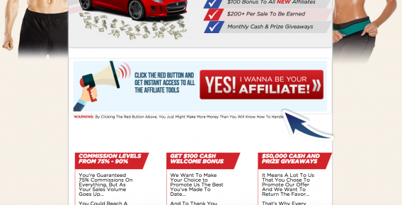](https://cxl.com/wp-content/uploads/2017/02/Screen-Shot-2017-01-31-at-1.37.58-PM.png)

They tend to be used either to point to a CTA or form or to push you further down a landing page. Here’s an example of the former:

[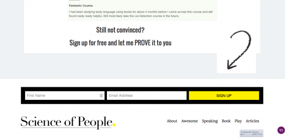](https://cxl.com/wp-content/uploads/2017/02/Screen-Shot-2017-02-01-at-2.25.14-PM.png)

In the latter case, a strong directional cue is contextual and answers the following questions for your visitors…

*   Is there content below or beside this point?
*   Will that content be interesting / valuable to me?
*   How long can I expect to scroll for?

Shanelle Mullin gave a great example in a [past CXL article](https://cxl.com/false-bottom/):

[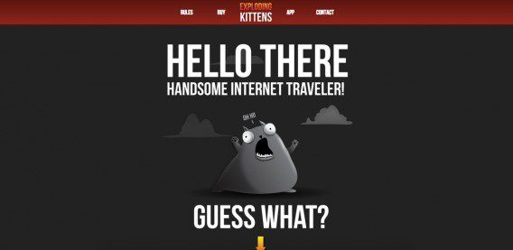](https://cxl.com/wp-content/uploads/2017/02/explodingkittens_top-1-568x277.jpg)

There’s the start of an arrow at the bottom of the screen. When you begin to scroll, here’s what you see:

[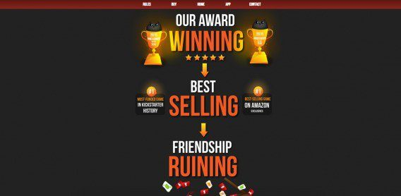](https://cxl.com/wp-content/uploads/2017/02/explodingkittens_bottom-1-568x278.jpg)

Very strong directional cues that pull you in a linear direction down the page.

Another example comes from an Instapage landing page. Without the arrow, it’s hard to see without the context of the headline that there is more content below the fold:

**Direct Pointing**

Similar to arrows is the human pointing directional cue. Again, this is very often used to bring emphasis to a message, form, or CTA. Here’s our old homepage:

[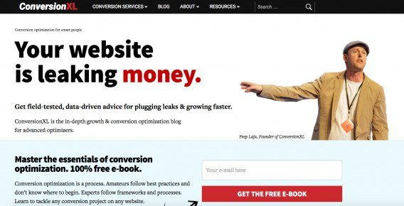](https://cxl.com/wp-content/uploads/2017/02/Screen-Shot-2016-05-06-at-11.25.48-AM-1-568x290.jpg)

Then here’s an example from Basecamp ([shared by Pagewiz](http://www.pagewiz.com/blog/conversion-rate-optimization/directional-cues)):

**Triangles**

Triangles are pretty much the same as arrows, but more subtle:

[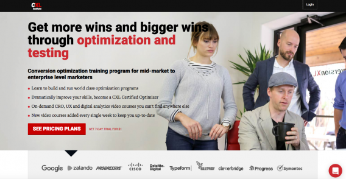](https://cxl.com/wp-content/uploads/2017/02/Screen-Shot-2017-01-31-at-1.24.53-PM.png)

The return-to-top button is a popular iteration for blogs and long form content.

When do you want to return to the top? Typically when you’ve hit the bottom of the page. Having a return-to-top button that scrolls with the visitor can be helpful, but it can easily signal the end of the page if you’re not careful. Transitional cues become even more important.

If you’re a regular CXL reader, you’re familiar with our return-to-top button, which follows you as you read…

[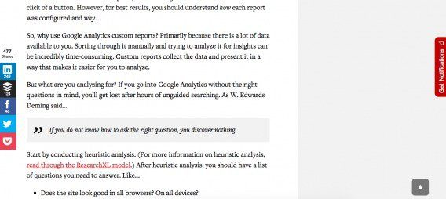](https://cxl.com/wp-content/uploads/2017/02/conversionxl_returntotop-568x254-1.jpg)

Since most of our articles are between 1,500-3,500 words long, a return-to-top button makes sense.

Also, given the nature of our site, it’s relatively difficult to assume you’ve reached the end of the page when you haven’t. If you’re scanning, you can see how much content is left using the scroll bar. If you’re reading, you won’t assume the article ends on “Does the site look good in all browsers? On all devices?” Since it’s a blog, you’ll expect that the page is coming to an end when you reach the author bio and comments.

Triangles are often used quite subtle for usability purposes. WordPress uses it as an indentation to let you know which tab you’re currently in:

[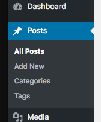](https://cxl.com/wp-content/uploads/2017/02/Screen-Shot-2017-02-01-at-1.42.40-PM.png)

**Horizontal Navigation Cues**

[According to NN/g research](https://www.nngroup.com/articles/horizontal-scrolling/), even strong cues such as arrows often remain unnoticed in the case of horizontal scrolling. People expect to scroll vertically, not sideways. Sideways scrolling goes against their accepted paradigm of website content and behavior.

This may be evolving with increased mobile and tablet use, but no matter what, it can be helped by the use of strong visual cues.

[Instapage](https://instapage.com/blog/what-are-visual-cues) gave a great example where [Lumosity](https://www.lumosity.com/) used directional cues for navigation:

**Human Visual Cues**

Marketers know that using [images of humans](http://www.practicalecommerce.com/articles/99993-niehaus-choosing-images3) in their advertisements helps to increase engagement and usually emotional reaction to the ad.

This is also known as deictic gaze, and it works because, as [Instapage put it,](https://web.archive.org/web/20170203122059/https://instapage.com/blog/6-cognitive-biases-affecting-your-conversion-rates) “when we see someone looking at something, our brains act reflexively, and we start looking at that object as well.”

[Neville Medhora teaches people to be great copywriters](http://kopywritingkourse.com/), and on his website he uses his own image as a hero shot which is also a great example of a directional cue (he’s looking right at the email opt-in)…

[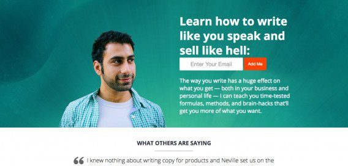](https://cxl.com/wp-content/uploads/2017/02/Screen-Shot-2016-05-06-at-11.38.50-AM-1-568x272.jpg)

[Vanessa Van Edwards](https://www.scienceofpeople.com/) uses her [hero image](https://cxl.com/hero-image/) very well, standing alone in front of a crowd and gazing at the (very relevant) [value proposition](https://cxl.com/blog/value-proposition-examples-how-to-create/):

[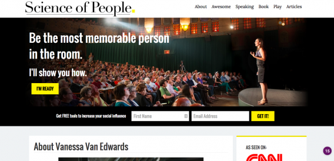](https://cxl.com/wp-content/uploads/2017/02/Screen-Shot-2017-02-01-at-2.23.38-PM.png)

Here’s another recent example from the [ACLU](https://www.aclu.org/), who, despite using Trump as a call-to-action in a fight against him kind of way, uses the image of Trump gazing at the donate button:

[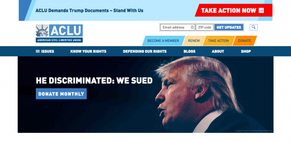](https://cxl.com/wp-content/uploads/2017/02/Screen-Shot-2017-02-01-at-11.41.19-AM.png)

Then there’s this example from [BarkBox](http://barkbox.com/), which isn’t really a human, but does the same trick:

**Encapsulation/Emphasis**

[As Elisa Silverman wrote on the Pagewiz blog](http://www.pagewiz.com/blog/conversion-rate-optimization/directional-cues), “encapsulating important copy within a discrete area also highlights that area for special attention.”

This example from Instacart quite clearly delineates the relevant hero shot and the center form field where you start the purchase process.

Encapsulation is another example of a more subtle visual cue. It’s not as conspicuous as a hand drawn arrow, but when executed properly, can be incredibly effective at driving attention to forms and at driving conversions.

Which Visual Cues Work Best?
-----------------------------------------------------------------------------------------------

There you have it: visual cues, done the right way, can improve user experience and in turn increase conversions. But when you consider the vast amount of different kinds of visual cues that are available, things become complicated.

You could use arrows, lines, photos of people, borders, pointing fingers, bright banners, exclamation points, check marks…the list goes on. So which visual cues work best?

We were curious, so we conducted a study through [CXL Institute](https://cxl.com/institute/).

To conduct this study we ran eye tracking tests on six altered images:

[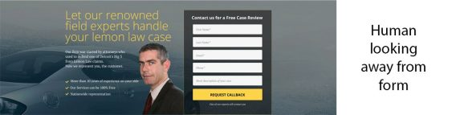](https://cxl.com/wp-content/uploads/2017/02/humanlookingaway.jpg)

[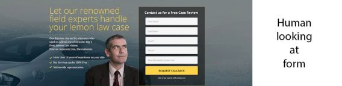](https://cxl.com/wp-content/uploads/2017/02/humanlooking.jpg)

[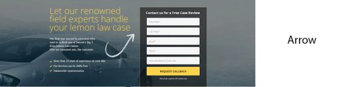](https://cxl.com/wp-content/uploads/2017/02/arrow.jpg)

[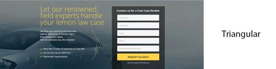](https://cxl.com/wp-content/uploads/2017/02/triangular.jpg)

[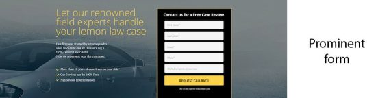](https://cxl.com/wp-content/uploads/2017/02/promenient.jpg)

[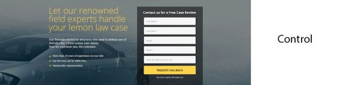](https://cxl.com/wp-content/uploads/2017/02/control.jpg)

We looked at both the average time spent fixating on the form and the average time to first fixation on the form. We also did a post-test question, asking, “Considering the web page you just saw, what would your next step be in getting in touch with this law firm?”

If participants answered that they would fill out the form to get in contact with the firm, the visual cue was considered effective at directing attention to the form and thus increasing the probability of recall.

So what happened?

So, while every site is different, here’s some empirical data that says you should perhaps test hand-drawn directional objects (e.g. an arrow) for guiding the attention of users.

Also, if you use an image of a human as a visual cue, have this person looking in the direction of the CTA or key feature. The human looking away was the worst in terms of fixation time.

When Best Practices Fail (or What to Avoid)
----------------------------------------------------------------------------------------------------------------------------

There’s really just one heuristic to follow, albeit a difficult and perhaps subjective one: visual cues that don’t aid the user to a desired action only distract from it.

It’s similar to the old maxim, “Perfection is achieved not when there is nothing more to add, but when there is nothing left to take away.”

When implementing visual cues, don’t go crazy: let your goals lead your design. And don’t always follow the [“best practices.”](https://cxl.com/blog/conversion-optimization-best-practices-fail/)

While images or visual cues themselves may draw more attention, if they are irrelevant or distracting from the main purpose of the page, they could be damaging.

Research has shown that [people do look where others are looking](http://miratech.com/blog/eye-tracking-men-are-pervs2.html), but the effect is less present in people on [different parts of the Autism scale](http://web.mit.edu/sinhalab/Papers/redcay_etal2012.pdf) and also [varies by gender](http://www.gu.se/english/research/publication?publicationId=140283) and [even political temperament](http://www.unl.edu/polphyslab/politics%20of%20attention.pdf). In addition, an[eyetracking study by EyeQuant](http://web.archive.org/web/20170204172729/http://blog.eyequant.com/2014/01/15/the-3-most-surprising-insights-from-a-200-website-eye-tracking-study/) showed that gaze cueing and faces are not as powerful as marketers tend to believe.

In this example from Felix + Iris, the human image looking at the CTA/value prop performed worse than a product image:

Visual processing is complicated and must be tested. There’s no silver bullet (not even a silver hand-drawn arrow).

Since we process images so much quicker than text, you can convey a lot of information through photos, but they need to be used thoughtfully and carefully because the magnetism of a photo used incorrectly can end up being a distraction.

When choosing photos, think about how images reinforce or distract from your unique value proposition. If your value proposition is around emotions, faces could work well. If not, consider a product shot or informational graphic.

Conclusion
------------------------------------------------------------

Visual cues are a crucial part of effective design. They can be used to direct attention in a certain direction, emphasize key elements, and inspire action.

As with many things UX or CRO related, it’s part art and part science. There’s a lot of creativity that goes into effective landing page design, but we have a good amount of data to suggest best practices (like the studies above).

And of course, you have to test it all for yourself (no one’s audience is exactly the same nor do they respond the same way).
