Title: What are Visual Cues?

URL Source: https://www.interaction-design.org/literature/topics/visual-cues

Published Time: 2017-03-28T11:39:27+00:00

Markdown Content:
Visual cues are elements such as arrows, icons or [typography](https://www.interaction-design.org/literature/topics/typography "What is Typography?") that guide users towards certain actions or content in an interface. Designers use them to draw attention, suggest a course of action, or give users feedback. Visual cues also help create a [visual hierarchy](https://www.interaction-design.org/literature/topics/visual-hierarchy "What is Visual Hierarchy?"), so interfaces are more intuitive and easier to navigate.

Table of contents

1.   [What are Visual Cues?](https://www.interaction-design.org/literature/topics/visual-cues#what_are_visual_cues?-0)
2.   [Why are Visual Cues Important?](https://www.interaction-design.org/literature/topics/visual-cues#why_are_visual_cues_important?-1)
    1.   [1. Enhance User Experience](https://www.interaction-design.org/literature/topics/visual-cues#1._enhance_user_experience-2)
    2.   [2. Boost Conversion Rates](https://www.interaction-design.org/literature/topics/visual-cues#2._boost_conversion_rates-3)
    3.   [3. Improve Accessibility](https://www.interaction-design.org/literature/topics/visual-cues#3._improve_accessibility-4)
    4.   [4. Reinforce Brand Identity](https://www.interaction-design.org/literature/topics/visual-cues#4._reinforce_brand_identity-5)

3.   [Examples of Visual Cues in UX and UI Design](https://www.interaction-design.org/literature/topics/visual-cues#examples_of_visual_cues_in_ux_and_ui_design-6)
    1.   [Explicit visual cues](https://www.interaction-design.org/literature/topics/visual-cues#explicit_visual_cues-7)
    2.   [Implicit visual cues](https://www.interaction-design.org/literature/topics/visual-cues#implicit_visual_cues-8)
    3.   [Examples of Visual Cues in UX and UI Design include:](https://www.interaction-design.org/literature/topics/visual-cues#examples_of_visual_cues_in_ux_and_ui_design_include:-9)
        1.   [1. Arrows](https://www.interaction-design.org/literature/topics/visual-cues#1._arrows-10)
        2.   [2. Buttons (and Similar Controls)](https://www.interaction-design.org/literature/topics/visual-cues#2._buttons_(and_similar_controls)-11)
        3.   [3. Color](https://www.interaction-design.org/literature/topics/visual-cues#3._color-12)
        4.   [4. Contrast](https://www.interaction-design.org/literature/topics/visual-cues#4._contrast-13)
        5.   [5. Typography](https://www.interaction-design.org/literature/topics/visual-cues#5._typography-14)
        6.   [6. Icons](https://www.interaction-design.org/literature/topics/visual-cues#6._icons-15)
        7.   [7. White Space](https://www.interaction-design.org/literature/topics/visual-cues#7._white_space-16)
        8.   [8. Textures](https://www.interaction-design.org/literature/topics/visual-cues#8._textures-17)
        9.   [9. Motion](https://www.interaction-design.org/literature/topics/visual-cues#9._motion-18)
        10.   [10. Hover Effects](https://www.interaction-design.org/literature/topics/visual-cues#10._hover_effects-19)
        11.   [11. Feedback Messages](https://www.interaction-design.org/literature/topics/visual-cues#11._feedback_messages-20)
        12.   [12. Images](https://www.interaction-design.org/literature/topics/visual-cues#12._images-21)

4.   [How to Create Effective Visual Cues](https://www.interaction-design.org/literature/topics/visual-cues#how_to_create_effective_visual_cues-22)
    1.   [1. Understand Your Users](https://www.interaction-design.org/literature/topics/visual-cues#1._understand_your_users-23)
    2.   [2. Define the Information Architecture (IA)](https://www.interaction-design.org/literature/topics/visual-cues#2._define_the_information_architecture_(ia)-24)
        1.   [● Organize information into logical categories and hierarchies.](https://www.interaction-design.org/literature/topics/visual-cues#%E2%97%8F%C2%A0_organize_information_into_logical_categories_and_hierarchies.-25)
        2.   [● Consider common user tasks and how users will navigate the interface.](https://www.interaction-design.org/literature/topics/visual-cues#%E2%97%8F%C2%A0_consider_common_user_tasks_and_how_users_will_navigate_the_interface.-26)
        3.   [● Create intuitive navigation schemes.](https://www.interaction-design.org/literature/topics/visual-cues#%E2%97%8F%C2%A0_create_intuitive_navigation_schemes.-27)
        4.   [● Keep simplicity, clarity and findability in mind.](https://www.interaction-design.org/literature/topics/visual-cues#%E2%97%8F%C2%A0_keep_simplicity,_clarity_and_findability_in_mind.-28)
        5.   [● Make important things stand out.](https://www.interaction-design.org/literature/topics/visual-cues#%E2%97%8F%C2%A0_make_important_things_stand_out.-29)
        6.   [● Use established schemes like alphabetical, chronological, geographical, etc. when appropriate.](https://www.interaction-design.org/literature/topics/visual-cues#%E2%97%8F%C2%A0_use_established_schemes_like_alphabetical,_chronological,_geographical,_etc._when_appropriate.-30)
        7.   [● Create information blueprints like sitemaps to visualize the structure.](https://www.interaction-design.org/literature/topics/visual-cues#%E2%97%8F%C2%A0_create_information_blueprints_like_sitemaps_to_visualize_the_structure.-31)
        8.   [● Be consistent yet flexible.](https://www.interaction-design.org/literature/topics/visual-cues#%E2%97%8F%C2%A0_be_consistent_yet_flexible.-32)
        9.   [● Make things obvious and easily accessible.](https://www.interaction-design.org/literature/topics/visual-cues#%E2%97%8F%C2%A0_make_things_obvious_and_easily_accessible.-33)

    3.   [3. Choose the Right Visual Cues](https://www.interaction-design.org/literature/topics/visual-cues#3._choose_the_right_visual_cues-34)
        1.   [● Make the user interface easy on the eye.](https://www.interaction-design.org/literature/topics/visual-cues#%E2%97%8F%C2%A0_make_the_user_interface_easy_on_the_eye.-35)
        2.   [●Let users navigate intuitively and find the most significant elements and features.](https://www.interaction-design.org/literature/topics/visual-cues#%E2%97%8F%C2%A0%C2%A0let_users_navigate_intuitively_and_find_the_most_significant_elements_and_features.-36)
        3.   [●Be consistent with user expectations, system functionality, and the interface style.](https://www.interaction-design.org/literature/topics/visual-cues#%E2%97%8F%C2%A0%C2%A0be_consistent_with_user_expectations,_system_functionality,_and_the_interface_style.-37)
        4.   [●Evaluate the visual cues.](https://www.interaction-design.org/literature/topics/visual-cues#%E2%97%8F%C2%A0%C2%A0evaluate_the_visual_cues.-38)
        5.   [●Use color purposefully.](https://www.interaction-design.org/literature/topics/visual-cues#%E2%97%8F%C2%A0%C2%A0use_color_purposefully.-39)
        6.   [●Use recognizable icons and imagery.](https://www.interaction-design.org/literature/topics/visual-cues#%E2%97%8F%C2%A0%C2%A0use_recognizable_icons_and_imagery.-40)
        7.   [●Consider the best typography and text styling.](https://www.interaction-design.org/literature/topics/visual-cues#%E2%97%8F%C2%A0%C2%A0consider_the_best_typography_and_text_styling.-41)
        8.   [●Guide the user's eye.](https://www.interaction-design.org/literature/topics/visual-cues#%E2%97%8F%C2%A0%C2%A0guide_the_user's_eye.-42)
        9.   [● Use animation purposefully.](https://www.interaction-design.org/literature/topics/visual-cues#%E2%97%8F%C2%A0_use_animation_purposefully.-43)
        10.   [●Provide visual feedback.](https://www.interaction-design.org/literature/topics/visual-cues#%E2%97%8F%C2%A0%C2%A0provide_visual_feedback.-44)
        11.   [● Consider accessibility needs.](https://www.interaction-design.org/literature/topics/visual-cues#%E2%97%8F%C2%A0_consider_accessibility_needs.-45)

    4.   [4. Test and Iterate](https://www.interaction-design.org/literature/topics/visual-cues#4._test_and_iterate-46)

5.   [Best Practices and Tips for Creating Good Visual Cues](https://www.interaction-design.org/literature/topics/visual-cues#best_practices_and_tips_for_creating_good_visual_cues-47)
    1.   [Consistency is Key](https://www.interaction-design.org/literature/topics/visual-cues#consistency_is_key-48)
    2.   [Prioritize Clarity](https://www.interaction-design.org/literature/topics/visual-cues#prioritize_clarity-49)
    3.   [Make Use of Gestalt Principles](https://www.interaction-design.org/literature/topics/visual-cues#make_use_of_gestalt_principles-50)

6.   [Learn More about Visual Cues](https://www.interaction-design.org/literature/topics/visual-cues#learn_more_about_visual_cues-51)
7.   [Questions related to Visual Cues](https://www.interaction-design.org/literature/topics/visual-cues#questions_related_to_visual_cues-52)

Why are Visual Cues Important?
------------------------------

In [user experience (UX) design](https://www.interaction-design.org/literature/topics/ux-design "What is User Experience Design?") and [user interface (UI) design](https://www.interaction-design.org/literature/topics/ui-design "What is User Interface (UI) Design?"), visual cues are like traffic signs on roads. Another name for them is direction cues. They guide users through interfaces, and help make digital [navigation](https://www.interaction-design.org/literature/topics/navigation "What is Navigation in UX/UI Design?") effortless, intuitive and—ideally—enjoyable. They direct attention, subtly hinting at what users should do next. As a result, users find it easier to complete tasks. If users have an easy time moving from task to task, they won’t have to think about the user interface and can enjoy a seamless experience.

An essential part of these cues is how they fit within [visual design](https://www.interaction-design.org/literature/topics/visual-design "What is Visual Design?") and the purpose of each screen or page you design. The tiniest and subtlest details will affect how your users think and feel. So, when you design visual cues, it’s important that they complement a good-looking design overall. These cues are far more than [aesthetic](https://www.interaction-design.org/literature/topics/aesthetics "What are Aesthetics in UX/UI Design?") embellishments. They are functional visual elements that contribute to a more effective and enjoyable user experience throughout.

Visual cues are vital to include in digital products like websites and applications for many reasons, especially because they:

### 1. Enhance User Experience

Visual cues make interfaces user-friendly. They guide users through the interface, making it easier to navigate and interact with. They also help reduce cognitive load since they provide clear and predictable patterns.

### 2. Boost Conversion Rates

Visual cues can direct users toward desired actions. These could be signing up for a service, making a purchase, filling out a form, or other objectives. Because they guide users to these critical points, visual cues can significantly improve [conversion rates](https://www.interaction-design.org/literature/topics/conversion-rates "What are Conversion Rates?").

### 3. Improve Accessibility

Visual cues can improve the [accessibility](https://www.interaction-design.org/literature/topics/accessibility "What is Accessibility?") of your digital design interface. They can help users with disabilities understand and navigate the site or app more easily. For instance, [color](https://www.interaction-design.org/literature/topics/color "What is Color in UX Design?") contrast can help users who experience difficulties with color vision distinguish between different elements.

### 4. Reinforce Brand Identity

Consistent use of visual cues can also help reinforce brand identity. When you consistently use specific colors, typography, and icons, you can make your brand more recognizable and memorable.

Sage Intacct’s page here clearly shows the explicit visual cue of an arrow, and encapsulates the field for users to enter to answer a call to action.

© Sage Intacct, Fair Use

Examples of Visual Cues in UX and UI Design
-------------------------------------------

You can implement visual cues in numerous ways. These will depend on your users’ contexts and the specific requirements of your user interface. There are two types of visual cues: explicit and implicit.

### Explicit visual cues

These are easy to notice because they are obvious. For example, these could be arrows that point to desired calls to action or magnifying lenses that highlight desired information.

### Implicit visual cues

These are more subtle, but still can be as effective to direct users’ attention. For example, good color contrast will guide users’ eyes, as will text that you encapsulate in a box.

### Examples of Visual Cues in UX and UI Design include:

#### 1. Arrows

Arrows are explicit visual cues that guide users in a particular direction. You can use them to indicate the direction of swipe in a carousel or to suggest that more content is available below the fold.

Nutshell uses an arrow to enhance a clear call-to-action button.

© Nutshell, Fair Use

#### 2. Buttons (and Similar Controls)

Buttons with borders, shading or color suggest clickability. Familiar shapes like rounded rectangles tell users that they are buttons. Along with conventional interface buttons, there are also controls like:

*   **Toggle Switches:** Toggle switches [visually represent](https://www.interaction-design.org/literature/topics/visual-representation "What is Visual Representation?") binary choices (on/off, enable/disable) and are often used for settings or options.

*   **Slider Bars:** Slider bars allow users to select a value within a range. They provide a clear visual indication of the available options and the user's current selection.

*   **Checkbox and Radio Buttons:** These elements use visual cues such as checkboxes and circles with or without checkmarks to let users select from multiple options.

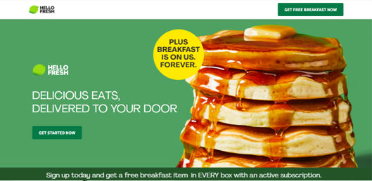

HelloFresh’s homepage features clear buttons in a tempting design.

© HelloFresh, Fair Use

#### 3. Color

You can use color to highlight important elements, and communicate meaning effectively with, for example, red to alert users to errors. And a brightly colored button—in green, for example—can indicate that it's an interactive element for a call to action.

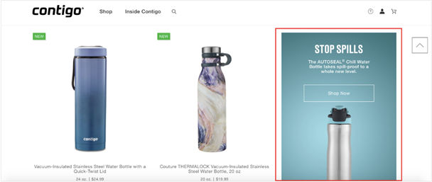

Contigo uses color and contrast to highlight a product on their site.

© Contigo, Fair Use

#### 4. Contrast

You can use contrast to highlight important elements and make them stand out from the rest of the design. You can do this by using color, size, or typography.

#### 5. Typography

Different fonts, sizes, weights, and styles of type can serve as visual cues. Use bold or larger fonts to indicate headings, for example, and smaller lightweight fonts for body text. Also, hyperlinks can be underscored or colored differently to distinguish them from regular text.

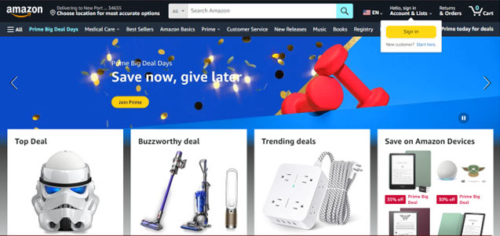

Amazon’s homepage showcases a wealth of typographical visual cues.

© Amazon, Fair Use

#### 6. Icons

Icons are common visual cues in interfaces. You can use them to represent actions (like a trash bin for delete), content types (like a camera for photos), or navigation items (like a home icon for the homepage). If you design them well, you won’t need to include labels since they will be intuitive to users.

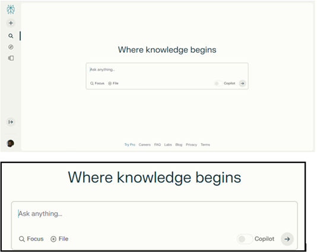

Perplexity uses the familiar icons of a magnifying glass and encircled plus sign to indicate focus and uploading functionality to users. Also note the generous amount of white space.

© Perplexity, Fair Use

#### 7. White Space

White space, or [negative space](https://www.interaction-design.org/literature/topics/negative-space "What is Negative Space?"), can also serve as a visual cue to help give a good sense of balance and organization. You can use it to group or separate elements and to draw attention to specific parts of the interface. Because it gives important elements more breathing room, it’s especially helpful.

#### 8. Textures

You can replicate the appearance of real-world objects in a two-dimensional interface with the illusion of texture. For example, shadows put emphasis on the point that users can press a button.

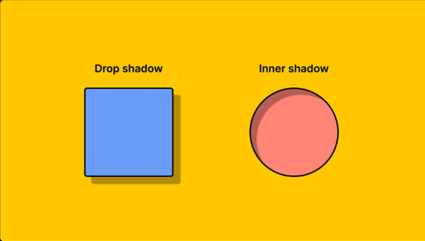

Figma shows two types of shadow use in its Learn section.

© Figma, Fair Use

#### 9. Motion

Animation and microinteractions guide the user through flows. A pulsating icon can show something is loading, for example.

Gif showing swirling loading animation.

Use of motion to signal that loading is in progress.

© Interaction Design Foundation, CC BY-SA 4.0

#### 10. Hover Effects

Hover effects, such as changing the color or adding an underline to links or buttons when users hover their cursor over them, provide feedback that an element is interactive.

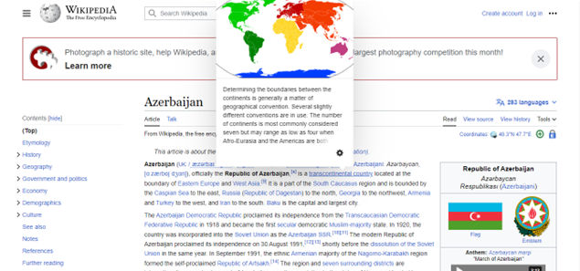

When a user hovers over Wikipedia links, they can preview the page connected to the article.

© Wikipedia, Fair Use

#### 11. Feedback Messages

Visual cues like success messages (e.g., green checkmarks) or error messages (e.g., red “X”s) give immediate feedback on an action’s outcome.

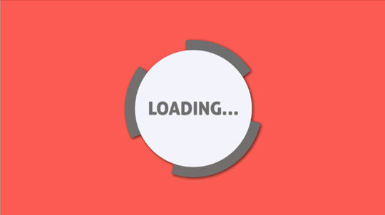

Feedback cues, such as a “Loading…” message after a button press, keep users in the loop.

© Matt Mattson, Fair Use

#### 12. Images

Relevant photos and illustrations enhance engagement. Images can also help users understand complex topics. They can also easily point the way. Faces, for example, are great tools to indicate that what the person shown is looking at is where users should look too.

iCIMS uses pictures of people to guide users’ eyes to the relevant field.

© iCIMS, Fair Use

How to Create Effective Visual Cues
-----------------------------------

Creating effective visual cues requires a thoughtful approach. Here's a step-by-step guide on how to do it:

### 1. Understand Your Users

Start by understanding your target users well. Consider their needs, preferences, and potential challenges as they seek to achieve a goal. This understanding will help you create products with visual cues that are relevant and effective for your [product design](https://www.interaction-design.org/literature/topics/product-design "What is Product Design?").

It’s vital to understand the exact goals and needs of your users across a wide range of contexts. Conduct [user research](https://www.interaction-design.org/literature/topics/user-research "What is User Research?") through [surveys](https://www.interaction-design.org/literature/topics/surveys "What are UX Surveys?"), interviews, etc. This will help you determine what your users are trying to accomplish, what information they need, and what pain points your design should accommodate.

00:00

02:01

Show Hide video transcript

1.   00:00:00 --> 00:00:31

How many times have you heard there's been a big accident and people say, "Oh, it was human error. The person didn't do the right thing at the right point. They didn't notice something and things went wrong." So, just imagine instead the wing falls off the plane because there's metal fatigue where the wing joined the plane. But you wouldn't say what was metal error. You'd say it's a design error because the designer of the plane, the engineers, the detailed designers should have understood the nature of metal and the fact that you do get metal

2.   00:00:31 --> 00:01:02

fatigue after a while. You should either design it so that where there's metal fatigue it doesn't fundamentally mean the plane will crash or you design it so that you can detect when that metal fatigue is happening and then take preventive maintenance. There are a number of strategies you got because you understand metal as a material has known ways of failing. We as humans have limits and constraints and ways that we fail in the sense we don't always do things

3.   00:01:02 --> 00:01:30

in the perfect way. Just like a piece of metal doesn't. As a designer, your job is to understand those limitations of people as actors in the system and ensure the design of the system as a whole works even when those happen. So whenever you hear about human error, it was human error, but typically it wasn't the operator or the pilot or the nurse or the doctor in the hospital. It

4.   00:01:30 --> 00:01:57

was typically the designer of the system that's there. If you treat users as well as a piece of metal, you probably are dealing with them a lot better than they usually are dealt with. The user is at the heart of what you do. But understand those users, understand the nature of them, and that's when you'll start to treat them, far better, hopefully, than a piece of metal.

*     

### 2. Define the Information Architecture (IA)

[Information architecture](https://www.interaction-design.org/literature/topics/information-architecture "What is Information Architecture (IA)?") refers to the structure and organization of information in your interface. The IA is a crucial part of any kind of [interaction design](https://www.interaction-design.org/literature/topics/interaction-design "What is Interaction Design (IxD)?"). A well-defined information architecture will help guide the placement and usage of visual cues. Some tips to define your IA are:

#### ● Organize information into logical categories and hierarchies.

Group related content together and structure it from general to more specific. Use clear category labels and headers.

#### ● Consider common user tasks and how users will navigate the interface.

The information architecture should map to the most logical workflow for users.

#### ● Create intuitive navigation schemes.

Use menus, links, tabs, search, etc. to help users easily find what they need. Aim for simple and consistent navigation.

#### ● Keep simplicity, clarity and findability in mind.

Don't overload the architecture with too many levels or unnecessary complexity.

#### ● Make important things stand out.

Use colors, contrast, grouping, white space and other [Gestalt principles](https://www.interaction-design.org/literature/topics/gestalt-principles "What are the Gestalt Principles?") to draw attention to the most important elements and help users interpret the content best.

#### ● Use established schemes like alphabetical, chronological, geographical, etc. when appropriate.

Rely on conventions that users are already familiar with.

#### ● Create information blueprints like sitemaps to visualize the structure.

This will help you identify any holes or issues with the architecture.

#### ● Be consistent yet flexible.

Stick to common patterns and languages but allow for modifications if needed

#### ● Make things obvious and easily accessible.

Use labels, menus and search functionality to make each piece of information easily accessible for users who need it to complete tasks.

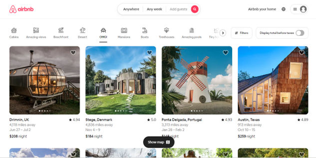

Airbnb’s information architecture and understanding of their users is evident in their iconic and highly intuitive site.

© Airbnb, Fair Use

### 3. Choose the Right Visual Cues

Now it’s time to choose the right visual cues. Consider the type of cues (implicit or explicit), the style, and how they fit in with the overall design language of your interface. Consider these tips to help you design the best cues:

#### ● Make the user interface easy on the eye.

Users should be able to scan the screen properly in seconds. Use a simple and consistent design that they can easily understand.

#### ●Let users navigate intuitively and find the most significant elements and features.

Show them the way to where they want to go with well-considered directional cues such as arrows, pointers and eye lines.

#### ●Be consistent with user expectations, system functionality, and the interface style.

For example, use concise and descriptive labels, recognizable and scalable icons, contrastive and accessible colors, and meaningful, relevant, and helpful visual cues.

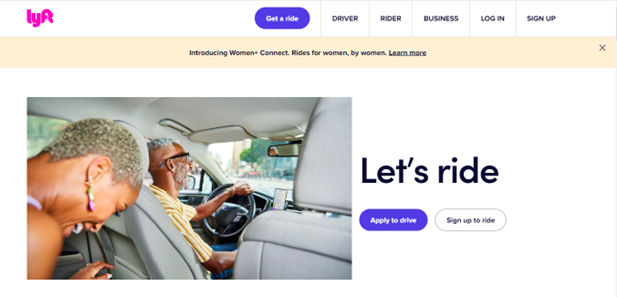

Lyft’s homepage provides users with the sort of aesthetics and functionality they would expect for either booking a ride or signing up to drive.

© Lyft, Fair Use

#### ●Evaluate the visual cues.

Check that the visual cues afford the possible actions or functions of the UI elements; signify their meaning or purpose; group and relate them according to their similarity, proximity, or hierarchy; and map the relationship between the interface element and its effect or outcome. Here, it may be helpful to think of [affordances](https://www.interaction-design.org/literature/topics/affordances "What are Affordances?") and signifiers. For example a door is an affordance and its push plate to open it is a signifier. Balance the appropriate number, size, and intensity of visual cues; avoid clutter, noise, or redundancy.

#### ●Use color purposefully.

Different colors can convey different meanings and emotions. For example, red for errors or warnings, green for success, blue for information.

#### ●Use recognizable icons and imagery.

Choose icons that are commonly understood by most users, like a magnifying glass for search or a shopping cart for checkout. Avoid ambiguous or overly complicated icons.

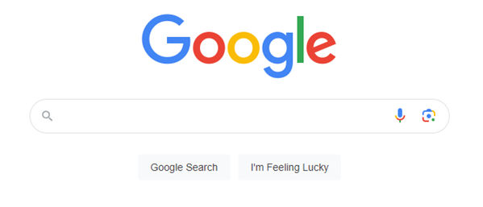

This zoomed-in screenshot of Google.com shows their easy-on-the-eye interface featuring search icons for typing (magnifying glass icon), voice search (microphone icon) and image search (camera icon).

© Google, Fair Use

#### ●Consider the best typography and text styling.

Bold, larger text can help highlight important content or headings. Underlined or colored text can indicate interactive elements. Consistent font choices and sizes help reinforce information hierarchy.

#### ●Guide the user's eye.

Use visual elements like lines, arrows, or boxes to connect related content or lead the eye through a logical progression.

#### ● Use animation purposefully.

Subtle animations can help convey relationships, transitions, interactions, but avoid gratuitous motion that distracts.

#### ●Provide visual feedback.

Changes in elements, like color, help confirm user actions like hover states, clicks, loading, errors.

#### ● Consider accessibility needs.

Don't rely solely on color cues. Accommodate color blindness, low vision, and screen reader users.

### 4. Test and Iterate

Like any other aspect of design, it’s important to do [user testing](https://www.interaction-design.org/literature/topics/user-testing "What is User Testing?") on your design’s visual cues. From there, you can refine them as needed. Gather feedback from users and use it to improve your visual cues. For example, do your cues work as well on mobile devices as on desktop? Remember, the goal is to enhance the user experience, and continuous [usability](https://www.interaction-design.org/literature/topics/usability "What is Usability?") testing and [iteration](https://www.interaction-design.org/literature/topics/design-iteration "What is Design Iteration?") are key to achieving this.

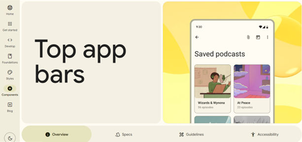

Google’s Material Design features a wealth of design tools you can leverage to make the most effective visual cues for your users, whoever they may be.

© Google, Fair Use

Best Practices and Tips for Creating Good Visual Cues
-----------------------------------------------------

To design effective visual cues, it takes a blend of understanding [user behavior](https://www.interaction-design.org/literature/topics/user-behavior "What is User Behavior?"), [design principles](https://www.interaction-design.org/literature/topics/design-principles "What are Design Principles?"), and iterative testing. Here are some best practices and tips for creating good visual cues:

### Consistency is Key

Maintain consistency in the use of visual cues across your interface. Consistent cues help users learn how to interact with your interface faster, enhancing usability and user satisfaction.

### Prioritize Clarity

Visual cues should be clear and unambiguous. Avoid using abstract or complex icons as cues, as they may confuse users. When in doubt, stick to explicit cues like arrows or text instructions.

### Make Use of Gestalt Principles

Gestalt principles are rules about how our eyes perceive visual elements. These principles, like similarity, proximity, and closure, are extremely helpful when you want to design effective visual cues. There are many principles to choose from. So, leverage them in a way that works best for your users and your brand image.

Remember, the goal of using visual cues is to enhance the user experience, guiding users seamlessly through an interface while also making it aesthetically pleasing. So, whether you’re a [web designer](https://www.interaction-design.org/literature/topics/web-design "What is Web Design?"), working on mobile apps, or involved in the design of any other product or service where users interact with visual elements, it’s vital to ensure you have the best visual cues in place for your target audience.

Learn More about Visual Cues
----------------------------

Take our course, [Visual Design: The Ultimate Guide](https://www.interaction-design.org/courses/visual-design-the-ultimate-guide).

Read our piece on [Signifiers](https://www.interaction-design.org/literature/topics/signifiers) for further insights.

See Tubik’s highly insightful article for in-depth points and examples: [Hit The Road: Direction Cues in User Interface Design](https://uxplanet.org/hit-the-road-directional-cues-in-user-interface-design-1f9d2e368af7)

Read this deeply informative article by Brian Massey for crucial insights: [https://conversionsciences.com/visual-cues/](https://conversionsciences.com/visual-cues/)

What are some common text features and visual cues?

Common text features and visual cues are important elements in visual design that help users understand and navigate content. Some common text features include:

- **Headings:** These help break up content and make it easier to scan.

- **Bulleted and numbered lists:** These help organize information and make it easier to read.

- **Bold and italicized text:** These can be used to emphasize important information.

Visual cues are also important in visual design. Some common visual cues include:

- **Color:** You can use color to create contrast, highlight important information, and create a visual hierarchy.

- **Icons and images:** You can use these to help users quickly understand content and navigate a website.

- **Whitespace:** You can use this to create a clean and organized layout, and make content easier to read.

What are examples of visual cues?

Visual cues are concrete visible stimuli that draw attention, highlight information, trigger memory, or give clues. Examples of visual cues include:

**Icons and symbols:** These are simple images that represent an object, idea, or action.

**Color:** You can use color to convey meaning, create contrast, and draw attention to important elements.

**Images and illustrations:** You can use these to provide context, demonstrate a process, or illustrate a concept.

**Typography:** You can use different fonts, sizes, and styles to help organize information and create a visual hierarchy.

What types of visual cues are most effective for website navigation?

Here are some of the most effective types of visual cues for website navigation:

**- Color Contrast:** Use contrasting colors for navigation elements against the background; it can make them stand out and easily identifiable. For instance, a bright color for a 'Call to Action' button on a muted background draws attention immediately.

**- Icons and Symbols:**Use universally recognized icons or symbols to quickly convey the purpose of a navigation element. For example, a magnifying glass icon for search or a house icon for the home page.

**- Typography and Size:**Differentiate navigation text through bold typography, size, or font to help users distinguish navigation elements from regular content. Larger and bolder fonts are often more noticeable.

**- Whitespace:** Effective use of it around navigation elements can help them stand out. This avoids clutter and makes the navigation more user-friendly.

**- Hover Effects:** Interactive elements like hover effects can indicate to users that an item is clickable. It also adds a layer of responsiveness to the user experience.

**- Breadcrumb Trails:**These give users a clear path of where they are in the site structure. It's a secondary navigation scheme that reveals the user's location in a website.

**- Animated Transitions:** Smooth transitions can guide users' attention to changes or important navigation elements, making the experience more dynamic and engaging.

**- Consistent Layout:**Keep navigation elements consistently placed (like having the menu always at the top) to help users learn the navigation scheme of the site, making it easier to use.

**- Arrows and Lines:**These direct attention and can guide the user's eye towards important navigation elements or show relationships between items.

**- High-Quality Images:**Using striking, high-quality images can draw attention and also be used to guide the user’s gaze towards key navigation elements.

00:00

00:00

Show Hide video transcript

1.   00:00:00 --> 00:00:31

There are two main reasons. The first that it's a legal requirement in almost all countries that you make websites that anyone can use, even if they have reduced abilities. This isn't the best reason, but for organizations with legal compliance is a priority. It can be a very powerful one. The second issue is that we find that accessibility is closely connected with general usability and search engine optimization (SEO). When we do things to improve accessibility,

2.   00:00:31 --> 00:01:01

we end up improving both of these other topics. It turns out that search engine optimization and accessibility have more in common than you might think. They both need to deal with technology that's trying to understand the pages. In the case of accessibility, assistive technology needs to present it to users with reduced abilities who perhaps cannot see it or hear it. So assistive technologies will attempt to present web pages in an appropriate form for those users. For search engines,

3.   00:01:01 --> 00:01:33

the Web crawlers need to understand the contents of the pages so they can be indexed correctly. So the structure of the content needs to make sense in both cases, cascading style sheets can work wonders in making a messy HTML page look brilliant. But style sheets are complex to interpret. Assistive technology and search crawlers may simply ignore them. That means if you're relying on style sheets to present your content in a meaningful order, those adjustments go away. Here are some general guidelines for implementing accessibility in web design.

4.   00:01:33 --> 00:02:04

One of the keys to accessibility is to design for assistive technologies or to at least be aware of assistive technologies. When you're designing, if you're looking at visual impairment then the screen readers are the main assistive technology there. Screen readers take the contents of the screen and read it out to you. They are now built into most platforms by default, including smartphones. But if you want to ensure your website works well, the screen is you should try it out. An accessibility specialist may be helpful in that respect.

5.   00:02:04 --> 00:02:31

Screen readers deal with written content, but an important issue is that we need to provide non text content in alternative media. This is the dreaded ALTtext that you are frequently prompted for when creating images. This is because screen readers are great for reading out text in HTML, but if it happens to be text embedded in an image, it has little hope. And for meaning pictorial images Despite the rise of AI, users are likely to get a description

6.   00:02:31 --> 00:03:01

of what an image shows rather than what it was intended to mean. And just as a quick side note, ALT text with decorative images should always be empty and empty ALT-tag tells assistive technology that is not important and can be ignored. If you've got video clips or audio recordings on your site, you need to provide text alternatives for that. Closed captions and transcripts are best and are now provided automatically by many tools. Of course, one of the real usability advantages of text

7.   00:03:01 --> 00:03:24

alternatives is that you can search them. So if you were looking on your internet or on a website for something that somebody said, then you could find that in the transcript and have the entire text available to you there. But most changes for accessibility do benefit all users, especially when you start to think about how can we simplify this layout? How can we make the whole thing easier to use?

*     

The video "Web Design for Usability" provides insights into designing effective web interfaces, including the use of visual cues for navigation, making it a valuable resource for understanding these principles in practice.

How do visual cues impact the accessibility of a design?

Visual cues play a critical role in enhancing the accessibility of a design since they:

**Enhance Navigation and Orientation:** Visual cues like icons, color coding, and typography guide users through a design. They provide a clear path for navigation, helping users to understand where they are and where they can go next. This is particularly important for users with cognitive disabilities who might find complex navigation challenging.

**Improve Comprehension:** Visual cues can simplify complex information, making it more digestible. For example, icons can represent actions or objects efficiently, reducing the cognitive load for users.

**Facilitate Quick Recognition:** Users, especially those with cognitive or learning disabilities, can recognize and process visual information faster than text. Consistently use visual cues to help users have quicker recognition and understanding of the interface.

**Support Users with Reading Difficulties:** For users with dyslexia or other reading difficulties, visual cues can be a crucial aid. They provide an alternative way to understand content without relying solely on text.

**Assist Users with Visual Impairments:**High-contrast visual cues and large icons help users with visual impairments. Design these cues to be perceivable by screen readers and other assistive technologies.

**Reduce Language Barriers:**Visual cues transcend language barriers and are universally understandable, making a design more accessible to users from different linguistic backgrounds.

What can a mismatch between visual cues and vestibular information cause?

A mismatch between visual cues and vestibular information—information from the vestibular system in the human body, which gives the sense of balance and information about a person’s body position—can lead to motion sickness and disorientation. If the visual information you present on a website or app conflicts with the sensory signals received by the vestibular system (responsible for sense of balance and spatial orientation), it can cause users to feel queasy, dizzy, or uncomfortable. This phenomenon can be particularly problematic in virtual reality (VR), mixed reality (MR) and augmented reality (AR) applications, where users rely heavily on visual cues for spatial awareness. So, for you as a UX designer, ensure that the visual elements align with the user's vestibular experience. Getting that visual input, including visual fields and design elements is crucial in preventing these adverse effects and providing a smooth and pleasant user experience where the sensory input lets users make the most of the virtual world or a wide range of other visual design cases where the human visual system is involved. These pieces of information are vital building blocks to ensure you fine-tune your design’s sensory information to your users in the right way.

What role do color and contrast play in creating effective visual cues?

Color and contrast play a significant role in guiding user interaction and enhancing the usability and accessibility of a design. They do so because they:

**- Attract Attention:** Bright or contrasting colors can draw the user's eye to key areas of a design. This helps guide the user's attention to important elements like call-to-action buttons, alerts, or navigation links.

**- Improve Readability:** High contrast between text and background colors greatly improves readability, especially for users with visual impairments. Adequate contrast ensures that all users, including those with color vision deficiencies, can read the content easily.

**- Convey Mood and Meaning:** Colors can evoke emotions and carry messages. For example, red can signify urgency or error, green can indicate success, and blue can represent calmness or trust.

**- Enhance Accessibility:**However, for users with color blindness or other visual impairments, don’t rely solely on color to convey information. Combine color with other visual cues like patterns, icons, or text labels to ensure that a wide range of users can access information.

**- Create Visual Hierarchies:** Different colors and contrasts can create a visual hierarchy on a page, guiding users through a logical flow of information or interaction steps.

**- Facilitate Recognition:**Consistently use color for similar types of content (like navigation, warnings, or links) to help users quickly recognize and understand the function of each element.

What is the role of typography in providing visual cues?

Typography plays a vital role in providing visual cues within design in these key ways:

**- Hierarchy and Organization:** Typography helps create a visual hierarchy, guiding users to the most important information first. Use varying font sizes, weights, and styles to indicate the order in which users should read the content, making it easier for them to navigate and understand the information.

**- Enhance Readability and Legibility:** Good typography ensures that text is both readable and legible. Clear, well-spaced fonts improve the readability of text, making it easier for users to scan and comprehend the content.

**- Set the Tone and Mood:**The choice of typeface can convey different moods and tones. For example, a serif font might suggest tradition and reliability, while a sans-serif font might appear modern and clean. This helps set the right expectations and mood for the user.

**- Brand Identity:**Typography is a powerful tool for reinforcing brand identity. Consistently use a specific typeface or style across all mediums and you can strengthen brand recognition and recall.

**- Guide User Flow:**Through the strategic placement and styling of typography, you can direct users' attention to different areas of a page or interface, effectively guiding their journey through the content.

**- Accessibility:**Typography also plays a crucial role in accessibility. Good contrast between text and background, along with readable font sizes, ensures that the content is accessible to a wider audience, including those with visual impairments.

What are some highly cited academic papers about visual cues?

Here are some highly cited pieces of research about visual cues:

Duncan, J., & Humphreys, G. W. (1989). Visual search and stimulus similarity. Psychological review, 96(3), 433. **[https://psycnet.apa.org/doiLanding?doi=10.1037%2F0033-295X.96.3.433](https://psycnet.apa.org/doiLanding?doi=10.1037%2F0033-295X.96.3.433)**

This paper proposed a biased competition framework to account for visual search performance. The authors suggested that distractors similar to a target compete more strongly for limited attentional resources. The similarity theory greatly influenced later research on competitive interactions during visual search.

Desimone, R. (1998). Visual attention mediated by biased competition in extrastriate visual cortex. Philosophical Transactions of the Royal Society of London. Series B: Biological Sciences, 353(1373), 1245-1255. **[https://royalsocietypublishing.org/doi/abs/10.1098/rstb.1998.0280](https://royalsocietypublishing.org/doi/abs/10.1098/rstb.1998.0280)**

Itti, L., & Koch, C. (2001). Computational modelling of visual attention. Nature reviews neuroscience, 2(3), 194-203. **[https://www.nature.com/articles/35058500](https://www.nature.com/articles/35058500)**

This highly-cited paper proposed an influential computational model of bottom-up visual attention. The model combines low-level features like color, intensity and orientation to generate a saliency map predicting attention deployment. The work inspired many computer vision models of visual attention.

Treisman, A. M., & Gelade, G. (1980). A feature-integration theory of attention. Cognitive psychology, 12(1), 97-136. **[https://www.sciencedirect.com/science/article/abs/pii/0010028580900055](https://www.sciencedirect.com/science/article/abs/pii/0010028580900055)**

A landmark paper that proposed the influential feature integration theory of attention. It posited that attention is needed to combine separate visual features into coherent object representations. The theory shaped research on visual search, scene perception and binding problems.

Wolfe, J. M. (1994). Guided search 2.0 a revised model of visual search. Psychonomic bulletin & review, 1(2), 202-238. **[https://link.springer.com/article/10.3758/BF03200774](https://link.springer.com/article/10.3758/BF03200774)**

An update to the original Guided Search model that incorporated new findings on visual search. Guided Search 2.0 elaborated the roles of bottom-up and top-down factors in guidance of attention to likely target locations. It remains highly influential in visual search research.

Rensink, R. A. (2000). The dynamic representation of scenes. Visual cognition, 7(1-3), 17-42. **[https://www.tandfonline.com/doi/abs/10.1080/135062800394667](https://www.tandfonline.com/doi/abs/10.1080/135062800394667)**

A seminal paper proposing attention plays a critical role in constructing coherent scene representations from individual objects and features. Rensink suggested focused attention is needed to see change in scenes, shaping later research on change blindness.

What are some of the best books about visual cues?

Here are some of the best books about visual cues:

**- ["Don't Make Me Think"](https://www.amazon.in/Dont-Make-Think-Revisited-Usability/dp/0321965515?crid=1HJBD4HEQ2SXN&keywords=%22Don%27t+Make+Me+Think%22+by+Steve+Krug&qid=1687675267&sprefix=don%27t+make+me+think+by+steve+krug,aps,209&sr=8-3&linkCode=sl1&tag=abhinayrakesh-21&linkId=e69892f6dc65de80afeb254ffd60635e&language=en_IN&ref_=as_li_ss_tl)** by Steve Krug: This book highlights how important clear visual cues, effective information hierarchy, and streamlined interactions are to facilitate seamless user journeys.

**- ["The Design of Everyday Things"](https://www.amazon.in/Design-Everyday-Things-Don-Norman/dp/0465050654?crid=WQM48YVWC779&keywords=%22The+Design+of+Everyday+Things%22&qid=1687675737&sprefix=the+design+of+everyday+things+,aps,620&sr=8-1&linkCode=sl1&tag=abhinayrakesh-21&linkId=ee9af4e8a5037e27335fe22c409564ee&language=en_IN&ref_=as_li_ss_tl)** by Don Norman: This book explores the principles of good design and how you can apply them to everyday objects and experiences. It emphasizes the importance of designing products and interfaces that are intuitive, user-centered, and easy to understand. Norman introduces the concept of affordances: the perceived actions or uses that an object or interface suggests to its users.

**- ["Seductive Interaction Design"](https://www.amazon.in/Seductive-Interaction-Design-Effective-Experiences/dp/0321725522?_encoding=UTF8&qid=1687675789&sr=8-1&linkCode=sl1&tag=abhinayrakesh-21&linkId=8bb269550a3eb7770fab303a57b5d2f5&language=en_IN&ref_=as_li_ss_tl)** by Stephen Anderson: This book delves into the concept of emotional and persuasive design. It highlights how important it is to appeal to users’ desires, motivations, and aspirations. Anderson highlights the importance of designing interfaces that elicit positive feelings, establishing significant bonds, and facilitating pleasurable engagements.

**- ["The Elements of User Experience"](https://www.amazon.in/Elements-User-Experience-User-Centered-Design/dp/0321683684?crid=4FBV9WR3FFEY&keywords=%22The+Elements+of+User+Experience%22&qid=1687675877&sprefix=the+elements+of+user+experience+,aps,275&sr=8-1&linkCode=sl1&tag=abhinayrakesh-21&linkId=c9a1c40f54848667aa3405af6f61d447&language=en_IN&ref_=as_li_ss_tl)** by Jesse James Garrett: This book provides a comprehensive understanding of UX design, spanning from initial brainstorming to ultimate execution. This resource enables you to grasp the art of evaluating and specifying user needs, efficiently organizing information, and crafting intuitive and aesthetically pleasing interfaces.

Where to learn more about visual cues?

- Take our course,**[Visual Design: The Ultimate Guide](https://www.interaction-design.org/courses/visual-design-the-ultimate-guide)**.

- Read our piece **[What are Signifiers?](https://www.interaction-design.org/literature/topics/signifiers)** for further insights.

-See Tubik’s highly insightful article for in-depth points and examples:**[Hit The Road: Direction Cues in User Interface Design](https://uxplanet.org/hit-the-road-directional-cues-in-user-interface-design-1f9d2e368af7)**

-Read this deeply informative article by Brian Massey for crucial insights: **[Why The Visual Cues On Your Site Are All Wrong (And How To Fix Them)](https://conversionsciences.com/visual-cues/)**
