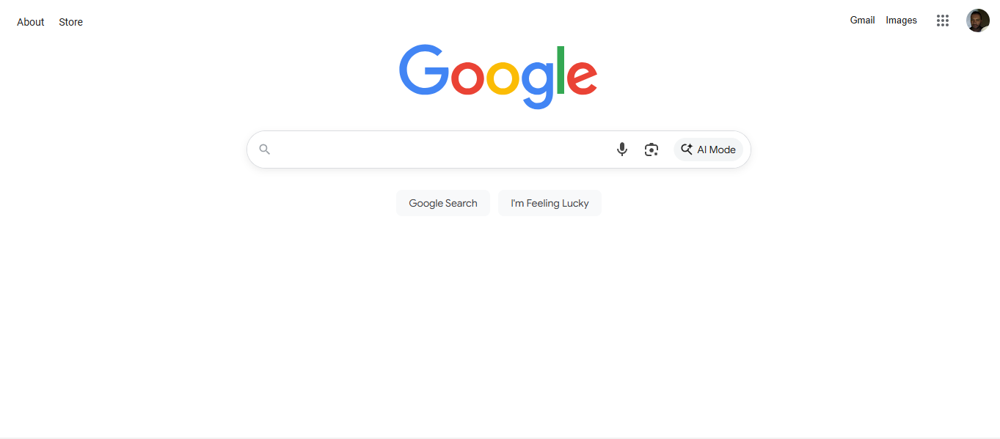
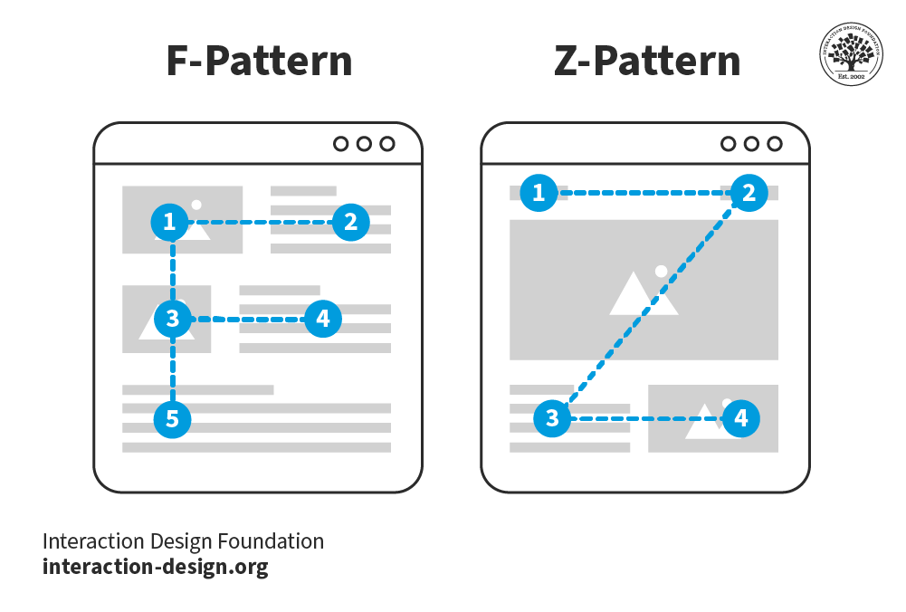
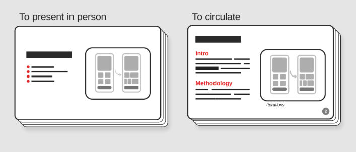

Title: What is Visual Hierarchy?

URL Source: https://www.interaction-design.org/literature/topics/visual-hierarchy

Published Time: 2016-08-31T10:50:16+00:00

Markdown Content:
What is Visual Hierarchy?
-------------------------

Visual hierarchy is the principle of **arranging elements** so that people instantly recognize their **order of importance** on a screen or page. When you use visual hierarchy well, you guide attention, reduce confusion, and make your message easy to follow, and build trust.

Explore the power you can wield on the screen and page when you use effective visual hierarchy, in this video.

00:00

00:00

Show Hide video transcript

1.   00:00:00 --> 00:00:31

Visual hierarchy refers to the arrangement or organization of elements within a design in a way that guides the viewer's eye through the content in a specific order of importance. It's about creating a clear and logical structure that helps users navigate and understand the information presented. You can use size and scale, color and contrast typography, white space

2.   00:00:31 --> 00:01:00

alignment, repetition, proximity, visual elements such as icons, images, textures and graphics and reading patterns. By using these principles effectively, Designers can guide the viewer's focus, ensuring that the most important elements are noticed first and create a more intuitive and engaging experience.

*     

Table of contents

1.   [What is Visual Hierarchy?](https://www.interaction-design.org/literature/topics/visual-hierarchy#what_is_visual_hierarchy?-0)
2.   [How Visual Hierarchy Makes People Listen to You](https://www.interaction-design.org/literature/topics/visual-hierarchy#how_visual_hierarchy_makes_people_listen_to_you-1)
3.   [How to Guide Attention with Visual Hierarchy](https://www.interaction-design.org/literature/topics/visual-hierarchy#how_to_guide_attention_with_visual_hierarchy-2)
    1.   [Size](https://www.interaction-design.org/literature/topics/visual-hierarchy#size-3)
    2.   [Color](https://www.interaction-design.org/literature/topics/visual-hierarchy#color-4)
    3.   [Contrast](https://www.interaction-design.org/literature/topics/visual-hierarchy#contrast-5)
    4.   [Alignment](https://www.interaction-design.org/literature/topics/visual-hierarchy#alignment-6)
    5.   [Repetition](https://www.interaction-design.org/literature/topics/visual-hierarchy#repetition-7)
    6.   [Proximity](https://www.interaction-design.org/literature/topics/visual-hierarchy#proximity-8)
    7.   [White Space](https://www.interaction-design.org/literature/topics/visual-hierarchy#white_space-9)
    8.   [Texture and Style](https://www.interaction-design.org/literature/topics/visual-hierarchy#texture_and_style-10)

4.   [How to Create a Strong Visual Hierarchy: Step-by-Step](https://www.interaction-design.org/literature/topics/visual-hierarchy#how_to_create_a_strong_visual_hierarchy:_step-by-step-11)
    1.   [1. Respect Natural Scanning Patterns](https://www.interaction-design.org/literature/topics/visual-hierarchy#1._respect_natural_scanning_patterns-12)
    2.   [2. Guide Attention with Deliberate Focal Points](https://www.interaction-design.org/literature/topics/visual-hierarchy#2._guide_attention_with_deliberate_focal_points-13)
    3.   [3. Use Recognition over Recall](https://www.interaction-design.org/literature/topics/visual-hierarchy#3._use_recognition_over_recall-14)
    4.   [4. Create a Sense of Ranked Importance](https://www.interaction-design.org/literature/topics/visual-hierarchy#4._create_a_sense_of_ranked_importance-15)
    5.   [5. Leverage Typography](https://www.interaction-design.org/literature/topics/visual-hierarchy#5._leverage_typography-16)
    6.   [6. Be Consistent](https://www.interaction-design.org/literature/topics/visual-hierarchy#6._be_consistent-17)

5.   [Why Clear Slides Can Make You a Successful Presenter](https://www.interaction-design.org/literature/topics/visual-hierarchy#why_clear_slides_can_make_you_a_successful_presenter-18)
6.   [How to Design Slides That Make People Trust You Instantly](https://www.interaction-design.org/literature/topics/visual-hierarchy#how_to_design_slides_that_make_people_trust_you_instantly-19)
    1.   [1. Keep Slides Simple](https://www.interaction-design.org/literature/topics/visual-hierarchy#1._keep_slides_simple-20)
    2.   [2. Use Progressive Disclosure](https://www.interaction-design.org/literature/topics/visual-hierarchy#2._use_progressive_disclosure-21)
    3.   [3. Make the Headline Count](https://www.interaction-design.org/literature/topics/visual-hierarchy#3._make_the_headline_count-22)
    4.   [4. Prioritize White Space](https://www.interaction-design.org/literature/topics/visual-hierarchy#4._prioritize_white_space-23)
    5.   [5. Use Visuals, Not Paragraphs](https://www.interaction-design.org/literature/topics/visual-hierarchy#5._use_visuals,_not_paragraphs-24)
    6.   [6. Apply Consistent Styles](https://www.interaction-design.org/literature/topics/visual-hierarchy#6._apply_consistent_styles-25)
    7.   [7. Think Accessibility](https://www.interaction-design.org/literature/topics/visual-hierarchy#7._think_accessibility-26)

7.   [Examples of Visual Hierarchy in Slides](https://www.interaction-design.org/literature/topics/visual-hierarchy#examples_of_visual_hierarchy_in_slides-27)
    1.   [Example 1: A Slide to Present Research Findings](https://www.interaction-design.org/literature/topics/visual-hierarchy#example_1:_a_slide_to_present_research_findings-28)
    2.   [Example 2: A Slide to Pitch a New Feature](https://www.interaction-design.org/literature/topics/visual-hierarchy#example_2:_a_slide_to_pitch_a_new_feature-29)
    3.   [Example 3: A Slide to Share Data](https://www.interaction-design.org/literature/topics/visual-hierarchy#example_3:_a_slide_to_share_data-30)

8.   [How to Win Attention in Any Room](https://www.interaction-design.org/literature/topics/visual-hierarchy#how_to_win_attention_in_any_room-31)
9.   [Tap a Bonus Benefit: Bring Emotional Intelligence into Visual Hierarchy](https://www.interaction-design.org/literature/topics/visual-hierarchy#tap_a_bonus_benefit:_bring_emotional_intelligence_into_visual_hierarchy-32)
10.   [Learn More about Visual Hierarchy](https://www.interaction-design.org/literature/topics/visual-hierarchy#learn_more_about_visual_hierarchy-33)
11.   [Questions related to Visual Hierarchy](https://www.interaction-design.org/literature/topics/visual-hierarchy#questions_related_to_visual_hierarchy-34)

How Visual Hierarchy Makes People Listen to You
-----------------------------------------------

In UX (user experience) design and UI ([user interface](https://www.interaction-design.org/literature/topics/ui-design "What is User Interface (UI) Design?")) design, **the principle of good visual hierarchy determines whether users can scan a page, find what they need, and take action without friction**. **On a web page**, for example, a bold headline will almost certainly capture attention first, a contrasting button may signal the next step, and clean spacing helps users understand how information is grouped.

**The same applies to [presentations](https://www.interaction-design.org/literature/topics/presentations "What are Presentations?").** If your slides look cluttered, or if every element shouts for attention, your audience won’t know where to look. However, **if you structure your visuals carefully, you’ll control the flow of attention and keep people engaged from beginning to end.**

_“Visual hierarchy controls the delivery of the experience. If you have a hard time figuring out where to look on a page, it’s more than likely that its layout is missing a clear visual hierarchy.”_

_—Kelley Gordon, writing for The Nielsen Norman Group_

Beyond design work, this is about leadership. When you guide people’s attention clearly, they listen, trust you, and remember your ideas. That’s how you succeed in meetings, pitches, or interviews.

How to Guide Attention with Visual Hierarchy
--------------------------------------------

On a web page, app screen, presentation slide, or other design you show to an audience, **you can shape an effective hierarchy with several [visual cues](https://www.interaction-design.org/literature/topics/visual-cues "What are Visual Cues?")**. Here are the most important ones:

### Size

**Larger elements command more attention than smaller ones can.** For example, viewers will notice a headline in 44-point text pretty much right away, and before they find a footnote in 12-point. Use size to highlight your key points so nobody misses them.

### Color

**Bright or saturated colors draw the eye more than muted ones will**, which is why they can help users and viewers notice outstanding elements that are that way for a strategic reason (such as a call-to-action button). Use [color](https://www.interaction-design.org/literature/topics/color "What is Color in UX Design?") carefully to help users notice important elements and such.

### Contrast

**Strong light–dark differences or bold versus thin weights make elements stand out.** This is why contrast is particularly important for viewers with vision disabilities and so forms a part of accessible design. Use contrast mindfully to help users be able to more easily notice important elements and enjoy an accessible design.

Discover why [accessibility](https://www.interaction-design.org/literature/topics/accessibility "What is Accessibility?") helps all users, in this video.

00:00

00:00

Show Hide video transcript

1.   00:00:00 --> 00:00:30

Accessibility ensures that digital products, websites, applications, services and other interactive interfaces are designed and developed to be easy to use and understand by people with disabilities. 1.85 billion folks around the world who live with a disability or might live with more than one and are navigating the world through assistive technology or other augmentations to kind of assist with that with your interactions with the world around you. Meaning folks who live with disability, but also their caretakers,

2.   00:00:30 --> 00:01:01

their loved ones, their friends. All of this relates to the purchasing power of this community. Disability isn't a stagnant thing. We all have our life cycle. As you age, things change, your eyesight adjusts. All of these relate to disability. Designing accessibility is also designing for your future self. People with disabilities want beautiful designs as well. They want a slick interface. They want it to be smooth and an enjoyable experience. And so if you feel like

3.   00:01:01 --> 00:01:30

your design has gotten worse after you've included accessibility, it's time to start actually iterating and think, How do I actually make this an enjoyable interface to interact with while also making sure it's sets expectations and it actually gives people the amount of information they need. And in a way that they can digest it just as everyone else wants to digest that information for screen reader users a lot of it boils down to making sure you're always labeling

4.   00:01:30 --> 00:02:02

your interactive elements, whether it be buttons, links, slider components. Just making sure that you're giving enough information that people know how to interact with your website, with your design, with whatever that interaction looks like. Also, dark mode is something that came out of this community. So if you're someone who leverages that quite frequently. Font is a huge kind of aspect to think about in your design. A thin font that meets color contrast

5.   00:02:02 --> 00:02:20

can still be a really poor readability experience because of that pixelation aspect or because of how your eye actually perceives the text. What are some tangible things you can start doing to help this user group? Create inclusive and user-friendly experiences for all individuals.

*     

### Alignment

**When you align elements and layout well, you shape the flow and help users and viewers to enjoy seamless experiences**in digital products and presentations**.**When you make most items neatly aligned, a single off-axis element stands out.

Explore how to empower screens and pages of all types with effective visual alignment that users and viewers notice, in this video with Alan Dix: Author of the bestselling book “[Human-Computer Interaction](https://www.interaction-design.org/literature/topics/human-computer-interaction "What is Human-Computer Interaction?")” and Director of the Computational Foundry at Swansea University.

00:00

00:00

Show Hide video transcript

1.   00:00:00 --> 00:00:31

One of the other tools you have in your toolbox for making visual design is alignment. So, let's see how you can use this in order to help you help the user achieve things. So, first of all, let's think about text. Now, what I'm going to do is assume that I'm an English speaker and I'm an English writer. And so, I have a left-to-right text that I use.

2.   00:00:31 --> 00:01:02

I'm also learning a bit of Welsh. And Welsh also is a left-to-right language, as are most European languages. If you come from a language which is the other way round, or if your users' are right-to-left languages, then you need to flip everything I say for the next slide or two the other way round as well. So, being aware of your users is absolutely crucial here. But I am going to assume left to right. So, for left-to-right text, then you normally want to align things to the left.

3.   00:01:02 --> 00:01:32

And this is the most common. You'll have seen this in many, many layouts. So, the reason for that, though, is that if you're scanning text, you read left to right, and therefore you want your eyes to go down and very rapidly move down the left-hand side of that text and scan the beginning. This is partly driven by the fact, too, that you distinguish that beginning bit first. There may be contexts where the end of a sentence or the end of a title

4.   00:01:32 --> 00:02:00

is the most critical bit. So, you might want to reverse this. So, again, think purpose. Why is somebody looking at this line of text items? And if what they're trying to do is scan something and if what they'd like you to distinguish, which is the most common case, is the front of the text, then you left-align. It does tend to be a bit boring sometimes. So, you might want to mix it up. But if you do, and if you right-align – and I have used right-aligned text; there's occasions I've used it –

5.   00:02:00 --> 00:02:34

you have to know that makes quick scanning to find something more difficult. However, there might be... if the context is somebody knows the name of a film and they're trying to find it in order to choose it, and they want to do that quickly because it's about to start in a few minutes and it's a live film, you want to make that as easy to scan as possible. However, perhaps if you're just making new suggestions of films to the user and the user doesn't necessarily recognize them straight away – so, what you're doing: it's a range of things they're looking at – then it may not matter as much

6.   00:02:34 --> 00:02:48

whether they're left-aligned, right-aligned, or maybe center-aligned in the middle. So, there are times for special effects when you want to do that. But you have to understand then that a particular purpose, which is scanning to find something that you recognize is going to be harder.

*     

### Repetition

**Repeated shapes, colors, or styles suggest that content is related.** Viewers make these associations quickly, too, which is why it’s important to use repetition purposefully.

### Proximity

**Items that are close together appear grouped**, and it’s a major reason the [law of proximity](https://www.interaction-design.org/literature/topics/law-of-proximity "What is the Law of Proximity?") works as one of the principles rooted in Gestalt psychology, which explains how humans [perceive](https://www.interaction-design.org/literature/topics/perception "What is Perception in UX/UI Design?") patterns and groupings. Use it to group similar items strategically to help users.

Get a greater grasp of how to use [Gestalt principles](https://www.interaction-design.org/literature/topics/gestalt-principles "What are the Gestalt Principles?") to get noticed with your content, in this video with Mia Cinelli, Associate Professor of Art Studio and Digital Design, University of Kentucky.

00:00

00:00

Show Hide video transcript

1.   00:00:00 --> 00:00:32

Gestalt principles are principles of human perception that describe how we group similar elements, recognize patterns and simplify complex images when we perceive objects. - So, Gestalt principles — sometimes called Gestalt laws — are simply a way of thinking through Gestalt psychology — 'Gestalt' just meaning 'form', is how we're making sense of a visual field. These are ways of parsing out what things mean within a visual space. Gestalt relies first and foremost on the understanding of a visual field and the ability to create

2.   00:00:32 --> 00:01:00

what are called *figure/ground relationships. So, figure/ground relationships are sometimes called 'positive space' and 'negative space'. So, I'm going to talk about them as figure/ground, because when we look at something like this visual field of rectangles, it all looks the same — that is right now our ground. But the first rule of figure/ground relationships is that discontinuity creates figure. So, by changing one thing here, by creating that discontinuity, that draws our attention,

3.   00:01:00 --> 00:01:30

that becomes the thing in which we are focusing on, and that is really essential, because this can manifest through the Law of Similarity, by which visual similarities are read as being more related. And we can do this through color; we can do this through shape; we can do this through size. So, we read these things as being more of a group. Proximity works in a similar way wherein the actual visual or physical proximity of things relative to each other tells us that these are also read as a group.

4.   00:01:30 --> 00:02:02

There's the Law of Continuation, by which our eye wants to follow a particular line. And so, when we read this visual, we don't read it as two lines which have met in the middle and made a hard turn. We read this as two lines flowing over each other, and that's because of continuation. And all of these things — Gestalt principles — influence hierarchy, informational grouping and readability, and they become essential for understanding both concept and content.

*     

### White Space

**Empty space is powerful**; the right amount of “nothing” can frame and emphasize what matters on clean screens, and so works better than “something” such as more elements that might make a screen cluttered. Use it to calm the screen as well as draw attention to the elements that are on there.

Google’s generous use of white space is a signature of their iconic and easy-to-use interface. White space (sometimes called “whitespace” or “negative space”) also helps other sites and applications set a strong visual hierarchy, and it needn’t always be white.

© Google, Fair use

### Texture and Style

**A rich illustration** may draw more attention than a flat icon might do, lifting it and other styled elements off the screen and more “alive” to the eye. Use texture and style carefully to draw users’ eyes and help them enjoy a better experience for it.

How to Create a Strong Visual Hierarchy: Step-by-Step
-----------------------------------------------------

A strong hierarchy leads your audience’s eyes to look exactly where you want them. Whether they’re [navigating](https://www.interaction-design.org/literature/topics/navigation "What is Navigation in UX/UI Design?") a product interface or looking at your slides, the same rules apply:

### 1. Respect Natural Scanning Patterns

People in Western cultures tend to scan in an **F-pattern (top to bottom, left to right)** or **a Z-pattern (top left → top right → bottom left → bottom right)**. Use these patterns to **place key information where viewers and users will most likely see it**.

© Interaction Design Foundation, CC BY-SA 4.0

### 2. Guide Attention with Deliberate Focal Points

Want to highlight one critical data point? Then **break the pattern**. For example, a centered statistic in bold text with generous [white space](https://www.interaction-design.org/literature/topics/negative-space "What is Negative Space?") can redirect attention right away.

### 3. Use Recognition over Recall

**Make your content scannable**. Well-made headers, bullets, and bold highlights let your audience recognize information quickly instead of struggling to remember it later.

### 4. Create a Sense of Ranked Importance

Not everything deserves the same emphasis, so **decide what’s most important and then scale down the rest**. You want users and viewers to find signals fast, but equal weight across all elements equals visual noise that tidal-waves senselessly into people’s eyeballs.

### 5. Leverage Typography

**Present content in levels:** use a **large header****for the****core idea**, a **medium sub-header****for****context**, and **body text for details**. [Design guidelines](https://www.interaction-design.org/literature/topics/design-guidelines "What are Design Guidelines?") often suggest, for example, a 3:1 ratio between headers and body text for clarity.

### 6. Be Consistent

**Consistent icons, colors, and heading styles make your slides or products easier to follow.** Inconsistency creates friction (questions like “Where has it gone?” and “Why is it over there?” arise in audience members’ minds) and breaks trust.

Color, contrast, typography; the list goes on to help users of all types find what they need fast on the Master Classes page.

© Interaction Design Foundation, CC BY-SA 4.0

Why Clear Slides Can Make You a Successful Presenter
----------------------------------------------------

In a similar way to how users who land on websites and applications want to find things quickly, **in presentations, your audience has limited time and attention**. A cluttered or chaotic slide forces them to read, interpret, and decide all at once, which means they’ll quickly disengage. Unlike what they can do, for example, on a website they don’t like (i.e., leave), they’ll feel “trapped” in a presentation and might not even let you know things are wrong.

Good visual hierarchy helps you engage your target audience in how it helps:

*   **Keep attention on you.** If your slides support instead of overwhelm or take over from your speech, your audience will be able to listen to your words and flow with them.

*   **Highlight your key points.** You decide what people remember by making those points visually dominant and supporting them in how you announce them, such as varying your tone or using silence around them to build emphasis or let key points sink in.

*   **Signal professionalism.** Clean, consistent visuals make you look credible and prepared, and that you haven’t cobbled together a quick and haphazard presentation just to “pass” yourself and get it out of the way.

Your slides are like your partner in a winning presentation, not your competitor that steals the show; so, **use them to complement and amplify your voice**.

How to Design Slides That Make People Trust You Instantly
---------------------------------------------------------

Try some practical guidelines you can apply right away:

### 1. Keep Slides Simple

Simple can be so elegant and powerful, **so limit each slide to****one core idea**. You can speak the supporting details and pace your presentation in a way that flows naturally.

### 2. Use Progressive Disclosure

If appropriate, **reveal content step by step with animations**, so your audience doesn’t feel overwhelmed with everything at once.

Explore how to keep audiences on board with [progressive disclosure](https://www.interaction-design.org/literature/topics/progressive-disclosure "What is Progressive Disclosure?") so they can take in everything you have to show them more successfully, in our video.

00:00

00:00

Show Hide video transcript

1.   00:00:00 --> 00:00:31

Imagine walking into a room filled with countless doors, each leading to a different destination. Where do you begin? This is how users feel when faced with a new and confusing interface. To combat this, designers use progressive disclosure, a user centered design method that carefully reveals information and features to users as they are needed. The purpose here is to avoid overwhelming the user with a cluttered interface. We are talking about this beast. How do we fix that, right?

2.   00:00:31 --> 00:01:01

Well, there is a very simple way of fixing it. First of all, for tables, you usually would have not that many options In customize and sorting, you would have, you know, probably some hopefully not hover actions, but a button saying actions, which would be a dropdown opening things on tap, on click, have us you know, the checkboxes on the left allowing you to select things. We have 49 filters. We have 49 dropdowns with approximately 300 options living within those dropdowns.

3.   00:01:01 --> 00:01:33

Now imagine that you're working on Finviz. That means that you are, you know, you have your screen application, so you might be managing a portfolio with 60 different assets, right, of sixty different customers. You also want to kind of understand trends of what you know, what is going on. You also want to navigate the table to understand what is going on there. Right? So maybe there are some companies that are performing really badly. Some companies are performing better. You kind of monitoring it. And very often you would be looking at this interface for 6 to 8 hours a day.

4.   00:01:33 --> 00:02:00

Right? Speed is important here. Dropdowns are the worst thing you can give for people who want to be fast. Dropdowns are the slowest mode of interaction. And you know what is the fastest? Buttons! There is nothing wrong with just 200 buttons. Give people 200 buttons. Just organize them better. And they'll be happy because this is going to be much faster. How can we do that? Well, if we think about the filtering experience,

5.   00:02:00 --> 00:02:31

well, surely enough, we have 49 of those. So we better organize them in some way, like this. So we have this different groups of filters, right? And then we basically need a search engine or like a little search autocomplete for filters. We do it in two steps. The first step is we select what filters we want to have. Right? So we go for the sections. We just have a couple of checkboxes to mark the filters that we need. And in the second step for each of those filters, we define what the properties should have.

6.   00:02:31 --> 00:03:00

You know what? What properties every filter should have. I'll show you an example in a moment. And there is nothing wrong, again, just show buttons. A lot of buttons. Just show buttons. There is nothing wrong with showing buttons. It's fine. In its simplest form, it could look like this. You search your filters. It's kind of a filtering for filters, where you go for all the different groups. Then you select what filters you actually want to have. And then for each of them, you actually define the properties that you want to define.

7.   00:03:00 --> 00:03:32

Now, in example, this is what it looks like on Financial Times, which is a great example of equity screen. You have exactly the same amount of filter actually, but it looks differently. We have a core audience. We have the split menu. We saw this already, right? You select what attributes you care about first. You have buttons so you can actually tap on those quickly, relatively quickly. And if we open equity attributes right, not only do we get this button kind of giving you this overview of what is the most common kind of area where you should be expecting those results, you also can add

8.   00:03:32 --> 00:04:00

or change criteria, and this is how it works. Balance sheet. Okay, I need to add cash per share. Boom. And I need to add price, boom. And I need to add 52% receivable turnover. Right. And so I kind of always show what you need and you never show what you don't need. Which I think is actually pretty cool and pretty useful as well. So that's actually very, very helpful. And I guess this is actually what it needs to be, right?

9.   00:04:00 --> 00:04:22

You show what you need when you know that people need it. And most importantly, you do not show things that are likely to be irrelevant to people. We just say, “here is everything we've got, all the navigation, you've got, you figure it out”. Or “here are all the filters you've got, you figure it out”. No. We need to show things that matter to people when they matter and nothing else.

*     

### 3. Make the Headline Count

Think of the power of transmitting insights. For example, if you write “Key Findings,” that’s nowhere near as “newsworthy” as if you write: **“58% of users drop out during checkout.”****Headlines that state the insight directly help people remember it.**

### 4. Prioritize White Space

**Avoid the temptation to fill every corner**; cramming doesn’t work and, aside from confusing people with [cognitive overload](https://www.interaction-design.org/literature/topics/cognitive-load "What is Cognitive Load?"), a busy slide can sometimes look amateurish. **White space calms the eye and sets off what matters most with beautifully simple emphasis.**

### 5. Use Visuals, Not Paragraphs

**Replace text walls with icons, charts, or photos that reinforce your point.** If you need to go into detail, keep it in your speaker notes or a written version of your slide deck you can refer to. Viewers can read ahead of your speaking, anyway, so keep things interesting and in sync for them.

### 6. Apply Consistent Styles

**Choose two fonts (one for headings, one for body text) and stick to them.**Because consistency doesn’t just help on the surface but also boosts trust, **keep to an effective style and, if applicable, use your brand colors consistently to signal organization and [credibility](https://www.interaction-design.org/literature/topics/credibility "What is Credibility in UX/UI Design?")**.

### 7. Think Accessibility

**Check your contrast ratios so text is legible on screen.** Avoid color combinations that exclude people with color vision disabilities.

Find a firmer foundation to build more accessible designs upon with a better understanding of [color blindness](https://www.interaction-design.org/literature/topics/color-blindness "What is Color Blindness?"), in this video.

00:00

00:00

Show Hide video transcript

1.   00:00:00 --> 00:00:30

Ever wonder what colorblindness is all about? It's like wearing tinted glasses of interfere with your ability to see certain colors properly. Imagine looking at a beautiful rainbow and not being able to distinguish all the colors, like mixing up red with green or blue with yellow. Some folks even see the world in shades of gray colorblindness happens because of faulty cells in your eyes called cones, which are in charge of detecting color. And it's more common than you might think. About one in 12 men and one in 200 women

2.   00:00:30 --> 00:01:01

experience it to some degree that most people learn to cope just fine by relying on other clues like brightness, shapes or where things are located. Now imagine you're designing a digital product like an app or website. Have you ever thought about how people with color blindness might experience it? Here are some tips to make things better for everyone. Use colors that everyone can tell apart, not just people with perfect vision. Think of color. Contrast like highlighting important stuff

3.   00:01:01 --> 00:01:31

to make sure it stands out. Your text and buttons should pop out against the background so everyone can read and connect with ease. Spice things up with other visual cues besides color, like shapes, cool patterns, or clever symbols to help everyone understand what's what. Don't forget to test your designs with color blindness simulation tools. It's like putting on those tinted glasses to see what the world looks like from a different angle. Try getting feedback from someone who sees color differently.

4.   00:01:31 --> 00:01:56

They might just spot things you missed and follow those official accessibility guidelines. They're like the golden rules for making sure your creations are top notch for everyone. So when you're in the designs, remember, it's not just about making things so pretty. It's about making sure everyone can dive into the digital world with ease and excitement. By being thoughtful and inclusive, designers can create better experiences for everyone.

*     

Examples of Visual Hierarchy in Slides
--------------------------------------

### Example 1: A Slide to Present Research Findings

**Not-so-good slide:**

*   Title: “[Usability](https://www.interaction-design.org/literature/topics/usability "What is Usability?") Testing Results”

*   A dense paragraph describing all the findings.

*   Ten bullet points, all the same size, all clamoring for attention.

**Better slide with good hierarchy:**

*   Title: **“3 Key Insights from Feedback Sessions”**

*   **Large, bold numbers**(1, 2, 3) **with short headlines**:

1.   “58% drop at checkout”

1.   “Users skip product filters”

1.   “Confusion around shipping costs”

*   **Small supporting notes under each.**

The improved slide **tells your audience instantly what matters most**.

### Example 2: A Slide to Pitch a New Feature

**Not-so-good slide:**

*   Feature name in small font.

*   Screenshot of the whole interface.

*   Multiple paragraphs describing the functionality of it.

**Better slide with good hierarchy:**

*   Title: **“New Onboarding Flow = 40% Faster Sign-Up”**

*   One large annotated screenshot with highlighted area.

*   Three short callouts explaining the benefits.

You **lead with the outcome, then support it visually**.

**Not-so-good slide:**

*   Title: “[Survey](https://www.interaction-design.org/literature/topics/surveys "What are UX Surveys?") Results”

*   A table of raw numbers.

**Better slide with good hierarchy:**

*   Title: **“82% Want Mobile Alerts”**

*   One large, bold percentage in the center.

*   A simple bar chart comparing responses.

**The number jumps out first, and then the chart gives context.**

How to Win Attention in Any Room
--------------------------------

Presentations come in many forms: one-way, two-way, online, in-person, and even email updates. Make the best use of visual hierarchy for each context:

*   **One-way updates:** Keep **slides****simple**. Your hierarchy should **spotlight the most critical take-away since you won’t have much interaction**.

*   **Two-way [workshops](https://www.interaction-design.org/literature/topics/workshops "What are Workshops in UX/UI Design?"):** Use **visuals** that **encourage participation**, such as sticky note layouts, numbered steps, or frameworks where you’ve clearly grouped input.

*   **Online presentations:** Use **progressive disclosure** and **limit distractions** on your screen. Hierarchy here isn’t only on slides; it’s also about your digital environment.

*   **In-person talks:****Emphasize big, bold visuals people can read from the back of the room.** Your **physical presence** adds **another layer of hierarchy**: where you stand, where you point, and how you direct attention.

Explore how to cast your presence in presentations, in this video with Morgane Peng, Managing Director, Global Head of [Product Design](https://www.interaction-design.org/literature/topics/product-design "What is Product Design?") and AI Transformation.

Show Hide video transcript

1.   00:00:00 --> 00:00:32

How do you inspire trust? I used to think that trust was something that couldn't be controlled and that should come naturally. Well, scholars have been working on trust theories for quite a while now, and I'm going to introduce two frameworks that you can use to better understand how trust works between people and how you can appear more trustworthy. The first framework comes from the social psychology area: The Competency and Warmth

2.   00:00:32 --> 00:01:03

Model. People frequently judge others based on two dimensions: competency, which is how capable and skilled the person appears, and warmth, which is how friendly and well-intentioned the person appears. By crossing these two, we can have four combinations. First, low warmth and low competency. This is the worst combination. The person has a bad reputation and is known for their poor skills and ineffectiveness. Then we have low warmth

3.   00:01:03 --> 00:01:34

and high competency. The person is respected for their skills but not necessarily liked. Maybe they are a boss that seems cold or a business partner that doesn't seem to have the best intentions for your project. We also have high warmth and low competency. Here, the person is liked but also pitied as they are seen as struggling at work. And finally, we have high warmth and high competency. Ideally, this is where you want to be because you'll be both respected for your work and knowledge and liked for your attention to others. So,

4.   00:01:34 --> 00:02:01

when building a presentation, try to think of these two dimensions. What elements show your expertise, and what elements might help you be perceived as more likable? Sometimes it might just be finding a common interest with the audience, making a joke, or mirroring their body language. The second framework that can help you is The Giver or Taker Model, from organizational psychology. According to this model, people display three primary

5.   00:02:01 --> 00:02:30

interaction styles in the workplace. First, we have the givers: the people who provide help, share knowledge, mentor others, and give feedback without expecting anything else in return. They tend to give more than they take. Then we have the takers: the people who put themselves first and try to gain as much as possible while giving back as little as possible. Then we have the matchers: people who try to balance what they give and take, often on the principle of fairness and

6.   00:02:30 --> 00:02:52

reciprocity. If they do something for you, they expect something in return. So when building a presentation, try to think about how you will be perceived. Ideally, you want to be seen as a giver or a matcher. Are you providing useful information? Are you helping others, or are you only here to ask for budget or commitment from your audience?

*     

*   **Email presentations:** Since people read at their own pace, **create strong written hierarchy with bold headlines, sub-headers, and scannable formatting**.

© Interaction Design Foundation, CC BY-SA 4.0

Tap a Bonus Benefit: Bring Emotional Intelligence into Visual Hierarchy
-----------------------------------------------------------------------

Hierarchy isn’t just about visuals; it’s also about **connection**. In live presentations, **your [body language](https://www.interaction-design.org/literature/topics/non-verbal-communication "What is Non-Verbal Communication?") and tone become part of the visual experience**, and you can**mirror the visual hierarchy of your content by punctuating it with your delivery**. One of the bonuses of having well-made slides is, as you rehearse your presentation, **a good visual hierarchy can help you notice points easily and use them as naturally flowing “triggers” to expand on in your [public speaking](https://www.interaction-design.org/literature/topics/public-speaking "What is Public Speaking?")**. As you become more confident with your material and delivery of it, you’ll have **more bandwidth to be able to read the room and adapt strategically**.

Explore how to read the room and shine with delivery approaches like the **SOLER framework** (Sit squarely, Open posture, Lean forward, Eye contact, and Relax), in this video with Morgane Peng.

Show Hide video transcript

1.   00:00:00 --> 00:00:32

You know your audience. Your presentation is ready. The setup is ready. Now it's time to shine by delivering your content with conviction and engagement. The SOLER framework can help with that. This model is used in clinical counseling and professional coaching worldwide to foster better interactions. So, here's an overview of the framework and how it can be used in your design presentations. S stands for sit squarely. Sit at the same level as the person

2.   00:00:32 --> 00:01:02

or group you're presenting to, because it will not assert a dominant position. You have to position your body so people can perceive you as open and attentive. This can help you get more feedback for your project and show that you're willing to answer questions about your design instead of getting defensive. O stands for open posture. Avoid crossing arms, as it can be seen as a sign of hostility or disagreement. Again, in design projects, you need input from everyone. So, your body language must be communicating that you're open to different perspectives.

3.   00:01:02 --> 00:01:30

L for lean forward. By leaning slightly forward, you convey that you're interested in your audience and in what they have to say, and that is useful in design critique sessions. Leaning too much backwards can make you feel distant and uninterested, but actually, leaning too much forward can also invade other people's space, so be careful about that. E for eye contact. Natural eye contact is important to show interest and attentiveness. In design workshops, it's also a way to invite someone to

4.   00:01:30 --> 00:02:01

contribute to the conversation. But here again, be mindful that in some cultures, eye contact can also be interpreted as invading and intimidating. So, use that sparingly. R for relax. Being relaxed conveys to the audience that you're not in a rush to leave, that you have time for them. It will also allow you to have a better flow in your presentation. In design projects, when you're relaxed, it can also help you diffuse any tension and help getting more views or maybe conflicted views on your design.

5.   00:02:01 --> 00:02:31

So, applying this framework allows you to integrate emotional intelligence in your design presentations. Actually, all this is about emotional intelligence. It refers to the ability to understand and manage our own emotions, as well as recognizing and influencing those of others. This is why the SOLER framework helps you achieve a balance between being proud of your work and getting the necessary feedback from your stakeholders. And of course, I know that it's never easy to receive skepticism or criticism about our work,

6.   00:02:31 --> 00:02:59

and our natural tendency is to defend our point of view and our design. A designer's mindset should also balance between confidence and humility or, as we say in the team, having strong opinions, weakly held. Don't cling to your original ideas, decisions, or hypotheses. You have to seek contradictory information until you get the right answer. And all this takes time to practice.

*     

Overall, you can consider visual hierarchy a presentation partner, coaching a more confident delivery from you as it **helps you pace your speech delivery and pace your audience’s attention so they can consume eagerly**. Your points and the silence you place around them can land with more impact when you’re on point with how to show your material best.

In [UX design](https://www.interaction-design.org/literature/topics/ux-design "What is User Experience Design?"), visual hierarchy ensures that users can find their way through a digital product. In presentations, it’s part of a reliable “formula” to **help ensure your audience can follow your message, appreciate that you respect their time**(especially important with business [stakeholders](https://www.interaction-design.org/literature/topics/stakeholders "What are Stakeholders?"))**, and remember your points**. Visual hierarchy therefore plays an important role in how your viewers and users (of products and services who enjoy the experiences you provide them with) see you as a confident, credible professional they can agree with and support.

Learn More about Visual Hierarchy
---------------------------------

Take our course [Visual Design: The Ultimate Guide](https://www.interaction-design.org/courses/visual-design-the-ultimate-guide) as your resource for mastering the intricacies of [visual design](https://www.interaction-design.org/literature/topics/visual-design "What is Visual Design?") elements and principles, ensuring you create aesthetically pleasing and functional designs.

Discover how to maximize your presentation skills potential and much more in our course [Present Like a Pro: Communication Skills to Fast-track Your Career](https://www.interaction-design.org/courses/present-like-a-pro-communication-skills)with Morgane Peng, Managing Director, Global Head of Product Design and AI Transformation.

Explore additional insights on how to make the most of hierarchy in the NNG article [Visual Hierarchy in UX: Definition](https://www.nngroup.com/articles/visual-hierarchy-ux-definition/).

This Adobe Xd Ideas piece showcases a [wealth of insights and examples](https://xd.adobe.com/ideas/process/information-architecture/visual-hierarchy-principles-examples/).

UXPin’s Chris Bank offers incisive points, [including F- and Z-patterns](https://www.awwwards.com/understanding-web-ui-visual-hierarchy.html).

How do I create visual hierarchy?

To create visual hierarchy, you **guide the viewer’s eyes through deliberate use of design principles like size, color, contrast, spacing, and alignment**. Larger or bolder elements signal importance, while smaller or lighter elements recede into secondary roles.

**Consistent spacing groups related content**, which helps users instantly understand structure without reading every word. Designers often **apply Gestalt principles, such as proximity and similarity, to show relationships**. On slides, that means making titles bigger and more dominant, placing supporting details below, and using whitespace to separate ideas. In UI (user interface) design, hierarchy often starts with headers, buttons, and calls-to-action, making sure users know where to click or read first.

Do hierarchy well and it not only organizes content but also boosts engagement and trust with the people who arrive on your digital product or come to your presentation.

Explore more about how to leverage the power of visual hierarchy in this video about visual frameworks.

00:00

00:00

Show Hide video transcript

1.   00:00:00 --> 00:00:34

Hello and welcome to this UX Daily video in which we'll be discovering a design pattern that is very useful when you're creating the page structure for your project – the *visual framework*. My name is Priscilla Esser, and I will be discussing the tricks of the trade from WordPress template developers and other seasoned interface designers. And I will show you how they create consistency in page layouts. One of the essential elements of creating the best results for visual frameworks is something called *visual hierarchy*.

2.   00:00:34 --> 00:01:01

In this video, I will help you understand what visual hierarchy is and how to use that to create a proper visual framework. The visual framework is all about creating visual consistency throughout the user experience. To illustrate the importance of this consistency, just think about the simple task of finding your way back to the homepage of a website. We're all used to having the company logo in the top navigation bar to be the homepage link. Just have a look at this example from the Interaction Design Foundation website.

3.   00:01:01 --> 00:01:32

But what if you designed a website with multiple pages that all have this link at another location? How would it impact your experience if the logo was placed in the *footer* of the website, for example? Probably not that positive, right? You would have to scan each page separately for visual cues that indicate this functionality, adding to your mental burden. The solution is creating a consistent visual framework for all pages of your website or application. It's a framework of visual elements, colors and typography that forms a basic layout.

4.   00:01:32 --> 00:02:03

This layout gives you sufficient structure to create consistent pages. But it also offers enough flexibility to handle different content types. In this example, you can see how the two pages of the garden supply website are consistent in the placement of the logo, headers, menu items, and search boxes. At the same time, the pages differ in the type of content they provide. The page on the left is clearly intended to inspire people with a large image and top categories, whereas the page on the right is giving an overview of available products in the online store.

5.   00:02:03 --> 00:02:34

Notice how the consistent elements of the visual framework seem to be more in the *background* but the content itself appears to be more in the *foreground*. This is what a good visual framework can do for your design. It can help let your content stand out and shine. A great example of a visual framework in practice is a WordPress theme. These themes allow you to add any content you desire to create your own website based on the chosen visual framework. As most people aren't designers, this is a great way of making sure a website has good consistency

6.   00:02:34 --> 00:03:04

and visual appeal. But since you are a designer, we'll use this example to see how it's done. So, let's have a look at the WordPress theme we see in this example. The visual elements that have been predetermined by the theme developers are the header size, placement of menu items and search box. Also, the structure of the blog post has given us a three-column layout with white blocks on a grayish background. The typography is set, as is color use, the way images are shown, etc.

7.   00:03:04 --> 00:03:32

Naturally, everyone wants to personalize their website, so most elements are customizable. However, the theme developers do present a good visual framework that you can take as a starting point. Now, if we have a further look at this example, we see that the theme developers have also provided alternative ways to present different types of content while keeping the visual framework intact. The screenshot here shows how a side menu bar can be combined with a wider content block for blog posts. The user does not get confused by this change

8.   00:03:32 --> 00:04:01

as the visual framework ensures that the major elements can be found at the same place and the overall look and feel is consistent. To create a visual framework, these are the steps that you should take. First, determine what types of content you need to place on different pages of your interface and what tasks a user will most likely want to perform often. Then, based on type of content and task, determine what user interface design patterns will be present across all pages

9.   00:04:01 --> 00:04:33

– for example, a top-left navigation bar, a search box, a list or a dropdown menu of categories. Next, you should organize all returning visual elements on the page and indicate where content should go. Think about what element should go into the header area – most important – what, if anything, could be made accessible in sidebar, and what is more suitable for a footer area. Also, depending on the types of content, determine if you want to use multiple columns or not. Ensure that content has sufficient space to attract attention. When all elements have found a place on your page, you can decide on a more detailed level what colors and

10.   00:04:33 --> 00:05:04

fonts you want to use. This is where the framework becomes personalized to the brand or company you're designing for. You can have some fun here, but you can also use color and fonts to guide people in the right direction, as we will see in a few minutes when we dive into the topic of visual hierarchy. But let's first finish the topic of implementation of the visual framework. While you're taking the first couple of steps in creating this framework, it's very useful to make wireframes to position the various elements in a consistent layout.

11.   00:05:04 --> 00:05:31

Without emphasizing the visual appeal of color and images at first, it's much easier to shuffle design elements such as blocks of content and other design patterns around to create a good overview and focus on usability. In wireframes, you simply create placeholders for pieces of content and visual elements. It's a great way to do some early user testing by creating a paper prototype or creating a clickable prototype with wireframing software such as Balsamiq.

12.   00:05:31 --> 00:06:03

The example you see here is actually created in Balsamiq, but many other wireframing applications are available. Of course, you might just prefer the old-fashioned paper-and-pencil way to get the creative juices flowing, which is perfectly OK. After creating the wireframes in the first couple of steps of implementing a visual framework and focusing on more graphic design elements such as color and typography, you may want to consider creating a style guide to report the design decisions you made here. Style guides give all the visual elements and rules for implementing them. It increases the uniformity and consistency you're looking for with a visual framework,

13.   00:06:03 --> 00:06:36

but enables future extensions of your framework by others. This way, you ensure that when a client will not hire you five years from now to add to the website you designed for them, your efforts will not have been in vain and the new additions will remain consistent with your original intentions. As you can see here, major companies like Yelp provide their style guide as a resource for designers, product managers and developers. It serves as a common language to create brand consistency and a good user experience.

14.   00:06:36 --> 00:07:03

Now, the main problem with visual frameworks is that when the initial design isn't very good, it will continue to bite you in the behind throughout all of the pages. So, how do you get the initial framework just right? Let's start by deciding what we consider a good page layout. Here's what I think: First of all, a page should invite and enable the user to accomplish the task they want in a way that doesn't take too much effort. Secondly, it should allow the page owner to effectively communicate what they want

15.   00:07:03 --> 00:07:31

whether it is who they are or what the latest addition to the collection is. So, there's two sides of the coin, but they both revolve around seeing what you need to see to achieve a goal. Let's take a look at an example of a page that *doesn't* use visual hierarchy to achieve these results. It's actually a newspaper page from many years ago. Notice how all visual elements seem to be *equally important*. This was very common back in the day. But now, we're used to having things displayed in a much more *supportive* way.

16.   00:07:31 --> 00:08:01

Now, take this example. Here, some blocks of content instantly stand out to you and some seem to be more in the background. I imagine that if you're looking for a specific piece of information, this newspaper will help you do that much faster than the previous one. The designers of this page have played with visual elements to make some bits stand out more than others. Can you identify what design decisions they've made to achieve this? First, they've played with *size*.

17.   00:08:01 --> 00:08:33

Take a moment to see all of the different sizes they used to create hierarchy in the content. They also used *color* to make some text stand out more than others. Do you see how they did that? Let's have a closer look at how this works in the next slide. Visual hierarchy is all about *setting priorities*. What do you want people to see first, while they're merely glancing over your design? And then, when they *like* what they see, people will start *skimming*. This will make another level of the hierarchy stand out to them. This is often a bit smaller with less energizing colors or less contrast in the background

18.   00:08:33 --> 00:09:01

like the second line of gray text you see in this image. Only when people *consciously* take the time to start reading the text will text that is thinner, smaller and less contrasted be noticed. Now, where it becomes fun for you as a designer is when you start playing with these visual elements to attract attention to the right places. Using an *anomaly* to the standard visual hierarchy of a page layout, like the bullet text in this example, will give you control over the users' path of attention. It really draws the eye of the user to this text.

19.   00:09:01 --> 00:09:36

In this case, we say that the bold text has more *visual weight* than the regular text. Generally speaking, more visual weight attracts more attention when combined with less heavy elements. Let's have a look at some examples of visual frameworks to see if we can recognize how the designers have used visual hierarchy. Here, we're looking at a screenshot from the Dropbox website. Some visual hierarchy is achieved by making the heading bigger or bolder than the remaining text and by using blue as a contrast color. But all in all, I think this is rather a flat design without big differences in visual weight.

20.   00:09:36 --> 00:10:00

When we turn to this example, which is comparable in that it shows a pricing scheme for cloud-based storage subscriptions, we see that a stronger visual hierarchy is used. The most popular pricing option stands out more, not just because it's labeled "most popular", but also because the most popular option seems to burst out of the visual structure that the others abide by. To achieve this, the designs have used brighter colors and they allow the best option to take up more space in the layout of the page.

21.   00:10:00 --> 00:10:30

And as you can see, they do this *consistently* as it's not just the boxed area at the top of the page but also the features description which seems to grow heavier for each step it takes. The previous examples were both based on visual frameworks that depend heavily on a white background and fairly minimalist text options. Here, we take a different turn and show you an example that uses many more images and colors to present the content. A visual framework is implemented with a top navigation bar, a large area to showcase highlighted talks

22.   00:10:30 --> 00:11:02

and a row system with room for six talks per category. The visual hierarchy that is used to support this framework uses *size* – so, the biggest talk is perceived as the most important, especially since the title of this talk has the biggest font size – and *contrast*. The two other talks in the talk area really stand out from the background, making it look quite important as well. Since most users will visit this website to browse for interesting talks to watch and to get inspired, it's perfectly fine to have size and contrast *competing* with each other.

23.   00:11:02 --> 00:11:33

When users would visit a website with a *single purpose*, you might want to combine size and contrast to give a certain element *all* of the visual weight. Now, let's analyze this example together. Which element is the highest in the visual hierarchy and what stands out to you first? In this case, it's a combination of contrast and color. The block of content on the top-left side has the most visual weight. So, what is then the element *lowest* in the hierarchy in the screenshot and what has the lowest visual weight is in that respect the absolute opposite of the heavy black-and-yellow box

24.   00:11:33 --> 00:12:01

in my opinion is the category bar that says "Entertainment, Products, People, Fashion, Music" and so on. It has a small font size and is grey on a white background. It attracts the least attention. In this video, we had a look at a very powerful way to create consistency in your designs: the visual framework. We've seen that consistency helps users to find their way on a website or application and increases the usability. To create a good visual framework, you need to determine all of the elements that you need to place on the page and find the right location for them.

25.   00:12:01 --> 00:12:32

You can start out by drawing wireframes that focus on the placement before continuing with the style guide, which also describes the colors and fonts that need to be used consistently. When a visual framework is well documented, it helps future designers to continue the look and feel in new pages or products. A good visual framework also takes into account the visual hierarchy of a page. By using colors and sizes, you can give certain elements on a page more visual weight than others – which makes them attract more attention and appear more important.

26.   00:12:32 --> 00:12:45

The visual framework and visual hierarchy give you as a designer great input to play around and have some fun with visual elements while ensuring that you create high-quality designs.

*     

What is an example of good visual hierarchy in UI design?

Since a user interface is interactive**, in UI design clean, clear, and intuitive tappability affordances illustrate a good visual hierarchy**, to ensure users can easily interact with the desired elements.

Explore as, in this video, Frank Spillers: Service Designer, Founder and CEO of Experience Dynamics, walks you through each of these aspects that make an interface intuitive and shares best practices on what to do and not to do while designing an interface.

00:00

00:00

Show Hide video transcript

1.   00:00:00 --> 00:00:32

The idea is to minimize the amount of tapping that goes on. And so, we call this *tappability*. As we say with all UX, test it with users – make sure it's there. But there's a lot of little things that users can tap on – not everything has to be a huge button. And if it's task-oriented, then they can tap it and not have to do extra work basically.

2.   00:00:32 --> 00:01:02

So, it's kind of tap-tap efficiency, but I want to talk for a second about *affordances*or *tappability affordances*. Remember that an affordance is a UI element that *invites the expected interaction*. The one that always comes to mind for UX people is the Norman Doors. You know– Don Norman, in his *Design of Everyday Things* wrote famously about: is it a handle that you pull or is it a bar like a flat thing that you push? And that should be the correct affordance because push is

3.   00:01:02 --> 00:01:30

the physical force, push, and the handle pull is pull. But then doors *mix it* – they go push, but it's a pull. And they go pull, but it's a push, and so he talked about that and it's called a Norman door. And it reminds us about that affordance should be the right one and should invite the interaction correctly. Now, the hilarious thing about Norman doors in the real world is you get signs like it's a help strategy. It's usually instead of a pull there's a handle and it says 'Push'.

4.   00:01:30 --> 00:02:05

So, on mobile what this means is that users need to know what's tappable. There's a bias that visual designers have for making things so clean and so beautiful that you can't tell what you can tap. And so, that's what we're talking about, is making affordances *clean but also clear* so that you know what you've selected. And I just want to say that animation can really help with this. It can help invite that expectation and add that affordance.

5.   00:02:05 --> 00:02:32

So, the other thing that Don Norman talks about in addition to affordances is *signifiers*. And *signifiers are UI elements*– think of them as visual nudges so that they give the user a little prompt, something that they can get a feel for – for example, a pulsating button. You know, my favorite one was a menu, like a hamburger menu that followed you down the page on a mobile website.

6.   00:02:32 --> 00:03:00

And it kind of pulsated a little bit, and you want to time that pulsation to a heartbeat. It really is a good 'boo boom, boo boom', as opposed to 'boom-boom-boom-boom-boom', which is going to create anxiety or... So, think about how you can use Material Design-type of suggestions for motion, for motion graphics or little animations or little moments of – you know – magic that can help increase signifiers.

7.   00:03:00 --> 00:03:32

If you don't offer it, it can lead to a lack of discoverability, false affordances, and can lead to user frustration, uncertainty and errors. This is what the research shows. And the other thing I would add to that – you know – user frustration, "uncertainty errors" is the technical term – how about feeling stupid? Like, you're like "oh..." – you know. You don't want users to feel stupid when they're interacting with your app, just because there are not strong tappability affordances and signifiers.

8.   00:03:32 --> 00:04:01

Here's an example for you: check this one out – you may have seen it before: What is the tapping object here? What should you tap? Study this for just a second; see what you think, well, just a second because you only have maybe three. It turns out that that virtual key card thing is not tappable. The object below, the grey thing, it's supposed to be a button, I think; it's related to like a help strategy, but the contrast is low.

9.   00:04:01 --> 00:04:31

Notice the contrast, so you have grey on dark blue or something like that. The other problem with this is it's sort of you're stuck in this conceptual model that just doesn't work; it's like, what is a virtual key card? It's used for unlocking a bike, for paying for a bike. And they've introduced this idea of physical and virtual key cards, which is like 'whoosh!' – way beyond. So, there are a lot of things – you know – and sort of stepping back from the UI and seeing – you know – you could make something really tappable, but it might be the wrong tap,

10.   00:04:31 --> 00:04:52

a wasted tap; or in this case, yes, you're drilling down just to try and pay and they're leading you into this, into their mind, into their labyrinth of virtual key cards. So, be *careful*with making the *right things tappable to support the task* and *animating the right things and using animation and motion graphics strategically*.

*     

Apart from traditional methods to visual hierarchy (such as size, color, contrast, etc.), Frank Spillers also shares examples of strategically placed animations, such as pulsating buttons, to guide users towards expected interactions. When defining the visual hierarchy, it’s wise to have strategically animated and unambiguous elements, supporting the user's task and avoiding user frustration, uncertainty, and errors. Design with proper visual cues and clear interaction invitations and you’ll significantly improve user experiences and minimize confusion.

What role does contrast play in hierarchy?

Contrast is one of the **most powerful tools for building visual hierarchy because it instantly draws attention**. People’s brains are wired to notice differences, so **contrasting elements stand out as more important**. This contrast can come from **color** (e.g., a bright button on a muted background),**size**(large vs. small text), **weight** (bold vs. regular fonts), or **even shape** (rounded vs. square).

In **presentations, contrast ensures your audience knows what to read or look at first; think bold headlines above lighter body text**. In **UI** (user interface) **design**, **contrast helps prioritize calls-to-action, ensuring users don’t miss crucial buttons**. Accessibility guidelines (such as WCAG standards) also stress sufficient contrast for readability. Without contrast, everything looks equal, and nothing captures attention; certainly not what you want, so use it well and seize the opportunity to emphasize what’s important.

Discover further ways to apply contrast to great effect through the use of [color in UX design](https://www.interaction-design.org/literature/topics/color).

How does alignment support hierarchy?

Alignment reinforces hierarchy though how **it creates visual order and makes content easier to scan**. When elements line up consistently, the eye naturally follows those lines, which reduces cognitive effort. For example, align text to the left and you can create a predictable reading rhythm, while misaligned blocks look scattered and unprofessional.

In **slide design, consistent alignment between titles, subtitles, and body text makes the structure instantly clear**. **In user interfaces, alignment ensures that forms, navigation, and buttons feel intentional**, which improves usability and credibility.

Even subtle misalignment can distract users and erode trust; so, use it well and strategically. Alignment doesn’t just keep things tidy; it communicates relationships, too. Centered headlines may draw attention, but aligned body text often reads faster and feels more structured.

Take [visual alignment](https://www.interaction-design.org/literature/topics/visual-alignment) as one of the most important design “allies” to help you create better screens, slides, and other designs.

Why is spacing so important?

Spacing, often called white space or negative space, **is critical for visual hierarchy because it tells the viewer what belongs together and what doesn’t**. When items are close, people assume they’re related (the Gestalt law of proximity). When they’re separated, people see them as distinct.

In **presentations, increase the space between a title and its body text to make the title feel more important**. In **UI design, use of spacing makes forms and menus easier to navigate because users can quickly spot groups of related options**.

**Adequate white space reduces cognitive load**, too, and **helps users focus on the key message instead of clutter**, increasing comprehension and user satisfaction. So, use good spacing to organize information, improve readability, and build trust with whoever is encountering the screen you show them.

Discover how to use “nothing” to help make something great to look at (and use) with [white space](https://www.interaction-design.org/literature/topics/negative-space).

How does typography affect hierarchy?

Typography is one of the clearest ways to build hierarchy through text, as **the right use of fonts, weights, sizes, and styles tell the audience what to read first and what can wait**. For instance, **large bold headers naturally take priority, while smaller regular text supports them**.

In **presentations, use consistent font families with varied weights** (bold, semi-bold, regular) instead of mixing many fonts, which looks unprofessional. In **UI**(user interface)**design, typography hierarchy often follows an H1–H6 structure: headings guide scanning, while body copy fills in detail**.

**Line spacing and letter spacing** matter, too: if they’re too tight, it’ll feel cramped; too loose and the flow will break. Clear and effective typographic hierarchy speeds up scanning, reduces reading fatigue, and keeps users engaged with content and on the same page with you.

Enjoy our Master Class [The Tone of Typography: A Visual Communication Guide](https://www.interaction-design.org/master-classes/the-tone-of-typography-a-visual-communication-guide) with Mia Cinelli, Associate Professor of Art Studio and Digital Design, University of Kentucky.

Should I always put the most important element at the top?

Not always, but **the most important element must be the most noticeable**. Placement is a powerful signal of importance, but it isn’t the only one. On**slides, a headline usually sits at the top, but you can also highlight priority through size, boldness, or color**. In **web and app design, top placement works well for navigation bars or critical calls-to-action**.

Still, **designers also use focal points** (such as a brightly colored button in the middle of a page) **to draw immediate attention**. The key is **visibility, not just location**. If everything looks equal, nothing stands out. The take-away: the “top” is a strong cue, but hierarchy depends on overall dominance, not just vertical order.

Explore how to make things stand out better in more outstanding screens, in our article [Emphasis: Setting up the focal point of your design](https://www.interaction-design.org/literature/article/emphasis-setting-up-the-focal-point-of-your-design).

How do I use hierarchy in slide titles?

As slide titles set the stage, you’ll want them to stand out as the clearest entry point on each slide. You **establish hierarchy by making titles larger, bolder, and often in a different weight than the body text**.

**Spacing** is crucial, too: **the gap between the title and the content should be bigger than the gap between paragraphs**. This instantly signals the title’s role and why it’s important. **Make titles concise**, ideally written as meaningful statements instead of vague labels. For example, instead of “User Research Findings,” write “56% of Users Struggle at Checkout.” This **headline immediately communicates insight and draws attention**. Well-crafted titles improve scannability, guide your audience’s focus, and anchor your message in both live and circulated presentations, helping captivate eyes that seek value in your message.

Get more from your slides when you understand more about the power of visual hierarchy, in our article [Visual Hierarchy: Organizing content to follow natural eye movement patterns](https://www.interaction-design.org/literature/article/visual-hierarchy-organizing-content-to-follow-natural-eye-movement-patterns).

Should I use many fonts to show hierarchy?

**No**; it’s best to **limit fonts and use variations within them to create hierarchy**. Multiple fonts can look chaotic, making your design feel unprofessional and harder to read. Most presentation and UI design guidelines **recommend sticking to one or two font families**. **You can then build hierarchy with weight** (bold vs. regular), **size** (large headers vs. smaller body text), and **style** (italic for emphasis).

For example, **use consistent font systems across all slides to maintain credibility in presentations**. In **user interfaces, this principle holds true**: Google’s Material Design guidelines emphasize a **typographic scale where hierarchy comes from consistent size and weight, not random font choices**. When you **keep fonts minimal, it creates clarity, focus, and trustworthiness in your design**.

Explore how to make the best of all the possibilities with fonts for more captivating screens in the article [How to Pair Fonts: A Practical Guide](https://www.interaction-design.org/literature/article/how-to-pair-fonts-a-practical-guide?srsltid=AfmBOopy5aebhwsZNo1N6QRf_opmVTAj44fAC4QBQoo8gxnwBcK9V-NV).

How do I structure text on slides?

**Structure text so that your audience instantly sees the hierarchy**. **Start with a clear, bold title at the top, then use larger spacing below it than between body text lines.**

**Keep paragraphs short and scannable**, breaking complex ideas into bullet points if needed. **Don’t cram too much text**; remember, slides should support your spoken words, not replace them. Use bold or color sparingly to highlight keywords or figures.

**In UI design, a similar principle applies: headings group information, while subpoints give supporting detail**. Viewers and users **scan rather than read**, so structured text must allow key points to pop quickly. When your slide text has a logical hierarchy, it reduces confusion and keeps your audience focused and on the same page (or slide) as you.

Check out helpful ways to structure text that can make more impact visually, in the article [The UX Designer’s Guide to Typography](https://www.interaction-design.org/literature/article/the-ux-designer-s-guide-to-typography?srsltid=AfmBOoowEj0pUv-MI34W6lYNZgSpOHW39TvnKJmdXyrGIlGOzCfjad3n).

How do I prevent my slides from looking cluttered?

To prevent clutter, **focus each slide on a single idea and strip away anything that doesn’t serve it**. Clutter distracts your audience and dilutes hierarchy, which makes your message harder to follow and audience members more likely to tune out.

**Use white space generously to separate ideas**, and **avoid overloading slides with text or graphics**. Limit yourself to**one or two fonts, consistent colors**, and **a clear structure of titles and supporting text**.

**Animations can help reveal information step by step**rather than all at once. In UI (user interface) design, clutter creates the same problem: users feel overwhelmed and will tend to abandon tasks. Clean slides aren’t about minimalism for its own sake, but about clarity and keeping your target audience on target with the points you make.

Strip back to basics for a strong foundation in visual design, in our article [The Key Elements & Principles of Visual Design](https://www.interaction-design.org/literature/article/the-building-blocks-of-visual-design).

What Gestalt law helps most with hierarchy?

**The Gestalt law of proximity** is one of the most powerful for hierarchy. The law, or principle, of proximity states that **items you place close together appear related, while those spaced apart seem separate to those viewing them**.

**In presentations, grouping text and visuals creates clear sections.** Titles belong to their paragraphs because they’re closer together than to other slide elements. **In**UI (user interface)**design, proximity helps users navigate forms, menus, and dashboards** without confusion. For example, labels should sit close to their input fields so users know that they’re connected.

**Proximity works with other Gestalt principles too, like similarity** (consistent fonts or colors for related elements) and **figure-ground** (making sure foreground elements stand out). Together, they form the backbone of visual hierarchy, turning complex information into an easy-to-scan structure.

Get a greater grounding in [Gestalt laws](https://www.interaction-design.org/literature/topics/gestalt-principles?srsltid=AfmBOopyMEitBkxONVysKtIsvH6ycoMuf-ysRJ1LahTW5pGr4jZ9e6Rd) so you can command more effective designs.

What mistake breaks hierarchy fastest?

The fastest way to break hierarchy is **inconsistency**. **If fonts, colors, or layouts change unpredictably, the entire design loses credibility.**Visual inconsistency creates subtle disorganization, which people’s brains interpret as careless and unreliable. For example, if one presentation slide uses blue titles, another uses red, and a third mixes in different fonts, the audience no longer knows where to look first.

In **UI**(user interface) **design**, **inconsistency can frustrate users**. Imagine buttons that change size or style across screens. Consistency is a vital key for recognition and trust; when it’s broken, people slow down and question the system and even the brand behind it. Strong hierarchy depends on **predictable patterns** so brains don’t have to question what eyes see. Without predictable patterns, your audience gets distracted instead of engaged.

Consider how to consistently make consistency matter as a main ingredient, in the article [Consistency: MORE than what you think](https://www.interaction-design.org/literature/article/consistency-more-than-what-you-think?srsltid=AfmBOoostHynlWdn4irB7kHECIqWlz5gGDSz1Kc8LKTBa1M97wpjpukk).

What are some helpful resources about visual hierarchy?

Lupton, E. (2010). [Thinking with Type](https://ellenlupton.com/Thinking-with-Type) (2nd ed., revised and expanded). Princeton Architectural Press.

Thinking with Type is Ellen Lupton’s authoritative guide to typography, widely used in design education and professional practice. The official page outlines the book’s structure (“Letter,” “Text,” and “Grid”) and highlights how type is both a functional tool and an expressive medium. Lupton explains how typographic choices affect readability, hierarchy, and meaning. The site notes that the book includes examples, exercises, and discussions of digital typography. Visual hierarchy is emphasized as a key outcome of type use: scale, weight, and spacing signal importance and guide the reader’s eye. The book is important because it bridges design history, theory, and practical application, making typography accessible and actionable for designers and communicators.

Knight, C., & Glaser, J. (2013, February 5). _Creating Exciting And Unusual Visual Hierarchies_. Smashing Magazine. [https://www.smashingmagazine.com/2013/02/creating-visual-hierarchies-typography/](https://www.smashingmagazine.com/2013/02/creating-visual-hierarchies-typography/)

In _Creating Exciting and Unusual Visual Hierarchies_, Carolyn Knight and Jessica Glaser explore how typography and layout design can enhance user engagement through deliberate and creative control of visual hierarchy. Drawing from examples across graphic and web design, the authors examine how tone, texture, color, font combinations, and grids contribute to prioritizing content and guiding readers. The article emphasizes the importance of the designer adopting the role of the reader to effectively communicate meaning. This work is important for UX/UI and graphic designers as it bridges typographic theory with practical application, encouraging thoughtful design choices that elevate both function and aesthetic appeal.

Webflow Team. (2023, May 26). _7 visual hierarchy principles for web design_. Webflow. [https://webflow.com/blog/visual-hierarchy](https://webflow.com/blog/visual-hierarchy)

In _7 Visual Hierarchy Principles for Web Design_, the Webflow Team outlines practical techniques that help designers guide user attention and create more intuitive digital experiences. The article explores core visual hierarchy strategies such as reading patterns (Z and F), rule of thirds, scale, typography, contrast, white space, and proximity. It also features real-world examples that illustrate these principles in action. This guide is significant because it distills key cognitive and perceptual principles into actionable design tactics, equipping web designers with tools to improve usability, clarity, and conversion: all without needing to code.
