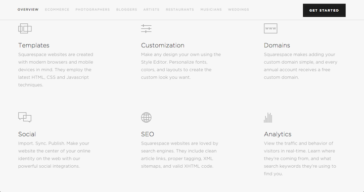
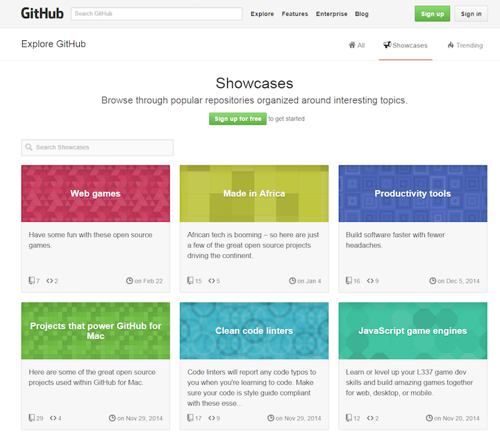
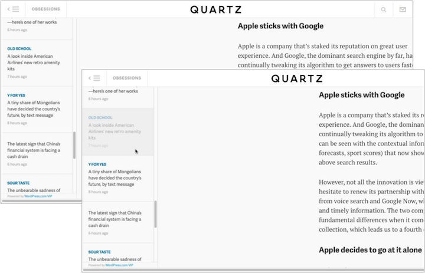

Title: Low-Contrast Text Is Not the Answer

URL Source: https://www.nngroup.com/articles/low-contrast/

Published Time: 2015-06-07T16:00:00+0000

Markdown Content:
Summary:Low-contrast text may be trendy, but it is also illegible, undiscoverable, and inaccessible. Instead, consider more usable alternatives.

A low-contrast design aesthetic is haunting the web, taking legibility and discoverability with it. It’s straining our eyes, making us all feel older, and a little less capable. Lured by the trend of minimalism, sites are abandoning their high-contrast traditions and switching to the Dark Side (or should I say, the Medium-Gray Side). For sites willing to sacrifice readability for design prowess, low-contrast text has become a predictable choice, with **predictable,****persistent usability flaws**.

Before using low-contrast colors on a website, especially for text, take a moment to remember all the reasons why they degrade usability. Then consider the reasons that prompted your site’s low-contrast design choices in the first place. Finally, look for alternatives that help you achieve those initial design goals without harming the user experience.

_It’s obvious that Squarespace.com wants users to click that high-contrast button in the corner to_ Get Started._But does it want customers to read about the features, or interact with the navigation? The gray text on the light-gray background suggests indifference. The top-navigation contrast and body contrast are so poor, that few users will stick around to read it._

*   [Low-Contrast Text Is Bad for Usability (But You Already Knew That)](https://www.nngroup.com/articles/low-contrast/#toc-low-contrast-text-is-bad-for-usability-but-you-already-knew-that-1)
*   [Why Designers Use Low-Contrast Text](https://www.nngroup.com/articles/low-contrast/#toc-why-designers-use-low-contrast-text-2)
*   [Strategies for Increasing or Decreasing Prominence Without Harming Usability](https://www.nngroup.com/articles/low-contrast/#toc-strategies-for-increasing-or-decreasing-prominence-without-harming-usability-3)
*   [Conclusion](https://www.nngroup.com/articles/low-contrast/#toc-conclusion-4)

Low-Contrast Text Is Bad for Usability (But You Already Knew That)
------------------------------------------------------------------

Insufficient contrast between the text color and the background degrades the user experience for the following reasons:

*   **Legibility suffers.** When the contrast is too low, users experience eye strain as they try to decipher the words. Research has also shown that people are **less trusting** of text that is hard to read — a carryover from the age of fine print. (More on trustworthiness in our course on [Persuasive Web Design](https://www.nngroup.com/courses/credibility-and-persuasive-web-design/).)
*   **Discoverability and findability are reduced.**Users who cannot perceive an element on the page cannot use it. When placed in an unconventional part of the page, a low-contrast element will not stand out when a user scans the page; for example, a gray-on-gray [search icon](https://www.nngroup.com/articles/magnifying-glass-icon/) or login link in the upper left instead of the upper right. Keep in mind that testing for [discoverability and findability](https://www.nngroup.com/articles/navigation-ia-tests/) requires [more than analytics](https://www.nngroup.com/articles/which-ux-research-methods/), because click-through data may tell you what gets few clicks, but it will not reveal _why_.
*   **User confidence diminishes.**Which would you rather use: a website that makes you feel like everything is working as you expected, or a website that makes you feel like something is wrong with you for not being able to find what you are looking for? In testing, I have observed many users blame themselves when they are unable to accomplish tasks on a modern-looking website, because they cannot see the text or they struggle to read it. When people don’t feel confident on a site, they are more likely to abandon it and go elsewhere.
*   **Mobile use becomes even more difficult.**Imagine trying to read low-contrast text on a mobile device while walking in bright sun. Even high-contrast text is hard to read when there is glare, but low-contrast text is nearly impossible.
*   **Accessibility is severely reduced for users with low vision or cognitive impairments.** As we get older our vision degrades. Millions of people around the world have some type of vision impairment, including presbyopia (difficulty focusing on close objects), macular degeneration, glaucoma, and cataracts. But not only low-vision users are affected: cognitive conditions that impact short-term memory and ability to maintain attentional focus also make using hard-to-see text extremely difficult.
*   **Cognitive strain increases.** When users perceive false affordances, or miscues, they take longer to determine the correct interpretation. For example, by convention, disabled features are dimmed or grayed out. Low contrast treatments risk sending users the wrong signal about the availability of an option.

_Can you tell which page the user is on? The current location_(Support) _on the Apple.com website is conveyed by dimming the gray text to a darker gray. Navigation is an especially risky place to use low contrast, as users may perceive their options to be limited, or they may waste time trying to figure out where they are in the site._

_On GitHub, the search field_ _s are grayed out, making them look unavailable._

Why Designers Use Low-Contrast Text
-----------------------------------

For better or worse, we’re in an age where minimalism is cool.

[Minimalism in web design](https://www.nngroup.com/articles/characteristics-minimalism/) started as a backlash against decades of interfaces that increased the prominence of so many elements at once that they all clamored for attention and became visually overwhelming.

What’s great about minimalism is the principle of stripping out non-essential elements. In most cases, this is a best practice to follow.

Minimalism becomes an issue when there is lots of essential content on a page. Having a lot of content doesn’t suit the minimalist approach to design. So the designer’s compromise has become reducing the contrast of those elements so that, at a glance, the page still ‘looks’ minimal.

Yes, low contrast text does look minimal, the same way a blurred photo on Instagram can look retro. But you wouldn’t blur your website even if it were fashionable. Don’t lower your contrast, either.

The trend is most rampant among sites that want to present a high-end, elite, or sophisticated image. When a trend sweeps through the web like low-contrast text has, what’s likely happening is that companies see other big brands doing it and assume that it has been tested and vetted as a good practice. That is [not always the case](https://www.nngroup.com/articles/copying-a-famous-sites-design/).

I feel confident predicting that, ten years from now, we will roll our eyes at low-contrast text the same way we roll our eyes at 1990s sites with [long Flash load times](https://www.nngroup.com/articles/flash-99-percent-bad/).

So, before you make the decision to use that light-gray text on a medium-gray background, look yourself in the mirror and ask why. If you are trying to lower the salience of an element to make other elements stand out, there are better ways. If you’re doing it because it looks cool, don’t assume that just because other sites are using it, that it’s safe to use on your site.

_Quartz.com article pages begin with the left navigation at high contrast (left). But when the user hovers over an article from the list, the cell dims to a contrast-level almost beyond recognition (right). The text the user is most interested in becomes tremendously difficult to read._

Strategies for Increasing or Decreasing Prominence Without Harming Usability
----------------------------------------------------------------------------

If you’re considering low-contrast text, you probably want to reduce the salience of an element, or increase the prominence of another. But there are other, more usable ways to do this.

*   **Reduce information density.** Some designs assume that reducing text contrast will make a dense page look less cluttered. Unfortunately, all it does is decrease legibility and increase cognitive strain. Instead, find ways to remove what isn’t essential, or explore alternatives to make the information display less condensed. (For example, you can [defer secondary content to secondary pages](https://www.nngroup.com/articles/defer-secondary-content-for-mobile/).)
*   **Adjust font size.** When users scan text on a webpage ([they rarely read](https://www.nngroup.com/articles/how-users-read-on-the-web/), though [sometimes they do](https://www.nngroup.com/articles/website-reading/)), larger text gets read first. It’s fine to make some text bigger and other text smaller, as long as you don't go so small that it becomes illegible. Use at least an 8-pt font.
*   **Check for accessibility-compliant color combinations.**Many free tools will check if color combinations have sufficient contrast. Be sure to check those combinations paired with your font size, as some combinations become compliant when the font is large enough.
*   **Reposition less important elements.** If you find that high-contrast text is distracting, try varying the placement of the text on the screen. Often, changing the location of an element, or adding more padding around it, is enough to change its prominence on the page.
*   **Consider accordions.** In some cases, expandable sections can reduce clutter by showing details only when users express interest with a click or a tap. Just be careful, because [accordions don’t work well for information that needs to be processed sequentially](https://www.nngroup.com/articles/accordions-complex-content/).

Conclusion
----------

As with any trend, it’s important to understand the reasons behind it and always question whether or not it makes sense for your site. Most websites don’t have the luxury of a household name and an army of loyal brand followers who are willing to endure a frustrating user experience. Instead of adopting low-contrast designs, consider other ways to alter the prominence of elements on the screen, without harming usability or accessibility.

**Reference:**

*   [W3.org, _Contrast (Minimum), Understanding Success Criterion 1.4.3_.](http://www.w3.org/TR/UNDERSTANDING-WCAG20/visual-audio-contrast-contrast.html) (Includes a list of resources to check color contrast).
