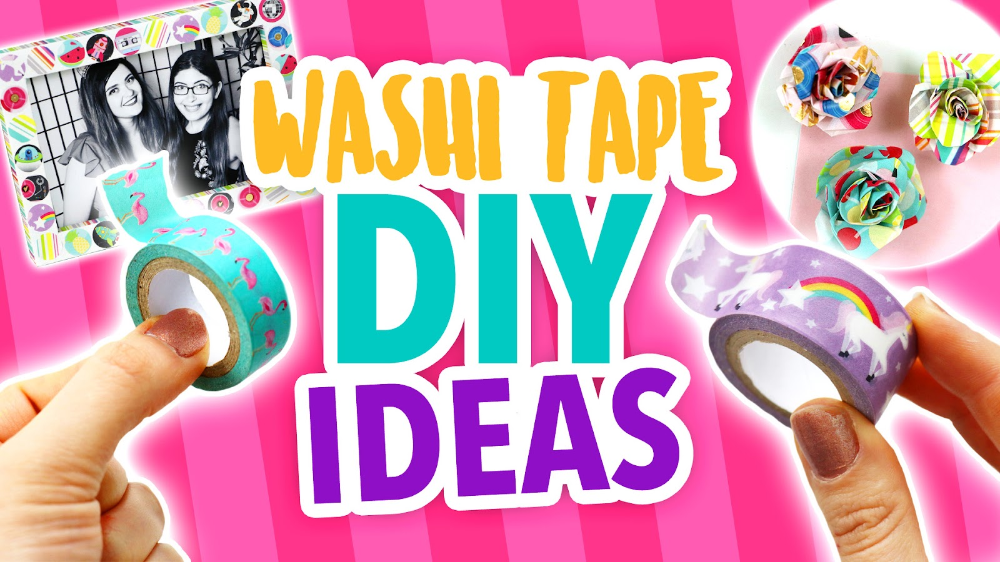
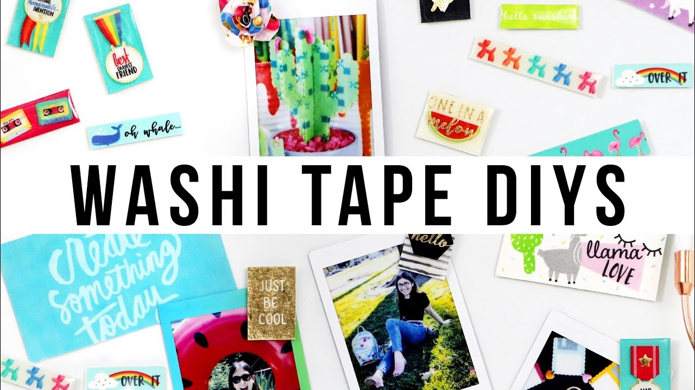
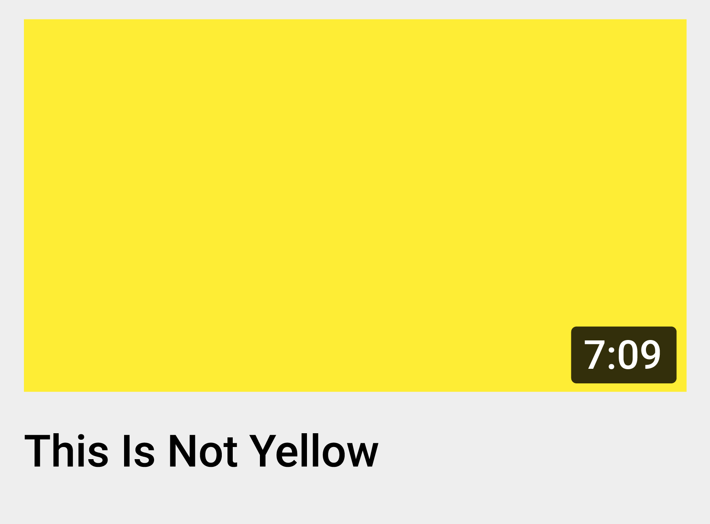
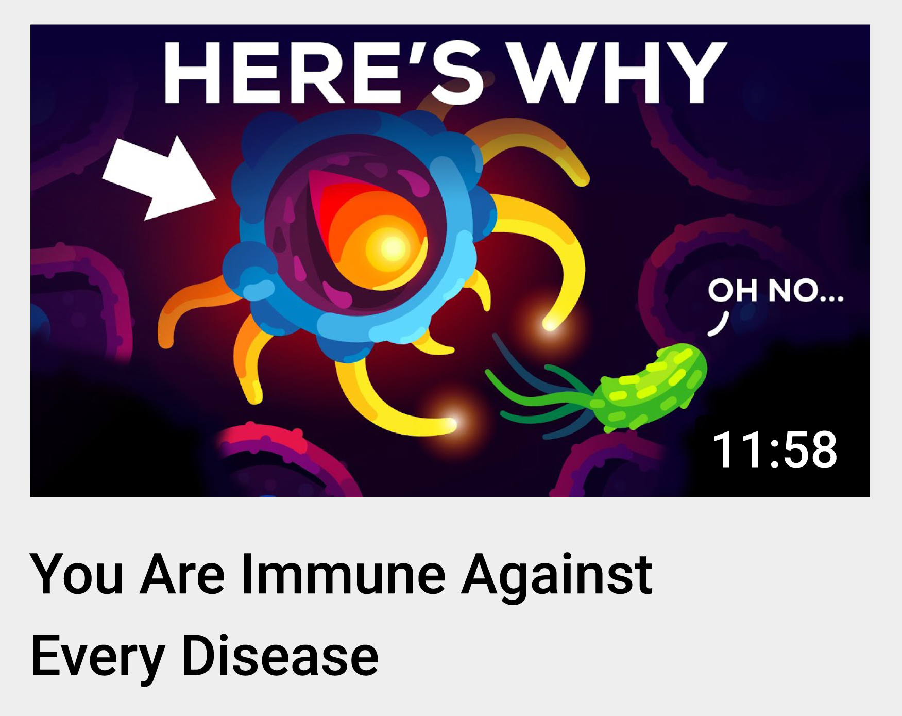
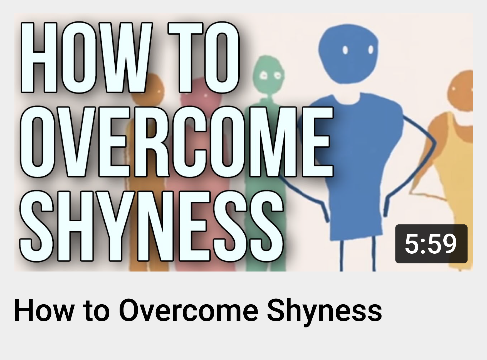
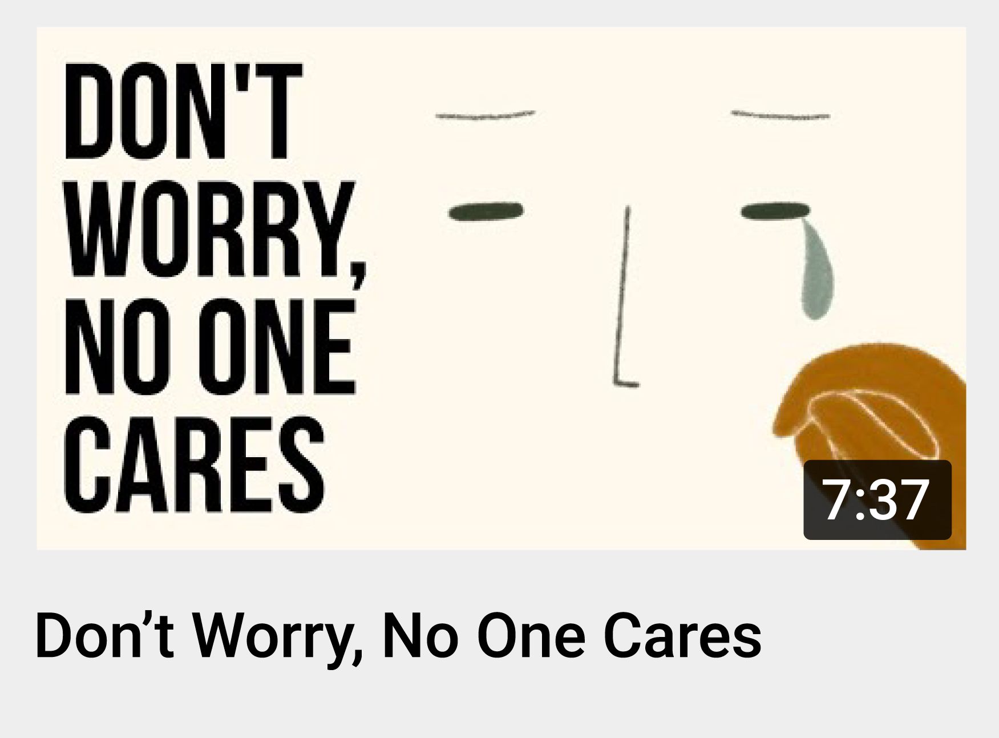

Title: Thumbnail & title tips - YouTube Help

URL Source: https://support.google.com/youtube/answer/12340300?hl=en

Markdown Content:
Thumbnail & title tips - YouTube Help
===============
[Skip to main content](https://support.google.com/youtube/answer/12340300?hl=en#search-form)

[YouTube Help](https://support.google.com/youtube)

[Sign in](https://accounts.google.com/ServiceLogin?hl=en&passive=true&continue=http://support.google.com/youtube/answer/12340300%3Fhl%3Den&ec=GAZAdQ)

[Google Help](https://support.google.com/)

[* Help Center](https://support.google.com/youtube/?hl=en)
    [* Fix a problem](https://support.google.com/youtube/topic/9257498?hl=en&ref_topic=3230811,3256124,)
    [* Watch videos](https://support.google.com/youtube/topic/9257500?hl=en&ref_topic=3230811,3256124,)
    [* Manage your account & settings](https://support.google.com/youtube/topic/9257107?hl=en&ref_topic=3230811,3256124,)
    [* Supervised experiences on YouTube](https://support.google.com/youtube/topic/10314939?hl=en&ref_topic=3230811,3256124,)
    [* YouTube Premium](https://support.google.com/youtube/topic/9257430?hl=en&ref_topic=3230811,3256124,)
    [* Create & grow your channel](https://support.google.com/youtube/topic/9257610?hl=en&ref_topic=3230811,3256124,)
    [* Monetize with the YouTube Partner Program](https://support.google.com/youtube/topic/9257986?hl=en&ref_topic=3230811,3256124,)
    [* Policy, safety, & copyright](https://support.google.com/youtube/topic/6151248?hl=en&ref_topic=3230811,3256124,)

[* Community](https://support.google.com/youtube/community?hl=en&help_center_link=CMyY8QUSGlRodW1ibmFpbCAmYW1wOyB0aXRsZSB0aXBz)[* YouTube](https://www.youtube.com/)

[* Privacy Policy](https://www.google.com/intl/en/privacy.html)[* YouTube Terms of Service](http://youtube.com/t/terms)[* Submit feedback](https://support.google.com/youtube/answer/12340300?hl=en)

Send feedback on...

This help content & information 

General Help Center experience 

Next

*   [Help Center](https://support.google.com/youtube/?hl=en)
*   [Community](https://support.google.com/youtube/community?hl=en&help_center_link=CMyY8QUSGlRodW1ibmFpbCAmYW1wOyB0aXRsZSB0aXBz)
*   [Creator Tips](https://support.google.com/youtube/announcements/11909013)

[YouTube](https://www.youtube.com/)

*   [Fix a problem](https://support.google.com/youtube/answer/12340300?hl=en)[Troubleshoot problems playing videos](https://support.google.com/youtube/topic/9257404?hl=en&ref_topic=9257498,3230811,3256124,)[Troubleshoot account issues](https://support.google.com/youtube/topic/3024171?hl=en&ref_topic=9257498,3230811,3256124,)[Fix upload problems](https://support.google.com/youtube/topic/2888603?hl=en&ref_topic=9257498,3230811,3256124,)[Fix YouTube Premium membership issues](https://support.google.com/youtube/topic/9257117?hl=en&ref_topic=9257498,3230811,3256124,)[Get help with the YouTube Partner Program](https://support.google.com/youtube/topic/9153641?hl=en&ref_topic=9257498,3230811,3256124,)[Learn about recent updates on YouTube](https://support.google.com/youtube/topic/13401449?hl=en&ref_topic=9257498,3230811,3256124,)[Get help with YouTube](https://support.google.com/youtube/topic/13343244?hl=en&ref_topic=9257498,3230811,3256124,) 
*   [Watch videos](https://support.google.com/youtube/answer/12340300?hl=en)[Find videos to watch](https://support.google.com/youtube/topic/9257408?hl=en&ref_topic=9257500,3230811,3256124,)[Change video settings](https://support.google.com/youtube/topic/9257502?hl=en&ref_topic=9257500,3230811,3256124,)[Watch videos on different devices](https://support.google.com/youtube/topic/9257096?hl=en&ref_topic=9257500,3230811,3256124,)[Comment, subscribe, & connect with creators](https://support.google.com/youtube/topic/9257418?hl=en&ref_topic=9257500,3230811,3256124,)[Save or share videos & playlists](https://support.google.com/youtube/topic/9257423?hl=en&ref_topic=9257500,3230811,3256124,)[Troubleshoot problems playing videos](https://support.google.com/youtube/topic/9257404?hl=en&ref_topic=9257500,3230811,3256124,)[Purchase & manage movies, TV shows & products on YouTube](https://support.google.com/youtube/topic/9257105?hl=en&ref_topic=9257500,3230811,3256124,) 
*   [Manage your account & settings](https://support.google.com/youtube/answer/12340300?hl=en)[Sign up and manage your account](https://support.google.com/youtube/topic/9267757?hl=en&ref_topic=9257107,3230811,3256124,)[Manage account settings](https://support.google.com/youtube/topic/9257108?hl=en&ref_topic=9257107,3230811,3256124,)[Manage privacy settings](https://support.google.com/youtube/topic/9257518?hl=en&ref_topic=9257107,3230811,3256124,)[Manage ad settings](https://support.google.com/youtube/topic/15848873?hl=en&ref_topic=9257107,3230811,3256124,)[Manage accessibility settings](https://support.google.com/youtube/topic/9257112?hl=en&ref_topic=9257107,3230811,3256124,)[Troubleshoot account issues](https://support.google.com/youtube/topic/3024171?hl=en&ref_topic=9257107,3230811,3256124,)[YouTube updates](https://support.google.com/youtube/topic/13401752?hl=en&ref_topic=9257107,3230811,3256124,) 
*   [Supervised experiences on YouTube](https://support.google.com/youtube/answer/12340300?hl=en)[Supervised experiences for pre-teens](https://support.google.com/youtube/topic/15279060?hl=en&ref_topic=10314939,3230811,3256124,)[Supervised experiences for teens](https://support.google.com/youtube/topic/15279671?hl=en&ref_topic=10314939,3230811,3256124,) 
*   [YouTube Premium](https://support.google.com/youtube/answer/12340300?hl=en)[Join YouTube Premium](https://support.google.com/youtube/topic/12155486?hl=en&ref_topic=9257430,3230811,3256124,)[Learn about YouTube Premium benefits](https://support.google.com/youtube/topic/9257431?hl=en&ref_topic=9257430,3230811,3256124,)[Manage your Premium membership](https://support.google.com/youtube/topic/9257116?hl=en&ref_topic=9257430,3230811,3256124,)[Manage Premium billing](https://support.google.com/youtube/topic/9516474?hl=en&ref_topic=9257430,3230811,3256124,)[Fix YouTube Premium membership issues](https://support.google.com/youtube/topic/9257117?hl=en&ref_topic=9257430,3230811,3256124,)[Troubleshoot billing & charge issues](https://support.google.com/youtube/topic/9995067?hl=en&ref_topic=9257430,3230811,3256124,)[Request a refund for YouTube paid products](https://support.google.com/youtube/topic/12013284?hl=en&ref_topic=9257430,3230811,3256124,) 
*   [Create & grow your channel](https://support.google.com/youtube/answer/12340300?hl=en)[Upload videos](https://support.google.com/youtube/topic/16547?hl=en&ref_topic=9257610,3230811,3256124,)[Edit videos & video settings](https://support.google.com/youtube/topic/9257530?hl=en&ref_topic=9257610,3230811,3256124,)[Create Shorts](https://support.google.com/youtube/topic/10343432?hl=en&ref_topic=9257610,3230811,3256124,)[Edit videos with YouTube Create](https://support.google.com/youtube/topic/13521391?hl=en&ref_topic=9257610,3230811,3256124,)[Customize & manage your channel](https://support.google.com/youtube/topic/9257786?hl=en&ref_topic=9257610,3230811,3256124,)[Analyze performance with analytics](https://support.google.com/youtube/topic/9257532?hl=en&ref_topic=9257610,3230811,3256124,)[Translate videos, subtitles, & captions](https://support.google.com/youtube/topic/9257536?hl=en&ref_topic=9257610,3230811,3256124,)[Manage your posts & comments](https://support.google.com/youtube/topic/9257889?hl=en&ref_topic=9257610,3230811,3256124,)[Live stream on YouTube](https://support.google.com/youtube/topic/9257891?hl=en&ref_topic=9257610,3230811,3256124,)[YouTube Creator Community](https://support.google.com/youtube/topic/12182592?hl=en&ref_topic=9257610,3230811,3256124,)[Become a podcast creator on YouTube](https://support.google.com/youtube/topic/12751231?hl=en&ref_topic=9257610,3230811,3256124,)[Creator and Studio App updates](https://support.google.com/youtube/topic/13401855?hl=en&ref_topic=9257610,3230811,3256124,) 
*   [Monetize with the YouTube Partner Program](https://support.google.com/youtube/answer/12340300?hl=en)[YouTube Partner Program](https://support.google.com/youtube/topic/9153567?hl=en&ref_topic=9257986,3230811,3256124,)[Make money on YouTube](https://support.google.com/youtube/topic/9240125?hl=en&ref_topic=9257986,3230811,3256124,)[Get paid](https://support.google.com/youtube/topic/11407695?hl=en&ref_topic=9257986,3230811,3256124,)[Understand ads and related policies](https://support.google.com/youtube/topic/9257894?hl=en&ref_topic=9257986,3230811,3256124,)[Get help with the YouTube Partner Program](https://support.google.com/youtube/topic/9153641?hl=en&ref_topic=9257986,3230811,3256124,)[YouTube for Content Managers](https://support.google.com/youtube/topic/9153648?hl=en&ref_topic=9257986,3230811,3256124,) 
*   [Policy, safety, & copyright](https://support.google.com/youtube/answer/12340300?hl=en)[YouTube policies](https://support.google.com/youtube/topic/2803176?hl=en&ref_topic=6151248,3230811,3256124,)[Reporting and enforcement](https://support.google.com/youtube/topic/2803138?hl=en&ref_topic=6151248,3230811,3256124,)[Privacy and safety center](https://support.google.com/youtube/topic/2803240?hl=en&ref_topic=6151248,3230811,3256124,)[Copyright and rights management](https://support.google.com/youtube/topic/2676339?hl=en&ref_topic=6151248,3230811,3256124,) 

Thumbnail & title tips
======================

How can your audience tell what your video is about? Usually, viewers will first see your thumbnail and title. This info gives them a glimpse of what your video is about and helps them decide if they want to watch it. **Fun fact**: 90% of the best-performing videos have [custom thumbnails](https://support.google.com/youtube/answer/72431).

[Titles & Thumbnails](https://www.youtube.com/watch?v=ubFTkoJkNX4)

 Subscribe to the [YouTube Creators channel](https://www.youtube.com/channel/UCkRfArvrzheW2E7b6SVT7vQ)for the latest news, updates, and tips.

#### Design thumbnails that stand out

*   Who is your video targeting? Content targeting your subscribers might highlight familiar features, like your best friend. Content targeting casual viewers might focus on actions and emotions that are more universally relatable, like a shocked face.
*   You can apply the “[rule of thirds](https://en.wikipedia.org/wiki/Rule_of_thirds)” to create interesting images. Then, overlay your images with your branding and descriptive text. If you add text, make sure to use a font that's easy to read.
*   Try not to make the design too complex. Dynamic use of color and composition can help catch the eye, but too much can overwhelm it.
*   Thumbnails show up differently across devices, so make sure your thumbnail image is as large as possible.
*   Different audiences have different tastes and thumbnail styles can shift over time. It’s important to keep current on what’s working well in your community. We also recommend experimenting with updating older thumbnails to increase your video’s appeal to new viewers.

_Before and after of a thumbnail style update for a craft video_

_Examples of thumbnails and titles working together to create interest and tell a story_

#### How to write titles

*   Be accurate. Make sure your title accurately represents the video. If not, viewers may stop watching, which can impact discoverability.
*   Be succinct. Viewers may only see part of your title. So aim to keep it short and put the most important words near the beginning. Save episode numbers and branding for the end.
*   Limit ALL CAPS and emoji. Use them carefully, to emphasize emotion or special elements in the video. For example, “Our KIDS Built A ROBOT! ”.

#### Types of video titles

You can attract your audience with:

**Searchable titles** that clearly outline what to expect so you can easily reach viewers searching for similar content.
**Intriguing titles** that spark curiosity and appeal to viewers who may not be looking for topic-specific content.

#### Dive into the data

*   Need inspiration? You can use [research insights](https://support.google.com/youtube/answer/11962757) in YouTube Analytics to explore what your audience and viewers are searching for on YouTube.
*   You can also get thumbnail and title ideas using the [Audience](https://support.google.com/youtube/answer/9314416) tab in [YouTube Analytics](https://studio.youtube.com/) to check other videos your audience watched.
*   Measure the effectiveness of your thumbnails and titles for different audiences using these metrics in your analytics:
    *   For general audiences, look at the click-through rate (CTR) on Home and Suggested in the first 24 hours after publication. Check these numbers on videos that have above-average Impressions (IMP). Home and Suggested are where viewers often discover new videos and channels.
    *   For subscribers, look at the click-through rate (CTR) in the Subscriptions Feed in the first 24 hours after publication. Although your subscribers may come to your videos from elsewhere on the platform, the Subs feed represents your most engaged fans.

#### We recommend

*   Reviewing your thumbnails to see if they bring out the best of the video. Also, make sure to follow our [thumbnail policy](https://support.google.com/youtube/answer/9229980).
*   Taking pictures during your shoot so you have several options for thumbnails when you upload your video.
*   Thinking about who may watch your video and where they may find it to choose between a searchable or intriguing title.
*   After posting your video, don’t forget to look at your metrics in YouTube Analytics to understand the impact of your thumbnails and titles.

**Next: check out [video description tips](https://support.google.com/youtube/answer/12948449)**

Was this helpful?
-----------------

How can we improve it?

Yes No

Submit

Need more help?
---------------

### Try these next steps:

[Post to the help community Get answers from community members](https://support.google.com/youtube/community?hl=en&help_center_link=CMyY8QUSGlRodW1ibmFpbCAmYW1wOyB0aXRsZSB0aXBz)

true

*    ©2026 Google 
*   [Privacy Policy](https://www.google.com/intl/en/privacy.html)
*   [YouTube Terms of Service](http://youtube.com/t/terms)

 Language  

Enable Dark Mode

Send feedback on...

This help content & information General Help Center experience

Search

Clear search

Close search

Google apps

Main menu

9525485557568121050

true

Search Help Center

false

true

true

true

true

true

59

false

false

false

false
