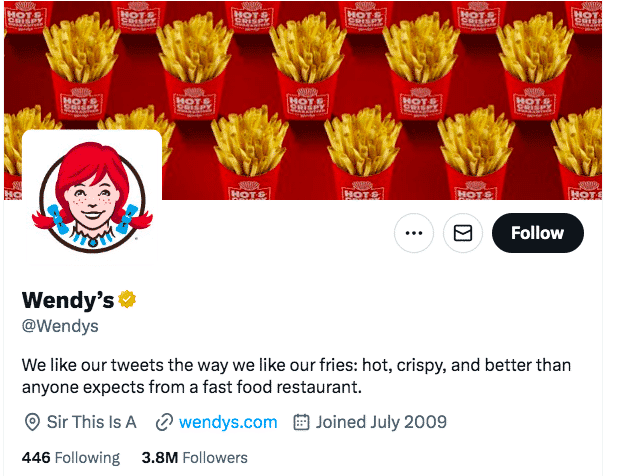
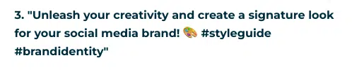
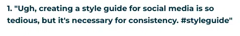
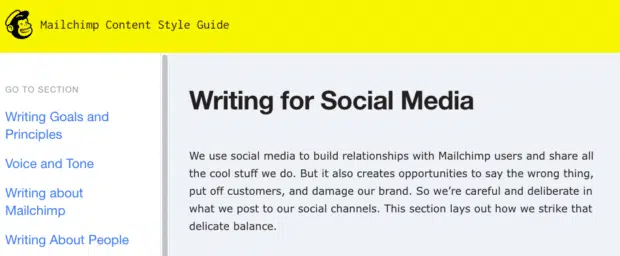
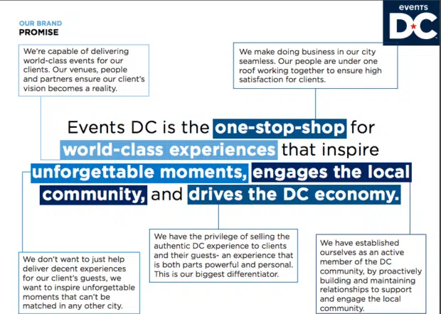
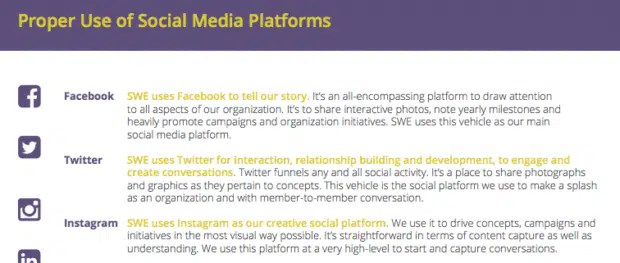
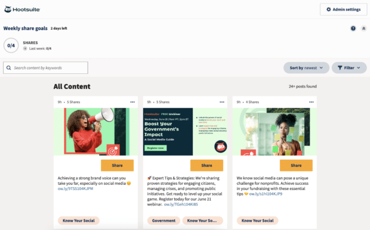

Title: Social Media Style Guide: Template, Examples & Tips for 2024

URL Source: https://blog.hootsuite.com/social-media-style-guide/

Published Time: 2024-05-09T17:50:25+00:00

Markdown Content:
Strategy

Learn how to build a consistent brand voice on social media with a custom social media style guide (free template included)!

*   Also available in
*   [Español](https://blog.hootsuite.com/es/guia-de-estilo-para-tus-redes/ "Español")

A social media style guide is an important document for social teams of all sizes. Whether you’re a team of one or 100, recording your decisions about brand voice and style in a central place ensures consistency in your social media presence — and builds brand trust.

Keep reading to find out more about building a style guide your social team will actually use. We’ve even included a free social media style guide template to help you get started!

**Bonus: Get a free, customizable social media style guide template** to easily ensure a consistent look, feel, voice, and tone across all your social channels.

A social media style guide is a document that outlines the style choices for your brand on social media.

This includes everything from your brand identity (e.g. your logo and colors), to your tone of voice — and even how you use emojis and hashtags. In other words, it’s a set of rules that dictate how you present your brand on social media.

#1 Analytics Tool for Growth

Beautiful reports. Clear data. Actionable insights to help you grow faster.

[Start free 30-day trial](https://www.hootsuite.com/offer/blog)

Why brands need social media style guides
-------------------------------------------------------------------------------------------------

### Keep your image and voice consistent

Consistency is key on social. For your brand image and voice to be consistent, you need to make some decisions about how your brand “speaks” online.

Your image and video content needs to be consistent too, from your brand colors to the templates you use for infographics to the fonts you use for captions and thumbnails.

### Help your team do their jobs

A brand’s social content needs to feel like it comes from one consistent place, even when different components are created by different people. While your TikTok videos will clearly have a different style from your LinkedIn posts, the overall brand personality needs to feel familiar.

A clear social media style guide is the governing document for all those involved in creating your social content. It allows team members to work independently towards a unified goal.

A good style guide for social media also makes onboarding much easier for both new hires and those in supervisory roles. It ensures organizational knowledge stays with your team even if individual team members move on or change roles.

### Build trust with your audience

Your followers should be able to recognize your content, no matter where they see it. When you define your voice, tone, and visual style in your style guide, social media content creation becomes easier. Your content all sounds like it’s coming from the same source.

A good social media style guide also ensures you talk consistently about what your brand offers and how your products work. This builds consumer trust and awareness, so you’re top of mind when it’s time for your audience to make a purchase.

Creating a social media style guide from scratch involves examining the current state of affairs in your social media strategy, making a record of what you’ve been doing, and cataloging quite a lot of detail about how you’ll create content going forward. Here’s how to get started.

### List your social media accounts

This isn’t a [social media audit](https://blog.hootsuite.com/social-media-audit/), but you still need to make a list of every social account you use for your brand.

This will provide a clear picture of the naming conventions you’ve used for your accounts. Are the usernames consistent across channels? If not, now’s the time to choose a style and note it in your style guide. This will make new accounts on new channels more easily discoverable for fans.

### Clarify your target audience

If you haven’t yet defined your [target market](https://blog.hootsuite.com/target-market/) and developed your [audience personas](https://blog.hootsuite.com/buyer-persona/), now is the time to do so. Before you can develop an effective brand voice, you need to know who you’re speaking to.

When building out audience personas, consider the following:

*   Basic [demographics](https://blog.hootsuite.com/social-media-demographics/) (location, age, gender, occupation)
*   Interests and hobbies
*   Pain points/what they need help with
*   How they use social media
*   What kind of content they engage with (e.g., blog posts, infographics, videos)

### Define your brand voice

#### Tone and style

To connect with your audience, you need to have a clearly defined [brand voice](https://blog.hootsuite.com/brand-voice/). Some brands are pretty cheeky on social media.

_Source:_[_@Wendys_](https://x.com/Wendys)

Others maintain a more formal tone. You can take either approach, or be somewhere in between. But you can’t veer from one to the other. Think about your brand as a person. Who would it be? How would it speak?

If you need some help figuring this out, try experimenting with [Hootsuite’s free AI caption generator](https://www.hootsuite.com/social-media-tools/ai-caption-generator-social-media). It allows you to choose different tones of voice, from cheerful to unhinged to VSCO girl. Try using it to create different versions of the same caption and see which feels more natural for your brand.

For example, compare this cheerful caption:

_Source:_[_Hootsuite free AI caption generator_](https://www.hootsuite.com/social-media-tools/ai-caption-generator-social-media)

With this grumpy one:

Which sounds more like your brand?

#### Content length

Different platforms have different content limits for both video length and number of text characters, so you’ll need to [break this down by platform](https://blog.hootsuite.com/ideal-social-media-post-length/).

The idea is that your audience on each platform should know what to expect. If they’re used to 15-second Reels, it might be confusing and tedious to get sucked into a 90-second version. But if they’re used to longer explainers and you suddenly post something much shorter, that’s confusing too.

The same goes for captions. If you usually write a few words, a big block of text won’t look right to your audience. But if you use captions as a platform for storytelling and you suddenly switch to a few words or emojis, your audience will wonder if something went wrong.

#### Emojis

Will you [use emojis](https://blog.hootsuite.com/emoji-meanings/)? Which ones? How many? On what channels? How often? Have the same discussion about GIFs. Your use of emojis (or not) has a clear impact on your brand voice and tone.

#### How and where to use CTAs

You can’t ask your audience to take action on every post. We [recommend the 80-20 rule](https://blog.hootsuite.com/social-media-marketing-strategy/), where 80% of your content is to inform, educate, or entertain your audience while 20% directly promotes your brand.

On that 20%, how often will you ask your readers to take a specific action, like click a link or make a purchase? What kinds of action words will you use in your CTAs? Will you include CTAs in your video content or just in captions?

#### Post authorship

Do you post as a brand? Or do you attribute your social posts to individual team members?

For example, it’s common for customer service social accounts to use initials to indicate which team member is replying to a public message.

And in video content, it’s clearly an individual (or individuals) on screen. But on text-forward platforms, your content likely comes from the brand itself.

Clarify how you identify post authors (if at all) and how often team members introduce themselves in video content.

#### Inclusive language

What guidelines will you follow on social media to make sure your language is inclusive and fair?

Involve team members in the discussion as you develop your inclusive language guidelines. If your team is too large for everyone to join in the discussion, make sure you have diverse viewpoints represented. Circulate the preliminary guidelines to seek feedback.

[Accessibility](https://blog.hootsuite.com/social-media-accessibility/) is a key component of inclusivity.

### Create linguistic consistency guidelines

Did you know that dictionaries are all a little different? Choose which dictionary you’ll use for your social content and make sure all relevant team members have access to an online subscription.

You may also want to choose an existing style guide, like the [Associated Press Stylebook](https://www.apstylebook.com/) or the [Chicago Manual of Style](https://www.chicagomanualofstyle.org/home.html), so you don’t have to make every grammar and punctuation choice yourself.

Here are some consistency issues to consider:

#### US or UK English

Or maybe Canadian English? Or Australian? Maybe you’re not writing in English at all? Choosing a dictionary will help make sure you stick to the right spelling for your geography.

#### Serial commas

There’s no right answer on whether to use them (although most writers and editors have very strong opinions).

The Associated Press is mostly against them, but the Chicago Manual of Style says they’re a must.

Make your own choice on this issue and use it consistently.

#### Headline capitalization

Do you capitalize every word, or only the first? Again, there’s no right or wrong answer until you define your brand style in your style guide.

#### Dashes, ampersands, and exclamation points

Dashes come in two lengths: the en-dash (–) and the em-dash (—). It’s most common to use the en-dash online, but you can choose either. You also need to decide whether to use spaces on either side of the dash. It’s most common to use spaces with the shorter dash but not the longer one:

*   An en-dash – like this – usually gets spaces
*   An em-dash—like this—usually doesn’t

For ampersands, you just need to decide if you’ll use them rather than writing out “and.” This can be useful where there are tight character limits, so you may want to make a separate style choice for X (formerly Twitter).

On the exclamation point front: Will you use them at all? It’s probably best to keep them to a minimum on most platforms, unless you’re going for a specifically chipper brand voice.

#### Dates and times

Do you write out days of the week or abbreviate them? Do you say 4pm or 4 p.m. or 16:00 or 4 o’clock? What date format do you use?

For example, in U.S. English, it’s standard to write dates as month/day/year, whereas in UK English the order is day/month/year. This is a case where lack of consistency can actually have real-world implications, like missing an event or launch.

#### Links

How often will you include links in your posts? Will you use [UTM parameters](https://blog.hootsuite.com/how-to-use-utm-parameters/) and/or a URL shortener? Will you put links in the body text or in a comment?

Specify your linking protocols. Also clarify how you refer to[links in your bio](https://blog.hootsuite.com/link-in-bio/) on platforms where that’s the only linking option.

#### Pronunciation

We’ve mostly focused so far on creating consistency in your written language. But your spoken language needs to be consistent too. While your employees will certainly have different accents and ways of speaking in your videos, your brand name and products need to be pronounced consistently.

If the pronunciation of your brand name or products is unclear from the spelling, consider creating a pronunciation key. This can be as simple as including the phonetic spelling next to the word itself.

While your employees are unlikely to mispronounce your name as spectacularly wrong as Schweppes is pronounced in this video, there’s no sense taking chances!

### Develop guidelines for content curation, UGC, and cross-posting

#### Curation

[Curated content](https://blog.hootsuite.com/beginners-guide-to-content-curation/) can add value to your social feed without creating new content of your own.

But which sources will you share from? More importantly, which sources will you _not_ share from? You likely want to avoid sharing posts from your competitors, for example.

You should also create brand guidelines for _how_ you share curated content. Are you adding insights of your own? (Tip: The[LinkedIn algorithm,](https://blog.hootsuite.com/how-the-linkedin-algorithm-works-hacks/)in p articular, prefers it when you add your own perspective.)

#### User-generated content

Not sure where to start with your guidelines for UGC? We suggest some basics in our post on [how to use user-generated content](https://blog.hootsuite.com/user-generated-content-ugc/):

*   Always request permission
*   Credit the original creator
*   Offer something of value in return
*   Use [search streams](https://blog.hootsuite.com/social-listening-business/) to find UGC you might have missed

Specify how you will credit the users whose posts you share. You should always tag them, of course, and camera icons are a common way of attributing photographs.

https://www.instagram.com/p/C5cVXZyOAss

#### Cross-posting

You want to get the most out of all the social content you create. But that doesn’t mean you should post the same thing everywhere. Create guidelines for [how to tailor your content for each social media platform](https://blog.hootsuite.com/cross-promote-social-media/).

For example, maybe you create infographics from your blog posts for Instagram and quick explainer videos for TikTok. How you adapt your content is up to you, but some guidelines can make the process easier for all.

(Hint: Use a tool like [Hootsuite](https://www.hootsuite.com/fr) to adapt content for each platform as you post.)

### Define your hashtag use

#### Branded hashtags

Do you use branded hashtags to encourage fans and followers to tag you in their posts, or to collect [user-generated content](https://blog.hootsuite.com/user-generated-content-ugc/)? List them in your style guide, along with guidelines about when to use them.

Also provide guidelines for how to respond when people use your branded hashtags. WIll you like their posts? Retweet? Comment?

#### Campaign hashtags

Create a list of hashtags specific to one-off or ongoing campaigns.

When a campaign is over, make notes about the dates the hashtag was in use. This creates a permanent record and can help spark ideas for future campaigns.

#### How many hashtags?

The [ideal number of hashtags](https://blog.hootsuite.com/how-to-use-hashtags/) is a matter of ongoing debate. You’ll need to [do some testing](https://blog.hootsuite.com/social-media-ab-testing/) to learn how many is right for your business.

You don’t need to settle on a specific number of hashtags, but aim for a clear range.

#### What case?

This is a simple one. Choose your case:

*   Lowercase: #hootsuitelife
*   Uppercase: #HOOTSUITELIFE (best for very short hashtags only)
*   Camel case: #HootsuiteLife

### Document visual style and catalog key assets

We’ve talked a lot about words, but you also need to define your brand’s visual look and feel for social media.

#### Colors

If you’ve already defined your brand colors, these will likely be the colors you use in your social media accounts. You may wish to define which colors should be used in different contexts.

#### Fonts

You can’t control the fonts when writing captions, but you can control the fonts you use in graphics, cover photos, and even Instagram Stories.

Larger brands might invest in a custom font. But for most brands, it’s sufficient to choose one font, or a few fonts for various applications, and use them consistently.

#### Logos

Where and when will you use your logo on social media? It’s usually a good idea to use your logo as your social media profile picture.

If your logo doesn’t work well as a square or circle image, you may need to create a modified version specifically for social media use.

#### Thumbnails

What style of thumbnail will you use for surfaces like Instagram Reels, TikTok, and YouTube Shorts? Do you include text? Define your thumbnail style and include some examples. On that note, it can be a good idea to create some…

#### Templates

From Instagram highlights covers to social ads to Pins, templates are the best way to keep your content consistent and recognizable at a glance. Include links to your social templates in your style guide. You can also use a tool like the [Hootsuite](https://www.hootsuite.com/fr) content library to manage your templates.

#### Images

What kinds of images will you use on social media? Will you use stock photos, or only photos that you’ve taken yourself? What about graphics? If you do use stock photos, where will you get them from?

Again, the Hootsuite content library is a great help here since you can create a catalog of pre-approved images for your social team to draw from.

#1 Analytics Tool for Growth

Beautiful reports. Clear data. Actionable insights to help you grow faster.

[Start free 30-day trial](https://www.hootsuite.com/offer/blog)

### List important dos and don’ts

#### Jargon

Will you use it? Unless you’re in a highly technical industry with a very niche audience, your best bet is probably not.

Stick to plain language that’s easy for your audience to understand, and make a list of jargon-y words to avoid.

#### Trademarks

Your style guide for social media should include a list of all your brand trademarks. Don’t put your list in all-caps, because this makes it impossible to tell the difference between, say HootSuite (wrong) and Hootsuite (right).

Provide guidelines for how your trademarks can be used. Do you use your product names as verbs? What about as plurals?

#### Brand and product callouts and USPs

Create a list of unique selling propositions and standard call-outs for your brand and all your products. While you won’t likely copy-and-paste this information directly into social media posts, it’s useful to have clear talking points so your team describes your offerings correctly and consistently.

#### Acronyms

You likely use acronyms all the time without even thinking about it. But will your audience know what they all mean?

Make a list of the acronyms your company commonly uses internally, along with the full spelled-out versions of what they stand for. Indicate whether it’s appropriate to use the acronyms on each social channel, or if the full terms should be used.

For reference, consider including a section on [social media acronyms marketers should know](https://blog.hootsuite.com/social-media-acronyms/) to ensure clear communication across your platforms.

#### Other language specific to your brand

Hootsuite employees are affectionately known as “owls,” while Starbucks refers to their employees as “partners.”

https://www.instagram.com/p/C5WHLpGP5lo

If you use specific terms like this, write them down. Not just how you refer to your employees, but any non-trademarked language you use to refer to any aspect of your company. For example, do you have customers or clients or guests?

#### Language specific to your industry

The first time I was getting ready to go on a cruise, I mentioned to my travel agent that I was looking forward to getting on the boat. “The ship,” she corrected me.

As a passenger, my use of the wrong term didn’t really matter. But as a writer, that would have been a big deal. To you, these terms are obvious. Make sure they’re listed in your style guide so everyone posting to your social channels uses the right term every time.

#### Content types

What type of content is appropriate (e.g., product photos, employee photos, company news, memes)? Are there any off-limits topics? This is especially important in [regulated industries](https://blog.hootsuite.com/social-media-compliance/).

#### Link to your social media policy

Finally, include a link to your [social media policy](https://blog.hootsuite.com/social-media-policy-for-employees/) and social media guidelines for more details on the appropriate use of social media for your brand and your employees.

**Bonus: Get a free, customizable social media style guide template** to easily ensure a consistent look, feel, voice, and tone across all your social channels.

### 1. [Mailchimp](https://styleguide.mailchimp.com/writing-for-social-media/)

_Source:_[_Mailchimp_](https://styleguide.mailchimp.com/writing-for-social-media/)

This very thorough social media style guide hits all the key points. It starts by defining the intent of Mailchimp’s social media strategy, then gets into details like accounts naming conventions, post length, and tagging protocols. We especially love the detail about exclamation point use: “They’re like high-fives: A well-timed one is great, but too many can be annoying”

### 2. [Events DC](https://eventsdc.com/sites/default/files/2020-11/Events%20DC%20Brand%20Style%20Guide.pdf)

_Source:_[_Events DC_](https://eventsdc.com/sites/default/files/2020-11/Events%20DC%20Brand%20Style%20Guide.pdf)

Events DC includes their social media style guide within their larger brand style guide. This keeps all information about the brands logos, colors, and imagery in one place, along with specific guidelines about post length and purpose. We love the very specific guidelines on emoji use broken down by platform.

### 3. [Society of Women Engineers](https://swe-rms.swe.org/wp-content/uploads/sites/72/2023/12/swe-_social_media_style_guide-02-09-16__1_.pdf)

_Source:_[_Society of Women Engineers_](https://swe-rms.swe.org/wp-content/uploads/sites/72/2023/12/swe-_social_media_style_guide-02-09-16__1_.pdf)

This social media style guide defines how the society uses all social platforms and then focuses on the most commonly used: Facebook, X (Twitter), Instagram, and LinkedIn. We particularly like that the guide is clear and detailed, yet reminds users not to get _too_ bogged down in the details: “When it comes to social media, it’s important to keep in mind a best practice structure, however, it’s also important to let creativity flow. “

Create shareable brand-approved content with Hootsuite
--------------------------------------------------------------------------------------------------------------

The easiest way to ensure compliance with your social media style guide – while extending the reach of your social content – is to create pre-approved brand content that your team can share with just a few clicks.

Your social team members are the experts in your social media style guide – but they’re not the only ones excited about sharing your brand’s social content. Using a tool like [Hootsuite Amplify](https://www.hootsuite.com/products/amplify)makes it easy for everyone at your organization to get involved without them all having to study the intricacies of your punctuation and font choices.

Here’s how it works:

1.   Your social media team creates, edits, approves, and shares content that aligns with your social media style guide.
2.   They publish the post to Amplify, where it is accessible to all team members.
3.   Employees can access content, personalize it if appropriate, and share or schedule the post to go live on their own social platforms.

That’s it! Employees can also suggest social content (like event photos or relevant news) to your social team so that they can create posts that align with your style guide for social media.

**Save time on social media with Hootsuite. From a single dashboard, you can manage all your profiles, schedule posts, measure results, and more.**

The #1 social media tool

Create. Schedule. Publish. Engage. Measure. Win.

[By Christina Newberry](https://blog.hootsuite.com/author/christina-newberry/)

Christina Newberry has been writing about digital marketing since the prehistoric days of 2002, when email opt-ins were every marketer's biggest goal. With a deep understanding of how to connect to online audiences, she shifted her focus to social media and has been contributing to the Hootsuite blog since 2016.

Related Articles
----------------

The #1 social media tool

Create. Schedule. Publish. Engage. Measure. Win.
