Title: YouTube marketing: A complete guide for your brand in 2025

URL Source: https://sproutsocial.com/insights/youtube-marketing/

Markdown Content:
Summary

*   With over 2.5 billion active users every month, YouTube is a great place for social media marketing. In particular, it’s great for product discovery and purchase consideration, making it an important channel for brand awareness.
*   Create high-quality, engaging videos that your YouTube audience will love. It's important to focus on both content quality and YouTube search optimization to increase visibility and engagement.
*   YouTube influencer marketing and advertising are powerful tools for marketers. With 70% of consumers influenced to make purchases based on YouTube content, marketers can effectively allocate resources to influencer partnerships and targeted ad campaigns to maximize ROI.

With over[**2.5 billion monthly active users**](https://www.statista.com/statistics/272014/global-social-networks-ranked-by-number-of-users/), YouTube is the second-largest social media platform in the world. But YouTube’s large user base isn’t the only reason brands shouldn’t sleep on including the platform in their overall [**social marketing strategy**](https://sproutsocial.com/insights/social-media-marketing-strategy/).

The platform fuels product discovery and drives purchase decisions. Next to Facebook, [YouTube is the second-most used](https://blog.hubspot.com/marketing/social-media-product-research) social network for product research and purchasing. So it’s the perfect platform to boost brand awareness and drive high-converting traffic.

In this article, you’ll learn what YouTube marketing is, why it’s important and how to implement it successfully with proven tips and strategies.

What is YouTube marketing?
--------------------------

YouTube marketing is the process of promoting your brand, product or service on YouTube. It involves a mix of various organic and paid approaches such as uploading your own videos or paying for YouTube ads. Additionally, brands may even include influencers in their YouTube marketing mix.

A typical YouTube marketing strategy may involve one or a combination of the following methods:

*   **Video creation:**YouTube is primarily a video hosting platform. So creating and uploading original content is the best way to engage your YouTube audience.
*   **YouTube influencer marketing:**YouTube is the second-most popular platform to work with influencers based on the latest [influencer marketing stats](https://sproutsocial.com/insights/influencer-marketing-statistics/). 70% of marketers find the platform important for their influencer marketing.
*   **YouTube advertising:**[**70% of consumers**](https://blog.google/products/ads/new-ways-to-drive-action/) say they’ve bought a product after seeing it on YouTube. Running ads on the platform can deliver high returns for your brand.

YouTube is also the [second-most visited website](https://www.semrush.com/website/top/) next to Google. This makes it the world’s second-largest search engine. But ranking on the platform is highly competitive, with[**500+ hours of content**](https://blog.youtube/press/) uploaded every minute. Understanding how the [YouTube algorithm](https://sproutsocial.com/insights/youtube-algorithm/) works will help you optimize your videos for visibility.

Why is YouTube marketing important?
-----------------------------------

The latest[**YouTube stats**](https://sproutsocial.com/insights/youtube-stats/)all point to one truth—marketers and consumers love video. In fact, Wyzowl found that it’s the [format people most prefer](https://www.wyzowl.com/video-marketing-statistics/#stat-4-4) for learning about a product or service. And there’s no better place to leverage video content than on YouTube, where people watch over[**1 billion hours of video daily**](https://blog.youtube/press/).

YouTube marketing has tons of benefits for your business. Below are a few reasons investing in YouTube should be your top priority:

### Reach a large audience

YouTube has an incredibly large, active user base. Publishing quality content on the platform can get you massive exposure and traffic. You can even leverage influential creators to further expand this reach.

Also, there’s a close connection between [SEO and social media](https://sproutsocial.com/insights/seo-and-social-media/). So a strong YouTube presence could boost your reach beyond the platform.

Better yet, YouTube lets you tap into an international audience. The platform is available in[**100+ countries in 80 different languages**](https://blog.youtube/press/). With features like auto-translated captions, it’s easy to create targeted content for global audiences.

### Improve search visibility

While YouTube is a big enough search engine on its own, it’s also great for boosting your visibility on Google. A significant number of Search Engine Results Pages (SERPs) now include video carousels, with most of them coming from YouTube. As such, boosting your YouTube SEO will also ensure better visibility in Google search results.

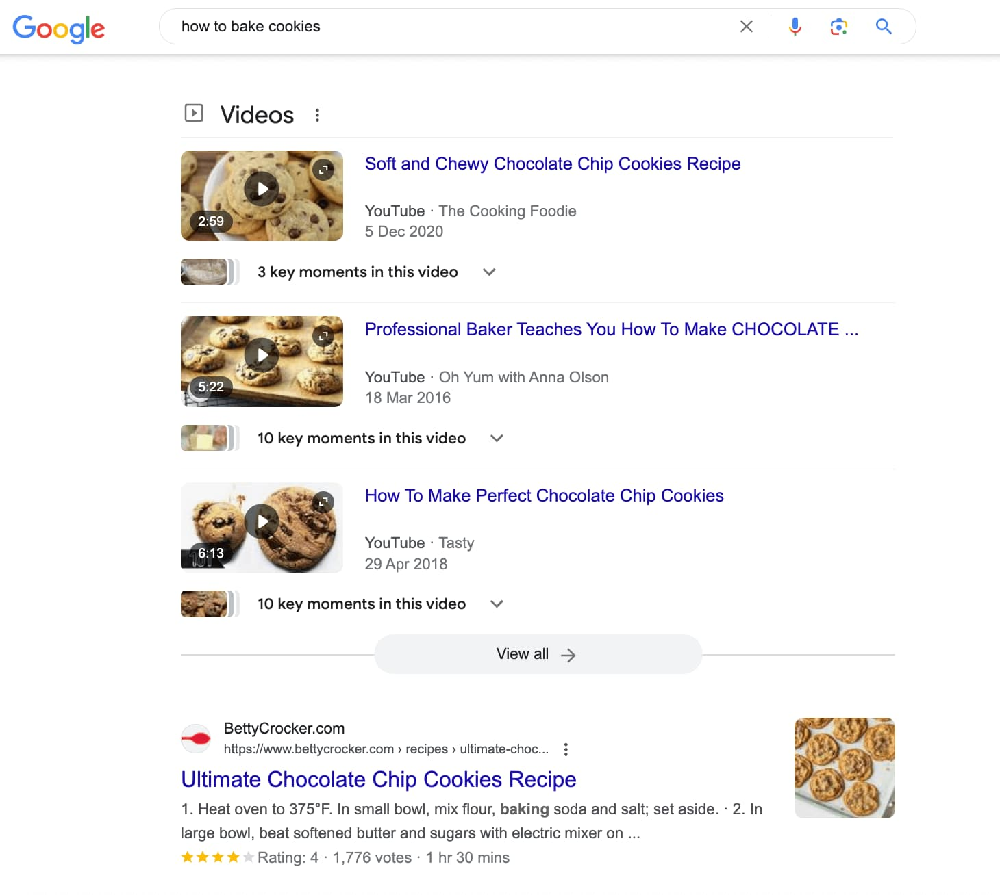
Leverage [SEO tools](https://sproutsocial.com/insights/free-seo-tools/) to conduct keyword research on Google and YouTube. Then use these insights to match search intent and optimize your videos to rank higher on both search engines.

### Increase brand awareness

YouTube is a great place for generating [brand awareness](https://sproutsocial.com/insights/brand-awareness/). According to Google,[**90% of people**](https://www.thinkwithgoogle.com/consumer-insights/consumer-trends/youtube-brand-discovery-data/)around the world use YouTube to explore new brands and products.

Publishing content like product reviews, how-to videos and explainers can help you spread the word about your business. You can even leverage video ads and influencer marketing to further boost awareness about your brand. Additionally, visual branding and brand voice consistency can enhance brand recall.

### Build trust and credibility

YouTube is the[most trusted social media platform](https://www.statista.com/statistics/1334441/most-trusted-social-networks-for-social-commerce-us)for finding and purchasing products. If you’re looking to build credibility around your brand, YouTube is a great place to start.

Enhance [brand trust](https://sproutsocial.com/insights/brand-trust/) by shedding light on how your product can solve problems. Create video testimonials, brand storytelling, visual tutorials, hands-on reviews and live demos. Partnering with creators in your niche can also help you build trust with potential customers.

### Drive sales and traffic

YouTube marketing can positively impact your bottom line by driving traffic to your site and boosting sales. In fact,87% of marketers say video has directly increased sales for their business.

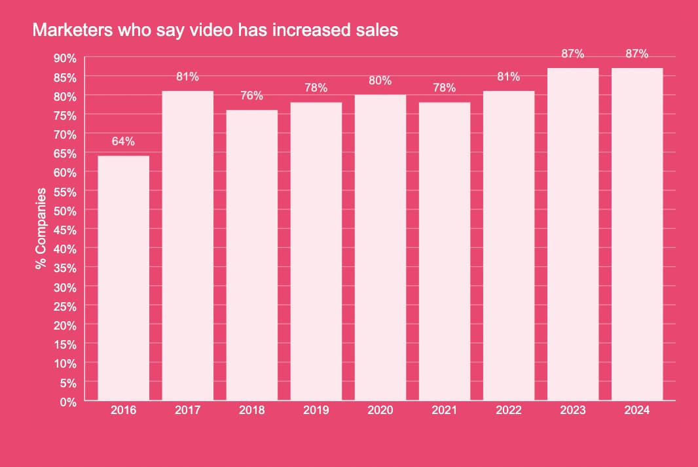
Source: [Wyzowl](https://www.wyzowl.com/video-marketing-statistics/)

YouTube offers plenty of useful shopping features such as cards, end screens, channel stores and tagged products. Marketers can leverage these tools to [increase their social media sales](https://sproutsocial.com/insights/increase-social-media-sales/) and drive more [YouTube ROI.](https://sproutsocial.com/insights/youtube-marketing-roi/)

### Generate leads

YouTube is also an effective lead generation tool. Along with using features like[**lead form ads**](https://support.google.com/displayvideo/answer/10295557), you can share webinar promos and online course trailers to encourage people to sign up.

Additionally, you can add links to landing pages and lead magnets in your video descriptions. Share your videos on other platforms like social media or websites to get more exposure.

### Make extra revenue

YouTube can boost your existing marketing strategy, but it can also become an additional revenue stream on its own for your business.

Channels that meet[YouTube Partner Program’s eligibility criteria](https://support.google.com/youtube/answer/72851?hl=en) can make money based on the number of views and engagement. Beyond running ads, one of the most effective ways for brands and creators to drive revenue directly from YouTube traffic is by implementing a [YouTube affiliate marketing strategy](https://sproutsocial.com/insights/youtube-affiliate-marketing/).

### YouTube marketing strategies and tips

YouTube marketing is competitive but highly rewarding if done right. Simply creating a channel and publishing videos is not enough. Brands need to strategically approach the process of planning, producing and distributing content on the platform to see tangible success.

Check out the video below to hear three ways to optimize your YouTube marketing strategy in three minutes (stay tuned for the surprise resource):

[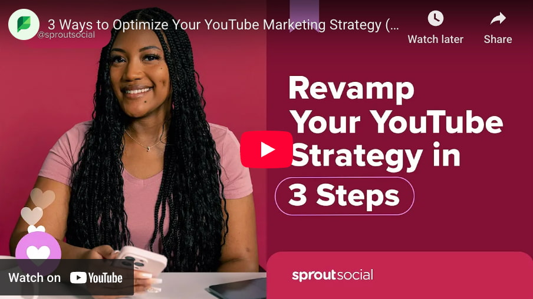](https://youtu.be/5nM6AznEPMc)

Below are some tried-and-true best practices to make the most of YouTube marketing and drive business growth using the platform.

### 1. Create and brand your YouTube channel

The first step to YouTube marketing is setting up your channel—your brand’s “home” on the platform. This is where you’ll publish videos, create playlists, respond to comments, view analytics and more. Follow this guide to[**create a YouTube channel for business**](https://sproutsocial.com/insights/how-to-create-a-youtube-channel/).

But simply creating a channel is not enough. You also need to brand it properly to establish consistency and generate brand awareness.

Customize these elements on your channel so it’s aligned with your branding style guide:

*   Profile picture
*   Banner image
*   Channel description
*   Social links
*   Channel trailer
*   Custom URL

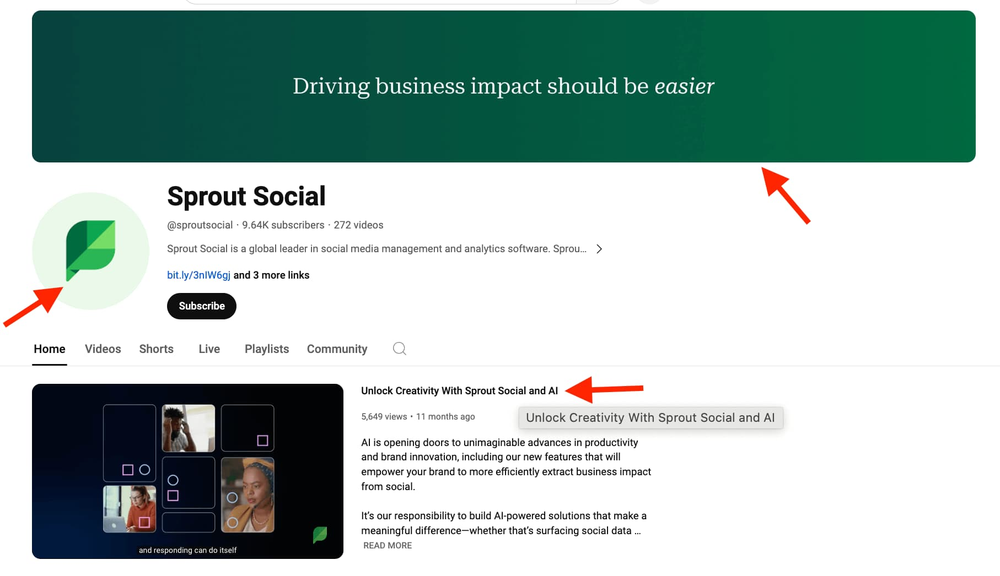
Additionally, be sure that your video thumbnails, titles and descriptions are all on-brand, even if you need to optimize them for SEO purposes. You can create a branded thumbnail template based on what works for you, and keep all future thumbnails consistent with that design.

Are you looking for a YouTube banner that doesn’t require additional design resources? Check out our[free social media templates tool](https://sproutsocial.com/templates/)with[free YouTube banners](https://sproutsocial.com/templates/free-youtube-banners)that you can download and add to your channel today!

### 2. Define your YouTube audience

Before you start creating content, know who your videos are for.

Not all potential customers are watching your videos on YouTube, so find out who makes up your[**target audience**](https://sproutsocial.com/insights/target-audience/)on the platform.

*   Are they males or females?
*   What’s their age range?
*   Where are they located?
*   What languages do they primarily speak?

Consider your audiences’ interests to create engaging videos.

*   What kind of content is your target audience currently watching?
*   Which channels are they subscribed to?
*   Why are they on YouTube in the first place?

Use a mix of[**social media market research**](https://sproutsocial.com/insights/social-media-market-research/), analytics and social listening to understand your audience. Look into their problems, questions and behaviors, especially in terms of online video consumption.

Build an[**audience persona**](https://sproutsocial.com/insights/social-media-personas/)to visualize your target audience and keep it in mind every time you create a video for your channel.

### 3. Conduct a competitive analysis

Identify channels your audience is watching and learn from their efforts. This is important for spotting trends, finding keywords and understanding audience interests.A [competitive analysis](https://sproutsocial.com/insights/social-media-competitive-analysis/) also helps you set realistic goals and benchmarks for video performance.

Here are a few steps to analyze your competitors on YouTube:

1.   Look into their subscriber count and follower growth to understand where you stand in comparison. Are they growing much faster than you?
2.   Go through their channel to understand the types of videos they’re publishing. Use this to inspire your own YouTube video marketing efforts.
3.   Check out their top videos and engagement rates to see how their viewers are engaging with their videos. Use this to understand the types of videos your audience might want to see.
4.   Manually go through their posting schedule to see how often you should post. Should you ramp up your posting frequency to keep up?
5.   Check out how they’re engaging with their audience. Are they responding to comments? If so, how are they responding? Are they creating contests, polls or other engagement opportunities?
6.   Look through their thumbnails to see what drives clicks. Check out their most viewed videos to see what stands out about the thumbnail.

Moreover, find content gaps your brand or channel can fill. There may be dozens of video opportunities your competitors are missing out on. Take advantage of those keywords or topics before they catch up.

### 4. Create quality YouTube video content

There are billions of videos on the platform and not everything is worth watching. Users have to sift through the noise daily to find meaningful content on the platform. This is also why YouTube’s smart algorithm favors some videos over others.

To stand out, you need to consistently create high-quality videos viewers love watching and engaging with. Check out these[**YouTube video ideas**](https://sproutsocial.com/insights/youtube-video-ideas/)to get your creative juices flowing.

Let’s go through a few essential steps that will guide your video creation process:

*   Research audience pain points and analyze trending keywords to get an idea of what videos people want to see. [Social listening](https://sproutsocial.com/insights/social-media-listening/) is a great way to identify topics and discussions that your target audience is engaging with.
*   Write a script for your video so you have a clear idea of what to include. Even if you’re not going to narrate it word-for-word, having a script helps you maintain a logical narrative that’s easy for viewers to follow.
*   Make sure to only include necessary info. Get rid of the fluff that could disengage viewers in the middle of a video.
*   Use [brand storytelling](https://sproutsocial.com/insights/brand-storytelling/) techniques to connect with your audience. Speak to your viewers clearly and directly so you can engage them.
*   Perfect your set so that it looks professional on camera. Get rid of unnecessary objects and clutter that could distract your viewers.
*   Invest in good quality equipment to aid your content creation. Don’t forget about editing and post-production. Include necessary graphics, sounds and music to make your videos more engaging.

For instance, Sprout’s YouTube videos feature a speaker in a clean and clutter-free setting. We shoot videos against a solid background with nothing but a laptop and a mug to serve as props. Moreover, the info we share is relevant, useful and straight-to-the-point, so people get exactly what they come for.

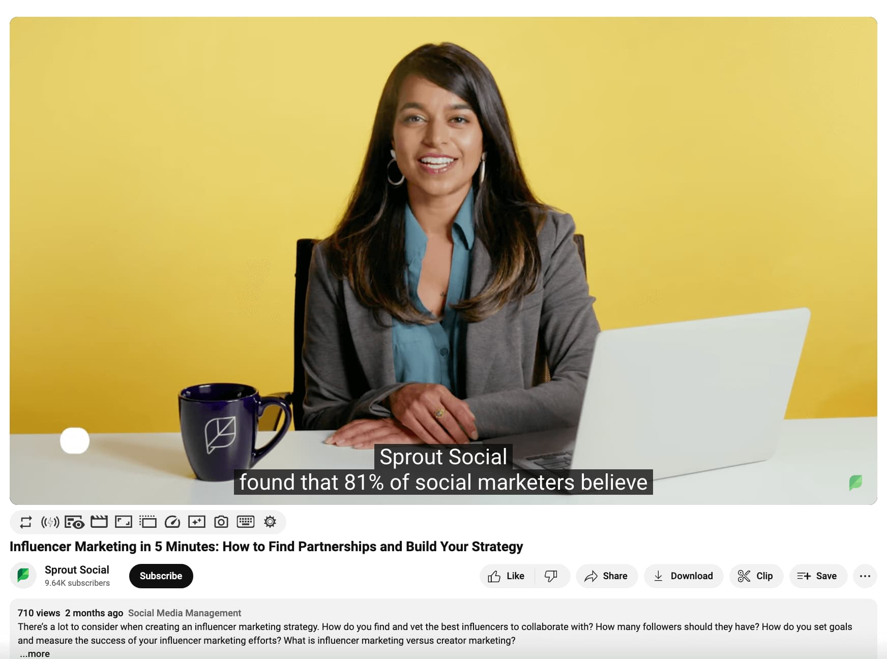
Source: [YouTube](https://www.youtube.com/watch?v=DCsSGLlkYTA&ab_channel=SproutSocial)

### 5. Experiment with YouTube Shorts and other features

With [short-form video](https://sproutsocial.com/insights/short-form-video/) content being all the rage, features like YouTube Shorts are a must-use for marketers. This feature supports quick content viewing and boasts vertical-style videos to appeal to mobile users. It’s a highly engaging format, reaching 70 billion views daily.

Use[**YouTube Shorts**](https://sproutsocial.com/insights/youtube-shorts/)to reach mobile-first audiences and drive more engagement for your brand. Shoot videos up to 60 seconds long in vertical format, and creatively use the built-in audio, text and filters to make your videos stand out.

YouTube recommends these short videos to users in their feeds. Plus, there’s a dedicated Shorts tab where you can scroll through an endless selection of Shorts.

So [creating Shorts](https://sproutsocial.com/insights/youtube-shorts-ideas/) is a great way to boost your reach and engagement on the platform.

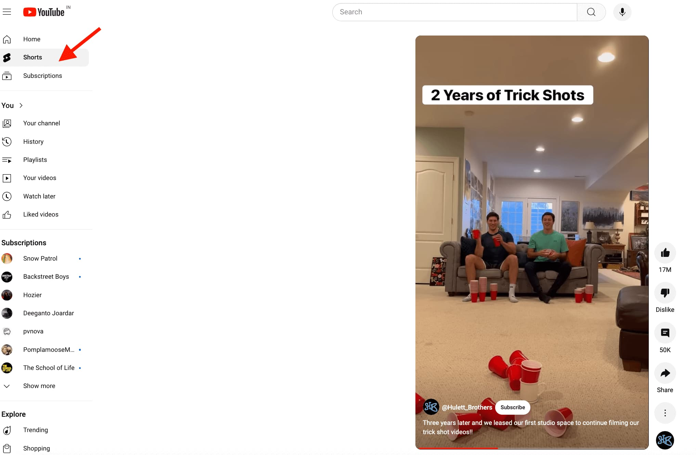
Source: [YouTube](https://www.youtube.com/shorts/LLo9u8GYUU0)

Also, leverage features like live streams, premieres and 360 videos to consistently deliver unique video experiences to your audience. YouTube regularly introduces new features to drive engagement on the platform. Stay on top of these updates so you’re always first in line to use them for your YouTube marketing.

### 6. Optimize your videos with SEO best practices

[**YouTube SEO**](https://sproutsocial.com/insights/youtube-seo/) is an often overlooked aspect of video marketing on the platform. But it’s crucial for your videos to show up at the right time. Otherwise, your videos will get lost in the sea of unwatched content and stay there for good.

Optimizing your videos starts at the beginning of the video creation process—during ideation. Conduct keyword research to find the right topics and angles for your videos. Then, optimize the following elements when publishing on YouTube to maximize visibility:

*   **Titles and descriptions:**Use primary and secondary keywords naturally. You can also translate your video titles in multiple languages to reach a global audience.
*   **Thumbnails:**Browse top videos and identify which thumbnails perform well for a particular keyword. Thumbnails with faces, expressions and text often stand out from others and drive more clicks.

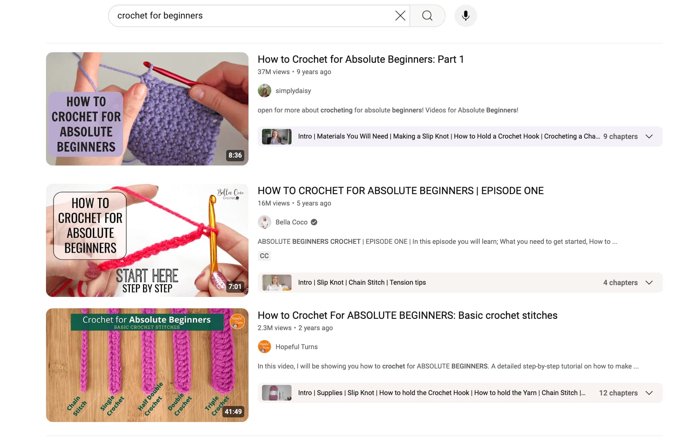
*   **Tags:**Add relevant words and phrases to tell both YouTube and viewers what your video is about. While tags are less important than they used to be, they can still impact your search rankings.

YouTube’s algorithm also favors videos that see more engagement.[**Promote your videos**](https://sproutsocial.com/insights/how-to-promote-your-youtube-channel/) on other platforms and forums to get more views and give them an initial push.

Also, link to your video from other videos on your channel using cards and end screens. Lastly, don’t hesitate to ask people for likes, comments and shares. You’ll be surprised at how effective proactively reaching out can be.

### 7. Actively engage with your audience

YouTube marketing is all about building an engaged subscriber community. And interacting directly with your audience is a great way to do that.

Respond timely (and nicely) to the[**comments on your videos**](https://sproutsocial.com/insights/youtube-comments/). Take audience questions seriously and answer them quickly to resolve any issues. See how Canva nails this aspect of its YouTube marketing.

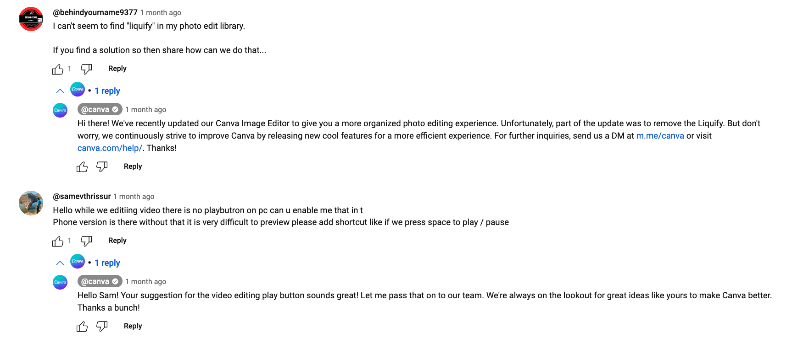
Source: [YouTube](https://www.youtube.com/watch?v=Y2f-FQdygFY&ab_channel=Canva)

Additionally, create interactive video content on YouTube to engage with your audience. For example, host live Q&A sessions and webinars, publish behind-the-scenes content and[**premiere videos**](https://support.google.com/youtube/answer/9080341?hl=en)to watch together with your audience in real-time.

### 8. Attract more YouTube subscribers to your channel

Subscribers are the bread and butter of all YouTube channels. The more subscribers you have, the more exclusive features you’ll be able to access. Plus, YouTube’s algorithm is likely to rank your videos higher if you have more subscribers.

Create problem-solving content that meets audience goals to[**get more YouTube subscribers**](https://sproutsocial.com/insights/how-to-get-youtube-subscribers/). Ask people what they want to see on your channel and keep your promises. People subscribe to channels they’re getting value from and want to see more of.

You could even jump in on the latest discussions and trends to create timely content. This is a great way to draw in people based on what they’re currently paying attention to.

Don’t forget to add a call-to-action to every video, encouraging viewers to subscribe. Sometimes, viewers may not even realize they’re not subscribers because they watch your videos religiously. Check out the following Evernote video where the speaker asks people to subscribe to “see more videos like this.”

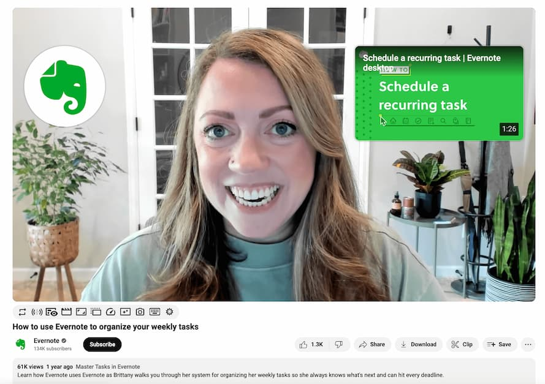

 Source: [YouTube](https://www.youtube.com/watch?v=YH_NbnJPct8&ab_channel=Evernote)
Make sure to optimize your videos for YouTube search so that they’re prominently visible in relevant search results. This will help you drive more clicks and viewers, which will then bring in subscribers.

Also, promote your videos outside of YouTube to widen your reach, and build relationships instead of pushing out one-way content.

Finally, stick to a consistent publishing schedule so subscribers know when and how often to expect your videos. Consistency is the key to YouTube marketing success. While creating and editing quality content takes time, make sure you have a posting schedule and stick to it.

Having a proper publishing schedule makes it easier for you to plan your content and schedule videos ahead of time and set expectations for your subscribers. YouTube channels with consistent publishing are generally favored by the algorithm as well.

### 9. Use YouTube ads to drive targeted traffic

Running[**YouTube ad campaigns**](https://sproutsocial.com/insights/youtube-ad-campaigns/)can help you reach a wider audience, drive traffic to your website and deliver personalized messaging to your target audience.

YouTube supports five types of ads:

*   **Bumper ads:**These are short, non-skippable ads that run before a video starts.
*   **In-stream ads:**These can be skippable or non-skippable, and run at certain points throughout your videos.
*   **In-feed ads:**These are video ads that show up in places of discovery such as the mobile homepage, search results page or next to related videos.
*   **Masthead ads:**These are ads that run prominently at the top of the YouTube Home feed.
*   **Outstream ads:**These are mobile-only ads that show up across various placements on Google video partners.

Be careful about your goals when running ads on the platform. YouTube ads are not meant to replace your organic strategy, but to boost it. Also, views acquired from ads don’t contribute towards monetization revenue.

### 10. Partner with YouTube influencers

There are millions of creators on the platform with thousands of loyal subscribers. Brands can partner with YouTubers in their niche to promote their products and services in creative ways.

Some popular types of [YouTube influencer marketing](https://sproutsocial.com/insights/youtube-influencer-marketing/) campaigns include:

*   Unboxing videos
*   Product reviews
*   How-tos and tutorials
*   Day-in-the-life vlogs
*   Contests and giveaway

Regardless of the type of campaign, the key to success is working with the right influencers. This is one of the trickiest parts as it involves a balancing act between reach and actual influence. It doesn’t matter if an influencer has millions of subscribers when only a handful of those subscribers will be interested in your product.

Make sure to find an influencer who can reach your target audience even if they have just a few thousand subscribers. Start by using the right industry keywords to run a search on [influencer marketing tools](https://sproutsocial.com/insights/influencer-marketing-tools/). Then narrow your search using relevant filters related to follower size, audience base, location and more.

You can also check out our more detailed guide on [how to find the right influencers](https://sproutsocial.com/insights/how-to-find-the-right-influencers/) to better understand the process.

Sometimes, influencers on YouTube may not even be individuals. You can even partner with a team of creators behind a specific channel. For instance, Netflix partnered with the Cut channel, which has 12 million subscribers, to promote its new film “Atlas.”

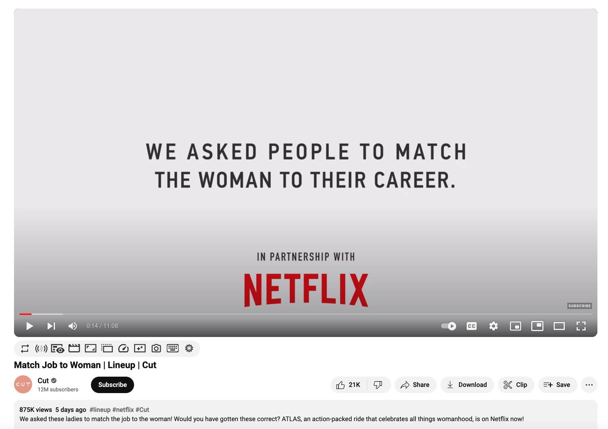
Source: [YouTube](https://www.youtube.com/watch?v=HKeRXD85nB8&ab_channel=Cut)

### 11. Monitor your YouTube analytics

Tracking[**YouTube analytics**](https://sproutsocial.com/insights/youtube-analytics/)helps you identify your best (and worst) performing videos. You can use it to understand what type of content resonates with your audience and which factors impact video performance.

You can access the platform’s built-in analytics in[**YouTube Creator Studio**](https://sproutsocial.com/insights/youtube-creator-studio/). Track metrics like views, subscribers, watch time, audience retention, traffic sources and devices. Also, analyze audience demographics and interests.

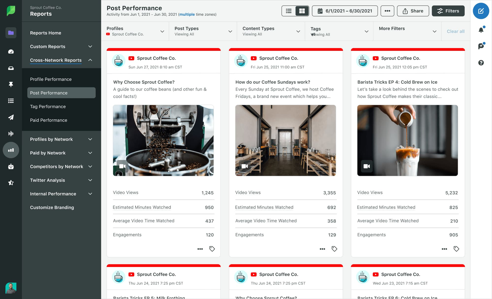
Knowing this helps succeed on the platform and create an effective long-term strategy. It also helps you focus resources where they matter.

YouTube marketing examples
--------------------------

### Vogue

**Subscriber count:**14.5 million

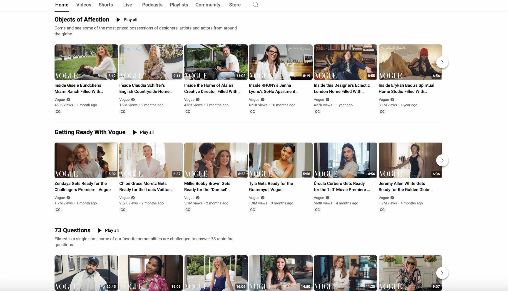
Source: [YouTube](https://www.youtube.com/@Vogue)

Vogue’s [YouTube content marketing](https://sproutsocial.com/insights/youtube-content-strategy/) consists of a diversified content mix and a consistent publishing schedule. The channel mixes things up with several video series. For instance, the “73 Question” format features famous personalities answering 73 questions in a single shot. Meanwhile, the “Getting Ready with Vogue” series showcases celebrities as they get ready for an event.

There’s even a “Beauty Secrets” series where celebrities share their beauty tutorials and tips. The intriguing format and diversified mix help to keep things interesting and engaging.

Moreover, most of the videos feature famous faces that are trending at the moment. This includes names such as Nicola Coughlan of the “Bridgerton” series and Felix from the boyband, Stray Kids. So the videos tend to attract viewers because people are currently paying attention to those names and faces.

### Architectural Digest

**Subscriber count:**6.71 million

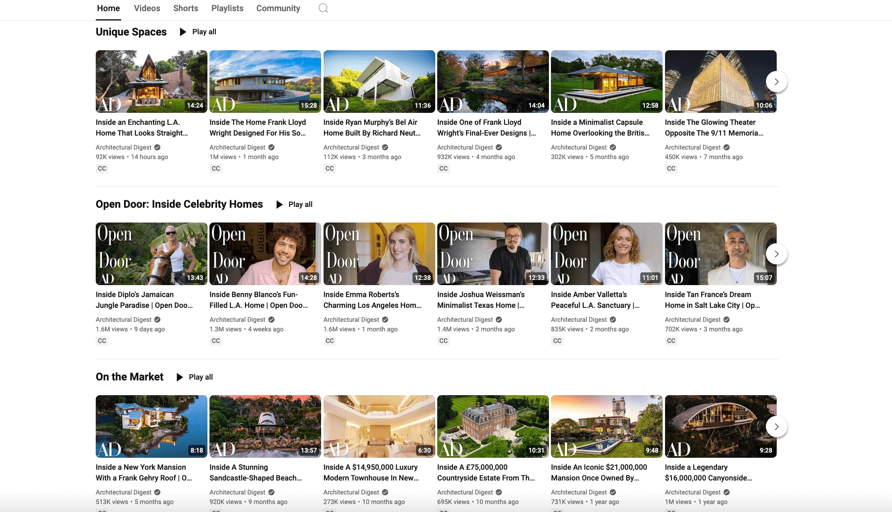
Source: [YouTube](https://www.youtube.com/@Archdigest)

Like Vogue, Architectural Digest maintains a diverse content mix to engage its audience. The channel categorizes its videos into several series to target various types of audiences.

For instance, the “Walking Tour” series features an architect giving you a tour of famous landmarks and cityscapes. “The Blueprint Show” gives you a detailed breakdown of iconic structures in pop culture. Think Disney castle interiors, Barbie dreamhouse evolutions and movie villain houses.

Meanwhile, the “On the Market” series focuses on exploring real estate listings that are currently available for sale. There’s even an “Open Door” series where celebrities take you on a tour inside their homes.

In other words, the channel is an abundant source of content for anyone who has a fascination for architecture. But it also includes content that more general audiences would want to view, such as those related to celebrities and pop culture.

### LEGO

**Subscriber count:**18.1 million

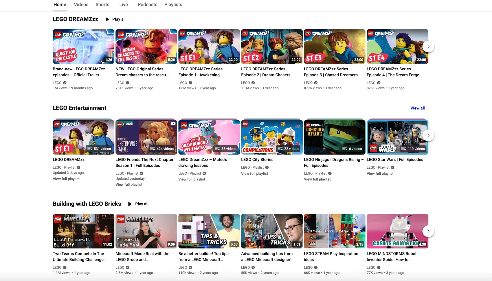
Source: [YouTube](https://www.youtube.com/@LEGO)

Storytelling, short videos and helpful tips—there’s a little something for everyone on the LEGO YouTube channel. The brand engages its audience with fun facts and entertaining tidbits shared through YouTube Shorts. It also produces episodic videos following a storyline that keeps viewers coming back for more.

The channel has a dedicated “Entertainment” section where you can watch videos such as City Stories and Ninjago. Meanwhile, you can find tips and tricks as well as robot inventor guides in the “Building with LEGO Bricks” section.

So the brand manages to keep fans entertained while sharing useful guides for serious builders.

YouTube marketing tools
-----------------------

### Sprout Social

**All-in-one social media management tool**

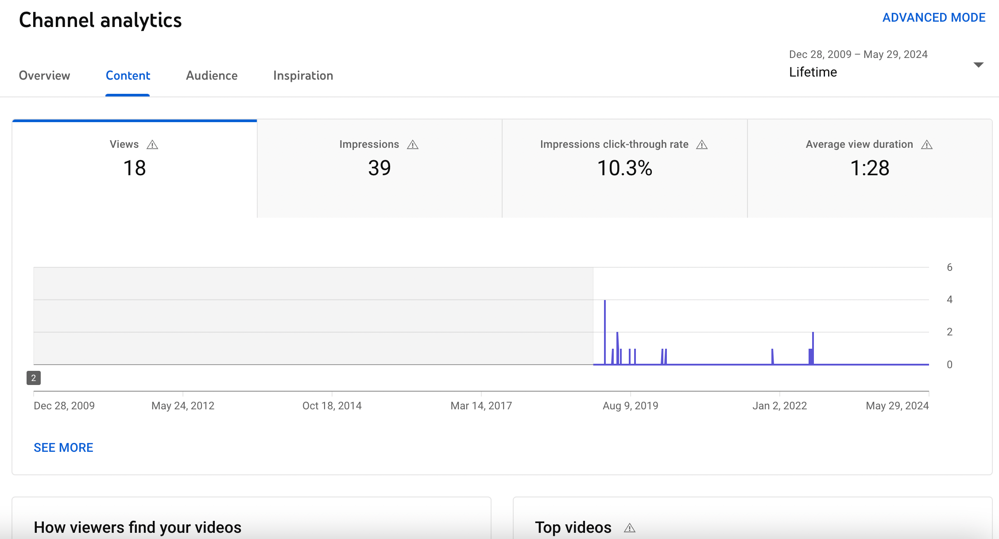
[Sprout Social](https://sproutsocial.com/) can boost your video strategy by providing you with a set of YouTube management tools. These include (but are not limited to):

*   Scheduling and publishing video content on your channel
*   Tracking video analytics and insights related to your audience
*   Practicing YouTube listening to find conversations in your niche
*   Managing YouTube comments within the Smart Inbox, next to your other social profiles

Sprout helps you optimize your publishing strategy with ViralPost®. This allows you to analyze your audience engagement and calculate the best time to post your videos.

You can also use the platform to identify influencers leading the conversations in your industry. Use these insights to discover the best influencers to partner with for your YouTube marketing strategy.

[Influencer Marketing by Sprout Social](https://sproutsocial.com/influencer-marketing/) (formerly Tagger) even enables you to manage every aspect of your YouTube influencer marketing. This lets you build your strategy based on industry trends and social content. It gives you access to an extensive influencer database that you can scour through to find the perfect influencers for your campaign. Plus, you can run, manage and measure your campaign in one place.

### Canva

**Channel and video branding tool**

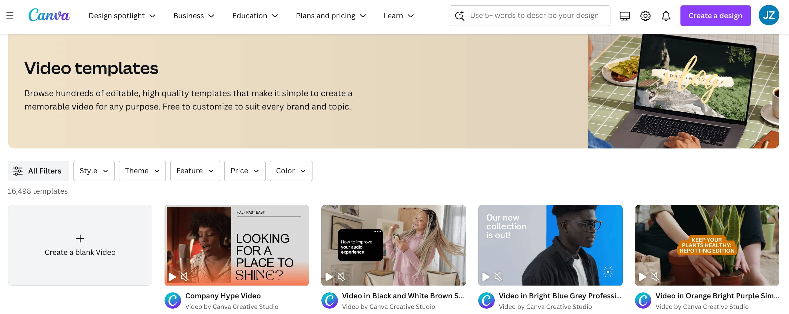
Source: [Canva](https://www.canva.com/templates/?category=tADs1de8MlY&doctype=TADUvCyAV_U)

[Canva](https://www.canva.com/) is an online design tool that lets you create branded visuals for your videos and channel. Use and edit templates for YouTube thumbnails, profile pictures and banners. You can also add creative intros and outros to your videos using the tool.

### VidIQ

**Video marketing and analytics tool**

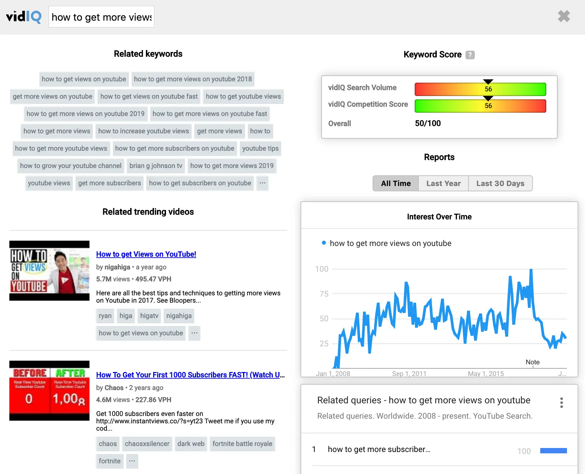
Source: [VidIQ](https://vidiq.com/features/keyword-tools/)

[VidIQ](https://vidiq.com/) is a specialized video marketing intelligence tool for YouTube creators. Its key features include daily video ideas, keyword research, optimization suggestions, competitor analysis and performance metrics. The tool also comes with a free Chrome extension for easy access.

### Ahrefs

**Keyword software tool**

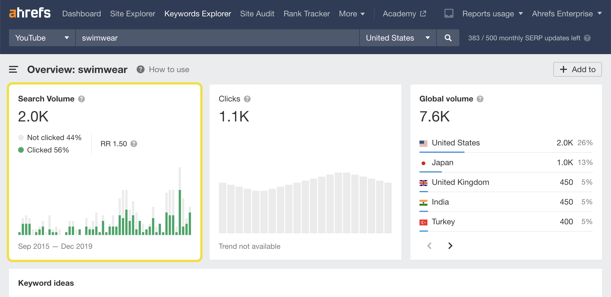
Source: [Ahrefs](https://ahrefs.com/youtube-keyword-tool)

[Ahrefs](https://ahrefs.com/) is a popular SEO tool used for keyword research and site analysis. The platform also offers a YouTube Keyword Tool that lets you find trending keywords in 170 countries. View detailed reports for each keyword showing search volume, clicks, questions and other data.

Grow your business with YouTube marketing
-----------------------------------------

YouTube is one of the best platforms for brands investing in [video marketing](https://sproutsocial.com/insights/video-marketing-strategy/). With billions of users and sky-high engagement rates, it offers marketers a golden opportunity to connect with their audiences.

Ready to dive into YouTube marketing? Don’t forget to keep track of your progress and pivot your strategy as needed.Use [YouTube analytics tools](https://sproutsocial.com/insights/youtube-analytics-tools/) to understand the impact of YouTube marketing on your business.
